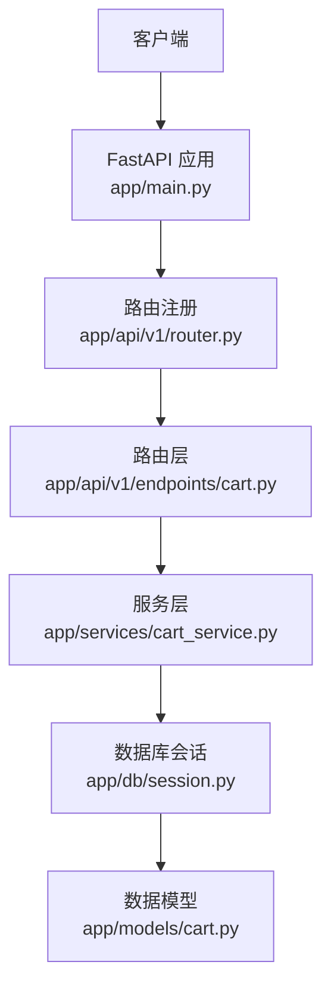
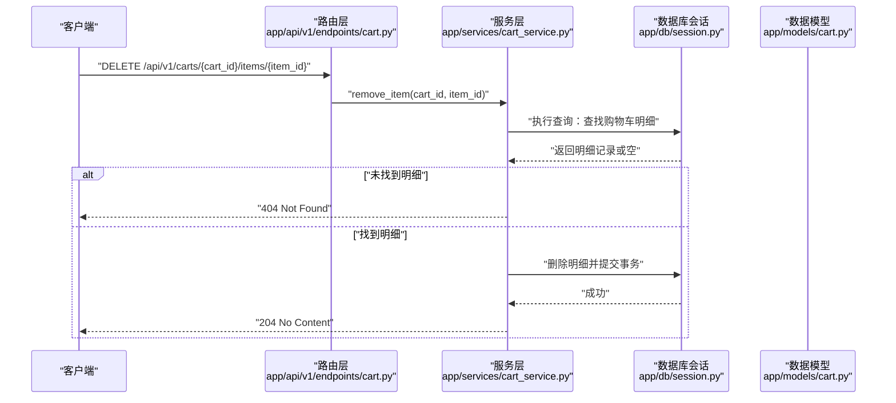
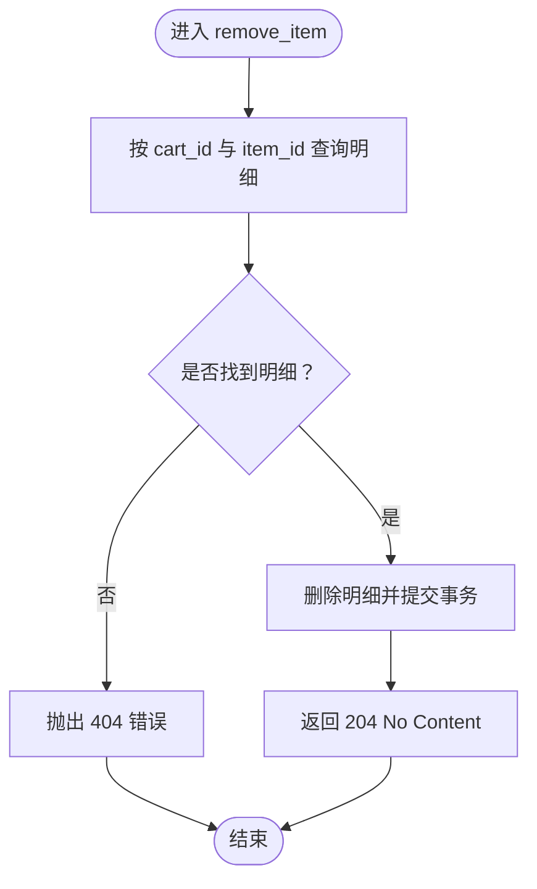
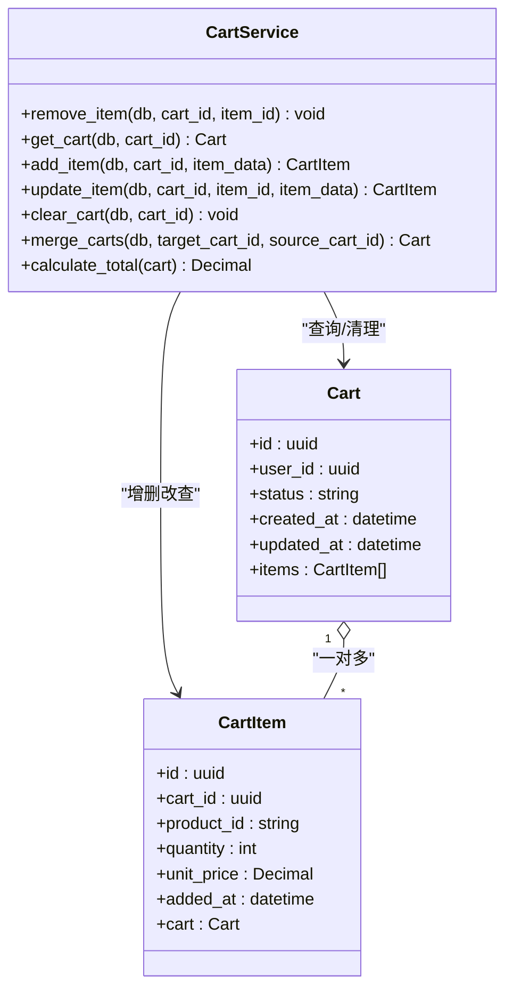
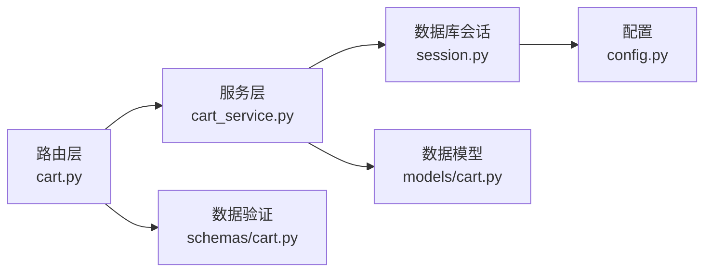

# 删除购物车商品

<cite>
**本文引用的文件**
- [app/api/v1/endpoints/cart.py](file://app/api/v1/endpoints/cart.py)
- [app/services/cart_service.py](file://app/services/cart_service.py)
- [app/models/cart.py](file://app/models/cart.py)
- [app/schemas/cart.py](file://app/schemas/cart.py)
- [app/api/v1/router.py](file://app/api/v1/router.py)
- [app/main.py](file://app/main.py)
- [app/db/session.py](file://app/db/session.py)
- [app/core/config.py](file://app/core/config.py)
</cite>

## 目录
1. [简介](#简介)
2. [项目结构](#项目结构)
3. [核心组件](#核心组件)
4. [架构总览](#架构总览)
5. [详细组件分析](#详细组件分析)
6. [依赖关系分析](#依赖关系分析)
7. [性能考量](#性能考量)
8. [故障排查指南](#故障排查指南)
9. [结论](#结论)

## 简介
本文件为 DELETE /api/v1/carts/{cart_id}/items/{item_id} 接口的详细API文档。该接口用于从指定购物车中移除某个商品项，通过路径参数 cart_id 和 item_id 精确定位目标。接口无请求体，成功时返回 204 No Content。实现流程为：路由层接收请求 -> 调用服务层 CartService.remove_item -> 服务层执行数据库查询与删除 -> 返回无内容状态码。

## 项目结构
- 路由层：app/api/v1/endpoints/cart.py 定义了 /api/v1/carts 下的所有购物车相关接口，其中包含删除单个商品项的路由。
- 服务层：app/services/cart_service.py 提供业务逻辑，包括 remove_item 的具体实现。
- 数据模型：app/models/cart.py 定义了购物车与购物车明细的实体及约束。
- 数据验证与响应模型：app/schemas/cart.py 定义了请求与响应的数据结构。
- 路由注册：app/api/v1/router.py 将购物车路由挂载到 /api/v1 前缀下。
- 应用入口：app/main.py 初始化 FastAPI 应用并注册 /api/v1 路由。
- 数据库会话：app/db/session.py 提供异步数据库会话工厂。
- 配置：app/core/config.py 提供数据库连接配置。

图表来源
- [app/main.py](file://app/main.py#L1-L17)
- [app/api/v1/router.py](file://app/api/v1/router.py#L1-L6)
- [app/api/v1/endpoints/cart.py](file://app/api/v1/endpoints/cart.py#L1-L65)
- [app/services/cart_service.py](file://app/services/cart_service.py#L1-L125)
- [app/db/session.py](file://app/db/session.py#L1-L24)
- [app/models/cart.py](file://app/models/cart.py#L1-L37)

章节来源
- [app/main.py](file://app/main.py#L1-L17)
- [app/api/v1/router.py](file://app/api/v1/router.py#L1-L6)
- [app/api/v1/endpoints/cart.py](file://app/api/v1/endpoints/cart.py#L1-L65)
- [app/services/cart_service.py](file://app/services/cart_service.py#L1-L125)
- [app/db/session.py](file://app/db/session.py#L1-L24)
- [app/models/cart.py](file://app/models/cart.py#L1-L37)
- [app/schemas/cart.py](file://app/schemas/cart.py#L1-L46)
- [app/core/config.py](file://app/core/config.py#L1-L18)

## 核心组件
- 路由层（删除接口）
  - 路由定义：DELETE /api/v1/carts/{cart_id}/items/{item_id}
  - 参数：cart_id、item_id（均为 UUID）
  - 处理函数：remove_item
  - 返回：204 No Content
  - 参考路径：[app/api/v1/endpoints/cart.py](file://app/api/v1/endpoints/cart.py#L45-L49)

- 服务层（删除逻辑）
  - 方法：CartService.remove_item
  - 逻辑：根据 cart_id 与 item_id 查询购物车明细，若不存在则抛出 404；否则删除该项并提交事务
  - 参考路径：[app/services/cart_service.py](file://app/services/cart_service.py#L77-L88)

- 数据模型（约束与关系）
  - CartItem 表：包含 cart_id、product_id、quantity、unit_price 等字段
  - 约束：(cart_id, product_id) 唯一约束；quantity > 0
  - 参考路径：[app/models/cart.py](file://app/models/cart.py#L22-L37)

- 数据验证与响应模型
  - CartItemResponse：用于响应购物车明细项
  - 参考路径：[app/schemas/cart.py](file://app/schemas/cart.py#L17-L26)

- 路由注册与应用入口
  - 应用入口：app/main.py 注册 /api/v1 路由
  - 路由注册：app/api/v1/router.py 包含购物车路由
  - 参考路径：[app/main.py](file://app/main.py#L1-L17)，[app/api/v1/router.py](file://app/api/v1/router.py#L1-L6)

章节来源
- [app/api/v1/endpoints/cart.py](file://app/api/v1/endpoints/cart.py#L45-L49)
- [app/services/cart_service.py](file://app/services/cart_service.py#L77-L88)
- [app/models/cart.py](file://app/models/cart.py#L22-L37)
- [app/schemas/cart.py](file://app/schemas/cart.py#L17-L26)
- [app/api/v1/router.py](file://app/api/v1/router.py#L1-L6)
- [app/main.py](file://app/main.py#L1-L17)

## 架构总览
下面的序列图展示了删除购物车商品的完整调用链路，从客户端发起请求到服务层执行删除并返回状态码。

图表来源
- [app/api/v1/endpoints/cart.py](file://app/api/v1/endpoints/cart.py#L45-L49)
- [app/services/cart_service.py](file://app/services/cart_service.py#L77-L88)
- [app/db/session.py](file://app/db/session.py#L1-L24)
- [app/models/cart.py](file://app/models/cart.py#L22-L37)

## 详细组件分析

### 删除接口定义与行为
- 接口路径：DELETE /api/v1/carts/{cart_id}/items/{item_id}
- 请求参数：
  - 路径参数：
    - cart_id：UUID，定位购物车
    - item_id：UUID，定位购物车中的某一项
  - 请求体：无
- 响应：
  - 204 No Content：删除成功
  - 404 Not Found：当购物车或购物车明细不存在时
- 实现参考：
  - 路由层函数：[app/api/v1/endpoints/cart.py](file://app/api/v1/endpoints/cart.py#L45-L49)
  - 服务层方法：[app/services/cart_service.py](file://app/services/cart_service.py#L77-L88)

章节来源
- [app/api/v1/endpoints/cart.py](file://app/api/v1/endpoints/cart.py#L45-L49)
- [app/services/cart_service.py](file://app/services/cart_service.py#L77-L88)

### 删除流程与错误处理
- 流程步骤：
  1) 路由层接收请求并解析路径参数
  2) 调用服务层 CartService.remove_item
  3) 服务层根据 cart_id 与 item_id 查询明细
  4) 若未找到明细，抛出 404 错误
  5) 若找到明细，删除该项并提交事务
  6) 返回 204 No Content
- 错误场景：
  - 404 Not Found：当 item_id 对应的明细不存在时
  - 422 Unprocessable Entity：当 cart_id 或 item_id 不是合法 UUID 格式时（由 FastAPI 自动校验并返回）
- 参考实现：
  - 404 触发位置：[app/services/cart_service.py](file://app/services/cart_service.py#L83-L84)
  - 422 触发位置：路径参数类型为 uuid.UUID，非法格式将被 FastAPI 校验拦截
  - 删除执行位置：[app/services/cart_service.py](file://app/services/cart_service.py#L86-L87)

图表来源
- [app/services/cart_service.py](file://app/services/cart_service.py#L77-L88)

章节来源
- [app/services/cart_service.py](file://app/services/cart_service.py#L77-L88)

### 数据模型与约束
- CartItem 表关键字段与约束：
  - cart_id：外键关联 carts.id，删除策略为级联删除
  - product_id：商品标识
  - quantity：购买数量（>0）
  - unit_price：单价
  - 唯一约束：(cart_id, product_id)
- 参考路径：[app/models/cart.py](file://app/models/cart.py#L22-L37)

章节来源
- [app/models/cart.py](file://app/models/cart.py#L22-L37)

### 类关系与依赖

图表来源
- [app/models/cart.py](file://app/models/cart.py#L10-L37)
- [app/services/cart_service.py](file://app/services/cart_service.py#L12-L125)

章节来源
- [app/models/cart.py](file://app/models/cart.py#L10-L37)
- [app/services/cart_service.py](file://app/services/cart_service.py#L12-L125)

## 依赖关系分析
- 组件耦合与职责分离：
  - 路由层仅负责参数解析与调用服务层，不直接操作数据库
  - 服务层封装业务逻辑，统一处理异常与事务
  - 数据模型定义数据结构与约束，确保数据一致性
- 外部依赖：
  - FastAPI：提供路由与自动参数校验（UUID 格式校验）
  - SQLAlchemy Async：提供异步数据库访问
  - Pydantic：提供数据验证与序列化
- 参考路径：
  - [app/api/v1/endpoints/cart.py](file://app/api/v1/endpoints/cart.py#L1-L65)
  - [app/services/cart_service.py](file://app/services/cart_service.py#L1-L125)
  - [app/db/session.py](file://app/db/session.py#L1-L24)
  - [app/core/config.py](file://app/core/config.py#L1-L18)

图表来源
- [app/api/v1/endpoints/cart.py](file://app/api/v1/endpoints/cart.py#L1-L65)
- [app/services/cart_service.py](file://app/services/cart_service.py#L1-L125)
- [app/db/session.py](file://app/db/session.py#L1-L24)
- [app/core/config.py](file://app/core/config.py#L1-L18)
- [app/models/cart.py](file://app/models/cart.py#L1-L37)
- [app/schemas/cart.py](file://app/schemas/cart.py#L1-L46)

章节来源
- [app/api/v1/endpoints/cart.py](file://app/api/v1/endpoints/cart.py#L1-L65)
- [app/services/cart_service.py](file://app/services/cart_service.py#L1-L125)
- [app/db/session.py](file://app/db/session.py#L1-L24)
- [app/core/config.py](file://app/core/config.py#L1-L18)
- [app/models/cart.py](file://app/models/cart.py#L1-L37)
- [app/schemas/cart.py](file://app/schemas/cart.py#L1-L46)

## 性能考量
- 删除操作复杂度：O(1)，仅删除一条明细记录
- 事务与锁：删除在单条记录上进行，开销小；如需批量删除可考虑服务层优化
- 建议：
  - 客户端在删除后主动刷新本地购物车视图，减少不必要的重复查询
  - 服务层可考虑在删除前先做存在性检查以减少无效事务提交

[本节为通用性能建议，不直接分析具体文件]

## 故障排查指南
- 404 Not Found
  - 触发条件：item_id 对应的购物车明细不存在
  - 可能原因：传入的 item_id 与 cart_id 不匹配，或该明细已被删除
  - 参考实现：[app/services/cart_service.py](file://app/services/cart_service.py#L83-L84)
- 422 Unprocessable Entity
  - 触发条件：cart_id 或 item_id 不是合法 UUID 格式
  - 可能原因：URL 中参数格式错误
  - 参考实现：FastAPI 路由参数类型为 uuid.UUID，非法格式将被自动校验拦截
- 204 No Content
  - 触发条件：删除成功
  - 参考实现：[app/api/v1/endpoints/cart.py](file://app/api/v1/endpoints/cart.py#L45-L49)，[app/services/cart_service.py](file://app/services/cart_service.py#L86-L87)

章节来源
- [app/services/cart_service.py](file://app/services/cart_service.py#L77-L88)
- [app/api/v1/endpoints/cart.py](file://app/api/v1/endpoints/cart.py#L45-L49)

## 结论
DELETE /api/v1/carts/{cart_id}/items/{item_id} 接口通过明确的路径参数定位目标商品项，采用服务层统一处理业务逻辑与异常，保证了接口的简洁与一致性。客户端应在删除成功后及时更新本地 UI，同时提醒用户删除操作不可逆，避免误删造成损失。