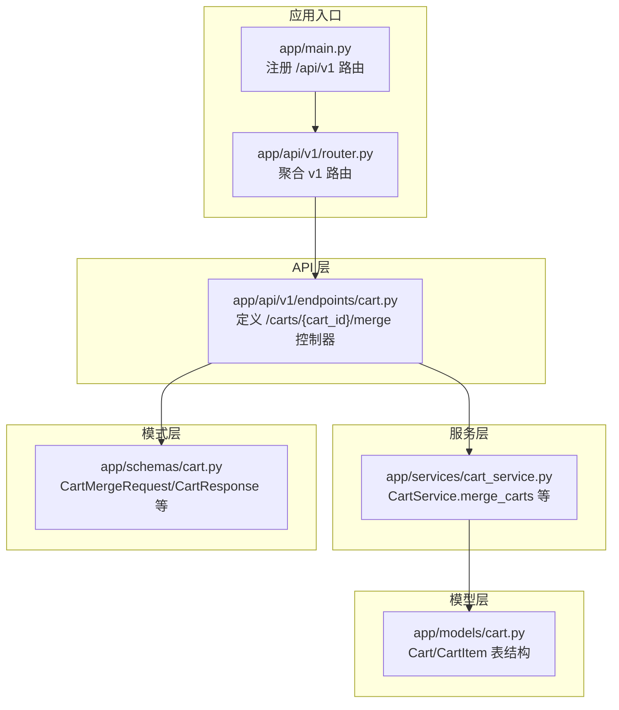
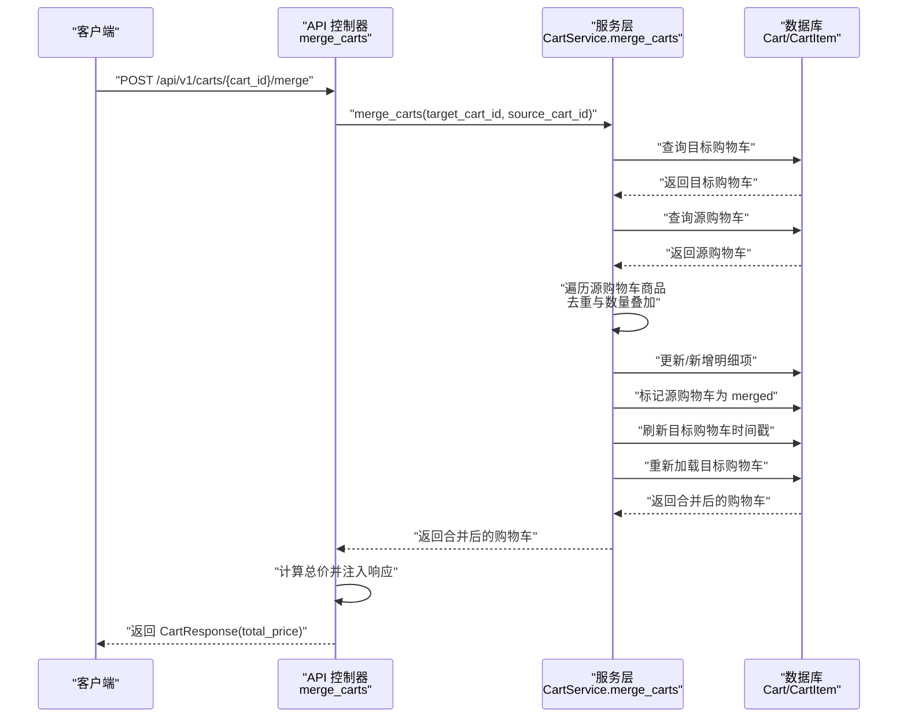
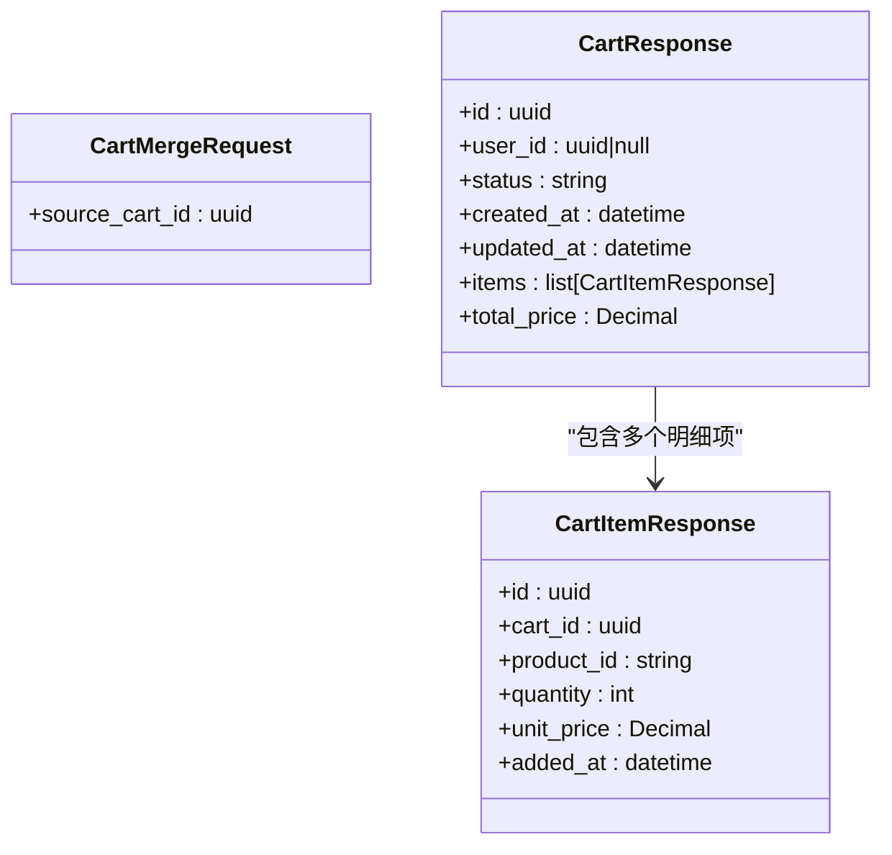
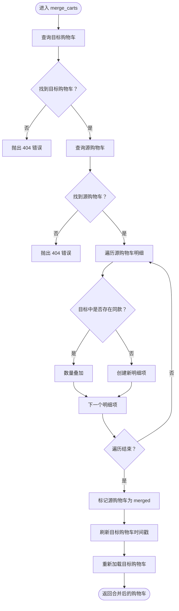
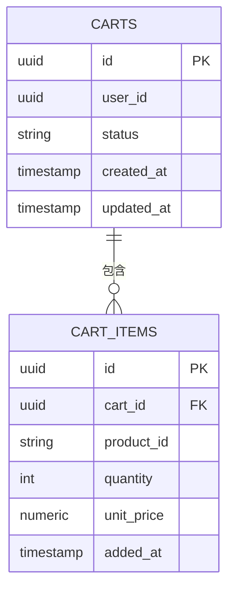
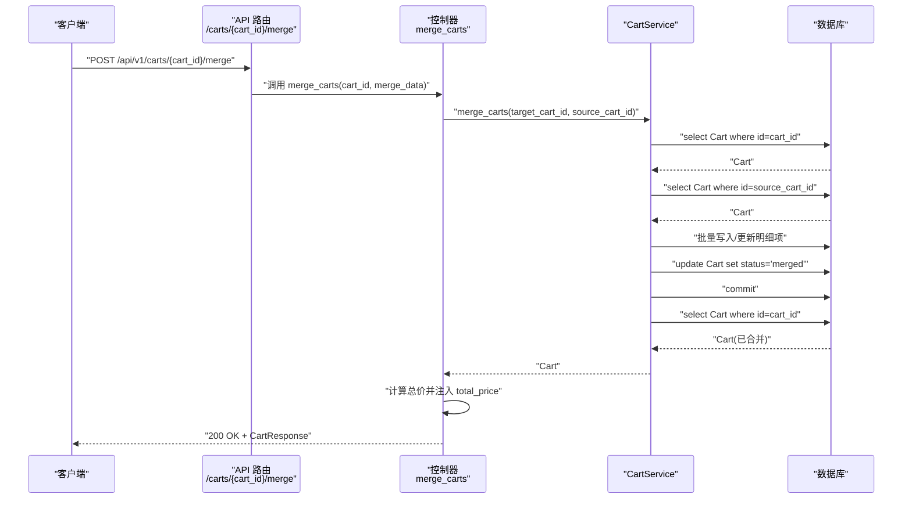
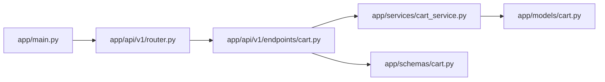

# 合并购物车

<cite>
**本文引用的文件**
- [app/api/v1/endpoints/cart.py](file://app/api/v1/endpoints/cart.py)
- [app/schemas/cart.py](file://app/schemas/cart.py)
- [app/services/cart_service.py](file://app/services/cart_service.py)
- [app/models/cart.py](file://app/models/cart.py)
- [app/api/v1/router.py](file://app/api/v1/router.py)
- [app/main.py](file://app/main.py)
- [README.md](file://README.md)
</cite>

## 目录
1. [简介](#简介)
2. [项目结构](#项目结构)
3. [核心组件](#核心组件)
4. [架构总览](#架构总览)
5. [详细组件分析](#详细组件分析)
6. [依赖关系分析](#依赖关系分析)
7. [性能考量](#性能考量)
8. [故障排查指南](#故障排查指南)
9. [结论](#结论)
10. [附录](#附录)

## 简介
本接口用于在用户登录后，将匿名购物车（source_cart_id）合并到其个人购物车（cart_id）中，实现购物车数据的迁移与整合。服务层通过 CartService.merge_carts 实现合并逻辑，对相同商品进行去重与数量叠加，并返回合并后的购物车及最新总价。该接口在用户认证流程中扮演关键角色，确保用户从匿名态过渡到登录态时购物车数据不丢失且保持一致。

- 接口路径：POST /api/v1/carts/{cart_id}/merge
- 请求体模型：CartMergeRequest（仅包含 source_cart_id）
- 响应模型：CartResponse（包含 items 列表与 total_price）

**章节来源**
- [app/api/v1/endpoints/cart.py](file://app/api/v1/endpoints/cart.py#L57-L64)
- [app/schemas/cart.py](file://app/schemas/cart.py#L44-L46)
- [README.md](file://README.md#L108-L118)

## 项目结构
- API 层：定义路由与控制器，负责接收请求、调用服务层并返回响应。
- 服务层：封装业务逻辑，处理购物车合并、查询、增删改等操作。
- 模型层：定义数据库表结构与关系，保证数据一致性。
- 模式层（Pydantic）：定义请求/响应模型，提供数据校验与序列化。
- 路由注册：在应用入口统一挂载 v1 路由。

**图表来源**
- [app/main.py](file://app/main.py#L1-L16)
- [app/api/v1/router.py](file://app/api/v1/router.py#L1-L6)
- [app/api/v1/endpoints/cart.py](file://app/api/v1/endpoints/cart.py#L1-L64)
- [app/services/cart_service.py](file://app/services/cart_service.py#L1-L125)
- [app/schemas/cart.py](file://app/schemas/cart.py#L1-L46)
- [app/models/cart.py](file://app/models/cart.py#L1-L37)

**章节来源**
- [app/main.py](file://app/main.py#L1-L16)
- [app/api/v1/router.py](file://app/api/v1/router.py#L1-L6)
- [README.md](file://README.md#L43-L60)

## 核心组件
- 控制器：在 cart.py 中定义 merge_carts 路由处理器，接收 cart_id 和 CartMergeRequest，调用服务层并返回 CartResponse。
- 服务层：CartService.merge_carts 实现合并逻辑，包括两购物车存在性校验、同商品去重与数量叠加、源购物车状态更新与目标购物车时间戳刷新。
- 模式层：CartMergeRequest 仅包含 source_cart_id；CartResponse 包含 id、user_id、status、created_at、updated_at、items、total_price。
- 模型层：Cart 与 CartItem 定义表结构与约束，确保数据完整性与一致性。

**章节来源**
- [app/api/v1/endpoints/cart.py](file://app/api/v1/endpoints/cart.py#L57-L64)
- [app/services/cart_service.py](file://app/services/cart_service.py#L97-L121)
- [app/schemas/cart.py](file://app/schemas/cart.py#L28-L46)
- [app/models/cart.py](file://app/models/cart.py#L10-L37)

## 架构总览
下图展示了从客户端发起合并请求到返回最终结果的完整链路。

**图表来源**
- [app/api/v1/endpoints/cart.py](file://app/api/v1/endpoints/cart.py#L57-L64)
- [app/services/cart_service.py](file://app/services/cart_service.py#L97-L121)

## 详细组件分析

### 接口定义与行为
- 路径与方法：POST /api/v1/carts/{cart_id}/merge
- 参数：
  - 路径参数：cart_id（目标购物车 ID）
  - 请求体：CartMergeRequest（source_cart_id）
- 返回：CartResponse（包含 items 列表与 total_price）
- 业务语义：将 source_cart_id 对应的匿名购物车合并到 cart_id 对应的用户购物车中，相同商品数量叠加，不同商品直接迁移。

**章节来源**
- [app/api/v1/endpoints/cart.py](file://app/api/v1/endpoints/cart.py#L57-L64)
- [app/schemas/cart.py](file://app/schemas/cart.py#L44-L46)
- [README.md](file://README.md#L108-L118)

### 请求体与响应体模型
- 请求体模型 CartMergeRequest
  - 字段：source_cart_id（UUID）
- 响应体模型 CartResponse
  - 字段：id、user_id、status、created_at、updated_at、items（列表）、total_price（Decimal）
  - 注：接口在返回前会计算并注入 total_price

**图表来源**
- [app/schemas/cart.py](file://app/schemas/cart.py#L17-L46)

**章节来源**
- [app/schemas/cart.py](file://app/schemas/cart.py#L17-L46)

### 服务层合并逻辑
- 步骤概览：
  1. 校验目标购物车存在性（不存在则抛出 404）
  2. 校验源购物车存在性（不存在则抛出 404）
  3. 遍历源购物车明细：
     - 若目标购物车已有相同 product_id，则数量叠加
     - 否则新建明细项并关联目标购物车
  4. 将源购物车状态标记为 merged
  5. 刷新目标购物车 updated_at
  6. 重新加载目标购物车并返回
- 性能特征：
  - 时间复杂度：O(n)，n 为源购物车商品数
  - 数据库写入：按需新增或更新，批量提交一次

**图表来源**
- [app/services/cart_service.py](file://app/services/cart_service.py#L97-L121)

**章节来源**
- [app/services/cart_service.py](file://app/services/cart_service.py#L97-L121)

### 数据模型与约束
- Cart 表
  - 字段：id、user_id（可空，带索引）、status、created_at、updated_at
  - 约束：状态字段默认 active
- CartItem 表
  - 字段：id、cart_id（外键）、product_id、quantity（>0）、unit_price、added_at
  - 约束：(cart_id, product_id) 联合唯一；quantity 正数校验
- 关系：Cart 与 CartItem 一对多，级联删除

**图表来源**
- [app/models/cart.py](file://app/models/cart.py#L10-L37)

**章节来源**
- [app/models/cart.py](file://app/models/cart.py#L10-L37)

### API 调用序列（代码级）

**图表来源**
- [app/api/v1/endpoints/cart.py](file://app/api/v1/endpoints/cart.py#L57-L64)
- [app/services/cart_service.py](file://app/services/cart_service.py#L97-L121)

## 依赖关系分析
- 控制器依赖服务层：merge_carts 路由处理器依赖 CartService.merge_carts。
- 服务层依赖模型层：查询与写入 Cart/CartItem。
- 模式层被控制器与服务层共同使用：请求体与响应体模型。
- 路由注册：应用入口在 /api/v1 下挂载 v1 路由，v1 再 include cart 路由。

**图表来源**
- [app/main.py](file://app/main.py#L1-L16)
- [app/api/v1/router.py](file://app/api/v1/router.py#L1-L6)
- [app/api/v1/endpoints/cart.py](file://app/api/v1/endpoints/cart.py#L1-L64)
- [app/services/cart_service.py](file://app/services/cart_service.py#L1-L125)
- [app/schemas/cart.py](file://app/schemas/cart.py#L1-L46)
- [app/models/cart.py](file://app/models/cart.py#L1-L37)

**章节来源**
- [app/main.py](file://app/main.py#L1-L16)
- [app/api/v1/router.py](file://app/api/v1/router.py#L1-L6)
- [app/api/v1/endpoints/cart.py](file://app/api/v1/endpoints/cart.py#L1-L64)
- [app/services/cart_service.py](file://app/services/cart_service.py#L1-L125)
- [app/schemas/cart.py](file://app/schemas/cart.py#L1-L46)
- [app/models/cart.py](file://app/models/cart.py#L1-L37)

## 性能考量
- 合并算法为 O(n) 遍历，n 为源购物车商品数；若源购物车较大，建议在业务侧控制单次合并规模。
- 数据库写入采用批量提交，减少事务次数；注意在高并发场景下的锁竞争与死锁风险。
- 响应前计算总价，避免前端重复计算；总价为 Decimal，避免浮点误差。
- 目标购物车 updated_at 刷新有助于缓存失效与一致性维护。

[本节为通用性能建议，无需特定文件来源]

## 故障排查指南
- 404 未找到
  - 场景：目标购物车或源购物车不存在
  - 触发位置：服务层在查询购物车时未找到对应记录
  - 处理建议：确认 cart_id 与 source_cart_id 是否正确；检查数据库中是否存在对应记录
- 409 冲突（概念性说明）
  - 场景：目标购物车并非用户购物车（例如目标购物车属于其他用户），或业务上不允许合并
  - 当前实现：未显式抛出 409；若业务需要，请在服务层增加校验并在控制器捕获
- 其他常见问题
  - 数据库连接异常：检查 .env 中数据库连接配置
  - 权限与鉴权：确保在网关或中间件中完成用户身份校验后再调用合并接口
  - 并发冲突：高并发下可能出现脏读或锁等待，建议引入幂等策略或重试机制

**章节来源**
- [app/services/cart_service.py](file://app/services/cart_service.py#L14-L22)
- [app/api/v1/endpoints/cart.py](file://app/api/v1/endpoints/cart.py#L57-L64)

## 结论
POST /api/v1/carts/{cart_id}/merge 接口通过 CartService.merge_carts 实现了匿名购物车到用户购物车的数据迁移，具备明确的去重与数量叠加规则，并在返回时计算最新总价。该接口在用户认证流程中起到承上启下的关键作用，保障用户从匿名态到登录态的购物体验连续性。建议在生产环境中结合鉴权、幂等与并发控制策略，确保接口的稳定性与一致性。

[本节为总结性内容，无需特定文件来源]

## 附录

### 请求示例
- 请求头
  - Content-Type: application/json
- 请求体（JSON）
  - source_cart_id: "目标购物车的 UUID"
- 示例（不含具体值）
  - {
    "source_cart_id": "目标购物车的 UUID"
  }

**章节来源**
- [app/schemas/cart.py](file://app/schemas/cart.py#L44-L46)
- [app/api/v1/endpoints/cart.py](file://app/api/v1/endpoints/cart.py#L57-L64)

### 响应示例
- 状态码：200 OK
- 响应体（JSON）
  - id、user_id、status、created_at、updated_at、items（数组）、total_price（数值字符串/十进制）

**章节来源**
- [app/api/v1/endpoints/cart.py](file://app/api/v1/endpoints/cart.py#L57-L64)
- [app/schemas/cart.py](file://app/schemas/cart.py#L32-L42)

### 错误场景说明
- 404 未找到
  - 目标购物车不存在：服务层抛出 404
  - 源购物车不存在：服务层抛出 404
- 409 冲突（建议）
  - 目标购物车不属于当前用户或业务禁止合并时，建议在服务层增加校验并返回 409
- 422 校验错误
  - 请求体字段缺失或类型不符（如 source_cart_id 非 UUID），由 Pydantic 校验返回 422

**章节来源**
- [app/services/cart_service.py](file://app/services/cart_service.py#L14-L22)
- [app/schemas/cart.py](file://app/schemas/cart.py#L44-L46)

### 数据库与表结构参考
- carts 表：主键 id、user_id（可空）、status、created_at、updated_at
- cart_items 表：主键 id、cart_id（外键）、product_id、quantity（>0）、unit_price、added_at
- 约束：(cart_id, product_id) 联合唯一；quantity 正数校验

**章节来源**
- [app/models/cart.py](file://app/models/cart.py#L10-L37)