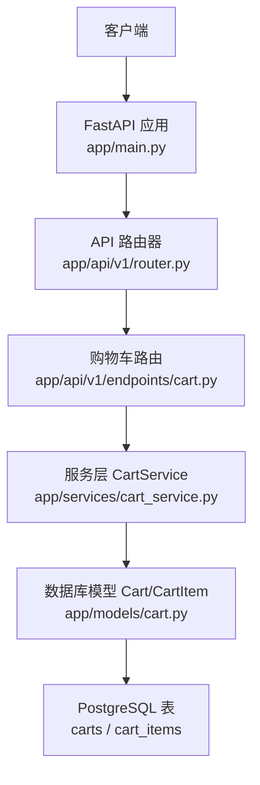
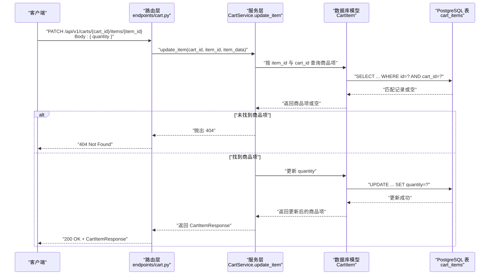
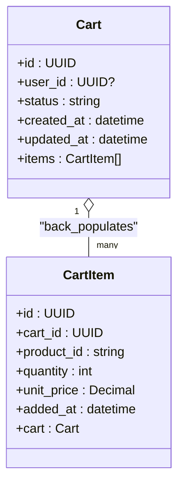
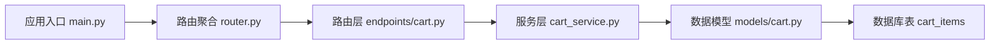

# 更新购物车商品数量

<cite>
**本文引用的文件**
- [app/api/v1/endpoints/cart.py](file://app/api/v1/endpoints/cart.py)
- [app/schemas/cart.py](file://app/schemas/cart.py)
- [app/services/cart_service.py](file://app/services/cart_service.py)
- [app/models/cart.py](file://app/models/cart.py)
- [app/api/v1/router.py](file://app/api/v1/router.py)
- [app/main.py](file://app/main.py)
- [alembic/versions/286c2307065b_create_cart_tables.py](file://alembic/versions/286c2307065b_create_cart_tables.py)
</cite>

## 目录
1. [简介](#简介)
2. [项目结构](#项目结构)
3. [核心组件](#核心组件)
4. [架构总览](#架构总览)
5. [详细组件分析](#详细组件分析)
6. [依赖关系分析](#依赖关系分析)
7. [性能与幂等性](#性能与幂等性)
8. [故障排查与错误处理](#故障排查与错误处理)
9. [结论](#结论)
10. [附录：请求与响应示例](#附录请求与响应示例)

## 简介
本文件为 PATCH /api/v1/carts/{cart_id}/items/{item_id} 接口的详细API文档。该接口用于更新购物车中某商品项的数量。路径参数 cart_id 与 item_id 分别标识目标购物车与目标商品项；请求体使用 CartItemUpdate 模型，仅包含 quantity 字段，且必须大于0。服务层通过 CartService.update_item 执行更新，成功时返回更新后的 CartItemResponse。文档同时说明404（购物车或商品项不存在）、422（数量非法）等错误场景，并强调该接口的幂等性设计与对负数/零数量的拒绝策略。

## 项目结构
- 路由层：在 app/api/v1/endpoints/cart.py 中定义路由与控制器方法 update_item
- 模型与Schema：在 app/schemas/cart.py 中定义 CartItemUpdate、CartItemResponse 等模型
- 服务层：在 app/services/cart_service.py 中实现业务逻辑 update_item
- 数据模型：在 app/models/cart.py 中定义 Cart、CartItem 及数据库约束
- 应用入口：在 app/main.py 中注册路由前缀 /api/v1
- 路由聚合：在 app/api/v1/router.py 中包含 cart 路由

图表来源
- [app/main.py](file://app/main.py#L1-L17)
- [app/api/v1/router.py](file://app/api/v1/router.py#L1-L6)
- [app/api/v1/endpoints/cart.py](file://app/api/v1/endpoints/cart.py#L1-L65)
- [app/services/cart_service.py](file://app/services/cart_service.py#L1-L125)
- [app/models/cart.py](file://app/models/cart.py#L1-L37)
- [alembic/versions/286c2307065b_create_cart_tables.py](file://alembic/versions/286c2307065b_create_cart_tables.py#L1-L55)

章节来源
- [app/main.py](file://app/main.py#L1-L17)
- [app/api/v1/router.py](file://app/api/v1/router.py#L1-L6)

## 核心组件
- 路由与控制器：在 app/api/v1/endpoints/cart.py 中定义 PATCH /carts/{cart_id}/items/{item_id}，调用服务层 CartService.update_item 并返回 CartItemResponse
- 数据模型与Schema：
  - CartItemUpdate：仅 quantity 字段，且必须大于0
  - CartItemResponse：包含 id、cart_id、product_id、quantity、unit_price、added_at
- 服务层：CartService.update_item 根据 item_id 与 cart_id 查询商品项，若不存在则抛出404；否则更新数量并返回
- 数据模型与约束：CartItem.quantity 必须大于0，数据库层也通过 CheckConstraint 进行约束

章节来源
- [app/api/v1/endpoints/cart.py](file://app/api/v1/endpoints/cart.py#L38-L42)
- [app/schemas/cart.py](file://app/schemas/cart.py#L13-L15)
- [app/schemas/cart.py](file://app/schemas/cart.py#L17-L26)
- [app/services/cart_service.py](file://app/services/cart_service.py#L63-L75)
- [app/models/cart.py](file://app/models/cart.py#L22-L37)
- [alembic/versions/286c2307065b_create_cart_tables.py](file://alembic/versions/286c2307065b_create_cart_tables.py#L33-L44)

## 架构总览
该接口遵循典型的三层架构：路由层负责接收请求、参数校验与响应封装；服务层负责业务逻辑；数据层负责持久化。请求从 FastAPI 入口进入，经路由层转发至服务层，再访问数据库模型与表。

图表来源
- [app/api/v1/endpoints/cart.py](file://app/api/v1/endpoints/cart.py#L38-L42)
- [app/services/cart_service.py](file://app/services/cart_service.py#L63-L75)
- [app/models/cart.py](file://app/models/cart.py#L22-L37)
- [alembic/versions/286c2307065b_create_cart_tables.py](file://alembic/versions/286c2307065b_create_cart_tables.py#L33-L44)

## 详细组件分析

### 路由与控制器：update_item
- 路径：PATCH /api/v1/carts/{cart_id}/items/{item_id}
- 参数：
  - 路径参数：cart_id、item_id（UUID）
  - 请求体：CartItemUpdate（仅 quantity，必须大于0）
- 返回：CartItemResponse
- 处理流程：
  - 调用服务层 CartService.update_item
  - 将返回的商品项转换为 CartItemResponse 并返回

章节来源
- [app/api/v1/endpoints/cart.py](file://app/api/v1/endpoints/cart.py#L38-L42)
- [app/schemas/cart.py](file://app/schemas/cart.py#L13-L15)
- [app/schemas/cart.py](file://app/schemas/cart.py#L17-L26)

### 服务层：CartService.update_item
- 查询条件：按 item_id 与 cart_id 精确匹配
- 404 场景：未找到匹配的商品项
- 更新逻辑：直接设置 quantity 为请求体中的值
- 返回：更新后的 CartItem 对象

章节来源
- [app/services/cart_service.py](file://app/services/cart_service.py#L63-L75)

### 数据模型与约束：CartItem
- 字段与约束：
  - quantity 必须大于0（数据库层 CheckConstraint）
  - (cart_id, product_id) 联合唯一（UniqueConstraint）
- 该约束确保：
  - 不会出现负数或零数量
  - 同一购物车下同一商品只有一条明细

章节来源
- [app/models/cart.py](file://app/models/cart.py#L22-L37)
- [alembic/versions/286c2307065b_create_cart_tables.py](file://alembic/versions/286c2307065b_create_cart_tables.py#L33-L44)

### 数据模型类图

图表来源
- [app/models/cart.py](file://app/models/cart.py#L10-L37)

## 依赖关系分析
- 路由层依赖服务层：endpoints/cart.py 调用 CartService.update_item
- 服务层依赖数据模型：CartService 使用 SQLAlchemy ORM 操作 CartItem
- 数据模型依赖数据库约束：CartItem 的 CheckConstraint 保证 quantity > 0
- 应用入口依赖路由聚合：main.py 注册 /api/v1 前缀，router.py 包含 cart 路由

图表来源
- [app/api/v1/endpoints/cart.py](file://app/api/v1/endpoints/cart.py#L1-L65)
- [app/services/cart_service.py](file://app/services/cart_service.py#L1-L125)
- [app/models/cart.py](file://app/models/cart.py#L1-L37)
- [app/api/v1/router.py](file://app/api/v1/router.py#L1-L6)
- [app/main.py](file://app/main.py#L1-L17)

章节来源
- [app/api/v1/endpoints/cart.py](file://app/api/v1/endpoints/cart.py#L1-L65)
- [app/services/cart_service.py](file://app/services/cart_service.py#L1-L125)
- [app/models/cart.py](file://app/models/cart.py#L1-L37)
- [app/api/v1/router.py](file://app/api/v1/router.py#L1-L6)
- [app/main.py](file://app/main.py#L1-L17)

## 性能与幂等性
- 幂等性设计：
  - 该接口采用 PATCH 更新数量，且请求体仅包含 quantity 字段。当传入相同 quantity 值时，数据库不会产生新的变更，因此该接口具备幂等性。
  - 服务层直接设置 quantity，不进行累加或合并，进一步保证幂等。
- 性能考量：
  - 单条记录更新，数据库层面仅执行一次 UPDATE，开销极低。
  - 服务层未引入额外的复杂逻辑，保持简单高效。
- 数据一致性：
  - 数据库层通过 CheckConstraint 确保 quantity > 0，避免脏数据进入系统。

章节来源
- [app/services/cart_service.py](file://app/services/cart_service.py#L63-L75)
- [app/models/cart.py](file://app/models/cart.py#L22-L37)
- [alembic/versions/286c2307065b_create_cart_tables.py](file://alembic/versions/286c2307065b_create_cart_tables.py#L33-L44)

## 故障排查与错误处理
- 404 未找到：
  - 当 item_id 与 cart_id 组合无法匹配到任何商品项时，服务层抛出 404
  - 可能原因：cart_id 或 item_id 错误；商品项已被移除
- 422 参数校验失败：
  - 当请求体 quantity 不满足 schema 约束（例如小于等于0）时，FastAPI 将返回 422
  - 可能原因：请求体未包含 quantity；quantity 非法（≤0）
- 数据库约束导致的异常：
  - 若数据库层因 CheckConstraint 导致插入/更新失败，通常会映射为 422 或 500，具体取决于异常类型与中间件配置
- 建议排查步骤：
  - 确认 cart_id 与 item_id 是否正确
  - 确认 quantity 是否为正整数
  - 确认商品项仍存在于购物车中（未被移除）

章节来源
- [app/services/cart_service.py](file://app/services/cart_service.py#L63-L75)
- [app/schemas/cart.py](file://app/schemas/cart.py#L13-L15)
- [app/models/cart.py](file://app/models/cart.py#L22-L37)
- [alembic/versions/286c2307065b_create_cart_tables.py](file://alembic/versions/286c2307065b_create_cart_tables.py#L33-L44)

## 结论
PATCH /api/v1/carts/{cart_id}/items/{item_id} 接口通过简洁的请求体与明确的约束，实现了对购物车商品数量的幂等更新。其错误处理与数据库约束共同保障了数据一致性与用户体验。建议在客户端侧始终传入合法的正整数 quantity，避免不必要的 422 错误。

## 附录：请求与响应示例

- 请求示例（将数量改为3）
  - 方法与路径：PATCH /api/v1/carts/{cart_id}/items/{item_id}
  - 请求体：{ "quantity": 3 }
  - 成功响应：200 OK，返回 CartItemResponse（包含 id、cart_id、product_id、quantity、unit_price、added_at）

- 错误场景
  - 404 未找到：当 item_id 与 cart_id 组合不存在时
  - 422 参数校验失败：当 quantity 非法（例如 ≤0）时

- 幂等性说明
  - 重复发送相同的 quantity 值不会改变数据库状态，接口幂等

章节来源
- [app/api/v1/endpoints/cart.py](file://app/api/v1/endpoints/cart.py#L38-L42)
- [app/schemas/cart.py](file://app/schemas/cart.py#L13-L15)
- [app/schemas/cart.py](file://app/schemas/cart.py#L17-L26)
- [app/services/cart_service.py](file://app/services/cart_service.py#L63-L75)