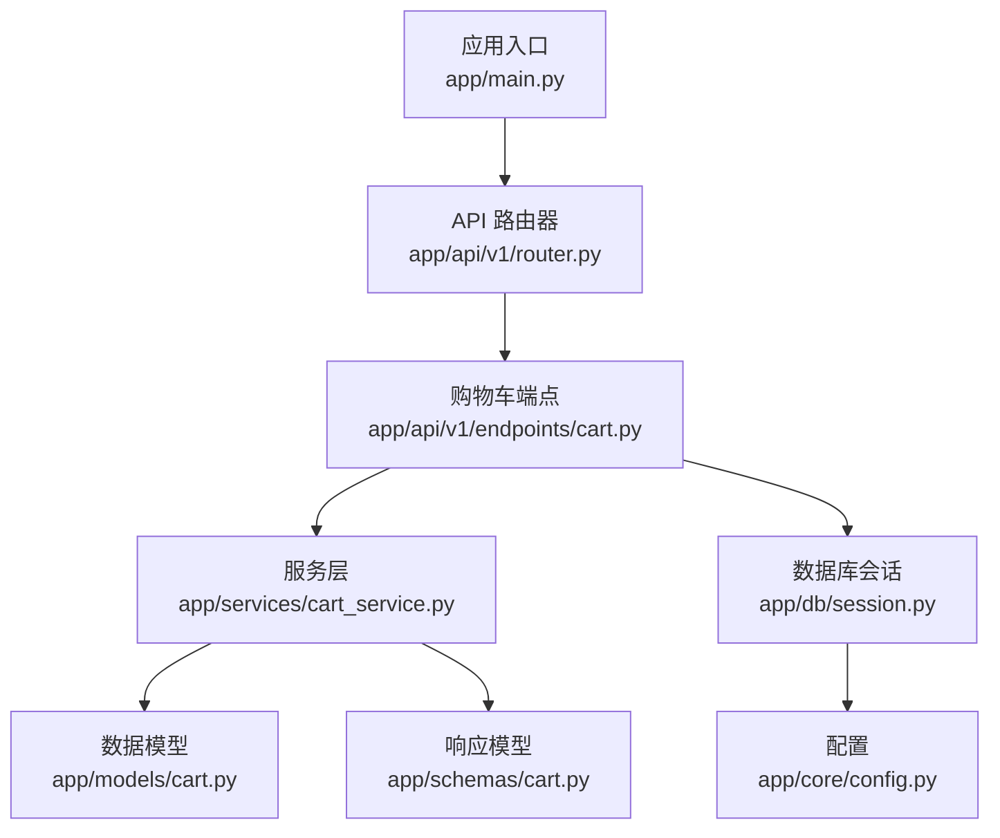
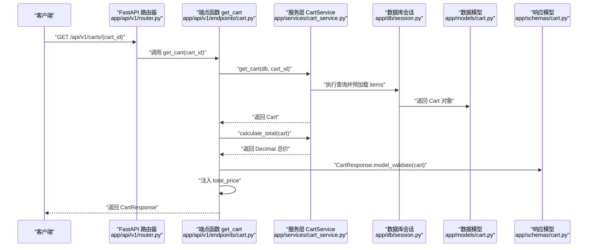
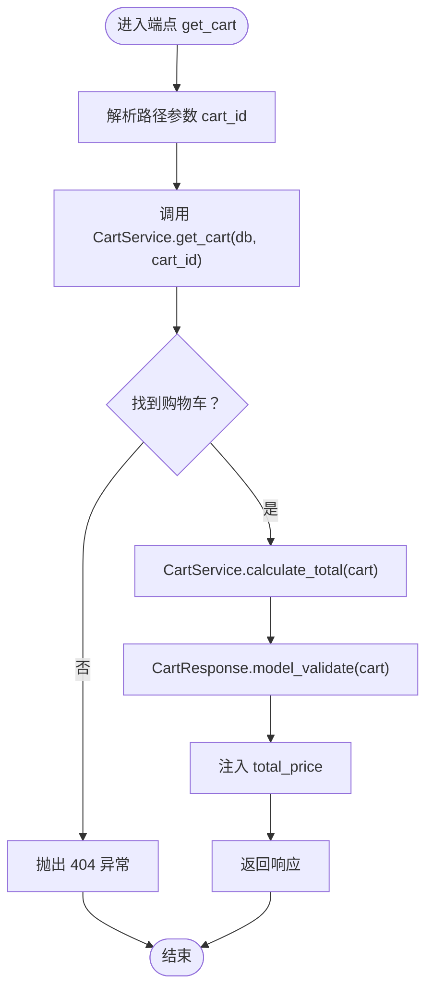
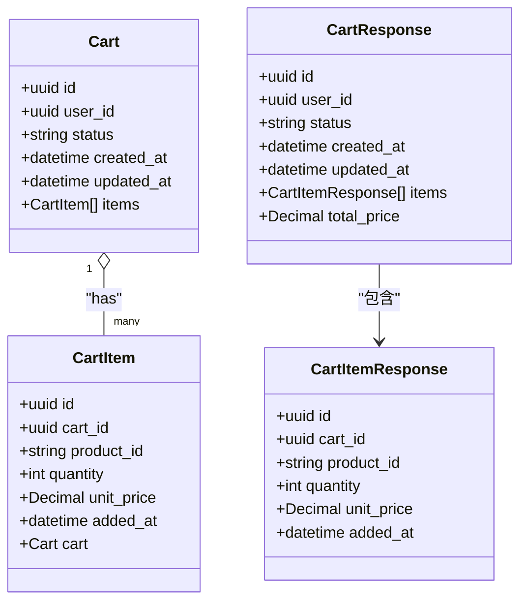
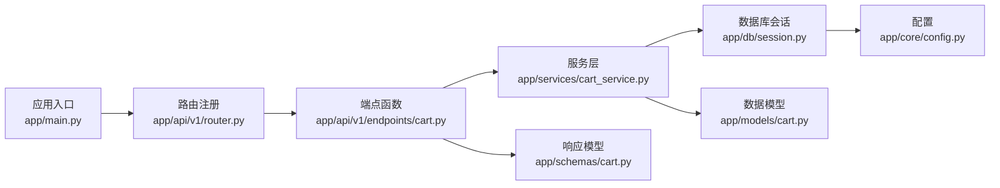

# 查询购物车

<cite>
**本文引用的文件**
- [app/api/v1/endpoints/cart.py](file://app/api/v1/endpoints/cart.py)
- [app/schemas/cart.py](file://app/schemas/cart.py)
- [app/services/cart_service.py](file://app/services/cart_service.py)
- [app/models/cart.py](file://app/models/cart.py)
- [app/api/v1/router.py](file://app/api/v1/router.py)
- [app/main.py](file://app/main.py)
- [app/db/session.py](file://app/db/session.py)
- [app/core/config.py](file://app/core/config.py)
</cite>

## 目录
1. [简介](#简介)
2. [项目结构](#项目结构)
3. [核心组件](#核心组件)
4. [架构总览](#架构总览)
5. [详细组件分析](#详细组件分析)
6. [依赖关系分析](#依赖关系分析)
7. [性能考虑](#性能考虑)
8. [故障排查指南](#故障排查指南)
9. [结论](#结论)

## 简介
本接口用于根据购物车ID查询购物车详情，返回包含所有商品项以及计算后总价的响应对象。接口为异步实现，路径参数 cart_id 为UUID格式。服务层通过 CartService.get_cart 获取购物车及其明细，再由 CartService.calculate_total 计算总价并注入响应中。响应模型定义位于 app/schemas/cart.py 中的 CartResponse。

## 项目结构
- 路由与端点：app/api/v1/endpoints/cart.py 定义了 GET /api/v1/carts/{cart_id} 等购物车相关接口。
- 响应模型：app/schemas/cart.py 定义了 CartResponse、CartItemResponse 等数据模型。
- 服务层：app/services/cart_service.py 实现购物车业务逻辑，包括查询、计算总价等。
- 数据模型：app/models/cart.py 定义了数据库实体 Cart 与 CartItem。
- 路由注册：app/api/v1/router.py 将购物车端点挂载到 /api/v1。
- 应用入口：app/main.py 启动 FastAPI 并注册 /api/v1 路由。
- 数据库会话：app/db/session.py 提供异步数据库会话依赖。
- 配置：app/core/config.py 提供数据库连接字符串。

图表来源
- [app/main.py](file://app/main.py#L1-L17)
- [app/api/v1/router.py](file://app/api/v1/router.py#L1-L6)
- [app/api/v1/endpoints/cart.py](file://app/api/v1/endpoints/cart.py#L1-L65)
- [app/services/cart_service.py](file://app/services/cart_service.py#L1-L125)
- [app/models/cart.py](file://app/models/cart.py#L1-L37)
- [app/schemas/cart.py](file://app/schemas/cart.py#L1-L46)
- [app/db/session.py](file://app/db/session.py#L1-L24)
- [app/core/config.py](file://app/core/config.py#L1-L18)

章节来源
- [app/main.py](file://app/main.py#L1-L17)
- [app/api/v1/router.py](file://app/api/v1/router.py#L1-L6)
- [app/api/v1/endpoints/cart.py](file://app/api/v1/endpoints/cart.py#L1-L65)
- [app/schemas/cart.py](file://app/schemas/cart.py#L1-L46)
- [app/services/cart_service.py](file://app/services/cart_service.py#L1-L125)
- [app/models/cart.py](file://app/models/cart.py#L1-L37)
- [app/db/session.py](file://app/db/session.py#L1-L24)
- [app/core/config.py](file://app/core/config.py#L1-L18)

## 核心组件
- 接口定义与控制流
  - 端点函数：app/api/v1/endpoints/cart.py 中的 get_cart
  - 依赖注入：使用 AsyncSession 依赖 get_db
  - 服务调用：CartService.get_cart 获取购物车，CartService.calculate_total 计算总价
  - 响应构造：使用 CartResponse.model_validate 构造响应，并注入 total_price
- 响应模型
  - CartResponse：包含购物车基本信息、明细列表 items、以及 total_price
  - CartItemResponse：单项明细字段集合
- 服务层
  - get_cart：按 cart_id 查询购物车并预加载 items
  - calculate_total：对明细项进行单价×数量求和
- 数据模型
  - Cart：购物车主表，包含 id、user_id、status、created_at、updated_at
  - CartItem：明细表，包含 cart_id、product_id、quantity、unit_price、added_at

章节来源
- [app/api/v1/endpoints/cart.py](file://app/api/v1/endpoints/cart.py#L14-L21)
- [app/schemas/cart.py](file://app/schemas/cart.py#L32-L46)
- [app/services/cart_service.py](file://app/services/cart_service.py#L12-L23)
- [app/services/cart_service.py](file://app/services/cart_service.py#L122-L125)
- [app/models/cart.py](file://app/models/cart.py#L10-L37)

## 架构总览
下图展示了从客户端请求到最终响应的端到端流程，包括 FastAPI 路由、端点函数、服务层、数据库模型与响应模型之间的交互。

图表来源
- [app/api/v1/router.py](file://app/api/v1/router.py#L1-L6)
- [app/api/v1/endpoints/cart.py](file://app/api/v1/endpoints/cart.py#L14-L21)
- [app/services/cart_service.py](file://app/services/cart_service.py#L12-L23)
- [app/services/cart_service.py](file://app/services/cart_service.py#L122-L125)
- [app/db/session.py](file://app/db/session.py#L1-L24)
- [app/models/cart.py](file://app/models/cart.py#L10-L37)
- [app/schemas/cart.py](file://app/schemas/cart.py#L32-L46)

## 详细组件分析

### 接口定义与调用链
- 路径与方法
  - 方法：GET
  - 路径：/api/v1/carts/{cart_id}
  - 路径参数：cart_id（UUID）
- 控制流
  - 端点函数 get_cart 接收 cart_id 与数据库会话依赖
  - 调用服务层 CartService.get_cart 获取购物车并预加载明细
  - 调用 CartService.calculate_total 计算总价
  - 使用 CartResponse.model_validate 构造响应并注入 total_price
- 错误处理
  - 当购物车不存在时，服务层抛出 404 异常
  - 路由层未显式捕获异常，FastAPI 默认将异常转换为 JSON 错误响应

图表来源
- [app/api/v1/endpoints/cart.py](file://app/api/v1/endpoints/cart.py#L14-L21)
- [app/services/cart_service.py](file://app/services/cart_service.py#L12-L23)
- [app/services/cart_service.py](file://app/services/cart_service.py#L122-L125)

章节来源
- [app/api/v1/endpoints/cart.py](file://app/api/v1/endpoints/cart.py#L14-L21)
- [app/services/cart_service.py](file://app/services/cart_service.py#L12-L23)
- [app/services/cart_service.py](file://app/services/cart_service.py#L122-L125)

### 响应模型与数据结构
- CartResponse
  - 字段：id、user_id、status、created_at、updated_at、items（列表）、total_price（Decimal）
  - 用途：承载购物车详情与总价
- CartItemResponse
  - 字段：id、cart_id、product_id、quantity、unit_price、added_at
  - 用途：承载单项明细
- 数据模型
  - Cart：主表，包含 id、user_id、status、created_at、updated_at，关联 items
  - CartItem：明细表，包含 cart_id、product_id、quantity、unit_price、added_at

图表来源
- [app/models/cart.py](file://app/models/cart.py#L10-L37)
- [app/schemas/cart.py](file://app/schemas/cart.py#L17-L46)

章节来源
- [app/schemas/cart.py](file://app/schemas/cart.py#L17-L46)
- [app/models/cart.py](file://app/models/cart.py#L10-L37)

### 服务层实现要点
- get_cart
  - 使用 selectinload 预加载 items，减少 N+1 查询风险
  - 未找到购物车时抛出 404
- calculate_total
  - 对每个明细项 quantity × unit_price 求和，返回 Decimal
- 依赖关系
  - 端点函数依赖服务层
  - 服务层依赖数据库会话与数据模型

章节来源
- [app/services/cart_service.py](file://app/services/cart_service.py#L12-L23)
- [app/services/cart_service.py](file://app/services/cart_service.py#L122-L125)
- [app/api/v1/endpoints/cart.py](file://app/api/v1/endpoints/cart.py#L14-L21)

## 依赖关系分析
- 组件耦合
  - 端点函数仅依赖服务层接口，低耦合
  - 服务层依赖数据库会话与数据模型，职责清晰
  - 响应模型独立于业务逻辑，便于测试与复用
- 外部依赖
  - FastAPI 路由与依赖注入
  - SQLAlchemy 异步引擎与会话
  - Pydantic v2 数据验证

图表来源
- [app/api/v1/endpoints/cart.py](file://app/api/v1/endpoints/cart.py#L14-L21)
- [app/services/cart_service.py](file://app/services/cart_service.py#L12-L23)
- [app/db/session.py](file://app/db/session.py#L1-L24)
- [app/models/cart.py](file://app/models/cart.py#L10-L37)
- [app/schemas/cart.py](file://app/schemas/cart.py#L32-L46)
- [app/api/v1/router.py](file://app/api/v1/router.py#L1-L6)
- [app/main.py](file://app/main.py#L1-L17)
- [app/core/config.py](file://app/core/config.py#L1-L18)

章节来源
- [app/api/v1/endpoints/cart.py](file://app/api/v1/endpoints/cart.py#L14-L21)
- [app/services/cart_service.py](file://app/services/cart_service.py#L12-L23)
- [app/db/session.py](file://app/db/session.py#L1-L24)
- [app/models/cart.py](file://app/models/cart.py#L10-L37)
- [app/schemas/cart.py](file://app/schemas/cart.py#L32-L46)
- [app/api/v1/router.py](file://app/api/v1/router.py#L1-L6)
- [app/main.py](file://app/main.py#L1-L17)
- [app/core/config.py](file://app/core/config.py#L1-L18)

## 性能考虑
- 异步特性
  - 全链路采用异步实现，I/O 密集场景具备良好吞吐能力
- 查询优化
  - 服务层使用 selectinload 预加载 items，避免 N+1 查询
- 缓存策略建议
  - 对高频访问的购物车ID进行缓存（如 Redis），命中则直接返回 CartResponse，降低数据库压力
  - 缓存键建议采用 cart_id 前缀，过期时间可结合业务设定（如 5-15 分钟）
- 计算优化
  - calculate_total 为 O(n) 线性复杂度，n 为明细数量；可通过缓存总价或延迟计算减少重复计算
- 数据库连接
  - 使用异步引擎与会话池，避免阻塞；确保连接池大小与并发量匹配

[本节为通用性能建议，不直接分析具体文件，故无章节来源]

## 故障排查指南
- 404 未找到
  - 触发条件：cart_id 不存在或已被清理
  - 服务层行为：get_cart 未找到购物车时抛出 404
  - 建议：确认 cart_id 是否正确、是否已被清空或合并
- 422 参数校验失败
  - 触发条件：路径参数 cart_id 不是合法 UUID 格式
  - 原因：FastAPI 对 UUID 参数进行类型校验，非法格式返回 422
  - 建议：确保传入的 cart_id 为标准 UUID 字符串
- 健康检查
  - 可通过 /health 接口确认服务可用性

章节来源
- [app/services/cart_service.py](file://app/services/cart_service.py#L12-L23)
- [app/main.py](file://app/main.py#L13-L16)

## 结论
本接口以异步方式提供购物车详情查询，服务层负责数据获取与总价计算，响应模型统一输出。通过预加载明细与合理的缓存策略，可在高并发场景下保持良好性能。建议在网关或服务层增加缓存层以进一步降低数据库压力，并完善参数校验与错误日志以便快速定位问题。