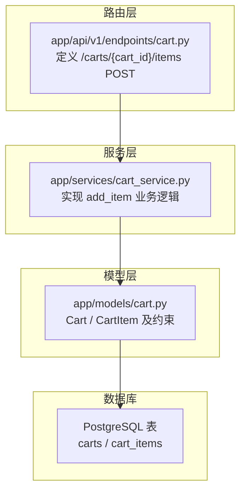
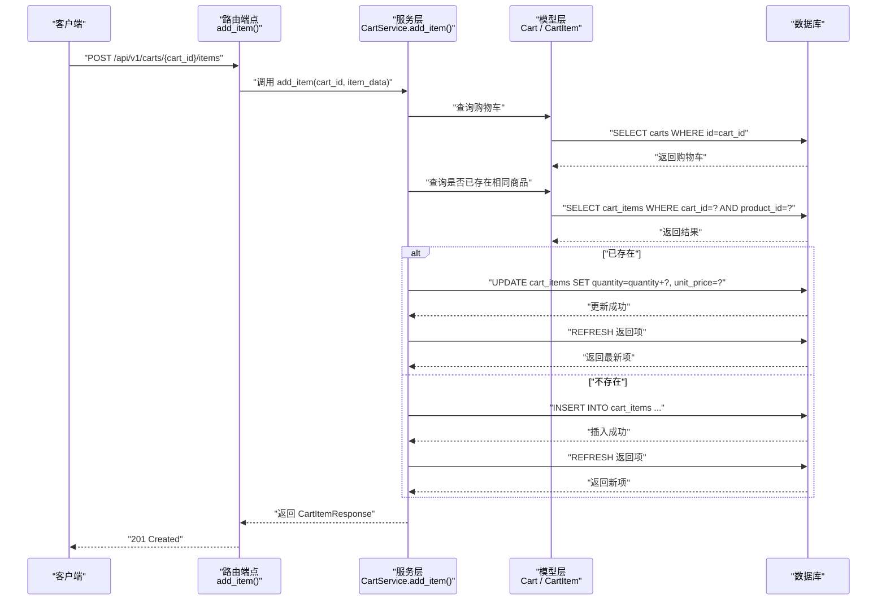
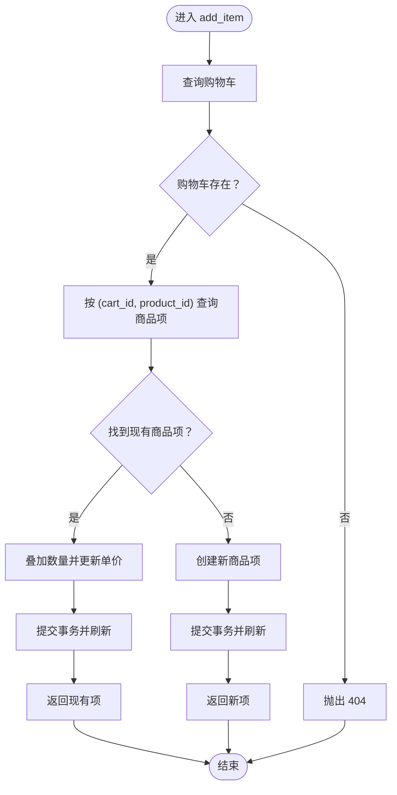
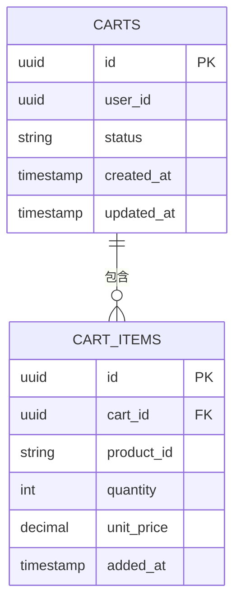
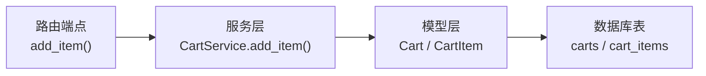

# 添加商品到购物车

<cite>
**本文引用的文件**
- [app/api/v1/endpoints/cart.py](file://app/api/v1/endpoints/cart.py)
- [app/schemas/cart.py](file://app/schemas/cart.py)
- [app/services/cart_service.py](file://app/services/cart_service.py)
- [app/models/cart.py](file://app/models/cart.py)
- [alembic/versions/286c2307065b_create_cart_tables.py](file://alembic/versions/286c2307065b_create_cart_tables.py)
- [README.md](file://README.md)
</cite>

## 目录
1. [简介](#简介)
2. [项目结构](#项目结构)
3. [核心组件](#核心组件)
4. [架构总览](#架构总览)
5. [详细组件分析](#详细组件分析)
6. [依赖关系分析](#依赖关系分析)
7. [性能考量](#性能考量)
8. [故障排查指南](#故障排查指南)
9. [结论](#结论)
10. [附录](#附录)

## 简介
本文件为 POST /api/v1/carts/{cart_id}/items 接口的详细API文档。该接口用于向指定购物车添加商品，若商品已存在于购物车中，则对数量进行叠加；若不存在则新建一条商品项。接口使用 CartItemCreate 模型作为请求体，返回 CartItemResponse 作为响应体，状态码为 201。业务逻辑由 CartService.add_item 实现，数据模型由 SQLAlchemy ORM Cart 和 CartItem 提供，数据库层面通过唯一约束保证同一购物车下商品的唯一性。

## 项目结构
- 路由层：app/api/v1/endpoints/cart.py 定义了 /carts/{cart_id}/items 的 POST 路由，并调用服务层方法。
- 模型层：app/models/cart.py 定义了购物车与商品项的实体及约束。
- 服务层：app/services/cart_service.py 实现业务逻辑，包括添加商品、更新数量、删除等。
- 模型定义：app/schemas/cart.py 定义了请求与响应的 Pydantic 模型。
- 数据库迁移：alembic/versions/286c2307065b_create_cart_tables.py 定义了 carts 与 cart_items 的表结构与约束。
- 项目说明：README.md 提供了接口概览与数据模型说明。

**图表来源**
- [app/api/v1/endpoints/cart.py](file://app/api/v1/endpoints/cart.py#L31-L35)
- [app/services/cart_service.py](file://app/services/cart_service.py#L32-L61)
- [app/models/cart.py](file://app/models/cart.py#L10-L37)
- [alembic/versions/286c2307065b_create_cart_tables.py](file://alembic/versions/286c2307065b_create_cart_tables.py#L38-L44)

**章节来源**
- [README.md](file://README.md#L107-L118)
- [app/api/v1/endpoints/cart.py](file://app/api/v1/endpoints/cart.py#L31-L35)
- [app/schemas/cart.py](file://app/schemas/cart.py#L7-L11)
- [app/models/cart.py](file://app/models/cart.py#L10-L37)
- [alembic/versions/286c2307065b_create_cart_tables.py](file://alembic/versions/286c2307065b_create_cart_tables.py#L38-L44)

## 核心组件
- 路由端点：/api/v1/carts/{cart_id}/items 使用 POST 方法，路径参数 cart_id 标识购物车，请求体为 CartItemCreate，响应体为 CartItemResponse，状态码 201。
- 服务方法：CartService.add_item 负责查询购物车、查找是否存在相同商品、叠加数量或创建新项，并刷新返回。
- 数据模型：
  - CartItemCreate：product_id（字符串）、quantity（整数，>0，默认1）、unit_price（Decimal，>0）。
  - CartItemResponse：包含 id、cart_id、product_id、quantity、unit_price、added_at。
- 数据库约束：cart_items 上存在 (cart_id, product_id) 唯一约束与 quantity > 0 检查约束，确保同购物车下商品唯一且数量为正。

**章节来源**
- [app/api/v1/endpoints/cart.py](file://app/api/v1/endpoints/cart.py#L31-L35)
- [app/schemas/cart.py](file://app/schemas/cart.py#L7-L26)
- [app/services/cart_service.py](file://app/services/cart_service.py#L32-L61)
- [app/models/cart.py](file://app/models/cart.py#L22-L37)
- [alembic/versions/286c2307065b_create_cart_tables.py](file://alembic/versions/286c2307065b_create_cart_tables.py#L38-L44)

## 架构总览
从客户端请求到数据库写入的整体流程如下：

**图表来源**
- [app/api/v1/endpoints/cart.py](file://app/api/v1/endpoints/cart.py#L31-L35)
- [app/services/cart_service.py](file://app/services/cart_service.py#L32-L61)
- [app/models/cart.py](file://app/models/cart.py#L10-L37)

## 详细组件分析

### 接口定义与行为
- 方法与路径：POST /api/v1/carts/{cart_id}/items
- 路径参数：
  - cart_id：UUID，标识目标购物车。
- 请求体：CartItemCreate
  - product_id：字符串，商品标识。
  - quantity：整数，必须大于 0，默认 1。
  - unit_price：Decimal，必须大于 0。
- 响应体：CartItemResponse
  - 包含 id、cart_id、product_id、quantity、unit_price、added_at。
- 状态码：201 Created；当请求体不满足模型校验时，由 Pydantic 触发 422 Unprocessable Entity。

请求示例（添加 iPhone）：
- 请求体示例（JSON）：
  - product_id："iPhone-15-Pro"
  - quantity：1
  - unit_price：8999.00
- 成功响应示例（JSON）：
  - 返回新增或更新后的商品项，字段与 CartItemResponse 对应。

并发与乐观锁说明：
- 当前实现未使用显式的版本号或时间戳字段进行乐观锁控制。数据库层面通过唯一约束 (cart_id, product_id) 与 quantity > 0 的检查约束，配合服务层的查询-判断-更新/插入流程，保证幂等与一致性。
- 若需要更强的一致性保障，可在 CartItem 增加版本号字段并在更新时进行条件更新，但当前代码未实现该机制。

**章节来源**
- [app/api/v1/endpoints/cart.py](file://app/api/v1/endpoints/cart.py#L31-L35)
- [app/schemas/cart.py](file://app/schemas/cart.py#L7-L26)
- [app/models/cart.py](file://app/models/cart.py#L22-L37)
- [alembic/versions/286c2307065b_create_cart_tables.py](file://alembic/versions/286c2307065b_create_cart_tables.py#L38-L44)

### 服务层业务逻辑（CartService.add_item）
- 步骤概述：
  1) 查询购物车是否存在。
  2) 在同一购物车内按 product_id 查找是否已有该项。
  3) 若存在：叠加数量并更新单价，提交事务并刷新返回。
  4) 若不存在：创建新项，提交事务并刷新返回。
  5) 同时更新购物车的 updated_at 时间戳。
- 错误处理：
  - 购物车不存在时抛出 404。
  - 其他异常由上层框架捕获并转换为相应 HTTP 错误。
- 并发处理：
  - 由于使用了查询-判断-更新/插入的流程，若多个请求同时到达，数据库唯一约束会阻止重复行的插入；叠加数量的更新是原子性的，但无法避免“最后写入覆盖”的问题。若需严格的“读取-计算-写回”一致性，建议引入乐观锁（版本号）。

**图表来源**
- [app/services/cart_service.py](file://app/services/cart_service.py#L32-L61)

**章节来源**
- [app/services/cart_service.py](file://app/services/cart_service.py#L32-L61)

### 数据模型与约束
- Cart：
  - 字段：id、user_id、status、created_at、updated_at。
  - 关系：一对多 items。
- CartItem：
  - 字段：id、cart_id、product_id、quantity、unit_price、added_at。
  - 约束：(cart_id, product_id) 唯一；quantity > 0。
- 数据库迁移脚本确认了上述约束与列定义。

**图表来源**
- [app/models/cart.py](file://app/models/cart.py#L10-L37)
- [alembic/versions/286c2307065b_create_cart_tables.py](file://alembic/versions/286c2307065b_create_cart_tables.py#L38-L44)

**章节来源**
- [app/models/cart.py](file://app/models/cart.py#L10-L37)
- [alembic/versions/286c2307065b_create_cart_tables.py](file://alembic/versions/286c2307065b_create_cart_tables.py#L38-L44)

### 请求体与响应体模型
- CartItemCreate：
  - product_id：字符串。
  - quantity：整数，必须大于 0（默认 1）。
  - unit_price：Decimal，必须大于 0。
- CartItemResponse：
  - id、cart_id、product_id、quantity、unit_price、added_at。

当 quantity ≤ 0 或 unit_price ≤ 0 时，Pydantic 将触发 422 Unprocessable Entity 错误，由 FastAPI 自动返回。

**章节来源**
- [app/schemas/cart.py](file://app/schemas/cart.py#L7-L26)

## 依赖关系分析
- 路由端点依赖服务层 CartService.add_item。
- 服务层依赖模型层 Cart 与 CartItem。
- 模型层依赖数据库表结构与约束。
- 数据库迁移脚本定义了 carts 与 cart_items 的表结构、主键、外键、唯一约束与检查约束。

**图表来源**
- [app/api/v1/endpoints/cart.py](file://app/api/v1/endpoints/cart.py#L31-L35)
- [app/services/cart_service.py](file://app/services/cart_service.py#L32-L61)
- [app/models/cart.py](file://app/models/cart.py#L10-L37)

**章节来源**
- [app/api/v1/endpoints/cart.py](file://app/api/v1/endpoints/cart.py#L31-L35)
- [app/services/cart_service.py](file://app/services/cart_service.py#L32-L61)
- [app/models/cart.py](file://app/models/cart.py#L10-L37)

## 性能考量
- 异步 I/O：使用 SQLAlchemy 2.0 异步会话，适合高并发场景。
- 原子性：更新与插入均在事务内完成，避免中间态。
- 约束保证：数据库唯一约束与检查约束减少应用层冗余判断，提升一致性与性能。
- 建议优化：
  - 若存在高并发叠加场景，可考虑引入版本号字段与条件更新，以实现更严格的乐观锁。
  - 对购物车查询可结合索引（如 user_id）优化，减少不必要的扫描。

[本节为通用性能建议，不直接分析具体文件]

## 故障排查指南
- 404 Not Found：当 cart_id 不存在时，服务层会抛出 404。
- 422 Unprocessable Entity：当请求体中的 quantity ≤ 0 或 unit_price ≤ 0 时，Pydantic 校验失败触发。
- 重复商品项：数据库唯一约束防止同一购物车下出现重复的 (cart_id, product_id)，若尝试插入冲突，数据库层会报错。
- 并发叠加：若多个请求同时叠加同一商品，最终数量为所有请求叠加的结果，但单价会被最后一次更新覆盖。若需严格一致的单价策略，请在业务层引入价格快照或版本控制。

**章节来源**
- [app/services/cart_service.py](file://app/services/cart_service.py#L15-L22)
- [app/schemas/cart.py](file://app/schemas/cart.py#L7-L11)
- [app/models/cart.py](file://app/models/cart.py#L22-L37)
- [alembic/versions/286c2307065b_create_cart_tables.py](file://alembic/versions/286c2307065b_create_cart_tables.py#L38-L44)

## 结论
POST /api/v1/carts/{cart_id}/items 接口通过清晰的路由、严谨的模型校验与数据库约束，实现了向指定购物车添加商品的核心功能。服务层在单次请求内保证了原子性与幂等性，数据库唯一约束有效避免了重复项。对于更高的一致性需求，可在后续引入乐观锁或价格快照策略。

[本节为总结性内容，不直接分析具体文件]

## 附录
- 接口概览与数据模型参考见 README 中的 API 列表与数据模型章节。
- 数据库迁移脚本定义了 carts 与 cart_items 的表结构与约束。

**章节来源**
- [README.md](file://README.md#L107-L143)
- [alembic/versions/286c2307065b_create_cart_tables.py](file://alembic/versions/286c2307065b_create_cart_tables.py#L38-L44)