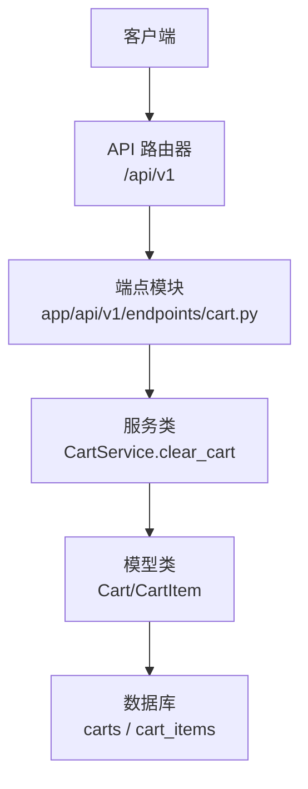
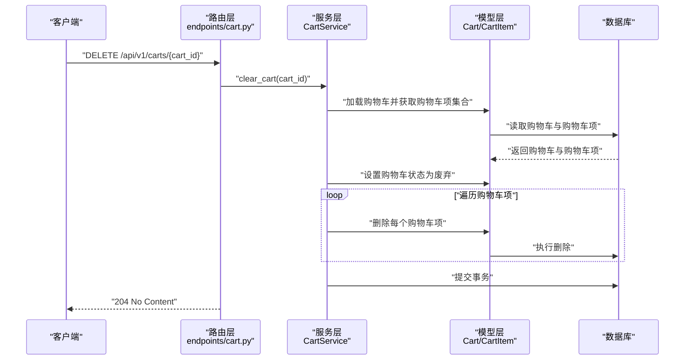
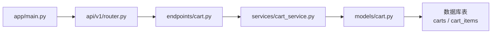

# 清空购物车

<cite>
**本文引用的文件**
- [app/api/v1/endpoints/cart.py](file://app/api/v1/endpoints/cart.py)
- [app/services/cart_service.py](file://app/services/cart_service.py)
- [app/models/cart.py](file://app/models/cart.py)
- [app/schemas/cart.py](file://app/schemas/cart.py)
- [app/api/v1/router.py](file://app/api/v1/router.py)
- [app/main.py](file://app/main.py)
- [alembic/versions/286c2307065b_create_cart_tables.py](file://alembic/versions/286c2307065b_create_cart_tables.py)
</cite>

## 目录
1. [简介](#简介)
2. [项目结构](#项目结构)
3. [核心组件](#核心组件)
4. [架构总览](#架构总览)
5. [详细组件分析](#详细组件分析)
6. [依赖关系分析](#依赖关系分析)
7. [性能考量](#性能考量)
8. [故障排查指南](#故障排查指南)
9. [结论](#结论)

## 简介
本节文档针对 DELETE /api/v1/carts/{cart_id} 接口进行完整说明。该接口用于“清空购物车”，即把指定购物车标记为废弃状态（不进行物理删除），并级联软删除其所有购物车项。接口无请求体，成功响应为 204 No Content。该行为由路由层的 clear_cart 函数委托给服务层的 CartService.clear_cart 执行。

## 项目结构
该接口位于 API v1 路由中，采用典型的三层架构：
- 路由层：负责接收请求、解析路径参数、调用服务层并返回状态码
- 服务层：封装业务逻辑，包括购物车状态变更与购物车项的删除
- 数据模型层：定义购物车与购物车项的数据结构及约束

图表来源
- [app/api/v1/router.py](file://app/api/v1/router.py#L1-L6)
- [app/api/v1/endpoints/cart.py](file://app/api/v1/endpoints/cart.py#L51-L55)
- [app/services/cart_service.py](file://app/services/cart_service.py#L89-L96)
- [app/models/cart.py](file://app/models/cart.py#L10-L37)

章节来源
- [app/api/v1/router.py](file://app/api/v1/router.py#L1-L6)
- [app/main.py](file://app/main.py#L1-L16)

## 核心组件
- 路由端点：DELETE /api/v1/carts/{cart_id} 由 endpoints/cart.py 中的 clear_cart 路由处理，直接调用服务层方法。
- 服务层：CartService.clear_cart 负责加载购物车、将其状态设为废弃、遍历并删除所有购物车项，最后提交事务。
- 数据模型：Cart/CartItem 定义了购物车与购物车项的字段、关系与约束；其中购物车项对购物车启用“级联删除”策略，确保清空时自动删除所有子项。
- 路由注册：API 路由器将端点模块纳入 /api/v1 前缀下，最终对外暴露接口。

章节来源
- [app/api/v1/endpoints/cart.py](file://app/api/v1/endpoints/cart.py#L51-L55)
- [app/services/cart_service.py](file://app/services/cart_service.py#L89-L96)
- [app/models/cart.py](file://app/models/cart.py#L10-L37)
- [app/api/v1/router.py](file://app/api/v1/router.py#L1-L6)
- [app/main.py](file://app/main.py#L1-L16)

## 架构总览
下面的序列图展示了从客户端到数据库的完整调用链路，以及清空购物车的关键步骤。

图表来源
- [app/api/v1/endpoints/cart.py](file://app/api/v1/endpoints/cart.py#L51-L55)
- [app/services/cart_service.py](file://app/services/cart_service.py#L89-L96)
- [app/models/cart.py](file://app/models/cart.py#L10-L37)

## 详细组件分析

### 接口定义与行为
- 方法与路径：DELETE /api/v1/carts/{cart_id}
- 路径参数：cart_id（UUID）
- 请求体：无
- 成功响应：204 No Content
- 失败响应：
  - 404 Not Found：当购物车不存在时
  - 422 Unprocessable Entity：当路径参数 cart_id 不是合法 UUID 格式时（由 FastAPI 自动校验并返回）

实现要点
- 路由层通过依赖注入获取数据库会话，调用服务层的 clear_cart 方法。
- 服务层先加载购物车，若不存在则抛出 404；随后将购物车状态置为“废弃”，并逐条删除其所有购物车项，最后提交事务。
- 数据模型层通过关系映射与外键约束，确保购物车项随购物车一起被级联删除。

章节来源
- [app/api/v1/endpoints/cart.py](file://app/api/v1/endpoints/cart.py#L51-L55)
- [app/services/cart_service.py](file://app/services/cart_service.py#L89-L96)
- [app/models/cart.py](file://app/models/cart.py#L10-L37)

### 幂等性说明
- 幂等性：多次调用同一 cart_id 的清空接口不会产生额外副作用，最终结果一致。
- 具体表现：
  - 若购物车已处于“废弃”状态且其购物车项已被删除，再次调用仍返回 204，不会重复删除或改变状态。
  - 由于服务层仅在存在购物车项时才执行删除，因此重复调用不会引发异常或副作用。

章节来源
- [app/services/cart_service.py](file://app/services/cart_service.py#L89-L96)

### 错误码与处理
- 404 Not Found：当 cart_id 对应的购物车不存在时，服务层抛出相应异常，路由层按 FastAPI 默认行为返回 404。
- 422 Unprocessable Entity：当路径参数不是合法 UUID 格式时，FastAPI 在参数解析阶段即返回 422。
- 204 No Content：成功清空购物车后返回。

章节来源
- [app/services/cart_service.py](file://app/services/cart_service.py#L15-L22)
- [app/api/v1/endpoints/cart.py](file://app/api/v1/endpoints/cart.py#L51-L55)

### 数据模型与级联删除
- 购物车模型 Cart
  - 字段：id、user_id、status、created_at、updated_at
  - 关系：items（一对多，指向 CartItem）
- 购物车项模型 CartItem
  - 字段：id、cart_id、product_id、quantity、unit_price、added_at
  - 约束：quantity > 0；cart_id 外键关联 carts.id，ondelete=CASCADE
- 级联删除效果：当购物车被清空时，其 items 集合中的每一条记录都会被删除；数据库层通过 CASCADE 约束保证一致性。

章节来源
- [app/models/cart.py](file://app/models/cart.py#L10-L37)
- [alembic/versions/286c2307065b_create_cart_tables.py](file://alembic/versions/286c2307065b_create_cart_tables.py#L21-L44)

### 建议的调用时机
- 在用户完成结算流程后调用该接口，以便清理购物车数据，释放资源并保持数据整洁。
- 若用户未完成结算，建议保留购物车以供后续继续购买。

## 依赖关系分析
- 路由层依赖服务层：clear_cart 路由直接调用 CartService.clear_cart
- 服务层依赖模型层：get_cart 与 clear_cart 使用 Cart/CartItem 模型
- 模型层依赖数据库：通过 SQLAlchemy ORM 映射至数据库表
- 路由注册：API 路由器将端点模块纳入 /api/v1 前缀

图表来源
- [app/api/v1/endpoints/cart.py](file://app/api/v1/endpoints/cart.py#L51-L55)
- [app/services/cart_service.py](file://app/services/cart_service.py#L89-L96)
- [app/models/cart.py](file://app/models/cart.py#L10-L37)
- [app/api/v1/router.py](file://app/api/v1/router.py#L1-L6)
- [app/main.py](file://app/main.py#L1-L16)

章节来源
- [app/api/v1/router.py](file://app/api/v1/router.py#L1-L6)
- [app/main.py](file://app/main.py#L1-L16)

## 性能考量
- 当前实现逐条删除购物车项，适合中小规模购物车。
- 对于大规模购物车，可考虑使用批量删除以减少事务开销与往返次数。
- 服务层的 calculate_total 与批量删除优化建议可参考 Review 记录中的建议。

## 故障排查指南
- 404 未找到：确认 cart_id 是否正确、是否存在对应购物车。
- 422 参数无效：确认 cart_id 为合法 UUID 格式。
- 业务异常：若出现意外错误，检查服务层日志与数据库事务是否正常提交。

章节来源
- [app/services/cart_service.py](file://app/services/cart_service.py#L15-L22)
- [app/api/v1/endpoints/cart.py](file://app/api/v1/endpoints/cart.py#L51-L55)

## 结论
DELETE /api/v1/carts/{cart_id} 接口通过“标记废弃 + 级联删除”的方式实现购物车清空，具备良好的幂等性与一致性。建议在用户结算完成后调用该接口，以维持购物车数据的整洁与高效。未来可在服务层引入批量删除等优化手段，进一步提升大购物车场景下的性能表现。