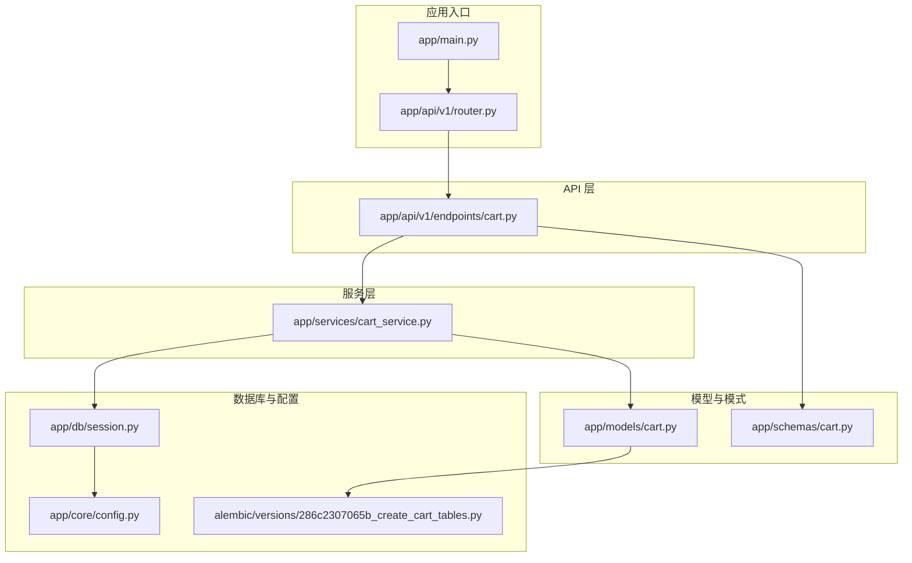
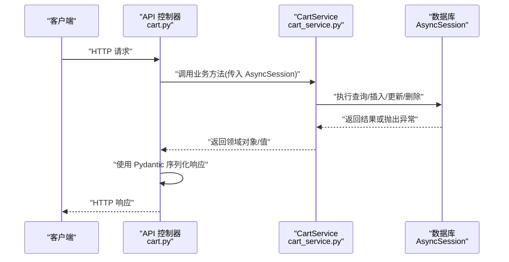
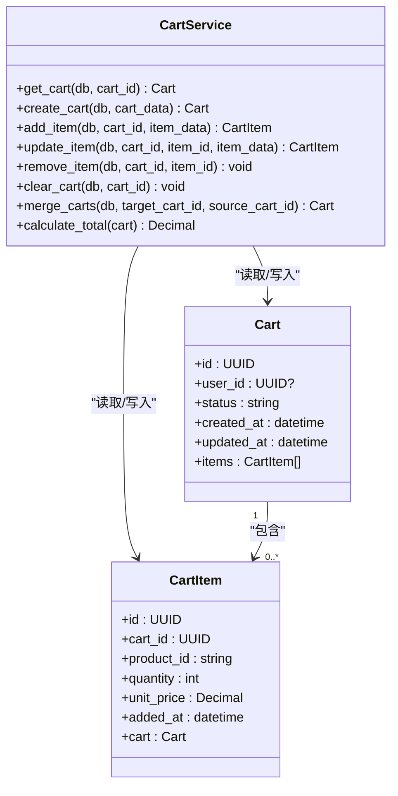
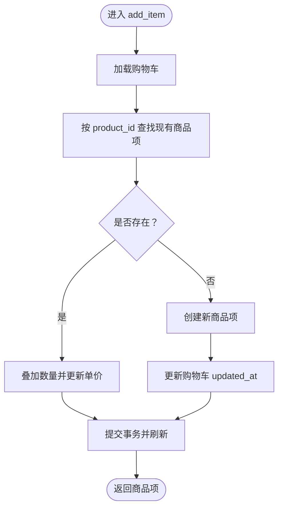
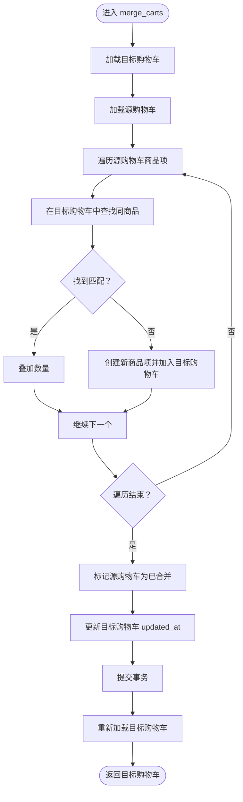
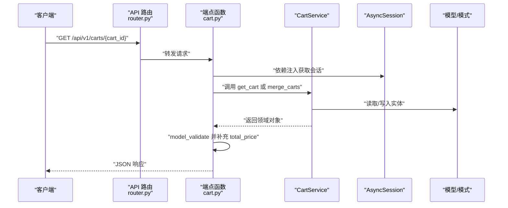
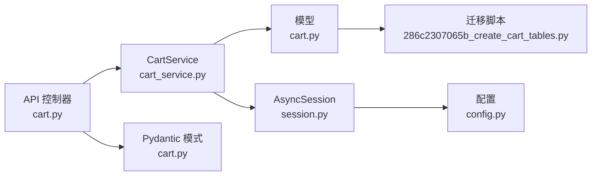
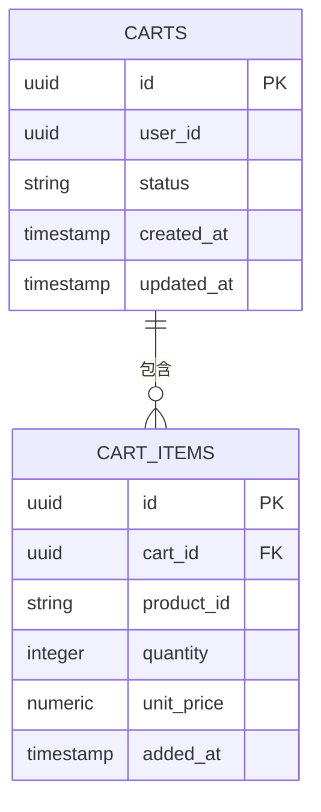

# 业务逻辑层

<cite>
**本文引用的文件列表**
- [app/services/cart_service.py](file://app/services/cart_service.py)
- [app/api/v1/endpoints/cart.py](file://app/api/v1/endpoints/cart.py)
- [app/models/cart.py](file://app/models/cart.py)
- [app/schemas/cart.py](file://app/schemas/cart.py)
- [app/db/session.py](file://app/db/session.py)
- [app/main.py](file://app/main.py)
- [app/api/v1/router.py](file://app/api/v1/router.py)
- [app/core/config.py](file://app/core/config.py)
- [alembic/versions/286c2307065b_create_cart_tables.py](file://alembic/versions/286c2307065b_create_cart_tables.py)
</cite>

## 目录
1. [引言](#引言)
2. [项目结构](#项目结构)
3. [核心组件](#核心组件)
4. [架构总览](#架构总览)
5. [详细组件分析](#详细组件分析)
6. [依赖关系分析](#依赖关系分析)
7. [性能考量](#性能考量)
8. [故障排查指南](#故障排查指南)
9. [结论](#结论)
10. [附录](#附录)

## 引言
本文件聚焦于业务逻辑层，深入解析购物车服务模块 app/services/cart_service.py 的核心业务流程与数据模型交互方式。重点覆盖以下服务方法的工作流：创建购物车、查询购物车、添加商品、更新商品数量、删除商品、清空购物车、合并购物车，以及购物车总价计算。同时阐明服务层如何通过 AsyncSession 与数据库交互，如何在业务规则层面处理“同商品数量叠加”“合并冲突解决”等场景，以及服务层与 API 端点之间的调用关系与职责边界。

## 项目结构
该工程采用分层清晰的组织方式：
- API 层：定义路由与请求/响应模型，负责输入校验与输出序列化
- 服务层：封装业务规则与事务控制，协调模型与会话
- 模型层：基于 SQLAlchemy ORM 映射数据库表结构
- 数据库会话：提供异步数据库连接与生命周期管理
- 配置层：读取环境变量并提供数据库连接参数

图表来源
- [app/main.py](file://app/main.py#L1-L17)
- [app/api/v1/router.py](file://app/api/v1/router.py#L1-L6)
- [app/api/v1/endpoints/cart.py](file://app/api/v1/endpoints/cart.py#L1-L65)
- [app/services/cart_service.py](file://app/services/cart_service.py#L1-L125)
- [app/models/cart.py](file://app/models/cart.py#L1-L37)
- [app/schemas/cart.py](file://app/schemas/cart.py#L1-L46)
- [app/db/session.py](file://app/db/session.py#L1-L24)
- [app/core/config.py](file://app/core/config.py#L1-L18)
- [alembic/versions/286c2307065b_create_cart_tables.py](file://alembic/versions/286c2307065b_create_cart_tables.py#L1-L55)

章节来源
- [app/main.py](file://app/main.py#L1-L17)
- [app/api/v1/router.py](file://app/api/v1/router.py#L1-L6)
- [app/api/v1/endpoints/cart.py](file://app/api/v1/endpoints/cart.py#L1-L65)
- [app/services/cart_service.py](file://app/services/cart_service.py#L1-L125)
- [app/models/cart.py](file://app/models/cart.py#L1-L37)
- [app/schemas/cart.py](file://app/schemas/cart.py#L1-L46)
- [app/db/session.py](file://app/db/session.py#L1-L24)
- [app/core/config.py](file://app/core/config.py#L1-L18)
- [alembic/versions/286c2307065b_create_cart_tables.py](file://alembic/versions/286c2307065b_create_cart_tables.py#L1-L55)

## 核心组件
- 购物车服务类 CartService：封装所有购物车相关的业务操作，统一处理数据库事务、业务规则与错误处理。
- 数据模型 Cart/CartItem：映射 carts 与 cart_items 表，定义字段约束与关系。
- 请求/响应模式：使用 Pydantic 定义输入输出结构，确保 API 与服务层之间的契约清晰。
- 数据库会话：通过 AsyncSession 提供异步数据库访问，配合依赖注入在每个请求内提供独立会话。

章节来源
- [app/services/cart_service.py](file://app/services/cart_service.py#L1-L125)
- [app/models/cart.py](file://app/models/cart.py#L1-L37)
- [app/schemas/cart.py](file://app/schemas/cart.py#L1-L46)
- [app/db/session.py](file://app/db/session.py#L1-L24)

## 架构总览
服务层通过 AsyncSession 与数据库交互，API 层仅负责参数校验与响应序列化，服务层承担业务规则与事务控制。购物车总价计算在服务层完成，API 层在返回时补充 total_price 字段。

图表来源
- [app/api/v1/endpoints/cart.py](file://app/api/v1/endpoints/cart.py#L1-L65)
- [app/services/cart_service.py](file://app/services/cart_service.py#L1-L125)
- [app/db/session.py](file://app/db/session.py#L1-L24)

## 详细组件分析

### CartService 类与方法总览
- get_cart：按主键加载购物车并预加载商品项，未找到时抛出 404。
- create_cart：创建新购物车并刷新实体。
- add_item：向购物车添加商品；若同商品已存在则叠加数量并更新单价，否则新增商品项。
- update_item：按 ID 更新指定商品数量。
- remove_item：按 ID 删除指定商品项。
- clear_cart：将购物车状态标记为废弃并删除所有商品项。
- merge_carts：将源购物车的商品合并到目标购物车，同商品数量叠加，源购物车标记为已合并。
- calculate_total：计算购物车内所有商品的小计之和。

图表来源
- [app/services/cart_service.py](file://app/services/cart_service.py#L1-L125)
- [app/models/cart.py](file://app/models/cart.py#L1-L37)

章节来源
- [app/services/cart_service.py](file://app/services/cart_service.py#L1-L125)
- [app/models/cart.py](file://app/models/cart.py#L1-L37)

### 方法工作流详解

#### 创建购物车 create_cart
- 输入：AsyncSession 与 CartCreate 模式
- 流程要点：
  - 构造 Cart 实体并加入会话
  - 提交事务并刷新实体以获得数据库生成的主键与时间戳
- 复杂度：O(1)，主要为一次插入与提交
- 错误处理：由调用方捕获数据库异常（如唯一性冲突）

章节来源
- [app/services/cart_service.py](file://app/services/cart_service.py#L24-L31)

#### 查询购物车 get_cart
- 输入：AsyncSession 与 cart_id
- 流程要点：
  - 使用 select 加载购物车并预加载 items 关系
  - 若不存在则抛出 404
- 复杂度：O(n)（n 为购物车商品数），取决于预加载策略
- 性能建议：在高并发下可考虑缓存最近查询的购物车

章节来源
- [app/services/cart_service.py](file://app/services/cart_service.py#L14-L23)
- [app/models/cart.py](file://app/models/cart.py#L1-L37)

#### 添加商品 add_item
- 输入：AsyncSession、cart_id、CartItemCreate
- 流程要点：
  - 先查询购物车是否存在
  - 在同一购物车内按 product_id 查找是否已有该项
  - 若存在：叠加数量并更新单价，提交事务
  - 若不存在：新建 CartItem 并加入购物车，同时更新购物车的 updated_at
- 业务规则：
  - 同商品数量叠加
  - 新增时记录单价
- 复杂度：查找 O(1) + 写入 O(1)，整体 O(1)
- 错误处理：当购物车不存在时由 get_cart 抛出 404

图表来源
- [app/services/cart_service.py](file://app/services/cart_service.py#L32-L61)

章节来源
- [app/services/cart_service.py](file://app/services/cart_service.py#L32-L61)

#### 更新商品数量 update_item
- 输入：AsyncSession、cart_id、item_id、CartItemUpdate
- 流程要点：
  - 按 ID 与购物车 ID 查询商品项
  - 若不存在抛出 404
  - 更新数量并提交
- 复杂度：O(1)
- 业务规则：仅允许更新数量，不改变单价

章节来源
- [app/services/cart_service.py](file://app/services/cart_service.py#L63-L76)

#### 删除商品 remove_item
- 输入：AsyncSession、cart_id、item_id
- 流程要点：
  - 按 ID 与购物车 ID 查询商品项
  - 若不存在抛出 404
  - 删除该项并提交
- 复杂度：O(1)

章节来源
- [app/services/cart_service.py](file://app/services/cart_service.py#L77-L88)

#### 清空购物车 clear_cart
- 输入：AsyncSession、cart_id
- 流程要点：
  - 加载购物车
  - 将状态标记为废弃
  - 循环删除所有商品项
  - 提交事务
- 复杂度：O(n)（n 为商品项数量）
- 业务规则：清空即删除所有商品项并标记状态

章节来源
- [app/services/cart_service.py](file://app/services/cart_service.py#L89-L96)

#### 合并购物车 merge_carts
- 输入：AsyncSession、target_cart_id、source_cart_id
- 流程要点：
  - 分别加载目标与源购物车
  - 遍历源购物车的所有商品项
  - 若目标购物车中存在相同 product_id：叠加数量
  - 若不存在：创建新的 CartItem 并加入目标购物车
  - 标记源购物车状态为已合并
  - 更新目标购物车 updated_at
  - 提交事务并重新加载目标购物车返回
- 冲突解决：
  - 同商品数量叠加
  - 不同商品直接新增
- 复杂度：O(n + m)（n 为目标购物车商品数，m 为源购物车商品数）
- 业务规则：合并后源购物车不再保留其商品项

图表来源
- [app/services/cart_service.py](file://app/services/cart_service.py#L97-L121)

章节来源
- [app/services/cart_service.py](file://app/services/cart_service.py#L97-L121)

#### 计算购物车总价 calculate_total
- 输入：Cart
- 流程要点：对每个商品项计算 quantity × unit_price 并求和
- 复杂度：O(n)
- 输出：Decimal 类型，用于精确金额计算

章节来源
- [app/services/cart_service.py](file://app/services/cart_service.py#L122-L125)

### 服务层与 API 端点的调用关系
- API 控制器从依赖注入中获取 AsyncSession，并将请求体转换为 Pydantic 模型后调用 CartService。
- CartService 返回领域对象，API 控制器再使用 Pydantic 的 model_validate 进行序列化，必要时补充 total_price。
- 错误处理：API 层通常保持最小职责，具体异常由服务层抛出并在 FastAPI 中统一处理。

图表来源
- [app/api/v1/router.py](file://app/api/v1/router.py#L1-L6)
- [app/api/v1/endpoints/cart.py](file://app/api/v1/endpoints/cart.py#L1-L65)
- [app/services/cart_service.py](file://app/services/cart_service.py#L1-L125)
- [app/schemas/cart.py](file://app/schemas/cart.py#L1-L46)

章节来源
- [app/api/v1/router.py](file://app/api/v1/router.py#L1-L6)
- [app/api/v1/endpoints/cart.py](file://app/api/v1/endpoints/cart.py#L1-L65)
- [app/schemas/cart.py](file://app/schemas/cart.py#L1-L46)

## 依赖关系分析
- 服务层依赖模型层进行实体读写，依赖会话层进行数据库交互。
- API 层依赖服务层进行业务处理，依赖模式层进行输入输出验证。
- 数据库层通过 Alembic 迁移脚本创建 carts 与 cart_items 表，并设置约束与索引。

图表来源
- [app/api/v1/endpoints/cart.py](file://app/api/v1/endpoints/cart.py#L1-L65)
- [app/services/cart_service.py](file://app/services/cart_service.py#L1-L125)
- [app/models/cart.py](file://app/models/cart.py#L1-L37)
- [app/schemas/cart.py](file://app/schemas/cart.py#L1-L46)
- [app/db/session.py](file://app/db/session.py#L1-L24)
- [app/core/config.py](file://app/core/config.py#L1-L18)
- [alembic/versions/286c2307065b_create_cart_tables.py](file://alembic/versions/286c2307065b_create_cart_tables.py#L1-L55)

章节来源
- [app/api/v1/endpoints/cart.py](file://app/api/v1/endpoints/cart.py#L1-L65)
- [app/services/cart_service.py](file://app/services/cart_service.py#L1-L125)
- [app/models/cart.py](file://app/models/cart.py#L1-L37)
- [app/schemas/cart.py](file://app/schemas/cart.py#L1-L46)
- [app/db/session.py](file://app/db/session.py#L1-L24)
- [app/core/config.py](file://app/core/config.py#L1-L18)
- [alembic/versions/286c2307065b_create_cart_tables.py](file://alembic/versions/286c2307065b_create_cart_tables.py#L1-L55)

## 性能考量
- 数据库约束与索引：
  - 商品项唯一约束：cart_id + product_id，避免重复商品项，便于快速查找
  - 数量正数约束：保证业务一致性
  - 购物车主表 user_id 建有普通索引，支持按用户检索
- 事务与提交：
  - 所有写操作均在单次事务中提交，减少锁竞争与回滚成本
- 预加载策略：
  - 查询购物车时预加载 items，降低 N+1 查询风险
- 计算复杂度：
  - add_item/update_item/remove_item/clear_cart/merge_carts 的时间复杂度与商品项数量线性相关，适合中小规模购物车
- 可扩展建议：
  - 对高频查询的购物车可引入缓存层
  - 对超大购物车，可考虑分页或延迟计算总价

章节来源
- [app/models/cart.py](file://app/models/cart.py#L1-L37)
- [alembic/versions/286c2307065b_create_cart_tables.py](file://alembic/versions/286c2307065b_create_cart_tables.py#L1-L55)
- [app/services/cart_service.py](file://app/services/cart_service.py#L1-L125)

## 故障排查指南
- 404 未找到：
  - get_cart、update_item、remove_item 在找不到实体时抛出 404
  - 排查：确认 cart_id 与 item_id 是否正确，确认购物车状态是否被清空
- 数量异常：
  - add_item 会叠加数量；若出现不符合预期的数量，请检查是否重复添加同一商品
- 单价更新：
  - add_item 在更新现有商品时会同步更新单价；若单价未按预期变化，请核对传入参数
- 合并冲突：
  - merge_carts 对同商品执行数量叠加；不同商品直接新增；若出现重复商品项，请检查 product_id 是否一致
- 数据库连接问题：
  - 检查 DATABASE_URL 配置与网络连通性
- 事务未生效：
  - 确认每次写操作后都执行了提交；避免在异常分支遗漏提交

章节来源
- [app/services/cart_service.py](file://app/services/cart_service.py#L14-L23)
- [app/services/cart_service.py](file://app/services/cart_service.py#L63-L88)
- [app/services/cart_service.py](file://app/services/cart_service.py#L97-L121)
- [app/core/config.py](file://app/core/config.py#L1-L18)

## 结论
CartService 将购物车业务规则与数据库交互封装在服务层，API 层专注于契约与序列化，形成清晰的职责边界。通过明确的业务规则（如同商品数量叠加、合并冲突解决）与严格的约束（唯一性、正数校验），系统在保证正确性的同时具备良好的可维护性。对于更高性能需求，可在缓存与分页等方面进一步优化。

## 附录
- 数据模型关系图（ER）

图表来源
- [app/models/cart.py](file://app/models/cart.py#L1-L37)
- [alembic/versions/286c2307065b_create_cart_tables.py](file://alembic/versions/286c2307065b_create_cart_tables.py#L1-L55)