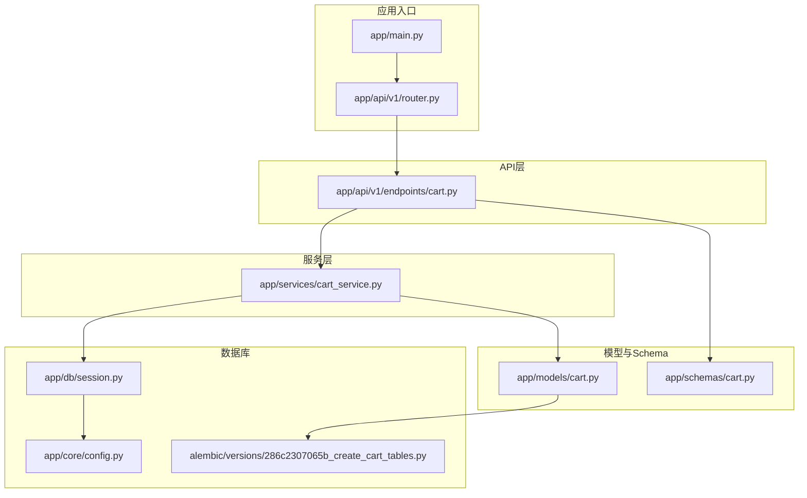
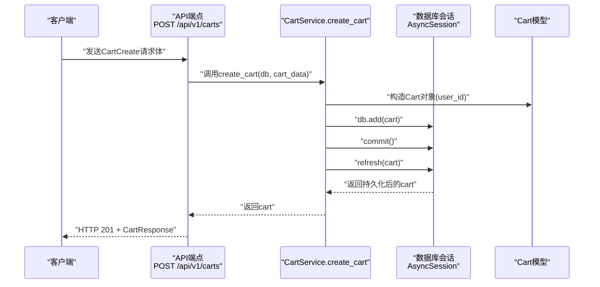
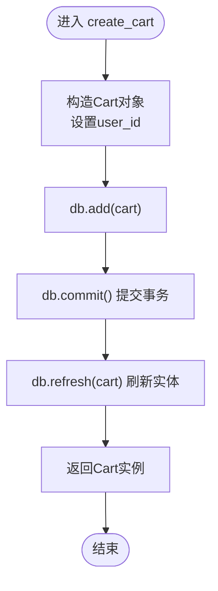
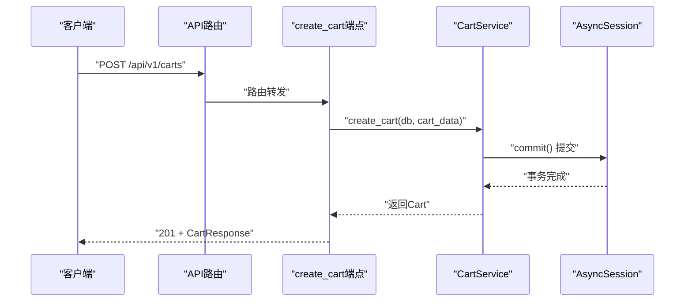
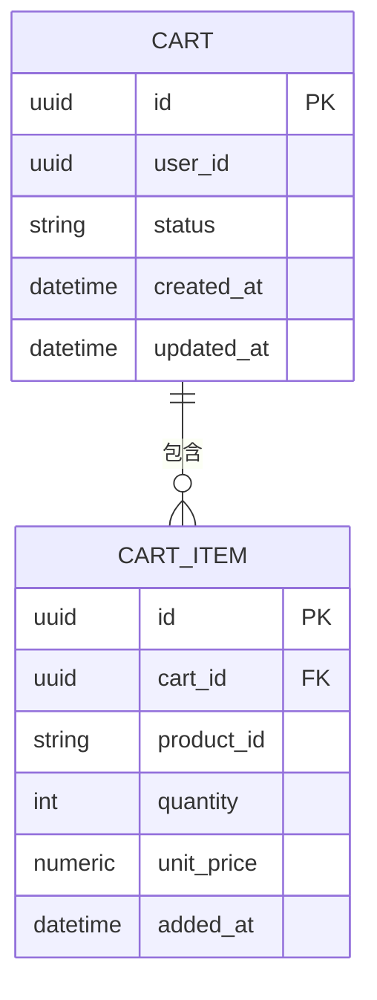
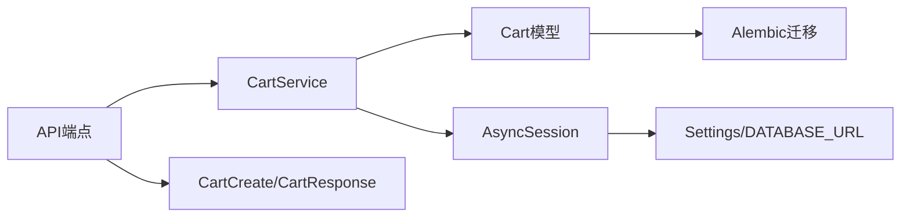

# 创建购物车

<cite>
**本文引用的文件列表**
- [app/main.py](file://app/main.py)
- [app/api/v1/router.py](file://app/api/v1/router.py)
- [app/api/v1/endpoints/cart.py](file://app/api/v1/endpoints/cart.py)
- [app/services/cart_service.py](file://app/services/cart_service.py)
- [app/models/cart.py](file://app/models/cart.py)
- [app/schemas/cart.py](file://app/schemas/cart.py)
- [app/db/session.py](file://app/db/session.py)
- [app/core/config.py](file://app/core/config.py)
- [alembic/versions/286c2307065b_create_cart_tables.py](file://alembic/versions/286c2307065b_create_cart_tables.py)
</cite>

## 目录
1. [简介](#简介)
2. [项目结构](#项目结构)
3. [核心组件](#核心组件)
4. [架构总览](#架构总览)
5. [详细组件分析](#详细组件分析)
6. [依赖关系分析](#依赖关系分析)
7. [性能考量](#性能考量)
8. [故障排查指南](#故障排查指南)
9. [结论](#结论)
10. [附录](#附录)

## 简介
本文件围绕“创建购物车”这一核心功能，系统性解析从API端点到服务层、再到数据库模型与Schema的数据流与控制流。重点覆盖：
- create_cart服务方法如何接收CartCreate数据模型、生成UUID、持久化到数据库并返回创建的购物车实例；
- API端点create_cart如何调用服务并以HTTP 201响应；
- 请求流程示例路径；
- 异常处理机制（当前未显式抛出异常，但存在404错误处理模式）；
- 在用户会话初始化中的应用场景；
- 对性能的影响与数据库事务原子性保障。

## 项目结构
该项目采用分层架构：API路由层负责HTTP请求与响应；服务层封装业务逻辑；模型层定义ORM实体；Schema层定义输入输出数据结构；数据库会话通过异步引擎提供。

图表来源
- [app/main.py](file://app/main.py#L1-L17)
- [app/api/v1/router.py](file://app/api/v1/router.py#L1-L6)
- [app/api/v1/endpoints/cart.py](file://app/api/v1/endpoints/cart.py#L1-L65)
- [app/services/cart_service.py](file://app/services/cart_service.py#L1-L125)
- [app/models/cart.py](file://app/models/cart.py#L1-L37)
- [app/schemas/cart.py](file://app/schemas/cart.py#L1-L46)
- [app/db/session.py](file://app/db/session.py#L1-L24)
- [app/core/config.py](file://app/core/config.py#L1-L18)
- [alembic/versions/286c2307065b_create_cart_tables.py](file://alembic/versions/286c2307065b_create_cart_tables.py#L1-L55)

章节来源
- [app/main.py](file://app/main.py#L1-L17)
- [app/api/v1/router.py](file://app/api/v1/router.py#L1-L6)
- [app/api/v1/endpoints/cart.py](file://app/api/v1/endpoints/cart.py#L1-L65)
- [app/services/cart_service.py](file://app/services/cart_service.py#L1-L125)
- [app/models/cart.py](file://app/models/cart.py#L1-L37)
- [app/schemas/cart.py](file://app/schemas/cart.py#L1-L46)
- [app/db/session.py](file://app/db/session.py#L1-L24)
- [app/core/config.py](file://app/core/config.py#L1-L18)
- [alembic/versions/286c2307065b_create_cart_tables.py](file://alembic/versions/286c2307065b_create_cart_tables.py#L1-L55)

## 核心组件
- API端点：POST /api/v1/carts，使用CartCreate作为请求体，返回CartResponse并设置状态码201。
- 服务方法：CartService.create_cart，接收AsyncSession与CartCreate，创建Cart实体并持久化。
- 数据模型：Cart（含自动生成UUID主键）、CartItem（用于后续商品项操作）。
- Schema：CartCreate（输入）、CartResponse（输出）。
- 数据库会话：异步引擎与会话工厂，提供事务边界。

章节来源
- [app/api/v1/endpoints/cart.py](file://app/api/v1/endpoints/cart.py#L24-L28)
- [app/services/cart_service.py](file://app/services/cart_service.py#L24-L30)
- [app/models/cart.py](file://app/models/cart.py#L10-L21)
- [app/schemas/cart.py](file://app/schemas/cart.py#L28-L42)
- [app/db/session.py](file://app/db/session.py#L1-L24)

## 架构总览
下图展示了从客户端到数据库的完整调用链路，以及各组件之间的依赖关系。

图表来源
- [app/api/v1/endpoints/cart.py](file://app/api/v1/endpoints/cart.py#L24-L28)
- [app/services/cart_service.py](file://app/services/cart_service.py#L24-L30)
- [app/models/cart.py](file://app/models/cart.py#L10-L21)
- [app/db/session.py](file://app/db/session.py#L1-L24)

## 详细组件分析

### 服务方法 create_cart 实现逻辑
- 输入参数
  - db: AsyncSession，异步数据库会话，提供事务上下文。
  - cart_data: CartCreate，包含user_id字段（可为空），用于标识购物车归属。
- 处理流程
  - 构造Cart实例：使用cart_data.user_id初始化Cart.user_id。
  - 写入数据库：db.add(cart)将对象加入会话。
  - 提交事务：await db.commit()持久化变更。
  - 刷新实体：await db.refresh(cart)确保返回的cart包含数据库侧生成的字段（如UUID主键）。
  - 返回结果：返回完整的Cart实例供上层使用。
- 数据模型与UUID
  - Cart.id在模型层定义为UUID类型，默认值为uuid.uuid4，因此无需在服务层手动赋值。
- 错误处理
  - 当前实现未显式抛出异常；若需增强健壮性，可在缺失user_id等场景补充校验或异常抛出。

图表来源
- [app/services/cart_service.py](file://app/services/cart_service.py#L24-L30)
- [app/models/cart.py](file://app/models/cart.py#L10-L21)

章节来源
- [app/services/cart_service.py](file://app/services/cart_service.py#L24-L30)
- [app/models/cart.py](file://app/models/cart.py#L10-L21)

### API端点 create_cart 的调用与响应
- 路由定义
  - 路径：POST /api/v1/carts
  - 请求体：CartCreate
  - 响应体：CartResponse
  - 状态码：201 Created
- 控制器逻辑
  - 通过依赖注入获取AsyncSession。
  - 调用CartService.create_cart(db, cart_data)。
  - 使用Pydantic模型验证并返回CartResponse。
- 事务与原子性
  - create_cart内部执行commit，保证创建购物车的原子性。
  - 若需要跨多个写操作的原子性，应在服务层或控制器中进行组合提交。

图表来源
- [app/api/v1/endpoints/cart.py](file://app/api/v1/endpoints/cart.py#L24-L28)
- [app/services/cart_service.py](file://app/services/cart_service.py#L24-L30)
- [app/db/session.py](file://app/db/session.py#L1-L24)

章节来源
- [app/api/v1/endpoints/cart.py](file://app/api/v1/endpoints/cart.py#L24-L28)

### 数据模型与Schema
- Cart模型
  - 主键id：UUID，默认值为uuid.uuid4。
  - user_id：UUID，可为空，便于匿名购物车与登录后用户购物车合并。
  - 状态status：字符串，默认“active”。
  - 时间戳：created_at与updated_at自动维护。
  - 关系：items为CartItem集合，级联删除孤儿项。
- CartItem模型
  - 用于后续添加/更新/删除商品项，此处不涉及创建流程。
- Schema
  - CartCreate：仅包含user_id（可为空）。
  - CartResponse：包含id、user_id、status、created_at、updated_at、items与total_price。

图表来源
- [app/models/cart.py](file://app/models/cart.py#L10-L37)
- [app/schemas/cart.py](file://app/schemas/cart.py#L28-L42)

章节来源
- [app/models/cart.py](file://app/models/cart.py#L10-L37)
- [app/schemas/cart.py](file://app/schemas/cart.py#L1-L46)

### 请求流程示例（路径）
以下为一次典型“创建购物车”的请求流程路径参考：
- 客户端向POST /api/v1/carts发送CartCreate请求体。
- API路由层将请求转发至create_cart端点。
- 端点调用CartService.create_cart(db, cart_data)。
- 服务层创建Cart对象并提交事务，返回Cart实例。
- 端点使用CartResponse进行序列化并返回201。

章节来源
- [app/api/v1/endpoints/cart.py](file://app/api/v1/endpoints/cart.py#L24-L28)
- [app/services/cart_service.py](file://app/services/cart_service.py#L24-L30)

### 异常处理机制
- 当前create_cart服务方法未显式抛出异常，返回成功创建的购物车实例。
- 其他相关方法（如get_cart、update_item、remove_item）展示了标准的404异常处理模式，可作为扩展参考：
  - get_cart：当未找到购物车时抛出404异常。
  - update_item/remove_item：当未找到对应商品项时抛出404异常。
- 建议：在create_cart中可根据业务需求补充校验（如user_id非空限制、幂等性策略等），并在必要时抛出相应异常以保持一致性。

章节来源
- [app/services/cart_service.py](file://app/services/cart_service.py#L14-L23)
- [app/services/cart_service.py](file://app/services/cart_service.py#L63-L75)
- [app/services/cart_service.py](file://app/services/cart_service.py#L77-L88)

### 用户会话初始化应用场景
- 匿名购物车：用户未登录时，user_id为空，便于后续登录后合并。
- 登录后合并：通过合并接口将匿名购物车内容迁移到用户购物车，提升用户体验。
- 初始化时机：在用户首次访问或启动会话时创建匿名购物车，便于后续追踪与促销活动。

章节来源
- [app/models/cart.py](file://app/models/cart.py#L10-L21)
- [app/api/v1/endpoints/cart.py](file://app/api/v1/endpoints/cart.py#L57-L65)

## 依赖关系分析
- 组件耦合
  - API端点依赖CartService与AsyncSession。
  - CartService依赖模型层Cart与数据库会话。
  - Schema层为API与服务层提供数据契约。
- 外部依赖
  - FastAPI提供路由与依赖注入。
  - SQLAlchemy 2.0异步ORM提供数据库抽象。
  - Alembic负责数据库迁移。
- 可能的循环依赖
  - 当前模块间为单向依赖，未发现循环导入。

图表来源
- [app/api/v1/endpoints/cart.py](file://app/api/v1/endpoints/cart.py#L1-L65)
- [app/services/cart_service.py](file://app/services/cart_service.py#L1-L125)
- [app/models/cart.py](file://app/models/cart.py#L1-L37)
- [app/schemas/cart.py](file://app/schemas/cart.py#L1-L46)
- [app/db/session.py](file://app/db/session.py#L1-L24)
- [app/core/config.py](file://app/core/config.py#L1-L18)
- [alembic/versions/286c2307065b_create_cart_tables.py](file://alembic/versions/286c2307065b_create_cart_tables.py#L1-L55)

章节来源
- [app/api/v1/endpoints/cart.py](file://app/api/v1/endpoints/cart.py#L1-L65)
- [app/services/cart_service.py](file://app/services/cart_service.py#L1-L125)
- [app/models/cart.py](file://app/models/cart.py#L1-L37)
- [app/schemas/cart.py](file://app/schemas/cart.py#L1-L46)
- [app/db/session.py](file://app/db/session.py#L1-L24)
- [app/core/config.py](file://app/core/config.py#L1-L18)
- [alembic/versions/286c2307065b_create_cart_tables.py](file://alembic/versions/286c2307065b_create_cart_tables.py#L1-L55)

## 性能考量
- 异步I/O：使用SQLAlchemy异步引擎与会话，减少阻塞，适合高并发场景。
- 事务粒度：create_cart为单条插入，事务开销小，提交频率高但单次耗时短。
- 数据库索引：Cart.user_id建立普通索引，有利于匿名购物车与用户购物车合并时的查询性能。
- 序列化成本：返回CartResponse时进行Pydantic模型验证与序列化，建议在高频路径中避免不必要的字段计算（如总价）。
- 扩展建议：
  - 若需要跨多表或多步骤的原子性，可在服务层或控制器中进行批量提交。
  - 对频繁读取的字段（如user_id）可考虑缓存策略（谨慎使用，注意一致性）。

## 故障排查指南
- 404错误模式参考
  - get_cart：当未找到购物车时返回404。
  - update_item/remove_item：当未找到对应商品项时返回404。
- 建议排查步骤
  - 确认CartCreate.user_id是否符合预期（可为空）。
  - 检查数据库连接配置与迁移是否成功。
  - 观察日志与异常堆栈，定位服务层或会话层问题。
- 增强建议
  - 在create_cart中增加输入校验与异常抛出，统一错误响应格式。
  - 对关键路径增加超时与重试策略（视业务而定）。

章节来源
- [app/services/cart_service.py](file://app/services/cart_service.py#L14-L23)
- [app/services/cart_service.py](file://app/services/cart_service.py#L63-L88)
- [app/db/session.py](file://app/db/session.py#L1-L24)
- [app/core/config.py](file://app/core/config.py#L1-L18)

## 结论
- create_cart服务方法通过接收CartCreate、构造Cart实体、提交事务并刷新实体，实现了购物车的快速创建与返回。
- API端点以201状态码返回CartResponse，遵循REST规范。
- 当前实现未显式抛出异常，但其他方法提供了404异常处理模式，可作为扩展参考。
- 在用户会话初始化场景中，匿名购物车与登录后合并具备良好实践基础。
- 性能方面，异步ORM与小事务粒度有助于高并发；建议在需要时扩展事务范围与错误处理。

## 附录
- 数据库迁移脚本确保carts与cart_items表结构正确，包含主键、外键、唯一约束与检查约束。
- 配置文件提供DATABASE_URL，确保会话工厂能够正确连接数据库。

章节来源
- [alembic/versions/286c2307065b_create_cart_tables.py](file://alembic/versions/286c2307065b_create_cart_tables.py#L21-L45)
- [app/core/config.py](file://app/core/config.py#L1-L18)