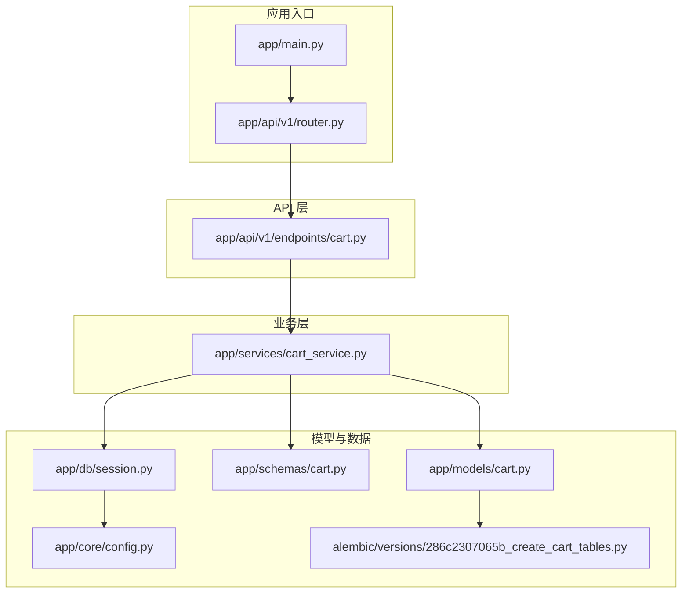
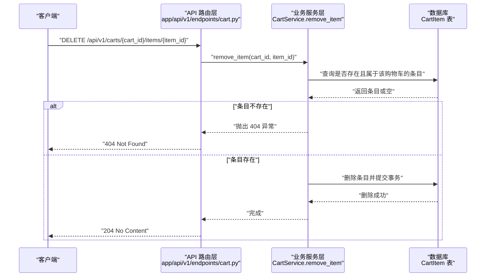
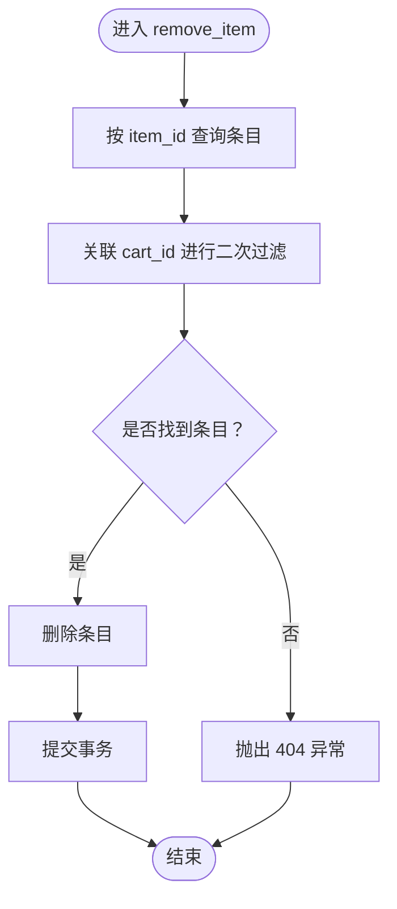
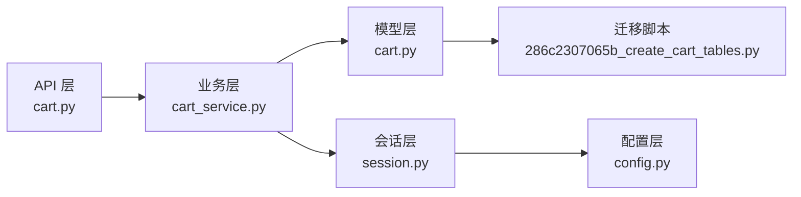

# 删除购物车中的商品

<cite>
**本文引用的文件**
- [app/api/v1/endpoints/cart.py](file://app/api/v1/endpoints/cart.py)
- [app/services/cart_service.py](file://app/services/cart_service.py)
- [app/models/cart.py](file://app/models/cart.py)
- [app/schemas/cart.py](file://app/schemas/cart.py)
- [app/api/v1/router.py](file://app/api/v1/router.py)
- [app/main.py](file://app/main.py)
- [app/db/session.py](file://app/db/session.py)
- [app/core/config.py](file://app/core/config.py)
- [alembic/versions/286c2307065b_create_cart_tables.py](file://alembic/versions/286c2307065b_create_cart_tables.py)
</cite>

## 目录
1. [简介](#简介)
2. [项目结构](#项目结构)
3. [核心组件](#核心组件)
4. [架构总览](#架构总览)
5. [详细组件分析](#详细组件分析)
6. [依赖关系分析](#依赖关系分析)
7. [性能与可扩展性](#性能与可扩展性)
8. [故障排查指南](#故障排查指南)
9. [结论](#结论)
10. [附录](#附录)

## 简介
本文围绕“删除购物车中的商品”这一核心能力，系统说明 remove_item 服务方法的安全删除流程，包括存在性检查、数据库删除操作与返回码设计意图；结合 API 端点展示调用方式，强调路径参数 cart_id 与 item_id 的双重校验机制；并讨论软删除与硬删除的选择考量，以及在大规模删除场景下的批处理优化可能性。

## 项目结构
该服务采用分层架构：FastAPI 路由层负责请求解析与响应状态码；业务服务层封装领域逻辑；模型层映射数据库表结构；会话层提供异步数据库连接；路由注册统一挂载至应用入口。

图表来源
- [app/main.py](file://app/main.py#L1-L17)
- [app/api/v1/router.py](file://app/api/v1/router.py#L1-L6)
- [app/api/v1/endpoints/cart.py](file://app/api/v1/endpoints/cart.py#L1-L65)
- [app/services/cart_service.py](file://app/services/cart_service.py#L1-L125)
- [app/models/cart.py](file://app/models/cart.py#L1-L37)
- [app/schemas/cart.py](file://app/schemas/cart.py#L1-L46)
- [app/db/session.py](file://app/db/session.py#L1-L24)
- [app/core/config.py](file://app/core/config.py#L1-L18)
- [alembic/versions/286c2307065b_create_cart_tables.py](file://alembic/versions/286c2307065b_create_cart_tables.py#L1-L55)

章节来源
- [app/main.py](file://app/main.py#L1-L17)
- [app/api/v1/router.py](file://app/api/v1/router.py#L1-L6)
- [app/api/v1/endpoints/cart.py](file://app/api/v1/endpoints/cart.py#L1-L65)
- [app/services/cart_service.py](file://app/services/cart_service.py#L1-L125)
- [app/models/cart.py](file://app/models/cart.py#L1-L37)
- [app/schemas/cart.py](file://app/schemas/cart.py#L1-L46)
- [app/db/session.py](file://app/db/session.py#L1-L24)
- [app/core/config.py](file://app/core/config.py#L1-L18)
- [alembic/versions/286c2307065b_create_cart_tables.py](file://alembic/versions/286c2307065b_create_cart_tables.py#L1-L55)

## 核心组件
- API 路由层：定义删除单个商品的端点，使用路径参数 cart_id 与 item_id，并返回 204 No Content。
- 业务服务层：实现 remove_item 方法，先进行存在性检查，再执行删除与提交事务。
- 模型层：Cart 与 CartItem 映射数据库表，包含外键约束与检查约束，确保数据一致性。
- 数据访问层：通过异步会话执行查询与删除，保证 I/O 非阻塞。
- 路由注册：统一挂载到 /api/v1 前缀，便于外部调用。

章节来源
- [app/api/v1/endpoints/cart.py](file://app/api/v1/endpoints/cart.py#L44-L49)
- [app/services/cart_service.py](file://app/services/cart_service.py#L77-L88)
- [app/models/cart.py](file://app/models/cart.py#L10-L37)
- [app/db/session.py](file://app/db/session.py#L1-L24)
- [app/api/v1/router.py](file://app/api/v1/router.py#L1-L6)

## 架构总览
下图展示了从客户端到数据库的完整调用链路，突出 remove_item 的安全删除流程与返回码设计。

图表来源
- [app/api/v1/endpoints/cart.py](file://app/api/v1/endpoints/cart.py#L44-L49)
- [app/services/cart_service.py](file://app/services/cart_service.py#L77-L88)
- [app/models/cart.py](file://app/models/cart.py#L22-L37)

## 详细组件分析

### 删除端点与调用方式
- 端点路径：DELETE /api/v1/carts/{cart_id}/items/{item_id}
- 参数说明：
  - cart_id：购物车唯一标识，用于定位目标购物车。
  - item_id：购物车明细项唯一标识，用于定位具体商品项。
- 返回值：无响应体，仅返回 204 No Content，表示删除成功且无需返回内容。

章节来源
- [app/api/v1/endpoints/cart.py](file://app/api/v1/endpoints/cart.py#L44-L49)
- [app/main.py](file://app/main.py#L1-L17)
- [app/api/v1/router.py](file://app/api/v1/router.py#L1-L6)

### 存在性检查与双重校验机制
- 查询条件：同时匹配 item_id 与 cart_id，确保“条目确实属于该购物车”，防止越权删除或误删。
- 结果处理：
  - 若查询结果为空，抛出 404 异常，避免对不存在的条目执行删除。
  - 若存在则继续删除流程。
- 双重校验要点：
  - 路径参数校验：API 层明确要求 cart_id 与 item_id 为 UUID。
  - 业务校验：服务层再次确认条目归属，形成“参数 + 业务”双保险。

图表来源
- [app/api/v1/endpoints/cart.py](file://app/api/v1/endpoints/cart.py#L44-L49)
- [app/services/cart_service.py](file://app/services/cart_service.py#L77-L88)

章节来源
- [app/api/v1/endpoints/cart.py](file://app/api/v1/endpoints/cart.py#L44-L49)
- [app/services/cart_service.py](file://app/services/cart_service.py#L77-L88)

### 数据库删除操作与事务管理
- 删除策略：直接删除 CartItem 记录，不保留历史。
- 事务控制：删除后立即提交，确保状态一致。
- 外键约束：cart_items.cart_id 外键设置级联删除，配合模型关系，删除父记录时自动清理子项（在清空购物车场景中体现）。

章节来源
- [app/services/cart_service.py](file://app/services/cart_service.py#L77-L88)
- [app/models/cart.py](file://app/models/cart.py#L10-L37)
- [alembic/versions/286c2307065b_create_cart_tables.py](file://alembic/versions/286c2307065b_create_cart_tables.py#L21-L46)

### 返回 204 No Content 的设计意图
- 语义正确：删除成功但无额外内容需要返回，符合 HTTP 规范。
- 减少负载：避免传输响应体，降低带宽与序列化开销。
- 保持简洁：前端只需根据状态码判断成功与否，逻辑清晰。

章节来源
- [app/api/v1/endpoints/cart.py](file://app/api/v1/endpoints/cart.py#L44-L49)

### 软删除 vs 硬删除的选择考量
- 硬删除（当前实现）：
  - 优点：简单直接、存储占用低、查询成本低。
  - 风险：无法恢复，审计与回溯困难。
- 软删除（建议）：
  - 优点：可恢复、便于审计、支持回滚。
  - 风险：需要维护 deleted_at、deleted_by 等字段，查询需加过滤条件，可能带来复杂度。
- 选择建议：
  - 若业务允许且未来可能需要审计或恢复，建议引入软删除字段并在服务层切换策略。
  - 当前项目采用硬删除，符合“轻量、高效”的设计取向。

章节来源
- [app/services/cart_service.py](file://app/services/cart_service.py#L77-L88)
- [app/models/cart.py](file://app/models/cart.py#L22-L37)

### 大规模删除场景下的批处理优化
- 单条删除：remove_item 逐条删除，适合交互式删除。
- 批量删除：在高并发或批量清理场景，可考虑：
  - 使用批量 DELETE 语句一次性删除多个 item_id。
  - 在服务层新增批量删除接口，传入 item_id 列表，内部使用批量删除与事务分组提交。
  - 对于超大集合，采用分页/分批提交，避免长事务锁表。
- 注意事项：
  - 仍需保留“条目归属校验”，确保每条记录都属于目标购物车。
  - 控制单次事务大小，避免长时间持有锁导致阻塞。

章节来源
- [app/services/cart_service.py](file://app/services/cart_service.py#L77-L88)
- [app/api/v1/endpoints/cart.py](file://app/api/v1/endpoints/cart.py#L44-L49)

## 依赖关系分析
- 组件耦合：
  - API 层仅依赖服务层接口，职责清晰。
  - 服务层依赖模型层与会话层，承担业务规则与事务控制。
- 外部依赖：
  - FastAPI 提供异步路由与依赖注入。
  - SQLAlchemy AsyncSession 提供异步数据库访问。
  - Alembic 管理数据库迁移，确保表结构与约束一致。

图表来源
- [app/api/v1/endpoints/cart.py](file://app/api/v1/endpoints/cart.py#L1-L65)
- [app/services/cart_service.py](file://app/services/cart_service.py#L1-L125)
- [app/models/cart.py](file://app/models/cart.py#L1-L37)
- [app/db/session.py](file://app/db/session.py#L1-L24)
- [app/core/config.py](file://app/core/config.py#L1-L18)
- [alembic/versions/286c2307065b_create_cart_tables.py](file://alembic/versions/286c2307065b_create_cart_tables.py#L1-L55)

章节来源
- [app/api/v1/endpoints/cart.py](file://app/api/v1/endpoints/cart.py#L1-L65)
- [app/services/cart_service.py](file://app/services/cart_service.py#L1-L125)
- [app/models/cart.py](file://app/models/cart.py#L1-L37)
- [app/db/session.py](file://app/db/session.py#L1-L24)
- [app/core/config.py](file://app/core/config.py#L1-L18)
- [alembic/versions/286c2307065b_create_cart_tables.py](file://alembic/versions/286c2307065b_create_cart_tables.py#L1-L55)

## 性能与可扩展性
- 查询效率：存在性检查为单条主键/唯一索引查询，开销极低。
- 事务粒度：每次删除为短事务，避免长时间锁持有。
- 扩展方向：
  - 批量删除接口：减少网络往返与事务次数。
  - 分页/分批：针对超大集合的删除任务，避免单次事务过大。
  - 索引优化：确保 cart_id 与 product_id 的联合唯一索引与 quantity 的检查约束有效。

章节来源
- [app/services/cart_service.py](file://app/services/cart_service.py#L77-L88)
- [app/models/cart.py](file://app/models/cart.py#L22-L37)
- [alembic/versions/286c2307065b_create_cart_tables.py](file://alembic/versions/286c2307065b_create_cart_tables.py#L21-L46)

## 故障排查指南
- 404 Not Found：
  - 可能原因：item_id 不存在或不属于 cart_id。
  - 排查步骤：确认路径参数是否正确；检查数据库中是否存在对应记录。
- 5xx 服务器错误：
  - 可能原因：数据库连接异常、事务提交失败。
  - 排查步骤：检查数据库连接配置与可用性；查看日志定位异常堆栈。
- 并发冲突：
  - 可能原因：多客户端同时删除同一商品项。
  - 建议：在上层业务中做幂等处理，或在服务层捕获异常并返回一致的状态。

章节来源
- [app/api/v1/endpoints/cart.py](file://app/api/v1/endpoints/cart.py#L44-L49)
- [app/services/cart_service.py](file://app/services/cart_service.py#L77-L88)
- [app/db/session.py](file://app/db/session.py#L1-L24)
- [app/core/config.py](file://app/core/config.py#L1-L18)

## 结论
remove_item 通过“路径参数 + 业务校验”的双重机制确保删除的安全性，采用硬删除与短事务保障性能与一致性，返回 204 No Content 符合 REST 语义。对于大规模删除场景，建议引入批量删除接口与分批处理策略，在保证安全性的前提下提升吞吐量。

## 附录
- API 端点参考
  - DELETE /api/v1/carts/{cart_id}/items/{item_id}：删除指定购物车中的某商品项，返回 204。
- 数据模型要点
  - cart_items.cart_id 外键与级联删除策略，确保父子关系一致性。
  - 联合唯一约束 (cart_id, product_id) 与 quantity 正数检查，避免重复与非法数据。

章节来源
- [app/api/v1/endpoints/cart.py](file://app/api/v1/endpoints/cart.py#L44-L49)
- [app/models/cart.py](file://app/models/cart.py#L22-L37)
- [alembic/versions/286c2307065b_create_cart_tables.py](file://alembic/versions/286c2307065b_create_cart_tables.py#L21-L46)