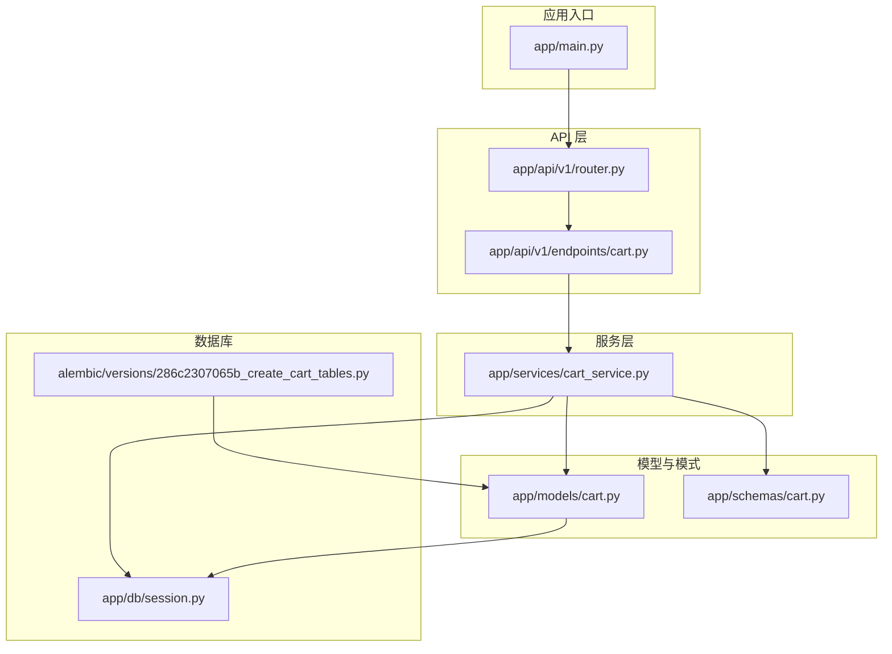
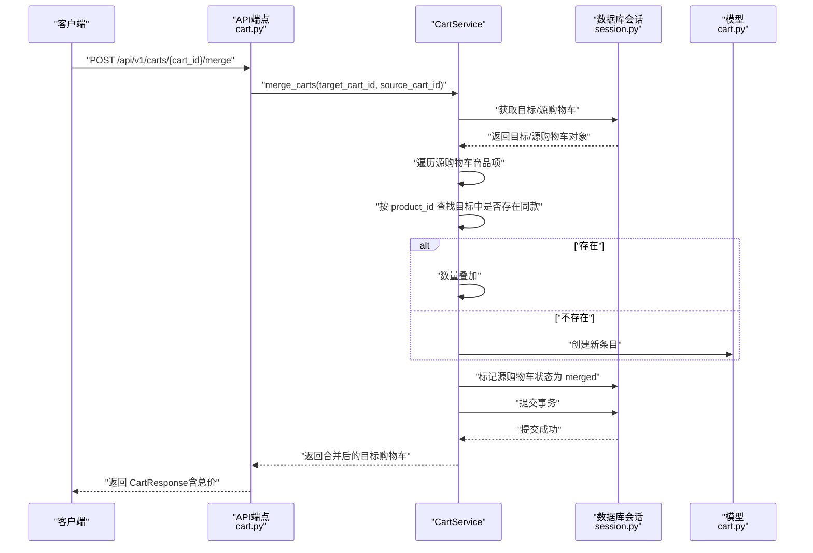
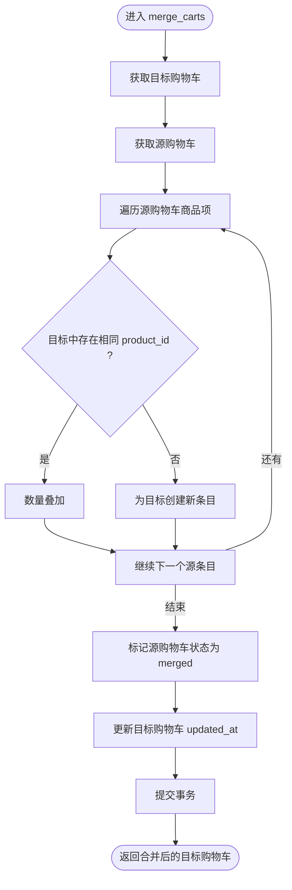
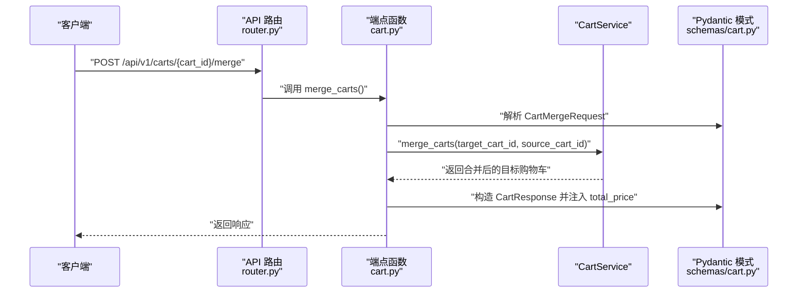
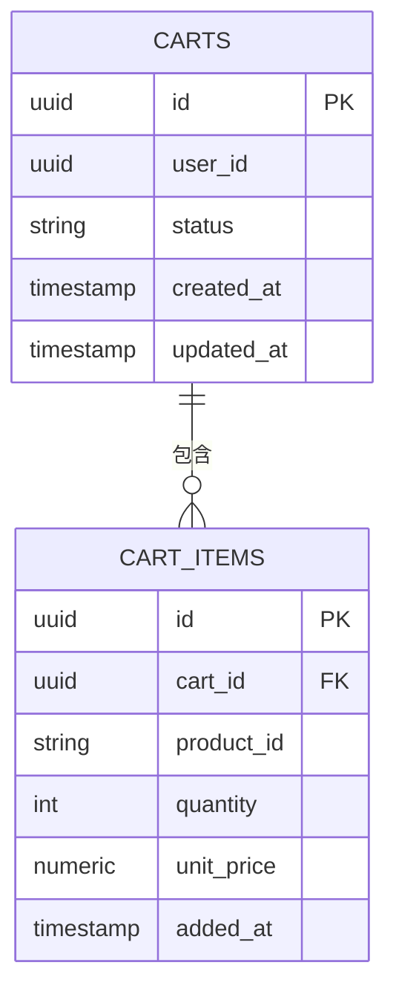
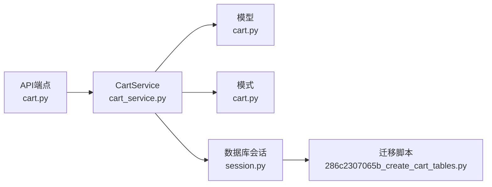

# 合并购物车

<cite>
**本文引用的文件**
- [app/services/cart_service.py](file://app/services/cart_service.py)
- [app/models/cart.py](file://app/models/cart.py)
- [app/schemas/cart.py](file://app/schemas/cart.py)
- [app/api/v1/endpoints/cart.py](file://app/api/v1/endpoints/cart.py)
- [app/api/v1/router.py](file://app/api/v1/router.py)
- [app/db/session.py](file://app/db/session.py)
- [app/main.py](file://app/main.py)
- [alembic/versions/286c2307065b_create_cart_tables.py](file://alembic/versions/286c2307065b_create_cart_tables.py)
- [README.md](file://README.md)
</cite>

## 目录
1. [简介](#简介)
2. [项目结构](#项目结构)
3. [核心组件](#核心组件)
4. [架构总览](#架构总览)
5. [详细组件分析](#详细组件分析)
6. [依赖关系分析](#依赖关系分析)
7. [性能考量](#性能考量)
8. [故障排查指南](#故障排查指南)
9. [结论](#结论)
10. [附录](#附录)

## 简介
本文件围绕“合并购物车”能力进行深入讲解，重点剖析服务方法 merge_carts 在用户登录时的核心作用：将匿名购物车（source）合并至用户专属购物车（target）。我们将详细说明：
- 遍历源购物车商品项的流程
- 判断目标购物车是否已存在相同商品（按 product_id 匹配）
- 执行数量叠加或新增的逻辑
- 合并后将源购物车状态置为 merged 的设计意图
- 结合 API 端点说明请求体 CartMergeRequest 的结构与调用流程
- 提供真实用户登录场景的示例
- 讨论冲突解决策略与性能优化（如批量插入）

## 项目结构
该服务采用分层架构：API 层负责路由与请求响应模型；服务层承载业务逻辑；模型层定义数据表结构；数据库会话通过异步引擎管理；迁移脚本定义初始表结构。

图表来源
- [app/main.py](file://app/main.py#L1-L17)
- [app/api/v1/router.py](file://app/api/v1/router.py#L1-L6)
- [app/api/v1/endpoints/cart.py](file://app/api/v1/endpoints/cart.py#L1-L65)
- [app/services/cart_service.py](file://app/services/cart_service.py#L1-L125)
- [app/models/cart.py](file://app/models/cart.py#L1-L37)
- [app/schemas/cart.py](file://app/schemas/cart.py#L1-L46)
- [app/db/session.py](file://app/db/session.py#L1-L24)
- [alembic/versions/286c2307065b_create_cart_tables.py](file://alembic/versions/286c2307065b_create_cart_tables.py#L1-L55)

章节来源
- [README.md](file://README.md#L43-L60)
- [app/main.py](file://app/main.py#L1-L17)
- [app/api/v1/router.py](file://app/api/v1/router.py#L1-L6)

## 核心组件
- 服务类 CartService：封装购物车相关业务逻辑，包括获取、创建、增删改商品、清空、合并以及总价计算。
- 模型 Cart/CartItem：定义购物车与购物车条目的字段、索引与约束。
- 请求/响应模式 CartMergeRequest/CartResponse：定义合并请求体与返回体结构。
- API 端点 cart.py：暴露 /carts/{cart_id}/merge 接口，调用服务层完成合并。
- 数据库会话 session.py：提供异步数据库连接与事务管理。
- 迁移脚本：创建 carts 与 cart_items 表及约束。

章节来源
- [app/services/cart_service.py](file://app/services/cart_service.py#L1-L125)
- [app/models/cart.py](file://app/models/cart.py#L1-L37)
- [app/schemas/cart.py](file://app/schemas/cart.py#L1-L46)
- [app/api/v1/endpoints/cart.py](file://app/api/v1/endpoints/cart.py#L56-L65)
- [app/db/session.py](file://app/db/session.py#L1-L24)
- [alembic/versions/286c2307065b_create_cart_tables.py](file://alembic/versions/286c2307065b_create_cart_tables.py#L21-L45)

## 架构总览
下图展示了从客户端发起合并请求到服务层处理再到数据库持久化的整体流程。

图表来源
- [app/api/v1/endpoints/cart.py](file://app/api/v1/endpoints/cart.py#L56-L65)
- [app/services/cart_service.py](file://app/services/cart_service.py#L98-L121)
- [app/db/session.py](file://app/db/session.py#L1-L24)
- [app/models/cart.py](file://app/models/cart.py#L1-L37)

## 详细组件分析

### 合并服务方法 merge_carts 的实现与行为
- 输入参数
  - target_cart_id：用户专属购物车标识
  - source_cart_id：匿名购物车标识
- 处理流程
  - 获取目标与源购物车，并加载其商品项
  - 遍历源购物车的所有商品项
  - 在目标购物车中查找是否存在相同 product_id 的条目
    - 若存在：将目标条目的数量累加源条目的数量
    - 若不存在：为目标购物车创建新的条目，复制 quantity 与 unit_price
  - 将源购物车的状态置为 merged
  - 更新目标购物车的 updated_at 时间戳
  - 提交事务并返回合并后的目标购物车
- 性能与一致性
  - 使用一次事务提交所有变更，保证原子性
  - 对每个源条目执行一次目标查找，时间复杂度近似 O(n*m)，其中 n 为源条目数，m 为目标条目数
  - 未使用批量插入，但可通过后续优化引入

图表来源
- [app/services/cart_service.py](file://app/services/cart_service.py#L98-L121)

章节来源
- [app/services/cart_service.py](file://app/services/cart_service.py#L98-L121)

### API 端点与请求体结构
- 端点路径与方法
  - POST /api/v1/carts/{cart_id}/merge
- 请求体模型 CartMergeRequest
  - 字段：source_cart_id（UUID）
- 响应模型 CartResponse
  - 字段：id、user_id、status、created_at、updated_at、items、total_price
  - 其中 total_price 由服务层计算后注入
- 调用流程
  - API 端点接收请求，解析 CartMergeRequest
  - 调用 CartService.merge_carts 完成合并
  - 计算总价并构造 CartResponse 返回

图表来源
- [app/api/v1/router.py](file://app/api/v1/router.py#L1-L6)
- [app/api/v1/endpoints/cart.py](file://app/api/v1/endpoints/cart.py#L56-L65)
- [app/schemas/cart.py](file://app/schemas/cart.py#L44-L46)
- [app/services/cart_service.py](file://app/services/cart_service.py#L122-L125)

章节来源
- [app/api/v1/endpoints/cart.py](file://app/api/v1/endpoints/cart.py#L56-L65)
- [app/schemas/cart.py](file://app/schemas/cart.py#L44-L46)

### 数据模型与约束
- 表结构
  - carts：主键 id，user_id 可为空（匿名购物车），status 默认 active，带 created_at/updated_at
  - cart_items：主键 id，外键 cart_id，唯一约束 (cart_id, product_id)，check 约束 quantity > 0
- 设计要点
  - 唯一约束确保同一购物车内的商品不重复
  - 外键级联删除保证购物车删除时自动清理条目
  - 合并后将源购物车状态置为 merged，避免重复合并与业务歧义

图表来源
- [app/models/cart.py](file://app/models/cart.py#L1-L37)
- [alembic/versions/286c2307065b_create_cart_tables.py](file://alembic/versions/286c2307065b_create_cart_tables.py#L21-L45)

章节来源
- [app/models/cart.py](file://app/models/cart.py#L1-L37)
- [alembic/versions/286c2307065b_create_cart_tables.py](file://alembic/versions/286c2307065b_create_cart_tables.py#L21-L45)

### 真实用户登录场景示例
- 场景描述
  - 用户匿名浏览并添加商品到匿名购物车（source_cart_id）
  - 用户登录后，前端调用合并接口将匿名购物车合并到用户专属购物车（target_cart_id）
- 步骤
  1) 客户端向 POST /api/v1/carts/{user_cart_id}/merge 发送请求，请求体包含 source_cart_id
  2) 服务端获取目标与源购物车，遍历源条目
  3) 对于每个源条目：
     - 若目标中已有相同 product_id：数量叠加
     - 否则：为目标创建新条目
  4) 标记源购物车状态为 merged，提交事务
  5) 返回合并后的目标购物车，包含最新总价

章节来源
- [app/api/v1/endpoints/cart.py](file://app/api/v1/endpoints/cart.py#L56-L65)
- [app/services/cart_service.py](file://app/services/cart_service.py#L98-L121)

### 冲突解决策略
- 同款商品的处理
  - 已存在：仅叠加数量，保留原条目
  - 不存在：创建新条目
- 价格策略
  - 当前实现未覆盖单价变化场景；若需“以合并时单价为准”，可在叠加前比较并更新 unit_price
- 并发与幂等
  - 通过事务保证原子性
  - 源购物车状态置为 merged，避免重复合并导致的数据异常

章节来源
- [app/services/cart_service.py](file://app/services/cart_service.py#L98-L121)
- [app/models/cart.py](file://app/models/cart.py#L1-L37)

## 依赖关系分析
- 组件耦合
  - API 端点依赖服务层；服务层依赖模型与数据库会话
  - 请求/响应模式独立于业务逻辑，便于扩展
- 外部依赖
  - FastAPI 路由与依赖注入
  - SQLAlchemy 异步 ORM 与约束
  - Alembic 迁移工具

图表来源
- [app/api/v1/endpoints/cart.py](file://app/api/v1/endpoints/cart.py#L1-L65)
- [app/services/cart_service.py](file://app/services/cart_service.py#L1-L125)
- [app/models/cart.py](file://app/models/cart.py#L1-L37)
- [app/schemas/cart.py](file://app/schemas/cart.py#L1-L46)
- [app/db/session.py](file://app/db/session.py#L1-L24)
- [alembic/versions/286c2307065b_create_cart_tables.py](file://alembic/versions/286c2307065b_create_cart_tables.py#L21-L45)

章节来源
- [app/api/v1/endpoints/cart.py](file://app/api/v1/endpoints/cart.py#L1-L65)
- [app/services/cart_service.py](file://app/services/cart_service.py#L1-L125)
- [app/db/session.py](file://app/db/session.py#L1-L24)

## 性能考量
- 现状
  - 合并逻辑逐条处理源条目，对每个源条目在目标购物车中线性查找匹配项，时间复杂度近似 O(n*m)
  - 未使用批量插入，每次新增或更新均触发一次数据库写入
- 优化建议
  - 批量插入：将所有需要新增的条目收集后一次性插入，减少往返次数
  - 批量更新：对需要叠加数量的条目，使用批量更新语句一次性完成
  - 预排序与哈希：对目标购物车条目按 product_id 建立映射，降低查找成本
  - 分页与并发控制：在高并发场景下考虑锁或乐观并发控制，避免重复叠加
- 事务粒度
  - 当前合并在一个事务内完成，保证一致性；批量操作可进一步减少事务持有时间

章节来源
- [app/services/cart_service.py](file://app/services/cart_service.py#L98-L121)

## 故障排查指南
- 常见问题
  - 目标或源购物车不存在：服务层会抛出未找到异常
  - 合并后源购物车仍可被访问：状态置为 merged，避免重复合并
  - 单价不一致：当前实现未覆盖单价变更，需根据业务需求调整
- 排查步骤
  - 确认传入的 target_cart_id 与 source_cart_id 是否有效
  - 检查数据库中 carts 与 cart_items 的数据与约束
  - 观察事务是否正常提交，必要时开启数据库日志
- 相关实现位置
  - 合并逻辑与状态更新
  - 获取购物车与异常处理
  - 数据库约束与索引

章节来源
- [app/services/cart_service.py](file://app/services/cart_service.py#L98-L121)
- [app/models/cart.py](file://app/models/cart.py#L1-L37)
- [alembic/versions/286c2307065b_create_cart_tables.py](file://alembic/versions/286c2307065b_create_cart_tables.py#L21-L45)

## 结论
merge_carts 在用户登录场景中扮演关键角色：它将匿名购物车中的商品无缝迁移到用户专属购物车，保障用户购买体验的一致性。当前实现简洁可靠，采用事务保证原子性，并通过状态标记避免重复合并。为进一步提升性能，建议引入批量插入与批量更新策略，并在需要时覆盖单价变更的业务规则。API 层清晰地暴露了合并端点，配合 Pydantic 模式实现了良好的请求/响应契约。

## 附录
- API 接口概览（来自 README）
  - GET /api/v1/carts/{cart_id}：获取购物车详情
  - POST /api/v1/carts：创建购物车
  - POST /api/v1/carts/{cart_id}/items：添加商品
  - PATCH /api/v1/carts/{cart_id}/items/{item_id}：更新商品数量
  - DELETE /api/v1/carts/{cart_id}/items/{item_id}：移除商品
  - DELETE /api/v1/carts/{cart_id}：清空购物车
  - POST /api/v1/carts/{cart_id}/merge：合并购物车

章节来源
- [README.md](file://README.md#L107-L118)