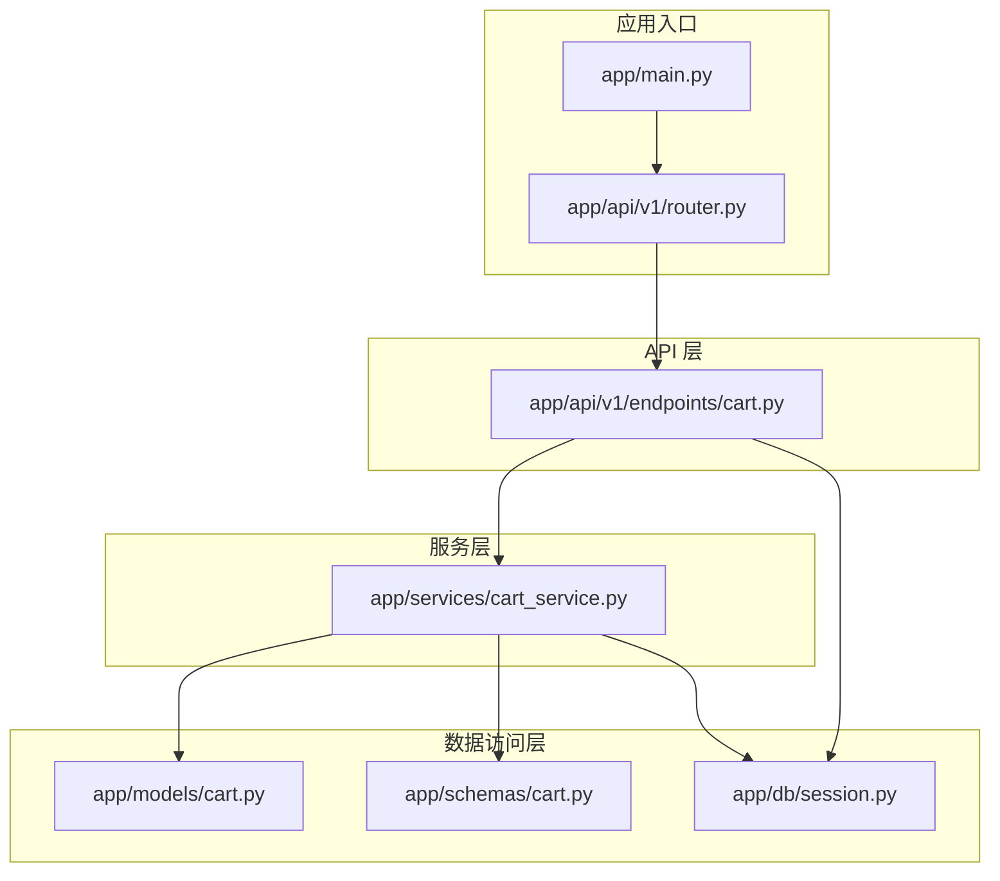
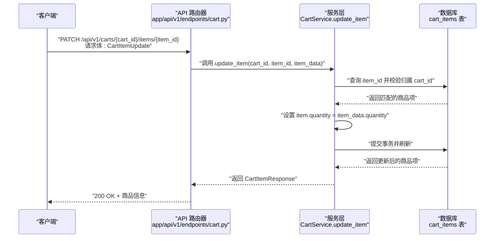
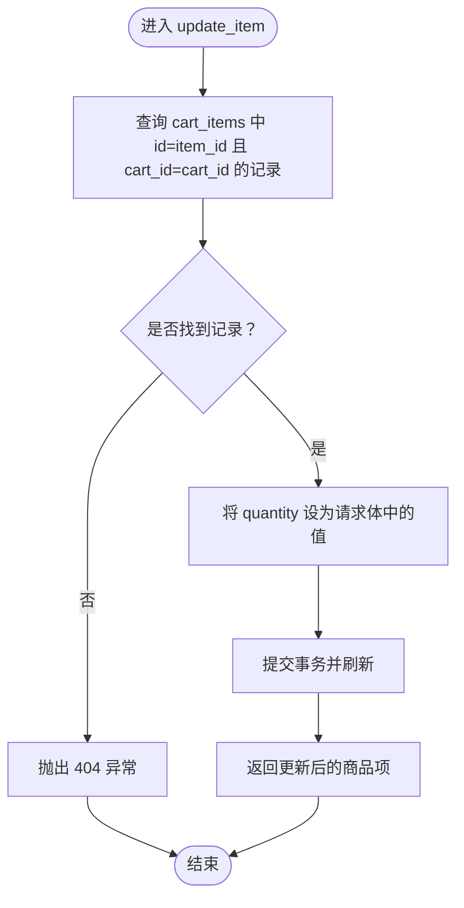
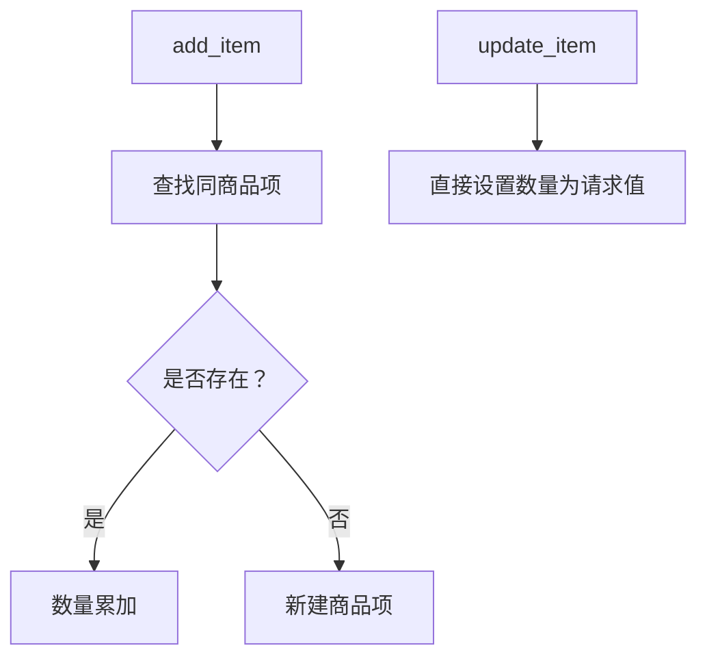
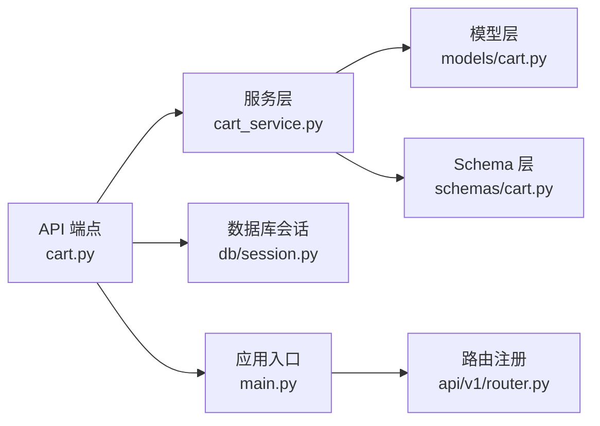

# 更新购物车商品数量

<cite>
**本文引用的文件列表**
- [app/main.py](file://app/main.py)
- [app/api/v1/router.py](file://app/api/v1/router.py)
- [app/api/v1/endpoints/cart.py](file://app/api/v1/endpoints/cart.py)
- [app/services/cart_service.py](file://app/services/cart_service.py)
- [app/models/cart.py](file://app/models/cart.py)
- [app/schemas/cart.py](file://app/schemas/cart.py)
- [app/db/session.py](file://app/db/session.py)
- [README.md](file://README.md)
</cite>

## 目录
1. [简介](#简介)
2. [项目结构](#项目结构)
3. [核心组件](#核心组件)
4. [架构总览](#架构总览)
5. [详细组件分析](#详细组件分析)
6. [依赖关系分析](#依赖关系分析)
7. [性能考量](#性能考量)
8. [故障排查指南](#故障排查指南)
9. [结论](#结论)
10. [附录](#附录)

## 简介
本文件围绕“更新购物车商品数量”的业务流程进行深入解析，重点说明：
- update_item 服务方法如何通过 item_id 精确定位商品项，执行数量更新并持久化；
- 与 add_item 在业务语义上的差异（精确设置 vs 增量叠加）；
- API 端点如何传递路径参数与请求体，并返回更新后的商品信息；
- 输入验证边界（如非负数限制），以及未来可扩展的校验机制；
- 提供用户手动修改购物车中某商品数量的使用示例。

## 项目结构
该服务采用分层架构：API 层负责路由与请求响应模型映射；服务层封装业务逻辑；模型层定义数据库表结构与约束；会话层提供异步数据库连接。

图表来源
- [app/main.py](file://app/main.py#L1-L17)
- [app/api/v1/router.py](file://app/api/v1/router.py#L1-L6)
- [app/api/v1/endpoints/cart.py](file://app/api/v1/endpoints/cart.py#L1-L65)
- [app/services/cart_service.py](file://app/services/cart_service.py#L1-L125)
- [app/models/cart.py](file://app/models/cart.py#L1-L37)
- [app/schemas/cart.py](file://app/schemas/cart.py#L1-L46)
- [app/db/session.py](file://app/db/session.py#L1-L24)

章节来源
- [app/main.py](file://app/main.py#L1-L17)
- [app/api/v1/router.py](file://app/api/v1/router.py#L1-L6)
- [README.md](file://README.md#L43-L60)

## 核心组件
- API 端点：提供 PATCH /api/v1/carts/{cart_id}/items/{item_id}，用于更新指定商品数量。
- 服务方法：update_item 负责定位商品项、赋值数量并提交事务。
- 数据模型：cart_items 表通过 CheckConstraint 对 quantity 设置正数约束。
- 请求/响应模型：CartItemUpdate 与 CartItemResponse 定义了输入与输出字段。
- 数据库会话：异步引擎与会话工厂确保并发安全与事务一致性。

章节来源
- [app/api/v1/endpoints/cart.py](file://app/api/v1/endpoints/cart.py#L38-L42)
- [app/services/cart_service.py](file://app/services/cart_service.py#L63-L75)
- [app/models/cart.py](file://app/models/cart.py#L22-L37)
- [app/schemas/cart.py](file://app/schemas/cart.py#L7-L26)
- [app/db/session.py](file://app/db/session.py#L1-L24)

## 架构总览
从客户端到数据库的调用链路如下：

图表来源
- [app/api/v1/endpoints/cart.py](file://app/api/v1/endpoints/cart.py#L38-L42)
- [app/services/cart_service.py](file://app/services/cart_service.py#L63-L75)
- [app/models/cart.py](file://app/models/cart.py#L22-L37)
- [app/schemas/cart.py](file://app/schemas/cart.py#L13-L26)

## 详细组件分析

### update_item 服务方法详解
- 定位策略：通过 item_id 与 cart_id 双条件查询，确保仅更新当前购物车内的目标商品项。
- 更新策略：直接将 quantity 赋值为请求体中的值，不进行累加或叠加。
- 持久化：提交事务并刷新实体，保证返回最新状态。
- 错误处理：若未找到匹配项，抛出 404 异常。

图表来源
- [app/services/cart_service.py](file://app/services/cart_service.py#L63-L75)

章节来源
- [app/services/cart_service.py](file://app/services/cart_service.py#L63-L75)

### 与 add_item 的业务语义对比
- add_item：当商品已存在时，对现有数量进行增量叠加；不存在则新增一条记录。适合“加入购物车”场景。
- update_item：直接将数量设置为目标值。适合“用户手动修改数量”场景。

图表来源
- [app/services/cart_service.py](file://app/services/cart_service.py#L33-L61)
- [app/services/cart_service.py](file://app/services/cart_service.py#L63-L75)

章节来源
- [app/services/cart_service.py](file://app/services/cart_service.py#L33-L61)
- [app/services/cart_service.py](file://app/services/cart_service.py#L63-L75)

### API 端点与参数传递
- 路径参数：
  - cart_id：购物车标识，用于限定商品项归属。
  - item_id：商品项标识，用于精确定位。
- 请求体：
  - CartItemUpdate.quantity：非零正整数，表示目标数量。
- 返回值：
  - CartItemResponse：包含商品项的完整信息（id、cart_id、product_id、quantity、unit_price、added_at）。

章节来源
- [app/api/v1/endpoints/cart.py](file://app/api/v1/endpoints/cart.py#L38-L42)
- [app/schemas/cart.py](file://app/schemas/cart.py#L13-L26)

### 数据模型与约束
- cart_items 表：
  - quantity 必须大于 0（CheckConstraint）。
  - 唯一性约束：同一购物车内 product_id 唯一。
- CartItemUpdate.quantity 使用 gt=0，确保 Pydantic 层面的正数校验。

章节来源
- [app/models/cart.py](file://app/models/cart.py#L22-L37)
- [app/schemas/cart.py](file://app/schemas/cart.py#L13-L15)

### 使用示例：用户手动修改购物车数量
- 场景：用户在购物车页面将某商品数量从 2 修改为 5。
- 步骤：
  1) 客户端向 PATCH /api/v1/carts/{cart_id}/items/{item_id} 发送请求，请求体重传 quantity=5。
  2) API 层接收并校验请求体，随后调用服务层 update_item。
  3) 服务层定位到对应商品项并将其 quantity 设为 5，提交事务。
  4) API 层返回更新后的商品信息给客户端。

章节来源
- [app/api/v1/endpoints/cart.py](file://app/api/v1/endpoints/cart.py#L38-L42)
- [app/services/cart_service.py](file://app/services/cart_service.py#L63-L75)

### 输入验证边界与扩展建议
- 当前验证：
  - Pydantic 层：CartItemUpdate.quantity > 0。
  - 数据库层：CheckConstraint(quantity > 0)。
- 边界说明：
  - 不允许设置为 0；若需删除该项，请使用删除端点。
  - product_id 与 quantity 的类型与长度在模型层有明确约束。
- 扩展建议（未来可选）：
  - 业务规则：限制单商品最大购买数量（可在服务层增加校验）。
  - 库存校验：结合库存服务进行实时校验（可在服务层增加外部调用）。
  - 价格快照：若需要，可在更新数量时记录单价快照（当前模型已记录 unit_price）。

章节来源
- [app/schemas/cart.py](file://app/schemas/cart.py#L13-L15)
- [app/models/cart.py](file://app/models/cart.py#L22-L37)

## 依赖关系分析
- API 层依赖服务层与数据库会话。
- 服务层依赖模型与请求/响应模型。
- 数据库层通过约束保障数据完整性。

图表来源
- [app/api/v1/endpoints/cart.py](file://app/api/v1/endpoints/cart.py#L1-L65)
- [app/services/cart_service.py](file://app/services/cart_service.py#L1-L125)
- [app/models/cart.py](file://app/models/cart.py#L1-L37)
- [app/schemas/cart.py](file://app/schemas/cart.py#L1-L46)
- [app/db/session.py](file://app/db/session.py#L1-L24)
- [app/main.py](file://app/main.py#L1-L17)
- [app/api/v1/router.py](file://app/api/v1/router.py#L1-L6)

章节来源
- [app/api/v1/endpoints/cart.py](file://app/api/v1/endpoints/cart.py#L1-L65)
- [app/services/cart_service.py](file://app/services/cart_service.py#L1-L125)
- [app/models/cart.py](file://app/models/cart.py#L1-L37)
- [app/schemas/cart.py](file://app/schemas/cart.py#L1-L46)
- [app/db/session.py](file://app/db/session.py#L1-L24)
- [app/main.py](file://app/main.py#L1-L17)
- [app/api/v1/router.py](file://app/api/v1/router.py#L1-L6)

## 性能考量
- 查询效率：update_item 使用双条件查询（item_id 与 cart_id），建议在 cart_id 上建立索引以提升定位速度（当前模型已对 cart_id 建外键，通常具备索引）。
- 事务粒度：单条记录更新，事务开销小，适合高频调用。
- 并发控制：异步会话避免阻塞，配合数据库锁策略可进一步保障一致性。

## 故障排查指南
- 404 未找到：当 item_id 与 cart_id 不匹配或不存在时，服务层抛出 404。请确认路径参数与商品项归属。
- 数量异常：若 quantity 为 0，数据库约束会阻止写入。请使用删除端点或修正为正数。
- 数据不一致：确保请求体中的 cart_id 与 item_id 对应同一购物车，避免跨购物车误操作。

章节来源
- [app/services/cart_service.py](file://app/services/cart_service.py#L63-L75)
- [app/models/cart.py](file://app/models/cart.py#L22-L37)

## 结论
update_item 通过 item_id 精确更新商品数量，与 add_item 的增量叠加形成互补：前者适合“手动修改”，后者适合“加入商品”。API 端点清晰地传递路径参数与请求体，服务层完成定位、赋值与持久化，数据模型与 Pydantic Schema 共同保障输入合法性。未来可在服务层扩展业务规则与库存校验，以满足更复杂的电商场景。

## 附录
- API 列表与说明可参考项目自述文件中的接口表格与数据模型说明。

章节来源
- [README.md](file://README.md#L107-L118)
- [README.md](file://README.md#L121-L143)