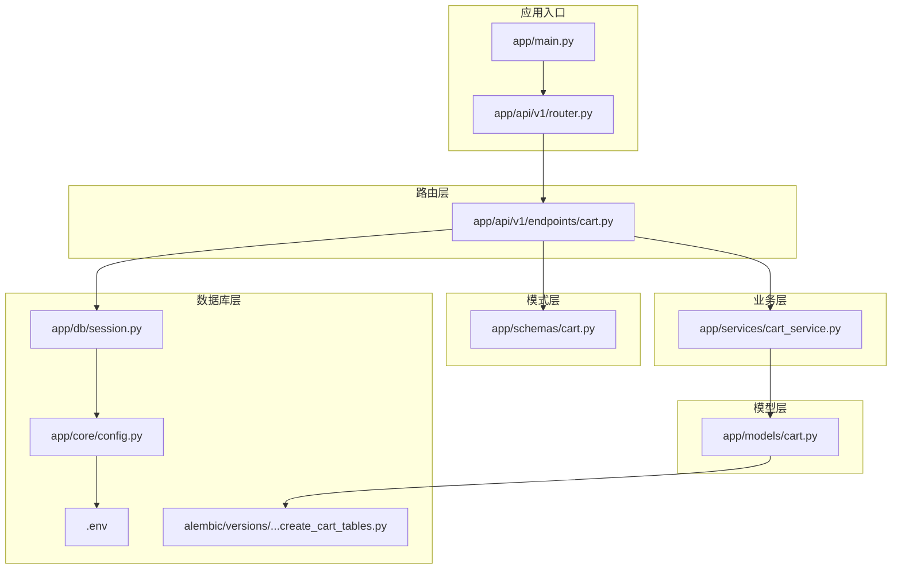
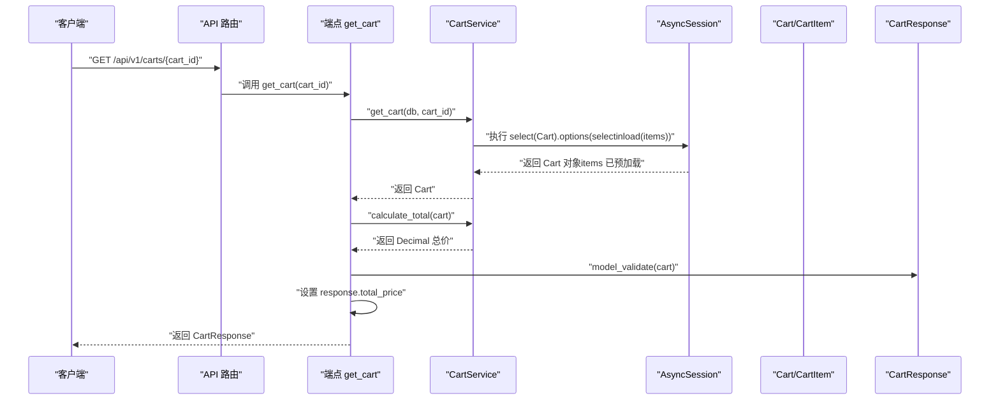
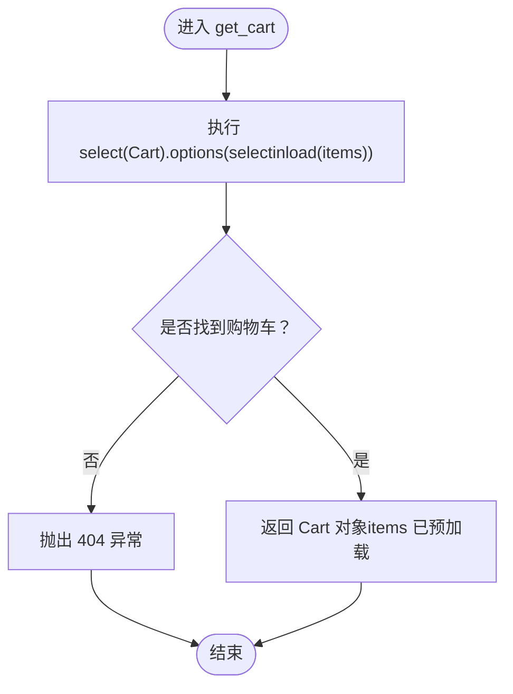
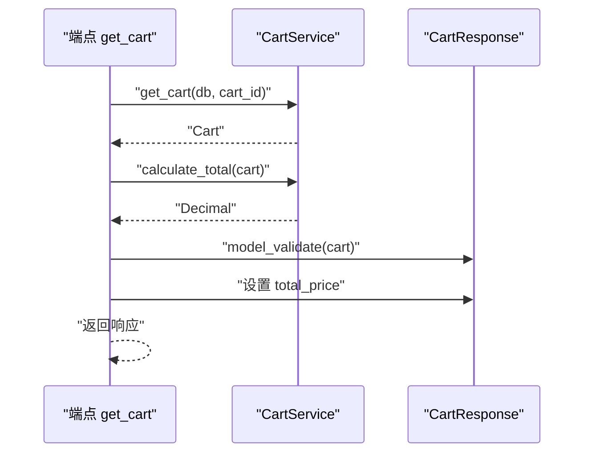
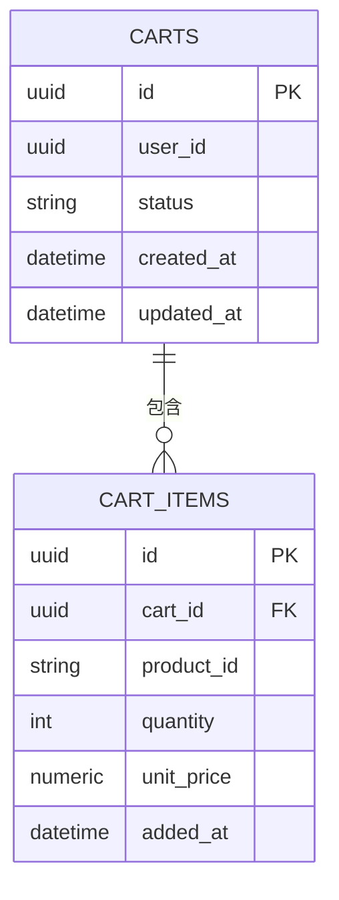
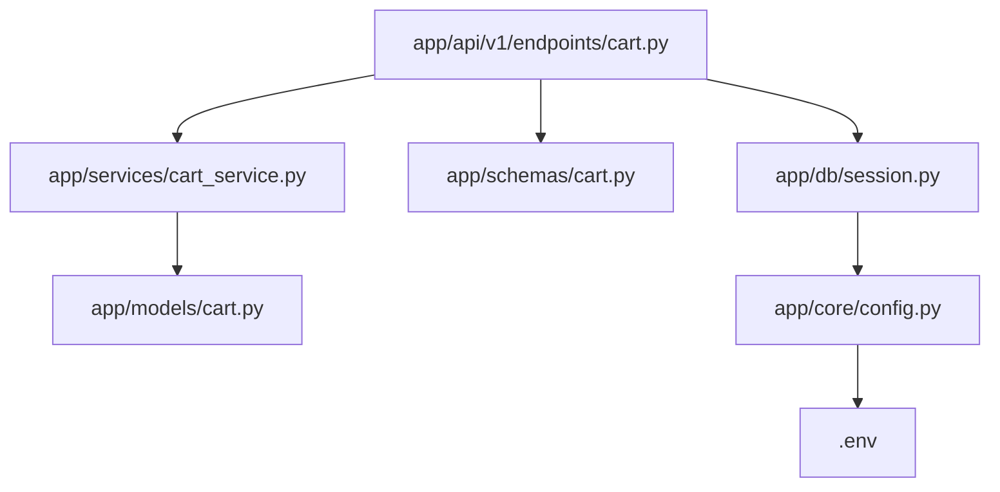

# 查询购物车详情

<cite>
**本文引用的文件**
- [app/services/cart_service.py](file://app/services/cart_service.py)
- [app/api/v1/endpoints/cart.py](file://app/api/v1/endpoints/cart.py)
- [app/models/cart.py](file://app/models/cart.py)
- [app/schemas/cart.py](file://app/schemas/cart.py)
- [app/db/session.py](file://app/db/session.py)
- [app/api/v1/router.py](file://app/api/v1/router.py)
- [app/main.py](file://app/main.py)
- [alembic/versions/286c2307065b_create_cart_tables.py](file://alembic/versions/286c2307065b_create_cart_tables.py)
- [app/core/config.py](file://app/core/config.py)
- [.env](file://.env)
</cite>

## 目录
1. [简介](#简介)
2. [项目结构](#项目结构)
3. [核心组件](#核心组件)
4. [架构总览](#架构总览)
5. [详细组件分析](#详细组件分析)
6. [依赖关系分析](#依赖关系分析)
7. [性能考量](#性能考量)
8. [故障排查指南](#故障排查指南)
9. [结论](#结论)
10. [附录](#附录)

## 简介
本文件围绕“查询购物车详情”这一核心场景，深入解析以下要点：
- 服务方法如何通过 AsyncSession 使用 selectinload 一次性加载购物车及其关联的商品项，避免 N+1 查询问题。
- API 端点如何在获取购物车后调用 calculate_total 计算总价，并将结果填充进 CartResponse 响应模型。
- 实际调用示例与最佳实践，帮助读者快速上手。
- 对比延迟加载与预加载的差异及性能优势。
- 在高并发读取场景下可考虑的缓存策略扩展点与优化建议。

## 项目结构
该项目采用分层清晰的 FastAPI + SQLAlchemy Async 架构：
- 路由层：API 路由与端点定义，负责请求接收与响应封装。
- 业务层：CartService 提供购物车相关的核心业务逻辑。
- 模型层：SQLAlchemy ORM 模型定义购物车与商品项的关系。
- 模式层：Pydantic 模型用于请求/响应的数据校验与序列化。
- 数据库层：AsyncSession 工厂与引擎配置，提供依赖注入。
- 迁移层：Alembic 管理数据库表结构演进。

图表来源
- [app/main.py](file://app/main.py#L1-L17)
- [app/api/v1/router.py](file://app/api/v1/router.py#L1-L6)
- [app/api/v1/endpoints/cart.py](file://app/api/v1/endpoints/cart.py#L1-L65)
- [app/services/cart_service.py](file://app/services/cart_service.py#L1-L125)
- [app/models/cart.py](file://app/models/cart.py#L1-L37)
- [app/schemas/cart.py](file://app/schemas/cart.py#L1-L46)
- [app/db/session.py](file://app/db/session.py#L1-L24)
- [app/core/config.py](file://app/core/config.py#L1-L18)
- [.env](file://.env#L1-L1)
- [alembic/versions/286c2307065b_create_cart_tables.py](file://alembic/versions/286c2307065b_create_cart_tables.py#L1-L55)

章节来源
- [app/main.py](file://app/main.py#L1-L17)
- [app/api/v1/router.py](file://app/api/v1/router.py#L1-L6)
- [app/api/v1/endpoints/cart.py](file://app/api/v1/endpoints/cart.py#L1-L65)
- [app/services/cart_service.py](file://app/services/cart_service.py#L1-L125)
- [app/models/cart.py](file://app/models/cart.py#L1-L37)
- [app/schemas/cart.py](file://app/schemas/cart.py#L1-L46)
- [app/db/session.py](file://app/db/session.py#L1-L24)
- [app/core/config.py](file://app/core/config.py#L1-L18)
- [.env](file://.env#L1-L1)
- [alembic/versions/286c2307065b_create_cart_tables.py](file://alembic/versions/286c2307065b_create_cart_tables.py#L1-L55)

## 核心组件
- 购物车模型与关系
  - Cart 与 CartItem 通过外键关联，Cart.items 为一对多关系，支持级联删除。
- 服务方法
  - get_cart 使用 selectinload 预加载 Cart.items，避免 N+1 查询。
  - calculate_total 在内存中按商品项逐项计算总价。
- API 端点
  - GET /api/v1/carts/{cart_id} 返回 CartResponse，其中 total_price 由服务层计算并注入。
- 数据库会话
  - AsyncSessionLocal 提供异步会话工厂，get_db 作为 FastAPI 依赖注入提供会话生命周期管理。

章节来源
- [app/models/cart.py](file://app/models/cart.py#L1-L37)
- [app/services/cart_service.py](file://app/services/cart_service.py#L1-L125)
- [app/api/v1/endpoints/cart.py](file://app/api/v1/endpoints/cart.py#L1-L65)
- [app/db/session.py](file://app/db/session.py#L1-L24)

## 架构总览
下面以“查询购物车详情”的完整流程为例，展示从 API 到数据库再到响应模型的调用链路。

图表来源
- [app/api/v1/endpoints/cart.py](file://app/api/v1/endpoints/cart.py#L14-L21)
- [app/services/cart_service.py](file://app/services/cart_service.py#L14-L23)
- [app/services/cart_service.py](file://app/services/cart_service.py#L122-L125)

## 详细组件分析

### 服务方法：get_cart 与 selectinload 预加载
- 查询策略
  - 使用 selectinload(Cart.items) 将主表与关联表一次性加载，避免后续访问 items 时触发 N+1 查询。
- 错误处理
  - 若未找到购物车，抛出 404 异常，确保 API 行为一致。
- 复杂度分析
  - 单次查询加载主表与关联表，时间复杂度 O(1)，空间复杂度与商品项数量线性相关。
- 与延迟加载对比
  - 延迟加载：首次仅加载主对象，访问 items 时再发查询，导致 N+1 查询，性能差。
  - 预加载（selectinload）：一次性抓取主表与关联表，减少查询次数，提升吞吐量。

图表来源
- [app/services/cart_service.py](file://app/services/cart_service.py#L14-L23)

章节来源
- [app/services/cart_service.py](file://app/services/cart_service.py#L14-L23)

### API 端点：构建包含总金额的响应
- 端点行为
  - 调用 CartService.get_cart 获取购物车。
  - 调用 CartService.calculate_total 计算总价。
  - 使用 Pydantic 的 model_validate 将 Cart 转换为 CartResponse，并注入 total_price。
- 响应模型
  - CartResponse 包含购物车基础字段、items 列表与 total_price 字段，满足前端展示需求。

图表来源
- [app/api/v1/endpoints/cart.py](file://app/api/v1/endpoints/cart.py#L14-L21)
- [app/schemas/cart.py](file://app/schemas/cart.py#L32-L42)
- [app/services/cart_service.py](file://app/services/cart_service.py#L122-L125)

章节来源
- [app/api/v1/endpoints/cart.py](file://app/api/v1/endpoints/cart.py#L14-L21)
- [app/schemas/cart.py](file://app/schemas/cart.py#L32-L42)
- [app/services/cart_service.py](file://app/services/cart_service.py#L122-L125)

### 数据模型与关系
- Cart 与 CartItem 的关系
  - 一对多：一个购物车可包含多个商品项。
  - 级联删除：当购物车被删除时，其商品项也会被删除。
- 约束与索引
  - cart_items 上存在 (cart_id, product_id) 唯一约束，防止重复商品项。
  - carts.user_id 建有普通索引，便于按用户检索购物车。

图表来源
- [app/models/cart.py](file://app/models/cart.py#L10-L37)
- [alembic/versions/286c2307065b_create_cart_tables.py](file://alembic/versions/286c2307065b_create_cart_tables.py#L21-L45)

章节来源
- [app/models/cart.py](file://app/models/cart.py#L10-L37)
- [alembic/versions/286c2307065b_create_cart_tables.py](file://alembic/versions/286c2307065b_create_cart_tables.py#L21-L45)

### 依赖注入与数据库会话
- 会话工厂
  - AsyncSessionLocal 使用 AsyncSession 作为类，禁用自动过期，避免提交后对象失效。
- 依赖提供
  - get_db 在每次请求中创建会话，结束后关闭，保证资源回收。
- 配置来源
  - DATABASE_URL 来自环境变量，通过 Settings.lru_cache 缓存读取。

图表来源
- [app/core/config.py](file://app/core/config.py#L1-L18)
- [app/db/session.py](file://app/db/session.py#L1-L24)
- [.env](file://.env#L1-L1)

章节来源
- [app/core/config.py](file://app/core/config.py#L1-L18)
- [app/db/session.py](file://app/db/session.py#L1-L24)
- [.env](file://.env#L1-L1)

## 依赖关系分析
- 组件耦合
  - 端点依赖服务层；服务层依赖模型层；端点与服务层均依赖会话工厂。
- 直接与间接依赖
  - 端点直接依赖服务层；服务层直接依赖模型层；端点间接依赖会话工厂。
- 外部依赖
  - FastAPI、SQLAlchemy Async、asyncpg、Alembic。

图表来源
- [app/api/v1/endpoints/cart.py](file://app/api/v1/endpoints/cart.py#L1-L65)
- [app/services/cart_service.py](file://app/services/cart_service.py#L1-L125)
- [app/models/cart.py](file://app/models/cart.py#L1-L37)
- [app/schemas/cart.py](file://app/schemas/cart.py#L1-L46)
- [app/db/session.py](file://app/db/session.py#L1-L24)
- [app/core/config.py](file://app/core/config.py#L1-L18)
- [.env](file://.env#L1-L1)

章节来源
- [app/api/v1/endpoints/cart.py](file://app/api/v1/endpoints/cart.py#L1-L65)
- [app/services/cart_service.py](file://app/services/cart_service.py#L1-L125)
- [app/models/cart.py](file://app/models/cart.py#L1-L37)
- [app/schemas/cart.py](file://app/schemas/cart.py#L1-L46)
- [app/db/session.py](file://app/db/session.py#L1-L24)
- [app/core/config.py](file://app/core/config.py#L1-L18)
- [.env](file://.env#L1-L1)

## 性能考量
- 预加载 vs 延迟加载
  - 预加载（selectinload）：一次查询抓取主表与关联表，适合读多写少、需要完整数据的场景，降低网络往返与数据库压力。
  - 延迟加载：按需触发查询，适合数据体量大且只读主表的场景，但可能引发 N+1 查询。
- 计算位置
  - calculate_total 在服务层进行内存计算，简单高效；若商品项极多，可考虑数据库侧聚合以减少传输。
- 并发与缓存
  - 高并发读取时，可在应用层引入只读缓存（如 Redis）存放热门购物车的序列化结果，命中则直接返回，降低数据库压力。
  - 缓存键建议使用 cart_id，并设置合理过期时间；写操作（新增/更新/删除商品项）时主动失效对应缓存。
- 数据库层面
  - 为 carts.user_id 建立索引，加速按用户检索。
  - 控制单次查询返回的商品项数量上限，避免一次性返回过多数据。

[本节为通用性能建议，不直接分析具体文件，故无章节来源]

## 故障排查指南
- 404 未找到购物车
  - 现象：调用 GET /api/v1/carts/{cart_id} 返回 404。
  - 可能原因：cart_id 不存在或已被清理。
  - 处理建议：确认 cart_id 是否正确，或先调用创建接口初始化购物车。
- 数据库连接失败
  - 现象：启动时报错提示认证失败或无法连接。
  - 可能原因：DATABASE_URL 不正确或数据库未启动。
  - 处理建议：核对 .env 中 DATABASE_URL，确保数据库服务运行正常。
- 响应模型字段缺失
  - 现象：返回的 CartResponse 缺少 total_price。
  - 可能原因：端点未调用 calculate_total 或未设置 response.total_price。
  - 处理建议：检查端点实现，确保在构造响应前完成总价计算与赋值。

章节来源
- [app/services/cart_service.py](file://app/services/cart_service.py#L14-L23)
- [app/api/v1/endpoints/cart.py](file://app/api/v1/endpoints/cart.py#L14-L21)
- [app/core/config.py](file://app/core/config.py#L1-L18)
- [.env](file://.env#L1-L1)

## 结论
- get_cart 通过 selectinload 预加载购物车与其商品项，有效避免 N+1 查询，提升读取性能。
- API 端点在获取购物车后调用 calculate_total 计算总价，并将结果注入 CartResponse，形成完整的响应。
- 在高并发场景下，建议结合应用层缓存与数据库索引优化，进一步提升吞吐与稳定性。

[本节为总结性内容，不直接分析具体文件，故无章节来源]

## 附录

### 实际调用示例（步骤说明）
- 步骤 1：创建购物车（可选，若尚未创建）
  - 调用 POST /api/v1/carts，Body 为 CartCreate。
- 步骤 2：添加商品项（可选，若需要）
  - 调用 POST /api/v1/carts/{cart_id}/items，Body 为 CartItemCreate。
- 步骤 3：查询购物车详情
  - 调用 GET /api/v1/carts/{cart_id}
  - 响应为 CartResponse，包含 items 列表与 total_price 字段。

章节来源
- [app/api/v1/endpoints/cart.py](file://app/api/v1/endpoints/cart.py#L14-L21)
- [app/schemas/cart.py](file://app/schemas/cart.py#L32-L42)