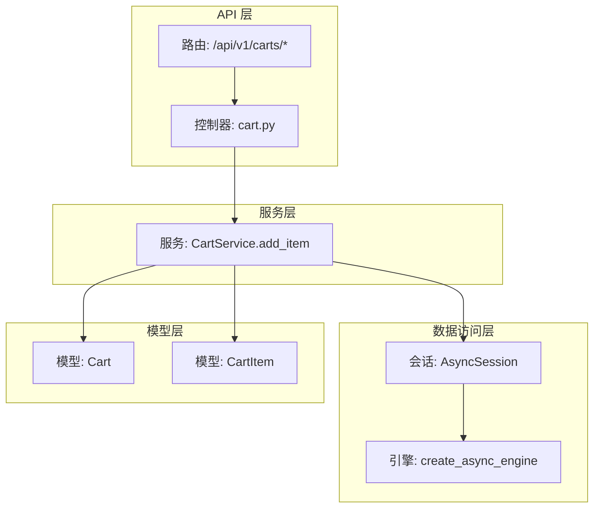
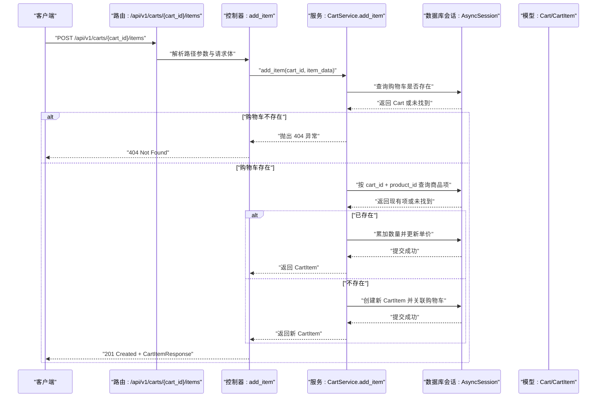
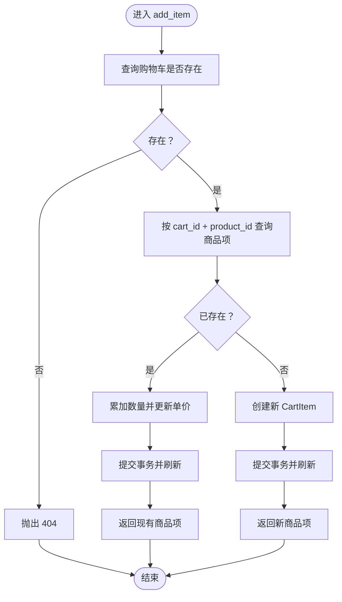
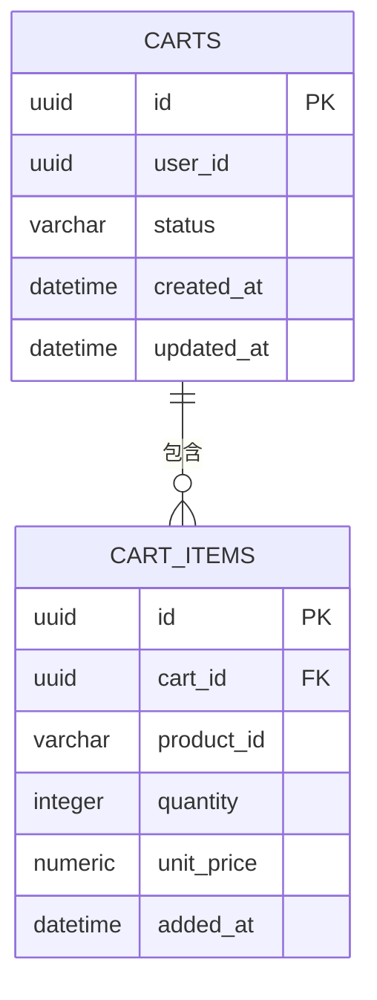
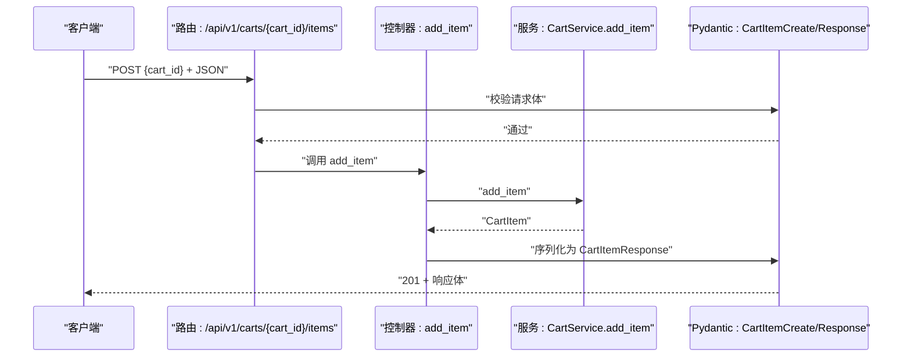
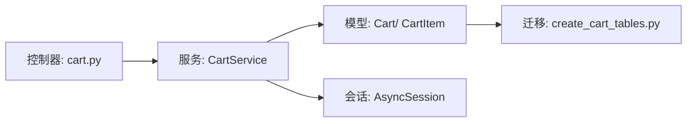

# 添加商品到购物车

<cite>
**本文引用的文件**
- [app/services/cart_service.py](file://app/services/cart_service.py)
- [app/models/cart.py](file://app/models/cart.py)
- [app/schemas/cart.py](file://app/schemas/cart.py)
- [app/api/v1/endpoints/cart.py](file://app/api/v1/endpoints/cart.py)
- [app/api/v1/router.py](file://app/api/v1/router.py)
- [app/db/session.py](file://app/db/session.py)
- [app/core/config.py](file://app/core/config.py)
- [alembic/versions/286c2307065b_create_cart_tables.py](file://alembic/versions/286c2307065b_create_cart_tables.py)
- [README.md](file://README.md)
</cite>

## 目录
1. [简介](#简介)
2. [项目结构](#项目结构)
3. [核心组件](#核心组件)
4. [架构总览](#架构总览)
5. [详细组件分析](#详细组件分析)
6. [依赖关系分析](#依赖关系分析)
7. [性能考量](#性能考量)
8. [故障排查指南](#故障排查指南)
9. [结论](#结论)
10. [附录](#附录)

## 简介
本文件围绕“添加商品到购物车”的核心业务流程进行系统化说明，重点解析服务方法 add_item 的业务规则：当购物车中已存在相同商品时，执行数量叠加并更新单价；否则创建新的购物车条目。同时，文档覆盖购物车存在性验证、事务完整性与并发安全现状、API 端点的请求参数映射与响应机制，并给出典型使用场景与潜在问题（如超卖风险），以及未来引入库存校验的扩展建议。

## 项目结构
该项目采用分层清晰的 FastAPI + SQLAlchemy 异步架构：
- API 层：定义路由与控制器，负责请求解析、响应封装与调用服务层
- 服务层：封装业务逻辑，如购物车存在性校验、商品添加、合并等
- 模型层：定义数据库表结构与约束
- 数据访问层：异步会话管理与数据库引擎配置
- 配置层：读取环境变量与应用配置

图表来源
- [app/api/v1/endpoints/cart.py](file://app/api/v1/endpoints/cart.py#L1-L65)
- [app/services/cart_service.py](file://app/services/cart_service.py#L1-L125)
- [app/db/session.py](file://app/db/session.py#L1-L24)
- [app/models/cart.py](file://app/models/cart.py#L1-L37)

章节来源
- [README.md](file://README.md#L43-L60)
- [app/api/v1/router.py](file://app/api/v1/router.py#L1-L6)
- [app/api/v1/endpoints/cart.py](file://app/api/v1/endpoints/cart.py#L1-L65)
- [app/services/cart_service.py](file://app/services/cart_service.py#L1-L125)
- [app/db/session.py](file://app/db/session.py#L1-L24)
- [app/models/cart.py](file://app/models/cart.py#L1-L37)

## 核心组件
- 服务类 CartService：提供购物车与商品项的增删改查、合并、清空、总价计算等能力
- 模型 Cart/ CartItem：定义表结构、唯一约束与检查约束
- API 控制器：暴露 /api/v1/carts/{cart_id}/items 端点，接收请求体并返回标准化响应
- 数据库会话：通过异步会话管理事务边界

章节来源
- [app/services/cart_service.py](file://app/services/cart_service.py#L1-L125)
- [app/models/cart.py](file://app/models/cart.py#L1-L37)
- [app/api/v1/endpoints/cart.py](file://app/api/v1/endpoints/cart.py#L1-L65)
- [app/db/session.py](file://app/db/session.py#L1-L24)

## 架构总览
下图展示从 API 请求到数据库写入的完整调用链路，包括存在性校验、重复项检测、事务提交与刷新。

图表来源
- [app/api/v1/endpoints/cart.py](file://app/api/v1/endpoints/cart.py#L31-L35)
- [app/services/cart_service.py](file://app/services/cart_service.py#L33-L61)
- [app/models/cart.py](file://app/models/cart.py#L1-L37)

## 详细组件分析

### add_item 业务规则与实现要点
- 存在性验证：先通过购物车主键查询购物车，不存在则抛出 404
- 重复项检测：按 cart_id 与 product_id 组合查询商品项
- 已存在处理：数量累加、单价更新，提交并刷新实体
- 新建处理：创建 CartItem 并关联购物车，提交并刷新实体
- 事务完整性：每个分支均在当前会话内完成 commit，保证原子性
- 并发安全现状：当前实现未显式加锁，存在锁竞争风险（见“并发安全”章节）

图表来源
- [app/services/cart_service.py](file://app/services/cart_service.py#L33-L61)

章节来源
- [app/services/cart_service.py](file://app/services/cart_service.py#L33-L61)

### 购物车与商品项模型约束
- 唯一约束：cart_id + product_id 唯一，避免同商品重复出现
- 正数检查：quantity > 0，保证数量为正
- 外键级联：CartItem 删除时自动清理孤儿项
- 时间戳：updated_at 自动更新，便于追踪变更

图表来源
- [app/models/cart.py](file://app/models/cart.py#L1-L37)
- [alembic/versions/286c2307065b_create_cart_tables.py](file://alembic/versions/286c2307065b_create_cart_tables.py#L21-L45)

章节来源
- [app/models/cart.py](file://app/models/cart.py#L1-L37)
- [alembic/versions/286c2307065b_create_cart_tables.py](file://alembic/versions/286c2307065b_create_cart_tables.py#L21-L45)

### API 端点与参数映射
- 端点：POST /api/v1/carts/{cart_id}/items
- 请求参数映射：
  - 路径参数：cart_id（UUID）
  - 请求体：CartItemCreate（product_id、quantity、unit_price）
- 响应返回：CartItemResponse（包含 id、cart_id、product_id、quantity、unit_price、added_at）

图表来源
- [app/api/v1/endpoints/cart.py](file://app/api/v1/endpoints/cart.py#L31-L35)
- [app/schemas/cart.py](file://app/schemas/cart.py#L1-L46)
- [app/services/cart_service.py](file://app/services/cart_service.py#L33-L61)

章节来源
- [app/api/v1/endpoints/cart.py](file://app/api/v1/endpoints/cart.py#L31-L35)
- [app/schemas/cart.py](file://app/schemas/cart.py#L1-L46)

### 典型使用场景示例
- 场景一：用户多次添加同一商品
  - 第一次添加：创建新 CartItem
  - 第二次添加：命中重复项，数量累加，单价更新
- 场景二：不同商品分别添加
  - 分别创建多个 CartItem，各自独立计数
- 场景三：购物车不存在
  - 调用前需先创建购物车，否则 add_item 将返回 404

章节来源
- [app/services/cart_service.py](file://app/services/cart_service.py#L33-L61)
- [app/api/v1/endpoints/cart.py](file://app/api/v1/endpoints/cart.py#L31-L35)

### 并发安全与事务完整性
- 事务完整性：add_item 在当前会话内完成查询、更新或插入，并在分支末尾提交，保证原子性
- 并发安全现状：当前实现未显式加锁，存在以下风险：
  - 锁竞争：多线程或多进程同时添加同一商品可能导致竞态条件
  - 超卖风险：若后续引入库存校验，当前未加锁可能引发库存透支
- 建议改进方向：
  - 使用数据库级约束（如唯一索引 + 检查约束）与乐观/悲观锁
  - 在服务层引入分布式锁或数据库行级锁
  - 对库存校验与扣减进行原子化处理

章节来源
- [app/services/cart_service.py](file://app/services/cart_service.py#L33-L61)
- [app/models/cart.py](file://app/models/cart.py#L1-L37)

### 潜在问题与扩展建议
- 超卖风险：当前未校验库存，若用户频繁添加同一商品且无库存限制，可能出现超卖
- 扩展方式建议：
  - 在 add_item 中引入库存校验（如查询商品库存并比较）
  - 若库存不足，返回错误或拒绝添加
  - 结合事务与锁策略，确保库存扣减的原子性

章节来源
- [app/services/cart_service.py](file://app/services/cart_service.py#L33-L61)
- [app/models/cart.py](file://app/models/cart.py#L1-L37)

## 依赖关系分析
- 控制器依赖服务层：API 控制器仅负责参数解析与响应封装，具体业务逻辑委托给 CartService
- 服务层依赖模型与会话：通过 SQLAlchemy 异步会话执行查询与写入
- 数据库约束依赖模型定义：唯一约束与检查约束在模型与迁移脚本中共同生效

图表来源
- [app/api/v1/endpoints/cart.py](file://app/api/v1/endpoints/cart.py#L1-L65)
- [app/services/cart_service.py](file://app/services/cart_service.py#L1-L125)
- [app/models/cart.py](file://app/models/cart.py#L1-L37)
- [alembic/versions/286c2307065b_create_cart_tables.py](file://alembic/versions/286c2307065b_create_cart_tables.py#L21-L45)

章节来源
- [app/api/v1/endpoints/cart.py](file://app/api/v1/endpoints/cart.py#L1-L65)
- [app/services/cart_service.py](file://app/services/cart_service.py#L1-L125)
- [app/models/cart.py](file://app/models/cart.py#L1-L37)
- [alembic/versions/286c2307065b_create_cart_tables.py](file://alembic/versions/286c2307065b_create_cart_tables.py#L21-L45)

## 性能考量
- 异步 I/O：使用 SQLAlchemy 2.0 异步引擎与会话，减少阻塞
- 查询优化：按 cart_id + product_id 的组合查询，命中唯一约束，查询效率高
- 事务粒度：单次 add_item 仅包含必要的读写操作，事务开销小
- 建议：在高频场景下，可考虑缓存购物车与商品项的热点数据以降低数据库压力

## 故障排查指南
- 404 未找到购物车
  - 现象：调用 add_item 返回 404
  - 排查：确认 cart_id 是否正确，是否已创建购物车
  - 参考：服务层存在性校验逻辑
- 重复项未合并
  - 现象：多次添加同一商品未叠加数量
  - 排查：确认 product_id 是否一致，唯一约束是否生效
  - 参考：模型唯一约束与服务层重复项检测
- 单价未更新
  - 现象：重复项数量叠加但单价未更新
  - 排查：确认请求体中的 unit_price 是否传入并大于 0
  - 参考：请求体校验与服务层更新逻辑
- 并发冲突
  - 现象：高并发下出现竞态或超卖
  - 排查：引入锁策略与库存校验
  - 参考：并发安全现状与扩展建议

章节来源
- [app/services/cart_service.py](file://app/services/cart_service.py#L14-L23)
- [app/models/cart.py](file://app/models/cart.py#L22-L37)
- [app/schemas/cart.py](file://app/schemas/cart.py#L1-L16)

## 结论
add_item 方法通过明确的存在性验证、重复项检测与事务提交，实现了“已存在则叠加、不存在则新建”的核心业务规则。当前实现具备良好的事务完整性，但在并发环境下存在锁竞争风险。建议在后续版本中引入库存校验与锁策略，以进一步提升系统的可靠性与一致性。

## 附录
- 环境配置：数据库 URL 由配置模块提供，异步会话由会话工厂创建
- 数据库迁移：迁移脚本定义了 carts 与 cart_items 的表结构与约束

章节来源
- [app/core/config.py](file://app/core/config.py#L1-L18)
- [app/db/session.py](file://app/db/session.py#L1-L24)
- [alembic/versions/286c2307065b_create_cart_tables.py](file://alembic/versions/286c2307065b_create_cart_tables.py#L21-L45)