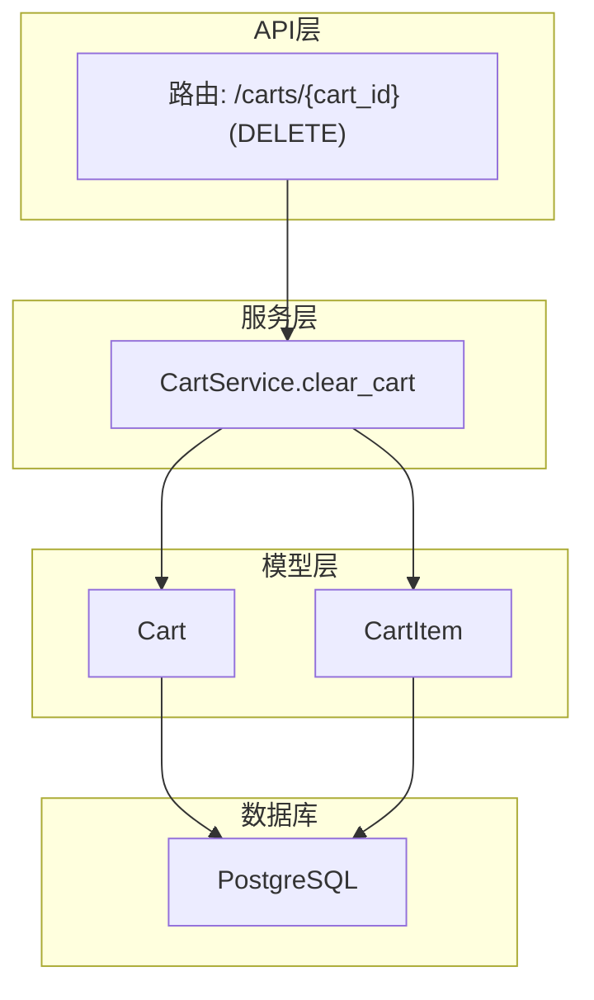
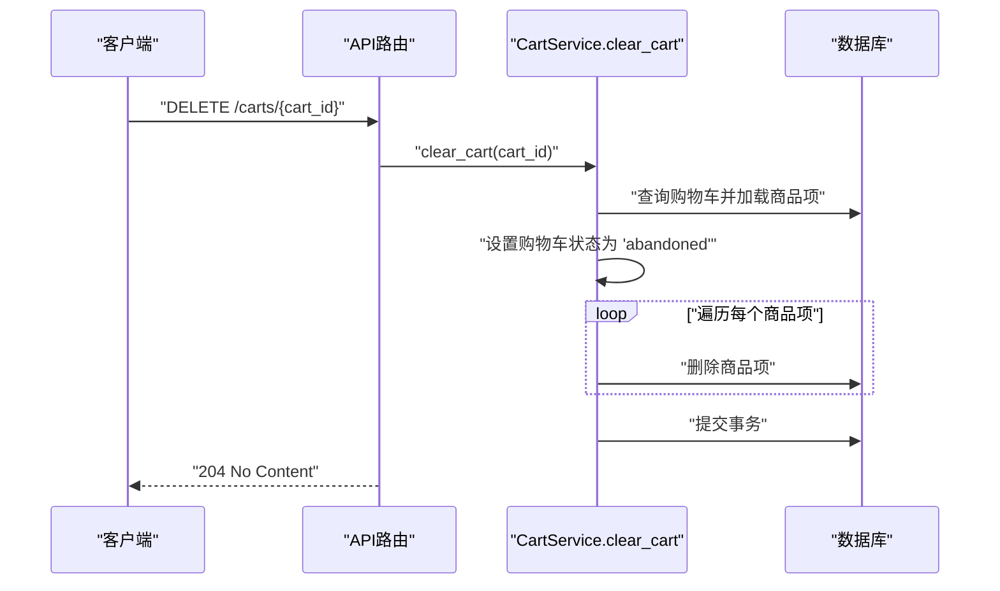
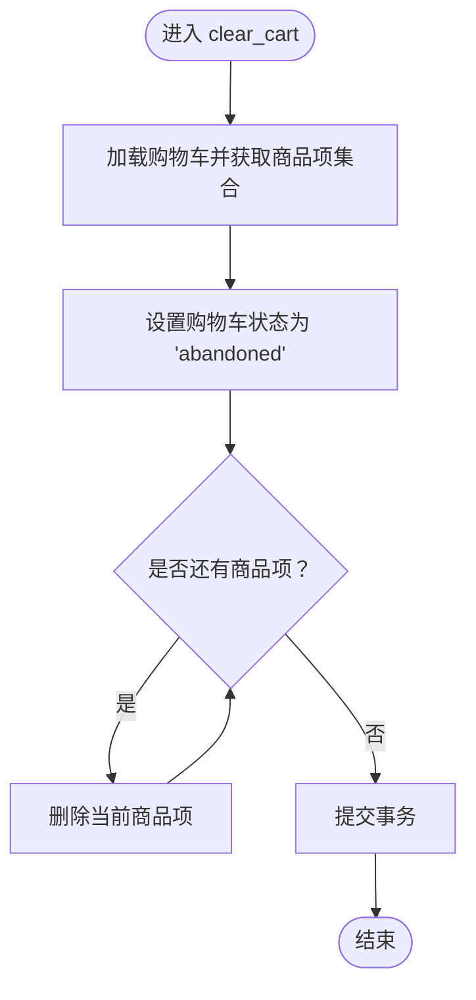
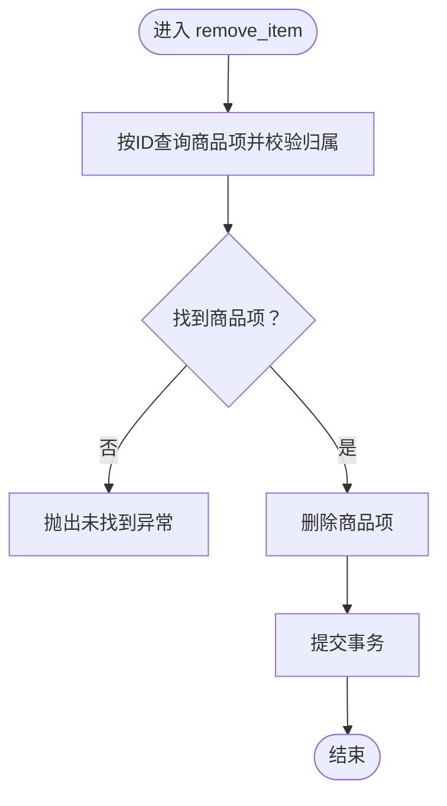
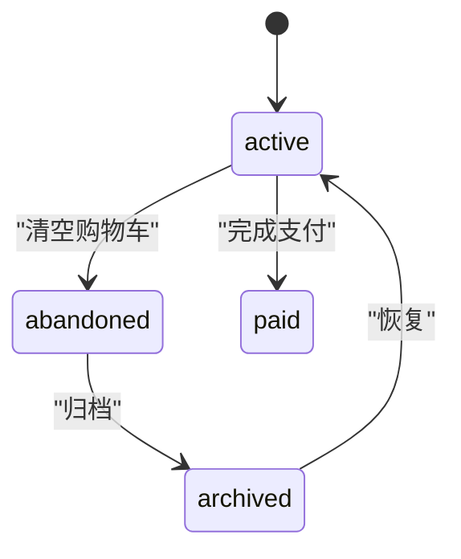

# 清空购物车

<cite>
**本文引用的文件**
- [app/services/cart_service.py](file://app/services/cart_service.py)
- [app/api/v1/endpoints/cart.py](file://app/api/v1/endpoints/cart.py)
- [app/models/cart.py](file://app/models/cart.py)
- [alembic/versions/286c2307065b_create_cart_tables.py](file://alembic/versions/286c2307065b_create_cart_tables.py)
- [app/schemas/cart.py](file://app/schemas/cart.py)
- [app/db/session.py](file://app/db/session.py)
- [app/core/config.py](file://app/core/config.py)
- [README.md](file://README.md)
</cite>

## 目录
1. [简介](#简介)
2. [项目结构](#项目结构)
3. [核心组件](#核心组件)
4. [架构总览](#架构总览)
5. [详细组件分析](#详细组件分析)
6. [依赖关系分析](#依赖关系分析)
7. [性能考量](#性能考量)
8. [故障排查指南](#故障排查指南)
9. [结论](#结论)
10. [附录](#附录)

## 简介
本节聚焦“清空购物车”能力，即服务方法如何将购物车状态标记为“abandoned”，并删除所有关联的商品项；同时对比“逐项移除”（remove_item）的批量执行方式，强调在事务内完成主从记录清理；解释API设计为何返回204状态码而不返回资源；给出典型使用场景（如用户结算后或主动清空）；最后讨论状态机设计的合理性以及未来可扩展的状态流转（如归档、恢复）。

## 项目结构
- API路由层：定义了清空购物车接口，并映射到服务层。
- 服务层：实现业务逻辑，包括清空购物车、逐项移除等。
- 模型层：定义购物车与商品项的数据结构及约束。
- 数据库会话：提供异步数据库会话依赖注入。
- 配置与迁移：数据库连接配置与表结构迁移脚本。

图表来源
- [app/api/v1/endpoints/cart.py](file://app/api/v1/endpoints/cart.py#L45-L55)
- [app/services/cart_service.py](file://app/services/cart_service.py#L89-L96)
- [app/models/cart.py](file://app/models/cart.py#L10-L37)

章节来源
- [README.md](file://README.md#L43-L60)
- [app/api/v1/endpoints/cart.py](file://app/api/v1/endpoints/cart.py#L1-L65)
- [app/services/cart_service.py](file://app/services/cart_service.py#L1-L125)
- [app/models/cart.py](file://app/models/cart.py#L1-L37)

## 核心组件
- 清空购物车服务方法：将购物车状态标记为“abandoned”，并删除该购物车下的全部商品项，提交事务。
- 逐项移除服务方法：按商品项ID删除单个商品，提交事务。
- API端点：DELETE /carts/{cart_id} 对应清空购物车；DELETE /carts/{cart_id}/items/{item_id} 对应逐项移除。
- 数据模型：购物车与商品项的关系通过外键和级联删除约束保证一致性。

章节来源
- [app/services/cart_service.py](file://app/services/cart_service.py#L77-L96)
- [app/api/v1/endpoints/cart.py](file://app/api/v1/endpoints/cart.py#L45-L55)
- [app/models/cart.py](file://app/models/cart.py#L10-L37)

## 架构总览
清空购物车的调用链路如下：
- 客户端请求：DELETE /carts/{cart_id}
- 路由器：匹配路径并调用对应处理器
- 处理器：调用服务层的清空购物车方法
- 服务层：加载购物车、设置状态为“abandoned”、遍历并删除所有商品项、提交事务
- 数据库：持久化变更

图表来源
- [app/api/v1/endpoints/cart.py](file://app/api/v1/endpoints/cart.py#L45-L55)
- [app/services/cart_service.py](file://app/services/cart_service.py#L89-L96)

## 详细组件分析

### 清空购物车服务方法（clear_cart）
- 读取购物车并加载商品项集合
- 将购物车状态字段更新为“abandoned”
- 遍历商品项集合，逐项删除
- 提交事务，确保主从记录在同一个事务中被清理

图表来源
- [app/services/cart_service.py](file://app/services/cart_service.py#L89-L96)

章节来源
- [app/services/cart_service.py](file://app/services/cart_service.py#L89-L96)

### 逐项移除服务方法（remove_item）
- 通过商品项ID查询并校验归属关系
- 删除该商品项并提交事务

图表来源
- [app/services/cart_service.py](file://app/services/cart_service.py#L77-L88)

章节来源
- [app/services/cart_service.py](file://app/services/cart_service.py#L77-L88)

### 清空购物车与逐项移除的区别
- 批量 vs 单条：clear_cart一次性删除所有商品项；remove_item每次只删除一个。
- 性能差异：clear_cart减少多次往返与循环开销；remove_item适合细粒度控制。
- 事务边界：两者均在单次事务中完成，避免中间态不一致。
- 并发影响：clear_cart可能产生更大范围的锁竞争；remove_item更细粒度。

章节来源
- [app/services/cart_service.py](file://app/services/cart_service.py#L77-L96)

### API设计与状态码选择（204）
- 端点：DELETE /carts/{cart_id}
- 返回：204 No Content
- 设计理由：
  - 清空购物车是幂等的副作用操作，不返回资源更符合REST语义
  - 204避免传输大体量响应体，提升性能
  - 客户端可通过后续GET /carts/{cart_id}确认状态变化

章节来源
- [app/api/v1/endpoints/cart.py](file://app/api/v1/endpoints/cart.py#L45-L55)

### 使用场景
- 用户结算完成后清空购物车，释放库存并标记为“abandoned”
- 用户主动清空购物车，准备重新添加商品
- 登录后合并匿名购物车时，源购物车被标记为“merged”，目标购物车可随后清空

章节来源
- [app/services/cart_service.py](file://app/services/cart_service.py#L98-L120)
- [app/api/v1/endpoints/cart.py](file://app/api/v1/endpoints/cart.py#L57-L65)

### 状态机设计与可扩展性
- 当前状态：active → abandoned（清空时）
- 可扩展状态：
  - 归档：abandoned → archived（用于历史数据隔离）
  - 恢复：archived → active（用户重新编辑购物车）
  - 结算：active → paid（与订单系统集成）
- 约束与一致性：
  - 数据库层通过外键与级联删除保证主从一致性
  - 业务层通过事务保证状态与数据的一致性

图表来源
- [app/models/cart.py](file://app/models/cart.py#L10-L18)
- [app/services/cart_service.py](file://app/services/cart_service.py#L89-L96)

章节来源
- [app/models/cart.py](file://app/models/cart.py#L10-L18)
- [app/services/cart_service.py](file://app/services/cart_service.py#L89-L96)

## 依赖关系分析
- 路由器依赖服务层
- 服务层依赖模型层（ORM）
- 模型层依赖数据库会话与配置
- 迁移脚本定义表结构与约束

图表来源
- [app/api/v1/endpoints/cart.py](file://app/api/v1/endpoints/cart.py#L1-L65)
- [app/services/cart_service.py](file://app/services/cart_service.py#L1-L125)
- [app/models/cart.py](file://app/models/cart.py#L1-L37)
- [app/db/session.py](file://app/db/session.py#L1-L24)
- [app/core/config.py](file://app/core/config.py#L1-L18)
- [alembic/versions/286c2307065b_create_cart_tables.py](file://alembic/versions/286c2307065b_create_cart_tables.py#L21-L44)

章节来源
- [app/api/v1/endpoints/cart.py](file://app/api/v1/endpoints/cart.py#L1-L65)
- [app/services/cart_service.py](file://app/services/cart_service.py#L1-L125)
- [app/models/cart.py](file://app/models/cart.py#L1-L37)
- [app/db/session.py](file://app/db/session.py#L1-L24)
- [app/core/config.py](file://app/core/config.py#L1-L18)
- [alembic/versions/286c2307065b_create_cart_tables.py](file://alembic/versions/286c2307065b_create_cart_tables.py#L21-L44)

## 性能考量
- 事务内批量删除：减少多次往返与循环开销，降低锁竞争
- 级联删除：数据库层自动处理子表删除，避免应用层循环
- 异步会话：基于异步IO，提高并发吞吐
- 幂等性：204返回避免额外响应体传输，降低网络开销

章节来源
- [app/services/cart_service.py](file://app/services/cart_service.py#L77-L96)
- [app/db/session.py](file://app/db/session.py#L1-L24)

## 故障排查指南
- 404未找到：当购物车不存在或商品项不存在时，服务层抛出HTTP 404
- 并发冲突：大量清空操作可能引发锁竞争，建议在业务层做重试与限流
- 状态不一致：确保所有写操作都在同一事务中完成，避免部分提交
- 数据一致性：检查外键与级联删除约束是否生效

章节来源
- [app/services/cart_service.py](file://app/services/cart_service.py#L14-L23)
- [app/services/cart_service.py](file://app/services/cart_service.py#L77-L88)
- [alembic/versions/286c2307065b_create_cart_tables.py](file://alembic/versions/286c2307065b_create_cart_tables.py#L21-L44)

## 结论
- 清空购物车通过服务层在事务内完成主从记录清理，确保一致性与性能
- 与逐项移除相比，清空购物车更适合批量清理场景
- API返回204符合REST语义，避免不必要的响应体传输
- 状态机设计简洁合理，具备良好的扩展空间（归档、恢复、结算）

## 附录
- 数据模型概览（字段与约束）
  - 购物车表：主键、用户ID、状态、创建/更新时间
  - 商品项表：主键、购物车ID（外键，级联删除）、商品ID、数量、单价、添加时间；唯一约束（购物车+商品），数量正数约束
- API端点
  - 清空购物车：DELETE /carts/{cart_id}，204 No Content
  - 逐项移除：DELETE /carts/{cart_id}/items/{item_id}，204 No Content

章节来源
- [app/models/cart.py](file://app/models/cart.py#L10-L37)
- [app/api/v1/endpoints/cart.py](file://app/api/v1/endpoints/cart.py#L45-L55)
- [README.md](file://README.md#L109-L118)