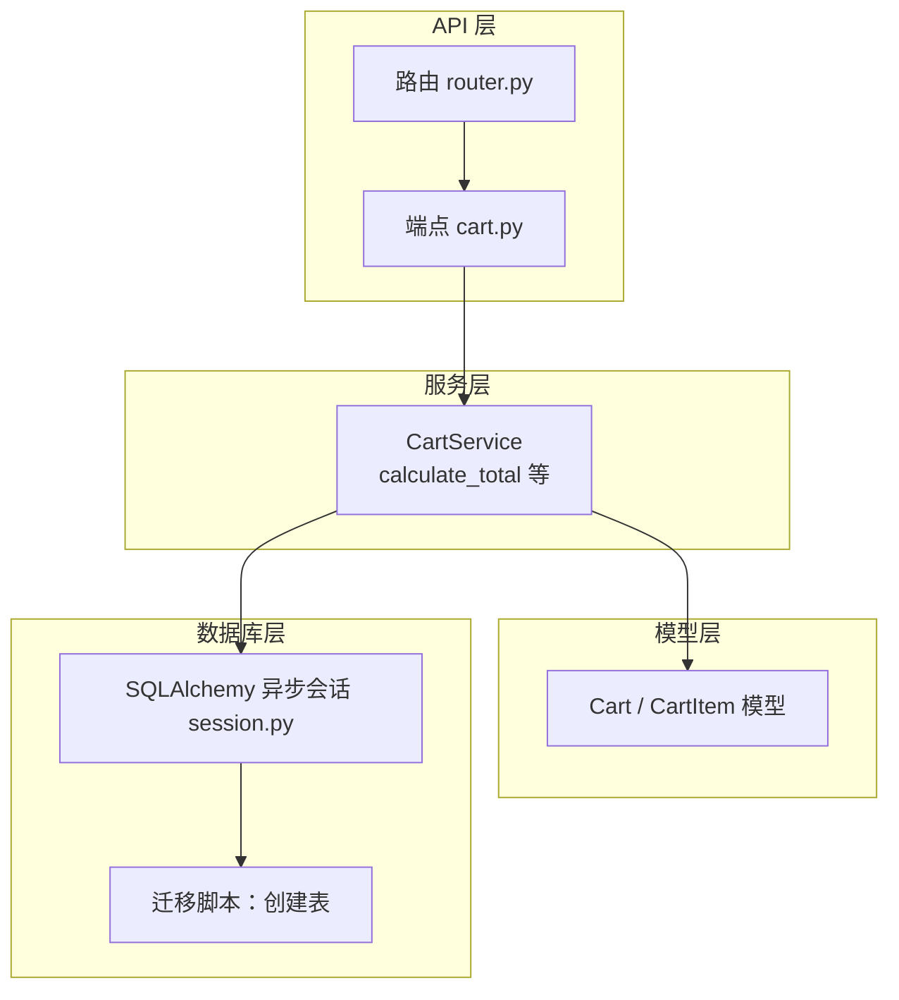
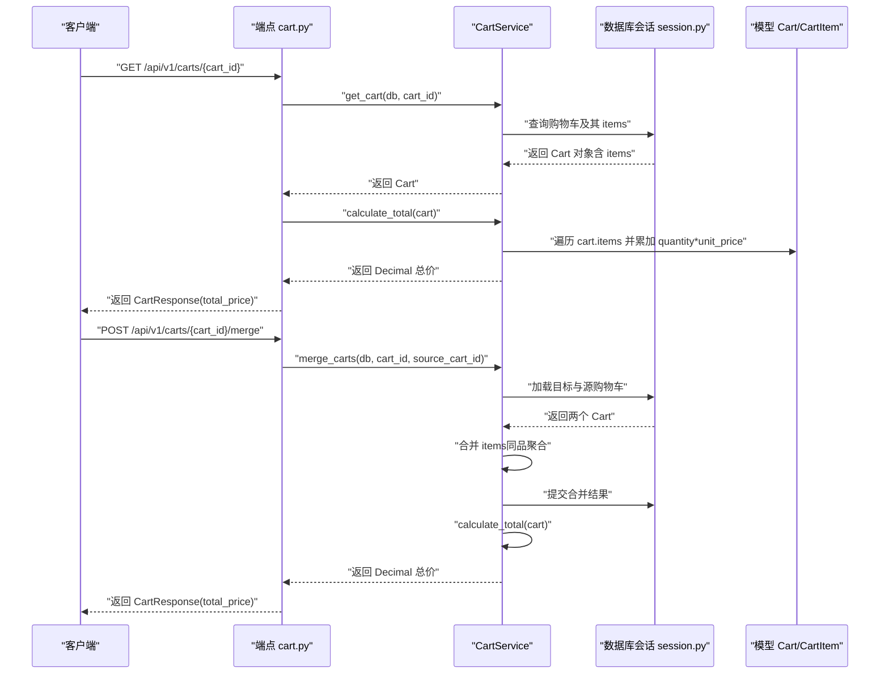
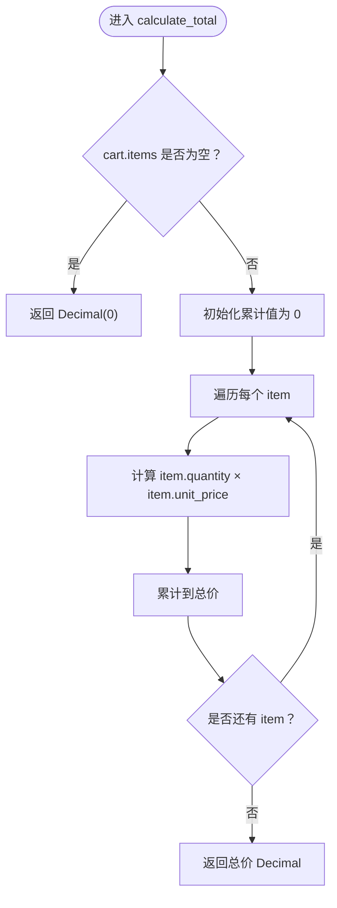
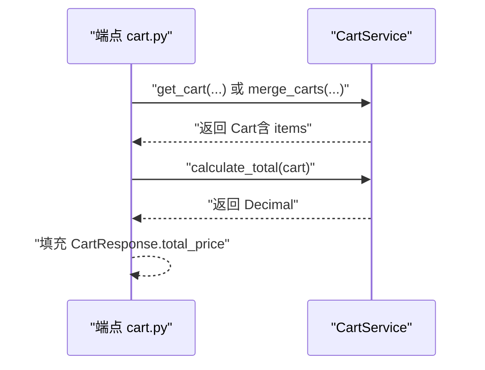
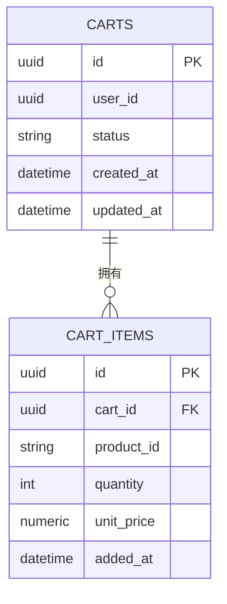
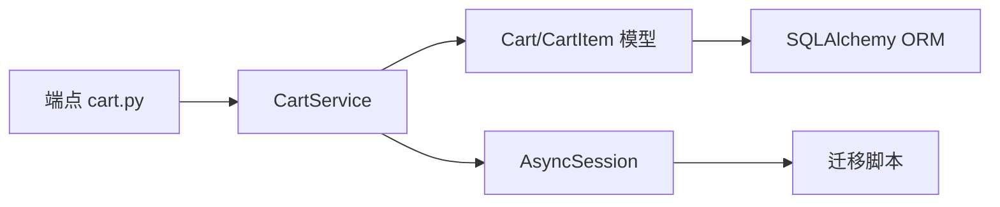

# 计算购物车总价

<cite>
**本文引用的文件**
- [app/models/cart.py](file://app/models/cart.py)
- [app/services/cart_service.py](file://app/services/cart_service.py)
- [app/api/v1/endpoints/cart.py](file://app/api/v1/endpoints/cart.py)
- [app/schemas/cart.py](file://app/schemas/cart.py)
- [app/db/session.py](file://app/db/session.py)
- [alembic/versions/286c2307065b_create_cart_tables.py](file://alembic/versions/286c2307065b_create_cart_tables.py)
- [app/main.py](file://app/main.py)
- [app/api/v1/router.py](file://app/api/v1/router.py)
</cite>

## 目录
1. [简介](#简介)
2. [项目结构](#项目结构)
3. [核心组件](#核心组件)
4. [架构总览](#架构总览)
5. [详细组件分析](#详细组件分析)
6. [依赖关系分析](#依赖关系分析)
7. [性能考量](#性能考量)
8. [故障排查指南](#故障排查指南)
9. [结论](#结论)
10. [附录](#附录)

## 简介
本文件围绕“购物车总价计算”这一核心业务点展开，重点说明以下内容：
- 静态方法 calculate_total 如何遍历 Cart.items 集合，通过 quantity × unit_price 累加得到总价，并返回 Decimal 类型以保证精度；
- 为什么总价不存储在数据库中而采用运行时计算，以及该设计在一致性与性能之间的权衡；
- calculate_total 在 get_cart 和 merge_carts API 中的调用时机；
- 商品数量极大时的性能影响与引入缓存字段的优化路径建议。

## 项目结构
该服务采用分层架构：API 层负责请求入口与响应模型；服务层封装业务逻辑；模型层定义数据结构与数据库映射；数据库会话由 SQLAlchemy 异步引擎提供。

图表来源
- [app/api/v1/router.py](file://app/api/v1/router.py#L1-L6)
- [app/api/v1/endpoints/cart.py](file://app/api/v1/endpoints/cart.py#L1-L65)
- [app/services/cart_service.py](file://app/services/cart_service.py#L1-L125)
- [app/models/cart.py](file://app/models/cart.py#L1-L37)
- [app/db/session.py](file://app/db/session.py#L1-L24)
- [alembic/versions/286c2307065b_create_cart_tables.py](file://alembic/versions/286c2307065b_create_cart_tables.py#L1-L55)

章节来源
- [app/main.py](file://app/main.py#L1-L17)
- [app/api/v1/router.py](file://app/api/v1/router.py#L1-L6)
- [app/api/v1/endpoints/cart.py](file://app/api/v1/endpoints/cart.py#L1-L65)
- [app/services/cart_service.py](file://app/services/cart_service.py#L1-L125)
- [app/models/cart.py](file://app/models/cart.py#L1-L37)
- [app/db/session.py](file://app/db/session.py#L1-L24)
- [alembic/versions/286c2307065b_create_cart_tables.py](file://alembic/versions/286c2307065b_create_cart_tables.py#L1-L55)

## 核心组件
- 数据模型
  - Cart：购物车实体，包含 items 关系，用于装载 CartItem。
  - CartItem：购物车条目，包含 product_id、quantity、unit_price 等字段。
- 服务层
  - CartService：封装购物车业务操作，其中 calculate_total 为静态方法，负责总价计算。
- API 层
  - 路由与端点：get_cart 与 merge_carts 两个 API 在返回前调用 calculate_total 计算总价。
- 响应模型
  - CartResponse：包含 items 列表与 total_price 字段，后者为 Decimal 类型。

章节来源
- [app/models/cart.py](file://app/models/cart.py#L1-L37)
- [app/services/cart_service.py](file://app/services/cart_service.py#L122-L125)
- [app/api/v1/endpoints/cart.py](file://app/api/v1/endpoints/cart.py#L14-L21)
- [app/api/v1/endpoints/cart.py](file://app/api/v1/endpoints/cart.py#L57-L65)
- [app/schemas/cart.py](file://app/schemas/cart.py#L32-L46)

## 架构总览
下面的序列图展示了 get_cart 与 merge_carts 的调用流程，以及 calculate_total 的插入时机。

图表来源
- [app/api/v1/endpoints/cart.py](file://app/api/v1/endpoints/cart.py#L14-L21)
- [app/api/v1/endpoints/cart.py](file://app/api/v1/endpoints/cart.py#L57-L65)
- [app/services/cart_service.py](file://app/services/cart_service.py#L12-L23)
- [app/services/cart_service.py](file://app/services/cart_service.py#L98-L121)
- [app/services/cart_service.py](file://app/services/cart_service.py#L122-L125)
- [app/db/session.py](file://app/db/session.py#L1-L24)

## 详细组件分析

### calculate_total 静态方法的实现与行为
- 遍历策略
  - 方法接收一个 Cart 实例，遍历其 items 集合。
  - 对每个条目执行 quantity × unit_price 的乘法运算。
  - 使用内置 sum 进行累加，得到总价。
- 精度保证
  - 返回值类型为 Decimal，确保金融计算的精度与一致性。
  - 单价与数量均使用 Decimal 存储于数据库，避免浮点误差累积。
- 复杂度与边界
  - 时间复杂度 O(n)，n 为购物车中商品条目的数量。
  - 当 items 为空时，返回 Decimal(0)。

图表来源
- [app/services/cart_service.py](file://app/services/cart_service.py#L122-L125)
- [app/models/cart.py](file://app/models/cart.py#L22-L37)
- [app/schemas/cart.py](file://app/schemas/cart.py#L32-L46)

章节来源
- [app/services/cart_service.py](file://app/services/cart_service.py#L122-L125)
- [app/models/cart.py](file://app/models/cart.py#L22-L37)
- [app/schemas/cart.py](file://app/schemas/cart.py#L32-L46)

### 为什么不把总价持久化到数据库？
- 设计动机
  - 价格可能随时间变化（促销、折扣、汇率等），若持久化总价，需要额外的“价格快照”机制或频繁更新历史记录，增加复杂度。
  - 运行时计算能保证“取数即算”的一致性，避免因数据不同步导致的账实不符。
- 一致性与性能权衡
  - 一致性：每次读取都基于当前 items 的最新单价与数量，避免陈旧总价带来的差异。
  - 性能：O(n) 的计算成本通常可接受；当 n 较大时，可通过缓存字段降低重复计算开销。
- 数据库结构支撑
  - 表结构仅包含 quantity 与 unit_price，未包含总价字段，符合“按需计算”的设计。

章节来源
- [alembic/versions/286c2307065b_create_cart_tables.py](file://alembic/versions/286c2307065b_create_cart_tables.py#L24-L44)
- [app/models/cart.py](file://app/models/cart.py#L22-L37)

### 在 get_cart 与 merge_carts 中的调用时机
- get_cart
  - 先通过 get_cart 获取包含 items 的 Cart。
  - 再调用 calculate_total 计算总价，填充到响应模型的 total_price 字段。
- merge_carts
  - 合并完成后，同样调用 calculate_total 计算新的总价，再返回响应。

图表来源
- [app/api/v1/endpoints/cart.py](file://app/api/v1/endpoints/cart.py#L14-L21)
- [app/api/v1/endpoints/cart.py](file://app/api/v1/endpoints/cart.py#L57-L65)
- [app/services/cart_service.py](file://app/services/cart_service.py#L12-L23)
- [app/services/cart_service.py](file://app/services/cart_service.py#L98-L121)
- [app/services/cart_service.py](file://app/services/cart_service.py#L122-L125)

章节来源
- [app/api/v1/endpoints/cart.py](file://app/api/v1/endpoints/cart.py#L14-L21)
- [app/api/v1/endpoints/cart.py](file://app/api/v1/endpoints/cart.py#L57-L65)
- [app/services/cart_service.py](file://app/services/cart_service.py#L12-L23)
- [app/services/cart_service.py](file://app/services/cart_service.py#L98-L121)
- [app/services/cart_service.py](file://app/services/cart_service.py#L122-L125)

### 数据模型与字段约束
- Cart
  - 主键 id，user_id（索引），status，created_at，updated_at。
  - items 关系，一对多关联到 CartItem。
- CartItem
  - 主键 id，cart_id 外键，product_id（唯一约束：cart_id+product_id），quantity（正整数约束），unit_price（Numeric(10,2)），added_at。
  - 反向关系 cart 指向所属购物车。

图表来源
- [app/models/cart.py](file://app/models/cart.py#L10-L37)
- [alembic/versions/286c2307065b_create_cart_tables.py](file://alembic/versions/286c2307065b_create_cart_tables.py#L24-L44)

章节来源
- [app/models/cart.py](file://app/models/cart.py#L10-L37)
- [alembic/versions/286c2307065b_create_cart_tables.py](file://alembic/versions/286c2307065b_create_cart_tables.py#L24-L44)

## 依赖关系分析
- 组件耦合
  - API 层依赖服务层；服务层依赖模型层与数据库会话；模型层依赖 SQLAlchemy ORM。
- 直接依赖
  - get_cart/merge_carts 调用 calculate_total。
  - calculate_total 依赖 Cart.items 与每个条目的 quantity/unit_price。
- 外部依赖
  - SQLAlchemy 异步引擎与会话管理。
  - Alembic 迁移脚本定义表结构。

图表来源
- [app/api/v1/endpoints/cart.py](file://app/api/v1/endpoints/cart.py#L14-L21)
- [app/api/v1/endpoints/cart.py](file://app/api/v1/endpoints/cart.py#L57-L65)
- [app/services/cart_service.py](file://app/services/cart_service.py#L12-L23)
- [app/services/cart_service.py](file://app/services/cart_service.py#L98-L121)
- [app/services/cart_service.py](file://app/services/cart_service.py#L122-L125)
- [app/db/session.py](file://app/db/session.py#L1-L24)
- [alembic/versions/286c2307065b_create_cart_tables.py](file://alembic/versions/286c2307065b_create_cart_tables.py#L24-L44)

章节来源
- [app/api/v1/endpoints/cart.py](file://app/api/v1/endpoints/cart.py#L14-L21)
- [app/api/v1/endpoints/cart.py](file://app/api/v1/endpoints/cart.py#L57-L65)
- [app/services/cart_service.py](file://app/services/cart_service.py#L12-L23)
- [app/services/cart_service.py](file://app/services/cart_service.py#L98-L121)
- [app/services/cart_service.py](file://app/services/cart_service.py#L122-L125)
- [app/db/session.py](file://app/db/session.py#L1-L24)
- [alembic/versions/286c2307065b_create_cart_tables.py](file://alembic/versions/286c2307065b_create_cart_tables.py#L24-L44)

## 性能考量
- 计算复杂度
  - calculate_total 为 O(n)，n 为购物车条目数。对于普通场景可忽略不计。
- 大量商品的潜在影响
  - 当 items 数量极大时，循环与 Decimal 运算会带来一定 CPU 开销。
  - 若频繁读取同一购物车，重复计算会造成不必要的资源消耗。
- 优化路径建议
  - 引入缓存字段
    - 在 Cart 模型中新增 total_price 字段，并在以下时机更新：
      - 新增/更新/删除条目时；
      - 合并购物车后；
      - 清空购物车时。
    - 通过触发器或业务层统一维护，避免分散更新。
  - 缓存策略
    - 使用内存缓存（如 Redis）存放热门购物车的总价，设置合理过期策略。
    - 对热点用户购物车进行预热，减少重复计算。
  - 批量计算
    - 对批量操作（如合并）采用一次性计算并写入缓存，避免多次往返数据库。
  - 响应模型
    - 保持 CartResponse.total_price 为 Decimal，确保前端显示与后续计算一致。

章节来源
- [app/services/cart_service.py](file://app/services/cart_service.py#L122-L125)
- [app/models/cart.py](file://app/models/cart.py#L10-L37)
- [app/schemas/cart.py](file://app/schemas/cart.py#L32-L46)

## 故障排查指南
- 常见问题
  - 未传入 items 或 items 为空：calculate_total 将返回 Decimal(0)，属于预期行为。
  - 数据库中 quantity 或 unit_price 不合法：应由模型层约束与校验保障，若出现异常需检查数据完整性。
  - 响应模型字段缺失：确认 CartResponse.total_price 已正确赋值。
- 排查步骤
  - 在 get_cart/merge_carts 中断点验证 cart.items 是否加载完整。
  - 检查 calculate_total 的输入是否为完整的 Cart 对象。
  - 核对 Decimal 精度与格式化输出，避免前端显示异常。
- 相关实现位置
  - get_cart/merge_carts 的调用与赋值逻辑位于端点文件。
  - calculate_total 的实现位于服务层。

章节来源
- [app/api/v1/endpoints/cart.py](file://app/api/v1/endpoints/cart.py#L14-L21)
- [app/api/v1/endpoints/cart.py](file://app/api/v1/endpoints/cart.py#L57-L65)
- [app/services/cart_service.py](file://app/services/cart_service.py#L122-L125)

## 结论
- calculate_total 通过遍历 Cart.items，以 Decimal 精确计算总价，满足金融级精度要求。
- 采用运行时计算而非持久化总价，简化了数据一致性处理，避免历史价格快照的复杂性。
- 在 get_cart 与 merge_carts 中分别在返回前调用 calculate_total，确保每次读取都得到最新总价。
- 当购物车条目数量较大时，建议引入缓存字段与缓存策略，以平衡一致性与性能。

## 附录
- 快速定位实现
  - calculate_total 定义位置：[app/services/cart_service.py](file://app/services/cart_service.py#L122-L125)
  - get_cart 调用 calculate_total：[app/api/v1/endpoints/cart.py](file://app/api/v1/endpoints/cart.py#L14-L21)
  - merge_carts 调用 calculate_total：[app/api/v1/endpoints/cart.py](file://app/api/v1/endpoints/cart.py#L57-L65)
  - 数据模型与字段约束：[app/models/cart.py](file://app/models/cart.py#L10-L37)
  - 响应模型字段：[app/schemas/cart.py](file://app/schemas/cart.py#L32-L46)
  - 数据库表结构：[alembic/versions/286c2307065b_create_cart_tables.py](file://alembic/versions/286c2307065b_create_cart_tables.py#L24-L44)
  - 数据库会话与引擎：[app/db/session.py](file://app/db/session.py#L1-L24)
  - 应用入口与路由：[app/main.py](file://app/main.py#L1-L17), [app/api/v1/router.py](file://app/api/v1/router.py#L1-L6)