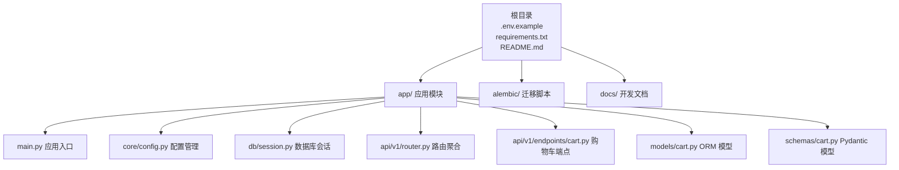
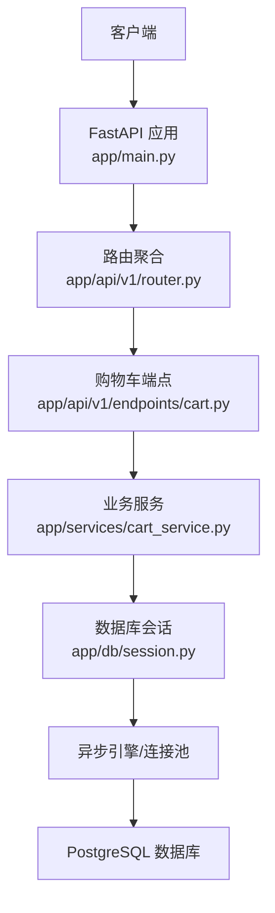
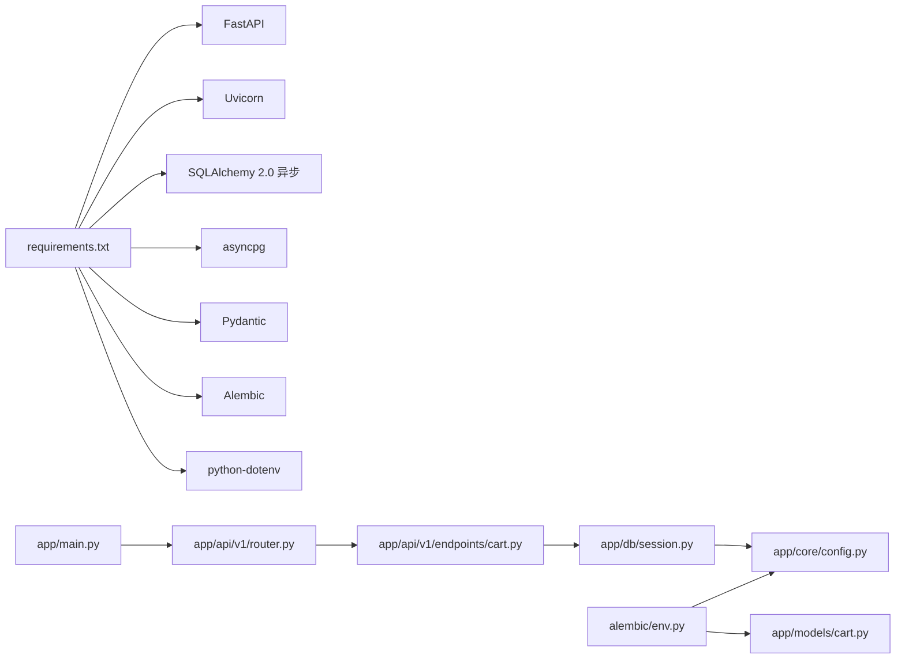

# 快速开始

<cite>
**本文引用的文件**
- [README.md](file://README.md)
- [.env.example](file://.env.example)
- [requirements.txt](file://requirements.txt)
- [app/main.py](file://app/main.py)
- [app/core/config.py](file://app/core/config.py)
- [app/db/session.py](file://app/db/session.py)
- [app/api/v1/router.py](file://app/api/v1/router.py)
- [app/api/v1/endpoints/cart.py](file://app/api/v1/endpoints/cart.py)
- [app/models/cart.py](file://app/models/cart.py)
- [app/schemas/cart.py](file://app/schemas/cart.py)
- [alembic/env.py](file://alembic/env.py)
- [alembic/versions/286c2307065b_create_cart_tables.py](file://alembic/versions/286c2307065b_create_cart_tables.py)
</cite>

## 目录
1. [简介](#简介)
2. [项目结构](#项目结构)
3. [核心组件](#核心组件)
4. [架构总览](#架构总览)
5. [详细组件分析](#详细组件分析)
6. [依赖关系分析](#依赖关系分析)
7. [性能注意事项](#性能注意事项)
8. [故障排查指南](#故障排查指南)
9. [结论](#结论)
10. [附录](#附录)

## 简介
本指南面向开发者，帮助你在本地环境中零障碍启动 CartService。你将完成以下步骤：
- 克隆仓库
- 根据 .env.example 创建并配置 .env
- 安装依赖
- 执行数据库迁移
- 启动 FastAPI 服务
- 访问健康检查接口与自动生成的 API 文档

同时，我们将提供常见启动问题的排查建议，确保你能顺利运行项目。

## 项目结构
项目采用分层清晰的结构，核心目录与职责如下：
- app：应用主体，包含 API 路由、核心配置、数据库会话、ORM 模型、Pydantic 模型、业务服务等
- alembic：数据库迁移脚本与配置
- docs：开发相关文档
- 根目录：环境变量模板、依赖清单、入口文件等

图表来源
- [README.md](file://README.md#L43-L59)
- [app/main.py](file://app/main.py#L1-L17)
- [app/core/config.py](file://app/core/config.py#L1-L18)
- [app/db/session.py](file://app/db/session.py#L1-L24)
- [app/api/v1/router.py](file://app/api/v1/router.py#L1-L6)
- [app/api/v1/endpoints/cart.py](file://app/api/v1/endpoints/cart.py#L1-L65)
- [app/models/cart.py](file://app/models/cart.py#L1-L37)
- [app/schemas/cart.py](file://app/schemas/cart.py#L1-L46)

章节来源
- [README.md](file://README.md#L43-L59)

## 核心组件
- 应用入口与路由
  - 应用入口文件定义了 FastAPI 实例，并注册了 API 路由前缀与健康检查接口。
  - 路由器聚合了购物车相关端点。
- 配置管理
  - 使用 pydantic-settings 从 .env 加载数据库连接字符串。
- 数据库会话
  - 使用 SQLAlchemy 2.0 异步引擎与会话工厂，提供依赖注入。
- 模型与数据校验
  - ORM 模型定义了购物车与商品项的数据表结构。
  - Pydantic 模型用于请求与响应的数据校验与序列化。

章节来源
- [app/main.py](file://app/main.py#L1-L17)
- [app/api/v1/router.py](file://app/api/v1/router.py#L1-L6)
- [app/api/v1/endpoints/cart.py](file://app/api/v1/endpoints/cart.py#L1-L65)
- [app/core/config.py](file://app/core/config.py#L1-L18)
- [app/db/session.py](file://app/db/session.py#L1-L24)
- [app/models/cart.py](file://app/models/cart.py#L1-L37)
- [app/schemas/cart.py](file://app/schemas/cart.py#L1-L46)

## 架构总览
下图展示了从客户端到数据库的典型调用链路与组件交互。

图表来源
- [app/main.py](file://app/main.py#L1-L17)
- [app/api/v1/router.py](file://app/api/v1/router.py#L1-L6)
- [app/api/v1/endpoints/cart.py](file://app/api/v1/endpoints/cart.py#L1-L65)
- [app/db/session.py](file://app/db/session.py#L1-L24)

## 详细组件分析

### 应用入口与健康检查
- 应用入口创建 FastAPI 实例，注册 API 路由前缀为 /api/v1，并提供 /health 健康检查接口。
- 健康检查返回服务状态，便于容器编排或外部监控系统探测。

章节来源
- [app/main.py](file://app/main.py#L1-L17)

### 路由与端点
- 路由器将购物车相关端点聚合，端点覆盖获取购物车、创建购物车、添加/更新/删除商品、清空购物车、合并购物车等。
- 端点通过依赖注入获取数据库会话，实现异步数据库操作。

章节来源
- [app/api/v1/router.py](file://app/api/v1/router.py#L1-L6)
- [app/api/v1/endpoints/cart.py](file://app/api/v1/endpoints/cart.py#L1-L65)

### 配置与数据库连接
- 配置类从 .env 读取 DATABASE_URL，并通过缓存函数提供全局配置实例。
- 数据库会话使用异步引擎创建会话工厂，提供依赖注入；echo 参数可用于调试 SQL 输出。

章节来源
- [app/core/config.py](file://app/core/config.py#L1-L18)
- [app/db/session.py](file://app/db/session.py#L1-L24)

### 模型与迁移
- ORM 模型定义了购物车与商品项的字段、索引与约束。
- 迁移脚本创建 carts 与 cart_items 表，并建立外键与唯一约束。

章节来源
- [app/models/cart.py](file://app/models/cart.py#L1-L37)
- [alembic/versions/286c2307065b_create_cart_tables.py](file://alembic/versions/286c2307065b_create_cart_tables.py#L1-L55)

## 依赖关系分析
- 外部依赖
  - FastAPI、Uvicorn、SQLAlchemy 2.0 异步、asyncpg、Pydantic、Alembic、python-dotenv 等。
- 内部依赖
  - 应用入口依赖路由聚合；路由聚合依赖端点；端点依赖业务服务与数据库会话；会话依赖配置；迁移脚本依赖配置与模型元数据。

图表来源
- [requirements.txt](file://requirements.txt#L1-L9)
- [app/main.py](file://app/main.py#L1-L17)
- [app/api/v1/router.py](file://app/api/v1/router.py#L1-L6)
- [app/api/v1/endpoints/cart.py](file://app/api/v1/endpoints/cart.py#L1-L65)
- [app/db/session.py](file://app/db/session.py#L1-L24)
- [app/core/config.py](file://app/core/config.py#L1-L18)
- [alembic/env.py](file://alembic/env.py#L1-L74)
- [app/models/cart.py](file://app/models/cart.py#L1-L37)

## 性能注意事项
- 使用异步数据库连接与会话，避免阻塞，提升并发处理能力。
- 在开发阶段可开启数据库 echo 以观察 SQL 日志，便于调试与优化。
- 控制响应体大小与分页策略，避免一次性返回大量数据。

[本节为通用建议，不直接分析具体文件]

## 故障排查指南
- 数据库连接失败
  - 检查 .env 中 DATABASE_URL 是否正确指向本地 PostgreSQL 实例与数据库名。
  - 确认数据库已创建且用户密码正确。
  - 若使用 Docker，请确认容器网络与端口映射正常。
  - 可临时开启数据库 echo 观察连接日志。
- Alembic 迁移失败
  - 确认 DATABASE_URL 正确，Alembic 会从配置中读取该值。
  - 确保已安装 asyncpg 与 SQLAlchemy 异步依赖。
  - 如需离线模式，可参考 Alembic 配置与 env 脚本中的 offline/online 切换逻辑。
- Uvicorn 启动报错
  - 确认 Python 版本满足要求，依赖已安装。
  - 端口被占用时请更换端口或释放占用。
- API 文档无法访问
  - 确认服务已启动且未报错。
  - Swagger 文档地址为 http://127.0.0.1:8000/docs，ReDoc 地址为 http://127.0.0.1:8000/redoc。
  - 健康检查接口为 http://127.0.0.1:8000/health。

章节来源
- [app/core/config.py](file://app/core/config.py#L1-L18)
- [app/db/session.py](file://app/db/session.py#L1-L24)
- [alembic/env.py](file://alembic/env.py#L1-L74)
- [README.md](file://README.md#L93-L104)

## 结论
按照本指南完成克隆、配置、依赖安装、数据库迁移与服务启动后，你即可访问健康检查与 API 文档，并开始对接购物车相关接口。遇到问题时，优先核对数据库连接与迁移配置，再检查服务启动参数与端口占用情况。

[本节为总结性内容，不直接分析具体文件]

## 附录

### 快速开始步骤
- 克隆仓库
  - 将项目克隆到本地后，进入项目根目录。
- 创建并配置 .env
  - 复制 .env.example 并重命名为 .env，按需修改数据库连接信息。
- 安装依赖
  - 在项目根目录执行依赖安装命令。
- 执行数据库迁移
  - 使用 Alembic 将数据库结构升级至最新版本。
- 启动服务
  - 使用 Uvicorn 启动 FastAPI 应用，并启用自动重载以便开发。
- 访问接口
  - 健康检查：/health
  - 自动文档：/docs 与 /redoc
  - 示例 API：/api/v1/carts/{cart_id} 等

章节来源
- [README.md](file://README.md#L63-L104)
- [.env.example](file://.env.example#L1-L2)
- [requirements.txt](file://requirements.txt#L1-L9)
- [alembic/env.py](file://alembic/env.py#L1-L74)
- [app/main.py](file://app/main.py#L1-L17)