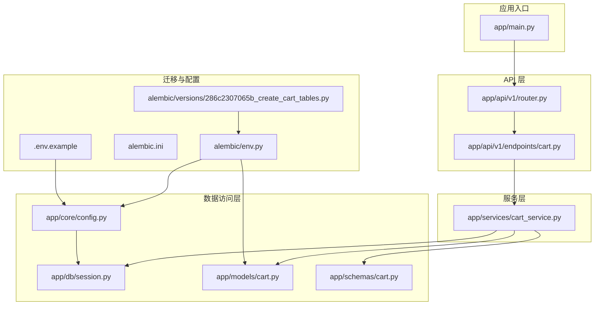
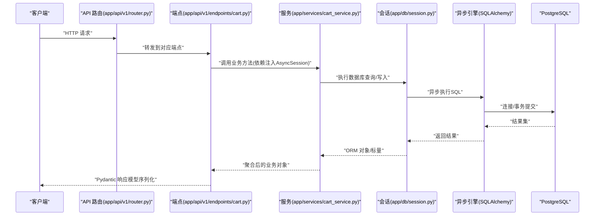
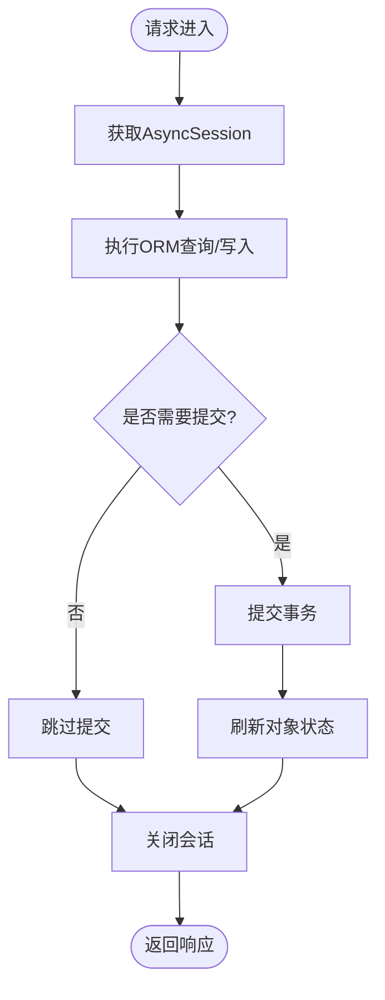
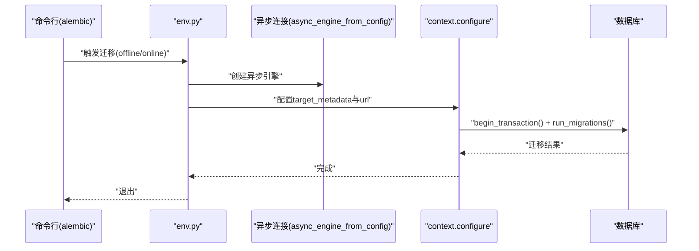

# 技术栈与依赖

<cite>
**本文引用的文件**
- [requirements.txt](file://requirements.txt)
- [app/main.py](file://app/main.py)
- [app/api/v1/router.py](file://app/api/v1/router.py)
- [app/api/v1/endpoints/cart.py](file://app/api/v1/endpoints/cart.py)
- [app/core/config.py](file://app/core/config.py)
- [app/db/session.py](file://app/db/session.py)
- [app/models/cart.py](file://app/models/cart.py)
- [app/schemas/cart.py](file://app/schemas/cart.py)
- [app/services/cart_service.py](file://app/services/cart_service.py)
- [alembic/env.py](file://alembic/env.py)
- [alembic/versions/286c2307065b_create_cart_tables.py](file://alembic/versions/286c2307065b_create_cart_tables.py)
- [.env.example](file://.env.example)
- [alembic.ini](file://alembic.ini)
- [README.md](file://README.md)
</cite>

## 目录
1. [引言](#引言)
2. [项目结构](#项目结构)
3. [核心组件](#核心组件)
4. [架构总览](#架构总览)
5. [详细组件分析](#详细组件分析)
6. [依赖分析](#依赖分析)
7. [性能考量](#性能考量)
8. [故障排查指南](#故障排查指南)
9. [结论](#结论)

## 引言
本节概述CartService项目所采用的技术栈与依赖，重点说明：
- FastAPI作为Web框架在构建异步RESTful API中的核心作用
- SQLAlchemy 2.0+配合asyncpg驱动如何实现高效的异步数据库操作
- Pydantic v2如何保障数据验证和模型定义的类型安全
- Alembic在数据库迁移管理中的流程
- python-dotenv在环境变量管理中的应用

同时，结合requirements.txt列出关键依赖及版本要求，并解释选择这些技术的合理性，帮助开发者快速理解项目运行的基础环境。

## 项目结构
项目采用分层清晰的结构组织，围绕“路由层-服务层-数据访问层-配置与模型”进行划分，便于维护与扩展。

图表来源
- [app/main.py](file://app/main.py#L1-L17)
- [app/api/v1/router.py](file://app/api/v1/router.py#L1-L6)
- [app/api/v1/endpoints/cart.py](file://app/api/v1/endpoints/cart.py#L1-L65)
- [app/services/cart_service.py](file://app/services/cart_service.py#L1-L125)
- [app/db/session.py](file://app/db/session.py#L1-L24)
- [app/core/config.py](file://app/core/config.py#L1-L18)
- [app/models/cart.py](file://app/models/cart.py#L1-L37)
- [app/schemas/cart.py](file://app/schemas/cart.py#L1-L46)
- [alembic/env.py](file://alembic/env.py#L1-L74)
- [alembic/versions/286c2307065b_create_cart_tables.py](file://alembic/versions/286c2307065b_create_cart_tables.py#L1-L55)
- [.env.example](file://.env.example#L1-L2)
- [alembic.ini](file://alembic.ini#L1-L148)

章节来源
- [README.md](file://README.md#L43-L60)

## 核心组件
- Web框架与路由
  - FastAPI负责定义REST API、路径参数、请求体校验与响应模型，并通过依赖注入将数据库会话注入到端点函数中。
- 数据库与ORM
  - 使用SQLAlchemy 2.0异步引擎与asyncpg驱动，通过AsyncSessionLocal管理会话生命周期；declarative_base提供ORM基类。
- 数据模型与Schema
  - models/cart.py定义购物车与商品项的表结构与约束；schemas/cart.py使用Pydantic v2定义输入输出模型，确保类型安全与自动校验。
- 配置与环境变量
  - pydantic-settings与python-dotenv组合，从.env文件加载DATABASE_URL等配置，支持缓存与类型化读取。
- 迁移管理
  - Alembic通过env.py在线下/线上模式执行迁移，目标元数据来自Base.metadata，版本脚本由versions目录管理。

章节来源
- [app/main.py](file://app/main.py#L1-L17)
- [app/api/v1/router.py](file://app/api/v1/router.py#L1-L6)
- [app/api/v1/endpoints/cart.py](file://app/api/v1/endpoints/cart.py#L1-L65)
- [app/db/session.py](file://app/db/session.py#L1-L24)
- [app/models/cart.py](file://app/models/cart.py#L1-L37)
- [app/schemas/cart.py](file://app/schemas/cart.py#L1-L46)
- [app/core/config.py](file://app/core/config.py#L1-L18)
- [alembic/env.py](file://alembic/env.py#L1-L74)
- [alembic/versions/286c2307065b_create_cart_tables.py](file://alembic/versions/286c2307065b_create_cart_tables.py#L1-L55)

## 架构总览
下图展示了从HTTP请求到数据库操作再到响应返回的完整调用链路，体现异步架构与分层职责。

图表来源
- [app/api/v1/router.py](file://app/api/v1/router.py#L1-L6)
- [app/api/v1/endpoints/cart.py](file://app/api/v1/endpoints/cart.py#L1-L65)
- [app/services/cart_service.py](file://app/services/cart_service.py#L1-L125)
- [app/db/session.py](file://app/db/session.py#L1-L24)

## 详细组件分析

### FastAPI 作为Web框架的核心作用
- 路由与依赖注入
  - 在路由层定义APIRouter并挂载端点；端点函数通过Depends注入AsyncSession，实现数据库会话的按需获取与释放。
- 数据验证与响应模型
  - 端点函数使用Pydantic v2模型作为请求体与响应体，自动完成字段校验、类型转换与序列化。
- 异步支持
  - 所有端点与服务方法均声明为异步，配合SQLAlchemy异步引擎，提升并发处理能力。

章节来源
- [app/api/v1/router.py](file://app/api/v1/router.py#L1-L6)
- [app/api/v1/endpoints/cart.py](file://app/api/v1/endpoints/cart.py#L1-L65)
- [app/main.py](file://app/main.py#L1-L17)

### SQLAlchemy 2.0+ 与 asyncpg 的异步数据库操作
- 异步引擎与会话工厂
  - 通过create_async_engine创建异步引擎，使用async_sessionmaker生成AsyncSessionLocal，配置expire_on_commit、autocommit、autoflush等参数以满足业务需求。
- 依赖注入与生命周期
  - get_db提供异步上下文管理器，确保每个请求内使用独立会话并在finally中关闭，避免资源泄漏。
- ORM模型与约束
  - models/cart.py定义了购物车与商品项的表结构、索引与约束，保证数据完整性与查询效率。

图表来源
- [app/db/session.py](file://app/db/session.py#L1-L24)
- [app/models/cart.py](file://app/models/cart.py#L1-L37)
- [app/services/cart_service.py](file://app/services/cart_service.py#L1-L125)

章节来源
- [app/db/session.py](file://app/db/session.py#L1-L24)
- [app/models/cart.py](file://app/models/cart.py#L1-L37)
- [app/services/cart_service.py](file://app/services/cart_service.py#L1-L125)

### Pydantic v2 的数据验证与类型安全
- 输入模型
  - schemas/cart.py定义CartItemCreate、CartCreate等输入模型，利用Field约束数值范围、默认值与必填性。
- 输出模型
  - CartResponse、CartItemResponse等输出模型通过model_config(from_attributes=True)支持从ORM对象直接构造，简化序列化。
- 端点集成
  - 端点函数直接使用Pydantic模型作为请求体与响应体，自动完成校验与序列化，减少样板代码。

章节来源
- [app/schemas/cart.py](file://app/schemas/cart.py#L1-L46)
- [app/api/v1/endpoints/cart.py](file://app/api/v1/endpoints/cart.py#L1-L65)

### Alembic 的数据库迁移管理流程
- 环境配置
  - alembic/env.py导入models与Base.metadata，设置sqlalchemy.url为settings.DATABASE_URL，支持离线与在线两种迁移模式。
- 在线迁移
  - run_async_migrations通过async_engine_from_config创建异步连接，在连接上下文中执行do_run_migrations，最终dispose连接。
- 版本脚本
  - alembic/versions/286c2307065b_create_cart_tables.py定义了carts与cart_items表的创建与索引、约束，支持upgrade/downgrade。

图表来源
- [alembic/env.py](file://alembic/env.py#L1-L74)
- [alembic/versions/286c2307065b_create_cart_tables.py](file://alembic/versions/286c2307065b_create_cart_tables.py#L1-L55)
- [alembic.ini](file://alembic.ini#L1-L148)

章节来源
- [alembic/env.py](file://alembic/env.py#L1-L74)
- [alembic/versions/286c2307065b_create_cart_tables.py](file://alembic/versions/286c2307065b_create_cart_tables.py#L1-L55)
- [alembic.ini](file://alembic.ini#L1-L148)

### python-dotenv 在环境变量管理中的应用
- 配置加载
  - app/core/config.py使用pydantic-settings的BaseSettings从.env文件加载DATABASE_URL等配置，并通过lru_cache缓存实例，避免重复解析。
- 示例模板
  - .env.example提供DATABASE_URL示例，便于开发者复制并按需修改。

章节来源
- [app/core/config.py](file://app/core/config.py#L1-L18)
- [.env.example](file://.env.example#L1-L2)

## 依赖分析
根据requirements.txt，项目的关键依赖与版本要求如下：
- fastapi>=0.109.0：高性能异步Web框架，提供路由、依赖注入与自动OpenAPI文档生成功能。
- uvicorn[standard]>=0.27.0：ASGI服务器，用于启动与运行FastAPI应用。
- sqlalchemy[asyncio]>=2.0.25：SQLAlchemy 2.0异步支持，提供异步引擎与会话管理。
- asyncpg>=0.29.0：PostgreSQL异步驱动，与SQLAlchemy异步引擎协同工作。
- pydantic>=2.5.0：Pydantic v2，提供数据验证、序列化与类型安全。
- pydantic-settings>=2.1.0：支持从.env等外部源加载配置，结合python-dotenv实现环境变量管理。
- alembic>=1.13.0：数据库迁移工具，支持离线与在线迁移。
- python-dotenv>=1.0.0：读取.env文件，为pydantic-settings提供配置源。

选择这些技术的合理性：
- 异步优先：FastAPI + SQLAlchemy 2.0 + asyncpg构成完整的异步生态，适合高并发场景。
- 类型安全：Pydantic v2提供强类型模型与自动校验，降低运行期错误。
- 可运维性：Alembic统一管理数据库演进，配合.env配置便于部署与环境隔离。
- 易用性：Uvicorn标准包含常用依赖，便于本地开发与部署。

章节来源
- [requirements.txt](file://requirements.txt#L1-L9)
- [README.md](file://README.md#L30-L41)

## 性能考量
- 异步I/O：使用SQLAlchemy异步引擎与asyncpg，避免阻塞式I/O，提高吞吐量。
- 依赖注入：通过get_db按需创建会话，减少全局状态与锁竞争。
- 查询优化：端点中使用selectinload预加载关联数据，减少N+1查询风险。
- 缓存配置：Settings通过lru_cache缓存配置实例，降低重复解析成本。

章节来源
- [app/db/session.py](file://app/db/session.py#L1-L24)
- [app/services/cart_service.py](file://app/services/cart_service.py#L1-L125)
- [app/core/config.py](file://app/core/config.py#L1-L18)

## 故障排查指南
- 数据库连接失败
  - 检查DATABASE_URL格式与可达性；确认PostgreSQL服务运行正常。
  - 参考：[app/core/config.py](file://app/core/config.py#L1-L18)，[alembic/env.py](file://alembic/env.py#L1-L74)
- 迁移执行异常
  - 确认alembic.ini中sqlalchemy.url与.env一致；在离线/在线模式下分别尝试升级或降级。
  - 参考：[alembic/env.py](file://alembic/env.py#L1-L74)，[alembic/versions/286c2307065b_create_cart_tables.py](file://alembic/versions/286c2307065b_create_cart_tables.py#L1-L55)，[alembic.ini](file://alembic.ini#L1-L148)
- 端点参数校验失败
  - 检查请求体字段类型与范围是否符合Pydantic模型定义；关注Field约束与默认值。
  - 参考：[app/schemas/cart.py](file://app/schemas/cart.py#L1-L46)，[app/api/v1/endpoints/cart.py](file://app/api/v1/endpoints/cart.py#L1-L65)
- 会话未正确关闭
  - 确保get_db在try/finally中关闭会话；避免长连接导致资源泄漏。
  - 参考：[app/db/session.py](file://app/db/session.py#L1-L24)

## 结论
CartService项目以FastAPI为核心，结合SQLAlchemy 2.0异步ORM、Pydantic v2类型系统与Alembic迁移工具，构建了高性能、可维护且易于部署的购物车微服务。通过python-dotenv与pydantic-settings实现环境变量管理，配合明确的项目结构与分层设计，使开发者能够快速上手并持续演进。