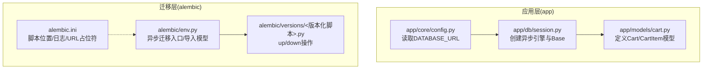
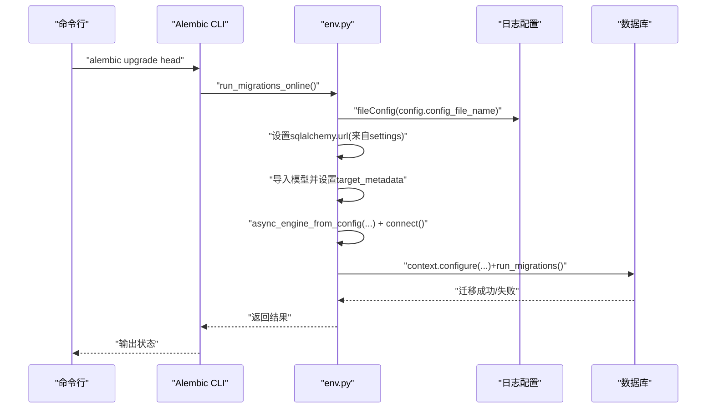
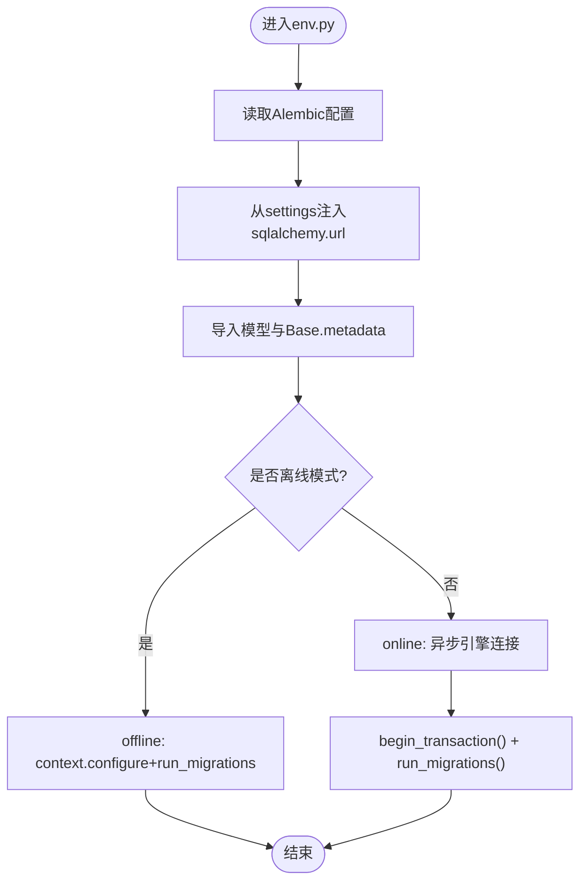
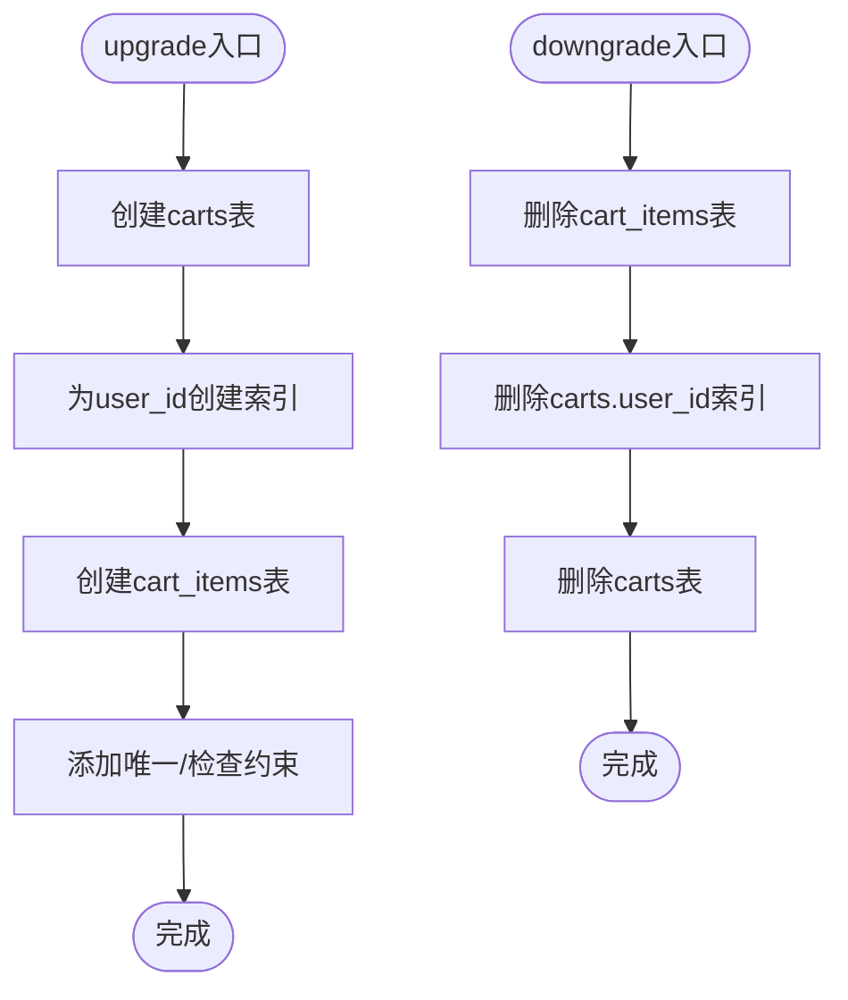
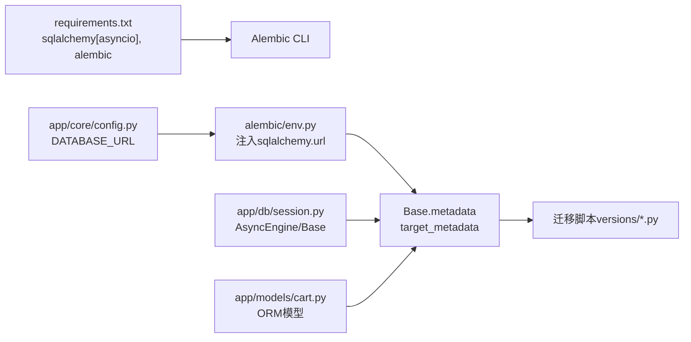

# 数据库迁移

<cite>
**本文引用的文件**
- [alembic.ini](file://alembic.ini)
- [env.py](file://alembic/env.py)
- [286c2307065b_create_cart_tables.py](file://alembic/versions/286c2307065b_create_cart_tables.py)
- [session.py](file://app/db/session.py)
- [cart.py](file://app/models/cart.py)
- [config.py](file://app/core/config.py)
- [requirements.txt](file://requirements.txt)
</cite>

## 目录
1. [简介](#简介)
2. [项目结构](#项目结构)
3. [核心组件](#核心组件)
4. [架构总览](#架构总览)
5. [详细组件分析](#详细组件分析)
6. [依赖关系分析](#依赖关系分析)
7. [性能与最佳实践](#性能与最佳实践)
8. [故障排查指南](#故障排查指南)
9. [结论](#结论)
10. [附录：命令与流程](#附录命令与流程)

## 简介
本指南围绕使用 Alembic 进行数据库迁移展开，重点解释以下方面：
- 如何通过 alembic.ini 和 alembic/env.py 配置 Alembic，使其兼容 SQLAlchemy 2.0+ 的异步引擎；
- 如何生成新迁移脚本（含自动检测变更）以及如何应用迁移；
- 以 286c2307065b_create_cart_tables.py 为例，解析迁移脚本结构与关键操作；
- 强调迁移在团队协作与生产环境部署中的重要性，并给出可操作的建议。

## 项目结构
该仓库采用“应用 + 迁移”分离的组织方式：
- 应用层位于 app/，包含数据库会话、模型定义与业务逻辑；
- 迁移层位于 alembic/，包含迁移脚本、模板与配置；
- 核心配置位于 app/core/config.py，提供数据库连接字符串；
- 依赖声明位于 requirements.txt，确保 SQLAlchemy 2.x 与 Alembic 的版本兼容。

图表来源
- [alembic.ini](file://alembic.ini#L1-L40)
- [env.py](file://alembic/env.py#L1-L74)
- [session.py](file://app/db/session.py#L1-L24)
- [cart.py](file://app/models/cart.py#L1-L37)

章节来源
- [alembic.ini](file://alembic.ini#L1-L40)
- [env.py](file://alembic/env.py#L1-L74)
- [session.py](file://app/db/session.py#L1-L24)
- [cart.py](file://app/models/cart.py#L1-L37)

## 核心组件
- alembic.ini：定义脚本位置、路径分隔符、日志级别、数据库 URL 占位符等。其中 script_location 指向 alembic 目录；sqlalchemy.url 为占位符，实际值由 env.py 注入。
- alembic/env.py：负责加载日志配置、导入应用模型以支持自动检测变更、设置 target_metadata、并根据运行模式选择离线或在线迁移。在线模式使用异步引擎连接数据库。
- 迁移脚本（示例：286c2307065b_create_cart_tables.py）：定义升级/降级操作，使用 op.create_table/op.drop_table 等 API 完成表结构变更，并包含索引、约束等细节。
- 应用模型与会话：app/db/session.py 提供异步引擎与 Base；app/models/cart.py 定义 Cart 与 CartItem 表结构，用于自动迁移检测。

章节来源
- [alembic.ini](file://alembic.ini#L1-L40)
- [env.py](file://alembic/env.py#L1-L74)
- [286c2307065b_create_cart_tables.py](file://alembic/versions/286c2307065b_create_cart_tables.py#L1-L55)
- [session.py](file://app/db/session.py#L1-L24)
- [cart.py](file://app/models/cart.py#L1-L37)

## 架构总览
下图展示了从 Alembic 到应用模型与数据库的整体迁移流程，包括离线与在线两种执行路径。

图表来源
- [env.py](file://alembic/env.py#L1-L74)
- [config.py](file://app/core/config.py#L1-L18)

章节来源
- [env.py](file://alembic/env.py#L1-L74)
- [config.py](file://app/core/config.py#L1-L18)

## 详细组件分析

### 配置文件：alembic.ini
- 脚本位置与路径分隔：script_location 指定迁移脚本目录；path_separator 控制多路径分隔符策略。
- 日志系统：通过 [loggers]/[handlers]/[formatters] 设置日志级别与输出格式，便于调试迁移过程。
- 数据库 URL 占位符：sqlalchemy.url 作为占位符，实际值由 env.py 在运行时注入，避免硬编码在版本控制中。

章节来源
- [alembic.ini](file://alembic.ini#L1-L40)
- [alembic.ini](file://alembic.ini#L113-L148)

### 运行环境：alembic/env.py
- 导入与元数据：导入应用模型（Cart、CartItem）与 Base.metadata，使 Alembic 能够基于 ORM 模型自动生成迁移。
- URL 注入：从 settings.DATABASE_URL 获取数据库连接字符串并写入 config.main_option。
- 离线迁移：offline 模式下直接使用配置的 URL 执行迁移。
- 在线迁移（异步）：使用 async_engine_from_config 创建异步引擎，通过 async with connectable.connect() 建立连接后委托 context.configure 与 context.run_migrations 执行迁移。
- 事务封装：do_run_migrations 使用 context.begin_transaction 包裹迁移，保证原子性。

图表来源
- [env.py](file://alembic/env.py#L1-L74)

章节来源
- [env.py](file://alembic/env.py#L1-L74)

### 迁移脚本：286c2307065b_create_cart_tables.py
- 版本标识：revision、down_revision、branch_labels、depends_on 明确版本关系。
- 升级操作（upgrade）：
  - 使用 op.create_table 创建 carts 表，包含主键、字段与索引；
  - 使用 op.create_table 创建 cart_items 表，包含外键、唯一约束、检查约束等；
- 降级操作（downgrade）：
  - 先删除子表再删除父表，遵循外键约束顺序；
  - 删除索引与表，恢复到上一个版本。

图表来源
- [286c2307065b_create_cart_tables.py](file://alembic/versions/286c2307065b_create_cart_tables.py#L1-L55)

章节来源
- [286c2307065b_create_cart_tables.py](file://alembic/versions/286c2307065b_create_cart_tables.py#L1-L55)

### 应用模型与会话：app/db/session.py 与 app/models/cart.py
- 引擎与 Base：使用 create_async_engine 创建异步引擎，Base 作为 ORM 基类，供模型继承。
- 模型定义：Cart 与 CartItem 定义了表结构、字段类型、索引与约束，这些信息被 Alembic 通过 env.py 中的 target_metadata 检测，从而实现自动迁移生成。

章节来源
- [session.py](file://app/db/session.py#L1-L24)
- [cart.py](file://app/models/cart.py#L1-L37)

## 依赖关系分析
- Alembic 与 SQLAlchemy 版本要求：requirements.txt 明确了 sqlalchemy[asyncio] 与 alembic 的最低版本，满足 SQLAlchemy 2.0+ 与异步引擎需求。
- Alembic 与应用配置：env.py 从 settings.DATABASE_URL 注入数据库 URL，避免在 alembic.ini 中硬编码敏感信息。
- 模型与迁移：env.py 导入应用模型，使 Alembic 能基于 ORM 自动检测差异并生成迁移脚本。

图表来源
- [requirements.txt](file://requirements.txt#L1-L9)
- [config.py](file://app/core/config.py#L1-L18)
- [env.py](file://alembic/env.py#L1-L74)
- [session.py](file://app/db/session.py#L1-L24)
- [cart.py](file://app/models/cart.py#L1-L37)

章节来源
- [requirements.txt](file://requirements.txt#L1-L9)
- [config.py](file://app/core/config.py#L1-L18)
- [env.py](file://alembic/env.py#L1-L74)
- [session.py](file://app/db/session.py#L1-L24)
- [cart.py](file://app/models/cart.py#L1-L37)

## 性能与最佳实践
- 异步迁移：env.py 使用异步引擎连接数据库，适合高并发场景；注意连接池参数与超时设置。
- 自动迁移：通过导入模型与设置 target_metadata，启用自动检测变更，减少手写脚本错误。
- 事务边界：迁移在 begin_transaction 包裹内执行，确保原子性；复杂迁移建议拆分为多个小步骤。
- 团队协作：
  - 将 alembic.ini 中的数据库 URL 作为占位符，通过 settings 注入，避免泄露敏感信息；
  - 在合并前先执行本地迁移验证，确保脚本可重复执行且幂等；
  - 对于破坏性变更（如删除列），优先使用安全的替代方案或分阶段迁移。
- 生产部署：
  - 部署前在预生产环境验证迁移；
  - 备份数据库后再执行升级；
  - 记录每次迁移的变更说明与回滚步骤。

[本节为通用指导，不直接分析具体文件]

## 故障排查指南
- 数据库连接失败
  - 检查 settings.DATABASE_URL 是否正确，确认数据库服务可达；
  - 确认 alembic.ini 中的占位符已通过 env.py 注入。
- 迁移未检测到模型变更
  - 确认 env.py 已导入对应模型并设置 target_metadata；
  - 确保模型继承自 Base。
- 在线/离线模式混淆
  - 离线模式适用于无数据库连接的环境；在线模式需确保异步引擎可用；
  - 若出现连接异常，检查 async_engine_from_config 的参数与连接字符串。
- 降级失败
  - 确保删除顺序符合外键依赖关系（先子表后父表）；
  - 检查索引与约束名称是否与脚本一致。

章节来源
- [env.py](file://alembic/env.py#L1-L74)
- [config.py](file://app/core/config.py#L1-L18)

## 结论
通过合理配置 alembic.ini 与 env.py，并结合应用层的模型定义，可以高效地生成与执行数据库迁移。异步引擎与自动检测机制提升了开发效率与安全性。在团队协作与生产环境中，规范的迁移流程、充分的测试与备份策略是保障系统稳定演进的关键。

[本节为总结，不直接分析具体文件]

## 附录：命令与流程

- 生成迁移脚本
  - 使用自动检测生成：在项目根目录执行 alembic revision --autogenerate -m "描述"
  - 说明：该命令会基于 target_metadata 与当前数据库状态生成差异脚本，位于 alembic/versions/ 下。
- 应用迁移
  - 升级到最新版本：在项目根目录执行 alembic upgrade head
  - 降级到指定版本：例如 alembic downgrade -1 或 alembic downgrade <目标版本>
- 示例脚本解读
  - 以 286c2307065b_create_cart_tables.py 为例，脚本包含：
    - 升级：创建 carts 与 cart_items 表，添加索引与约束；
    - 降级：按外键依赖顺序删除表与索引。
- 团队协作与生产部署要点
  - 在 .env 中维护 DATABASE_URL，避免将其提交到版本库；
  - 合并前在本地执行 alembic upgrade head 验证；
  - 生产部署前在预生产环境演练迁移与回滚。

章节来源
- [286c2307065b_create_cart_tables.py](file://alembic/versions/286c2307065b_create_cart_tables.py#L1-L55)
- [env.py](file://alembic/env.py#L1-L74)
- [config.py](file://app/core/config.py#L1-L18)