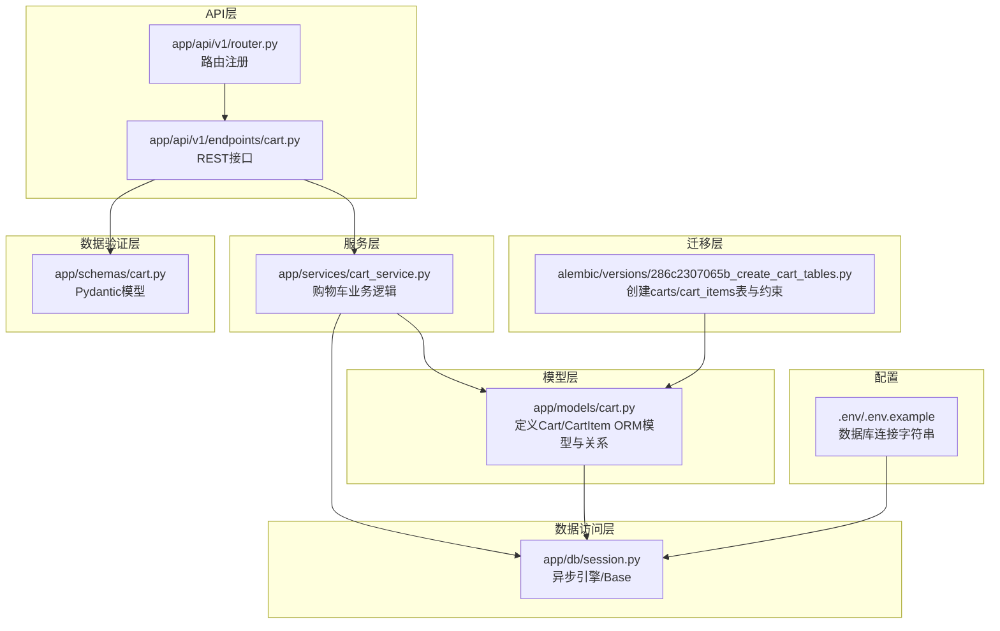
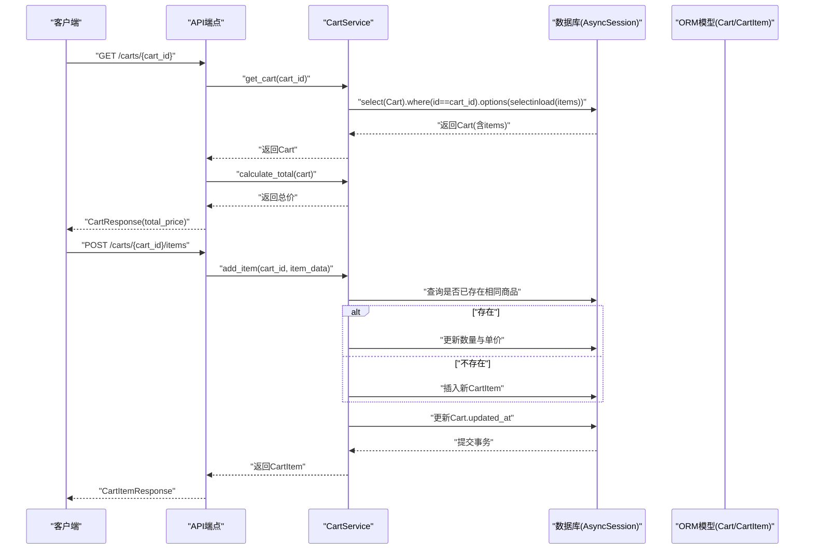
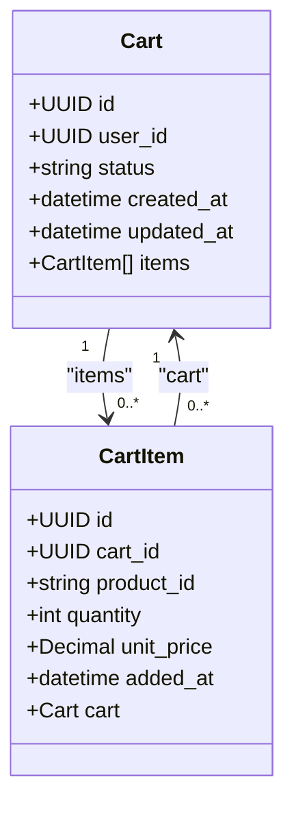
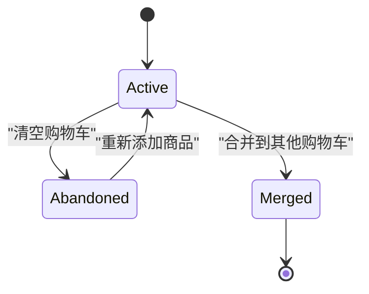
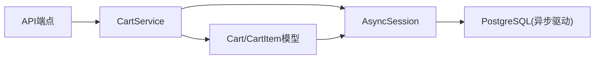

# 数据模型与ORM映射

<cite>
**本文引用的文件**
- [app/models/cart.py](file://app/models/cart.py)
- [alembic/versions/286c2307065b_create_cart_tables.py](file://alembic/versions/286c2307065b_create_cart_tables.py)
- [app/services/cart_service.py](file://app/services/cart_service.py)
- [app/api/v1/endpoints/cart.py](file://app/api/v1/endpoints/cart.py)
- [app/schemas/cart.py](file://app/schemas/cart.py)
- [app/db/session.py](file://app/db/session.py)
- [app/api/v1/router.py](file://app/api/v1/router.py)
- [.env](file://.env)
- [.env.example](file://.env.example)
</cite>

## 目录
1. [简介](#简介)
2. [项目结构](#项目结构)
3. [核心组件](#核心组件)
4. [架构总览](#架构总览)
5. [详细组件分析](#详细组件分析)
6. [依赖分析](#依赖分析)
7. [性能考量](#性能考量)
8. [故障排查指南](#故障排查指南)
9. [结论](#结论)
10. [附录](#附录)

## 简介
本文件围绕购物车核心数据模型“Cart”和“CartItem”，系统梳理其字段定义、数据类型、约束、业务含义，以及在SQLAlchemy中的关系映射（relationship/back_populates/cascade），并结合数据库迁移脚本说明表结构的创建与演进。同时，结合服务层与API层的行为，阐述数据生命周期（如状态流转）与性能优化策略（如selectinload/joinedload相关思路）。

## 项目结构
- 模型层：位于 app/models/cart.py，定义Cart与CartItem的ORM映射及关系。
- 迁移层：位于 alembic/versions/286c2307065b_create_cart_tables.py，负责创建carts与cart_items表及约束。
- 服务层：位于 app/services/cart_service.py，封装购物车与商品项的增删改查、合并、清空、总价计算等业务逻辑。
- API层：位于 app/api/v1/endpoints/cart.py，提供REST接口，调用服务层完成业务处理。
- 数据访问层：位于 app/db/session.py，提供异步引擎与Base基类。
- 数据验证层：位于 app/schemas/cart.py，定义Pydantic模型用于请求/响应校验与序列化。
- 配置：位于 .env/.env.example，提供数据库连接字符串。

图表来源
- [app/models/cart.py](file://app/models/cart.py#L1-L37)
- [alembic/versions/286c2307065b_create_cart_tables.py](file://alembic/versions/286c2307065b_create_cart_tables.py#L21-L44)
- [app/services/cart_service.py](file://app/services/cart_service.py#L1-L125)
- [app/api/v1/endpoints/cart.py](file://app/api/v1/endpoints/cart.py#L1-L65)
- [app/api/v1/router.py](file://app/api/v1/router.py#L1-L6)
- [app/db/session.py](file://app/db/session.py#L1-L24)
- [.env](file://.env#L1-L1)
- [.env.example](file://.env.example#L1-L1)

章节来源
- [app/models/cart.py](file://app/models/cart.py#L1-L37)
- [alembic/versions/286c2307065b_create_cart_tables.py](file://alembic/versions/286c2307065b_create_cart_tables.py#L21-L44)
- [app/services/cart_service.py](file://app/services/cart_service.py#L1-L125)
- [app/api/v1/endpoints/cart.py](file://app/api/v1/endpoints/cart.py#L1-L65)
- [app/api/v1/router.py](file://app/api/v1/router.py#L1-L6)
- [app/db/session.py](file://app/db/session.py#L1-L24)
- [.env](file://.env#L1-L1)
- [.env.example](file://.env.example#L1-L1)

## 核心组件
本节聚焦Cart与CartItem两个核心实体，从字段定义、数据类型、约束、业务含义、关系映射与生命周期等方面进行深入解析。

- Cart（购物车主表）
  - 字段与类型
    - id：UUID，主键，自动生成默认值。
    - user_id：UUID，可空，建立索引，用于关联登录用户或匿名会话。
    - status：字符串，长度20，默认“active”，用于表示购物车状态。
    - created_at：日期时间，非空，默认当前UTC时间。
    - updated_at：日期时间，非空，默认当前UTC时间，并在更新时自动刷新。
  - 约束
    - 主键：id。
    - 索引：user_id（便于按用户检索）。
  - 业务含义
    - 标识一次购物车会话，支持匿名与登录两种场景；通过user_id区分归属。
    - status字段承载生命周期状态，后续章节将详述状态流转。
  - 关系映射
    - items：一对多关系，指向CartItem集合；使用back_populates与CartItem.cart双向关联；级联策略为“all, delete-orphan”，删除Cart时会级联删除其所有CartItem。

- CartItem（购物车明细表）
  - 字段与类型
    - id：UUID，主键，自动生成默认值。
    - cart_id：UUID，外键引用carts.id，删除策略为CASCADE，非空。
    - product_id：字符串，长度100，非空，标识商品SKU。
    - quantity：整数，非空，大于0。
    - unit_price：数值（精度10，小数2位），非空，用于价格快照。
    - added_at：日期时间，非空，默认当前UTC时间。
  - 约束
    - 主键：id。
    - 外键：cart_id -> carts.id，ondelete=CASCADE。
    - 唯一约束：(cart_id, product_id)，防止同一购物车重复商品。
    - 检查约束：quantity > 0。
  - 业务含义
    - 记录购物车中某商品的数量与单价（价格快照），保证历史价格一致性。
    - 通过唯一约束确保同商品在同一购物车仅出现一次。
  - 关系映射
    - cart：多对一关系，指向所属Cart；使用back_populates与Cart.items双向关联。

章节来源
- [app/models/cart.py](file://app/models/cart.py#L10-L37)

## 架构总览
下图展示从API到服务再到模型与数据库的整体交互流程，突出Cart与CartItem的关系、约束与生命周期控制点。

图表来源
- [app/api/v1/endpoints/cart.py](file://app/api/v1/endpoints/cart.py#L14-L21)
- [app/services/cart_service.py](file://app/services/cart_service.py#L15-L22)
- [app/services/cart_service.py](file://app/services/cart_service.py#L33-L61)
- [app/services/cart_service.py](file://app/services/cart_service.py#L122-L125)

## 详细组件分析

### 数据库表结构与迁移
- carts表
  - 字段：id(UUID, PK)、user_id(UUID, 可空, 建索引)、status(字符串, 非空, 默认“active”)、created_at(DateTime, 非空)、updated_at(DateTime, 非空)。
  - 约束：主键、索引(user_id)。
- cart_items表
  - 字段：id(UUID, PK)、cart_id(UUID, FK->carts.id, CASCADE)、product_id(字符串, 非空)、quantity(整数, 非空, >0)、unit_price(数值, 非空)、added_at(DateTime, 非空)。
  - 约束：主键、外键、唯一约束(cart_id, product_id)、检查约束(quantity > 0)。
- 迁移脚本要点
  - 升级：创建carts与cart_items表，添加user_id索引，定义外键与唯一/检查约束。
  - 降级：删除cart_items表，删除carts.user_id索引，删除carts表。

章节来源
- [alembic/versions/286c2307065b_create_cart_tables.py](file://alembic/versions/286c2307065b_create_cart_tables.py#L21-L44)

### ORM类与关系映射
- Cart
  - items: 一对多，back_populates="cart"，级联策略“all, delete-orphan”。
- CartItem
  - cart: 多对一，back_populates="items"。
- 关系实现要点
  - 使用relationship声明双向关系，确保对象导航与数据库外键一致。
  - 级联策略delete-orphan确保当CartItem被移出集合时自动删除，保持数据一致性。

图表来源
- [app/models/cart.py](file://app/models/cart.py#L10-L37)

章节来源
- [app/models/cart.py](file://app/models/cart.py#L10-L37)

### 字段定义与约束详解
- Cart
  - id：UUID主键，全局唯一标识购物车会话。
  - user_id：UUID可空，建立索引，支持按用户检索与匿名购物车管理。
  - status：字符串，默认“active”，承载生命周期状态（见下一节）。
  - created_at/updated_at：时间戳，updated_at自动更新，便于审计与排序。
- CartItem
  - cart_id：外键，CASCADE删除，保证父表删除时子表同步清理。
  - product_id：字符串，非空，唯一约束与cart_id组合，避免重复商品。
  - quantity：整数，>0，检查约束保障业务有效性。
  - unit_price：数值，非空，用于价格快照，便于后续对账与通知。
  - added_at：时间戳，记录加入时间。

章节来源
- [app/models/cart.py](file://app/models/cart.py#L13-L36)
- [alembic/versions/286c2307065b_create_cart_tables.py](file://alembic/versions/286c2307065b_create_cart_tables.py#L24-L44)

### 数据生命周期与状态流转
- 状态字段status
  - 初始状态：创建时默认“active”。
  - 清空购物车：clear_cart将状态设为“abandoned”，随后删除所有明细。
  - 合并购物车：merge_carts将源购物车状态设为“merged”，目标购物车updated_at刷新。
- 生命周期关键点
  - active：正常可用状态。
  - abandoned：清空后标记，便于后续清理或归档。
  - merged：合并完成后标记源购物车，避免重复合并。
- 业务建议
  - 可扩展状态枚举（如converted），并在API层进行输入校验与输出限制。

图表来源
- [app/services/cart_service.py](file://app/services/cart_service.py#L90-L96)
- [app/services/cart_service.py](file://app/services/cart_service.py#L98-L120)

章节来源
- [app/services/cart_service.py](file://app/services/cart_service.py#L90-L120)

### 查询与性能优化
- 查询策略
  - 服务层在获取购物车时使用selectinload加载items，减少N+1查询风险，提升读取性能。
- 性能建议
  - 对user_id建立索引（迁移脚本已实现），加速按用户检索。
  - 在高频查询场景，可考虑使用selectinload或selectinload组合策略，避免懒加载导致的额外往返。
  - 对于只读列表页，可使用只读会话与合适的过滤条件，降低锁竞争。
- 事务与一致性
  - 所有写操作均在事务内执行，确保数据一致性；更新Cart.updated_at以反映最近修改时间。

章节来源
- [app/services/cart_service.py](file://app/services/cart_service.py#L15-L22)
- [alembic/versions/286c2307065b_create_cart_tables.py](file://alembic/versions/286c2307065b_create_cart_tables.py#L32-L32)

### API与业务行为映射
- GET /carts/{cart_id}
  - 返回Cart详情，包含items与计算后的总价（服务层计算）。
- POST /carts
  - 创建新购物车（user_id可空）。
- POST /carts/{cart_id}/items
  - 添加商品；若同商品已存在则累加数量并更新单价（价格快照）。
- PATCH /carts/{cart_id}/items/{item_id}
  - 更新商品数量。
- DELETE /carts/{cart_id}/items/{item_id}
  - 删除单个商品项。
- DELETE /carts/{cart_id}
  - 清空购物车并标记状态为“abandoned”。
- POST /carts/{cart_id}/merge
  - 将源购物车合并到目标购物车，同商品数量累加，源购物车标记为“merged”。

章节来源
- [app/api/v1/endpoints/cart.py](file://app/api/v1/endpoints/cart.py#L14-L64)
- [app/services/cart_service.py](file://app/services/cart_service.py#L15-L121)
- [app/schemas/cart.py](file://app/schemas/cart.py#L7-L46)

## 依赖分析
- 组件耦合
  - API层依赖服务层；服务层依赖模型层与数据库会话；模型层依赖Base与SQLAlchemy类型。
- 外部依赖
  - 数据库：PostgreSQL（异步驱动asyncpg）。
  - 迁移工具：Alembic。
  - 数据验证：Pydantic v2。
- 潜在循环依赖
  - 当前结构清晰，无明显循环导入；模型间通过relationship双向引用，但不形成循环导入。

图表来源
- [app/api/v1/endpoints/cart.py](file://app/api/v1/endpoints/cart.py#L1-L65)
- [app/services/cart_service.py](file://app/services/cart_service.py#L1-L125)
- [app/models/cart.py](file://app/models/cart.py#L1-L37)
- [app/db/session.py](file://app/db/session.py#L1-L24)

章节来源
- [app/api/v1/endpoints/cart.py](file://app/api/v1/endpoints/cart.py#L1-L65)
- [app/services/cart_service.py](file://app/services/cart_service.py#L1-L125)
- [app/models/cart.py](file://app/models/cart.py#L1-L37)
- [app/db/session.py](file://app/db/session.py#L1-L24)

## 性能考量
- 查询优化
  - 使用selectinload批量加载关联项，避免N+1查询。
  - 对user_id建立索引，加速按用户检索。
- 写入优化
  - 合理使用事务，减少不必要的commit次数；在批量合并场景中尽量减少多次往返。
- 数据类型选择
  - 数值使用Numeric(10,2)保存单价，避免浮点误差；字符串长度限制product_id，兼顾索引效率与可读性。
- 并发与锁
  - 在高并发场景下，建议对关键写操作使用适当的隔离级别与重试机制，避免死锁。

[本节为通用性能建议，无需特定文件引用]

## 故障排查指南
- 常见错误与定位
  - 404：购物车或商品项不存在。服务层在查询不到时抛出HTTP异常，API层返回相应状态码。
  - 数据约束冲突：quantity必须>0；(cart_id, product_id)唯一；外键cart_id需存在。
- 排查步骤
  - 确认数据库迁移是否成功执行（upgrade head）。
  - 检查数据库连接字符串是否正确（.env）。
  - 在服务层断点或日志中确认传入参数与返回结果。
- 相关实现位置
  - 404处理与查询逻辑：服务层get_cart/add_item/update_item/remove_item。
  - 约束定义：迁移脚本与模型层UniqueConstraint/CheckConstraint。

章节来源
- [app/services/cart_service.py](file://app/services/cart_service.py#L15-L22)
- [app/services/cart_service.py](file://app/services/cart_service.py#L33-L75)
- [app/services/cart_service.py](file://app/services/cart_service.py#L77-L88)
- [alembic/versions/286c2307065b_create_cart_tables.py](file://alembic/versions/286c2307065b_create_cart_tables.py#L21-L44)
- [.env](file://.env#L1-L1)

## 结论
本数据模型以Cart与CartItem为核心，通过明确的字段定义、严格的约束与合理的SQLAlchemy关系映射，支撑了完整的购物车生命周期管理。迁移脚本确保了表结构与约束的一致性；服务层与API层的行为体现了状态流转与性能优化策略。整体设计在可维护性、一致性与性能之间取得了良好平衡。

[本节为总结性内容，无需特定文件引用]

## 附录
- 数据库连接配置
  - 数据库URL示例位于.env.example，实际使用时复制为.env并填写正确凭据。
- 迁移命令
  - 执行数据库迁移：alembic upgrade head。
- API文档
  - Swagger与ReDoc地址：/docs 与 /redoc。

章节来源
- [.env.example](file://.env.example#L1-L1)
- [.env](file://.env#L1-L1)
- [README.md](file://README.md#L87-L92)