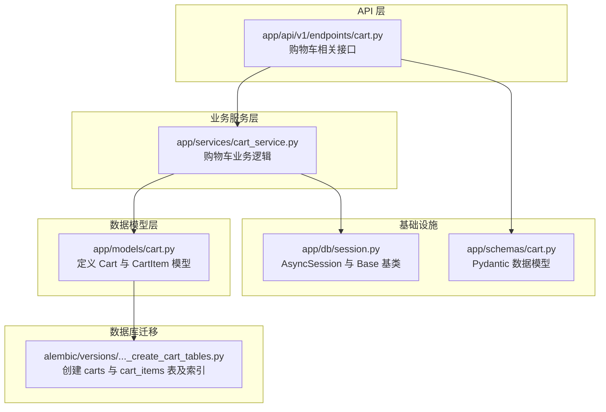
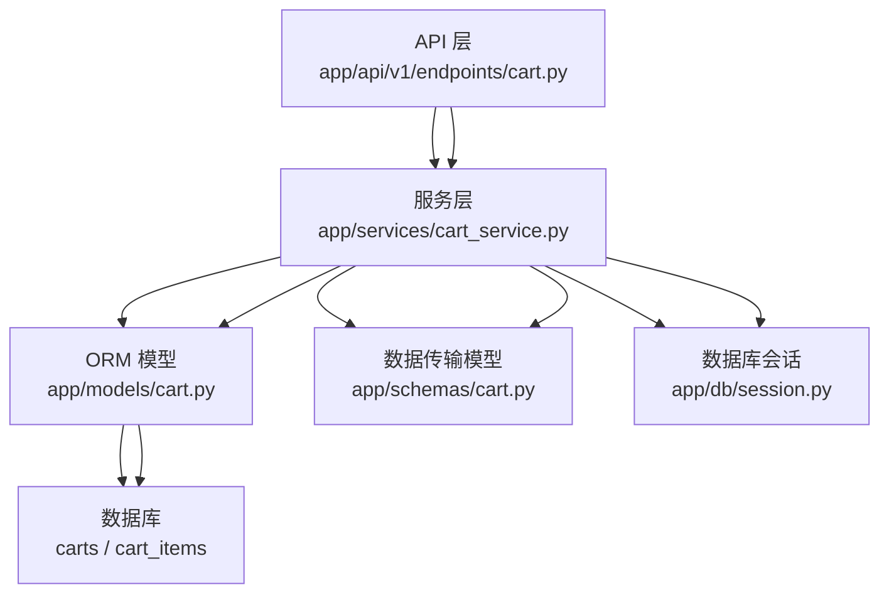
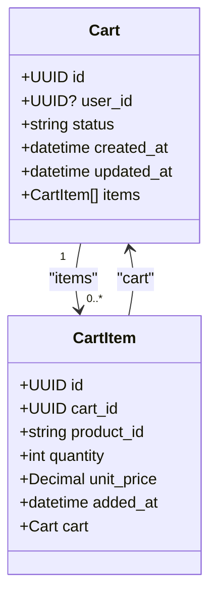
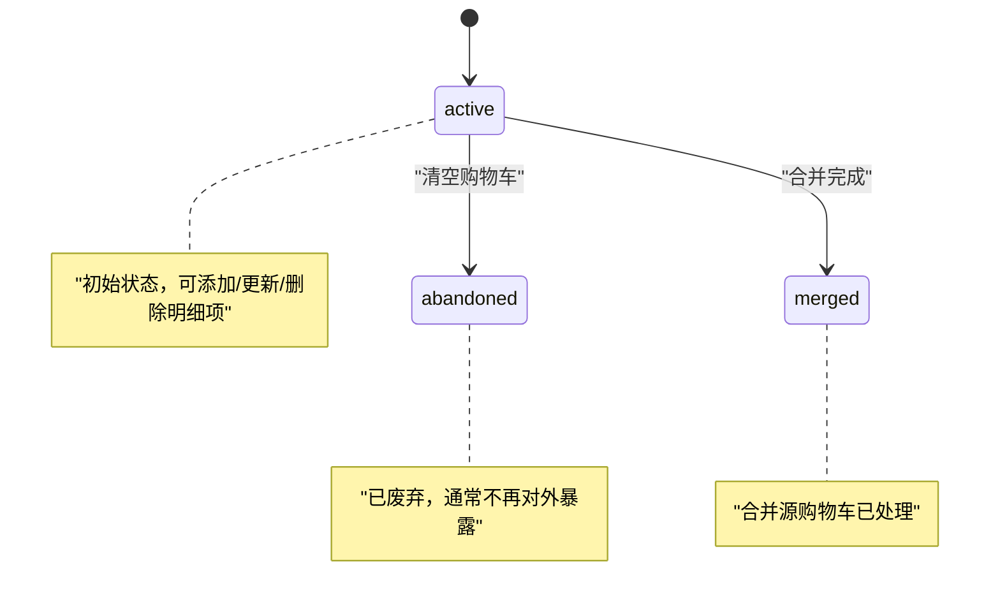
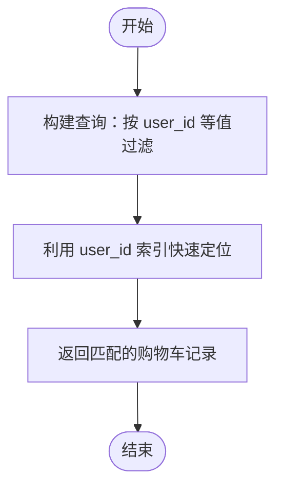
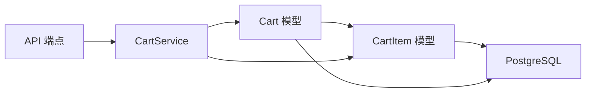

# 购物车主表

<cite>
**本文引用的文件**
- [app/models/cart.py](file://app/models/cart.py)
- [alembic/versions/286c2307065b_create_cart_tables.py](file://alembic/versions/286c2307065b_create_cart_tables.py)
- [app/schemas/cart.py](file://app/schemas/cart.py)
- [app/services/cart_service.py](file://app/services/cart_service.py)
- [app/db/session.py](file://app/db/session.py)
- [app/api/v1/endpoints/cart.py](file://app/api/v1/endpoints/cart.py)
</cite>

## 目录
1. [简介](#简介)
2. [项目结构](#项目结构)
3. [核心组件](#核心组件)
4. [架构总览](#架构总览)
5. [详细组件分析](#详细组件分析)
6. [依赖分析](#依赖分析)
7. [性能考虑](#性能考虑)
8. [故障排查指南](#故障排查指南)
9. [结论](#结论)
10. [附录](#附录)

## 简介
本文件聚焦于购物车主表实体 Cart 的数据模型与业务实现，结合 SQLAlchemy ORM 定义与 Alembic 迁移脚本，系统性说明字段含义、索引策略、关系映射、状态流转以及典型查询方式。同时给出通过 user_id 索引高效查找用户购物车的实践建议。

## 项目结构
围绕购物车模块的关键文件组织如下：
- 数据模型层：app/models/cart.py
- 数据库迁移：alembic/versions/286c2307065b_create_cart_tables.py
- 业务服务层：app/services/cart_service.py
- API 层：app/api/v1/endpoints/cart.py
- 数据库会话与基类：app/db/session.py
- 数据传输对象：app/schemas/cart.py

图表来源
- [app/models/cart.py](file://app/models/cart.py#L1-L37)
- [alembic/versions/286c2307065b_create_cart_tables.py](file://alembic/versions/286c2307065b_create_cart_tables.py#L21-L44)
- [app/services/cart_service.py](file://app/services/cart_service.py#L1-L125)
- [app/api/v1/endpoints/cart.py](file://app/api/v1/endpoints/cart.py#L33-L64)
- [app/db/session.py](file://app/db/session.py#L1-L24)
- [app/schemas/cart.py](file://app/schemas/cart.py#L1-L46)

章节来源
- [app/models/cart.py](file://app/models/cart.py#L1-L37)
- [alembic/versions/286c2307065b_create_cart_tables.py](file://alembic/versions/286c2307065b_create_cart_tables.py#L21-L44)
- [app/services/cart_service.py](file://app/services/cart_service.py#L1-L125)
- [app/api/v1/endpoints/cart.py](file://app/api/v1/endpoints/cart.py#L33-L64)
- [app/db/session.py](file://app/db/session.py#L1-L24)
- [app/schemas/cart.py](file://app/schemas/cart.py#L1-L46)

## 核心组件
本节从数据模型角度解析 Cart 主表字段、索引与关系映射，并结合迁移脚本确认数据库实际结构。

- 表名与主键
  - 表名：carts
  - 主键：id（UUID）
  - 参考路径：[表定义](file://app/models/cart.py#L10-L21)，[迁移脚本](file://alembic/versions/286c2307065b_create_cart_tables.py#L24-L31)

- 字段定义
  - id：UUID 主键，默认值为随机 UUID
  - user_id：UUID，可为空，带索引（便于按用户快速检索）
  - status：字符串，长度 20，缺省值为 'active'
  - created_at：时间戳，不可为空
  - updated_at：时间戳，不可为空，支持自动更新（触发器或 ORM onupdate）
  - 参考路径：[字段声明](file://app/models/cart.py#L13-L17)，[迁移脚本列定义](file://alembic/versions/286c2307065b_create_cart_tables.py#L25-L29)

- 关系映射
  - items：与 CartItem 的一对多关系，启用级联删除（delete-orphan），即当 CartItem 失去对 Cart 的引用时会被自动删除
  - 参考路径：[关系定义](file://app/models/cart.py#L18-L19)

- 数据库表结构核对
  - carts 表：id（PK）、user_id（Nullable，含索引）、status（Not Null，Default 'active'）、created_at、updated_at
  - cart_items 表：id（PK）、cart_id（FK -> carts.id, ondelete=CASCADE）、product_id、quantity、unit_price、added_at；并包含联合唯一约束（cart_id, product_id）与数量正数检查约束
  - 参考路径：[迁移脚本](file://alembic/versions/286c2307065b_create_cart_tables.py#L21-L44)

- 时间戳字段说明
  - created_at 默认值来自 ORM 映射
  - updated_at 使用 onupdate 自动更新
  - 参考路径：[字段映射](file://app/models/cart.py#L16-L17)

章节来源
- [app/models/cart.py](file://app/models/cart.py#L10-L21)
- [alembic/versions/286c2307065b_create_cart_tables.py](file://alembic/versions/286c2307065b_create_cart_tables.py#L21-L44)

## 架构总览
下图展示从 API 到服务再到模型与数据库的整体交互流程，突出 Cart 与 CartItem 的关系与外键约束。

图表来源
- [app/api/v1/endpoints/cart.py](file://app/api/v1/endpoints/cart.py#L33-L64)
- [app/services/cart_service.py](file://app/services/cart_service.py#L1-L125)
- [app/models/cart.py](file://app/models/cart.py#L1-L37)
- [app/schemas/cart.py](file://app/schemas/cart.py#L1-L46)
- [app/db/session.py](file://app/db/session.py#L1-L24)

## 详细组件分析

### Cart 实体字段详解
- id
  - 类型：UUID
  - 约束：主键，自动生成默认值
  - 作用：购物车唯一标识
  - 参考路径：[字段定义](file://app/models/cart.py#L13-L13)

- user_id
  - 类型：UUID
  - 约束：可为空，带索引
  - 作用：关联用户；为空表示匿名购物车
  - 参考路径：[字段定义](file://app/models/cart.py#L14-L14)，[索引创建](file://alembic/versions/286c2307065b_create_cart_tables.py#L32-L32)

- status
  - 类型：字符串，长度 20
  - 约束：非空，默认值 'active'
  - 作用：购物车状态，常见取值包括 active、abandoned、merged 等
  - 参考路径：[字段定义](file://app/models/cart.py#L14-L14)，[业务使用](file://app/services/cart_service.py#L90-L96)，[业务使用](file://app/services/cart_service.py#L115-L120)

- created_at / updated_at
  - 类型：DateTime
  - 约束：非空；updated_at 支持自动更新
  - 作用：记录创建与最后更新时间
  - 参考路径：[字段定义](file://app/models/cart.py#L16-L17)，[迁移脚本列定义](file://alembic/versions/286c2307065b_create_cart_tables.py#L28-L29)

- items 关系
  - 类型：一对多
  - 级联策略：delete-orphan
  - 作用：维护购物车与明细项的一致性
  - 参考路径：[关系定义](file://app/models/cart.py#L18-L19)

章节来源
- [app/models/cart.py](file://app/models/cart.py#L10-L21)
- [alembic/versions/286c2307065b_create_cart_tables.py](file://alembic/versions/286c2307065b_create_cart_tables.py#L21-L44)
- [app/services/cart_service.py](file://app/services/cart_service.py#L90-L120)

### Cart 与 CartItem 的关系建模
- 外键约束
  - cart_items.cart_id -> carts.id，ondelete=CASCADE
  - 保证购物车删除时明细级联清理
  - 参考路径：[外键约束](file://alembic/versions/286c2307065b_create_cart_tables.py#L40-L41)

- 联合唯一约束
  - (cart_id, product_id) 唯一，避免重复商品项
  - 参考路径：[联合唯一约束](file://alembic/versions/286c2307065b_create_cart_tables.py#L43-L43)

- 数量正数约束
  - quantity > 0
  - 参考路径：[数量约束](file://alembic/versions/286c2307065b_create_cart_tables.py#L40-L40)

- 反向关系
  - Cart.items 与 CartItem.cart 双向 back_populates
  - 参考路径：[反向关系](file://app/models/cart.py#L18-L19)，[反向关系](file://app/models/cart.py#L36-L36)

图表来源
- [app/models/cart.py](file://app/models/cart.py#L10-L37)

章节来源
- [app/models/cart.py](file://app/models/cart.py#L10-L37)
- [alembic/versions/286c2307065b_create_cart_tables.py](file://alembic/versions/286c2307065b_create_cart_tables.py#L21-L44)

### 状态流转与业务逻辑
- active：初始状态，表示购物车处于活跃可用状态
- abandoned：清空购物车时将状态置为 abandoned，并删除所有明细项
- merged：合并源购物车完成时，将其状态置为 merged
- 参考路径：[清空购物车状态变更](file://app/services/cart_service.py#L90-L96)，[合并购物车状态变更](file://app/services/cart_service.py#L115-L120)

图表来源
- [app/services/cart_service.py](file://app/services/cart_service.py#L90-L120)

章节来源
- [app/services/cart_service.py](file://app/services/cart_service.py#L90-L120)

### 查询示例：通过 user_id 索引高效查找用户购物车
- 场景：根据 user_id 查找对应购物车
- 实现要点：
  - user_id 字段带有索引，查询效率高
  - 业务层可直接按 user_id 条件查询
- 参考路径：[索引定义](file://alembic/versions/286c2307065b_create_cart_tables.py#L32-L32)，[模型字段](file://app/models/cart.py#L14-L14)

图表来源
- [app/models/cart.py](file://app/models/cart.py#L14-L14)
- [alembic/versions/286c2307065b_create_cart_tables.py](file://alembic/versions/286c2307065b_create_cart_tables.py#L32-L32)

章节来源
- [app/models/cart.py](file://app/models/cart.py#L14-L14)
- [alembic/versions/286c2307065b_create_cart_tables.py](file://alembic/versions/286c2307065b_create_cart_tables.py#L32-L32)

## 依赖分析
- 组件耦合
  - Cart 与 CartItem 通过外键 cart_id 关联，形成强一致的主从关系
  - 级联删除确保明细项与主表同步
- 外部依赖
  - 数据库：PostgreSQL（UUID、DateTime、Numeric 等类型）
  - ORM：SQLAlchemy 2.0（异步模式）
  - 迁移工具：Alembic
- 参考路径：[外键约束](file://alembic/versions/286c2307065b_create_cart_tables.py#L40-L41)，[异步会话](file://app/db/session.py#L1-L24)

图表来源
- [app/models/cart.py](file://app/models/cart.py#L10-L37)
- [alembic/versions/286c2307065b_create_cart_tables.py](file://alembic/versions/286c2307065b_create_cart_tables.py#L21-L44)
- [app/services/cart_service.py](file://app/services/cart_service.py#L1-L125)
- [app/api/v1/endpoints/cart.py](file://app/api/v1/endpoints/cart.py#L33-L64)

章节来源
- [app/models/cart.py](file://app/models/cart.py#L10-L37)
- [alembic/versions/286c2307065b_create_cart_tables.py](file://alembic/versions/286c2307065b_create_cart_tables.py#L21-L44)
- [app/services/cart_service.py](file://app/services/cart_service.py#L1-L125)
- [app/api/v1/endpoints/cart.py](file://app/api/v1/endpoints/cart.py#L33-L64)
- [app/db/session.py](file://app/db/session.py#L1-L24)

## 性能考虑
- 索引优化
  - user_id 建有普通索引，适合等值查询
  - cart_items 上的 (cart_id, product_id) 联合唯一索引，避免重复项并加速去重/聚合
- 级联删除
  - 删除 CartItem 时无需额外清理逻辑，减少应用层负担
- 时间戳更新
  - updated_at onupdate 由 ORM 控制，避免手工更新遗漏
- 参考路径：[索引创建](file://alembic/versions/286c2307065b_create_cart_tables.py#L32-L32)，[联合唯一约束](file://alembic/versions/286c2307065b_create_cart_tables.py#L43-L43)，[updated_at 映射](file://app/models/cart.py#L16-L17)

章节来源
- [alembic/versions/286c2307065b_create_cart_tables.py](file://alembic/versions/286c2307065b_create_cart_tables.py#L32-L32)
- [app/models/cart.py](file://app/models/cart.py#L16-L17)

## 故障排查指南
- 常见错误与定位
  - 购物车不存在：服务层在查询不到购物车时抛出 404
    - 参考路径：[异常抛出位置](file://app/services/cart_service.py#L15-L22)
  - 明细不存在：更新/删除明细时若找不到项抛出 404
    - 参考路径：[异常抛出位置](file://app/services/cart_service.py#L64-L75)，[异常抛出位置](file://app/services/cart_service.py#L77-L88)
- 业务状态异常
  - 若发现状态不符合预期（如 merged/abandoned），检查服务层状态变更逻辑
    - 参考路径：[清空状态变更](file://app/services/cart_service.py#L90-L96)，[合并状态变更](file://app/services/cart_service.py#L115-L120)
- 数据约束问题
  - quantity 必须大于 0；重复商品项会被拒绝（联合唯一）
    - 参考路径：[数量约束](file://alembic/versions/286c2307065b_create_cart_tables.py#L40-L40)，[联合唯一约束](file://alembic/versions/286c2307065b_create_cart_tables.py#L43-L43)

章节来源
- [app/services/cart_service.py](file://app/services/cart_service.py#L15-L22)
- [app/services/cart_service.py](file://app/services/cart_service.py#L64-L88)
- [app/services/cart_service.py](file://app/services/cart_service.py#L90-L96)
- [app/services/cart_service.py](file://app/services/cart_service.py#L115-L120)
- [alembic/versions/286c2307065b_create_cart_tables.py](file://alembic/versions/286c2307065b_create_cart_tables.py#L40-L43)

## 结论
本文基于 SQLAlchemy 模型与 Alembic 迁移脚本，系统梳理了 Cart 主表的字段、索引、关系与状态流转，并结合服务层业务逻辑给出了查询与故障排查建议。该设计在保证数据一致性的同时，兼顾了查询效率与扩展性。

## 附录
- 数据模型与迁移对照
  - carts 表：id（PK）、user_id（Nullable，含索引）、status（Not Null，Default 'active'）、created_at、updated_at
  - cart_items 表：id（PK）、cart_id（FK -> carts.id, ondelete=CASCADE）、product_id、quantity、unit_price、added_at；(cart_id, product_id) 联合唯一；quantity 正数约束
  - 参考路径：[迁移脚本](file://alembic/versions/286c2307065b_create_cart_tables.py#L21-L44)

章节来源
- [alembic/versions/286c2307065b_create_cart_tables.py](file://alembic/versions/286c2307065b_create_cart_tables.py#L21-L44)