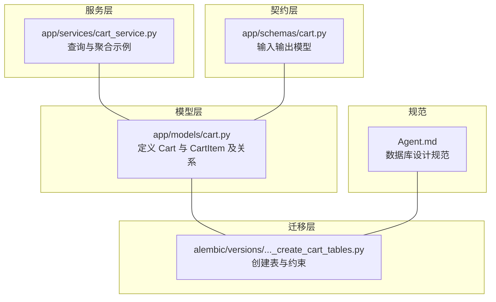
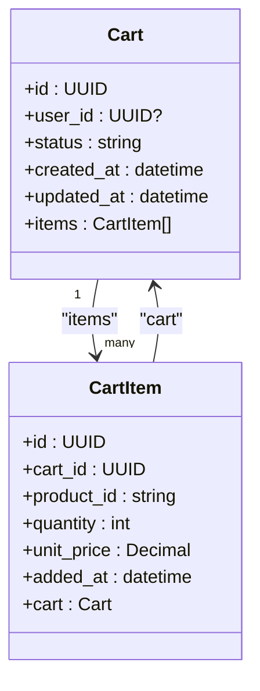
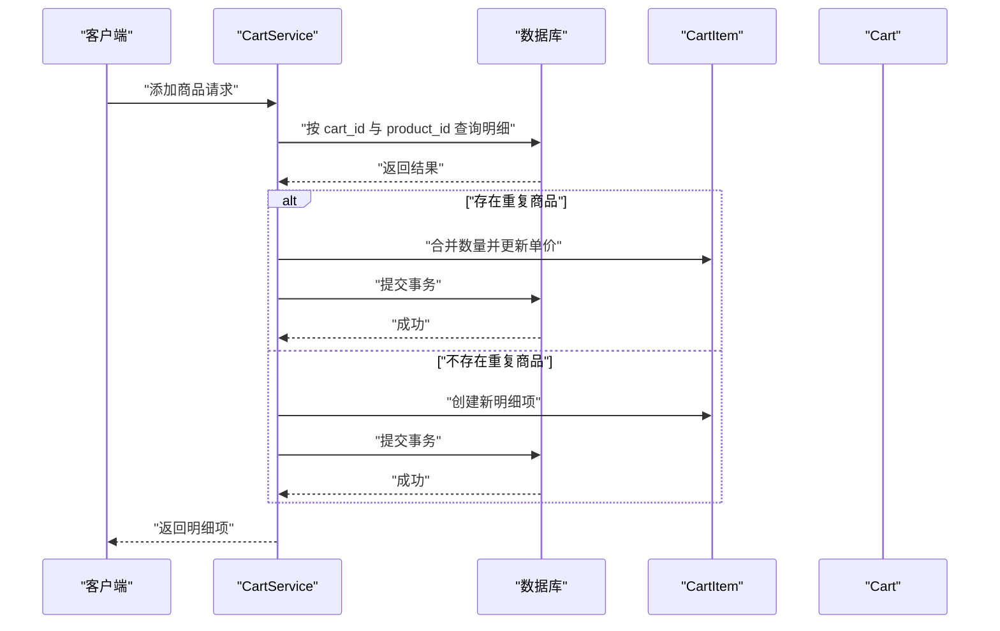
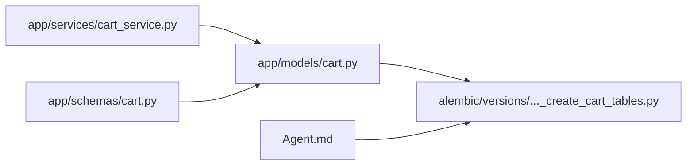

# 购物车明细表

<cite>
**本文引用的文件**
- [app/models/cart.py](file://app/models/cart.py)
- [alembic/versions/286c2307065b_create_cart_tables.py](file://alembic/versions/286c2307065b_create_cart_tables.py)
- [app/services/cart_service.py](file://app/services/cart_service.py)
- [app/schemas/cart.py](file://app/schemas/cart.py)
- [Agent.md](file://Agent.md)
</cite>

## 目录
1. [简介](#简介)
2. [项目结构](#项目结构)
3. [核心组件](#核心组件)
4. [架构总览](#架构总览)
5. [详细组件分析](#详细组件分析)
6. [依赖分析](#依赖分析)
7. [性能考虑](#性能考虑)
8. [故障排查指南](#故障排查指南)
9. [结论](#结论)

## 简介
本文件围绕购物车明细表（cart_items）中的核心实体 CartItem 展开，系统性梳理其字段语义、约束与索引、外键关系、以及与购物车主表（carts）的双向关联。同时结合迁移脚本对表结构的落地实现进行对照说明，并总结基于 cart_id 的高效查询模式与常见数据访问模式。

## 项目结构
- 模型层位于 app/models/cart.py，定义了 Cart 与 CartItem 的 ORM 映射及关系。
- 迁移脚本位于 alembic/versions/286c2307065b_create_cart_tables.py，负责创建 carts 与 cart_items 表及其约束。
- 业务服务位于 app/services/cart_service.py，展示如何通过 SQLAlchemy 查询与聚合计算。
- 数据契约位于 app/schemas/cart.py，定义输入输出模型，确保字段范围与约束一致。
- Agent.md 提供数据库设计规范与 API 规范，作为设计约束的参考依据。

图表来源
- [app/models/cart.py](file://app/models/cart.py#L1-L37)
- [alembic/versions/286c2307065b_create_cart_tables.py](file://alembic/versions/286c2307065b_create_cart_tables.py#L21-L44)
- [app/services/cart_service.py](file://app/services/cart_service.py#L1-L124)
- [app/schemas/cart.py](file://app/schemas/cart.py#L1-L45)
- [Agent.md](file://Agent.md#L22-L46)

章节来源
- [app/models/cart.py](file://app/models/cart.py#L1-L37)
- [alembic/versions/286c2307065b_create_cart_tables.py](file://alembic/versions/286c2307065b_create_cart_tables.py#L21-L44)
- [app/services/cart_service.py](file://app/services/cart_service.py#L1-L124)
- [app/schemas/cart.py](file://app/schemas/cart.py#L1-L45)
- [Agent.md](file://Agent.md#L22-L46)

## 核心组件
- CartItem 实体承载购物车明细的核心数据，包含主键 id、外键 cart_id、商品标识 product_id、购买数量 quantity、单价 unit_price、加入时间 added_at。
- 唯一约束 uq_cart_product 保证同一购物车下商品不重复；检查约束 ck_quantity_positive 确保数量大于 0。
- 外键约束 ondelete="CASCADE" 使购物车删除时明细自动级联清理。
- 关系属性 cart 与 items 实现双向关联，便于按购物车聚合明细并进行批量操作。

章节来源
- [app/models/cart.py](file://app/models/cart.py#L22-L37)
- [alembic/versions/286c2307065b_create_cart_tables.py](file://alembic/versions/286c2307065b_create_cart_tables.py#L33-L44)

## 架构总览
下图展示了 Cart 与 CartItem 的对象关系与外键约束，以及迁移脚本对表结构的落地。

图表来源
- [app/models/cart.py](file://app/models/cart.py#L10-L37)

章节来源
- [app/models/cart.py](file://app/models/cart.py#L10-L37)

## 详细组件分析

### CartItem 字段与约束详解
- id（UUID 主键）
  - 作用：唯一标识购物车明细项。
  - 设计：使用 UUID 作为主键，避免自增键带来的并发与分布式问题。
- cart_id（UUID 外键，关联 carts.id，ondelete=CASCADE）
  - 作用：指向所属购物车。
  - 设计：外键约束确保引用完整性；级联删除保障购物车被删除时明细同步清理。
- product_id（字符串，最大长度 100）
  - 作用：商品标识（建议为 SKU）。
  - 设计：配合唯一约束实现“同一购物车内商品不重复”。
- quantity（整数，>0 的检查约束）
  - 作用：购买数量。
  - 设计：通过检查约束保证业务有效性，防止负数或零数量。
- unit_price（十进制，精度 10，小数 2）
  - 作用：加入购物车时的单价，用于价格快照与后续计算。
  - 设计：使用 Numeric(10,2) 精确到分，避免浮点误差。
- added_at（时间戳）
  - 作用：记录明细加入时间。
  - 设计：默认值为当前时间，便于排序与审计。

章节来源
- [app/models/cart.py](file://app/models/cart.py#L22-L37)
- [alembic/versions/286c2307065b_create_cart_tables.py](file://alembic/versions/286c2307065b_create_cart_tables.py#L33-L44)
- [app/schemas/cart.py](file://app/schemas/cart.py#L7-L16)

### 唯一约束与检查约束
- 唯一约束 uq_cart_product（cart_id, product_id）
  - 作用：确保同一购物车内的商品不重复，避免插入重复行。
  - 影响：当尝试添加重复商品时，需先合并数量或抛出异常。
- 检查约束 ck_quantity_positive（quantity > 0）
  - 作用：保证数量始终为正数，提升数据质量与业务一致性。

章节来源
- [app/models/cart.py](file://app/models/cart.py#L24-L27)
- [alembic/versions/286c2307065b_create_cart_tables.py](file://alembic/versions/286c2307065b_create_cart_tables.py#L40-L43)

### 外键与索引
- 外键：cart_id -> carts.id（ondelete=CASCADE）
  - 迁移脚本中通过 ForeignKeyConstraint 定义。
- 索引：carts.user_id（非唯一索引）
  - 迁移脚本中通过 create_index 定义。
- 主键：cart_items.id（UUID）

章节来源
- [alembic/versions/286c2307065b_create_cart_tables.py](file://alembic/versions/286c2307065b_create_cart_tables.py#L24-L44)

### 关系属性与反向关联
- Cart.items：一对多集合，back_populates="items"，支持从购物车侧批量加载明细。
- CartItem.cart：多对一关系，back_populates="items"，支持从明细侧回溯所属购物车。
- 级联行为：在 Cart.items 上声明 cascade="all, delete-orphan"，与迁移脚本的 ondelete="CASCADE" 协同，确保删除购物车时明细被清理。

章节来源
- [app/models/cart.py](file://app/models/cart.py#L19-L21)
- [app/models/cart.py](file://app/models/cart.py#L36-L37)
- [alembic/versions/286c2307065b_create_cart_tables.py](file://alembic/versions/286c2307065b_create_cart_tables.py#L41-L43)

### 数据访问模式与高效查询
- 按 cart_id 查询所有商品项
  - 使用 select(CartItem).where(CartItem.cart_id == cart_id) 进行过滤。
  - 在服务层中，可通过 join 或直接按外键过滤实现。
- 聚合与计算
  - 通过遍历 items 并使用 quantity × unit_price 计算总价，见 calculate_total。
- 典型流程（新增商品）
  - 先按 cart_id 与 product_id 查询是否存在重复项，若存在则合并数量并更新单价，否则新建明细项。
  - 更新购物车的 updated_at 时间以反映最近变更。

图表来源
- [app/services/cart_service.py](file://app/services/cart_service.py#L33-L61)
- [app/models/cart.py](file://app/models/cart.py#L22-L37)

章节来源
- [app/services/cart_service.py](file://app/services/cart_service.py#L33-L61)
- [app/services/cart_service.py](file://app/services/cart_service.py#L122-L124)

### 字段范围与约束一致性校验
- 输入校验：Pydantic 模型对 quantity 与 unit_price 设置 gt=0，确保进入服务层的数据满足业务要求。
- 数据库约束：迁移脚本与模型层均定义了检查约束与唯一约束，形成“应用层 + 数据库层”的双重保障。

章节来源
- [app/schemas/cart.py](file://app/schemas/cart.py#L7-L16)
- [alembic/versions/286c2307065b_create_cart_tables.py](file://alembic/versions/286c2307065b_create_cart_tables.py#L40-L43)
- [app/models/cart.py](file://app/models/cart.py#L24-L27)

## 依赖分析
- CartItem 对 carts 表的依赖体现在外键约束与级联删除策略上。
- 服务层依赖模型层提供的关系与查询接口，实现按购物车聚合明细与计算总价。
- 迁移脚本是表结构与约束的权威来源，模型层与服务层需与其保持一致。

图表来源
- [app/models/cart.py](file://app/models/cart.py#L10-L37)
- [alembic/versions/286c2307065b_create_cart_tables.py](file://alembic/versions/286c2307065b_create_cart_tables.py#L21-L44)
- [app/services/cart_service.py](file://app/services/cart_service.py#L1-L124)
- [app/schemas/cart.py](file://app/schemas/cart.py#L1-L45)
- [Agent.md](file://Agent.md#L22-L46)

章节来源
- [app/models/cart.py](file://app/models/cart.py#L10-L37)
- [alembic/versions/286c2307065b_create_cart_tables.py](file://alembic/versions/286c2307065b_create_cart_tables.py#L21-L44)
- [app/services/cart_service.py](file://app/services/cart_service.py#L1-L124)
- [app/schemas/cart.py](file://app/schemas/cart.py#L1-L45)
- [Agent.md](file://Agent.md#L22-L46)

## 性能考虑
- 复合唯一索引：(cart_id, product_id) 有效避免重复插入与加速去重合并。
- 外键与级联：在删除购物车时自动清理明细，减少冗余数据与查询干扰。
- 查询优化：按 cart_id 过滤明细时，建议确保 cart_id 为 UUID 类型且具备合适索引（迁移脚本已创建）。
- 数值精度：unit_price 使用 Numeric(10,2) 精确到分，避免浮点误差导致的计算偏差。
- 聚合计算：总价计算在应用层完成，注意大数据量时的内存占用与序列化成本。

## 故障排查指南
- 新增商品时报唯一约束冲突
  - 现象：插入失败，提示违反 uq_cart_product。
  - 处理：先查询该购物车是否已有相同 product_id，若有则合并数量并更新单价。
- 数量为负或零导致插入失败
  - 现象：违反 ck_quantity_positive。
  - 处理：前端或服务层校验 quantity > 0，或在数据库层拦截。
- 删除购物车后明细未清理
  - 现象：明细仍存在。
  - 处理：确认迁移脚本已执行，外键 ondelete=CASCADE 生效；检查模型层 cascade 配置。
- 查询效率低
  - 现象：按 cart_id 查询明细慢。
  - 处理：确认迁移脚本已创建索引；避免 N+1 查询，使用 join 或批量加载。

章节来源
- [alembic/versions/286c2307065b_create_cart_tables.py](file://alembic/versions/286c2307065b_create_cart_tables.py#L40-L43)
- [app/models/cart.py](file://app/models/cart.py#L24-L27)
- [app/services/cart_service.py](file://app/services/cart_service.py#L33-L61)

## 结论
CartItem 是购物车明细表的核心实体，其字段与约束共同保障了数据一致性与业务正确性。迁移脚本准确落地了外键、唯一约束与检查约束，模型层通过关系属性实现了与购物车主表的双向关联。服务层提供了按 cart_id 查询、合并重复项、更新单价与计算总价等典型数据访问模式。遵循本文所述设计与实践，可在保证数据质量的同时获得良好的查询与维护体验。