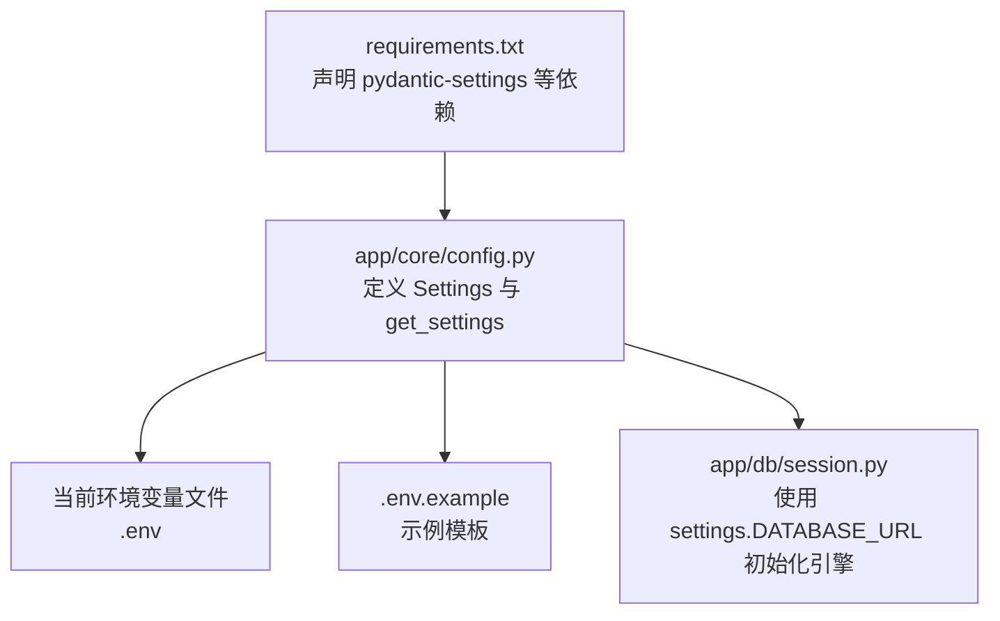
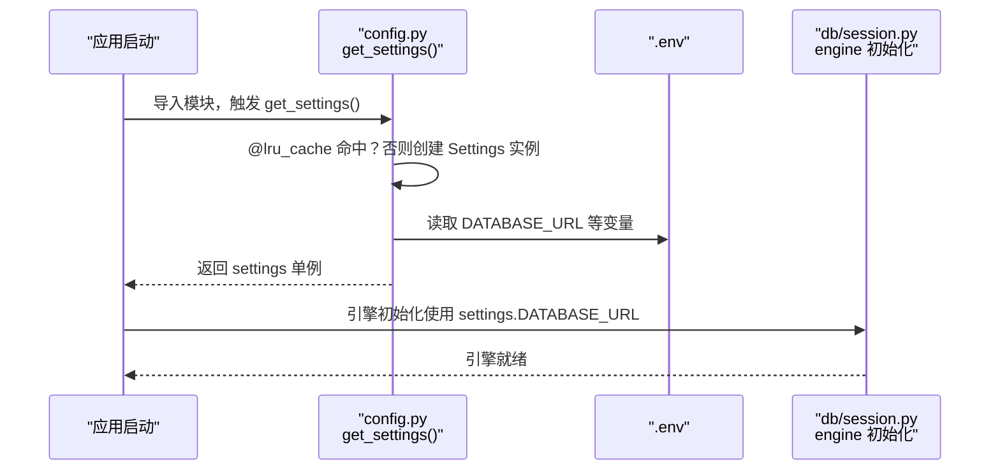
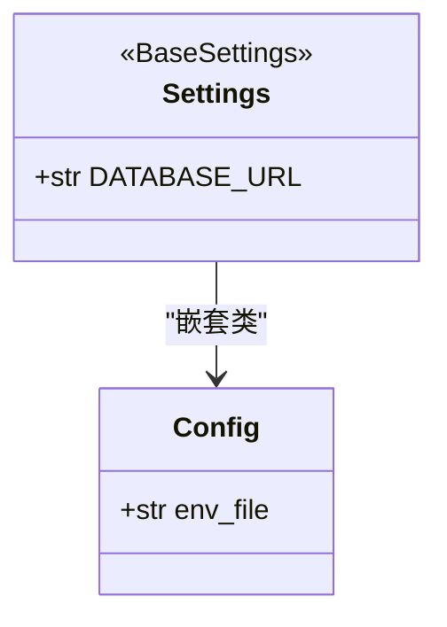
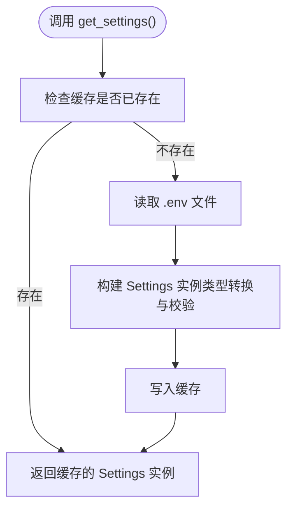
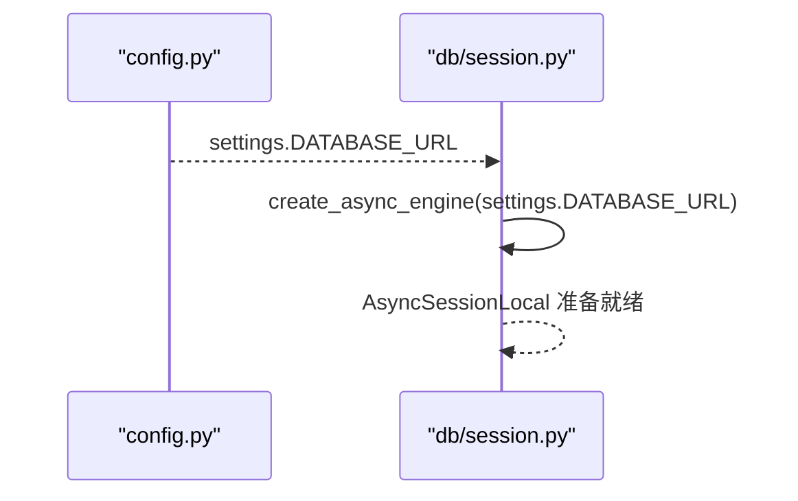
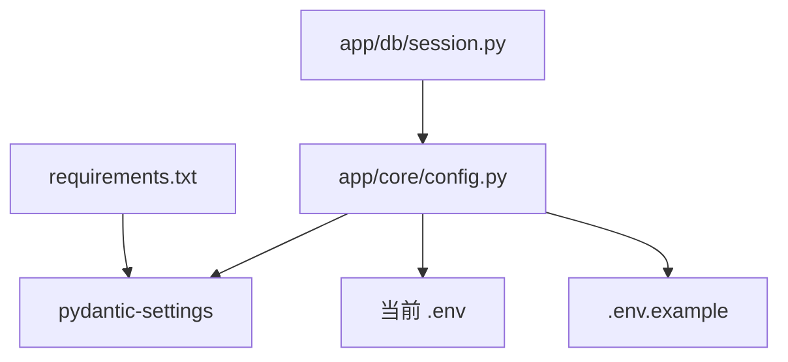

# 配置管理

<cite>
**本文引用的文件**
- [app/core/config.py](file://app/core/config.py)
- [.env](file://.env)
- [.env.example](file://.env.example)
- [app/db/session.py](file://app/db/session.py)
- [requirements.txt](file://requirements.txt)
</cite>

## 目录
1. [简介](#简介)
2. [项目结构](#项目结构)
3. [核心组件](#核心组件)
4. [架构总览](#架构总览)
5. [详细组件分析](#详细组件分析)
6. [依赖分析](#依赖分析)
7. [性能考虑](#性能考虑)
8. [故障排查指南](#故障排查指南)
9. [结论](#结论)
10. [附录](#附录)

## 简介
本文件聚焦于项目的配置管理机制，系统性说明如何通过 Pydantic 的 BaseSettings 类型安全地定义与验证应用配置；解释配置项如何从 .env 文件加载，并强调 .env.example 作为模板的重要作用；阐述 @lru_cache 装饰器如何缓存配置实例以提升性能；最后给出所有可用配置参数、默认值、数据类型及在不同环境（开发、生产）下的设置建议。

## 项目结构
围绕配置管理的关键文件与职责如下：
- app/core/config.py：定义 Settings 类与 get_settings 工厂函数，负责读取 .env 并提供全局 settings 实例。
- .env：当前项目运行所需的环境变量文件。
- .env.example：示例模板，用于指导开发者正确填写所需变量。
- app/db/session.py：在数据库引擎初始化时直接使用 settings.DATABASE_URL。
- requirements.txt：声明 pydantic-settings 等依赖，确保 BaseSettings 可用。

图表来源
- [app/core/config.py](file://app/core/config.py#L1-L18)
- [.env](file://.env#L1-L2)
- [.env.example](file://.env.example#L1-L2)
- [app/db/session.py](file://app/db/session.py#L1-L24)
- [requirements.txt](file://requirements.txt#L1-L9)

章节来源
- [app/core/config.py](file://app/core/config.py#L1-L18)
- [.env](file://.env#L1-L2)
- [.env.example](file://.env.example#L1-L2)
- [app/db/session.py](file://app/db/session.py#L1-L24)
- [requirements.txt](file://requirements.txt#L1-L9)

## 核心组件
- Settings 类
  - 使用 Pydantic 的 BaseSettings 定义配置模型，具备自动类型转换与校验能力。
  - 默认值为开发环境常用值，便于本地快速启动。
  - 通过 Config.env_file 指定 .env 作为配置源文件。
- get_settings 工厂函数
  - 返回 Settings 实例，并通过 @lru_cache 缓存结果，避免重复解析与实例化带来的开销。
- settings 全局实例
  - 在模块导入时即调用 get_settings() 创建全局单例，供其他模块直接使用。

章节来源
- [app/core/config.py](file://app/core/config.py#L1-L18)

## 架构总览
配置加载与使用流程如下：
- 应用启动时，模块导入触发 get_settings() 调用。
- get_settings() 通过 @lru_cache 缓存 Settings 实例。
- Settings 依据 Config.env_file 从 .env 加载变量，完成类型转换与校验。
- 数据库模块在初始化引擎时读取 settings.DATABASE_URL。

图表来源
- [app/core/config.py](file://app/core/config.py#L1-L18)
- [.env](file://.env#L1-L2)
- [app/db/session.py](file://app/db/session.py#L1-L24)

## 详细组件分析

### Settings 类与配置项定义
- 配置项
  - DATABASE_URL：数据库连接字符串，类型为 str，提供默认值以便本地开发。
- 加载来源
  - 通过 Config.env_file 指向 .env，Pydantic 将自动从该文件读取同名键值对。
- 类型安全与校验
  - 由于使用 BaseSettings，字段会在访问前进行类型转换与校验，有助于尽早发现配置错误。

图表来源
- [app/core/config.py](file://app/core/config.py#L1-L18)

章节来源
- [app/core/config.py](file://app/core/config.py#L1-L18)

### 配置加载与缓存策略
- .env 与 .env.example
  - .env 为当前项目实际使用的环境变量文件。
  - .env.example 提供变量清单与示例值，是团队协作与部署的标准模板，建议每次新增配置项时同步更新示例文件。
- @lru_cache 缓存
  - 通过缓存 Settings 实例，避免重复解析 .env 与重复实例化，降低启动与运行时开销。
  - 适合在进程生命周期内只读取一次配置的场景。

图表来源
- [app/core/config.py](file://app/core/config.py#L1-L18)

章节来源
- [app/core/config.py](file://app/core/config.py#L1-L18)
- [.env](file://.env#L1-L2)
- [.env.example](file://.env.example#L1-L2)

### 配置在数据库模块中的使用
- 数据库引擎初始化
  - 在 app/db/session.py 中，直接使用 settings.DATABASE_URL 创建异步引擎。
  - 这体现了配置的集中式管理与低耦合使用方式。

图表来源
- [app/core/config.py](file://app/core/config.py#L1-L18)
- [app/db/session.py](file://app/db/session.py#L1-L24)

章节来源
- [app/db/session.py](file://app/db/session.py#L1-L24)

## 依赖分析
- 依赖声明
  - requirements.txt 明确声明了 pydantic 与 pydantic-settings 的版本要求，确保 BaseSettings 可用。
- 组件耦合
  - app/db/session.py 对 settings 的依赖仅限于 DATABASE_URL 字段，耦合度低，便于替换或扩展。
- 外部文件依赖
  - .env 与 .env.example 作为外部配置源，需与代码约定保持一致。

图表来源
- [requirements.txt](file://requirements.txt#L1-L9)
- [app/core/config.py](file://app/core/config.py#L1-L18)
- [.env](file://.env#L1-L2)
- [.env.example](file://.env.example#L1-L2)
- [app/db/session.py](file://app/db/session.py#L1-L24)

章节来源
- [requirements.txt](file://requirements.txt#L1-L9)
- [app/core/config.py](file://app/core/config.py#L1-L18)
- [app/db/session.py](file://app/db/session.py#L1-L24)

## 性能考虑
- 缓存策略
  - 使用 @lru_cache 缓存 Settings 实例，避免重复解析 .env 与重复实例化，减少 I/O 与对象创建成本。
- 启动优化
  - 将配置集中到模块级单例，可减少后续模块导入时的重复初始化。
- 运行期开销
  - BaseSettings 的类型转换与校验在首次实例化时发生，后续访问为常量时间，有利于运行期性能稳定。

章节来源
- [app/core/config.py](file://app/core/config.py#L1-L18)

## 故障排查指南
- 配置未生效
  - 检查 .env 是否与 Settings 字段名一致（大小写敏感），且路径正确。
  - 确认 .env 文件编码与换行符符合预期。
- 类型转换失败
  - 若 DATABASE_URL 格式不正确，BaseSettings 会在实例化时抛出异常，应根据异常信息修正格式。
- 缓存导致的旧值问题
  - 若修改 .env 后需要重新加载，需重启进程以清空缓存并重新实例化 Settings。
- 依赖缺失
  - 确保 pydantic 与 pydantic-settings 版本满足 requirements.txt 要求。

章节来源
- [app/core/config.py](file://app/core/config.py#L1-L18)
- [requirements.txt](file://requirements.txt#L1-L9)

## 结论
本项目采用 Pydantic BaseSettings 对配置进行类型安全定义与校验，结合 .env/.env.example 的约定式管理与 @lru_cache 的缓存策略，实现了简洁、可靠且高性能的配置体系。建议在团队协作中持续维护 .env.example，确保新成员能快速正确地搭建运行环境。

## 附录

### 可用配置参数一览
- DATABASE_URL
  - 类型：字符串
  - 默认值：开发环境常用默认值
  - 来源：.env
  - 用途：数据库连接字符串，供数据库引擎初始化使用

章节来源
- [app/core/config.py](file://app/core/config.py#L1-L18)
- [app/db/session.py](file://app/db/session.py#L1-L24)

### 环境设置建议
- 开发环境
  - 使用 .env 中的默认 DATABASE_URL 或按本地数据库实际地址调整。
  - 保持 .env 与 .env.example 同步，便于团队共享。
- 生产环境
  - 通过环境变量注入 DATABASE_URL，避免将敏感信息提交到仓库。
  - 严格遵循 .env.example 的字段清单，确保部署一致性。
  - 如需额外配置项，请同步更新 .env.example。

章节来源
- [.env](file://.env#L1-L2)
- [.env.example](file://.env.example#L1-L2)
- [app/core/config.py](file://app/core/config.py#L1-L18)