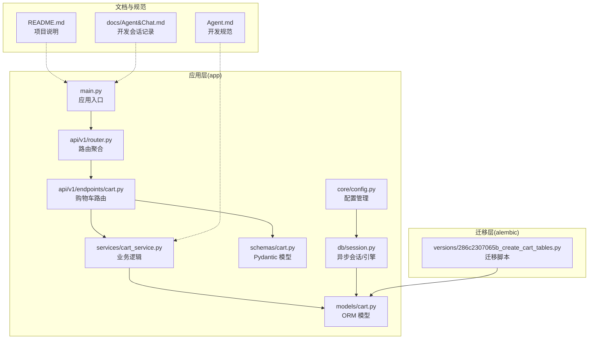
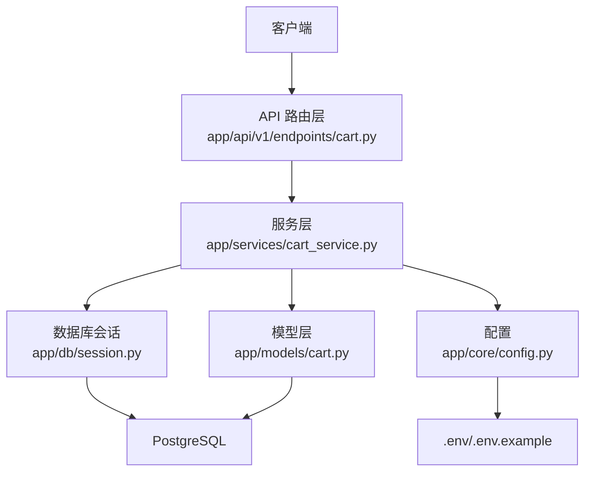
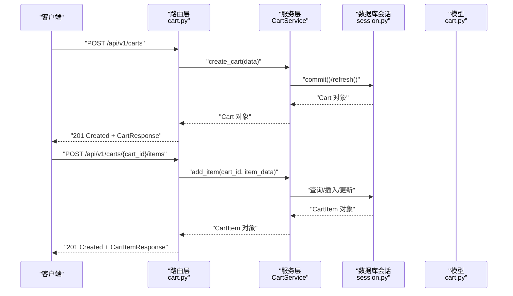
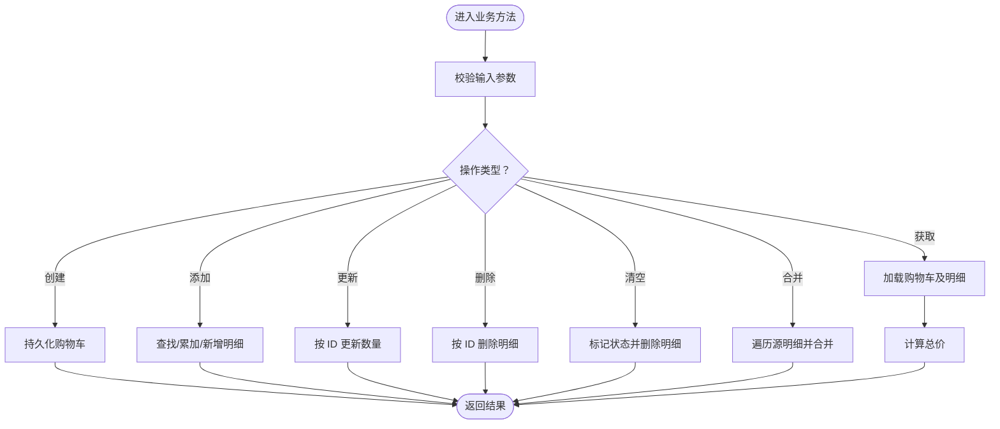
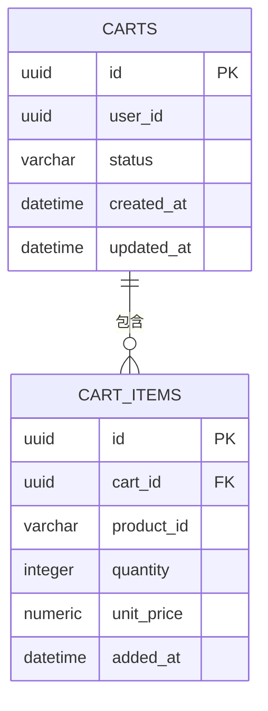
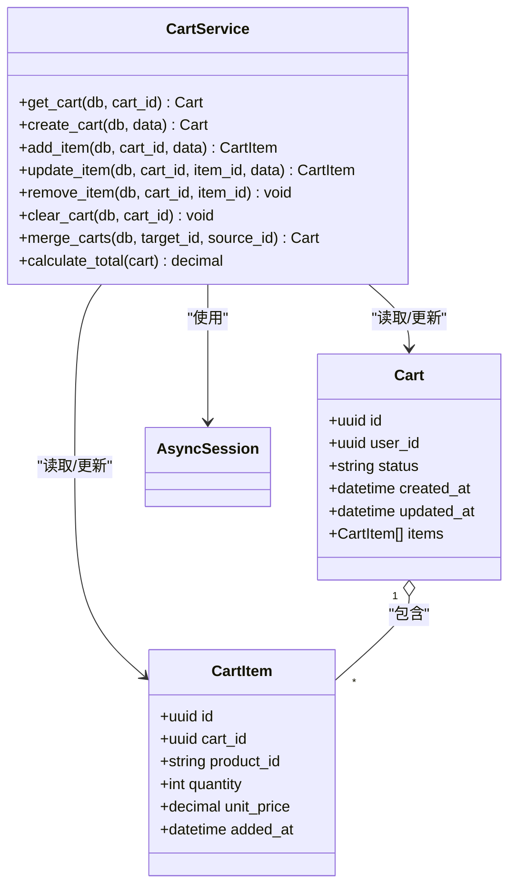
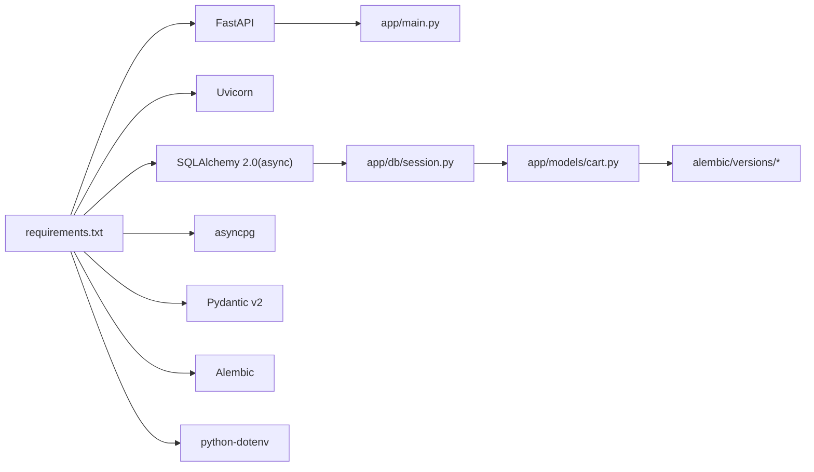

# 项目概述

<cite>
**本文引用的文件**
- [README.md](file://README.md)
- [Agent.md](file://Agent.md)
- [Agent&Chat.md](file://docs/Agent&Chat.md)
- [app/main.py](file://app/main.py)
- [app/api/v1/router.py](file://app/api/v1/router.py)
- [app/api/v1/endpoints/cart.py](file://app/api/v1/endpoints/cart.py)
- [app/services/cart_service.py](file://app/services/cart_service.py)
- [app/models/cart.py](file://app/models/cart.py)
- [app/schemas/cart.py](file://app/schemas/cart.py)
- [app/db/session.py](file://app/db/session.py)
- [app/core/config.py](file://app/core/config.py)
- [alembic/versions/286c2307065b_create_cart_tables.py](file://alembic/versions/286c2307065b_create_cart_tables.py)
- [requirements.txt](file://requirements.txt)
</cite>

## 目录
1. [引言](#引言)
2. [项目结构](#项目结构)
3. [核心组件](#核心组件)
4. [架构总览](#架构总览)
5. [详细组件分析](#详细组件分析)
6. [依赖分析](#依赖分析)
7. [性能考虑](#性能考虑)
8. [故障排查指南](#故障排查指南)
9. [结论](#结论)
10. [附录](#附录)

## 引言
本项目是一个基于 FastAPI 构建的高性能电商购物车微服务，专注于购物车全生命周期管理，包括购物车创建、商品增删改查、购物车合并、价格快照与异步 I/O 等能力。项目遵循异步优先、类型安全与 RESTful 设计原则，采用分层架构（API 层、服务层、数据层），并通过 SQLAlchemy 2.0 异步 ORM 与 PostgreSQL 数据库实现高并发下的可靠数据持久化。

该服务在电商系统中承担“会话态购物车”的核心职责：支持匿名用户与登录用户的购物车会话，提供统一的购物车数据模型与接口，为订单中心、库存校验、价格计算等上游模块提供一致的数据来源。

## 项目结构
项目采用清晰的分层目录组织，便于维护与扩展：
- app/：应用主体，包含 API、服务、模型、模式、数据库会话与配置
- alembic/：数据库迁移脚本与配置
- docs/：开发过程与会话记录文档
- 根目录：环境变量模板、依赖清单与快速开始说明

图表来源
- [app/main.py](file://app/main.py#L1-L17)
- [app/api/v1/router.py](file://app/api/v1/router.py#L1-L6)
- [app/api/v1/endpoints/cart.py](file://app/api/v1/endpoints/cart.py#L1-L65)
- [app/services/cart_service.py](file://app/services/cart_service.py#L1-L125)
- [app/models/cart.py](file://app/models/cart.py#L1-L37)
- [app/schemas/cart.py](file://app/schemas/cart.py#L1-L46)
- [app/db/session.py](file://app/db/session.py#L1-L24)
- [app/core/config.py](file://app/core/config.py#L1-L18)
- [alembic/versions/286c2307065b_create_cart_tables.py](file://alembic/versions/286c2307065b_create_cart_tables.py#L1-L55)
- [README.md](file://README.md#L43-L59)
- [Agent.md](file://Agent.md#L83-L99)

章节来源
- [README.md](file://README.md#L43-L59)
- [Agent.md](file://Agent.md#L83-L99)

## 核心组件
- API 层（路由与控制器）
  - 路由聚合：将购物车相关路由注册到统一前缀
  - 控制器：提供 RESTful 接口，负责请求解析、响应封装与状态码控制
- 服务层（业务逻辑）
  - 购物车服务：封装 CRUD、合并、清空、价格计算等核心业务
- 数据层（模型与会话）
  - ORM 模型：定义购物车与明细表结构、约束与关系
  - 异步会话：提供异步数据库连接、事务与依赖注入
- 配置层（环境与设置）
  - 配置管理：从环境变量加载数据库连接字符串
- 迁移层（数据库演进）
  - 迁移脚本：创建/回滚购物车相关表结构

章节来源
- [app/api/v1/router.py](file://app/api/v1/router.py#L1-L6)
- [app/api/v1/endpoints/cart.py](file://app/api/v1/endpoints/cart.py#L1-L65)
- [app/services/cart_service.py](file://app/services/cart_service.py#L1-L125)
- [app/models/cart.py](file://app/models/cart.py#L1-L37)
- [app/db/session.py](file://app/db/session.py#L1-L24)
- [app/core/config.py](file://app/core/config.py#L1-L18)
- [alembic/versions/286c2307065b_create_cart_tables.py](file://alembic/versions/286c2307065b_create_cart_tables.py#L1-L55)

## 架构总览
系统采用经典的三层架构：
- API 层：接收 HTTP 请求，进行参数校验与响应序列化
- 服务层：编排业务规则，协调数据访问与外部依赖
- 数据层：通过异步 ORM 与数据库交互，保证一致性与性能

图表来源
- [app/api/v1/endpoints/cart.py](file://app/api/v1/endpoints/cart.py#L1-L65)
- [app/services/cart_service.py](file://app/services/cart_service.py#L1-L125)
- [app/models/cart.py](file://app/models/cart.py#L1-L37)
- [app/db/session.py](file://app/db/session.py#L1-L24)
- [app/core/config.py](file://app/core/config.py#L1-L18)

## 详细组件分析

### API 层（路由与控制器）
- 路由聚合：将购物车相关路由注册到统一前缀，便于版本化与扩展
- 控制器方法：
  - 获取购物车详情：返回购物车与明细，并计算总价
  - 创建购物车：支持匿名与登录用户
  - 添加商品：若同款商品已存在则累加数量
  - 更新商品数量：按明细项 ID 更新数量
  - 删除商品：按明细项 ID 删除
  - 清空购物车：标记状态并删除明细
  - 合并购物车：将匿名购物车合并到目标购物车

图表来源
- [app/api/v1/endpoints/cart.py](file://app/api/v1/endpoints/cart.py#L1-L65)
- [app/services/cart_service.py](file://app/services/cart_service.py#L1-L125)
- [app/db/session.py](file://app/db/session.py#L1-L24)
- [app/models/cart.py](file://app/models/cart.py#L1-L37)

章节来源
- [app/api/v1/router.py](file://app/api/v1/router.py#L1-L6)
- [app/api/v1/endpoints/cart.py](file://app/api/v1/endpoints/cart.py#L1-L65)

### 服务层（业务逻辑）
- 核心职责：
  - 获取购物车：加载购物车及其明细
  - 创建购物车：持久化新购物车
  - 添加商品：去重累加或新增明细
  - 更新/删除商品：按 ID 精确操作
  - 清空购物车：标记状态并删除明细
  - 合并购物车：遍历源购物车明细，合并到目标购物车
  - 计算总价：对明细项进行单价×数量求和

图表来源
- [app/services/cart_service.py](file://app/services/cart_service.py#L1-L125)

章节来源
- [app/services/cart_service.py](file://app/services/cart_service.py#L1-L125)

### 数据层（模型与会话）
- 模型设计：
  - 购物车主表：主键、用户关联、状态、时间戳
  - 明细表：外键关联、商品标识、数量、单价、时间戳；含数量正数与“购物车+商品”唯一约束
- 会话与引擎：
  - 异步引擎与会话工厂
  - 依赖注入 get_db 提供异步会话
- 配置：
  - 从环境变量读取数据库连接字符串

图表来源
- [app/models/cart.py](file://app/models/cart.py#L1-L37)
- [alembic/versions/286c2307065b_create_cart_tables.py](file://alembic/versions/286c2307065b_create_cart_tables.py#L21-L45)

章节来源
- [app/models/cart.py](file://app/models/cart.py#L1-L37)
- [app/db/session.py](file://app/db/session.py#L1-L24)
- [app/core/config.py](file://app/core/config.py#L1-L18)
- [alembic/versions/286c2307065b_create_cart_tables.py](file://alembic/versions/286c2307065b_create_cart_tables.py#L1-L55)

### 类与关系（代码级类图）

图表来源
- [app/models/cart.py](file://app/models/cart.py#L1-L37)
- [app/services/cart_service.py](file://app/services/cart_service.py#L1-L125)

## 依赖分析
- 技术栈与版本约束：
  - FastAPI、Uvicorn、SQLAlchemy 2.0 异步、asyncpg、Pydantic v2、Alembic、python-dotenv
- 组件耦合与内聚：
  - API 层仅依赖服务层与会话依赖注入
  - 服务层依赖模型与会话，不直接依赖 HTTP
  - 模型与会话解耦，便于测试与替换
- 外部依赖与集成点：
  - 数据库：PostgreSQL，异步驱动 asyncpg
  - 文档：Swagger/ReDoc 自动生成
  - 迁移：Alembic 异步环境配置

图表来源
- [requirements.txt](file://requirements.txt#L1-L9)
- [app/main.py](file://app/main.py#L1-L17)
- [app/db/session.py](file://app/db/session.py#L1-L24)
- [app/models/cart.py](file://app/models/cart.py#L1-L37)
- [alembic/versions/286c2307065b_create_cart_tables.py](file://alembic/versions/286c2307065b_create_cart_tables.py#L1-L55)

章节来源
- [requirements.txt](file://requirements.txt#L1-L9)
- [Agent.md](file://Agent.md#L11-L21)

## 性能考虑
- 异步 I/O：数据库查询与会话均采用异步，减少阻塞，提升吞吐
- 选择性加载：通过关系预加载策略减少 N+1 查询
- 批量删除：清空购物车时可考虑批量删除以降低开销
- 约束与索引：数量正数约束与“购物车+商品”唯一索引保障数据一致性与查询效率
- 价格快照：单价快照便于后续价格变动追踪与对账

[本节为通用性能讨论，无需具体文件分析]

## 故障排查指南
- 健康检查
  - 路由：/health
  - 作用：确认服务正常运行
- 数据库连接
  - 确认 .env 中 DATABASE_URL 正确
  - 确认数据库已创建且可连接
  - 若出现认证错误，请核对密码与用户权限
- 迁移执行
  - 使用 Alembic 升级到最新版本
  - 如需回滚，使用降级命令
- 常见错误
  - 404：购物车或明细不存在
  - 400：参数错误或数量非法
  - 401：越权访问他人购物车

章节来源
- [app/main.py](file://app/main.py#L13-L17)
- [app/core/config.py](file://app/core/config.py#L1-L18)
- [docs/Agent&Chat.md](file://docs/Agent&Chat.md#L72-L116)
- [alembic/versions/286c2307065b_create_cart_tables.py](file://alembic/versions/286c2307065b_create_cart_tables.py#L21-L55)

## 结论
本项目以 FastAPI 为核心，构建了高性能、类型安全、异步优先的购物车微服务。通过清晰的分层架构与严格的开发规范，实现了购物车全生命周期管理，并为电商系统的会话态数据提供可靠支撑。建议在后续迭代中关注模型时间字段更新、批量删除优化与更完善的错误码体系，持续提升稳定性与可观测性。

[本节为总结性内容，无需具体文件分析]

## 附录
- 快速开始
  - 安装依赖、创建数据库、配置环境变量、执行迁移、启动服务
- API 列表
  - 获取购物车、创建购物车、添加商品、更新数量、删除商品、清空购物车、合并购物车
- 数据模型
  - carts 与 cart_items 表结构与约束

章节来源
- [README.md](file://README.md#L63-L118)
- [Agent.md](file://Agent.md#L47-L65)