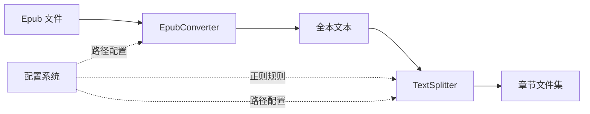
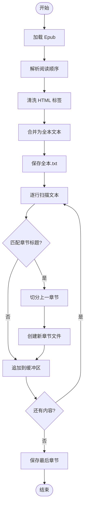
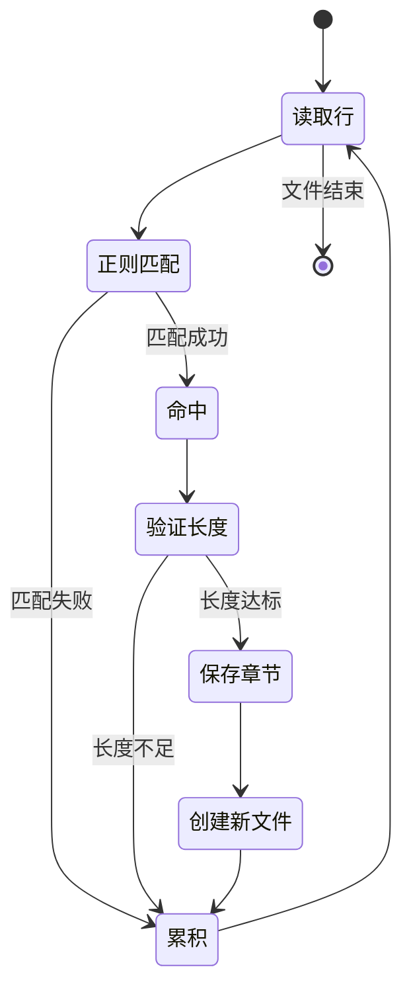

# Epub 转文本与章节切分系统设计

## 目标概述

构建一个专用的 Epub 电子书预处理系统，将 `.epub` 格式电子书转换为纯文本并按章节智能切分为独立的 TXT 文件，为后续 TTS（文本转语音）模块提供标准化输入。

## 核心价值

- 自动化处理 Epub 电子书的内容提取与章节识别
- 生成结构化、有序的章节文本文件，便于批量处理
- 确保文本清洁度与编码一致性，消除下游处理障碍
- 支持灵活的章节匹配规则配置，适应不同书籍格式

## 技术栈定位

### 开发环境
- 平台：.NET 10 Preview
- 语言：C#
- 依赖管理：NuGet

### 核心依赖库
- **VersOne.Epub (3.2.1)**: Epub 文件解析引擎
- **HtmlAgilityPack (1.11.59)**: HTML 标签清理与文本提取
- **System.Text.RegularExpressions**: 章节标题智能识别
- **System.IO.Abstractions**: 文件系统抽象层（用于测试隔离）

## 系统架构

### 组件职责划分



#### EpubConverter（转换器）
- **职责边界**: 负责解析 Epub 文件结构，提取所有章节的 HTML 内容，清理标签后输出纯文本
- **输入**: Epub 文件路径
- **输出**: 合并的全本文本文件（UTF-8 无 BOM）

#### TextSplitter（切分器）
- **职责边界**: 基于正则表达式扫描全本文本，识别章节边界并切分为独立文件
- **输入**: 全本文本文件路径、章节匹配规则
- **输出**: 带序列号的章节文件集合

### 数据流管线



## 配置管理

### 配置项结构

| 配置节 | 配置项 | 类型 | 默认值 | 说明 |
|--------|--------|------|--------|------|
| Splitter | ChapterRegex | string | `(^第[0-9一二三四五六七八九十百千]+[章节卷].*)ㅣ(^Chapter [0-9]+.*)` | 章节标题匹配正则表达式 |
| Splitter | MinChapterLength | int | 100 | 最小章节字符数阈值 |
| Paths | RawEpubFolder | string | - | 原始 Epub 文件存放目录 |
| Paths | IntermediateTxtFolder | string | - | 全本文本中间文件目录 |
| Paths | SplitOutputFolder | string | - | 章节切分输出目录 |

### 配置加载策略
- 使用 `appsettings.json` 作为配置源
- 支持环境变量覆盖（开发/生产环境隔离）
- 正则表达式在应用启动时预编译，提升运行时性能

## 核心处理流程

### 阶段一：Epub 解析与文本提取

**处理步骤**：
1. 使用 `EpubReader` 打开 Epub 文件
2. 按 `ReadingOrder` 顺序遍历所有章节
3. 针对每个章节的 HTML 内容：
   - 使用 `HtmlAgilityPack` 加载文档
   - 移除所有 HTML 标签（`<div>`, `<p>`, `<br>` 等）
   - 转换 HTML 实体（如 `&nbsp;` 转为空格）
   - 提取纯文本内容
4. 将所有章节文本合并到 `StringBuilder`
5. 输出为单一的"全本.txt"文件

**输出规范**：
- 编码：UTF-8 无 BOM
- 换行符：保留原文换行
- 特殊字符：清理控制字符，保留中英文标点

### 阶段二：章节边界识别

**扫描机制**：
- 使用 `StreamReader` 逐行读取全本文本（避免大文件内存溢出）
- 对每行应用章节匹配正则表达式
- 当匹配成功时，标记章节边界

**正则表达式设计原则**：
- 使用 `RegexOptions.Compiled` 提升性能
- 支持多种章节格式：
  - 中文数字：`第一章`、`第二十章`
  - 阿拉伯数字：`第001章`、`Chapter 1`
  - 特殊章节：`序章`、`楔子`、`后记`
- 避免回溯陷阱（Catastrophic Backtracking）

**边界判断逻辑**：


### 阶段三：章节文件切分

**文件命名规则**：
- 格式：`{序列号}_{章节标题}.txt`
- 序列号：三位数字补零（`001`, `002`, ...）
- 章节标题清洗：
  - 移除文件系统非法字符：`\ / : * ? " < > |`
  - 替换为下划线 `_`
  - 限制文件名长度（建议不超过 50 字符）

**目录组织结构**：
```
SplitOutputFolder/
├── [书名]/
│   ├── 000_楔子.txt
│   ├── 001_第一章_重生.txt
│   ├── 002_第二章_修炼.txt
│   └── ...
└── [另一本书]/
    └── ...
```

**特殊内容处理**：
- **前言/楔子**：第一个章节标题之前的内容保存为 `000_前言.txt` 或 `000_楔子.txt`
- **空章节过滤**：如果章节内容少于 `MinChapterLength` 配置值，记录警告但仍保存
- **编码一致性**：所有输出文件强制使用 UTF-8 无 BOM 编码

## 性能与资源管理

### 内存优化策略

| 场景 | 禁止操作 | 推荐方案 | 原因 |
|------|----------|----------|------|
| 大文本读取 | `File.ReadAllText` | `File.ReadLines` 或 `StreamReader` | 避免一次性加载 10MB+ 内容到内存 |
| 章节内容缓冲 | 使用 `List<string>` | 使用 `StringBuilder` | 减少字符串拼接开销 |
| 正则匹配 | 每次创建新 `Regex` 对象 | 使用 `RegexOptions.Compiled` 预编译 | 避免重复编译正则表达式 |

### 并发处理考量
- **阶段一（Epub 解析）**: 顺序处理（受 Epub 内部结构限制）
- **阶段二（章节扫描）**: 单线程流式处理（保持章节顺序）
- **阶段三（文件写入）**: 可考虑异步 I/O（`FileStream` 异步写入）

## 日志与监控

### 日志级别定义

**INFO 级别**：
- Epub 解析开始：`开始解析 Epub: [文件名]`
- 解析完成统计：`Epub 解析完成，共包含 120 个 HTML 章节`
- 切分开始：`开始章节切分，使用正则: [正则表达式]`
- 切分完成统计：`切分完成：共生成 540 个 TXT 文件，平均每章 3000 字`

**WARN 级别**：
- 小文件警告：`章节文件过小 (< 50 字): 003_第三章.txt，可能是正则误判`
- 未匹配章节：`全本文本中未检测到任何章节标题`

**ERROR 级别**：
- Epub 文件损坏：`Epub 文件解析失败: [异常信息]`
- 文件 I/O 错误：`无法写入章节文件: [文件路径], 原因: [异常信息]`

### 统计指标
- 处理时长（毫秒）
- 总字符数
- 生成文件数量
- 平均章节长度
- 异常文件数量（长度过小的章节）

## 质量保证要点

### 编码规范
- 所有文本输出必须使用 UTF-8 无 BOM 编码
- 统一换行符处理（建议保留原文格式）
- 清理零宽字符、控制字符等不可见字符

### 正则安全性
- 避免贪婪匹配导致的性能问题
- 使用超时机制防止正则回溯陷阱
- 测试覆盖常见章节格式变体

### 错误处理策略
- 单个章节解析失败不应中断整体流程
- 记录详细错误信息用于问题追溯
- 提供降级方案（如无法识别章节时整本输出）

## 扩展性考量

### 规则配置扩展
- 支持多组正则表达式并行匹配（优先级队列）
- 支持自定义章节前缀词典（如"引子"、"尾声"）
- 支持章节合并规则（如短章节自动合并）

### 格式支持扩展
- 预留接口支持其他电子书格式（如 MOBI, AZW3）
- 输出格式可配置（如支持 Markdown 格式输出）

### 集成接口设计
- 提供命令行接口（CLI）用于批量处理
- 提供 REST API 用于 Web 服务集成
- 支持消息队列异步处理（如 RabbitMQ）

## 风险与约束

### 技术风险
- **正则表达式误判**: 不同书籍的章节格式千差万别，单一正则可能无法覆盖所有情况
- **HTML 清洗不彻底**: 某些 Epub 使用非标准 HTML，可能残留标签或样式信息
- **内存溢出**: 超大型书籍（如合集）可能包含数十 MB 文本

### 缓解措施
- 提供正则表达式在线测试工具
- 实现 HTML 清洗的多轮验证机制
- 引入流式处理和内存阈值监控

### 业务约束
- 仅处理合法授权的 Epub 文件
- 输出文件仅用于个人学习用途
- 遵守版权法相关规定
