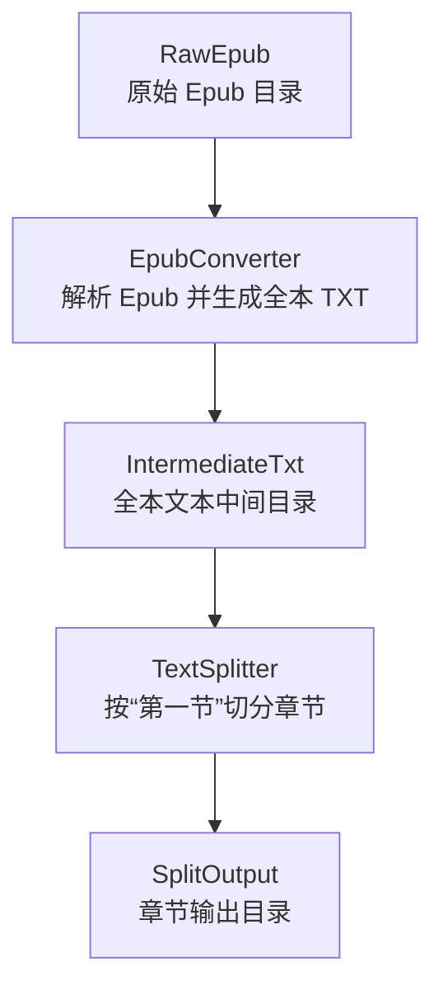
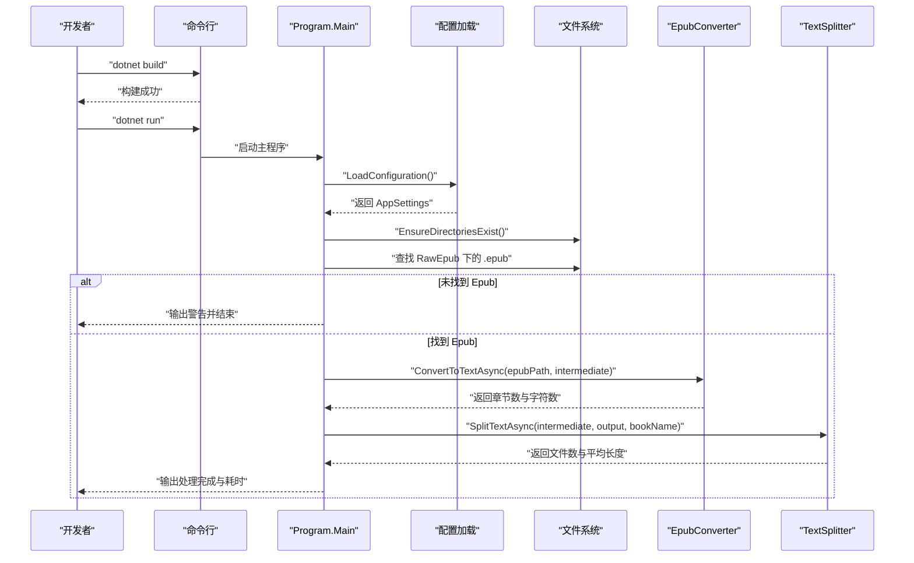
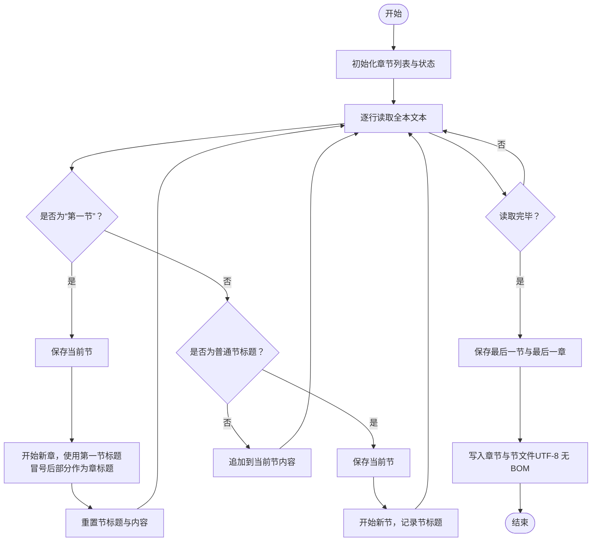
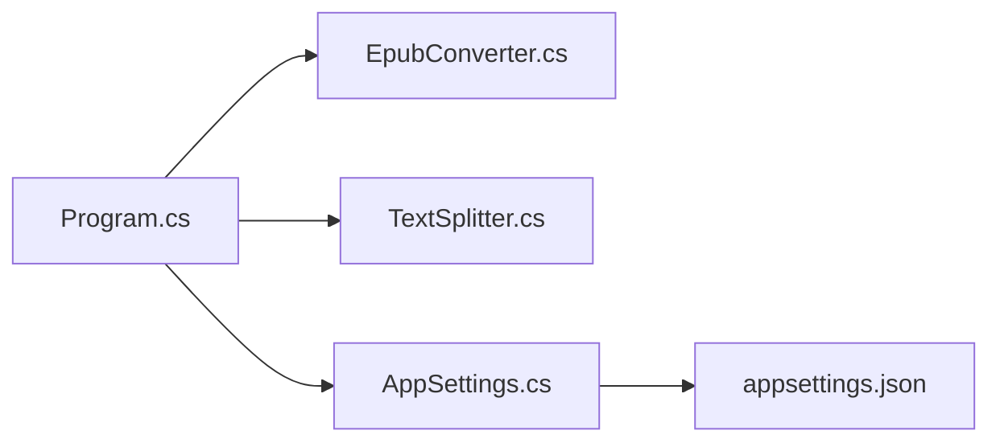

# 快速开始

<cite>
**本文引用的文件**
- [README.md](file://README.md)
- [Program.cs](file://Program.cs)
- [EpubConverter.cs](file://EpubConverter.cs)
- [TextSplitter.cs](file://TextSplitter.cs)
- [AppSettings.cs](file://AppSettings.cs)
- [appsettings.json](file://appsettings.json)
- [EpubToSplitTxt.csproj](file://EpubToSplitTxt.csproj)
</cite>

## 目录
1. [简介](#简介)
2. [项目结构](#项目结构)
3. [核心组件](#核心组件)
4. [架构总览](#架构总览)
5. [详细组件分析](#详细组件分析)
6. [依赖分析](#依赖分析)
7. [性能考虑](#性能考虑)
8. [故障排查指南](#故障排查指南)
9. [结论](#结论)
10. [附录](#附录)

## 简介
本指南面向首次使用 EpubToSplitTxt 的用户，带你从编译项目到准备 Epub 文件，再到运行程序并查看输出的完整流程。文档结合 Program.cs 的执行逻辑，解释程序如何自动查找 Epub 文件、创建中间与输出目录，并给出基于《蛊真人》的实际案例，说明输入与输出的对应关系。同时，列出常见入门错误及解决方案。

## 项目结构
- 输入目录：RawEpub（用于存放待处理的 .epub 文件）
- 中间产物：IntermediateTxt（存放每本书的全本文本）
- 输出目录：SplitOutput（按章节拆分后的独立 TXT 文件）

下面是一个典型的目录结构示例（仅示意，实际路径以 appsettings.json 中配置为准）：
- EpubToSplitTxt/
  - RawEpub/
    - 小说1.epub
    - 小说2.epub
  - IntermediateTxt/
    - 小说1_全本.txt
    - 小说2_全本.txt
  - SplitOutput/
    - 小说1/
      - 01.第一章：重生/
        - 001.前言.txt
        - 002.第一章：重生.txt
      - 02.第二章：修炼/
        - 003.第二章：修炼.txt
      - ...
    - 小说2/
      - ...

图表来源
- [Program.cs](file://Program.cs#L100-L133)
- [EpubConverter.cs](file://EpubConverter.cs#L14-L80)
- [TextSplitter.cs](file://TextSplitter.cs#L26-L171)
- [appsettings.json](file://appsettings.json#L7-L12)

章节来源
- [README.md](file://README.md#L42-L84)
- [appsettings.json](file://appsettings.json#L7-L12)

## 核心组件
- 程序入口与流程控制：Program.cs
  - 加载配置、确保目录存在、查找 Epub 文件、初始化转换器与切分器、逐个处理并打印统计信息
- Epub 转换器：EpubConverter.cs
  - 使用第三方库解析 Epub，提取纯文本；清洗 HTML、规范化换行；输出 UTF-8 无 BOM 文本
- 文本切分器：TextSplitter.cs
  - 基于“第一节”作为章节起始标志进行切分；按章节与节生成有序文件；对文件名进行清洗；输出 UTF-8 无 BOM 文本
- 配置模型与文件：AppSettings.cs、appsettings.json
  - 定义章节匹配规则、最小章节长度、输入输出路径等

章节来源
- [Program.cs](file://Program.cs#L10-L133)
- [EpubConverter.cs](file://EpubConverter.cs#L14-L80)
- [TextSplitter.cs](file://TextSplitter.cs#L26-L171)
- [AppSettings.cs](file://AppSettings.cs#L1-L60)
- [appsettings.json](file://appsettings.json#L1-L12)

## 架构总览
下面的时序图展示了从 dotnet build 到 dotnet run 的关键步骤，以及 Program.cs 如何组织各组件协同工作：

图表来源
- [Program.cs](file://Program.cs#L10-L133)
- [EpubConverter.cs](file://EpubConverter.cs#L14-L80)
- [TextSplitter.cs](file://TextSplitter.cs#L26-L171)
- [appsettings.json](file://appsettings.json#L7-L12)

## 详细组件分析

### 1. 编译项目（dotnet build）
- 使用 .NET 9 SDK，目标为控制台应用
- 引用必要 NuGet 包：VersOne.Epub（Epub 解析）、HtmlAgilityPack（HTML 清洗）、Microsoft.Extensions.Configuration（配置绑定）
- appsettings.json 会被复制到输出目录，供运行时读取

章节来源
- [EpubToSplitTxt.csproj](file://EpubToSplitTxt.csproj#L1-L28)
- [README.md](file://README.md#L31-L40)

### 2. 准备 Epub 文件（放入 RawEpub 目录）
- 将你的 .epub 文件放入 RawEpub 目录
- 程序会在启动时自动查找该目录下的所有 .epub 文件

章节来源
- [README.md](file://README.md#L42-L66)
- [Program.cs](file://Program.cs#L18-L26)

### 3. 运行程序（dotnet run）
- 程序启动后：
  - 加载配置（含路径与章节规则）
  - 确保 RawEpub、IntermediateTxt、SplitOutput 三个目录存在
  - 查找并处理每个 Epub 文件
  - 输出处理统计与耗时

章节来源
- [Program.cs](file://Program.cs#L10-L133)
- [appsettings.json](file://appsettings.json#L7-L12)

### 4. 程序如何自动查找 Epub 文件、创建目录
- 查找逻辑：在配置的 RawEpubFolder 中查找 *.epub
- 目录创建：若不存在则自动创建
- 绝对路径：将相对路径转换为基于程序目录的绝对路径

章节来源
- [Program.cs](file://Program.cs#L18-L26)
- [Program.cs](file://Program.cs#L92-L97)
- [Program.cs](file://Program.cs#L66-L75)

### 5. 处理流程与输出结构
- EpubConverter：解析 Epub，清洗 HTML，输出 UTF-8 无 BOM 的全本文本至 IntermediateTxt
- TextSplitter：按“第一节”作为章节起始标志进行切分，输出到 SplitOutput 下的书籍子目录
- 文件命名与排序：章节文件夹以两位序号+中文数字命名；节文件以三位序号+标题命名，保证阅读顺序

章节来源
- [EpubConverter.cs](file://EpubConverter.cs#L14-L80)
- [TextSplitter.cs](file://TextSplitter.cs#L26-L171)
- [README.md](file://README.md#L67-L84)

### 6. 基于《蛊真人》的实际案例
- 输入：RawEpub/蛊真人.epub
- 中间产物：IntermediateTxt/蛊真人_全本.txt
- 输出：SplitOutput/蛊真人/（按章节与节拆分）

预期输出目录结构（示例）：
- SplitOutput/蛊真人/
  - 01.第一章：前言/
    - 001.前言.txt
    - 002.内容简介人是万物之灵，蛊是天地真精。三观不正，魔头重生。昔日旧梦，同名新作。一个穿越者不断重生的故事.txt
  - 03.第三章：黄龙江上竹筏倾/
    - 364.第一百六十三节：以一对七(下).txt
  - 05.第五章：回归狐仙福地/
    - 892.第二百三十九节：短暂的休整.txt
    - 893.第二百四十节：入东海.txt
  - 06.第六章：一切都是天意/
    - 1070.第四十三节：我就是变化道蛊仙.txt
    - 1168.第一百四十一节：魂道陷阱.txt
  - 07.第七章：新天外之魔/
    - 2063.第九十四节：白凝冰战方正.txt

章节来源
- [README.md](file://README.md#L67-L84)
- [SplitOutput/蛊真人/](file://SplitOutput/蛊真人/01.第一章：前言/001.前言.txt)

### 7. 关键算法与流程（按“第一节”切分）

图表来源
- [TextSplitter.cs](file://TextSplitter.cs#L26-L171)

## 依赖分析
- 程序入口 Program.cs 依赖：
  - AppSettings（配置模型）
  - EpubConverter（Epub 解析与清洗）
  - TextSplitter（章节切分）
- 配置文件 appsettings.json 控制：
  - 章节与节的正则表达式
  - 输入输出路径（默认相对路径，运行时转换为绝对路径）

图表来源
- [Program.cs](file://Program.cs#L31-L43)
- [AppSettings.cs](file://AppSettings.cs#L1-L60)
- [appsettings.json](file://appsettings.json#L1-L12)

章节来源
- [Program.cs](file://Program.cs#L31-L43)
- [AppSettings.cs](file://AppSettings.cs#L1-L60)
- [appsettings.json](file://appsettings.json#L1-L12)

## 性能考虑
- 流式处理：使用流式读取与写入，避免一次性加载全文到内存
- 正则编译：预编译正则表达式，提高匹配效率
- 编码优化：UTF-8 无 BOM 输出，减少文件体积与兼容性问题
- 目录与文件名：自动清洗非法字符，避免文件系统异常

章节来源
- [README.md](file://README.md#L158-L163)
- [TextSplitter.cs](file://TextSplitter.cs#L26-L33)
- [EpubConverter.cs](file://EpubConverter.cs#L72-L74)

## 故障排查指南
- 未放置 Epub 文件导致的警告
  - 现象：程序启动后提示在 RawEpub 目录未找到任何 .epub 文件
  - 原因：未将 Epub 文件放入 RawEpub 目录
  - 解决：将 .epub 文件放入 RawEpub 目录后重试
  - 参考：[Program.cs](file://Program.cs#L18-L26)

- 未检测到任何章节
  - 现象：切分阶段输出“未检测到任何章节”
  - 原因：全本文本中未匹配到“第一节”或节标题正则
  - 解决：检查 appsettings.json 中的 SectionRegex 是否覆盖了目标文本的节标题格式
  - 参考：[TextSplitter.cs](file://TextSplitter.cs#L116-L120)，[appsettings.json](file://appsettings.json#L3-L5)

- 节文件过小
  - 现象：输出“节文件过小”的警告
  - 原因：最小章节长度阈值设置较高，或节标题未正确识别
  - 解决：调整 appsettings.json 中的 MinChapterLength，或修正 SectionRegex
  - 参考：[TextSplitter.cs](file://TextSplitter.cs#L152-L155)，[appsettings.json](file://appsettings.json#L5-L6)

- 目录路径问题
  - 现象：找不到 RawEpub 或无法写入输出目录
  - 原因：路径为相对路径且运行目录不同
  - 解决：确认 appsettings.json 中的路径配置；程序会将其转换为绝对路径
  - 参考：[Program.cs](file://Program.cs#L66-L75)，[appsettings.json](file://appsettings.json#L7-L12)

- Epub 文件损坏或解析失败
  - 现象：处理单个 Epub 文件时报错
  - 原因：Epub 文件损坏或不受支持
  - 解决：更换 Epub 文件或修复文件
  - 参考：[Program.cs](file://Program.cs#L128-L133)

## 结论
通过本快速开始指南，你可以顺利完成从编译、准备 Epub 文件到运行程序并获得按章节拆分的 TXT 输出。建议在首次使用时：
- 确认 RawEpub 目录已放入 .epub 文件
- 检查 appsettings.json 的路径与章节正则是否符合目标文本
- 关注日志中的警告信息，及时调整配置
- 参考 SplitOutput 中的输出结构，核对章节与节的命名是否符合预期

## 附录
- 快速开始步骤
  - 编译：dotnet build
  - 准备：将 .epub 放入 RawEpub
  - 运行：dotnet run
  - 查看：IntermediateTxt 与 SplitOutput
- 目录结构参考
  - RawEpub、IntermediateTxt、SplitOutput 的默认路径可在 appsettings.json 中配置

章节来源
- [README.md](file://README.md#L42-L84)
- [appsettings.json](file://appsettings.json#L7-L12)