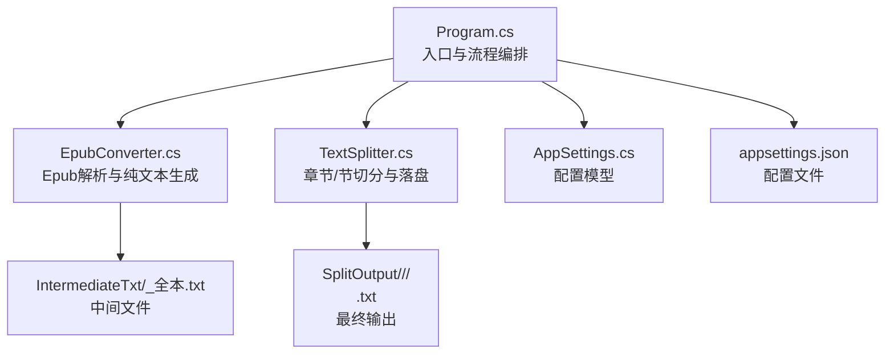
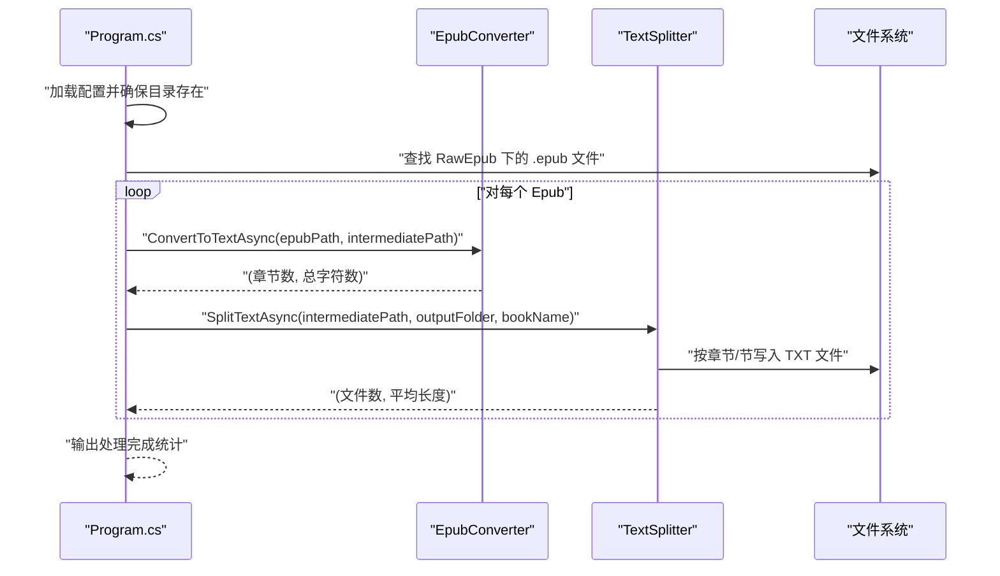
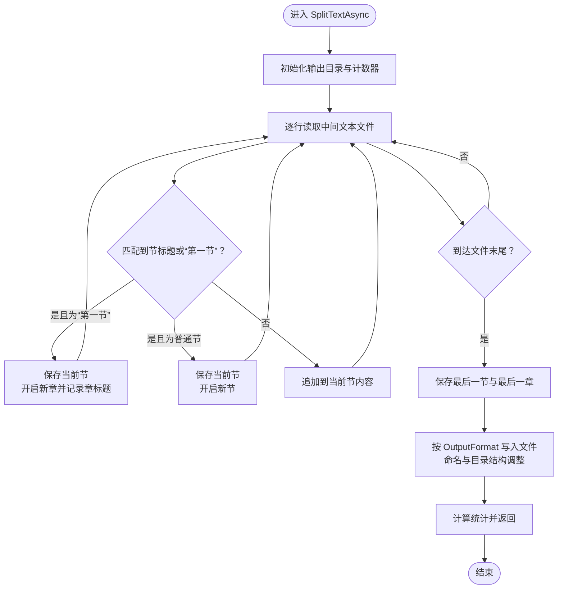
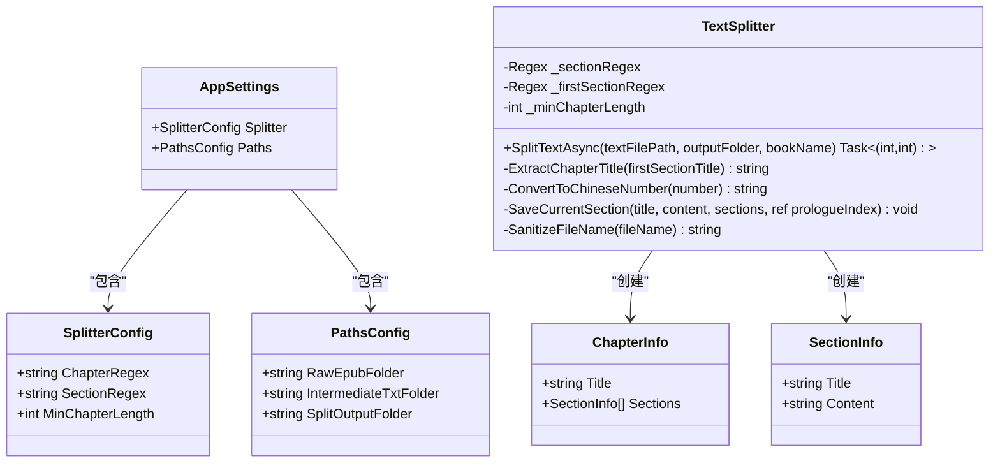
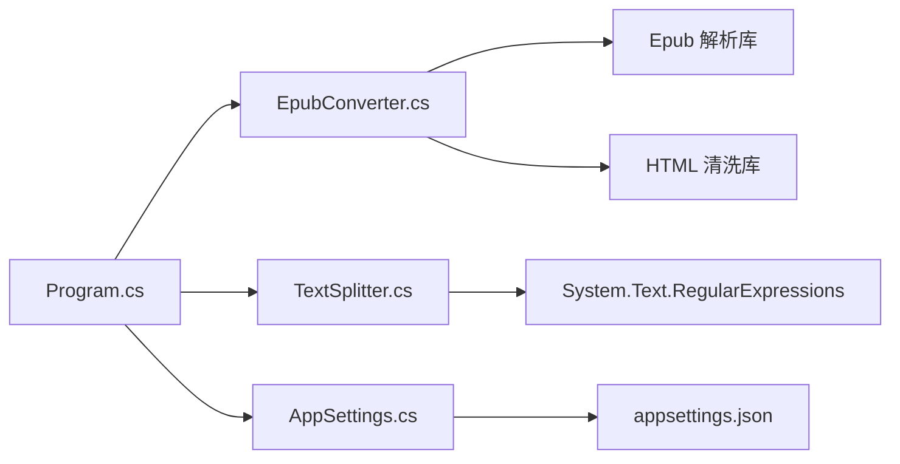

# 扩展与开发

<cite>
**本文引用的文件**
- [appsettings.json](file://appsettings.json)
- [AppSettings.cs](file://AppSettings.cs)
- [Program.cs](file://Program.cs)
- [TextSplitter.cs](file://TextSplitter.cs)
- [EpubConverter.cs](file://EpubConverter.cs)
- [README.md](file://README.md)
</cite>

## 目录
1. [简介](#简介)
2. [项目结构](#项目结构)
3. [核心组件](#核心组件)
4. [架构总览](#架构总览)
5. [详细组件分析](#详细组件分析)
6. [依赖分析](#依赖分析)
7. [性能考虑](#性能考虑)
8. [故障排查指南](#故障排查指南)
9. [结论](#结论)
10. [附录](#附录)

## 简介
本文件聚焦于项目的可扩展性与二次开发，围绕以下目标展开：
- 如何通过修改 appsettings.json 中的 ChapterRegex 与 SectionRegex 来适配不同格式的电子书章节与节标题。
- 如何扩展 TextSplitter.cs 的 SplitTextAsync 方法，支持输出为 Markdown 等其他格式，而不局限于 TXT。
- 指出代码结构中的扩展点与耦合边界，给出修改建议与最佳实践。

## 项目结构
项目采用“配置驱动 + 组件化”的结构设计：
- 配置层：通过 appsettings.json 与 AppSettings 模型加载与绑定配置。
- 控制层：Program.cs 作为入口，负责加载配置、准备目录、调度转换与切分流程。
- 业务层：EpubConverter 负责 Epub 解析与纯文本生成；TextSplitter 负责按节/章切分与落盘。
- 输出层：按书籍名建立子目录，按章节与节生成独立文件，当前默认为 TXT。

图表来源
- [Program.cs](file://Program.cs#L1-L134)
- [EpubConverter.cs](file://EpubConverter.cs#L1-L191)
- [TextSplitter.cs](file://TextSplitter.cs#L1-L292)
- [AppSettings.cs](file://AppSettings.cs#L1-L60)
- [appsettings.json](file://appsettings.json#L1-L13)

章节来源
- [Program.cs](file://Program.cs#L1-L134)
- [README.md](file://README.md#L175-L191)

## 核心组件
- 配置模型与绑定
  - AppSettings 提供 Splitter 与 Paths 两大配置域，分别承载章节/节匹配规则与路径设置。
  - Program 中通过 ConfigurationBuilder 读取 appsettings.json 并绑定到 AppSettings 实例。
- 文本切分器
  - TextSplitter 接收配置中的 SectionRegex 与 MinChapterLength，内部维护正则与最小长度阈值。
  - SplitTextAsync 采用流式逐行读取，按“第一节”作为新章起始标志，将内容拆分为章节与节，并写入 TXT 文件。
- Epub 转换器
  - EpubConverter 使用 EpubReader 读取 Epub，清洗 HTML 后合并为纯文本，输出 UTF-8 无 BOM 文件。

章节来源
- [AppSettings.cs](file://AppSettings.cs#L1-L60)
- [Program.cs](file://Program.cs#L54-L133)
- [TextSplitter.cs](file://TextSplitter.cs#L1-L171)
- [EpubConverter.cs](file://EpubConverter.cs#L1-L191)

## 架构总览
整体处理流程如下：

图表来源
- [Program.cs](file://Program.cs#L1-L134)
- [EpubConverter.cs](file://EpubConverter.cs#L1-L191)
- [TextSplitter.cs](file://TextSplitter.cs#L1-L171)

## 详细组件分析

### 配置扩展：自定义章节与节匹配规则
- 修改位置
  - appsettings.json 的 Splitter.ChapterRegex 与 Splitter.SectionRegex。
  - AppSettings.SplitterConfig 的 ChapterRegex、SectionRegex 属性用于绑定。
- 作用范围
  - ChapterRegex 主要用于兼容性保留（构造函数参数传入但未在当前实现中使用），实际章节识别由 SplitTextAsync 的“第一节”逻辑主导。
  - SectionRegex 用于识别“节”标题行，决定何时开启新节。
- 扩展建议
  - 若电子书采用“卷/部/章/节”层级或英文“Volume/Chapter/Section”，可在 SectionRegex 中增加相应模式。
  - 若需要更灵活的“章节”识别，可在 SplitTextAsync 中引入对 ChapterRegex 的使用，或新增“章节”识别逻辑。
  - 注意正则性能与超时：当前正则已启用 Compiled 与多行模式，并设置 1 秒超时，避免回溯陷阱。

章节来源
- [appsettings.json](file://appsettings.json#L1-L13)
- [AppSettings.cs](file://AppSettings.cs#L19-L38)
- [TextSplitter.cs](file://TextSplitter.cs#L8-L24)

### 文本切分器扩展：支持输出为 Markdown 等其他格式
- 当前实现要点
  - SplitTextAsync 使用 UTF-8 无 BOM 写入 TXT 文件，文件名为“序号.节标题.txt”。
  - 章标题来源于“第一节”标题冒号后的部分，章节文件夹名为“序号.第N章：标题”。
- 扩展点定位
  - 文件落盘与文件名格式：位于 SplitTextAsync 的写入与命名逻辑处。
  - 章节/节数据结构：ChapterInfo 与 SectionInfo 为不可变数据容器，便于扩展。
- 扩展步骤（不展示具体代码，仅给出修改路径）
  1) 新增输出格式枚举与映射
     - 在 AppSettings 或独立配置中新增 OutputFormat 字段，映射到 TXT/Markdown 等。
     - 在 Program 中读取并传递给 TextSplitter。
     - 参考路径：[Program.cs](file://Program.cs#L54-L75)、[AppSettings.cs](file://AppSettings.cs#L1-L60)
  2) 修改 TextSplitter 构造与 SplitTextAsync
     - 在构造函数中接收 OutputFormat 参数，并根据格式选择不同的落盘策略。
     - 在写入阶段，将 TXT 内容转换为 Markdown（例如：章节标题转为 Markdown 标题语法，节标题转为二级标题等）。
     - 参考路径：[TextSplitter.cs](file://TextSplitter.cs#L1-L171)
  3) 更新文件命名与目录结构
     - 根据 OutputFormat 调整文件扩展名（.md）与章节/节命名规则。
     - 参考路径：[TextSplitter.cs](file://TextSplitter.cs#L129-L165)
  4) 数据模型与日志
     - 如需保留原始节内容或元信息，可在 SectionInfo/ChapterInfo 中扩展字段。
     - 更新日志输出，区分不同格式的统计信息。
     - 参考路径：[TextSplitter.cs](file://TextSplitter.cs#L166-L171)

图表来源
- [TextSplitter.cs](file://TextSplitter.cs#L26-L171)

章节来源
- [TextSplitter.cs](file://TextSplitter.cs#L1-L292)
- [Program.cs](file://Program.cs#L31-L43)

### 类与数据模型

图表来源
- [AppSettings.cs](file://AppSettings.cs#L1-L60)
- [TextSplitter.cs](file://TextSplitter.cs#L1-L292)

章节来源
- [AppSettings.cs](file://AppSettings.cs#L1-L60)
- [TextSplitter.cs](file://TextSplitter.cs#L1-L292)

## 依赖分析
- 组件耦合
  - Program 依赖 EpubConverter 与 TextSplitter，并通过 AppSettings 注入配置。
  - TextSplitter 依赖正则与文件系统，内部逻辑与外部依赖松耦合。
- 外部依赖
  - EpubConverter 依赖 Epub 解析库与 HTML 清洗库。
  - 正则表达式使用 .NET 的 System.Text.RegularExpressions。
- 潜在循环依赖
  - 无循环依赖迹象，模块职责清晰。

图表来源
- [Program.cs](file://Program.cs#L1-L134)
- [EpubConverter.cs](file://EpubConverter.cs#L1-L191)
- [TextSplitter.cs](file://TextSplitter.cs#L1-L171)
- [AppSettings.cs](file://AppSettings.cs#L1-L60)
- [appsettings.json](file://appsettings.json#L1-L13)

章节来源
- [Program.cs](file://Program.cs#L1-L134)
- [EpubConverter.cs](file://EpubConverter.cs#L1-L191)
- [TextSplitter.cs](file://TextSplitter.cs#L1-L171)
- [AppSettings.cs](file://AppSettings.cs#L1-L60)
- [appsettings.json](file://appsettings.json#L1-L13)

## 性能考虑
- 正则性能
  - 已启用 Compiled 与多行模式，并设置 1 秒超时，避免回溯陷阱导致的性能问题。
- 流式处理
  - 使用 StreamReader 逐行读取，避免一次性加载大文件至内存。
- 编码与文件大小
  - 输出 UTF-8 无 BOM，减少文件体积与兼容性问题。
- I/O 与目录结构
  - 每本书单独输出目录，避免文件名冲突；写入前清理旧目录，保证输出一致性。

章节来源
- [TextSplitter.cs](file://TextSplitter.cs#L18-L24)
- [EpubConverter.cs](file://EpubConverter.cs#L70-L78)
- [README.md](file://README.md#L157-L163)

## 故障排查指南
- 未检测到任何章节
  - 现象：日志提示未检测到任何章节。
  - 可能原因：SectionRegex 未覆盖目标电子书的节标题格式；或文本中不存在“第一节”作为章节起始标志。
  - 处理建议：调整 appsettings.json 中的 SectionRegex；必要时在 SplitTextAsync 中引入对 ChapterRegex 的使用。
  - 参考路径：[TextSplitter.cs](file://TextSplitter.cs#L116-L121)
- 节文件过小
  - 现象：日志提示节文件过小。
  - 可能原因：最小章节长度阈值过高；节标题识别不准确导致节被切分过细。
  - 处理建议：降低 MinChapterLength；优化 SectionRegex。
  - 参考路径：[TextSplitter.cs](file://TextSplitter.cs#L152-L155)
- 目录不存在或权限不足
  - 现象：抛出异常或无法写入。
  - 处理建议：确认 Program 中 EnsureDirectoriesExist 是否执行成功；检查输出目录权限。
  - 参考路径：[Program.cs](file://Program.cs#L92-L97)
- 正则超时或匹配异常
  - 现象：正则匹配耗时过长或失败。
  - 处理建议：简化正则；确保使用多行模式与超时控制；避免过于复杂的回溯。
  - 参考路径：[TextSplitter.cs](file://TextSplitter.cs#L18-L24)

章节来源
- [TextSplitter.cs](file://TextSplitter.cs#L116-L171)
- [Program.cs](file://Program.cs#L92-L97)

## 结论
- 通过 appsettings.json 的 ChapterRegex 与 SectionRegex 可快速适配不同格式的电子书章节与节标题。
- TextSplitter 的 SplitTextAsync 是扩展输出格式的关键入口，可通过新增配置与条件分支支持 Markdown 等格式。
- 项目已具备良好的性能基础（正则 Compiled、流式读取、UTF-8 无 BOM），扩展时应延续这些最佳实践。

## 附录
- 快速参考：如何修改配置
  - 修改 appsettings.json 中的 Splitter.ChapterRegex 与 Splitter.SectionRegex，以适配目标电子书的标题格式。
  - 参考路径：[appsettings.json](file://appsettings.json#L1-L13)
- 快速参考：如何扩展输出格式
  - 在 AppSettings 中新增 OutputFormat 字段并在 Program 中绑定与传递。
  - 在 TextSplitter 构造函数与 SplitTextAsync 中根据 OutputFormat 决定落盘策略与文件命名。
  - 参考路径：[AppSettings.cs](file://AppSettings.cs#L1-L60)、[Program.cs](file://Program.cs#L54-L75)、[TextSplitter.cs](file://TextSplitter.cs#L1-L171)