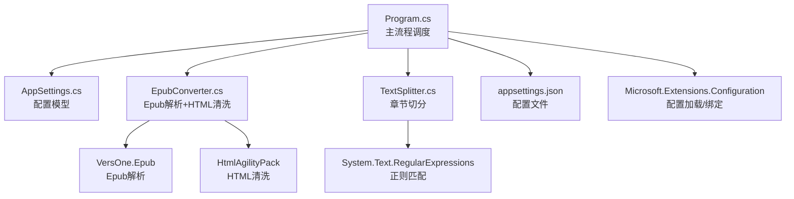
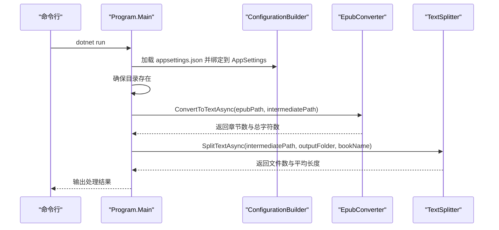
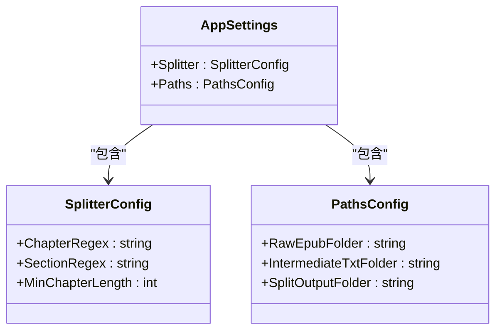
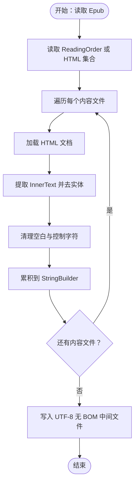
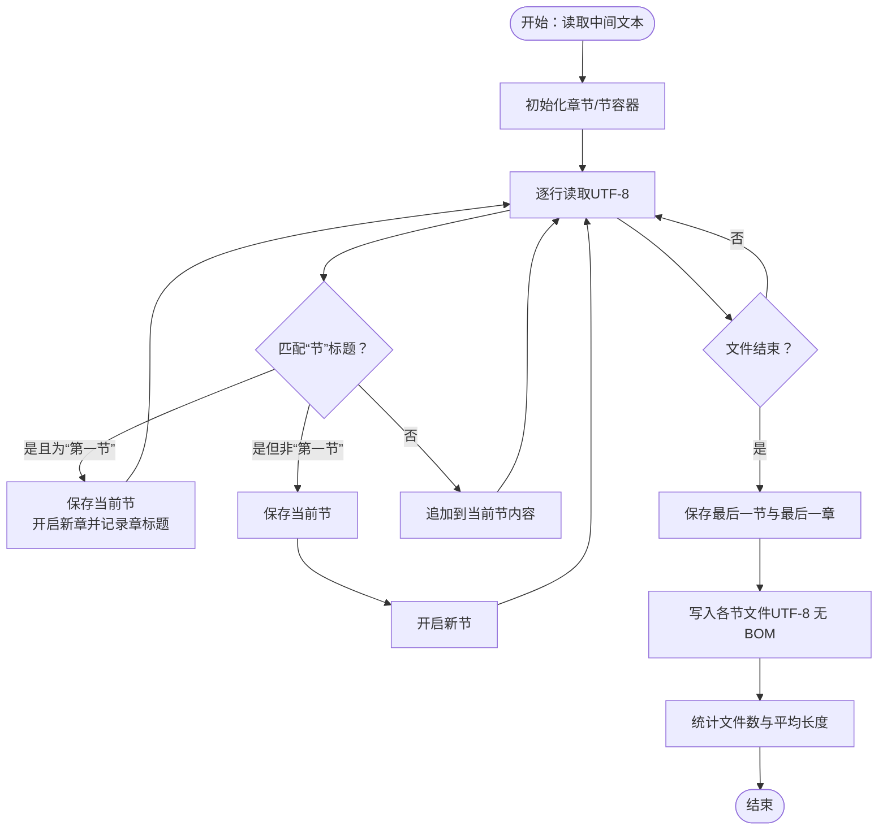
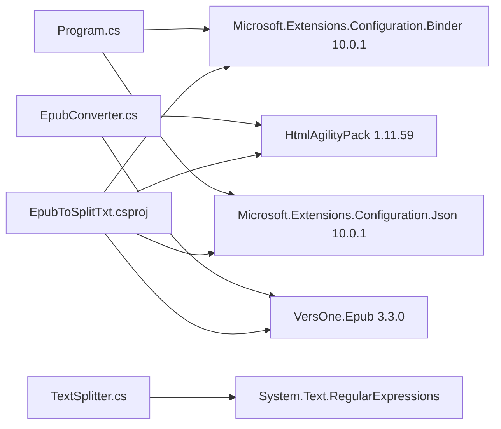

# 技术栈与依赖

<cite>
**本文引用的文件**
- [EpubToSplitTxt.csproj](file://EpubToSplitTxt.csproj)
- [GlobalUsings.cs](file://GlobalUsings.cs)
- [Program.cs](file://Program.cs)
- [AppSettings.cs](file://AppSettings.cs)
- [EpubConverter.cs](file://EpubConverter.cs)
- [TextSplitter.cs](file://TextSplitter.cs)
- [appsettings.json](file://appsettings.json)
- [README.md](file://README.md)
</cite>

## 目录
1. [简介](#简介)
2. [项目结构](#项目结构)
3. [核心组件](#核心组件)
4. [架构总览](#架构总览)
5. [详细组件分析](#详细组件分析)
6. [依赖分析](#依赖分析)
7. [性能考虑](#性能考虑)
8. [故障排查指南](#故障排查指南)
9. [结论](#结论)
10. [附录](#附录)

## 简介
本项目采用 .NET 9.0 作为目标运行时，围绕“Epub 转文本与章节切分”这一核心任务，构建了简洁高效的命令行工具。技术选型聚焦于：
- Epub 解析：VersOne.Epub（版本 3.3.0），用于可靠读取 Epub 结构与内容。
- HTML 清洗：HtmlAgilityPack（版本 1.11.59），用于提取纯文本、清理标签与实体。
- 配置管理：Microsoft.Extensions.Configuration 系列（含 Json 绑定与绑定器），用于集中化、可扩展的配置加载与绑定。

同时，项目通过全局 using 声明（GlobalUsings.cs）统一引入常用命名空间，降低样板代码，提升可读性与维护性。

## 项目结构
项目采用“功能分层 + 配置驱动”的组织方式：
- 核心入口：Program.cs 负责主流程调度、配置加载与目录准备。
- 数据与配置：AppSettings.cs 定义配置模型；appsettings.json 提供默认配置。
- 业务服务：
  - EpubConverter.cs：负责 Epub 解析与 HTML 清洗，生成全本文本。
  - TextSplitter.cs：负责按“第一节”规则切分章节，输出独立 TXT 文件。
- 依赖声明：EpubToSplitTxt.csproj 声明 NuGet 包与目标框架。
- 全局导入：GlobalUsings.cs 统一引入常用命名空间。

图表来源
- [Program.cs](file://Program.cs#L1-L135)
- [AppSettings.cs](file://AppSettings.cs#L1-L60)
- [EpubConverter.cs](file://EpubConverter.cs#L1-L191)
- [TextSplitter.cs](file://TextSplitter.cs#L1-L292)
- [EpubToSplitTxt.csproj](file://EpubToSplitTxt.csproj#L1-L28)
- [appsettings.json](file://appsettings.json#L1-L13)

章节来源
- [EpubToSplitTxt.csproj](file://EpubToSplitTxt.csproj#L1-L28)
- [README.md](file://README.md#L31-L40)

## 核心组件
- 配置系统（Microsoft.Extensions.Configuration）
  - 通过 ConfigurationBuilder 加载 appsettings.json，并使用 Bind 将配置映射到 AppSettings 模型，实现强类型配置访问。
  - 支持路径绝对化处理，便于跨平台部署。
- Epub 解析与清洗（VersOne.Epub + HtmlAgilityPack）
  - 使用 EpubReader 读取 Epub 的 ReadingOrder 或 HTML 内容，提取文本。
  - 使用 HtmlAgilityPack 清洗标签、转换实体、规范化空白字符，输出 UTF-8 无 BOM 文本。
- 章节切分（TextSplitter）
  - 基于正则匹配“节”标题，遇到“第一节”作为“章”的起始标志，将内容切分为章节与节，输出到独立文件。
  - 支持中文数字章节标题、英文章节标题与特殊章节识别，具备最小章节长度校验与告警。
- 全局 using（GlobalUsings.cs）
  - 统一导入 System.Text、System.Text.RegularExpressions、Microsoft.Extensions.Configuration、VersOne.Epub、HtmlAgilityPack、项目命名空间等，减少重复 using，提升可读性。

章节来源
- [Program.cs](file://Program.cs#L56-L75)
- [AppSettings.cs](file://AppSettings.cs#L1-L60)
- [EpubConverter.cs](file://EpubConverter.cs#L1-L191)
- [TextSplitter.cs](file://TextSplitter.cs#L1-L292)
- [GlobalUsings.cs](file://GlobalUsings.cs#L1-L9)

## 架构总览
整体流程由 Program.cs 驱动，依次完成配置加载、目录准备、Epub 转文本、章节切分与输出。配置系统贯穿始终，确保行为可调、部署灵活。

图表来源
- [Program.cs](file://Program.cs#L1-L135)
- [EpubConverter.cs](file://EpubConverter.cs#L1-L191)
- [TextSplitter.cs](file://TextSplitter.cs#L1-L292)
- [appsettings.json](file://appsettings.json#L1-L13)

## 详细组件分析

### 配置系统与绑定（Microsoft.Extensions.Configuration）
- 配置加载
  - 使用 ConfigurationBuilder 设置基路径并加载 appsettings.json。
  - 通过 Bind 将配置对象映射到 AppSettings，实现类型安全访问。
- 路径处理
  - 将相对路径转换为绝对路径，保证在不同工作目录下的稳定性。
- 配置模型
  - AppSettings 包含 Splitter 与 Paths 两个子配置，分别控制章节匹配规则与文件路径。

图表来源
- [AppSettings.cs](file://AppSettings.cs#L1-L60)
- [Program.cs](file://Program.cs#L56-L75)
- [appsettings.json](file://appsettings.json#L1-L13)

章节来源
- [Program.cs](file://Program.cs#L56-L75)
- [AppSettings.cs](file://AppSettings.cs#L1-L60)
- [appsettings.json](file://appsettings.json#L1-L13)

### Epub 解析与 HTML 清洗（VersOne.Epub + HtmlAgilityPack）
- Epub 解析
  - 优先使用 ReadingOrder 顺序读取内容；若为空，则回退到 HTML 内容集合。
  - 对每个内容文件进行 HTML 清洗，累积为全本文本。
- HTML 清洗
  - 使用 HtmlAgilityPack 的 HtmlDocument 加载 HTML，提取 InnerText 并转换 HTML 实体。
  - 清理控制字符与多余空白，规范化换行，移除连续空行。
- 输出
  - 以 UTF-8 无 BOM 编码写入中间文本文件，便于后续切分。

图表来源
- [EpubConverter.cs](file://EpubConverter.cs#L1-L191)
- [appsettings.json](file://appsettings.json#L1-L13)

章节来源
- [EpubConverter.cs](file://EpubConverter.cs#L1-L191)

### 章节切分（TextSplitter）
- 切分策略
  - 使用正则匹配“节”标题；遇到“第一节”作为“章”的起始标志，将内容拆分为章节与节。
  - 为每本书创建独立子目录，章节与节均按序号命名，确保阅读顺序与可检索性。
- 正则与性能
  - 使用 RegexOptions.Compiled 与超时控制，避免回溯陷阱与长时间阻塞。
- 输出规范
  - UTF-8 无 BOM 编码；对文件名进行清洗，移除非法字符并限制长度。
  - 统计输出文件数量与平均每节长度，提供处理反馈。

图表来源
- [TextSplitter.cs](file://TextSplitter.cs#L1-L292)

章节来源
- [TextSplitter.cs](file://TextSplitter.cs#L1-L292)

### 全局 using（GlobalUsings.cs）
- 作用
  - 在项目范围内统一导入常用命名空间，减少重复 using，提升代码可读性与一致性。
- 影响
  - Program、EpubConverter、TextSplitter 等文件无需显式 using 即可使用对应类型。

章节来源
- [GlobalUsings.cs](file://GlobalUsings.cs#L1-L9)

## 依赖分析
- 目标框架与隐式 using
  - 目标框架为 net9.0，启用隐式 using，进一步减少样板代码。
- NuGet 包
  - HtmlAgilityPack（1.11.59）：HTML 清洗与文本提取。
  - Microsoft.Extensions.Configuration.Binder（10.0.1）：配置绑定到强类型模型。
  - Microsoft.Extensions.Configuration.Json（10.0.1）：JSON 配置源。
  - VersOne.Epub（3.3.0）：Epub 解析与内容读取。
- 配置文件
  - appsettings.json 提供章节匹配正则、最小章节长度与路径配置，支持运行时调整。

图表来源
- [EpubToSplitTxt.csproj](file://EpubToSplitTxt.csproj#L1-L28)
- [Program.cs](file://Program.cs#L56-L75)
- [EpubConverter.cs](file://EpubConverter.cs#L1-L191)
- [TextSplitter.cs](file://TextSplitter.cs#L1-L292)

章节来源
- [EpubToSplitTxt.csproj](file://EpubToSplitTxt.csproj#L1-L28)
- [README.md](file://README.md#L31-L40)

## 性能考虑
- 正则编译与超时
  - 使用 RegexOptions.Compiled 与超时控制，避免长文本导致的正则回溯问题。
- 流式处理
  - 使用 StreamReader 逐行读取，避免一次性加载全文到内存，降低内存占用。
- 编码与文件大小
  - 输出 UTF-8 无 BOM，减少文件体积与兼容性问题。
- 目录与文件命名
  - 自动创建目录与清洗文件名，避免 I/O 异常与路径冲突。

章节来源
- [TextSplitter.cs](file://TextSplitter.cs#L1-L292)
- [EpubConverter.cs](file://EpubConverter.cs#L1-L191)
- [README.md](file://README.md#L158-L163)

## 故障排查指南
- 未找到 Epub 文件
  - 现象：提示未找到 .epub 文件。
  - 排查：确认 appsettings.json 中 RawEpubFolder 路径正确，且包含 .epub 文件。
- 章节未识别或切分异常
  - 现象：未检测到任何章节或节过小。
  - 排查：检查 appsettings.json 中的 ChapterRegex/SectionRegex 是否覆盖目标文本格式；适当调整 MinChapterLength。
- 目录权限或路径问题
  - 现象：无法创建目录或写入文件。
  - 排查：确认 IntermediateTxtFolder 与 SplitOutputFolder 可写；必要时使用绝对路径。
- 处理时间过长
  - 现象：正则匹配耗时较长。
  - 排查：检查正则表达式复杂度，避免过于宽泛的匹配；必要时简化或增加锚点。

章节来源
- [Program.cs](file://Program.cs#L18-L46)
- [TextSplitter.cs](file://TextSplitter.cs#L120-L171)
- [appsettings.json](file://appsettings.json#L1-L13)

## 结论
本项目以 .NET 9.0 为目标框架，结合 VersOne.Epub、HtmlAgilityPack 与 Microsoft.Extensions.Configuration，构建了稳定、可配置、易扩展的 Epub 转文本与章节切分工具。通过全局 using 简化导入、通过配置模型实现行为可调，配合流式处理与正则优化，兼顾性能与可维护性。建议在实际部署中：
- 明确路径配置与权限；
- 根据目标书籍格式微调章节匹配正则；
- 关注日志输出，及时发现异常与警告。

## 附录

### NuGet 包清单（来自项目文件）
- HtmlAgilityPack（1.11.59）
- Microsoft.Extensions.Configuration.Binder（10.0.1）
- Microsoft.Extensions.Configuration.Json（10.0.1）
- VersOne.Epub（3.3.0）

章节来源
- [EpubToSplitTxt.csproj](file://EpubToSplitTxt.csproj#L10-L14)

### 技术选型说明
- 为什么选择 VersOne.Epub？
  - 该项目在 Epub 解析方面表现稳定，支持 ReadingOrder 与 HTML 内容读取，适配多种 Epub 结构。
- 为什么选择 HtmlAgilityPack？
  - 其 HtmlDocument 与 InnerText 提取能力简单高效，适合快速清洗与标准化文本。
- 为什么使用 Microsoft.Extensions.Configuration？
  - 提供统一的配置加载与绑定机制，便于在运行时调整行为，增强灵活性与可维护性。

章节来源
- [README.md](file://README.md#L31-L40)
- [EpubConverter.cs](file://EpubConverter.cs#L1-L191)
- [TextSplitter.cs](file://TextSplitter.cs#L1-L292)