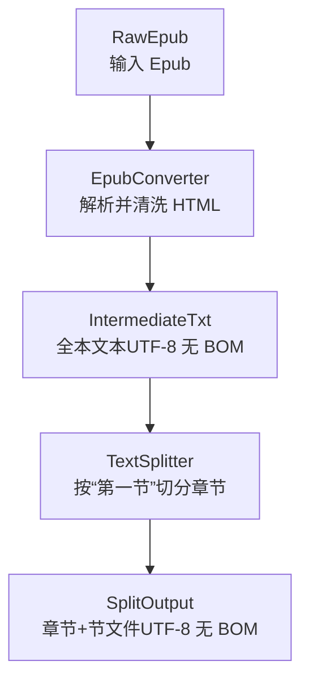
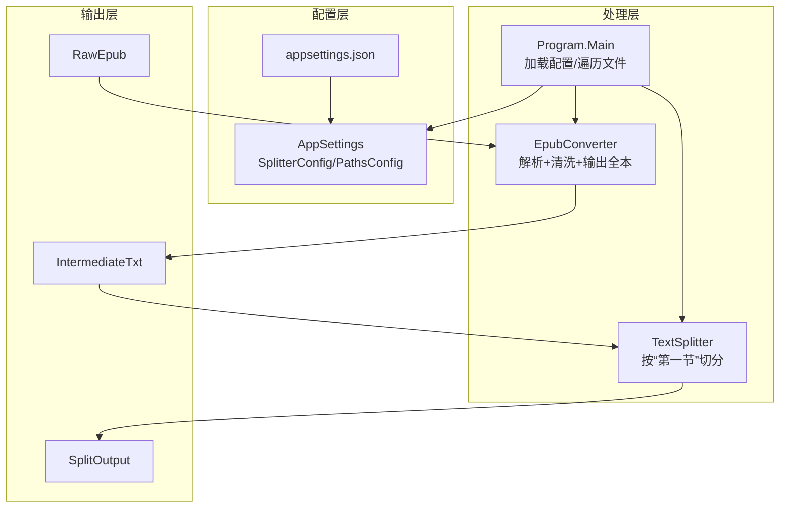
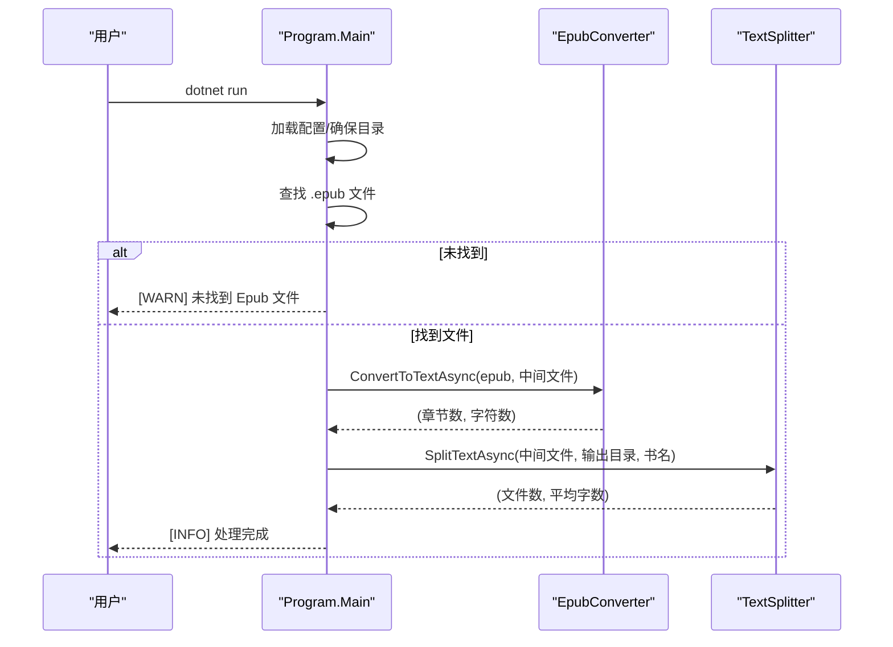
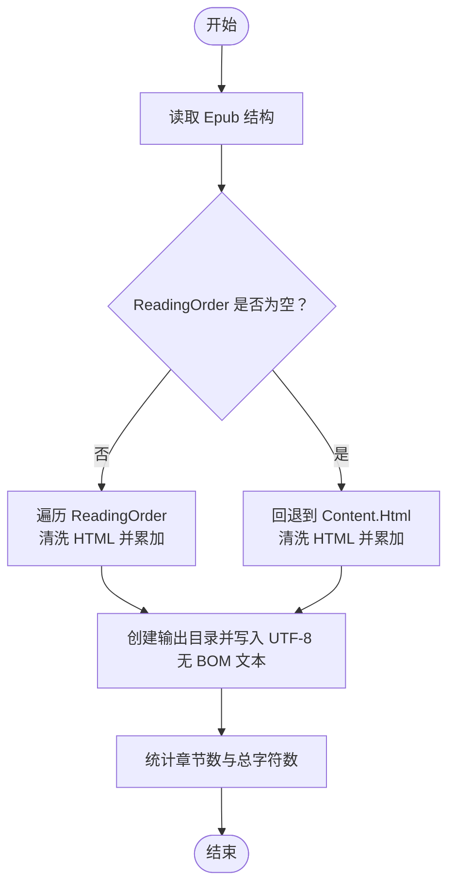
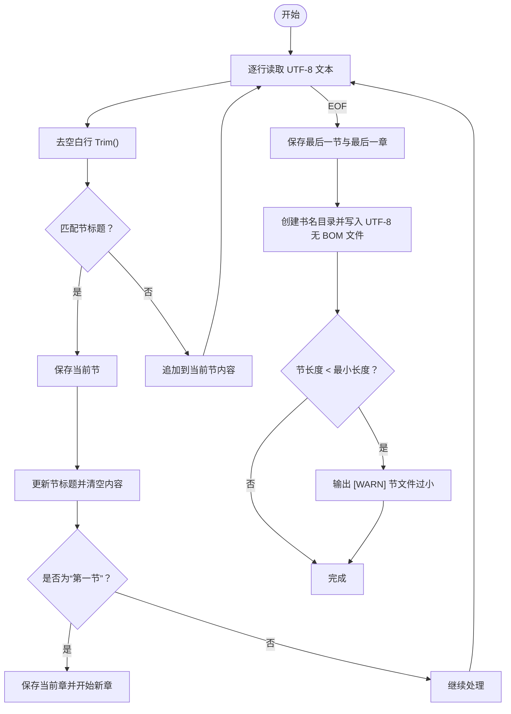
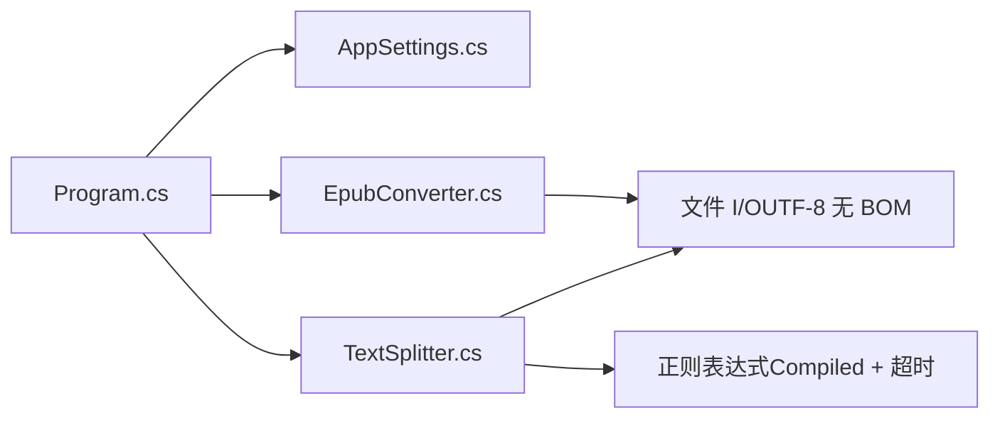

# 故障排除与注意事项

<cite>
**本文引用的文件**
- [README.md](file://README.md)
- [Program.cs](file://Program.cs)
- [EpubConverter.cs](file://EpubConverter.cs)
- [TextSplitter.cs](file://TextSplitter.cs)
- [AppSettings.cs](file://AppSettings.cs)
- [appsettings.json](file://appsettings.json)
- [docs/Agent&Chat.md](file://docs/Agent&Chat.md)
</cite>

## 目录
1. [简介](#简介)
2. [项目结构](#项目结构)
3. [核心组件](#核心组件)
4. [架构总览](#架构总览)
5. [详细组件分析](#详细组件分析)
6. [依赖分析](#依赖分析)
7. [性能考虑](#性能考虑)
8. [故障排除指南](#故障排除指南)
9. [结论](#结论)

## 简介
本指南面向使用“Epub 转文本与章节切分系统”的用户，聚焦常见问题与解决方法，覆盖以下关键主题：
- 目录与文件准备：RawEpub、IntermediateTxt、SplitOutput 的作用与注意事项
- 日志级别与含义：[INFO]、[WARN]、[ERROR] 的语义及排查要点
- 正则表达式超时与匹配：章节/节标题识别、中文数字支持、回溯陷阱防护
- 编码与文件名：UTF-8 无 BOM 输出、非法字符清洗
- 大文件处理：流式读取、内存占用与性能优化

## 项目结构
- 输入目录：RawEpub（存放待处理的 .epub 文件）
- 中间产物：IntermediateTxt（全本文本）
- 输出目录：SplitOutput（按章节拆分后的 TXT 文件）

图表来源
- [README.md](file://README.md#L67-L117)
- [Program.cs](file://Program.cs#L100-L133)
- [EpubConverter.cs](file://EpubConverter.cs#L14-L80)
- [TextSplitter.cs](file://TextSplitter.cs#L29-L171)

章节来源
- [README.md](file://README.md#L67-L117)
- [Program.cs](file://Program.cs#L100-L133)

## 核心组件
- 程序入口与流程控制：负责加载配置、校验目录、遍历 Epub、调用转换与切分、输出统计与错误处理
- Epub 转换器：解析 Epub、清洗 HTML、输出 UTF-8 无 BOM 全文本
- 文本切分器：按“第一节”识别章节，流式读取，输出 UTF-8 无 BOM 的章节与节文件，进行文件名清洗与最小长度告警

章节来源
- [Program.cs](file://Program.cs#L1-L135)
- [EpubConverter.cs](file://EpubConverter.cs#L14-L80)
- [TextSplitter.cs](file://TextSplitter.cs#L1-L171)
- [AppSettings.cs](file://AppSettings.cs#L1-L60)
- [appsettings.json](file://appsettings.json#L1-L12)

## 架构总览
系统采用“配置驱动 + 两阶段处理”的架构：
- 配置层：AppSettings + appsettings.json
- 处理层：EpubConverter（阶段1）、TextSplitter（阶段2）
- 输出层：UTF-8 无 BOM 文本文件，自动清洗文件名，目录按书名隔离

图表来源
- [Program.cs](file://Program.cs#L1-L135)
- [EpubConverter.cs](file://EpubConverter.cs#L14-L80)
- [TextSplitter.cs](file://TextSplitter.cs#L29-L171)
- [AppSettings.cs](file://AppSettings.cs#L1-L60)
- [appsettings.json](file://appsettings.json#L1-L12)

## 详细组件分析

### 程序入口与流程控制
- 加载配置：使用配置构建器绑定 appsettings.json，路径统一解析为绝对路径
- 目录准备：确保 RawEpub、IntermediateTxt、SplitOutput 存在
- 文件发现：在 RawEpub 目录查找 .epub
- 处理流程：逐个文件执行“Epub 转全本”“章节切分”，输出耗时统计
- 异常处理：捕获顶层异常，输出 [ERROR] 信息

图表来源
- [Program.cs](file://Program.cs#L1-L135)
- [README.md](file://README.md#L149-L154)

章节来源
- [Program.cs](file://Program.cs#L1-L135)
- [README.md](file://README.md#L149-L154)

### Epub 转换器
- 优先使用 ReadingOrder 顺序解析，若为空则回退到 Content.Html
- HTML 清洗：提取文本、还原 HTML 实体、清理多余空白与控制字符
- 输出：UTF-8 无 BOM 编码，目录不存在时自动创建

图表来源
- [EpubConverter.cs](file://EpubConverter.cs#L14-L80)

章节来源
- [EpubConverter.cs](file://EpubConverter.cs#L14-L80)

### 文本切分器
- 切分策略：以“第一节”作为新章起点，按节标题匹配进行切分
- 正则超时：节标题匹配设置 1 秒超时，Compiled + Multiline
- 文件名清洗：移除非法字符并限制长度，避免文件系统错误
- 最小长度告警：低于阈值的节输出 [WARN] 提示
- 输出：UTF-8 无 BOM，章节/节文件按序号命名，书名目录隔离

图表来源
- [TextSplitter.cs](file://TextSplitter.cs#L29-L171)

章节来源
- [TextSplitter.cs](file://TextSplitter.cs#L1-L171)

## 依赖分析
- 配置绑定：Program 通过配置构建器绑定 AppSettings，AppSettings 定义 SplitterConfig 与 PathsConfig
- 正则依赖：TextSplitter 使用 Compiled + Multiline + 超时保护
- I/O 依赖：EpubConverter 与 TextSplitter 均使用 UTF-8 无 BOM 编码写入

图表来源
- [Program.cs](file://Program.cs#L1-L135)
- [AppSettings.cs](file://AppSettings.cs#L1-L60)
- [EpubConverter.cs](file://EpubConverter.cs#L14-L80)
- [TextSplitter.cs](file://TextSplitter.cs#L1-L171)

章节来源
- [Program.cs](file://Program.cs#L1-L135)
- [AppSettings.cs](file://AppSettings.cs#L1-L60)
- [EpubConverter.cs](file://EpubConverter.cs#L14-L80)
- [TextSplitter.cs](file://TextSplitter.cs#L1-L171)

## 性能考虑
- 预编译正则：提升匹配效率，降低重复编译开销
- 流式读取：逐行读取文本，避免一次性加载全文到内存
- UTF-8 无 BOM：减少文件体积与兼容性问题
- 目录隔离：按书名创建子目录，避免文件名冲突与 I/O 热点

章节来源
- [README.md](file://README.md#L157-L163)
- [TextSplitter.cs](file://TextSplitter.cs#L29-L171)
- [EpubConverter.cs](file://EpubConverter.cs#L72-L78)

## 故障排除指南

### 1. 未找到 Epub 文件
- 现象：控制台输出 [WARN] 未找到 Epub 文件
- 排查要点：
  - 确认 RawEpub 目录是否存在且包含 .epub 文件
  - 检查 appsettings.json 中 Paths.RawEpubFolder 的路径是否正确（相对路径会被解析为基于程序目录的绝对路径）
  - 若使用 IDE 或打包后运行，注意工作目录差异，必要时调整相对路径或使用绝对路径
- 参考实现位置：
  - [Program.cs](file://Program.cs#L19-L26)
  - [Program.cs](file://Program.cs#L61-L75)
  - [docs/Agent&Chat.md](file://docs/Agent&Chat.md#L98-L105)

章节来源
- [Program.cs](file://Program.cs#L19-L26)
- [Program.cs](file://Program.cs#L61-L75)
- [docs/Agent&Chat.md](file://docs/Agent&Chat.md#L98-L105)

### 2. 未检测到任何章节
- 现象：控制台输出 [WARN] 未检测到任何章节
- 排查要点：
  - 检查 IntermediateTxt 中的全本文本是否为空或仅含空白
  - 确认 TextSplitter 的节标题正则是否覆盖目标书籍的“第一节”格式
  - 若书籍标题使用了“序：”“序章”等变体，需在 appsettings.json 的 SectionRegex 中补充
- 参考实现位置：
  - [TextSplitter.cs](file://TextSplitter.cs#L116-L121)
  - [appsettings.json](file://appsettings.json#L1-L12)
  - [docs/Agent&Chat.md](file://docs/Agent&Chat.md#L108-L142)

章节来源
- [TextSplitter.cs](file://TextSplitter.cs#L116-L121)
- [appsettings.json](file://appsettings.json#L1-L12)
- [docs/Agent&Chat.md](file://docs/Agent&Chat.md#L108-L142)

### 3. 节文件过小
- 现象：控制台输出 [WARN] 节文件过小
- 排查要点：
  - 检查 MinChapterLength 配置是否过高
  - 确认节标题识别是否正确，避免误判导致节内容过短
- 参考实现位置：
  - [TextSplitter.cs](file://TextSplitter.cs#L152-L155)
  - [appsettings.json](file://appsettings.json#L1-L12)

章节来源
- [TextSplitter.cs](file://TextSplitter.cs#L152-L155)
- [appsettings.json](file://appsettings.json#L1-L12)

### 4. 正则表达式超时或匹配不准确
- 现象：长时间卡顿或未识别到章节
- 排查要点：
  - TextSplitter 对节标题匹配设置了 1 秒超时，避免回溯陷阱
  - 确认 SectionRegex 是否覆盖目标书籍的“第一节”格式（如“第一节：标题”）
  - 若书籍使用“序：”“序章”等格式，需在配置中补充
- 参考实现位置：
  - [TextSplitter.cs](file://TextSplitter.cs#L18-L24)
  - [appsettings.json](file://appsettings.json#L1-L12)
  - [docs/Agent&Chat.md](file://docs/Agent&Chat.md#L108-L142)

章节来源
- [TextSplitter.cs](file://TextSplitter.cs#L18-L24)
- [appsettings.json](file://appsettings.json#L1-L12)
- [docs/Agent&Chat.md](file://docs/Agent&Chat.md#L108-L142)

### 5. 编码问题（乱码/兼容性差）
- 现象：打开 TXT 文件出现乱码或兼容性问题
- 排查要点：
  - 输出均为 UTF-8 无 BOM 编码，确保编辑器/阅读器以 UTF-8 打开
  - 若仍遇问题，确认文件保存时未被强制改为带 BOM 的编码
- 参考实现位置：
  - [EpubConverter.cs](file://EpubConverter.cs#L72-L78)
  - [TextSplitter.cs](file://TextSplitter.cs#L125-L160)
  - [README.md](file://README.md#L168-L169)

章节来源
- [EpubConverter.cs](file://EpubConverter.cs#L72-L78)
- [TextSplitter.cs](file://TextSplitter.cs#L125-L160)
- [README.md](file://README.md#L168-L169)

### 6. 文件名非法字符导致写入失败
- 现象：写入章节/节文件时报错或文件名异常
- 排查要点：
  - 系统会自动清洗非法字符并限制长度，但仍需确认输出目录权限与磁盘空间
  - 若书名或章节标题包含大量非法字符，建议先在 Epub 源文件中修正
- 参考实现位置：
  - [TextSplitter.cs](file://TextSplitter.cs#L236-L272)
  - [README.md](file://README.md#L169-L170)

章节来源
- [TextSplitter.cs](file://TextSplitter.cs#L236-L272)
- [README.md](file://README.md#L169-L170)

### 7. 目录结构与输出组织
- 现象：输出目录结构不符合预期
- 排查要点：
  - 每本书在 SplitOutput 下创建独立子目录，避免混淆
  - 章节目录名包含序号与中文数字，节文件名包含全局序号
- 参考实现位置：
  - [TextSplitter.cs](file://TextSplitter.cs#L132-L160)
  - [README.md](file://README.md#L67-L84)

章节来源
- [TextSplitter.cs](file://TextSplitter.cs#L132-L160)
- [README.md](file://README.md#L67-L84)

### 8. 日志级别与含义
- [INFO]：常规处理信息（如解析进度、统计、完成提示）
- [WARN]：警告信息（如未找到 Epub、未检测到章节、节过小）
- [ERROR]：错误信息（如异常抛出、I/O 错误）
- 参考实现位置：
  - [README.md](file://README.md#L149-L154)
  - [Program.cs](file://Program.cs#L21-L26)
  - [Program.cs](file://Program.cs#L128-L133)
  - [TextSplitter.cs](file://TextSplitter.cs#L116-L121)
  - [TextSplitter.cs](file://TextSplitter.cs#L152-L155)

章节来源
- [README.md](file://README.md#L149-L154)
- [Program.cs](file://Program.cs#L21-L26)
- [Program.cs](file://Program.cs#L128-L133)
- [TextSplitter.cs](file://TextSplitter.cs#L116-L121)
- [TextSplitter.cs](file://TextSplitter.cs#L152-L155)

## 结论
- 本系统通过清晰的两阶段处理、UTF-8 无 BOM 输出、正则超时保护与文件名清洗，提供了稳定可靠的 Epub 转文本与章节切分能力
- 遇到问题时，优先检查 RawEpub 目录与配置路径、节标题正则覆盖范围、最小章节长度阈值以及日志级别提示
- 对于大文件与复杂书籍，建议根据实际内容优化正则表达式，并关注输出目录权限与磁盘空间