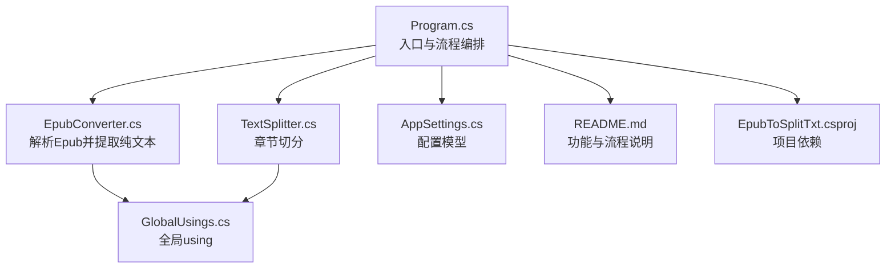
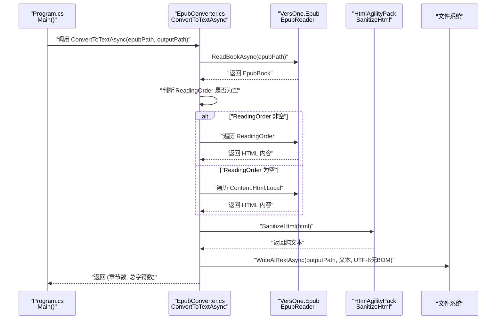
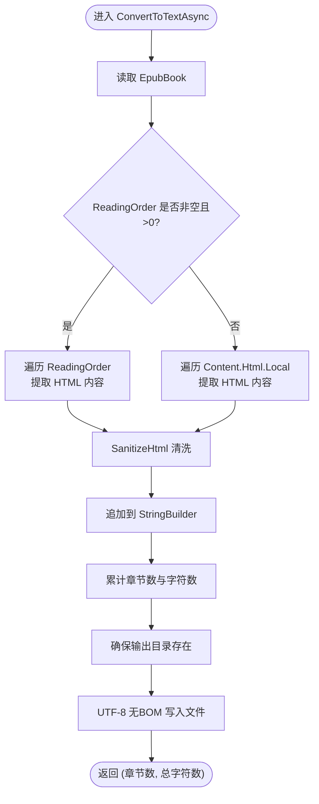
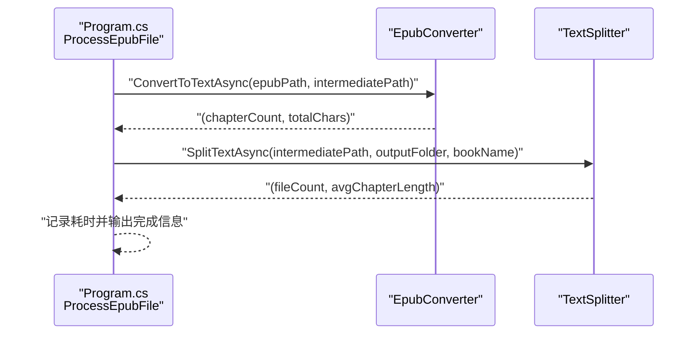
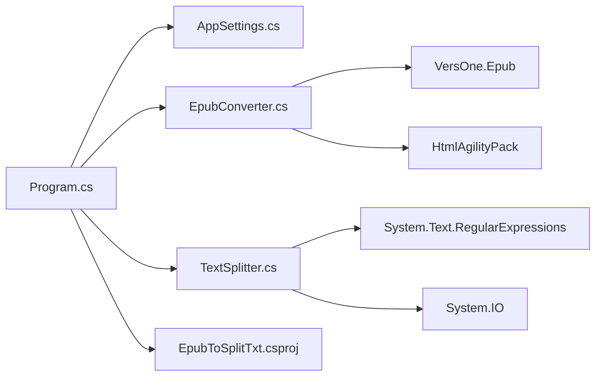

# Epub解析

<cite>
**本文引用的文件**
- [Program.cs](file://Program.cs)
- [EpubConverter.cs](file://EpubConverter.cs)
- [TextSplitter.cs](file://TextSplitter.cs)
- [AppSettings.cs](file://AppSettings.cs)
- [README.md](file://README.md)
- [EpubToSplitTxt.csproj](file://EpubToSplitTxt.csproj)
- [GlobalUsings.cs](file://GlobalUsings.cs)
</cite>

## 目录
1. [简介](#简介)
2. [项目结构](#项目结构)
3. [核心组件](#核心组件)
4. [架构总览](#架构总览)
5. [详细组件分析](#详细组件分析)
6. [依赖分析](#依赖分析)
7. [性能考虑](#性能考虑)
8. [故障排查指南](#故障排查指南)
9. [结论](#结论)

## 简介
本文件围绕 Epub 解析功能展开，重点说明 EpubConverter 类如何借助 VersOne.Epub 库读取 Epub 的 ReadingOrder 并提取 HTML 内容；当 ReadingOrder 为空时的备用方案（从 Content.Html 中遍历所有 HTML 文件）；结合 Program.cs 中的 ProcessEpubFile 方法，阐明 Epub 解析在整个处理流程中的第一阶段作用；同时提供 ConvertToTextAsync 方法的实现要点、异常处理机制以及性能优化策略（如使用 UTF-8 无 BOM 编码写入文件）。

## 项目结构
项目采用“入口程序 + 服务层”的分层组织方式：
- Program.cs：应用入口，负责加载配置、准备目录、遍历 Epub 文件并调度处理流程。
- Services 层：
  - EpubConverter.cs：负责解析 Epub 并输出纯文本中间文件。
  - TextSplitter.cs：负责将中间文本按章节切分为独立文件。
- Config 层：
  - AppSettings.cs：配置模型，承载路径与切分规则。
- 其他：
  - README.md：功能说明、处理流程图、配置说明。
  - EpubToSplitTxt.csproj：项目文件，声明依赖（VersOne.Epub、HtmlAgilityPack 等）。
  - GlobalUsings.cs：全局 using，统一导入常用命名空间。

图表来源
- [Program.cs](file://Program.cs#L1-L134)
- [EpubConverter.cs](file://EpubConverter.cs#L1-L191)
- [TextSplitter.cs](file://TextSplitter.cs#L1-L292)
- [AppSettings.cs](file://AppSettings.cs#L1-L60)
- [README.md](file://README.md#L1-L231)
- [EpubToSplitTxt.csproj](file://EpubToSplitTxt.csproj#L1-L27)
- [GlobalUsings.cs](file://GlobalUsings.cs#L1-L8)

章节来源
- [Program.cs](file://Program.cs#L1-L134)
- [README.md](file://README.md#L1-L231)

## 核心组件
- EpubConverter：使用 VersOne.Epub 读取 Epub，优先按 ReadingOrder 顺序提取 HTML 内容，若 ReadingOrder 为空，则从 Content.Html.Local 遍历所有 HTML 文件进行提取；随后通过 HtmlAgilityPack 清洗 HTML、去除实体与多余空白，最后以 UTF-8 无 BOM 写入中间文本文件。
- TextSplitter：读取中间文本，按“第一节”作为章节起始标志进行切分，生成带编号的章节与节文件，输出到 SplitOutput 目录。
- AppSettings：封装路径与切分规则配置，供入口与组件使用。

章节来源
- [EpubConverter.cs](file://EpubConverter.cs#L1-L191)
- [TextSplitter.cs](file://TextSplitter.cs#L1-L292)
- [AppSettings.cs](file://AppSettings.cs#L1-L60)

## 架构总览
Epub 解析处于整体处理流程的第一阶段，其职责是将 Epub 转换为“全本文本中间文件”，供后续 TextSplitter 进行章节切分。

图表来源
- [Program.cs](file://Program.cs#L100-L133)
- [EpubConverter.cs](file://EpubConverter.cs#L14-L79)
- [EpubToSplitTxt.csproj](file://EpubToSplitTxt.csproj#L10-L14)

## 详细组件分析

### EpubConverter 组件分析
- 读取与解析
  - 使用 EpubReader.ReadBookAsync 读取 Epub 文件，获取 EpubBook。
  - 优先使用 book.ReadingOrder 作为阅读顺序；若为空或数量为 0，则回退到 book.Content.Html.Local 遍历所有 HTML 文件。
- HTML 清洗
  - 通过 HtmlDocument.LoadHtml 加载 HTML，使用 InnerText 获取纯文本。
  - 使用 HtmlEntity.DeEntitize 转换 HTML 实体。
  - CleanWhitespace 清理控制字符、规范化换行并压缩多余空行。
- 输出与统计
  - 使用 UTF8Encoding(false) 创建 UTF-8 无 BOM 编码实例，异步写入中间文本文件。
  - 返回章节计数与总字符数，便于后续统计与日志输出。

图表来源
- [EpubConverter.cs](file://EpubConverter.cs#L14-L79)

章节来源
- [EpubConverter.cs](file://EpubConverter.cs#L14-L79)
- [EpubConverter.cs](file://EpubConverter.cs#L82-L190)

### Program.cs 中的 ProcessEpubFile 流程
- 单个 Epub 文件处理分为两个阶段：
  - 阶段 1：调用 EpubConverter.ConvertToTextAsync，生成中间全本文本文件。
  - 阶段 2：调用 TextSplitter.SplitTextAsync，按“第一节”规则切分为章节与节文件。
- 异常处理：在 ProcessEpubFile 内捕获异常并输出错误信息，避免中断整个批量处理。

图表来源
- [Program.cs](file://Program.cs#L100-L133)
- [TextSplitter.cs](file://TextSplitter.cs#L26-L171)

章节来源
- [Program.cs](file://Program.cs#L100-L133)

### TextSplitter 组件分析（用于理解整体流程）
- 读取中间文本文件，逐行匹配“节标题”与“第一节”。
- 以“第一节”作为新章起点，将内容拆分为章节与节。
- 输出时同样使用 UTF-8 无 BOM 编码，保证兼容性。

章节来源
- [TextSplitter.cs](file://TextSplitter.cs#L26-L171)

## 依赖分析
- 外部库
  - VersOne.Epub：读取 Epub 结构与内容（ReadingOrder、Content.Html）。
  - HtmlAgilityPack：解析与清洗 HTML。
  - Microsoft.Extensions.Configuration：绑定配置模型。
- 项目内部
  - Program.cs 依赖 AppSettings、EpubConverter、TextSplitter。
  - EpubConverter 依赖 VersOne.Epub、HtmlAgilityPack。
  - TextSplitter 依赖 System.Text.RegularExpressions、System.IO。

图表来源
- [EpubToSplitTxt.csproj](file://EpubToSplitTxt.csproj#L10-L14)
- [Program.cs](file://Program.cs#L1-L134)
- [EpubConverter.cs](file://EpubConverter.cs#L1-L191)
- [TextSplitter.cs](file://TextSplitter.cs#L1-L292)

章节来源
- [EpubToSplitTxt.csproj](file://EpubToSplitTxt.csproj#L10-L14)
- [GlobalUsings.cs](file://GlobalUsings.cs#L1-L8)

## 性能考虑
- 流式处理与内存占用
  - TextSplitter 使用 StreamReader 逐行读取中间文本，避免一次性加载全文到内存，降低内存峰值。
  - README 中明确指出“流式处理大文件，内存占用低”。
- 正则优化
  - TextSplitter 构造函数中对正则表达式启用 Compiled 选项，并设置超时时间，防止回溯陷阱导致性能问题。
- 编码选择
  - EpubConverter 与 TextSplitter 在写入时均使用 UTF-8 无 BOM 编码，减少文件体积并提升跨平台兼容性。
- I/O 优化
  - ConvertToTextAsync 使用异步写入 File.WriteAllTextAsync，提高 I/O 吞吐。

章节来源
- [TextSplitter.cs](file://TextSplitter.cs#L1-L292)
- [README.md](file://README.md#L157-L172)
- [EpubConverter.cs](file://EpubConverter.cs#L72-L74)
- [TextSplitter.cs](file://TextSplitter.cs#L120-L171)

## 故障排查指南
- ReadingOrder 为空
  - 现象：日志提示 ReadingOrder 为空，程序回退到 Content.Html.Local 遍历 HTML 文件。
  - 排查：确认 Epub 是否包含 ReadingOrder；若缺失，回退逻辑会自动生效。
- HTML 实体与空白字符
  - 现象：文本中可能出现实体或多余空白。
  - 处理：SanitizeHtml 已进行实体转换与空白清理；如仍有异常，检查 HTML 内容结构。
- 输出编码问题
  - 现象：部分工具打开文件显示乱码。
  - 处理：确保以 UTF-8 无 BOM 打开；项目已强制使用该编码写入。
- 目录权限与路径
  - 现象：无法创建中间文件或输出目录。
  - 处理：确认路径存在且具备写权限；入口已自动创建必要目录。
- 正则匹配失败
  - 现象：未检测到章节或切分异常。
  - 处理：调整 appsettings.json 中的 SectionRegex 或 ChapterRegex，使其更贴合目标文本格式。

章节来源
- [EpubConverter.cs](file://EpubConverter.cs#L42-L63)
- [EpubConverter.cs](file://EpubConverter.cs#L82-L107)
- [TextSplitter.cs](file://TextSplitter.cs#L116-L171)
- [Program.cs](file://Program.cs#L92-L97)
- [README.md](file://README.md#L88-L116)

## 结论
EpubConverter 通过 VersOne.Epub 读取 Epub 的 ReadingOrder 或回退到 Content.Html，结合 HtmlAgilityPack 完成 HTML 清洗与实体转换，并以 UTF-8 无 BOM 写入中间文本文件。Program.cs 的 ProcessEpubFile 将其置于处理流程的第一阶段，为后续章节切分奠定基础。整体设计兼顾健壮性（空 ReadingOrder 回退）、性能（流式与异步 I/O、正则优化）与兼容性（UTF-8 无 BOM），适合处理大量 Epub 文件并稳定产出结构化的章节文本。