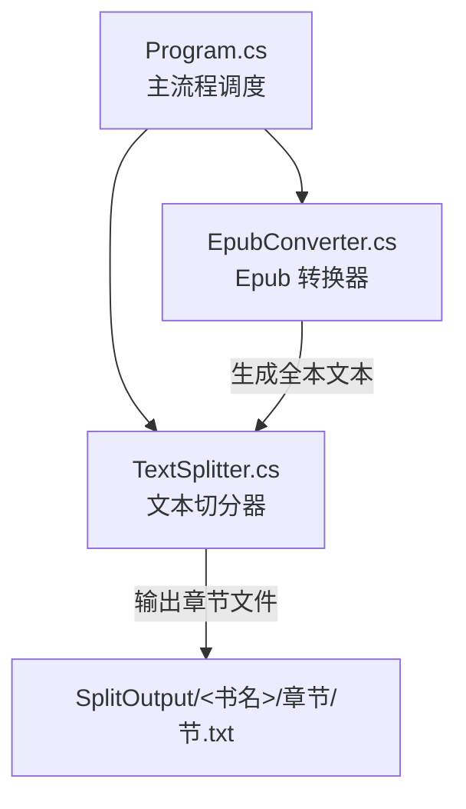
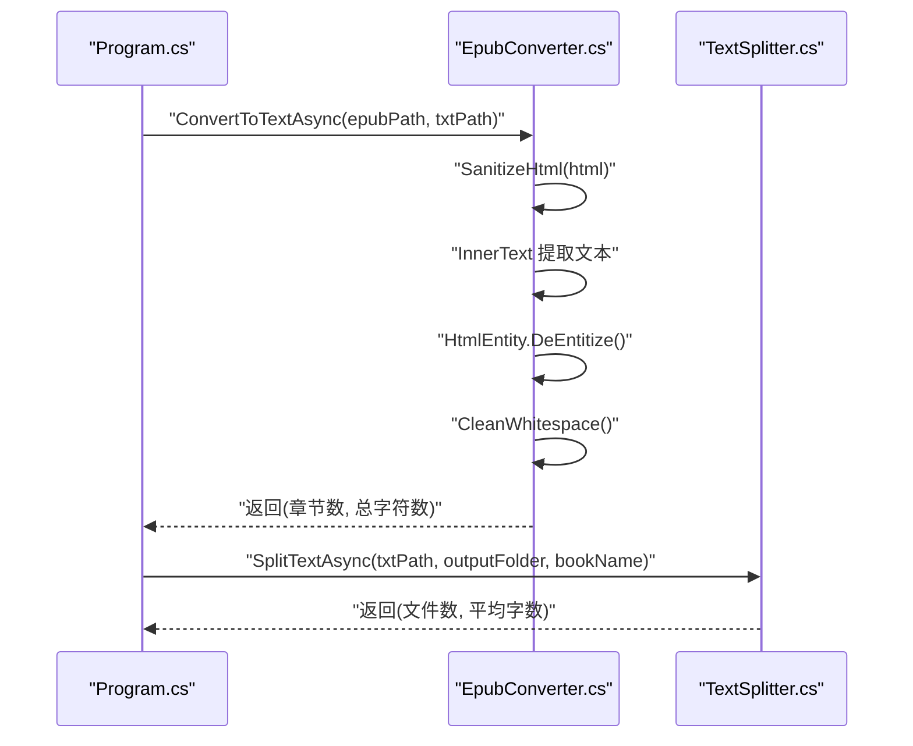
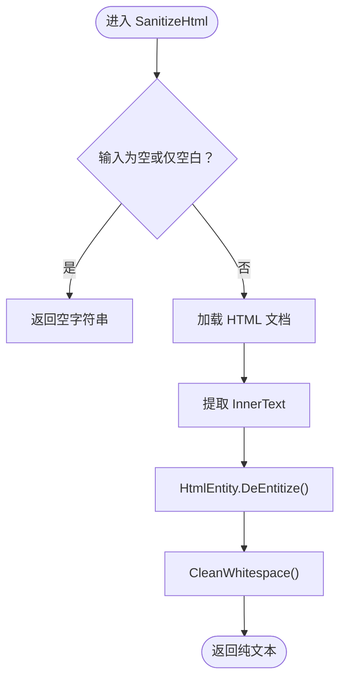
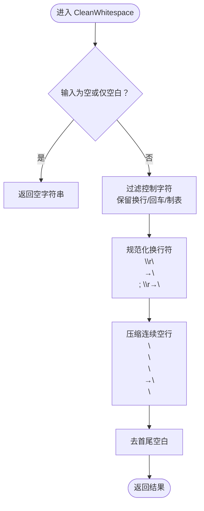
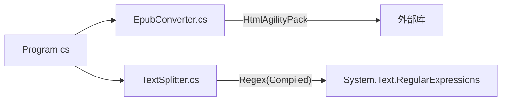

# 文本清洗

<cite>
**本文引用的文件**
- [EpubConverter.cs](file://EpubConverter.cs)
- [TextSplitter.cs](file://TextSplitter.cs)
- [Program.cs](file://Program.cs)
- [README.md](file://README.md)
</cite>

## 目录
1. [简介](#简介)
2. [项目结构](#项目结构)
3. [核心组件](#核心组件)
4. [架构概览](#架构概览)
5. [详细组件分析](#详细组件分析)
6. [依赖分析](#依赖分析)
7. [性能考虑](#性能考虑)
8. [故障排查指南](#故障排查指南)
9. [结论](#结论)
10. [附录](#附录)

## 简介
本文聚焦于 EpubConverter 中的文本清洗流程，特别是 SanitizeHtml 方法的工作机制。我们将详细说明如何使用 HtmlAgilityPack 的 InnerText 属性提取纯文本，随后进行 HTML 实体解码（HtmlEntity.DeEntitize），以及 CleanWhitespace 如何移除控制字符、规范化换行符并压缩连续空行。最后结合 TextSplitter 的章节切分逻辑，讨论清洗质量对后续章节切分准确性的潜在影响。

## 项目结构
- 程序入口负责加载配置、准备目录、遍历 Epub 并依次调用转换器与切分器。
- EpubConverter 负责解析 Epub、提取 HTML 内容并清洗为纯文本。
- TextSplitter 负责按“第一节”分章，将纯文本切分为独立章节文件。

图表来源
- [Program.cs](file://Program.cs#L100-L133)
- [EpubConverter.cs](file://EpubConverter.cs#L14-L80)
- [TextSplitter.cs](file://TextSplitter.cs#L26-L171)

章节来源
- [Program.cs](file://Program.cs#L100-L133)
- [README.md](file://README.md#L131-L145)

## 核心组件
- EpubConverter.ConvertToTextAsync：读取 Epub，遍历内容文件，调用 SanitizeHtml 清洗并拼接为全本文本。
- EpubConverter.SanitizeHtml：使用 HtmlAgilityPack 提取文本、解码实体、再经 CleanWhitespace 清理空白。
- EpubConverter.CleanWhitespace：移除控制字符（保留换行/制表）、规范化换行符、压缩多余空行。
- TextSplitter.SplitTextAsync：按“第一节”分章，逐行匹配节标题，输出独立章节文件。

章节来源
- [EpubConverter.cs](file://EpubConverter.cs#L14-L80)
- [EpubConverter.cs](file://EpubConverter.cs#L82-L107)
- [EpubConverter.cs](file://EpubConverter.cs#L158-L189)
- [TextSplitter.cs](file://TextSplitter.cs#L26-L171)

## 架构概览
下面的时序图展示了从 Epub 到章节文件的关键步骤，重点标注了文本清洗环节：

图表来源
- [Program.cs](file://Program.cs#L115-L123)
- [EpubConverter.cs](file://EpubConverter.cs#L14-L80)
- [EpubConverter.cs](file://EpubConverter.cs#L82-L107)
- [TextSplitter.cs](file://TextSplitter.cs#L26-L171)

## 详细组件分析

### SanitizeHtml 方法：从 HTML 到纯文本
- 输入：HTML 字符串
- 步骤：
  1) 使用 HtmlAgilityPack 加载 HTML 文档。
  2) 通过 DocumentNode.InnerText 直接提取所有文本节点内容，跳过标签。
  3) 使用 HtmlEntity.DeEntitize 将 HTML 实体（如 &amp;）还原为对应字符。
  4) 调用 CleanWhitespace 进一步清理空白字符与换行。
- 输出：清洗后的纯文本字符串

图表来源
- [EpubConverter.cs](file://EpubConverter.cs#L82-L107)
- [EpubConverter.cs](file://EpubConverter.cs#L158-L189)

章节来源
- [EpubConverter.cs](file://EpubConverter.cs#L82-L107)

### InnerText 提取策略与注意事项
- InnerText 会抓取整个文档树中所有文本节点的内容，并按 DOM 顺序拼接，天然忽略标签。
- 由于不关心标签结构，因此不会保留样式、脚本、元信息等非内容片段。
- 对于嵌套标签，InnerText 会保留文本间的自然顺序；但不会保留标签语义。

章节来源
- [EpubConverter.cs](file://EpubConverter.cs#L94-L101)

### HTML 实体转换（HtmlEntity.DeEntitize）
- 作用：将 HTML 实体（如 &lt;、&gt;、&amp;、&quot; 等）还原为对应的 Unicode 字符。
- 影响：提升可读性，避免出现“&amp;nbsp;”等不可见或显示异常的实体文本。
- 与 InnerText 的配合：先提取文本，再统一解码，保证最终文本可直接用于后续处理。

章节来源
- [EpubConverter.cs](file://EpubConverter.cs#L98-L102)

### CleanWhitespace：空白字符清理流程
- 目标：移除控制字符、规范化换行符、压缩连续空行、去除首尾空白。
- 具体步骤：
  1) 移除控制字符：保留换行、回车、制表等常见可接受控制字符，其余控制字符被过滤。
  2) 规范化换行符：将 Windows 风格（\r\n）与旧式 Mac 风格（\r）统一为 Unix 风格（\n）。
  3) 压缩空行：循环替换三个及以上连续换行符为两个，直至不再出现多余空行。
  4) 去除首尾空白：返回 Trim 后的结果。
- 复杂度：线性时间 O(n)，空间 O(n)（StringBuilder 构建）。

图表来源
- [EpubConverter.cs](file://EpubConverter.cs#L158-L189)

章节来源
- [EpubConverter.cs](file://EpubConverter.cs#L158-L189)

### 文本清洗前后对比（示例说明）
- 示例场景：某 HTML 片段包含标签、HTML 实体与不规范换行。
- 清洗前：包含标签、实体（如 &nbsp;）、Windows 风格换行、多处空行。
- 清洗后：仅保留纯文本，实体已还原，换行统一为 Unix 风格，空行被压缩，整体更利于后续切分与阅读。

说明：本节为概念性描述，不直接引用具体代码片段。

### 对章节切分准确性的影响
- 更好的标题识别：CleanWhitespace 统一换行与空行，有助于 TextSplitter 的逐行匹配更稳定。
- 更少的噪声干扰：移除控制字符与多余空行，降低正则匹配的误判风险。
- 一致性增强：规范化换行与实体还原，使“第一节”等关键标题更容易被识别，减少漏分或错分。

章节来源
- [TextSplitter.cs](file://TextSplitter.cs#L26-L171)

## 依赖分析
- EpubConverter 依赖 HtmlAgilityPack（用于加载 HTML 与提取 InnerText）。
- TextSplitter 依赖正则表达式（Compiled 选项）与 UTF-8 编码输出。
- Program 负责装配与调度两个核心组件。

图表来源
- [Program.cs](file://Program.cs#L100-L133)
- [EpubConverter.cs](file://EpubConverter.cs#L14-L80)
- [TextSplitter.cs](file://TextSplitter.cs#L26-L171)
- [README.md](file://README.md#L31-L40)

章节来源
- [README.md](file://README.md#L31-L40)

## 性能考虑
- HtmlAgilityPack 加载与 InnerText 提取：O(n) 时间复杂度，适合大体量 HTML。
- HtmlEntity.DeEntitize：对文本进行一次遍历解码，成本较低。
- CleanWhitespace：线性扫描与多次替换，最坏情况可能触发多次替换循环，但通常在少量空行时即可收敛。
- TextSplitter：使用流式读取（StreamReader）逐行处理，避免一次性加载全文，内存友好。

章节来源
- [EpubConverter.cs](file://EpubConverter.cs#L158-L189)
- [TextSplitter.cs](file://TextSplitter.cs#L51-L100)

## 故障排查指南
- 清洗后文本为空：
  - 检查 HTML 是否包含有效文本节点（例如仅含样式/脚本标签）。
  - 确认 SanitizeHtml 的输入非空且被正确传递。
- 实体未还原：
  - 确认 HtmlEntity.DeEntitize 已执行。
- 换行混乱导致切分异常：
  - 检查 CleanWhitespace 是否正确规范化换行符与压缩空行。
- 切分结果不符合预期：
  - 核对 TextSplitter 的节标题正则是否覆盖目标格式（如“第一节”变体）。
  - 检查最小章节长度阈值是否导致部分节被忽略。

章节来源
- [EpubConverter.cs](file://EpubConverter.cs#L82-L107)
- [EpubConverter.cs](file://EpubConverter.cs#L158-L189)
- [TextSplitter.cs](file://TextSplitter.cs#L26-L171)

## 结论
SanitizeHtml 通过 HtmlAgilityPack 的 InnerText 提取、HtmlEntity.DeEntitize 实体还原与 CleanWhitespace 的空白字符清理，构建了高质量的纯文本基础。这一基础直接影响 TextSplitter 的章节切分效果：更干净、更一致的文本能显著提升“第一节”等关键标题的识别稳定性，从而提高章节切分的准确性与可靠性。

## 附录
- 关键实现位置参考：
  - SanitizeHtml：[EpubConverter.cs](file://EpubConverter.cs#L82-L107)
  - CleanWhitespace：[EpubConverter.cs](file://EpubConverter.cs#L158-L189)
  - 文本切分（按第一节）：[TextSplitter.cs](file://TextSplitter.cs#L26-L171)
  - 主流程调度：[Program.cs](file://Program.cs#L100-L133)