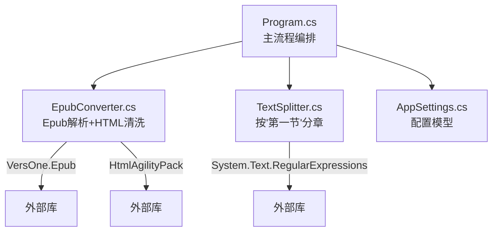
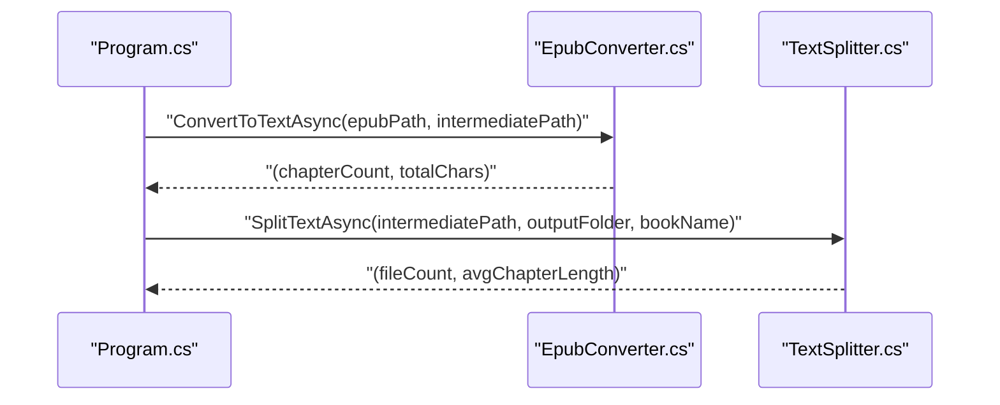
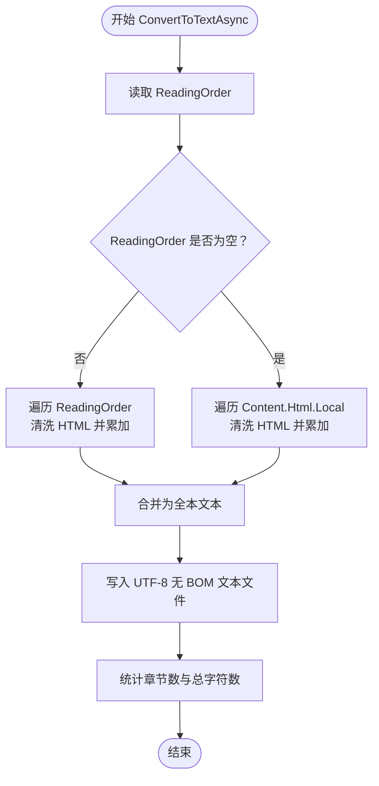
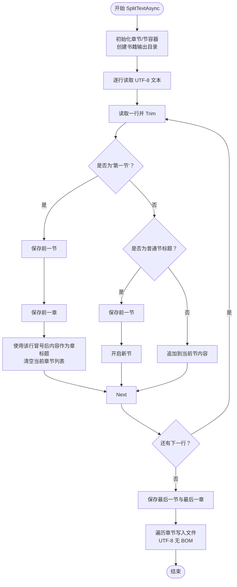
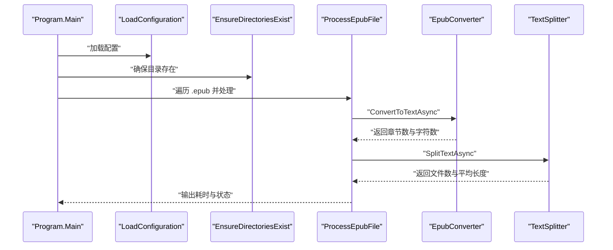
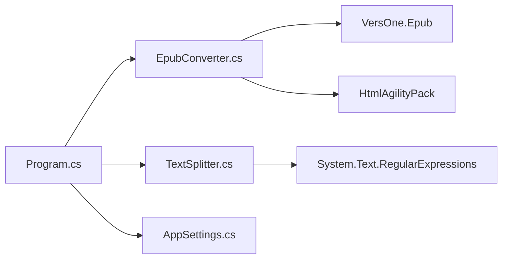

# 核心功能

<cite>
**本文引用的文件**
- [Program.cs](file://Program.cs)
- [EpubConverter.cs](file://EpubConverter.cs)
- [TextSplitter.cs](file://TextSplitter.cs)
- [AppSettings.cs](file://AppSettings.cs)
- [EpubToSplitTxt.csproj](file://EpubToSplitTxt.csproj)
- [README.md](file://README.md)
- [docs/Agent&Chat.md](file://docs/Agent&Chat.md)
</cite>

## 目录
1. [简介](#简介)
2. [项目结构](#项目结构)
3. [核心组件](#核心组件)
4. [架构总览](#架构总览)
5. [详细组件分析](#详细组件分析)
6. [依赖分析](#依赖分析)
7. [性能考量](#性能考量)
8. [故障排查指南](#故障排查指南)
9. [结论](#结论)

## 简介
本项目围绕“Epub 解析、文本清洗与章节切分”三大核心能力展开，目标是将 .epub 电子书转换为纯文本，并依据“第一节”这一语义标记进行章节切分，最终输出为带编号与语义标题的独立 TXT 文件，便于后续阅读或二次处理。

- Epub 解析：使用 VersOne.Epub 读取 Epub 的 ReadingOrder，按顺序提取 HTML 内容。
- 文本清洗：使用 HtmlAgilityPack 清洗 HTML 标签、还原 HTML 实体、规范化空白字符。
- 章节切分：基于“第一节”作为新章节起始点，结合节标题正则，将大文本流式切分为独立章节文件。

## 项目结构
- 程序入口与流程编排：Program.cs
- 配置模型：AppSettings.cs
- 核心服务：
  - EpubConverter.cs：Epub 解析与 HTML 清洗
  - TextSplitter.cs：按“第一节”分章与节切分
- 项目元信息与依赖声明：EpubToSplitTxt.csproj
- 使用说明与流程图：README.md
- 开发演进与关键代码片段说明：docs/Agent&Chat.md

图表来源
- [Program.cs](file://Program.cs#L1-L134)
- [EpubConverter.cs](file://EpubConverter.cs#L1-L191)
- [TextSplitter.cs](file://TextSplitter.cs#L1-L292)
- [AppSettings.cs](file://AppSettings.cs#L1-L60)
- [EpubToSplitTxt.csproj](file://EpubToSplitTxt.csproj#L1-L27)

章节来源
- [Program.cs](file://Program.cs#L1-L134)
- [EpubToSplitTxt.csproj](file://EpubToSplitTxt.csproj#L1-L27)

## 核心组件
- EpubConverter：负责读取 Epub 的 ReadingOrder 或回退到 Content.Html，逐个 HTML 片段调用 HtmlAgilityPack 清洗，合并为全本 TXT 并输出 UTF-8 无 BOM 文本。
- TextSplitter：以“第一节”为章节边界，配合节标题正则，逐行扫描输入文本，将内容切分为章节文件夹内的独立节文件；同时对文件名进行清洗与编号。

章节来源
- [EpubConverter.cs](file://EpubConverter.cs#L1-L191)
- [TextSplitter.cs](file://TextSplitter.cs#L1-L292)

## 架构总览
整体处理链路如下：
- 输入：RawEpub 目录下的若干 .epub 文件
- 阶段一：EpubConverter 读取 Epub，清洗 HTML，生成全本 TXT
- 阶段二：TextSplitter 以“第一节”为界，按节标题正则切分，输出章节文件夹与节文件

图表来源
- [Program.cs](file://Program.cs#L100-L133)
- [EpubConverter.cs](file://EpubConverter.cs#L14-L79)
- [TextSplitter.cs](file://TextSplitter.cs#L26-L171)

## 详细组件分析

### EpubConverter：Epub 解析与 HTML 清洗
- ReadingOrder 优先：遍历 book.ReadingOrder，逐个读取 HTML 内容，调用 SanitizeHtml 清洗后追加到 StringBuilder。
- 回退策略：若 ReadingOrder 为空，则遍历 book.Content.Html.Local，同样清洗并合并。
- 清洗流程：
  - 使用 HtmlDocument.LoadHtml，提取 InnerText 获取纯文本
  - 使用 HtmlEntity.DeEntitize 还原 HTML 实体
  - CleanWhitespace 规范化换行、清理多余空白
- 输出：UTF-8 无 BOM 文本文件，返回章节数量与总字符数统计。

图表来源
- [EpubConverter.cs](file://EpubConverter.cs#L14-L79)
- [EpubConverter.cs](file://EpubConverter.cs#L82-L191)

章节来源
- [EpubConverter.cs](file://EpubConverter.cs#L14-L79)
- [EpubConverter.cs](file://EpubConverter.cs#L82-L191)

### TextSplitter：按“第一节”分章与节切分
- 正则配置：
  - 节标题正则：使用 RegexOptions.Compiled 与多行模式，设置 1 秒超时，避免回溯陷阱
  - “第一节”正则：使用 RegexOptions.Compiled，匹配“第一节”开头的标题行
- 流式处理：使用 UTF-8 编码的 StreamReader 逐行读取，避免一次性加载全文到内存
- 切分逻辑：
  - 遇到“第一节”：先保存当前节，再保存当前章，使用该行冒号后的部分作为章标题，开启新章
  - 遇到普通节标题：保存当前节，开启新节
  - 普通内容：追加到当前节
  - 结束时保存最后一节与最后一章
- 输出：
  - 为每本书创建独立子文件夹
  - 章文件夹命名：序号 + 中文数字 + 章标题
  - 节文件命名：全局序号 + 完整节标题
  - 输出 UTF-8 无 BOM 文本文件
  - 统计输出文件总数与平均每节字数

图表来源
- [TextSplitter.cs](file://TextSplitter.cs#L26-L171)

章节来源
- [TextSplitter.cs](file://TextSplitter.cs#L1-L171)

### Program.cs：协调工作流
- 加载配置：读取 appsettings.json，绑定到 AppSettings，将相对路径转换为绝对路径
- 目录准备：确保 RawEpub、IntermediateTxt、SplitOutput 三个目录存在
- 批量处理：查找 .epub 文件，逐个调用 ProcessEpubFile
- 协调执行：
  - 阶段一：调用 EpubConverter.ConvertToTextAsync 生成全本 TXT
  - 阶段二：调用 TextSplitter.SplitTextAsync 按“第一节”切分章节
  - 统计耗时并输出日志

图表来源
- [Program.cs](file://Program.cs#L1-L134)

章节来源
- [Program.cs](file://Program.cs#L1-L134)

## 依赖分析
- 外部库
  - VersOne.Epub：用于读取 Epub 结构与内容
  - HtmlAgilityPack：用于 HTML 标签清洗与实体还原
  - Microsoft.Extensions.Configuration：用于读取与绑定 appsettings.json
- 内部组件耦合
  - Program.cs 依赖 EpubConverter 与 TextSplitter
  - EpubConverter 依赖 HtmlAgilityPack 与 VersOne.Epub
  - TextSplitter 依赖 System.Text.RegularExpressions

图表来源
- [EpubToSplitTxt.csproj](file://EpubToSplitTxt.csproj#L1-L27)
- [Program.cs](file://Program.cs#L1-L134)
- [EpubConverter.cs](file://EpubConverter.cs#L1-L191)
- [TextSplitter.cs](file://TextSplitter.cs#L1-L292)
- [AppSettings.cs](file://AppSettings.cs#L1-L60)

章节来源
- [EpubToSplitTxt.csproj](file://EpubToSplitTxt.csproj#L1-L27)

## 性能考量
- 预编译正则表达式
  - TextSplitter 的节标题正则与“第一节”正则均使用 RegexOptions.Compiled，降低运行时编译开销
  - 节标题正则额外设置超时，避免复杂回溯导致性能问题
- 流式读取
  - 使用 UTF-8 编码的 StreamReader 逐行读取，避免一次性将大文本加载至内存
- 编码与文件大小
  - 输出统一采用 UTF-8 无 BOM，减少文件体积与兼容性问题
- 目录与文件命名
  - 为每本书创建独立子目录，避免文件名冲突与输出混乱

章节来源
- [TextSplitter.cs](file://TextSplitter.cs#L19-L23)
- [TextSplitter.cs](file://TextSplitter.cs#L50-L56)
- [README.md](file://README.md#L158-L163)

## 故障排查指南
- 未找到 .epub 文件
  - 现象：提示在指定目录未找到 .epub
  - 排查：确认 RawEpubFolder 路径正确且包含 .epub 文件
- ReadingOrder 为空
  - 现象：程序回退到 Content.Html.Local 继续处理
  - 排查：检查 Epub 结构是否规范，必要时调整源文档
- 未检测到任何章节
  - 现象：切分完成后提示未检测到任何章节
  - 排查：确认节标题正则与“第一节”正则是否覆盖实际标题格式；必要时调整 appsettings.json 中的 SectionRegex
- 节文件过小
  - 现象：输出警告“节文件过小”
  - 排查：提高 MinChapterLength 配置或调整节标题识别规则
- I/O 错误或异常
  - 现象：处理过程中抛出异常
  - 排查：查看错误消息与堆栈，确认磁盘空间、权限与路径有效性

章节来源
- [Program.cs](file://Program.cs#L18-L26)
- [Program.cs](file://Program.cs#L113-L133)
- [TextSplitter.cs](file://TextSplitter.cs#L116-L121)
- [TextSplitter.cs](file://TextSplitter.cs#L152-L156)
- [README.md](file://README.md#L149-L155)

## 结论
本项目通过“Epub 解析 + HTML 清洗 + 按‘第一节’分章”的组合策略，实现了对中文 Epub 的稳定切分与高可读性输出。其关键优势在于：
- 使用 VersOne.Epub 的 ReadingOrder 保证阅读顺序
- HtmlAgilityPack 提供可靠的 HTML 清洗能力
- 基于“第一节”的语义分章，契合中文小说的常见结构
- 正则预编译与流式读取兼顾性能与内存占用
- 配置化与清晰的目录结构提升可维护性与扩展性