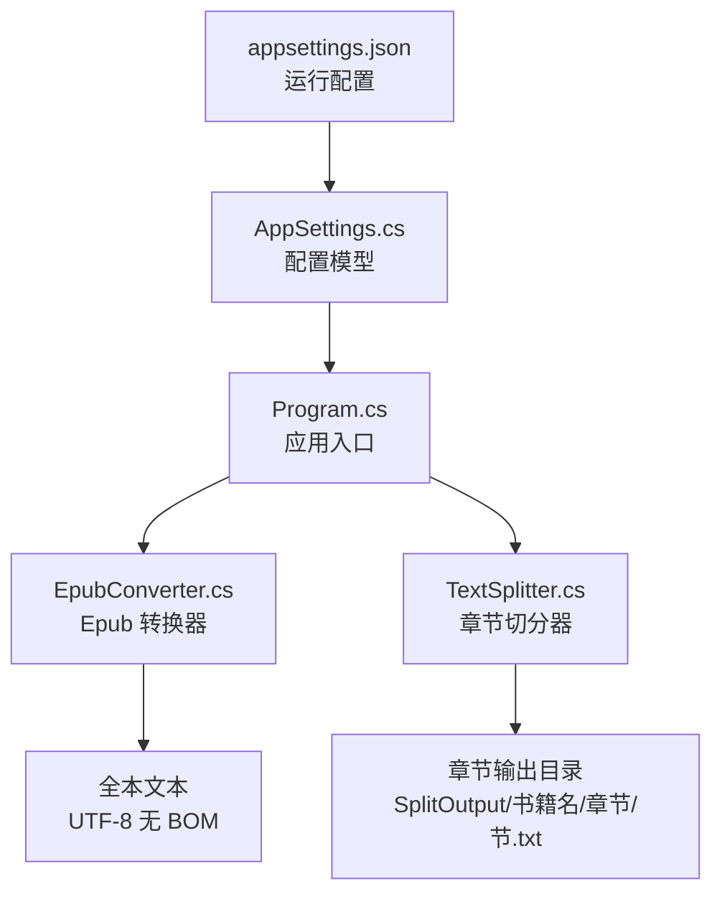
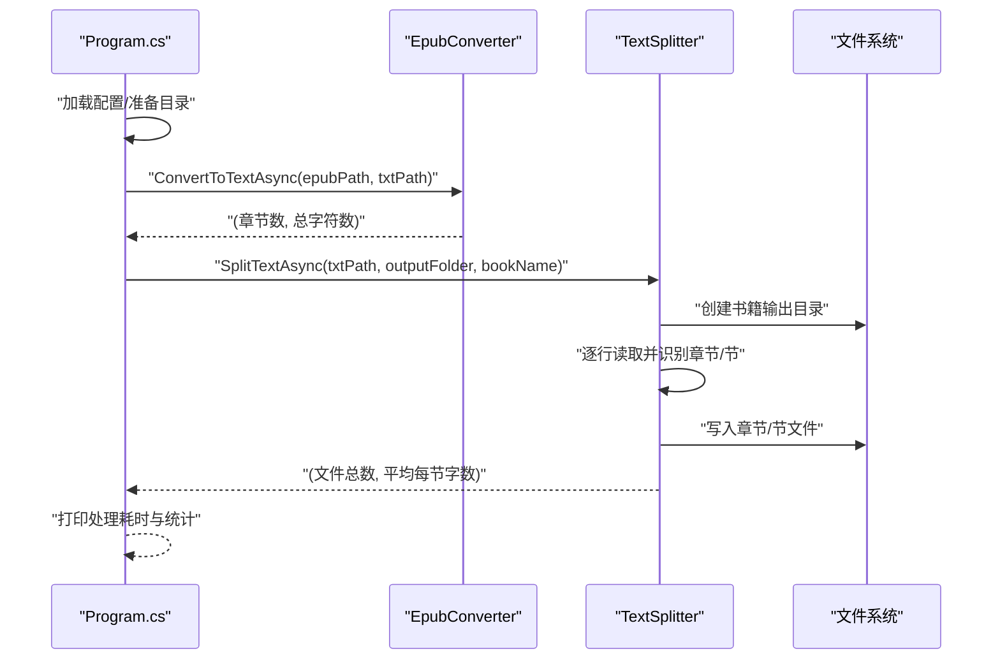
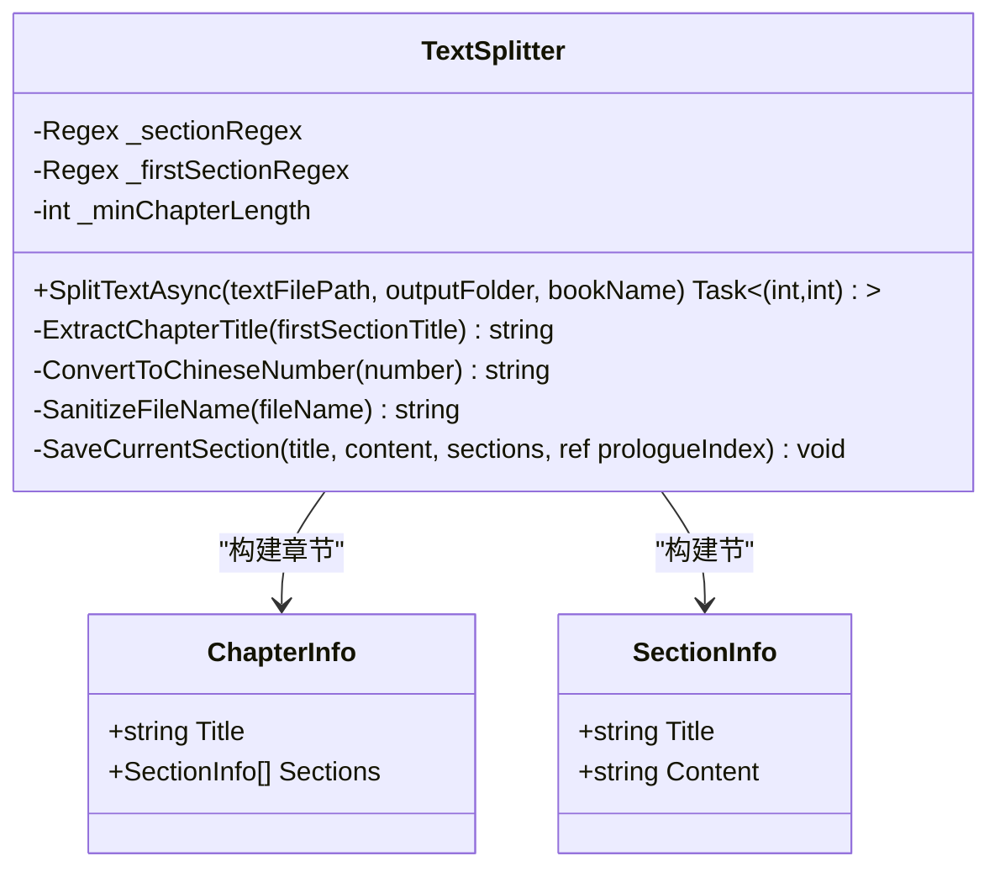
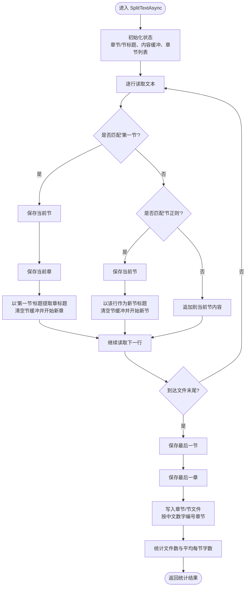
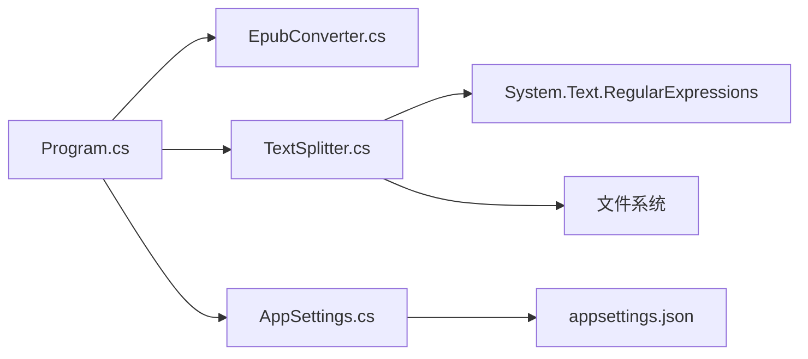

# 章节切分

<cite>
**本文引用的文件**
- [TextSplitter.cs](file://TextSplitter.cs)
- [Program.cs](file://Program.cs)
- [README.md](file://README.md)
- [AppSettings.cs](file://AppSettings.cs)
- [EpubConverter.cs](file://EpubConverter.cs)
- [appsettings.json](file://appsettings.json)
</cite>

## 目录
1. [简介](#简介)
2. [项目结构](#项目结构)
3. [核心组件](#核心组件)
4. [架构总览](#架构总览)
5. [详细组件分析](#详细组件分析)
6. [依赖分析](#依赖分析)
7. [性能考虑](#性能考虑)
8. [故障排查指南](#故障排查指南)
9. [结论](#结论)
10. [附录](#附录)

## 简介
本项目提供从 Epub 电子书到纯文本的转换，并按“章节”进行智能切分，最终输出为独立的 TXT 文件。其中，TextSplitter 类为核心，负责：
- 以“第一节”作为新章节的起始标志，识别并切分章节
- 流式逐行读取文本，边读边识别章节边界
- 构建章节与节的对象模型，写入目标目录
- 提供章节标题提取、中文数字转换、文件名清洗等辅助能力

在整体工作流中，EpubConverter 负责将 Epub 解析为纯文本，TextSplitter 在其之后对“全本”文本进行章节切分，形成最终的拆分输出。

## 项目结构
- Program.cs：应用入口，负责加载配置、准备目录、遍历 Epub 文件、串行调用转换与切分流程
- EpubConverter.cs：Epub 解析与文本清洗，输出 UTF-8 无 BOM 的全本文本
- TextSplitter.cs：章节识别与切分，生成章节与节的独立文件
- AppSettings.cs：配置模型，承载 Splitter 与 Paths 配置
- appsettings.json：运行时配置，定义章节/节匹配规则与路径
- README.md：功能说明、处理流程图、配置说明与注意事项

图表来源
- [Program.cs](file://Program.cs#L1-L135)
- [EpubConverter.cs](file://EpubConverter.cs#L1-L191)
- [TextSplitter.cs](file://TextSplitter.cs#L1-L292)
- [AppSettings.cs](file://AppSettings.cs#L1-L60)
- [appsettings.json](file://appsettings.json#L1-L13)

章节来源
- [Program.cs](file://Program.cs#L1-L135)
- [README.md](file://README.md#L131-L146)

## 核心组件
- TextSplitter：按“第一节”作为新章节起始标志，逐行扫描并切分章节；提供章节标题提取、中文数字转换、文件名清洗等工具方法
- EpubConverter：解析 Epub，清洗 HTML，输出全本文本
- AppSettings：配置模型，承载 Splitter 与 Paths
- Program：主流程编排，串联转换与切分

章节来源
- [TextSplitter.cs](file://TextSplitter.cs#L1-L292)
- [EpubConverter.cs](file://EpubConverter.cs#L1-L191)
- [AppSettings.cs](file://AppSettings.cs#L1-L60)
- [Program.cs](file://Program.cs#L1-L135)

## 架构总览
整体处理流程如下：
- 加载配置并确保目录存在
- 遍历 RawEpub 目录下的 Epub 文件
- 调用 EpubConverter 将 Epub 转为全本文本
- 调用 TextSplitter 按“第一节”切分章节
- 输出章节与节的独立文件

图表来源
- [Program.cs](file://Program.cs#L100-L133)
- [EpubConverter.cs](file://EpubConverter.cs#L14-L80)
- [TextSplitter.cs](file://TextSplitter.cs#L29-L171)

## 详细组件分析

### TextSplitter 类：按“第一节”切分章节
- 关键点
  - “第一节”作为新章节开始标志：当遇到“第一节”时，先保存当前节，再保存当前章，然后以“第一节”的标题冒号后的部分作为新章标题
  - 节标题识别：使用配置中的“节正则”匹配每一行，若匹配成功则保存当前节并开启新节
  - 对于“第一节”之外的普通行，追加到当前节内容
  - 最后统一保存最后一节与最后一章
  - 输出阶段：为每本书创建独立子目录，按中文数字编号生成章节文件夹，节文件名按全局序号命名

- 正则与匹配
  - 节正则：由构造函数注入，用于识别“节”标题
  - “第一节”正则：固定匹配“第一节”开头，支持中文冒号或英文冒号
  - 章标题提取：从“第一节”标题中提取冒号后的部分作为章标题
  - 最小章节长度：小于阈值的节会输出警告

- 对象模型
  - ChapterInfo：包含章节标题与节列表
  - SectionInfo：包含节标题与节内容

- 辅助功能
  - ExtractChapterTitle：从“第一节”标题提取章标题
  - ConvertToChineseNumber：将阿拉伯数字转换为中文数字（支持 1~999）
  - SanitizeFileName：清洗文件名，移除非法字符并限制长度
  - SaveCurrentSection：保存当前节（含前言计数）

图表来源
- [TextSplitter.cs](file://TextSplitter.cs#L1-L292)

章节来源
- [TextSplitter.cs](file://TextSplitter.cs#L1-L292)
- [appsettings.json](file://appsettings.json#L1-L13)

#### SplitTextAsync 工作流（逐行流式切分）

图表来源
- [TextSplitter.cs](file://TextSplitter.cs#L29-L171)

章节来源
- [TextSplitter.cs](file://TextSplitter.cs#L29-L171)

#### “第一节”作为新章节开始标志的机制
- 匹配策略
  - 使用固定正则匹配“第一节”，支持中文冒号或英文冒号
  - 当匹配到“第一节”时，立即触发保存当前节与当前章，并以该行冒号后的部分作为新章标题
- 章标题提取
  - 从“第一节”标题中查找中文冒号或英文冒号，取冒号后的部分作为章标题
- 节标题与内容
  - 每次遇到“节正则”匹配时，保存当前节并开启新节
  - 普通行追加到当前节内容

章节来源
- [TextSplitter.cs](file://TextSplitter.cs#L18-L24)
- [TextSplitter.cs](file://TextSplitter.cs#L51-L114)
- [TextSplitter.cs](file://TextSplitter.cs#L173-L185)

#### 关键辅助功能示例（代码片段路径）
- 章节标题提取
  - 示例路径：[ExtractChapterTitle](file://TextSplitter.cs#L173-L185)
- 中文数字转换
  - 示例路径：[ConvertToChineseNumber](file://TextSplitter.cs#L187-L219)
- 文件名清洗
  - 示例路径：[SanitizeFileName](file://TextSplitter.cs#L236-L272)

章节来源
- [TextSplitter.cs](file://TextSplitter.cs#L173-L272)

### EpubConverter：全本文本生成
- 主要职责
  - 使用 EpubReader 读取 Epub，优先使用 ReadingOrder，否则回退到 Content.Html
  - 清洗 HTML，提取纯文本，规范化换行与空白
  - 输出 UTF-8 无 BOM 的全本文本文件
- 统计信息
  - 返回章节数与总字符数，供后续流程参考

章节来源
- [EpubConverter.cs](file://EpubConverter.cs#L14-L80)

### Program：工作流编排
- 主要步骤
  - 加载配置并转换相对路径为绝对路径
  - 确保 RawEpub、IntermediateTxt、SplitOutput 目录存在
  - 遍历 Epub 文件，依次执行转换与切分
  - 打印处理耗时与统计信息

章节来源
- [Program.cs](file://Program.cs#L1-L135)
- [README.md](file://README.md#L131-L146)

## 依赖分析
- 组件耦合
  - Program 依赖 EpubConverter 与 TextSplitter
  - TextSplitter 依赖 Regex 与文件系统
  - AppSettings 为配置载体，被 Program 读取
- 外部依赖
  - Epub 解析与 HTML 清洗依赖第三方库
- 配置依赖
  - 章节/节正则与最小章节长度来自 appsettings.json

图表来源
- [Program.cs](file://Program.cs#L1-L135)
- [TextSplitter.cs](file://TextSplitter.cs#L1-L292)
- [AppSettings.cs](file://AppSettings.cs#L1-L60)
- [appsettings.json](file://appsettings.json#L1-L13)

章节来源
- [Program.cs](file://Program.cs#L1-L135)
- [TextSplitter.cs](file://TextSplitter.cs#L1-L292)
- [AppSettings.cs](file://AppSettings.cs#L1-L60)
- [appsettings.json](file://appsettings.json#L1-L13)

## 性能考虑
- 流式处理：使用 StreamReader 逐行读取，避免一次性加载全文到内存
- 正则优化：预编译正则表达式并设置超时，降低回溯风险
- 编码优化：输出 UTF-8 无 BOM，减少文件体积
- 目录结构：每本书单独子目录，避免文件名冲突与目录混乱

章节来源
- [README.md](file://README.md#L158-L163)
- [TextSplitter.cs](file://TextSplitter.cs#L18-L24)

## 故障排查指南
- 未检测到任何章节
  - 现象：输出警告提示未检测到任何章节
  - 可能原因：输入文本未包含“第一节”或“节正则”未正确匹配
  - 建议：检查 appsettings.json 中的“节正则”与“最小章节长度”
- 节文件过小
  - 现象：输出警告提示节文件过小
  - 可能原因：节标题未正确识别或内容不足
  - 建议：调整“节正则”或确认原文格式
- 文件名非法或过长
  - 现象：文件名被清洗或截断
  - 建议：检查标题中是否包含非法字符，必要时手动清理
- Epub 目录为空
  - 现象：未找到任何 .epub 文件
  - 建议：将 Epub 文件放入 RawEpub 目录并重新运行

章节来源
- [TextSplitter.cs](file://TextSplitter.cs#L116-L120)
- [TextSplitter.cs](file://TextSplitter.cs#L152-L155)
- [TextSplitter.cs](file://TextSplitter.cs#L236-L272)
- [Program.cs](file://Program.cs#L19-L26)

## 结论
TextSplitter 通过“第一节”作为新章节起始标志，结合“节正则”实现稳健的章节切分；配合流式读取与 UTF-8 无 BOM 输出，兼顾性能与兼容性。在整体工作流中，EpubConverter 负责高质量的全本文本生成，TextSplitter 则完成最终的章节化输出，形成清晰、可扩展的处理链路。

## 附录

### 配置说明（摘自 README 与 appsettings.json）
- Splitter
  - ChapterRegex：章节标题匹配正则（未在切分中直接使用，保留兼容）
  - SectionRegex：节标题匹配正则（用于识别“节”标题）
  - MinChapterLength：最小章节长度（字符数），低于阈值会警告
- Paths
  - RawEpubFolder：原始 Epub 文件存放目录
  - IntermediateTxtFolder：全本文本中间文件目录
  - SplitOutputFolder：章节切分输出目录

章节来源
- [README.md](file://README.md#L88-L116)
- [appsettings.json](file://appsettings.json#L1-L13)