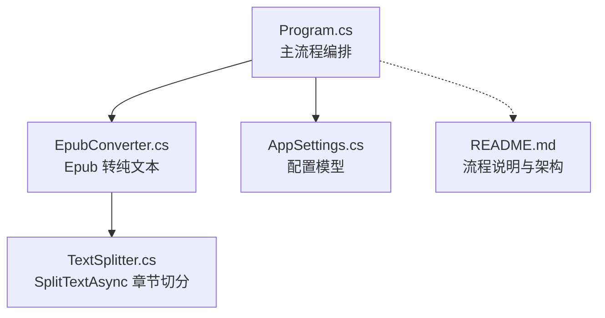
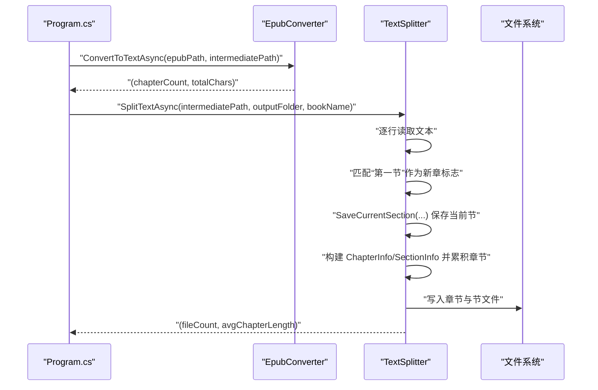
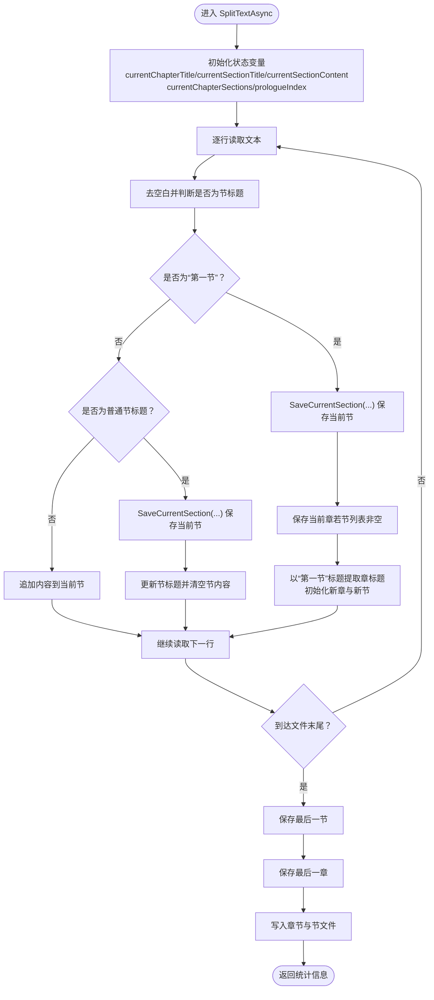
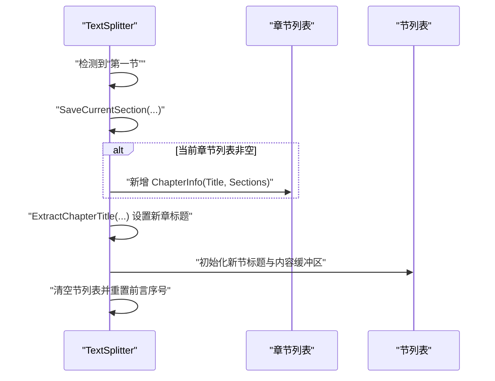
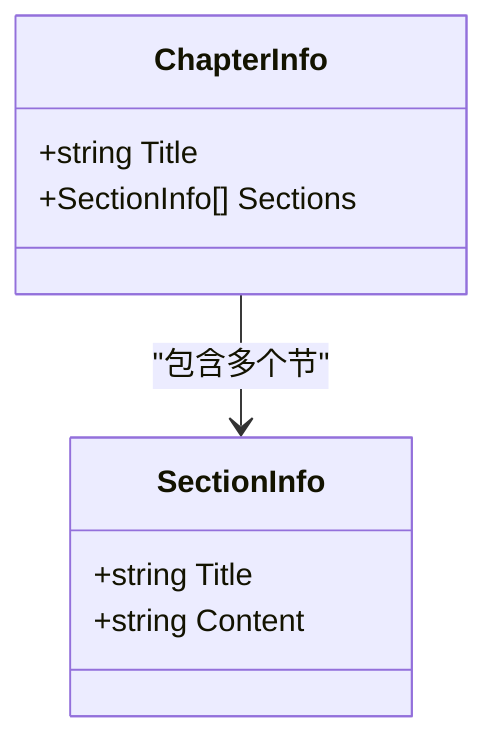
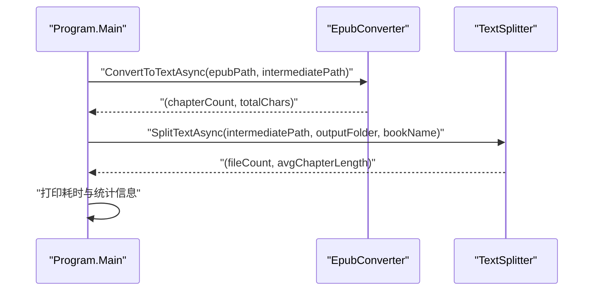
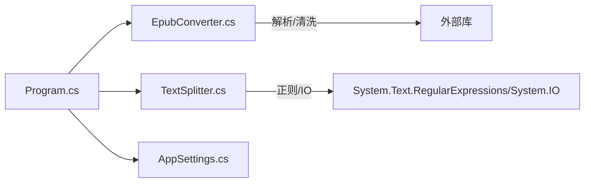

# 章节结构构建

<cite>
**本文引用的文件**
- [Program.cs](file://Program.cs)
- [EpubConverter.cs](file://EpubConverter.cs)
- [TextSplitter.cs](file://TextSplitter.cs)
- [AppSettings.cs](file://AppSettings.cs)
- [README.md](file://README.md)
</cite>

## 目录
1. [简介](#简介)
2. [项目结构](#项目结构)
3. [核心组件](#核心组件)
4. [架构总览](#架构总览)
5. [详细组件分析](#详细组件分析)
6. [依赖分析](#依赖分析)
7. [性能考虑](#性能考虑)
8. [故障排查指南](#故障排查指南)
9. [结论](#结论)

## 简介
本文件聚焦于 SplitTextAsync 方法中“章节对象模型”的构建流程，解释 ChapterInfo 与 SectionInfo 如何组织章节数据结构；阐述在遇到“第一节”时如何触发当前章节的保存与新章节的初始化；说明 currentChapterTitle、currentSectionTitle、currentSectionContent 等状态变量的管理机制，以及 SaveCurrentSection 如何将累积内容写入当前节；最后结合 Program.cs 的调用上下文，阐明该过程在整个 Epub 转换流程中的位置与数据流转关系。

## 项目结构
- 程序入口与流程编排：Program.cs
- Epub 解析与纯文本生成：EpubConverter.cs
- 文本切分与章节落盘：TextSplitter.cs
- 配置模型：AppSettings.cs
- 项目说明与流程图：README.md

图表来源
- [Program.cs](file://Program.cs#L100-L133)
- [EpubConverter.cs](file://EpubConverter.cs#L14-L80)
- [TextSplitter.cs](file://TextSplitter.cs#L29-L171)
- [AppSettings.cs](file://AppSettings.cs#L1-L60)
- [README.md](file://README.md#L131-L145)

章节来源
- [Program.cs](file://Program.cs#L100-L133)
- [README.md](file://README.md#L131-L145)

## 核心组件
- EpubConverter：负责将 Epub 解析为纯文本，并输出到中间文件，供后续切分使用。
- TextSplitter：负责按“第一节”作为新章标志进行章节切分，构建 ChapterInfo/SectionInfo 对象模型，最终落盘为独立 TXT 文件。
- AppSettings：提供 Splitter 正则与最小章节长度等配置，影响 TextSplitter 的行为。

章节来源
- [EpubConverter.cs](file://EpubConverter.cs#L14-L80)
- [TextSplitter.cs](file://TextSplitter.cs#L29-L171)
- [AppSettings.cs](file://AppSettings.cs#L1-L60)

## 架构总览
下图展示了从 Epub 到章节切分的整体流程，重点标注了 SplitTextAsync 的章节对象模型构建与落盘阶段。

图表来源
- [Program.cs](file://Program.cs#L115-L123)
- [EpubConverter.cs](file://EpubConverter.cs#L14-L80)
- [TextSplitter.cs](file://TextSplitter.cs#L29-L171)

## 详细组件分析

### SplitTextAsync 的章节对象模型构建
- 数据模型
  - ChapterInfo：包含章节标题与该章节下的 SectionInfo 列表。
  - SectionInfo：包含节标题与节内容字符串。
- 状态变量
  - currentChapterTitle：当前章标题（由“第一节”标题冒号后的部分提取）。
  - currentSectionTitle：当前节标题（用于保存节时的标题）。
  - currentSectionContent：当前节内容（StringBuilder 累积）。
  - currentChapterSections：当前章内的节集合。
  - prologueIndex：前言/楔子等无标题节的序号计数。
- 关键逻辑
  - 遇到“第一节”：
    - 先保存当前节（SaveCurrentSection），再保存当前章（若存在节）。
    - 以“第一节”标题冒号后的内容作为新章标题，初始化新节。
  - 遇到普通节标题：
    - 先保存当前节，再开启新节。
  - 普通内容行：
    - 追加到 currentSectionContent。
  - 文件末尾：
    - 保存最后一节与最后一章。

图表来源
- [TextSplitter.cs](file://TextSplitter.cs#L44-L114)
- [TextSplitter.cs](file://TextSplitter.cs#L221-L234)

章节来源
- [TextSplitter.cs](file://TextSplitter.cs#L29-L171)
- [TextSplitter.cs](file://TextSplitter.cs#L221-L234)

### SaveCurrentSection 的作用与实现要点
- 作用：将当前节的标题与内容写入当前章的节列表。
- 标题生成策略：
  - 若无标题（前言/楔子等），使用“前言”加上序号（prologueIndex）。
  - 若有标题，则使用传入的标题。
- 内容写入策略：
  - 将 StringBuilder 转换为字符串后写入 SectionInfo。
- 与“第一节”触发的关系：
  - 在遇到“第一节”之前，SaveCurrentSection 用于保存上一节。
  - 在遇到“第一节”之后，SaveCurrentSection 用于保存上一节，然后开启新章与新节。

章节来源
- [TextSplitter.cs](file://TextSplitter.cs#L221-L234)

### “第一节”触发的新章初始化与保存流程
- 触发条件：匹配到“第一节”标题（支持中文冒号与英文冒号）。
- 行为序列：
  1) 保存当前节（SaveCurrentSection）
  2) 若当前章已有节，则保存当前章（构建 ChapterInfo 并加入章节列表）
  3) 以“第一节”标题冒号后的内容作为新章标题
  4) 初始化新节标题与内容缓冲区
  5) 清空当前章节列表并重置前言序号

图表来源
- [TextSplitter.cs](file://TextSplitter.cs#L61-L84)
- [TextSplitter.cs](file://TextSplitter.cs#L173-L185)
- [TextSplitter.cs](file://TextSplitter.cs#L221-L234)

章节来源
- [TextSplitter.cs](file://TextSplitter.cs#L61-L84)
- [TextSplitter.cs](file://TextSplitter.cs#L173-L185)

### 章节对象模型类图

图表来源
- [TextSplitter.cs](file://TextSplitter.cs#L275-L292)

章节来源
- [TextSplitter.cs](file://TextSplitter.cs#L275-L292)

### 在 Program.cs 中的调用上下文与数据流
- 主流程步骤
  1) 加载配置（AppSettings）
  2) 确保目录存在
  3) 遍历 Epub 文件并处理
  4) 阶段 1：Epub 转纯文本（EpubConverter）
  5) 阶段 2：文本切分（TextSplitter.SplitTextAsync）
- 数据流向
  - 输入：原始 Epub 文件
  - 中间产物：全本文本（中间文件）
  - 输出：按章节与节划分的独立 TXT 文件
- 统计与日志
  - SplitTextAsync 返回文件数量与平均每节字符数，Program.cs 打印处理耗时与统计信息

图表来源
- [Program.cs](file://Program.cs#L115-L127)
- [EpubConverter.cs](file://EpubConverter.cs#L14-L80)
- [TextSplitter.cs](file://TextSplitter.cs#L29-L171)

章节来源
- [Program.cs](file://Program.cs#L115-L127)

## 依赖分析
- 组件耦合
  - Program.cs 仅通过方法调用与参数传递与 EpubConverter、TextSplitter 交互，耦合度低。
  - TextSplitter 内部依赖正则表达式与文件系统，但对上层透明。
- 配置依赖
  - AppSettings 提供 Splitter 正则与最小章节长度，直接影响 TextSplitter 的行为。
- 外部库
  - Epub 解析与 HTML 清洗分别依赖第三方库，但封装在 EpubConverter 内部。

图表来源
- [Program.cs](file://Program.cs#L100-L133)
- [EpubConverter.cs](file://EpubConverter.cs#L14-L80)
- [TextSplitter.cs](file://TextSplitter.cs#L29-L171)
- [AppSettings.cs](file://AppSettings.cs#L1-L60)

章节来源
- [Program.cs](file://Program.cs#L100-L133)
- [EpubConverter.cs](file://EpubConverter.cs#L14-L80)
- [TextSplitter.cs](file://TextSplitter.cs#L29-L171)
- [AppSettings.cs](file://AppSettings.cs#L1-L60)

## 性能考虑
- 流式处理：使用 StreamReader 逐行读取，避免一次性加载全文到内存。
- 正则优化：预编译正则表达式并设置超时，降低回溯风险。
- 编码选择：UTF-8 无 BOM 输出，减少文件体积与兼容性问题。
- 最小长度过滤：对过短节输出警告，便于后续人工校验。

章节来源
- [README.md](file://README.md#L158-L172)
- [TextSplitter.cs](file://TextSplitter.cs#L18-L24)
- [TextSplitter.cs](file://TextSplitter.cs#L152-L155)

## 故障排查指南
- 未检测到任何章节
  - 现象：SplitTextAsync 返回 0 章节。
  - 可能原因：输入文本未包含“第一节”或节标题未满足正则。
  - 建议：检查 appsettings.json 中的正则配置，确认输入文本格式。
- 节文件过小
  - 现象：输出日志出现“节文件过小”警告。
  - 可能原因：最小长度阈值设置过高或节标题识别异常。
  - 建议：调整 Splitter.MinChapterLength 或修正节标题格式。
- 文件名非法或过长
  - 现象：文件名被清洗或截断。
  - 建议：检查节标题与章标题，避免使用非法字符；必要时缩短标题。

章节来源
- [TextSplitter.cs](file://TextSplitter.cs#L116-L120)
- [TextSplitter.cs](file://TextSplitter.cs#L152-L155)
- [TextSplitter.cs](file://TextSplitter.cs#L236-L272)

## 结论
SplitTextAsync 通过“第一节”作为新章标志，采用状态机式的逐行扫描方式，构建出清晰的 ChapterInfo/SectionInfo 对象模型，并在文件末尾统一落盘。配合 Program.cs 的两阶段流程（Epub 转纯文本 + 文本切分），实现了从 Epub 到独立章节文件的完整转换链路。该设计具备良好的扩展性与可维护性，可通过配置灵活适配不同文本格式。