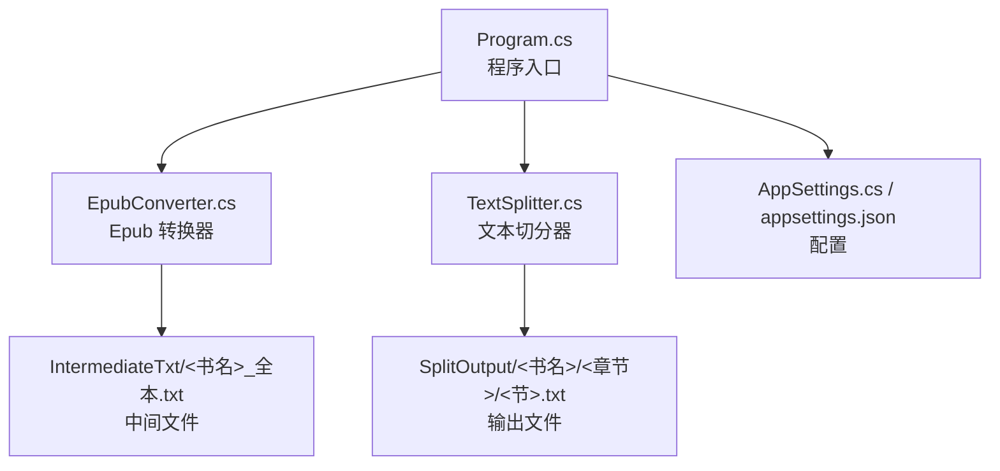
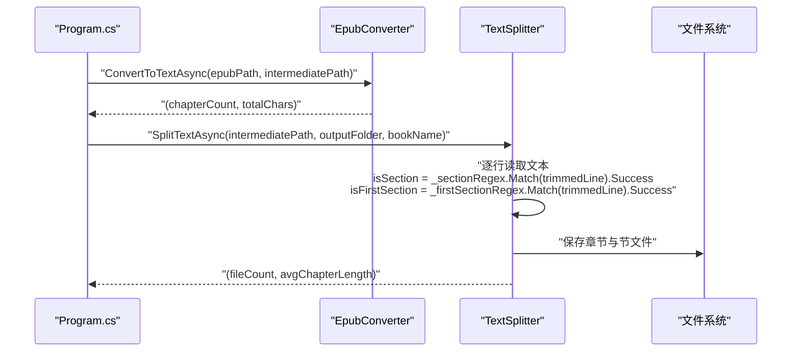
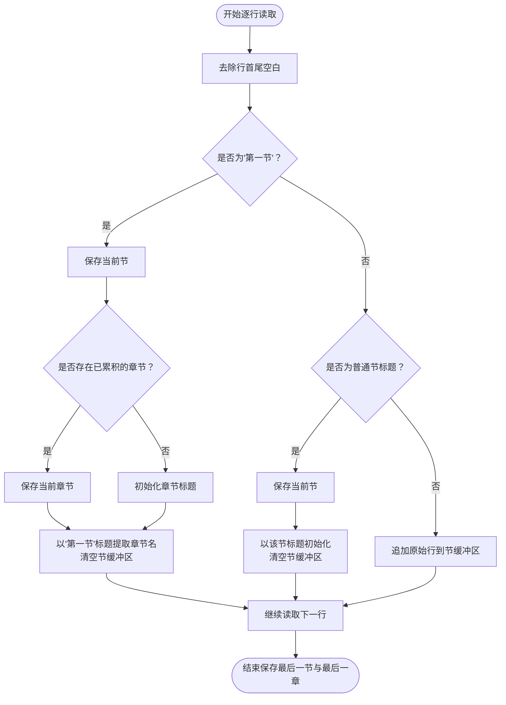
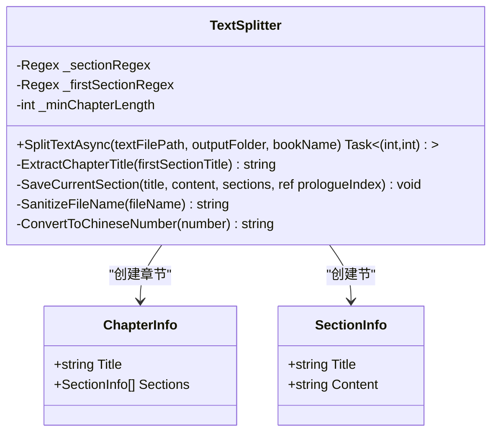
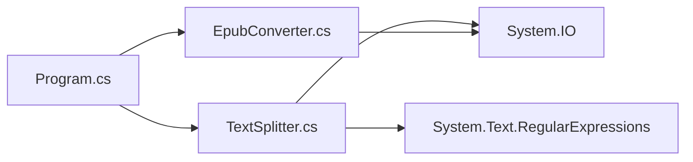

# 章节边界检测

<cite>
**本文引用的文件**
- [TextSplitter.cs](file://TextSplitter.cs)
- [Program.cs](file://Program.cs)
- [EpubConverter.cs](file://EpubConverter.cs)
- [AppSettings.cs](file://AppSettings.cs)
- [README.md](file://README.md)
- [appsettings.json](file://appsettings.json)
</cite>

## 目录
1. [简介](#简介)
2. [项目结构](#项目结构)
3. [核心组件](#核心组件)
4. [架构总览](#架构总览)
5. [详细组件分析](#详细组件分析)
6. [依赖分析](#依赖分析)
7. [性能考虑](#性能考虑)
8. [故障排查指南](#故障排查指南)
9. [结论](#结论)

## 简介
本文件聚焦于 TextSplitter 类中“章节边界检测”的实现细节，特别是如何利用正则表达式 _firstSectionRegex（正则表达式 ^第一节[：:]）与 _sectionRegex 来识别“新章节”和“普通节”的边界。我们将深入解释 SplitTextAsync 方法在逐行读取文本时，如何通过 isSection 与 isFirstSection 两个布尔变量的判定逻辑，驱动章节结构的构建；同时说明正则表达式的编译选项（RegexOptions.Compiled）与超时设置（TimeSpan.FromSeconds(1)）对性能与稳定性的影响。

## 项目结构
- 程序入口 Program.cs 负责加载配置、初始化 EpubConverter 与 TextSplitter，并串行处理每个 Epub 文件。
- EpubConverter 负责将 Epub 解析为纯文本并写入中间文件。
- TextSplitter 负责从中间文本中识别章节与节的边界，按“第一节”作为新章节起点进行切分，并输出独立的 TXT 文件。
- AppSettings 与 appsettings.json 提供配置项（章节/节正则、最小章节长度、路径等）。

图表来源
- [Program.cs](file://Program.cs#L1-L135)
- [EpubConverter.cs](file://EpubConverter.cs#L1-L191)
- [TextSplitter.cs](file://TextSplitter.cs#L1-L292)
- [AppSettings.cs](file://AppSettings.cs#L1-L60)
- [appsettings.json](file://appsettings.json#L1-L13)

章节来源
- [Program.cs](file://Program.cs#L1-L135)
- [EpubConverter.cs](file://EpubConverter.cs#L1-L191)
- [TextSplitter.cs](file://TextSplitter.cs#L1-L292)
- [AppSettings.cs](file://AppSettings.cs#L1-L60)
- [README.md](file://README.md#L131-L146)

## 核心组件
- TextSplitter：负责按“第一节”作为新章节起点进行切分，使用 _firstSectionRegex 与 _sectionRegex 识别章节与节标题，维护当前章节标题、当前节标题与节内容缓冲区，最终输出独立的 TXT 文件。
- EpubConverter：负责将 Epub 解析为纯文本，写入中间文件，供 TextSplitter 后续处理。
- AppSettings 与 appsettings.json：提供章节/节正则表达式、最小章节长度、输入输出路径等配置。

章节来源
- [TextSplitter.cs](file://TextSplitter.cs#L1-L292)
- [EpubConverter.cs](file://EpubConverter.cs#L1-L191)
- [AppSettings.cs](file://AppSettings.cs#L1-L60)
- [appsettings.json](file://appsettings.json#L1-L13)

## 架构总览
下面的序列图展示了从 Epub 到章节切分的整体流程，重点标注了 TextSplitter 的章节边界检测环节。

图表来源
- [Program.cs](file://Program.cs#L100-L133)
- [EpubConverter.cs](file://EpubConverter.cs#L14-L80)
- [TextSplitter.cs](file://TextSplitter.cs#L29-L171)

## 详细组件分析

### 正则表达式与边界识别
- _firstSectionRegex（“第一节”识别）
  - 作用：当某一行匹配“第一节”开头（支持中文冒号或英文冒号）时，触发“新章节”的创建。
  - 匹配模式：^第一节[：:]
  - 编译选项：Compiled，提升后续匹配性能。
  - 关键位置：构造函数中初始化，并在 SplitTextAsync 的逐行逻辑中用于 isFirstSection 判定。

- _sectionRegex（“普通节”识别）
  - 作用：当某一行匹配“节”标题格式时，触发“新节”的创建。
  - 匹配模式：来自配置的 SectionRegex（例如“第X节”或“内容简介”等）。
  - 编译选项：Compiled，Multiline，超时 1 秒，避免复杂回溯导致的性能问题。
  - 关键位置：构造函数中初始化，并在 SplitTextAsync 的逐行逻辑中用于 isSection 判定。

- SplitTextAsync 的逐行判定流程
  - 逐行读取文本，先判定 isFirstSection，再判定 isSection，最后作为普通内容追加到当前节。
  - 当检测到 isFirstSection：
    - 保存当前节；
    - 若已有章节内容，保存当前章节；
    - 以“第一节”标题冒号后的部分作为新章节标题；
    - 初始化当前节标题与内容缓冲区。
  - 当检测到 isSection：
    - 保存当前节；
    - 以该节标题作为新节标题；
    - 初始化当前节内容缓冲区。
  - 其他情况：将原始行加入当前节内容缓冲区。

- 章节标题提取
  - ExtractChapterTitle：从“第一节”标题中提取冒号后的章节名称，若无冒号则返回原标题。

- 输出策略
  - 每本书创建独立子目录；
  - 章文件夹命名：两位序号+中文数字+章节标题；
  - 节文件命名：三位序号+节标题+.txt；
  - 超过最小长度阈值才输出，否则发出警告。

章节来源
- [TextSplitter.cs](file://TextSplitter.cs#L18-L24)
- [TextSplitter.cs](file://TextSplitter.cs#L55-L100)
- [TextSplitter.cs](file://TextSplitter.cs#L173-L185)
- [TextSplitter.cs](file://TextSplitter.cs#L122-L171)
- [appsettings.json](file://appsettings.json#L1-L13)

### 判定逻辑流程图
下图展示了逐行读取时，isFirstSection 与 isSection 的判定与分支逻辑。

图表来源
- [TextSplitter.cs](file://TextSplitter.cs#L55-L100)
- [TextSplitter.cs](file://TextSplitter.cs#L173-L185)

### 类关系图

图表来源
- [TextSplitter.cs](file://TextSplitter.cs#L1-L292)

## 依赖分析
- 组件耦合
  - Program.cs 依赖 EpubConverter 与 TextSplitter，负责编排流程与配置加载。
  - TextSplitter 依赖配置（appsettings.json）提供的 SectionRegex 与 MinChapterLength。
  - EpubConverter 与 TextSplitter 之间通过中间文本文件解耦。

- 外部依赖
  - 正则表达式：System.Text.RegularExpressions（Compiled、Multiline、超时）
  - 文件系统：System.IO（流式读写）

图表来源
- [Program.cs](file://Program.cs#L1-L135)
- [TextSplitter.cs](file://TextSplitter.cs#L1-L292)
- [EpubConverter.cs](file://EpubConverter.cs#L1-L191)

章节来源
- [Program.cs](file://Program.cs#L1-L135)
- [TextSplitter.cs](file://TextSplitter.cs#L1-L292)
- [EpubConverter.cs](file://EpubConverter.cs#L1-L191)

## 性能考虑
- 正则表达式编译
  - _sectionRegex 使用 Compiled 与 Multiline，并设置 1 秒超时，降低匹配开销并避免回溯陷阱导致的长时间阻塞。
  - _firstSectionRegex 使用 Compiled，保证高频匹配的性能。
- 流式处理
  - 使用 StreamReader 逐行读取，避免一次性将大文本加载至内存，降低内存峰值。
- 输出策略
  - UTF-8 无 BOM 编码，减少文件体积与兼容性问题。
  - 节文件过小会发出警告，便于用户调整正则或内容组织方式。

章节来源
- [TextSplitter.cs](file://TextSplitter.cs#L18-L24)
- [README.md](file://README.md#L157-L173)

## 故障排查指南
- 未检测到任何章节
  - 现象：SplitTextAsync 返回 0 章节。
  - 可能原因：SectionRegex 或 _firstSectionRegex 未覆盖实际标题格式；文本中不存在“第一节”或“节”标题。
  - 建议：检查 appsettings.json 中 SectionRegex 是否与目标文本一致；确认文本是否包含“第一节”或“节”标题行。
- 节文件过小
  - 现象：输出日志提示“节文件过小”。
  - 可能原因：节标题识别不准确，导致内容被错误地归入前言或节标题行。
  - 建议：调整 SectionRegex，使其更精确地匹配“节”标题；检查文本中是否存在“内容简介”等非正文标题行。
- 正则超时或性能异常
  - 现象：匹配耗时较长或超时。
  - 可能原因：正则过于复杂或回溯过多。
  - 建议：简化 SectionRegex；确保使用 Compiled 与合理超时；避免在标题中包含大量可选分支。
- 文件名非法或过长
  - 现象：输出文件名被清洗或截断。
  - 建议：检查标题中是否包含非法字符；适当缩短标题长度。

章节来源
- [TextSplitter.cs](file://TextSplitter.cs#L116-L121)
- [TextSplitter.cs](file://TextSplitter.cs#L152-L155)
- [TextSplitter.cs](file://TextSplitter.cs#L236-L272)
- [README.md](file://README.md#L166-L173)

## 结论
TextSplitter 通过 _firstSectionRegex 与 _sectionRegex 的协同工作，实现了对“新章节”和“普通节”的精准识别。其核心在于：
- 以“第一节”作为新章节起点，确保章节划分符合预期；
- 以“节”标题作为新节起点，保证节内内容完整；
- 使用 Compiled 与超时设置提升性能与稳定性；
- 采用流式处理与 UTF-8 无 BOM 输出，兼顾性能与兼容性。

通过合理配置 SectionRegex 与最小章节长度，用户可以针对不同文本格式获得稳定的章节切分效果。