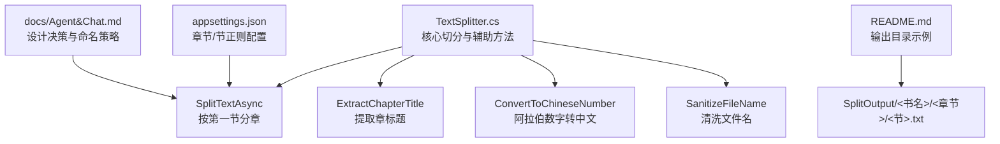
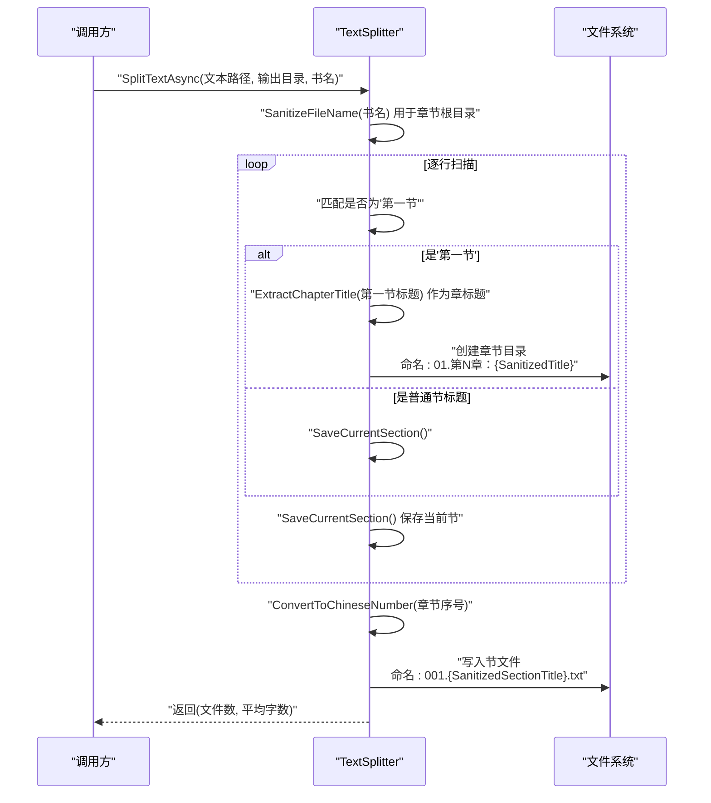
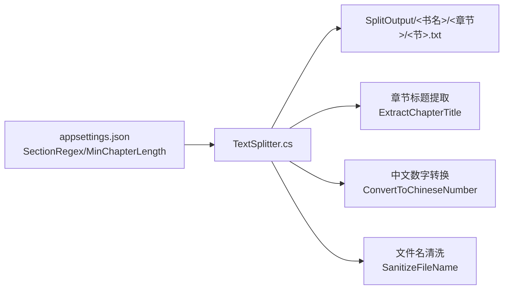

# 辅助功能实现

<cite>
**本文引用的文件**
- [TextSplitter.cs](file://TextSplitter.cs)
- [README.md](file://README.md)
- [docs/Agent&Chat.md](file://docs/Agent&Chat.md)
- [appsettings.json](file://appsettings.json)
</cite>

## 目录
1. [简介](#简介)
2. [项目结构](#项目结构)
3. [核心组件](#核心组件)
4. [架构总览](#架构总览)
5. [详细组件分析](#详细组件分析)
6. [依赖分析](#依赖分析)
7. [性能考虑](#性能考虑)
8. [故障排查指南](#故障排查指南)
9. [结论](#结论)
10. [附录](#附录)

## 简介
本篇文档聚焦于 TextSplitter 类中的三个关键辅助方法：ExtractChapterTitle、ConvertToChineseNumber、SanitizeFileName。它们分别承担“从‘第一节’标题中提取章标题”、“将阿拉伯数字转换为中文数字”、“清洗文件名以保证文件系统兼容”的职责，并在章节切分与文件命名过程中发挥重要作用。本文将结合源码与实际输出目录，给出输入输出示例及在生成目录和文件名时的应用说明。

## 项目结构
- TextSplitter.cs 提供按“第一节”分章的核心逻辑与上述三个辅助方法。
- README.md 展示了典型输出目录结构，体现章节与节的两级目录组织方式。
- docs/Agent&Chat.md 记录了“按第一节分章”的设计决策与命名策略演进。
- appsettings.json 提供章节与节的正则配置，影响 TextSplitter 的匹配行为。

图表来源
- [TextSplitter.cs](file://TextSplitter.cs#L1-L171)
- [README.md](file://README.md#L67-L84)
- [docs/Agent&Chat.md](file://docs/Agent&Chat.md#L154-L200)
- [appsettings.json](file://appsettings.json#L1-L6)

章节来源
- [TextSplitter.cs](file://TextSplitter.cs#L1-L171)
- [README.md](file://README.md#L67-L84)
- [docs/Agent&Chat.md](file://docs/Agent&Chat.md#L154-L200)
- [appsettings.json](file://appsettings.json#L1-L6)

## 核心组件
- ExtractChapterTitle：从“第一节：标题”格式中提取冒号后的章标题。
- ConvertToChineseNumber：将阿拉伯数字转换为中文数字（支持个、十、百、千位）。
- SanitizeFileName：清洗文件名，移除非法字符并限制长度，确保文件系统兼容。

章节来源
- [TextSplitter.cs](file://TextSplitter.cs#L173-L272)

## 架构总览
TextSplitter 在 SplitTextAsync 中调用上述三个辅助方法，形成“按第一节分章 → 生成章节目录 → 生成节文件”的完整流程。

图表来源
- [TextSplitter.cs](file://TextSplitter.cs#L26-L171)

## 详细组件分析

### ExtractChapterTitle：从“第一节：标题”提取章标题
- 功能概述
  - 从形如“第一节：标题”或“第一节:标题”的行中提取冒号后的部分作为章标题。
  - 若找不到冒号或冒号位于末尾，则直接返回原行。
- 输入输出示例
  - 输入：“第一节：纵身亡魔心仍不悔”
  - 输出：“纵身亡魔心仍不悔”
  - 输入：“第一节:逆光阴五百年觉悟”
  - 输出：“逆光阴五百年觉悟”
  - 输入：“第一节”
  - 输出：“第一节”
- 实际应用
  - 在 SplitTextAsync 遇到“第一节”时，先保存当前节，再用 ExtractChapterTitle 获取章标题，作为章节标题使用。
- 复杂度与健壮性
  - 时间复杂度 O(L)，L 为行长度；空间复杂度 O(L)。
  - 对冒号位置进行边界判断，避免越界。
- 与配置的关系
  - 该方法不依赖外部配置，但其结果会被后续命名使用，最终体现在章节目录名称中。

章节来源
- [TextSplitter.cs](file://TextSplitter.cs#L173-L185)
- [docs/Agent&Chat.md](file://docs/Agent&Chat.md#L177-L190)

### ConvertToChineseNumber：阿拉伯数字转中文数字
- 功能概述
  - 将阿拉伯数字转换为中文数字字符串，支持个、十、百、千位。
  - 对 0 的处理返回“零”。
  - 当数字超过 1000 或小于等于 0 时，按规则返回对应中文或原数字字符串。
- 输入输出示例
  - 输入：1 → 输出：“一”
  - 输入：10 → 输出：“十”
  - 输入：11 → 输出：“十一”
  - 输入：20 → 输出：“二十”
  - 输入：101 → 输出：“一百零一”
  - 输入：1001 → 输出：“1001”（超过千位返回原数字字符串）
  - 输入：0 → 输出：“零”
- 实际应用
  - 在章节目录命名中，将章节序号转换为中文数字，例如“第1章”显示为“第一章”，提升中文阅读体验。
- 复杂度与健壮性
  - 时间复杂度 O(log10(N))；空间复杂度 O(log10(N))。
  - 递归与条件分支覆盖常见中文数字组合，逻辑清晰。
- 与配置的关系
  - 该方法不依赖外部配置，但其结果直接影响章节目录名称的“第N章：标题”。

章节来源
- [TextSplitter.cs](file://TextSplitter.cs#L187-L219)
- [README.md](file://README.md#L118-L127)

### SanitizeFileName：清洗文件名，移除非法字符并限制长度
- 功能概述
  - 移除文件系统非法字符，替换为下划线。
  - 限制文件名长度不超过 50 个字符。
  - 若清洗后为空或仅空白，返回“未命名”。
- 输入输出示例
  - 输入：“包含<非法>字符:测试.txt”
  - 输出：“包含_非法_字符_测试.txt”
  - 输入：“文件名过长的文件名过长的文件名过长的文件名过长的文件名.txt”
  - 输出：“文件名过长的文件名过长的文件名过长的文件名过长的文件”
  - 输入：空字符串
  - 输出：“未命名”
- 实际应用
  - 用于书名、章节标题、节标题的文件系统安全化处理，确保章节目录与节文件名在不同操作系统上均可创建。
- 复杂度与健壮性
  - 时间复杂度 O(L)；空间复杂度 O(L)。
  - 显式处理多种非法字符与路径分隔符，避免跨平台兼容问题。
- 与配置的关系
  - 该方法不依赖外部配置，但其结果直接影响章节目录与节文件名。

章节来源
- [TextSplitter.cs](file://TextSplitter.cs#L236-L272)
- [README.md](file://README.md#L166-L172)

## 依赖分析
- TextSplitter 依赖
  - 正则表达式：用于识别“第一节”与普通节标题。
  - 文件系统：创建目录与写入文件。
  - 编码：UTF-8 无 BOM 写出。
- 配置依赖
  - appsettings.json 提供“节标题正则”与“最小章节长度”，影响 SplitTextAsync 的匹配与告警。
- 输出依赖
  - README.md 展示的输出目录结构，体现章节与节的两级组织方式。

图表来源
- [appsettings.json](file://appsettings.json#L1-L6)
- [TextSplitter.cs](file://TextSplitter.cs#L1-L171)
- [README.md](file://README.md#L67-L84)

章节来源
- [appsettings.json](file://appsettings.json#L1-L6)
- [TextSplitter.cs](file://TextSplitter.cs#L1-L171)
- [README.md](file://README.md#L67-L84)

## 性能考虑
- 正则匹配已预编译并设置超时，避免回溯陷阱与长时间阻塞。
- 采用流式读取，逐行处理，降低内存占用。
- 文件写出使用 UTF-8 无 BOM，减少体积与兼容性问题。
- 目录与文件名清洗在写入前完成，避免重复 IO。

章节来源
- [README.md](file://README.md#L157-L163)
- [TextSplitter.cs](file://TextSplitter.cs#L1-L24)

## 故障排查指南
- 章节未正确拆分
  - 检查“节标题正则”是否覆盖目标格式；确认“第一节”标题格式是否为“第一节：标题”。
  - 参考：[appsettings.json](file://appsettings.json#L1-L6)、[docs/Agent&Chat.md](file://docs/Agent&Chat.md#L177-L190)
- 章标题异常
  - 确认 ExtractChapterTitle 是否被正确调用；检查“第一节”行是否包含冒号。
  - 参考：[TextSplitter.cs](file://TextSplitter.cs#L173-L185)
- 中文数字显示异常
  - 检查 ConvertToChineseNumber 的输入范围；超过千位将直接返回原数字字符串。
  - 参考：[TextSplitter.cs](file://TextSplitter.cs#L187-L219)
- 文件名无法创建
  - 检查 SanitizeFileName 的清洗结果；确认长度未超过限制且不含非法字符。
  - 参考：[TextSplitter.cs](file://TextSplitter.cs#L236-L272)、[README.md](file://README.md#L166-L172)

章节来源
- [appsettings.json](file://appsettings.json#L1-L6)
- [docs/Agent&Chat.md](file://docs/Agent&Chat.md#L177-L190)
- [TextSplitter.cs](file://TextSplitter.cs#L173-L272)
- [README.md](file://README.md#L157-L172)

## 结论
- ExtractChapterTitle、ConvertToChineseNumber、SanitizeFileName 三个辅助方法分别解决了“标题提取”“中文数字展示”“文件系统兼容”三大关键问题。
- 它们在 SplitTextAsync 中协同工作，确保输出目录结构清晰、文件名安全、命名规范统一。
- 通过合理的正则配置与清洗策略，系统能够在不同操作系统与文件系统环境下稳定运行。

## 附录
- 输出目录示例（来自 README.md）
  - SplitOutput/<书名>/<章节>/<节>.txt
  - 参考：[README.md](file://README.md#L67-L84)
- 设计决策与命名策略（来自 docs/Agent&Chat.md）
  - “按第一节分章”“章节目录命名格式”“节文件命名格式”等策略演进。
  - 参考：[docs/Agent&Chat.md](file://docs/Agent&Chat.md#L154-L200)