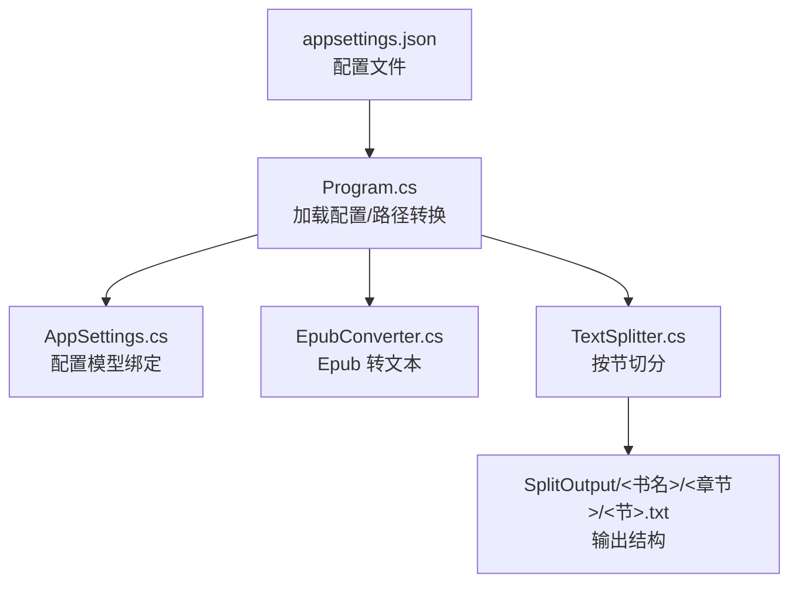
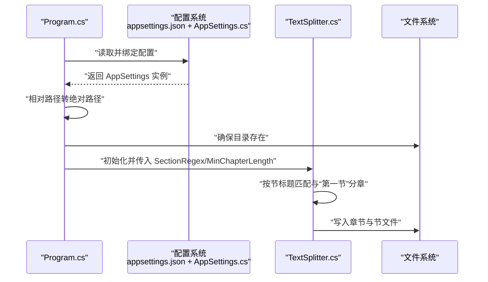

# 配置说明

<cite>
**本文引用的文件**
- [appsettings.json](file://appsettings.json)
- [AppSettings.cs](file://AppSettings.cs)
- [Program.cs](file://Program.cs)
- [TextSplitter.cs](file://TextSplitter.cs)
- [README.md](file://README.md)
</cite>

## 目录
1. [简介](#简介)
2. [项目结构](#项目结构)
3. [核心组件](#核心组件)
4. [架构总览](#架构总览)
5. [详细组件分析](#详细组件分析)
6. [依赖分析](#依赖分析)
7. [性能考虑](#性能考虑)
8. [故障排查指南](#故障排查指南)
9. [结论](#结论)
10. [附录](#附录)

## 简介
本文件聚焦于项目的配置系统，围绕以下目标展开：
- 解释 appsettings.json 的结构与作用
- 对应 AppSettings.cs 中的配置模型进行说明
- 重点分析 Splitter 配置节中的 ChapterRegex 与 SectionRegex 如何工作，尤其是如何匹配中文数字章节（如“第一章”）与节（如“第一节”）
- 说明 Paths 配置节中三个路径的作用，以及程序如何将相对路径转换为绝对路径
- 提供修改配置的实用示例，强调修改后需要重新运行程序

## 项目结构
配置系统由以下关键文件组成：
- appsettings.json：应用配置文件，包含 Splitter 与 Paths 两大节
- AppSettings.cs：配置模型类，用于绑定 JSON 配置
- Program.cs：程序入口，负责加载配置、转换相对路径为绝对路径、确保目录存在
- TextSplitter.cs：文本切分器，使用配置中的 SectionRegex 与 MinChapterLength

图表来源
- [appsettings.json](file://appsettings.json#L1-L13)
- [Program.cs](file://Program.cs#L55-L87)
- [AppSettings.cs](file://AppSettings.cs#L1-L60)
- [TextSplitter.cs](file://TextSplitter.cs#L1-L40)

章节来源
- [appsettings.json](file://appsettings.json#L1-L13)
- [Program.cs](file://Program.cs#L55-L87)
- [AppSettings.cs](file://AppSettings.cs#L1-L60)

## 核心组件
- 配置模型（AppSettings.cs）
  - Splitter：包含 ChapterRegex、SectionRegex、MinChapterLength
  - Paths：包含 RawEpubFolder、IntermediateTxtFolder、SplitOutputFolder
- 程序入口（Program.cs）
  - 读取 appsettings.json 并绑定到 AppSettings
  - 将 Paths 下的相对路径转换为绝对路径
  - 确保输入/输出目录存在
  - 初始化 EpubConverter 与 TextSplitter 并执行处理流程
- 文本切分器（TextSplitter.cs）
  - 使用 SectionRegex 匹配节标题
  - 使用“第一节”作为新章的起始标志
  - 输出章节文件夹与节文件，文件名包含序号与标题

章节来源
- [AppSettings.cs](file://AppSettings.cs#L1-L60)
- [Program.cs](file://Program.cs#L55-L87)
- [TextSplitter.cs](file://TextSplitter.cs#L1-L40)

## 架构总览
配置在程序启动阶段被加载并绑定到强类型模型，随后被传递给各业务组件使用。

图表来源
- [Program.cs](file://Program.cs#L55-L87)
- [TextSplitter.cs](file://TextSplitter.cs#L1-L40)

## 详细组件分析

### 配置文件 appsettings.json 结构
- Splitter 节
  - ChapterRegex：章节标题匹配正则表达式（当前实现中未直接使用，保留兼容）
  - SectionRegex：节标题匹配正则表达式（由 TextSplitter 使用）
  - MinChapterLength：最小章节长度（字符数），低于阈值会发出警告
- Paths 节
  - RawEpubFolder：原始 Epub 文件存放目录（相对路径）
  - IntermediateTxtFolder：全本文本中间文件目录（相对路径）
  - SplitOutputFolder：章节切分输出目录（相对路径）

章节来源
- [appsettings.json](file://appsettings.json#L1-L13)

### 配置模型 AppSettings.cs
- AppSettings：根配置对象，包含 Splitter 与 Paths
- SplitterConfig：包含 ChapterRegex、SectionRegex、MinChapterLength
- PathsConfig：包含 RawEpubFolder、IntermediateTxtFolder、SplitOutputFolder

章节来源
- [AppSettings.cs](file://AppSettings.cs#L1-L60)

### 程序入口 Program.cs 的配置加载与路径转换
- 加载配置
  - 使用 ConfigurationBuilder 设置基路径并读取 appsettings.json
  - 通过 Bind 将配置绑定到 AppSettings 实例
- 路径转换
  - 若路径非根路径，则以程序基目录为基准组合并转换为绝对路径
- 目录确保
  - 确保 RawEpubFolder、IntermediateTxtFolder、SplitOutputFolder 存在

章节来源
- [Program.cs](file://Program.cs#L55-L87)

### 文本切分器 TextSplitter.cs 的正则与分章逻辑
- 正则使用
  - SectionRegex：用于匹配节标题（由配置传入）
  - FirstSectionRegex：固定匹配“第一节”作为新章起始
- 分章与命名
  - 遇到“第一节”即开启新章，并以该节标题冒号后的部分作为章标题
  - 输出结构为：SplitOutput/<书名>/<章节>/<节>.txt
  - 章文件夹名包含序号与中文数字；节文件名包含全局序号与标题

章节来源
- [TextSplitter.cs](file://TextSplitter.cs#L1-L40)
- [TextSplitter.cs](file://TextSplitter.cs#L173-L185)

### Splitter 配置节：ChapterRegex 与 SectionRegex 的工作机制
- SectionRegex（节标题）
  - TextSplitter 使用该正则逐行匹配节标题
  - 当匹配成功且满足“第一节”条件时，触发新章的开始与章标题提取
- ChapterRegex（章节标题）
  - 当前实现中未直接使用该字段（构造函数参数保留兼容）
  - 若后续需要按“章节”进行识别或扩展，可在 TextSplitter 中增加对 ChapterRegex 的使用

章节来源
- [TextSplitter.cs](file://TextSplitter.cs#L1-L40)
- [Program.cs](file://Program.cs#L32-L36)

### Paths 配置节：三个路径的作用与相对路径转绝对路径
- RawEpubFolder
  - 作用：存放待处理的 Epub 文件
  - 程序会在启动时检查该目录是否存在，不存在则创建
- IntermediateTxtFolder
  - 作用：存放 Epub 转换后的全本文本中间文件
- SplitOutputFolder
  - 作用：存放最终的章节切分输出（每本书一个子目录）
- 相对路径转绝对路径
  - 程序以 AppContext.BaseDirectory 为基准，将配置中的相对路径组合为绝对路径
  - 若配置中已是绝对路径，则直接使用

章节来源
- [Program.cs](file://Program.cs#L55-L87)
- [README.md](file://README.md#L67-L117)

### 修改配置的实用示例与注意事项
- 自定义 SectionRegex 以支持新的节格式
  - 示例思路：在 appsettings.json 的 Splitter:SectionRegex 中添加新的匹配模式
  - 注意：修改后需要重新运行程序以使配置生效
- 自定义 ChapterRegex（扩展建议）
  - 当前实现未直接使用该字段，若要启用按“章节”识别，可在 TextSplitter 中增加对 ChapterRegex 的使用
  - 修改后同样需要重新运行程序
- 路径修改
  - 可调整 Paths 下的三个路径，程序会自动将其转换为绝对路径并确保目录存在

章节来源
- [appsettings.json](file://appsettings.json#L1-L13)
- [Program.cs](file://Program.cs#L55-L87)
- [TextSplitter.cs](file://TextSplitter.cs#L1-L40)

## 依赖分析
- 配置绑定链路
  - appsettings.json → Program.LoadConfiguration → AppSettings
- 组件依赖
  - Program 依赖 AppSettings 与文件系统
  - TextSplitter 依赖配置中的 SectionRegex 与 MinChapterLength
- 外部库
  - Microsoft.Extensions.Configuration 用于配置绑定
  - System.Text.RegularExpressions 用于正则匹配

图表来源
- [Program.cs](file://Program.cs#L55-L87)
- [AppSettings.cs](file://AppSettings.cs#L1-L60)
- [TextSplitter.cs](file://TextSplitter.cs#L1-L40)

章节来源
- [Program.cs](file://Program.cs#L55-L87)
- [AppSettings.cs](file://AppSettings.cs#L1-L60)
- [TextSplitter.cs](file://TextSplitter.cs#L1-L40)

## 性能考虑
- 正则编译与超时
  - TextSplitter 对节正则使用编译选项与超时控制，避免回溯陷阱导致性能问题
- 流式处理
  - 使用 StreamReader 逐行读取，降低内存占用
- UTF-8 无 BOM
  - 输出文件采用 UTF-8 无 BOM，提升兼容性与减小体积

章节来源
- [TextSplitter.cs](file://TextSplitter.cs#L1-L40)
- [README.md](file://README.md#L158-L172)

## 故障排查指南
- 未找到 Epub 文件
  - 现象：提示在 RawEpubFolder 中未找到 .epub 文件
  - 排查：确认 Epub 文件已放入该目录，或检查 Paths.RawEpubFolder 是否正确
- 目录不存在
  - 现象：程序启动时报错或无法写入
  - 排查：确认程序具备权限，或手动创建目录
- 节文件过小
  - 现象：出现“节文件过小”的警告
  - 排查：检查 SectionRegex 是否正确匹配节标题；适当提高 MinChapterLength
- 正则不匹配
  - 现象：未检测到任何章节
  - 排查：核对 SectionRegex；确认文本中存在“第一节”作为章节起始标志

章节来源
- [Program.cs](file://Program.cs#L18-L26)
- [TextSplitter.cs](file://TextSplitter.cs#L116-L120)
- [TextSplitter.cs](file://TextSplitter.cs#L152-L156)

## 结论
- appsettings.json 提供了清晰的配置入口，AppSettings.cs 将其映射为强类型模型
- TextSplitter 当前主要依赖 SectionRegex 与“第一节”来实现按节切分
- Program 负责将相对路径转换为绝对路径并确保目录存在
- 修改配置后必须重新运行程序以生效

## 附录

### 配置项对照表
- Splitter
  - ChapterRegex：章节标题匹配正则表达式（当前未直接使用）
  - SectionRegex：节标题匹配正则表达式
  - MinChapterLength：最小章节长度（字符数）
- Paths
  - RawEpubFolder：原始 Epub 文件存放目录
  - IntermediateTxtFolder：全本文本中间文件目录
  - SplitOutputFolder：章节切分输出目录

章节来源
- [appsettings.json](file://appsettings.json#L1-L13)
- [AppSettings.cs](file://AppSettings.cs#L1-L60)
- [README.md](file://README.md#L106-L116)