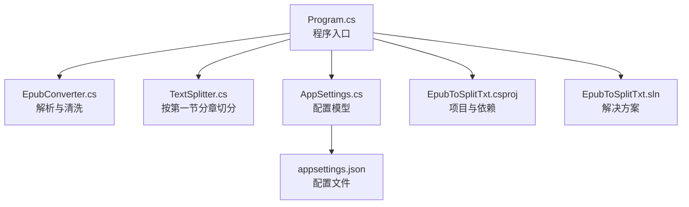
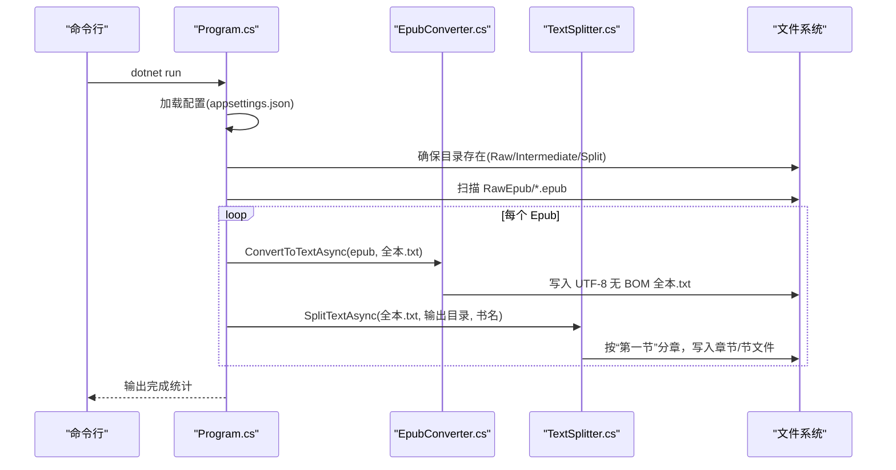
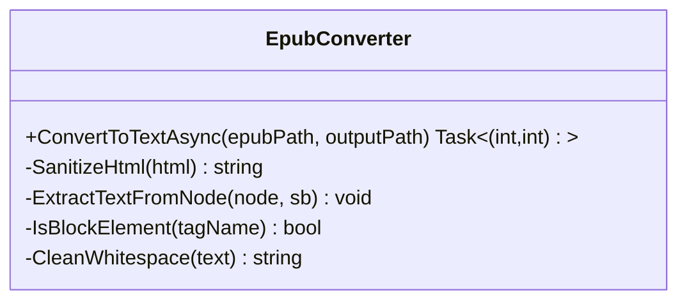
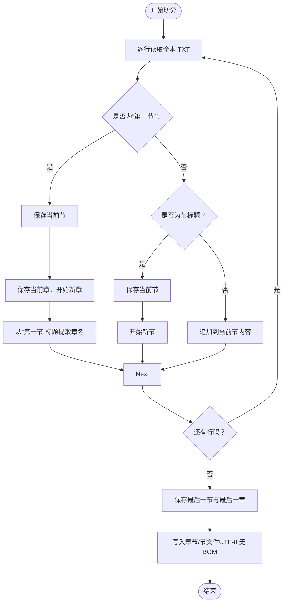
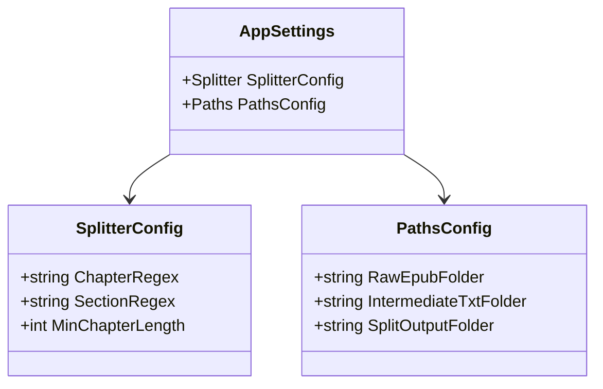
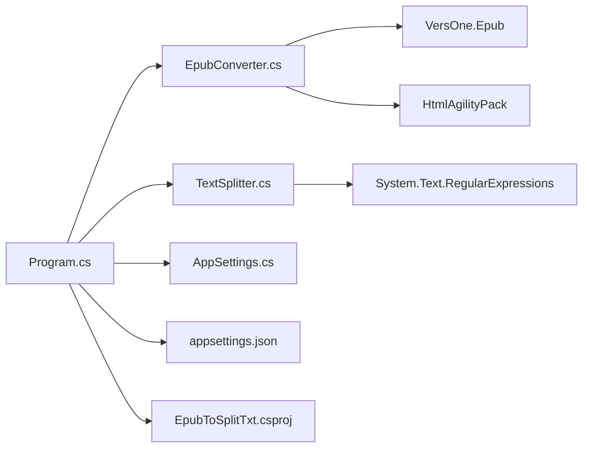
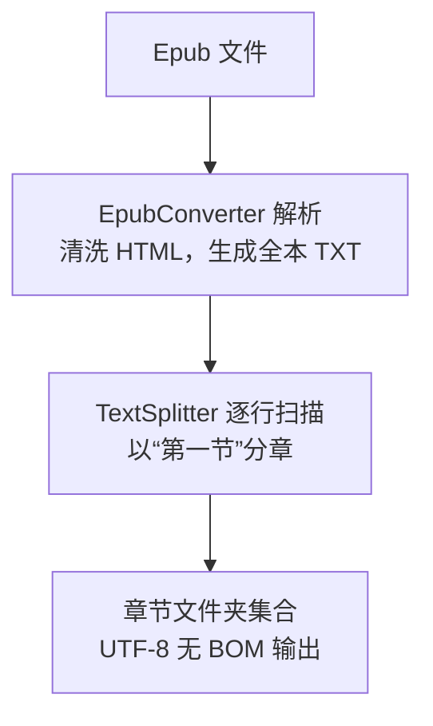

# 项目概述

<cite>
**本文引用的文件**
- [README.md](file://README.md)
- [docs/Agent&Chat.md](file://docs/Agent&Chat.md)
- [Program.cs](file://Program.cs)
- [EpubConverter.cs](file://EpubConverter.cs)
- [TextSplitter.cs](file://TextSplitter.cs)
- [AppSettings.cs](file://AppSettings.cs)
- [appsettings.json](file://appsettings.json)
- [EpubToSplitTxt.csproj](file://EpubToSplitTxt.csproj)
- [EpubToSplitTxt.sln](file://EpubToSplitTxt.sln)
</cite>

## 目录
1. [简介](#简介)
2. [项目结构](#项目结构)
3. [核心组件](#核心组件)
4. [架构总览](#架构总览)
5. [详细组件分析](#详细组件分析)
6. [依赖关系分析](#依赖关系分析)
7. [性能考量](#性能考量)
8. [故障排查指南](#故障排查指南)
9. [结论](#结论)
10. [附录](#附录)

## 简介
EpubToSplitTxt 是一个面向 Epub 电子书的命令行工具（CLI），专注于将 .epub 文件解析为纯文本，并依据“第一节”作为分章标志，将文本切分为按章节组织的独立 TXT 文件。项目强调：
- 命令行工具（CLI）特性：通过 dotnet run 即可执行，适合批处理与自动化。
- 配置驱动设计：通过 appsettings.json 管理章节匹配规则与路径，便于扩展与定制。
- 模块化职责分离：EpubConverter 负责解析与清洗，TextSplitter 负责按“第一节”分章与切分，AppSettings 提供配置模型。

项目与第三方库的集成：
- VersOne.Epub：用于读取 Epub 结构与内容。
- HtmlAgilityPack：用于清洗 HTML 标签与实体，提取纯文本。

开发背景与处理流程来自对话式开发记录，展示了从基础功能到两级目录结构、中文数字命名、正则优化等逐步完善的演进过程。

**章节来源**
- file://README.md#L1-L231
- file://docs/Agent&Chat.md#L1-L366

## 项目结构
项目采用“命令行入口 + 模块化服务 + 配置模型”的组织方式，关键文件与职责如下：
- Program.cs：程序入口，负责加载配置、遍历 Epub 文件、调用转换与切分流程。
- EpubConverter.cs：解析 Epub 并输出全本 TXT，使用 VersOne.Epub 与 HtmlAgilityPack。
- TextSplitter.cs：基于“第一节”分章，按节切分为独立文件，支持中文数字命名与文件名清洗。
- AppSettings.cs：配置模型，映射 appsettings.json 的 Splitter 与 Paths。
- appsettings.json：默认配置，包含章节匹配规则与路径。
- EpubToSplitTxt.csproj：项目文件，声明 .NET 9 目标框架与依赖包。
- EpubToSplitTxt.sln：解决方案文件。

**图表来源**
- [Program.cs](file://Program.cs#L1-L135)
- [EpubConverter.cs](file://EpubConverter.cs#L1-L191)
- [TextSplitter.cs](file://TextSplitter.cs#L1-L292)
- [AppSettings.cs](file://AppSettings.cs#L1-L60)
- [appsettings.json](file://appsettings.json#L1-L13)
- [EpubToSplitTxt.csproj](file://EpubToSplitTxt.csproj#L1-L28)
- [EpubToSplitTxt.sln](file://EpubToSplitTxt.sln#L1-L200)

**章节来源**
- file://EpubToSplitTxt.csproj#L1-L28
- file://EpubToSplitTxt.sln#L1-L200

## 核心组件
- EpubConverter：负责读取 Epub 结构、清洗 HTML、合并为纯文本并输出 UTF-8 无 BOM 文件；支持 ReadingOrder 优先与回退到 HTML 内容读取。
- TextSplitter：基于“第一节”作为新章起始标志，逐行扫描节标题，按节写入独立文件；支持中文数字转换、文件名清洗、最小节长校验与警告。
- AppSettings：将 appsettings.json 绑定为 SplitterConfig 与 PathsConfig，提供章节匹配规则与路径配置。

**章节来源**
- file://EpubConverter.cs#L1-L191
- file://TextSplitter.cs#L1-L292
- file://AppSettings.cs#L1-L60
- file://appsettings.json#L1-L13

## 架构总览
系统采用“解析 → 清洗 → 全本 → 切分 → 输出”的流水线式处理：
- 输入：RawEpub 目录中的 .epub 文件。
- 中间：IntermediateTxt 目录中的全本 TXT。
- 输出：SplitOutput 目录中按书名分组的两级目录结构（章 → 节）。

**图表来源**
- [Program.cs](file://Program.cs#L1-L135)
- [EpubConverter.cs](file://EpubConverter.cs#L1-L191)
- [TextSplitter.cs](file://TextSplitter.cs#L1-L292)
- [appsettings.json](file://appsettings.json#L1-L13)

## 详细组件分析

### EpubConverter 组件分析
职责与实现要点：
- 使用 VersOne.Epub 读取 Epub，优先使用 ReadingOrder 保证阅读顺序；若为空，则回退到 HTML 内容列表。
- 使用 HtmlAgilityPack 清洗 HTML，提取 InnerText 并转换 HTML 实体，清理多余空白与控制字符。
- 输出 UTF-8 无 BOM 编码的全本 TXT，并返回章节数量与总字符数统计。

**图表来源**
- [EpubConverter.cs](file://EpubConverter.cs#L1-L191)

**章节来源**
- file://EpubConverter.cs#L1-L191

### TextSplitter 组件分析
职责与实现要点：
- 构造函数接收节匹配正则与最小节长，使用 RegexOptions.Compiled 与超时保护。
- 逐行读取全本 TXT，以“第一节”作为新章标志，识别节标题并累积内容。
- 为每本书创建独立子目录，章节目录以“序号.第N章：标题”命名，节文件以“全局序号.标题”命名。
- 支持中文数字转换、文件名清洗、最小节长告警与空内容跳过。

**图表来源**
- [TextSplitter.cs](file://TextSplitter.cs#L1-L292)

**章节来源**
- file://TextSplitter.cs#L1-L292

### 配置与路径管理
- AppSettings.cs 定义 SplitterConfig 与 PathsConfig，分别对应 appsettings.json 的 Splitter 与 Paths 节点。
- Program.cs 使用 Microsoft.Extensions.Configuration 从 appsettings.json 绑定配置，并将相对路径转换为绝对路径，确保在不同工作目录下都能正确解析。

**图表来源**
- [AppSettings.cs](file://AppSettings.cs#L1-L60)
- [appsettings.json](file://appsettings.json#L1-L13)

**章节来源**
- file://AppSettings.cs#L1-L60
- file://appsettings.json#L1-L13
- file://Program.cs#L54-L87

## 依赖关系分析
- Program.cs 依赖 EpubConverter、TextSplitter 与 AppSettings。
- EpubConverter 依赖 VersOne.Epub 与 HtmlAgilityPack。
- TextSplitter 依赖 System.Text.RegularExpressions。
- 项目通过 EpubToSplitTxt.csproj 引入上述依赖。

**图表来源**
- [Program.cs](file://Program.cs#L1-L135)
- [EpubConverter.cs](file://EpubConverter.cs#L1-L191)
- [TextSplitter.cs](file://TextSplitter.cs#L1-L292)
- [AppSettings.cs](file://AppSettings.cs#L1-L60)
- [appsettings.json](file://appsettings.json#L1-L13)
- [EpubToSplitTxt.csproj](file://EpubToSplitTxt.csproj#L1-L28)

**章节来源**
- file://EpubToSplitTxt.csproj#L1-L28

## 性能考量
- 预编译正则：TextSplitter 使用 RegexOptions.Compiled 降低匹配开销。
- 流式处理：EpubConverter 与 TextSplitter 均采用异步与流式读取，避免一次性加载全文到内存。
- UTF-8 无 BOM：减少文件体积与兼容性问题。
- 正则超时：TextSplitter 为节匹配设置超时，防止回溯陷阱导致卡顿。
- 目录与文件名：自动创建目录、清洗非法字符、限制文件名长度，提升稳定性。

**章节来源**
- file://README.md#L157-L163
- file://TextSplitter.cs#L1-L292
- file://EpubConverter.cs#L1-L191

## 故障排查指南
- 输出目录为空
  - 检查 RawEpub 目录是否存在且包含 .epub 文件。
  - 确认 appsettings.json 中 Paths.RawEpubFolder 指向正确位置。
  - 确认 Program.cs 已将相对路径转换为绝对路径。
  - 参考对话式开发记录中关于路径解析与相对路径修正的经验。
- 未检测到任何章节
  - 检查 TextSplitter 是否识别到“第一节”作为新章标志。
  - 若书籍采用“卷-节”结构，确认 SectionRegex 能匹配到节标题。
  - 参考对话式开发记录中正则字符集优化（加入“零”“两”）的经验。
- 节文件过小或缺失
  - 调整 appsettings.json 中的 MinChapterLength，或检查内容是否被清洗过滤。
  - 确认全本 TXT 已正确生成且未被意外清空。
- 编码与文件名问题
  - 确认输出为 UTF-8 无 BOM。
  - 确认文件名已清洗非法字符，必要时缩短标题长度。

**章节来源**
- file://README.md#L166-L173
- file://docs/Agent&Chat.md#L76-L125
- file://docs/Agent&Chat.md#L126-L151
- file://TextSplitter.cs#L1-L292
- file://Program.cs#L54-L87

## 结论
EpubToSplitTxt 通过清晰的模块化设计与配置驱动，实现了从 Epub 到按章节切分的稳定流程。其 CLI 形态与流式处理能力使其适用于批量与大文件场景；同时，对话式开发记录提供了丰富的实践经验与问题解决思路，便于扩展与维护。

[无需章节来源：总结性内容]

## 附录

### 快速入门（初学者）
- 准备 Epub 文件：将 .epub 文件放入项目根目录的 RawEpub 文件夹。
- 运行命令：在项目根目录执行 dotnet run。
- 查看结果：全本 TXT 存放于 IntermediateTxt，章节切分结果位于 SplitOutput/书名/章节/节.txt。

**章节来源**
- file://README.md#L42-L85

### 高级用法（开发者）
- 自定义章节匹配规则：修改 appsettings.json 中的 SectionRegex 以适配不同书籍结构。
- 扩展输出格式：在 TextSplitter.cs 的 SplitTextAsync 中增加输出格式分支（如 Markdown）。
- 调整路径：通过 Paths 节点配置 RawEpubFolder、IntermediateTxtFolder、SplitOutputFolder。

**章节来源**
- file://README.md#L88-L116
- file://README.md#L194-L212
- file://appsettings.json#L1-L13
- file://TextSplitter.cs#L1-L292

### 处理流程图（来自 README 与对话记录）

**图表来源**
- [README.md](file://README.md#L131-L146)
- [docs/Agent&Chat.md](file://docs/Agent&Chat.md#L237-L252)