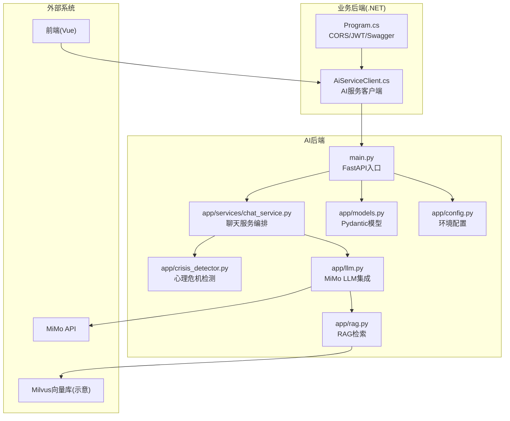
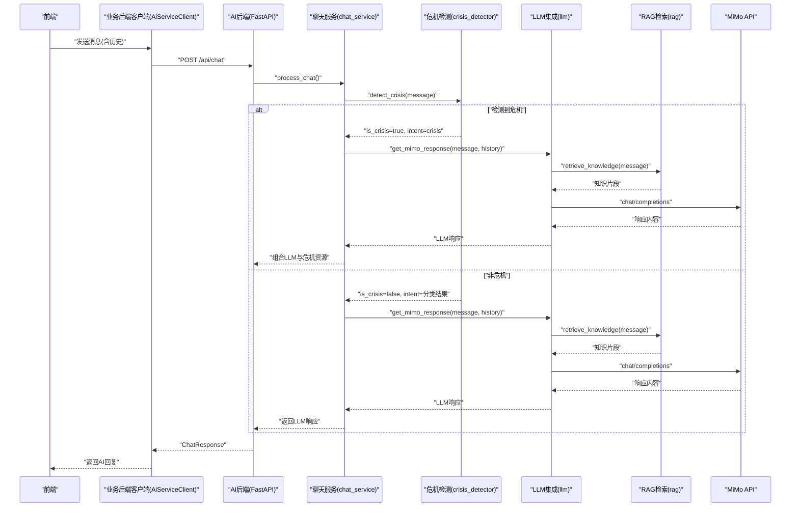
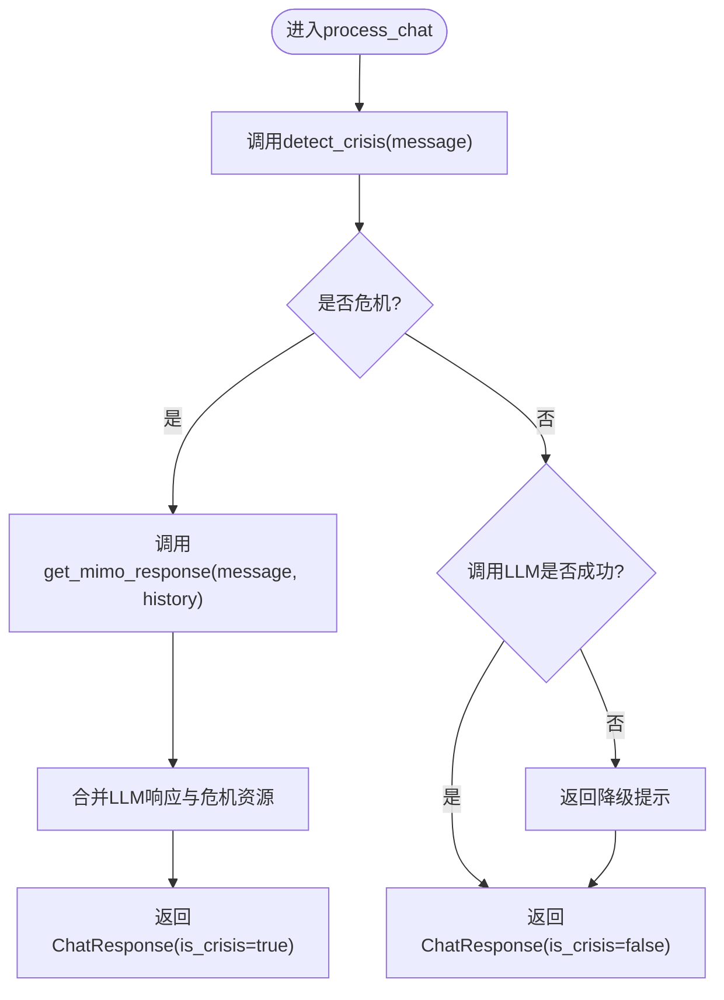
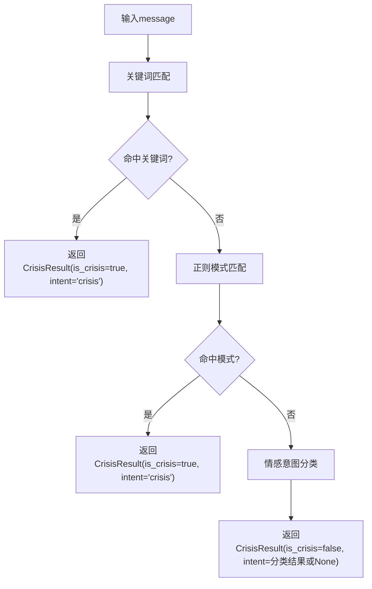
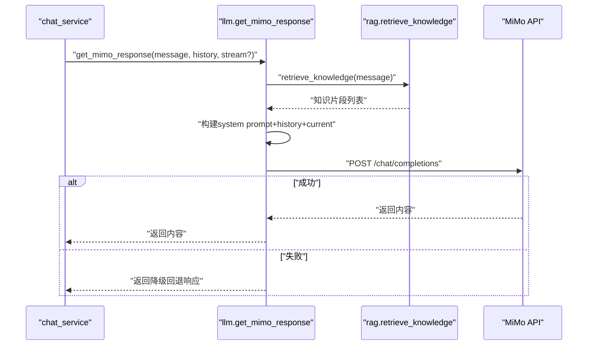
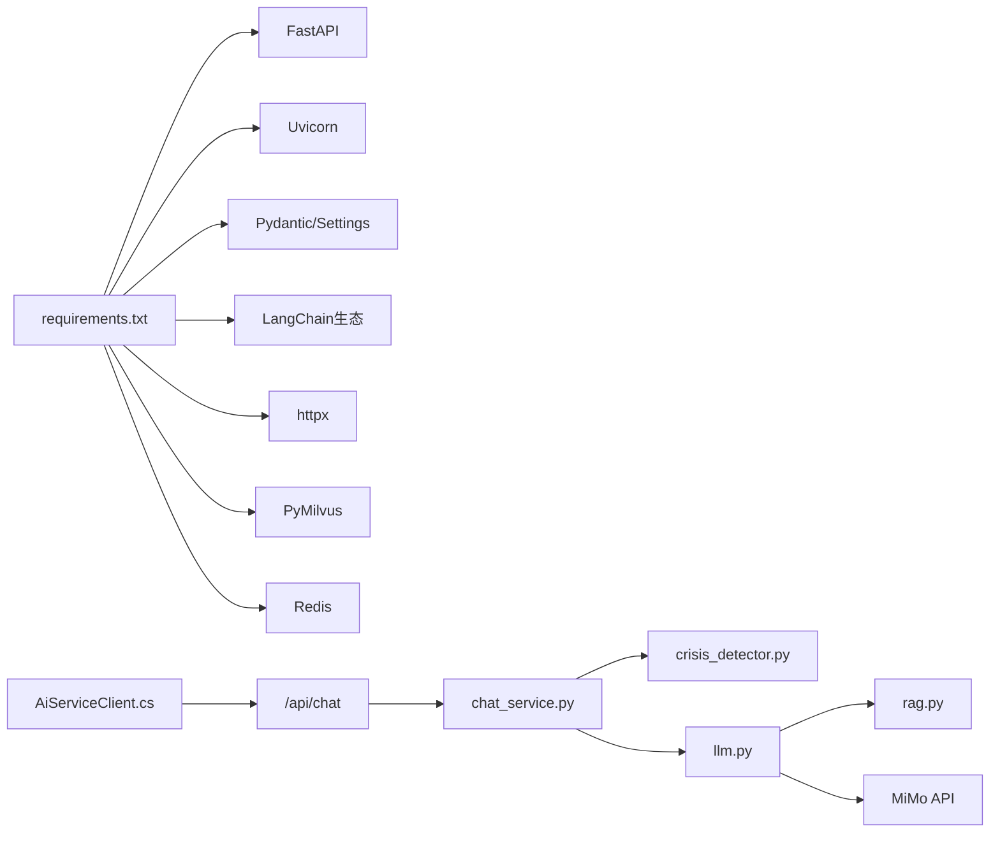

# AI后端架构

<cite>
**本文引用的文件**
- [main.py](file://backend-ai/main.py)
- [chat_service.py](file://backend-ai/app/services/chat_service.py)
- [crisis_detector.py](file://backend-ai/app/crisis_detector.py)
- [llm.py](file://backend-ai/app/llm.py)
- [rag.py](file://backend-ai/app/rag.py)
- [models.py](file://backend-ai/app/models.py)
- [config.py](file://backend-ai/app/config.py)
- [requirements.txt](file://backend-ai/requirements.txt)
- [README.md](file://README.md)
- [Program.cs](file://backend-business/MindMates.Api/Program.cs)
- [AiServiceClient.cs](file://backend-business/MindMates.Infrastructure/Services/AiServiceClient.cs)
</cite>

## 目录
1. [引言](#引言)
2. [项目结构](#项目结构)
3. [核心组件](#核心组件)
4. [架构总览](#架构总览)
5. [详细组件分析](#详细组件分析)
6. [依赖分析](#依赖分析)
7. [性能考虑](#性能考虑)
8. [故障排查指南](#故障排查指南)
9. [结论](#结论)
10. [附录](#附录)

## 引言
本架构文档聚焦于基于FastAPI的AI后端微服务，围绕以下目标展开：
- 解释main.py如何启动服务并注册路由
- 说明chat_service.py如何协调LLM推理、危机检测与RAG检索增强生成
- 深入分析crisis_detector.py中的心理危机识别算法逻辑
- 阐述llm.py中对MiMo LLM的集成方式与提示工程要点
- 描述服务间数据流转：输入文本如何被预处理、检测、生成响应并返回
- 为AI工程师提供模型调用、提示工程、异常处理与性能监控的实现细节，并给出实际调用链路示例

## 项目结构
AI后端位于backend-ai目录，采用模块化分层：
- 应用入口：main.py
- 业务服务：app/services/chat_service.py
- 危机检测：app/crisis_detector.py
- LLM集成：app/llm.py
- RAG检索：app/rag.py
- 数据模型与配置：app/models.py、app/config.py
- 依赖声明：requirements.txt
- 项目说明：README.md



图表来源
- [main.py](file://backend-ai/main.py#L1-L100)
- [chat_service.py](file://backend-ai/app/services/chat_service.py#L1-L64)
- [crisis_detector.py](file://backend-ai/app/crisis_detector.py#L1-L123)
- [llm.py](file://backend-ai/app/llm.py#L1-L170)
- [rag.py](file://backend-ai/app/rag.py#L1-L138)
- [models.py](file://backend-ai/app/models.py#L1-L28)
- [config.py](file://backend-ai/app/config.py#L1-L30)
- [Program.cs](file://backend-business/MindMates.Api/Program.cs#L1-L95)
- [AiServiceClient.cs](file://backend-business/MindMates.Infrastructure/Services/AiServiceClient.cs#L1-L52)

章节来源
- [README.md](file://README.md#L80-L120)
- [requirements.txt](file://backend-ai/requirements.txt#L1-L28)

## 核心组件
- FastAPI应用与路由
  - main.py创建FastAPI实例，配置CORS与健康检查端点，并注册聊天接口。
  - 路由包括根路径、健康检查与主要聊天接口。
- 聊天服务编排
  - chat_service.py负责接收请求、执行危机检测、在必要时合并紧急资源与LLM响应，并返回统一格式。
- 危机检测
  - crisis_detector.py通过关键词匹配与正则模式识别潜在危机，同时进行情感意图分类。
- LLM集成与提示工程
  - llm.py封装MiMo API调用，构建系统提示与上下文，执行RAG知识注入，并提供降级回退响应。
- RAG检索
  - rag.py定义心理学知识检索器，基于关键词匹配返回相关知识片段；生产环境可替换为Milvus向量检索。
- 数据模型与配置
  - models.py定义请求/响应模型；config.py加载环境变量并缓存设置。

章节来源
- [main.py](file://backend-ai/main.py#L1-L100)
- [chat_service.py](file://backend-ai/app/services/chat_service.py#L1-L64)
- [crisis_detector.py](file://backend-ai/app/crisis_detector.py#L1-L123)
- [llm.py](file://backend-ai/app/llm.py#L1-L170)
- [rag.py](file://backend-ai/app/rag.py#L1-L138)
- [models.py](file://backend-ai/app/models.py#L1-L28)
- [config.py](file://backend-ai/app/config.py#L1-L30)

## 架构总览
AI后端以FastAPI为核心，对外提供REST接口，内部通过服务编排模块协调LLM与RAG能力，并内置心理危机检测机制。业务后端通过HTTP客户端调用AI后端接口，形成前后端分离的微服务体系。



图表来源
- [main.py](file://backend-ai/main.py#L48-L90)
- [chat_service.py](file://backend-ai/app/services/chat_service.py#L10-L64)
- [crisis_detector.py](file://backend-ai/app/crisis_detector.py#L52-L123)
- [llm.py](file://backend-ai/app/llm.py#L50-L121)
- [rag.py](file://backend-ai/app/rag.py#L125-L138)
- [AiServiceClient.cs](file://backend-business/MindMates.Infrastructure/Services/AiServiceClient.cs#L18-L48)

## 详细组件分析

### FastAPI入口与路由
- 生命周期管理：通过lifespan钩子打印启动/关闭日志。
- 中间件：启用CORS，允许指定源访问。
- 路由：
  - GET /health 返回健康状态
  - POST /api/chat 接收聊天请求并调用process_chat
  - GET / 返回服务基本信息
- 开发模式：根据配置决定是否暴露文档端点；本地开发可通过命令行直接运行。

章节来源
- [main.py](file://backend-ai/main.py#L17-L100)

### 聊天服务编排
- 关键流程：
  - 执行危机检测
  - 若检测到危机：合并LLM生成的共情式响应与标准危机资源
  - 若未检测到危机：直接调用LLM生成响应
  - 异常处理：捕获错误并返回友好提示
- 输出模型：统一返回ChatResponse，包含content、intent与is_crisis字段。



图表来源
- [chat_service.py](file://backend-ai/app/services/chat_service.py#L10-L64)

章节来源
- [chat_service.py](file://backend-ai/app/services/chat_service.py#L10-L64)

### 心理危机识别算法
- 数据结构：CrisisResult命名元组，包含is_crisis、intent与crisis_response。
- 关键词与模式：
  - 危机关键词集合（中文）覆盖自杀意念、自残、严重抑郁、暴力倾向等
  - 正则模式匹配常见表达
- 检测流程：
  - 优先进行关键词匹配，命中即返回危机结果
  - 否则进行正则模式匹配，命中也返回危机结果
  - 否则进行情感意图分类，返回一般性intent或None
- 资源提示：若检测到危机，返回标准危机资源文本（中文）



图表来源
- [crisis_detector.py](file://backend-ai/app/crisis_detector.py#L52-L123)

章节来源
- [crisis_detector.py](file://backend-ai/app/crisis_detector.py#L1-L123)

### LLM集成与提示工程
- 系统提示：定义角色、方法论（CBT）、交互规范、安全约束与语言要求，强调共情、简洁输出与RAG上下文内化。
- 请求构建：
  - RAG上下文拼接至系统提示
  - 历史消息取最近N条，按用户/助手角色顺序加入messages
  - 当前消息作为最后一条用户消息
- 调用参数：模型名、温度、最大token数、流式/非流式
- 错误处理：捕获HTTP状态错误与通用异常，返回降级回退响应
- 降级策略：根据用户情绪关键词返回CBT风格的共情式短语



图表来源
- [llm.py](file://backend-ai/app/llm.py#L50-L121)
- [rag.py](file://backend-ai/app/rag.py#L125-L138)

章节来源
- [llm.py](file://backend-ai/app/llm.py#L1-L170)
- [rag.py](file://backend-ai/app/rag.py#L1-L138)

### RAG检索服务
- 自定义检索器：PsychologyKnowledgeRetriever
  - 内置心理学知识库（静态），包含焦虑、抑郁、压力、睡眠、关系等主题
  - 基于关键词匹配返回相关文档，限制返回数量
- 检索函数：retrieve_knowledge(query)返回知识片段列表
- 生产扩展：README指出可替换为Milvus向量检索

```mermaid
classDiagram
class PsychologyKnowledgeRetriever {
+int top_k
+knowledge_base : list[dict]
+__init__()
+_load_knowledge_base() list[dict]
+_get_relevant_documents(query) list[Document]
}
class get_retriever() {
+returns PsychologyKnowledgeRetriever
}
class retrieve_knowledge(query) {
+returns list[str]
}
get_retriever --> PsychologyKnowledgeRetriever : "创建实例"
retrieve_knowledge --> PsychologyKnowledgeRetriever : "调用_get_relevant_documents"
```

图表来源
- [rag.py](file://backend-ai/app/rag.py#L12-L138)

章节来源
- [rag.py](file://backend-ai/app/rag.py#L1-L138)
- [README.md](file://README.md#L160-L175)

### 数据模型与配置
- 数据模型：
  - ChatMessage：单条消息（role/content）
  - ChatRequest：消息+历史
  - ChatResponse：内容+意图+是否危机
  - HealthResponse：健康检查响应
- 配置：
  - MiMo API密钥与基础地址
  - 向量数据库URI
  - Redis URL
  - 调试与日志级别
  - 使用缓存函数加载配置

章节来源
- [models.py](file://backend-ai/app/models.py#L1-L28)
- [config.py](file://backend-ai/app/config.py#L1-L30)

## 依赖分析
- 外部依赖（部分）
  - FastAPI、Uvicorn、Pydantic、Pydantic Settings
  - LangChain生态（LangChain、LangChain Core、LangChain Community、LangChain OpenAI）
  - httpx用于异步HTTP调用
  - PyMilvus用于向量数据库（生产扩展）
  - Redis用于缓存（可选）
- 业务后端集成
  - 业务后端通过HttpClient调用AI后端的/api/chat端点
  - 在AI服务不可用时提供降级响应



图表来源
- [requirements.txt](file://backend-ai/requirements.txt#L1-L28)
- [AiServiceClient.cs](file://backend-business/MindMates.Infrastructure/Services/AiServiceClient.cs#L1-L52)
- [main.py](file://backend-ai/main.py#L48-L90)
- [chat_service.py](file://backend-ai/app/services/chat_service.py#L10-L64)
- [llm.py](file://backend-ai/app/llm.py#L1-L170)
- [rag.py](file://backend-ai/app/rag.py#L1-L138)

章节来源
- [requirements.txt](file://backend-ai/requirements.txt#L1-L28)
- [Program.cs](file://backend-business/MindMates.Api/Program.cs#L66-L95)
- [AiServiceClient.cs](file://backend-business/MindMates.Infrastructure/Services/AiServiceClient.cs#L1-L52)

## 性能考虑
- 流式与非流式响应
  - llm.py支持流式/非流式两种模式，可根据网络与设备性能选择
- 上下文长度控制
  - 历史消息仅保留最近N条，避免上下文过长导致延迟与成本上升
- RAG上下文拼接
  - 将检索到的知识片段拼接到系统提示，有助于提高准确性但需注意token上限
- 超时与重试
  - httpx设置超时；建议结合指数退避策略提升稳定性（可参考tenacity）
- 缓存策略
  - 可利用Redis缓存热点知识与对话摘要，减少重复检索与LLM调用
- 并发与限流
  - FastAPI默认并发；建议在网关或上游增加限流与熔断保护

## 故障排查指南
- 常见问题定位
  - MiMo API调用失败：检查配置中的API密钥与基础地址；查看错误日志中的状态码与响应体
  - 危机检测误报/漏报：调整关键词与正则模式；增加更多主题与关键词
  - RAG检索不准确：优化关键词匹配或替换为向量检索（Milvus）
- 日志与可观测性
  - FastAPI应用生命周期日志
  - 业务后端客户端在AI服务不可用时的降级提示
- 安全与合规
  - 危机检测触发时必须优先保障用户安全，确保提示明确且包含权威热线
  - 遵循最小化原则，不在响应中泄露敏感信息

章节来源
- [llm.py](file://backend-ai/app/llm.py#L114-L121)
- [chat_service.py](file://backend-ai/app/services/chat_service.py#L57-L64)
- [AiServiceClient.cs](file://backend-business/MindMates.Infrastructure/Services/AiServiceClient.cs#L39-L48)

## 结论
该AI后端以FastAPI为基础，通过清晰的服务编排实现了“危机检测+LLM生成+RAG增强”的一体化心理咨询服务。系统具备良好的扩展性：可替换为Milvus向量检索、引入Redis缓存、完善流式响应与重试机制。业务后端通过HTTP客户端与AI后端解耦，形成稳定的微服务架构。建议持续优化提示工程与关键词库，提升检测精度与响应质量。

## 附录
- API端点
  - POST /api/chat：聊天接口，返回ChatResponse
  - GET /health：健康检查
- 环境变量
  - MIMO_API_KEY、MIMO_API_BASE、VECTOR_DB_URI、REDIS_URL、DEBUG、LOG_LEVEL
- 调用链路示例
  - 前端 -> 业务后端客户端 -> AI后端聊天接口 -> 危机检测 -> LLM生成 -> RAG检索 -> MiMo API -> 返回响应

章节来源
- [README.md](file://README.md#L141-L158)
- [config.py](file://backend-ai/app/config.py#L1-L30)
- [AiServiceClient.cs](file://backend-business/MindMates.Infrastructure/Services/AiServiceClient.cs#L1-L52)