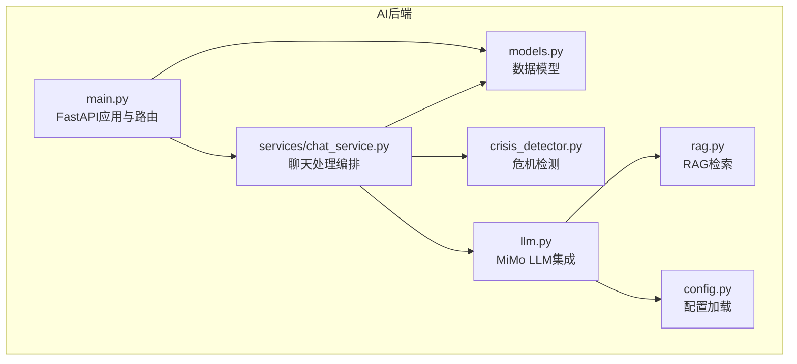
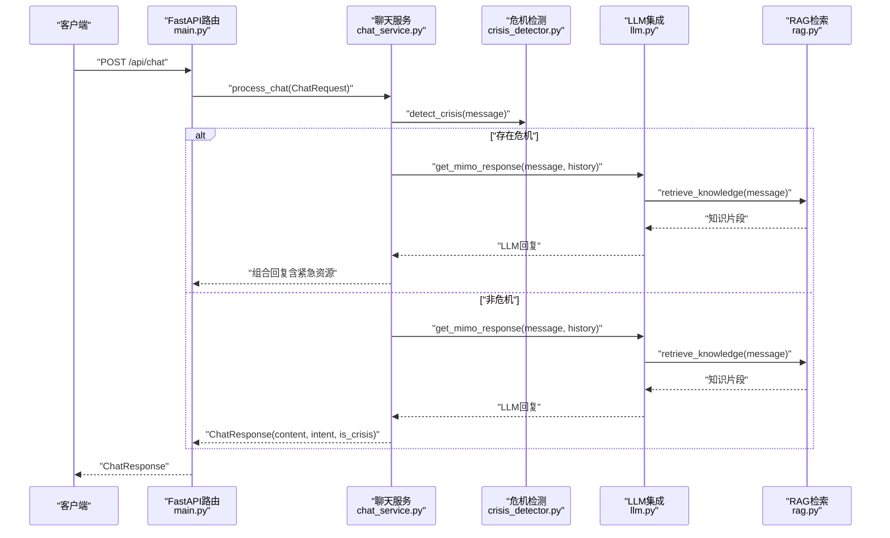
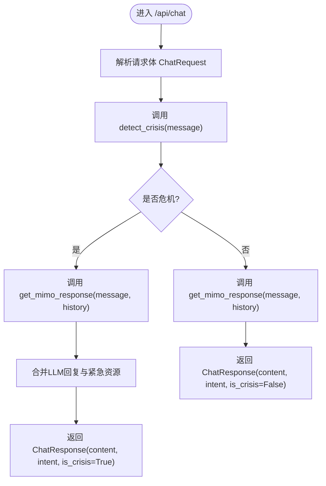
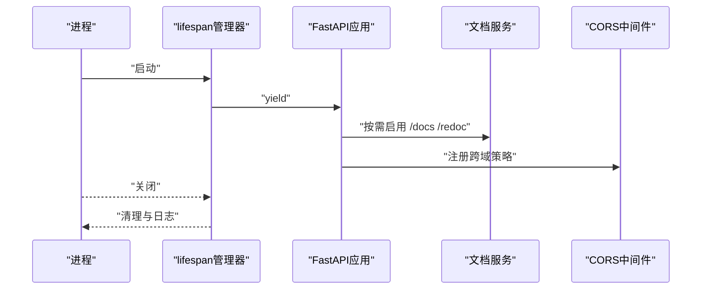
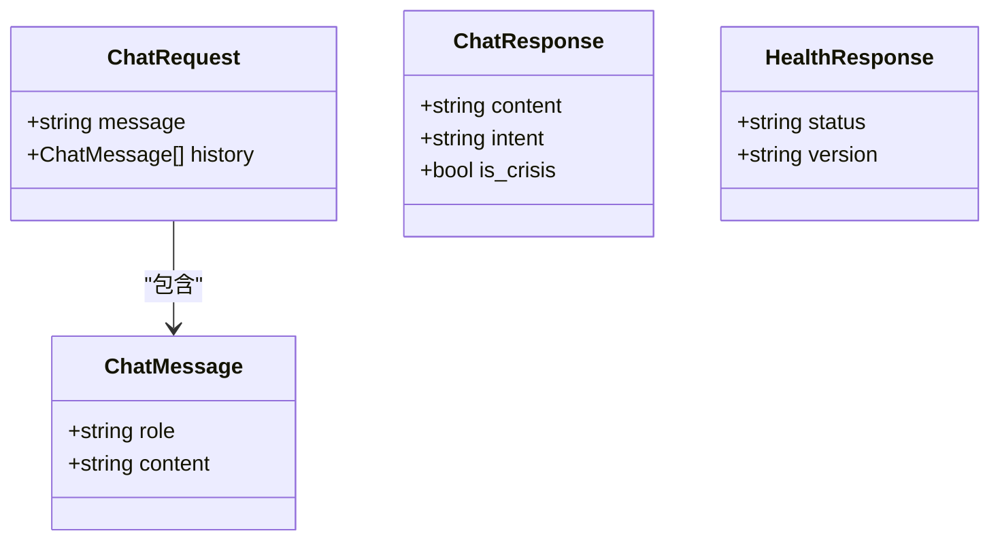
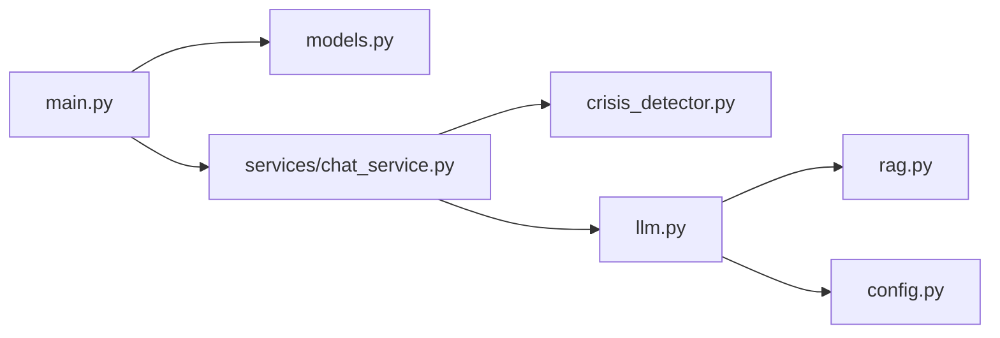

# AI服务API

<cite>
**本文引用的文件**
- [main.py](file://backend-ai/main.py)
- [models.py](file://backend-ai/app/models.py)
- [chat_service.py](file://backend-ai/app/services/chat_service.py)
- [llm.py](file://backend-ai/app/llm.py)
- [crisis_detector.py](file://backend-ai/app/crisis_detector.py)
- [rag.py](file://backend-ai/app/rag.py)
- [config.py](file://backend-ai/app/config.py)
- [requirements.txt](file://backend-ai/requirements.txt)
- [README.md](file://README.md)
</cite>

## 目录
1. [简介](#简介)
2. [项目结构](#项目结构)
3. [核心组件](#核心组件)
4. [架构总览](#架构总览)
5. [详细组件分析](#详细组件分析)
6. [依赖分析](#依赖分析)
7. [性能考虑](#性能考虑)
8. [故障排查指南](#故障排查指南)
9. [结论](#结论)
10. [附录](#附录)

## 简介
本文件面向开发者，系统化梳理基于FastAPI的AI服务API，重点覆盖以下内容：
- /api/chat 端点的POST请求处理流程、请求体结构（ChatRequest）与响应结构（ChatResponse）的字段定义与数据类型
- /health 健康检查端点的设计目的与返回格式
- main.py 中FastAPI应用的初始化过程、CORS跨域配置策略以及lifespan生命周期管理器的启动与关闭逻辑
- API文档（Swagger UI/ReDoc）在调试模式下的启用条件
- 根路径“/”提供的服务信息
- 为开发者提供API调用示例与错误处理场景（如500内部服务器错误）

## 项目结构
后端AI服务位于 backend-ai 目录，采用模块化组织：
- 应用入口：main.py
- 数据模型：app/models.py
- 业务服务：app/services/chat_service.py
- LLM集成：app/llm.py
- 危机检测：app/crisis_detector.py
- RAG检索：app/rag.py
- 配置管理：app/config.py
- 依赖声明：requirements.txt

图表来源
- [main.py](file://backend-ai/main.py#L1-L100)
- [chat_service.py](file://backend-ai/app/services/chat_service.py#L1-L64)
- [llm.py](file://backend-ai/app/llm.py#L1-L170)
- [crisis_detector.py](file://backend-ai/app/crisis_detector.py#L1-L123)
- [rag.py](file://backend-ai/app/rag.py#L1-L138)
- [models.py](file://backend-ai/app/models.py#L1-L28)
- [config.py](file://backend-ai/app/config.py#L1-L30)

章节来源
- [main.py](file://backend-ai/main.py#L1-L100)
- [README.md](file://README.md#L80-L160)

## 核心组件
- FastAPI应用与路由
  - 应用名称、描述、版本、文档路径（调试模式下启用）
  - CORS跨域策略：允许本地开发源
  - 生命周期管理器：启动打印调试信息，关闭打印日志
  - 健康检查端点：返回状态与版本
  - 根路径：返回服务信息与文档开关
- 数据模型
  - ChatMessage：单条消息（角色、内容）
  - ChatRequest：请求体（消息、历史消息列表）
  - ChatResponse：响应体（内容、意图、是否危机）
  - HealthResponse：健康检查响应（状态、版本）
- 业务服务
  - process_chat：整合危机检测与LLM生成，返回ChatResponse
- LLM集成
  - MiMo API调用：构建系统提示、历史消息、上下文知识，返回AI回复
  - 回退策略：API异常时返回CBT风格的共情回复
- 危机检测
  - 关键词与正则匹配，识别自伤、自残、暴力等高危意图
  - 返回危机结果（是否危机、意图、紧急资源）
- RAG检索
  - 基于关键词的静态知识库检索，返回相关知识片段
- 配置管理
  - 从环境变量加载MiMo API密钥、基础地址、向量库、Redis、调试模式等

章节来源
- [main.py](file://backend-ai/main.py#L1-L100)
- [models.py](file://backend-ai/app/models.py#L1-L28)
- [chat_service.py](file://backend-ai/app/services/chat_service.py#L1-L64)
- [llm.py](file://backend-ai/app/llm.py#L1-L170)
- [crisis_detector.py](file://backend-ai/app/crisis_detector.py#L1-L123)
- [rag.py](file://backend-ai/app/rag.py#L1-L138)
- [config.py](file://backend-ai/app/config.py#L1-L30)

## 架构总览
AI服务的整体调用链如下：
- 客户端发送POST到 /api/chat
- FastAPI路由接收请求，包装为ChatRequest
- 业务服务process_chat执行：
  - 危机检测：detect_crisis
  - 若存在危机：合并LLM共情回复与紧急资源
  - 若非危机：调用LLM获取回复
- LLM层get_mimo_response：
  - RAG检索retrieve_knowledge
  - 构建系统提示与消息列表
  - 调用MiMo API，失败时回退
- 返回ChatResponse给客户端

图表来源
- [main.py](file://backend-ai/main.py#L48-L79)
- [chat_service.py](file://backend-ai/app/services/chat_service.py#L10-L64)
- [crisis_detector.py](file://backend-ai/app/crisis_detector.py#L52-L90)
- [llm.py](file://backend-ai/app/llm.py#L50-L121)
- [rag.py](file://backend-ai/app/rag.py#L125-L138)

## 详细组件分析

### /api/chat 端点（POST）
- 请求路径：/api/chat
- 方法：POST
- 请求体：ChatRequest
  - 字段
    - message: 字符串，当前用户消息
    - history: 列表，元素为ChatMessage对象（role、content）
- 响应体：ChatResponse
  - 字段
    - content: 字符串，AI回复内容
    - intent: 可选字符串，情感/意图分类（如焦虑、悲伤、愤怒、孤独、压力、睡眠问题、工作、感情、家庭）
    - is_crisis: 布尔值，是否检测到危机
- 错误处理
  - 业务异常捕获并抛出HTTP 500，包含中文提示
- 调用流程
  - FastAPI路由接收请求，调用process_chat
  - process_chat先做危机检测，再决定是否合并紧急资源
  - 最终返回ChatResponse

图表来源
- [main.py](file://backend-ai/main.py#L54-L79)
- [chat_service.py](file://backend-ai/app/services/chat_service.py#L10-L64)
- [crisis_detector.py](file://backend-ai/app/crisis_detector.py#L52-L90)
- [llm.py](file://backend-ai/app/llm.py#L50-L121)

章节来源
- [main.py](file://backend-ai/main.py#L54-L79)
- [models.py](file://backend-ai/app/models.py#L11-L22)
- [chat_service.py](file://backend-ai/app/services/chat_service.py#L10-L64)

### /health 健康检查端点
- 路径：/health
- 方法：GET
- 响应体：HealthResponse
  - 字段
    - status: 字符串，服务状态（例如 healthy）
    - version: 字符串，服务版本
- 设计目的
  - 用于容器编排与监控系统进行存活探针与就绪探针
  - 返回简洁明了的状态信息，便于自动化运维

章节来源
- [main.py](file://backend-ai/main.py#L48-L52)
- [models.py](file://backend-ai/app/models.py#L24-L28)

### main.py 中FastAPI应用初始化与生命周期
- 应用初始化
  - 标题、描述、版本
  - 文档路径：仅在调试模式开启（/docs、/redoc）
  - 根路径：返回服务信息与文档开关
- CORS跨域
  - 允许本地开发源（如前端开发端口）
  - 允许任意方法与头
- 生命周期管理器（lifespan）
  - 启动阶段：打印启动日志与调试模式状态
  - 关闭阶段：打印关闭日志
- Uvicorn运行参数
  - 默认监听0.0.0.0:8000
  - 开启调试时启用热重载

图表来源
- [main.py](file://backend-ai/main.py#L17-L36)
- [main.py](file://backend-ai/main.py#L38-L46)
- [main.py](file://backend-ai/main.py#L81-L90)

章节来源
- [main.py](file://backend-ai/main.py#L17-L36)
- [main.py](file://backend-ai/main.py#L38-L46)
- [main.py](file://backend-ai/main.py#L81-L90)

### 数据模型定义（字段与类型）
- ChatMessage
  - role: 字符串，取值示例："user"、"assistant"、"system"
  - content: 字符串
- ChatRequest
  - message: 字符串
  - history: 列表，元素为ChatMessage
- ChatResponse
  - content: 字符串
  - intent: 可选字符串
  - is_crisis: 布尔值
- HealthResponse
  - status: 字符串
  - version: 字符串

图表来源
- [models.py](file://backend-ai/app/models.py#L5-L28)

章节来源
- [models.py](file://backend-ai/app/models.py#L5-L28)

### LLM集成与RAG检索
- MiMo API调用
  - 构建系统提示（包含心理学顾问角色、CBT方法、RAG知识）
  - 组装消息列表（系统、历史、当前消息）
  - 设置请求头与负载（模型、温度、最大token、流式/非流式）
  - 异常处理：HTTP状态错误与通用异常均回退
- RAG检索
  - 使用关键词匹配从静态知识库中检索相关内容
  - 返回最多top_k条知识片段
- 回退策略
  - 当MiMo API不可用时，根据用户消息中的关键词返回CBT风格的共情回复

章节来源
- [llm.py](file://backend-ai/app/llm.py#L50-L121)
- [rag.py](file://backend-ai/app/rag.py#L120-L138)

### 危机检测
- 关键词与正则模式
  - 支持自伤、自残、绝望、暴力等高危意图
- 分类意图
  - 对非危机消息进行情感/主题分类（如焦虑、悲伤、愤怒、孤独、压力、睡眠问题、工作、感情、家庭）
- 返回结构
  - is_crisis: 布尔值
  - intent: 字符串或None
  - crisis_response: 紧急资源文本或None

章节来源
- [crisis_detector.py](file://backend-ai/app/crisis_detector.py#L16-L49)
- [crisis_detector.py](file://backend-ai/app/crisis_detector.py#L52-L90)
- [crisis_detector.py](file://backend-ai/app/crisis_detector.py#L92-L123)

### API文档与根路径
- Swagger UI / ReDoc
  - 仅在调试模式下启用，路径分别为 /docs 与 /redoc
- 根路径 /
  - 返回服务名称、版本、运行状态与文档开关状态

章节来源
- [main.py](file://backend-ai/main.py#L28-L36)
- [main.py](file://backend-ai/main.py#L81-L90)

## 依赖分析
- 外部依赖
  - FastAPI、Uvicorn、Pydantic、Pydantic Settings
  - LangChain生态（LangChain Core、Community、OpenAI）
  - httpx（异步HTTP客户端）
  - Redis、Milvus（缓存与向量存储）
  - tenacity（重试工具）
- 内部模块耦合
  - main.py 依赖 models、chat_service、config
  - chat_service 依赖 crisis_detector、llm
  - llm 依赖 rag、config
  - models 为共享数据契约

图表来源
- [main.py](file://backend-ai/main.py#L1-L100)
- [chat_service.py](file://backend-ai/app/services/chat_service.py#L1-L64)
- [llm.py](file://backend-ai/app/llm.py#L1-L170)
- [rag.py](file://backend-ai/app/rag.py#L1-L138)
- [models.py](file://backend-ai/app/models.py#L1-L28)
- [config.py](file://backend-ai/app/config.py#L1-L30)

章节来源
- [requirements.txt](file://backend-ai/requirements.txt#L1-L28)
- [main.py](file://backend-ai/main.py#L1-L100)

## 性能考虑
- 异步I/O
  - LLM调用与RAG检索采用异步客户端与异步函数，减少阻塞
- 超时控制
  - httpx客户端设置超时，避免长时间等待
- 历史消息截断
  - 仅保留最近若干条消息作为上下文，降低token消耗
- 缓存与重试
  - 可结合Redis与tenacity优化外部服务稳定性（已在依赖中声明）

## 故障排查指南
- 500内部服务器错误
  - 现象：/api/chat在业务异常时返回HTTP 500
  - 处理：检查服务日志，确认MiMo API可用性与网络连通性
- 健康检查失败
  - 现象：/health无法访问或返回异常
  - 处理：确认应用已启动且未被防火墙拦截；检查调试模式与文档路径配置
- CORS跨域问题
  - 现象：浏览器报跨域错误
  - 处理：确认前端开发端口在允许列表内；生产环境建议收紧允许源
- MiMo API异常
  - 现象：LLM调用失败，触发回退策略
  - 处理：检查MIMO_API_KEY与MIMO_API_BASE配置；查看回退回复是否正常

章节来源
- [main.py](file://backend-ai/main.py#L54-L79)
- [llm.py](file://backend-ai/app/llm.py#L102-L121)
- [config.py](file://backend-ai/app/config.py#L1-L30)

## 结论
本AI服务API以FastAPI为核心，围绕心理健康场景构建了完整的聊天与危机干预流程。通过清晰的数据模型、模块化的业务编排与稳健的异常处理，实现了可维护、可扩展的服务架构。调试模式下的文档与健康检查端点为开发与运维提供了便利。

## 附录

### API调用示例（不含具体代码）
- 成功响应
  - 请求：POST /api/chat
  - 成功时返回 ChatResponse，包含 content、intent（可选）、is_crisis
- 错误处理
  - 500内部服务器错误：当业务处理或LLM调用出现异常时，返回HTTP 500与中文提示
- 健康检查
  - 请求：GET /health
  - 返回：HealthResponse，包含 status 与 version
- 根路径
  - 请求：GET /
  - 返回：服务信息与文档开关状态

章节来源
- [main.py](file://backend-ai/main.py#L48-L79)
- [models.py](file://backend-ai/app/models.py#L11-L28)