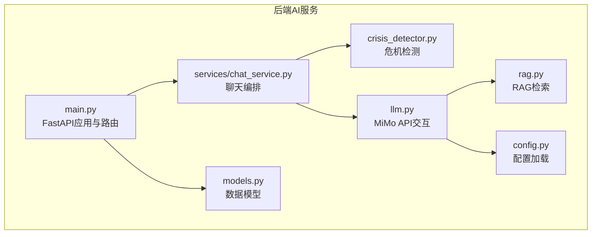
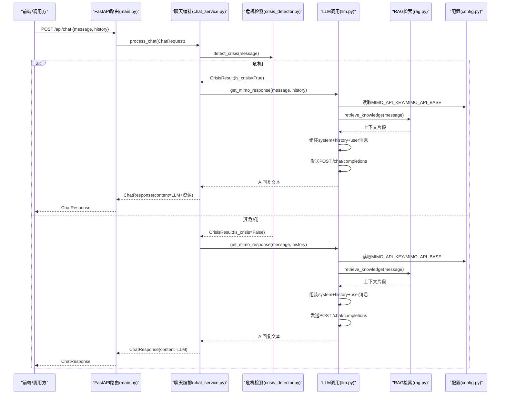
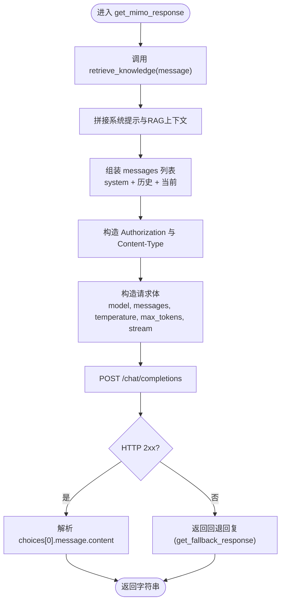
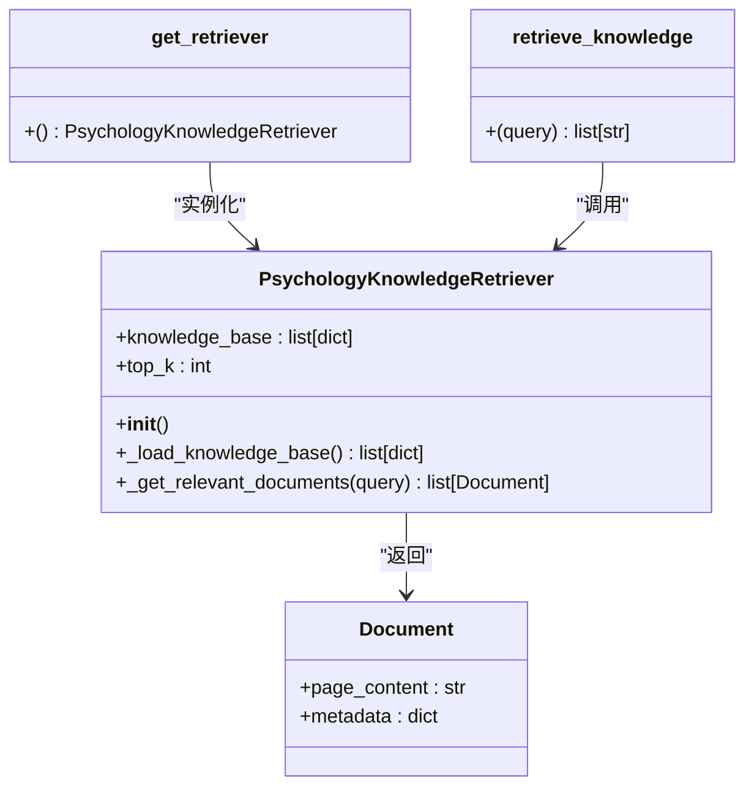
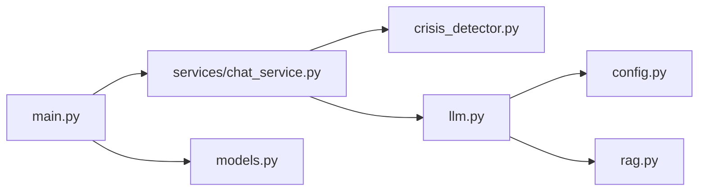

# LLM集成

<cite>
**本文引用的文件**
- [backend-ai/app/llm.py](file://backend-ai/app/llm.py)
- [backend-ai/app/rag.py](file://backend-ai/app/rag.py)
- [backend-ai/app/services/chat_service.py](file://backend-ai/app/services/chat_service.py)
- [backend-ai/app/config.py](file://backend-ai/app/config.py)
- [backend-ai/app/models.py](file://backend-ai/app/models.py)
- [backend-ai/app/crisis_detector.py](file://backend-ai/app/crisis_detector.py)
- [backend-ai/main.py](file://backend-ai/main.py)
- [backend-ai/.env.example](file://backend-ai/.env.example)
- [backend-business/MindMates.Infrastructure/Services/AiServiceClient.cs](file://backend-business/MindMates.Infrastructure/Services/AiServiceClient.cs)
</cite>

## 目录
1. [简介](#简介)
2. [项目结构](#项目结构)
3. [核心组件](#核心组件)
4. [架构总览](#架构总览)
5. [详细组件分析](#详细组件分析)
6. [依赖关系分析](#依赖关系分析)
7. [性能考量](#性能考量)
8. [故障排查指南](#故障排查指南)
9. [结论](#结论)
10. [附录](#附录)

## 简介
本文件面向开发者，系统性说明MindMates后端AI模块中LLM集成的设计与实现，重点覆盖：
- 如何通过llm.py与MiMo LLM API交互（含认证、基础地址、请求体字段）
- 如何使用MIMO_API_KEY与MIMO_API_BASE环境变量配置API客户端
- RAG（检索增强生成）机制在rag.py中的实现方式（关键词匹配、上下文注入）
- LLM响应解析与返回流程（从API到上层服务）
- 异常处理最佳实践（超时、限流、认证失败）
- 提示工程（Prompt Engineering）对回复质量的影响

## 项目结构
后端AI服务采用FastAPI提供REST接口，核心逻辑集中在backend-ai子项目中，主要文件职责如下：
- main.py：应用入口与路由定义，暴露/chat接口
- services/chat_service.py：聊天业务编排，整合危机检测与LLM调用
- llm.py：与MiMo API交互，构建消息列表、发送请求、解析响应
- rag.py：RAG检索器，基于关键词匹配从知识库抽取上下文
- crisis_detector.py：中文语义危机检测与意图分类
- config.py：读取环境变量并缓存设置
- models.py：请求/响应数据模型
- .env.example：示例环境变量配置

图表来源
- [backend-ai/main.py](file://backend-ai/main.py#L48-L90)
- [backend-ai/app/services/chat_service.py](file://backend-ai/app/services/chat_service.py#L10-L64)
- [backend-ai/app/llm.py](file://backend-ai/app/llm.py#L50-L121)
- [backend-ai/app/rag.py](file://backend-ai/app/rag.py#L120-L138)
- [backend-ai/app/crisis_detector.py](file://backend-ai/app/crisis_detector.py#L52-L123)
- [backend-ai/app/config.py](file://backend-ai/app/config.py#L1-L30)
- [backend-ai/app/models.py](file://backend-ai/app/models.py#L1-L28)

章节来源
- [backend-ai/main.py](file://backend-ai/main.py#L1-L100)
- [backend-ai/app/services/chat_service.py](file://backend-ai/app/services/chat_service.py#L1-L64)
- [backend-ai/app/llm.py](file://backend-ai/app/llm.py#L1-L170)
- [backend-ai/app/rag.py](file://backend-ai/app/rag.py#L1-L138)
- [backend-ai/app/crisis_detector.py](file://backend-ai/app/crisis_detector.py#L1-L123)
- [backend-ai/app/config.py](file://backend-ai/app/config.py#L1-L30)
- [backend-ai/app/models.py](file://backend-ai/app/models.py#L1-L28)
- [backend-ai/.env.example](file://backend-ai/.env.example#L1-L14)

## 核心组件
- 配置加载与环境变量
  - 通过BaseSettings从.env文件读取MIMO_API_KEY、MIMO_API_BASE等配置，并使用lru_cache缓存实例
- 危机检测
  - 基于关键词与正则模式检测潜在危机，同时进行一般情感意图分类
- RAG检索
  - 使用关键词匹配从静态知识库中召回相关内容，作为系统提示的上下文
- LLM调用
  - 构建系统提示、历史消息与当前用户消息，调用MiMo API的chat/completions接口
- 聊天编排
  - 在收到请求后先做危机检测，再决定是否直接返回资源或调用LLM生成回复

章节来源
- [backend-ai/app/config.py](file://backend-ai/app/config.py#L1-L30)
- [backend-ai/app/crisis_detector.py](file://backend-ai/app/crisis_detector.py#L52-L123)
- [backend-ai/app/rag.py](file://backend-ai/app/rag.py#L120-L138)
- [backend-ai/app/llm.py](file://backend-ai/app/llm.py#L50-L121)
- [backend-ai/app/services/chat_service.py](file://backend-ai/app/services/chat_service.py#L10-L64)

## 架构总览
下图展示了从HTTP请求到LLM响应的完整链路，包括RAG上下文注入与危机检测分支。

图表来源
- [backend-ai/main.py](file://backend-ai/main.py#L48-L90)
- [backend-ai/app/services/chat_service.py](file://backend-ai/app/services/chat_service.py#L10-L64)
- [backend-ai/app/crisis_detector.py](file://backend-ai/app/crisis_detector.py#L52-L123)
- [backend-ai/app/llm.py](file://backend-ai/app/llm.py#L50-L121)
- [backend-ai/app/rag.py](file://backend-ai/app/rag.py#L120-L138)
- [backend-ai/app/config.py](file://backend-ai/app/config.py#L1-L30)

## 详细组件分析

### LLM集成与MiMo API交互（llm.py）
- 环境变量配置
  - 通过config.get_settings()读取MIMO_API_KEY与MIMO_API_BASE，用于构造Authorization头与请求URL
- 请求构建
  - 消息列表包含：system（含RAG上下文）、历史消息（最多10条）、当前用户消息
  - 固定模型：mimo-v2-flash
  - 参数：temperature=0.7、max_tokens=1024、stream=false
- 调用与解析
  - 使用httpx.AsyncClient发起POST请求至“{mimo_api_base}/chat/completions”
  - 成功后解析choices[0].message.content为最终回复
- 异常处理
  - 对HTTP状态错误与通用异常捕获，打印日志并返回CBT风格的回退回复

图表来源
- [backend-ai/app/llm.py](file://backend-ai/app/llm.py#L50-L121)

章节来源
- [backend-ai/app/llm.py](file://backend-ai/app/llm.py#L50-L121)
- [backend-ai/app/config.py](file://backend-ai/app/config.py#L1-L30)
- [backend-ai/app/rag.py](file://backend-ai/app/rag.py#L120-L138)

### RAG（检索增强生成）实现（rag.py）
- 检索器设计
  - PsychologyKnowledgeRetriever继承LangChain BaseRetriever，内置关键词集合与top_k数量
  - 初始化时加载静态知识库（生产环境可替换为Milvus向量存储）
- 关键词匹配
  - 将用户查询转为小写，遍历知识库条目关键词，命中即纳入候选
  - 返回前top_k条文档内容
- 上下文注入
  - retrieve_knowledge返回文档page_content列表，由llm.py拼接到系统提示中

图表来源
- [backend-ai/app/rag.py](file://backend-ai/app/rag.py#L12-L138)

章节来源
- [backend-ai/app/rag.py](file://backend-ai/app/rag.py#L12-L138)

### 危机检测与意图分类（crisis_detector.py）
- 关键词与正则
  - 定义中文危机关键词与常见模式，用于快速判定潜在风险
- 结果封装
  - 返回CrisisResult(is_crisis, intent, crisis_response)
- 意图分类
  - 对非危机消息进行情感意图分类（如焦虑、悲伤、愤怒、压力、睡眠、工作、感情、家庭等）

章节来源
- [backend-ai/app/crisis_detector.py](file://backend-ai/app/crisis_detector.py#L52-L123)

### 聊天编排（chat_service.py）
- 流程
  - 先执行detect_crisis，若为危机则组合LLM的共情回复与标准资源文本
  - 若非危机，则直接调用LLM生成回复
- 错误兜底
  - 捕获异常并返回统一的友好提示

章节来源
- [backend-ai/app/services/chat_service.py](file://backend-ai/app/services/chat_service.py#L10-L64)

### 数据模型（models.py）
- ChatMessage：单条消息（role, content）
- ChatRequest：输入（message, history）
- ChatResponse：输出（content, intent, is_crisis）
- HealthResponse：健康检查响应

章节来源
- [backend-ai/app/models.py](file://backend-ai/app/models.py#L1-L28)

### FastAPI入口与路由（main.py）
- 提供/get与/api/chat两个端点
- /api/chat接收ChatRequest，返回ChatResponse
- 包含CORS中间件与健康检查

章节来源
- [backend-ai/main.py](file://backend-ai/main.py#L48-L90)

### 环境变量与配置（.env.example、config.py）
- .env.example展示MIMO_API_KEY、MIMO_API_BASE、VECTOR_DB_URI、REDIS_URL、DEBUG、LOG_LEVEL等
- config.py使用BaseSettings加载.env，提供默认值与类型校验

章节来源
- [backend-ai/.env.example](file://backend-ai/.env.example#L1-L14)
- [backend-ai/app/config.py](file://backend-ai/app/config.py#L1-L30)

### 与业务侧集成（AiServiceClient.cs）
- 后端业务层通过HttpClient调用后端AI服务的/api/chat
- 统一的错误兜底：当AI服务不可用时返回友好提示

章节来源
- [backend-business/MindMates.Infrastructure/Services/AiServiceClient.cs](file://backend-business/MindMates.Infrastructure/Services/AiServiceClient.cs#L1-L51)

## 依赖关系分析
- 组件耦合
  - chat_service依赖crisis_detector与llm
  - llm依赖config与rag
  - main依赖chat_service与models
- 外部依赖
  - httpx用于异步HTTP调用
  - pydantic用于数据模型与配置校验
  - LangChain（类型签名）用于检索器接口契约

图表来源
- [backend-ai/main.py](file://backend-ai/main.py#L48-L90)
- [backend-ai/app/services/chat_service.py](file://backend-ai/app/services/chat_service.py#L10-L64)
- [backend-ai/app/llm.py](file://backend-ai/app/llm.py#L50-L121)
- [backend-ai/app/rag.py](file://backend-ai/app/rag.py#L120-L138)
- [backend-ai/app/config.py](file://backend-ai/app/config.py#L1-L30)
- [backend-ai/app/models.py](file://backend-ai/app/models.py#L1-L28)

章节来源
- [backend-ai/main.py](file://backend-ai/main.py#L48-L90)
- [backend-ai/app/services/chat_service.py](file://backend-ai/app/services/chat_service.py#L10-L64)
- [backend-ai/app/llm.py](file://backend-ai/app/llm.py#L50-L121)
- [backend-ai/app/rag.py](file://backend-ai/app/rag.py#L120-L138)
- [backend-ai/app/config.py](file://backend-ai/app/config.py#L1-L30)
- [backend-ai/app/models.py](file://backend-ai/app/models.py#L1-L28)

## 性能考量
- 超时控制
  - llm.py中使用60秒超时，建议根据网络与模型延迟调整
- 并发与重试
  - 当前未实现重试与指数退避；可在httpx.AsyncClient外层增加重试策略
- 压缩与流式
  - 可开启压缩与流式响应（stream参数），但需确保上游消费端兼容
- 缓存与预热
  - RAG检索结果可按关键词做缓存；配置加载已使用lru_cache
- 日志与监控
  - 建议记录请求耗时、错误码分布与回退触发次数

## 故障排查指南
- 认证失败（401/403）
  - 检查MIMO_API_KEY是否正确设置且未过期
  - 确认Authorization头格式为Bearer Token
- 基础地址错误（404/5xx）
  - 核对MIMO_API_BASE是否指向正确的网关或代理
- 超时（504/客户端超时）
  - 提升超时阈值或优化上游网络；检查模型推理延迟
- 限流（429）
  - 降低并发或增加重试与退避；必要时引入队列
- 回退触发
  - API异常或解析失败时会触发回退回复；可通过日志定位具体原因

章节来源
- [backend-ai/app/llm.py](file://backend-ai/app/llm.py#L114-L121)

## 结论
本项目通过清晰的分层设计实现了心理咨询服务的LLM集成：配置驱动的MiMo API调用、基于关键词的RAG上下文注入、完善的危机检测与意图分类，以及稳健的异常回退机制。开发者可在此基础上扩展向量化检索、流式输出、重试与限流策略，进一步提升稳定性与用户体验。

## 附录

### 环境变量配置要点
- 必填项
  - MIMO_API_KEY：MiMo API访问令牌
  - MIMO_API_BASE：MiMo API基础地址（默认示例值见.env.example）
- 可选项
  - VECTOR_DB_URI：向量数据库地址（当前静态知识库示例）
  - REDIS_URL：缓存服务地址
  - DEBUG/LOG_LEVEL：调试与日志级别

章节来源
- [backend-ai/.env.example](file://backend-ai/.env.example#L1-L14)
- [backend-ai/app/config.py](file://backend-ai/app/config.py#L1-L30)

### 请求体字段说明（MiMo API）
- model：固定为mimo-v2-flash
- messages：数组，包含system、历史消息与当前用户消息
- temperature：0.7
- max_tokens：1024
- stream：false（当前未实现流式）

章节来源
- [backend-ai/app/llm.py](file://backend-ai/app/llm.py#L94-L100)

### 提示工程（Prompt Engineering）对回复质量的影响
- 系统提示（System Prompt）
  - 明确角色、方法论（CBT）、交互约束与语言要求
  - 将RAG上下文自然融入，避免生硬引用
- 历史消息截断
  - 仅保留最近10条，平衡上下文与成本
- 情感一致性
  - 使用温暖语气与适配移动端的短段落，提升可读性
- 危机优先级
  - 首先保障安全干预流程，再进行常规回复

章节来源
- [backend-ai/app/llm.py](file://backend-ai/app/llm.py#L13-L48)
- [backend-ai/app/llm.py](file://backend-ai/app/llm.py#L75-L87)