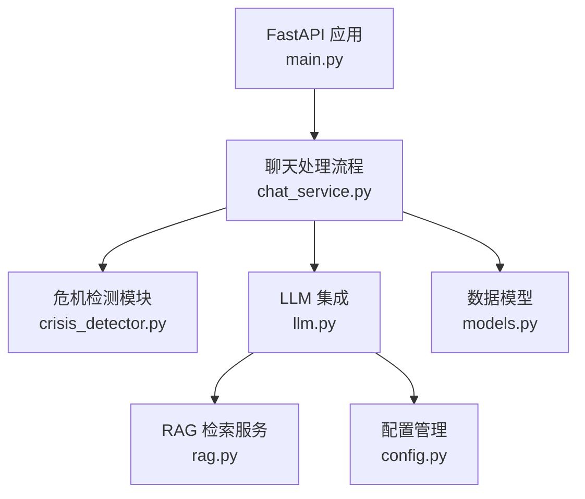
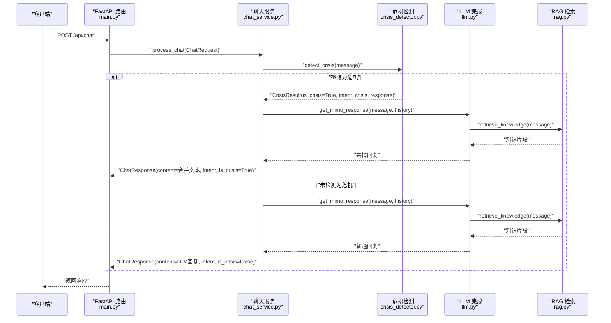
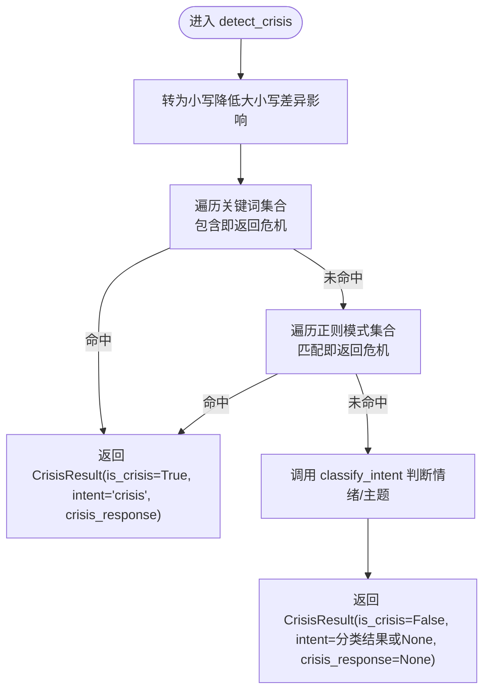
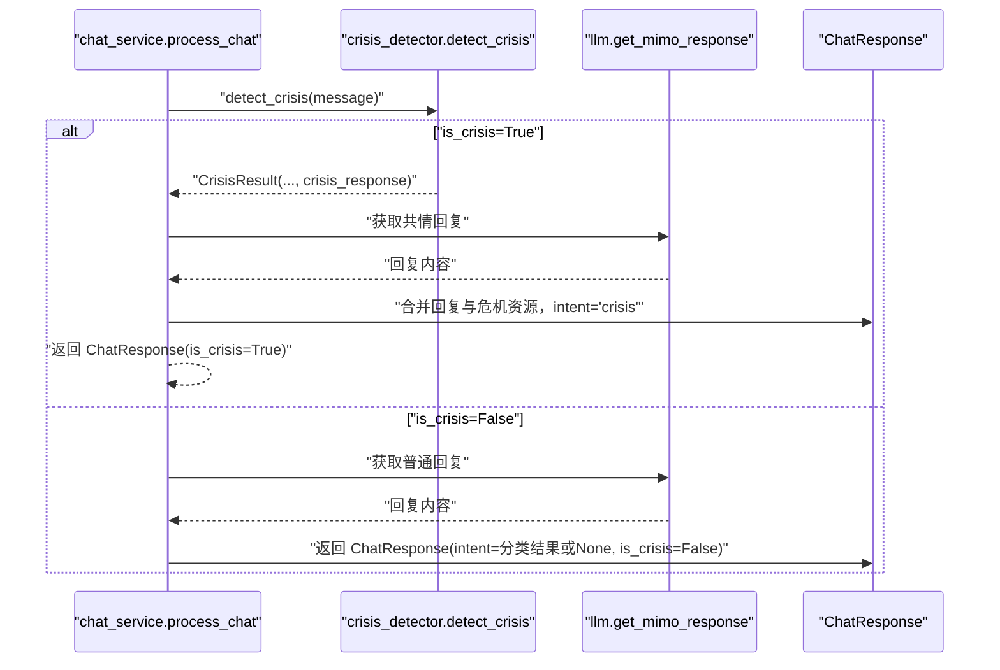
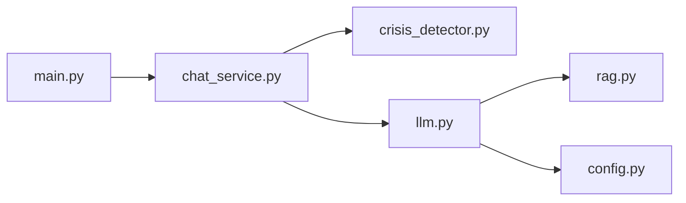

# 危机检测机制

<cite>
**本文引用的文件**
- [crisis_detector.py](file://backend-ai/app/crisis_detector.py)
- [chat_service.py](file://backend-ai/app/services/chat_service.py)
- [models.py](file://backend-ai/app/models.py)
- [llm.py](file://backend-ai/app/llm.py)
- [rag.py](file://backend-ai/app/rag.py)
- [config.py](file://backend-ai/app/config.py)
- [main.py](file://backend-ai/main.py)
</cite>

## 目录
1. [简介](#简介)
2. [项目结构](#项目结构)
3. [核心组件](#核心组件)
4. [架构总览](#架构总览)
5. [详细组件分析](#详细组件分析)
6. [依赖分析](#依赖分析)
7. [性能考虑](#性能考虑)
8. [故障排查指南](#故障排查指南)
9. [结论](#结论)
10. [附录](#附录)

## 简介
本文件聚焦于 backend-ai 子项目中的心理危机识别算法，系统性解析其如何对用户消息进行语义分析，识别表达绝望、自残或自杀倾向等高风险关键词与语言模式；并说明检测逻辑的实现方式（关键词匹配、正则模式匹配、意图分类），以及检测结果如何以布尔值 is_crisis 和可选 intent 标签的形式集成到 AI 响应中。同时，面向 AI 工程师提供优化建议（扩展敏感词库、优化判断逻辑、平衡误报与漏报），并给出检测函数的调用时机与数据流示例路径。

## 项目结构
MindMates 的 AI 后端采用 FastAPI 架构，围绕“聊天处理流程”组织模块：
- 入口与路由：FastAPI 应用在主程序中定义 /api/chat 路由，接收用户消息与历史。
- 业务编排：聊天服务负责先做危机检测，再调用 LLM 生成响应。
- 危机检测：独立模块提供关键词与正则模式匹配，返回是否危机及可选的资源文本。
- LLM 集成：通过系统提示词与 RAG 上下文生成心理辅导类回复。
- RAG 检索：基于关键词召回心理学知识片段，增强 LLM 输出的专业性。
- 配置管理：统一读取环境变量，控制 API 基础地址、密钥等。

图表来源
- [main.py](file://backend-ai/main.py#L54-L79)
- [chat_service.py](file://backend-ai/app/services/chat_service.py#L10-L64)
- [crisis_detector.py](file://backend-ai/app/crisis_detector.py#L52-L123)
- [llm.py](file://backend-ai/app/llm.py#L50-L121)
- [rag.py](file://backend-ai/app/rag.py#L120-L138)
- [config.py](file://backend-ai/app/config.py#L1-L30)
- [models.py](file://backend-ai/app/models.py#L11-L22)

章节来源
- [main.py](file://backend-ai/main.py#L54-L79)
- [chat_service.py](file://backend-ai/app/services/chat_service.py#L10-L64)
- [crisis_detector.py](file://backend-ai/app/crisis_detector.py#L52-L123)
- [llm.py](file://backend-ai/app/llm.py#L50-L121)
- [rag.py](file://backend-ai/app/rag.py#L120-L138)
- [config.py](file://backend-ai/app/config.py#L1-L30)
- [models.py](file://backend-ai/app/models.py#L11-L22)

## 核心组件
- 危机检测器（crisis_detector.py）
  - 关键词库：包含自杀、自残、绝望、暴力等高危词汇。
  - 正则模式：覆盖“想死”“不想活”“活不下去”“没有希望”“结束一切”等常见表达。
  - 返回结构：CrisisResult，包含 is_crisis、intent、crisis_response。
  - 意图分类：对非危机消息进行情绪/主题分类（如焦虑、悲伤、愤怒、孤独、压力、睡眠问题、工作、感情、家庭）。
- 聊天服务（chat_service.py）
  - 调用 detect_crisis 判断是否危机。
  - 若是危机：合并 LLM 的共情回复与标准危机资源文本，返回 is_crisis=True。
  - 若否：直接获取 LLM 回复，返回 is_crisis=False。
- LLM 集成（llm.py）
  - 使用系统提示词（含“安全与危机干预”指令）与 RAG 上下文生成回复。
  - 异常兜底：API 失败时返回共情式 fallback 响应。
- RAG 检索（rag.py）
  - 基于关键词匹配召回心理学知识片段，作为上下文增强 LLM。
- 数据模型（models.py）
  - ChatRequest/ChatResponse 定义请求与响应字段，包含 content、intent、is_crisis。

章节来源
- [crisis_detector.py](file://backend-ai/app/crisis_detector.py#L16-L123)
- [chat_service.py](file://backend-ai/app/services/chat_service.py#L10-L64)
- [llm.py](file://backend-ai/app/llm.py#L50-L170)
- [rag.py](file://backend-ai/app/rag.py#L120-L138)
- [models.py](file://backend-ai/app/models.py#L11-L22)

## 架构总览
下图展示从客户端到 AI 响应的关键交互链路，重点标注危机检测与 LLM 生成的衔接点。

图表来源
- [main.py](file://backend-ai/main.py#L54-L79)
- [chat_service.py](file://backend-ai/app/services/chat_service.py#L10-L64)
- [crisis_detector.py](file://backend-ai/app/crisis_detector.py#L52-L123)
- [llm.py](file://backend-ai/app/llm.py#L50-L121)
- [rag.py](file://backend-ai/app/rag.py#L120-L138)

## 详细组件分析

### 危机检测器（crisis_detector.py）
- 功能定位
  - 在用户消息进入 LLM 之前进行快速筛查，优先保障安全。
  - 返回 is_crisis 标志位与可选 intent，便于前端与业务侧区分处理。
- 关键实现要点
  - 关键词匹配：对预设的中文高危词汇集合进行包含判断，命中即判定为危机。
  - 正则模式匹配：对常见表达模式进行模糊匹配，提升覆盖面。
  - 意图分类：若非危机，对情绪与主题进行分类，辅助后续对话策略。
- 返回结构
  - CrisisResult 结构体包含 is_crisis、intent、crisis_response 三要素，便于上层统一处理。
- 代码片段路径
  - [detect_crisis 函数](file://backend-ai/app/crisis_detector.py#L52-L89)
  - [classify_intent 函数](file://backend-ai/app/crisis_detector.py#L92-L123)
  - [CrisisResult 类型定义](file://backend-ai/app/crisis_detector.py#L10-L14)
  - [CRISIS_KEYWORDS 与 CRISIS_PATTERNS](file://backend-ai/app/crisis_detector.py#L16-L38)
  - [CRISIS_RESOURCES 资源文本](file://backend-ai/app/crisis_detector.py#L39-L49)

图表来源
- [crisis_detector.py](file://backend-ai/app/crisis_detector.py#L52-L123)

章节来源
- [crisis_detector.py](file://backend-ai/app/crisis_detector.py#L16-L123)

### 聊天服务（chat_service.py）
- 流程职责
  - 先调用 detect_crisis 判断是否危机。
  - 若是危机：先获取 LLM 的共情回复，再拼接标准危机资源文本，最终返回 is_crisis=True。
  - 若否：直接获取 LLM 回复，返回 is_crisis=False。
- 错误处理
  - LLM 调用异常时返回兜底提示，避免服务中断。
- 代码片段路径
  - [process_chat 函数](file://backend-ai/app/services/chat_service.py#L10-L64)

图表来源
- [chat_service.py](file://backend-ai/app/services/chat_service.py#L10-L64)
- [crisis_detector.py](file://backend-ai/app/crisis_detector.py#L52-L89)
- [llm.py](file://backend-ai/app/llm.py#L50-L121)
- [models.py](file://backend-ai/app/models.py#L17-L22)

章节来源
- [chat_service.py](file://backend-ai/app/services/chat_service.py#L10-L64)
- [models.py](file://backend-ai/app/models.py#L17-L22)

### LLM 集成与 RAG（llm.py、rag.py）
- 系统提示词与安全协议
  - 明确在用户表达自伤/自杀/伤害他人意图时，立即触发危机协议，优先强调安全与求助渠道。
- RAG 上下文
  - 基于关键词召回心理学知识片段，内化为自然表达，避免生硬引用来源。
- 异常兜底
  - API 请求失败或异常时，返回共情式 fallback 响应，维持用户体验。
- 代码片段路径
  - [COUNSELOR_SYSTEM_PROMPT（含安全与危机干预）](file://backend-ai/app/llm.py#L14-L47)
  - [get_mimo_response 主流程](file://backend-ai/app/llm.py#L50-L121)
  - [get_fallback_response 情绪化兜底](file://backend-ai/app/llm.py#L123-L170)
  - [retrieve_knowledge 与 PsychologyKnowledgeRetriever](file://backend-ai/app/rag.py#L120-L138)

章节来源
- [llm.py](file://backend-ai/app/llm.py#L14-L170)
- [rag.py](file://backend-ai/app/rag.py#L12-L118)

### 数据模型（models.py）
- ChatRequest：包含 message 与历史消息列表。
- ChatResponse：包含 content、intent、is_crisis 字段，用于前端渲染与业务侧分流。
- 代码片段路径
  - [ChatRequest/ChatResponse 定义](file://backend-ai/app/models.py#L11-L22)

章节来源
- [models.py](file://backend-ai/app/models.py#L11-L22)

## 依赖分析
- 模块耦合
  - chat_service 依赖 crisis_detector 与 llm，形成“先检测、后生成”的串行依赖。
  - llm 依赖 rag 进行知识检索，增强输出的专业性。
- 外部依赖
  - MiMo API（通过 config 中的密钥与基础地址访问）。
  - LangChain（RAG 检索框架）。
- 可能的循环依赖
  - 当前模块间为单向依赖，无循环导入迹象。
  

图表来源
- [chat_service.py](file://backend-ai/app/services/chat_service.py#L1-L9)
- [crisis_detector.py](file://backend-ai/app/crisis_detector.py#L1-L14)
- [llm.py](file://backend-ai/app/llm.py#L1-L12)
- [rag.py](file://backend-ai/app/rag.py#L1-L11)
- [config.py](file://backend-ai/app/config.py#L1-L30)
- [main.py](file://backend-ai/main.py#L10-L13)

章节来源
- [chat_service.py](file://backend-ai/app/services/chat_service.py#L1-L9)
- [crisis_detector.py](file://backend-ai/app/crisis_detector.py#L1-L14)
- [llm.py](file://backend-ai/app/llm.py#L1-L12)
- [rag.py](file://backend-ai/app/rag.py#L1-L11)
- [config.py](file://backend-ai/app/config.py#L1-L30)
- [main.py](file://backend-ai/main.py#L10-L13)

## 性能考虑
- 危机检测复杂度
  - 关键词匹配与正则匹配均为线性扫描，时间复杂度近似 O(n+m)，其中 n 为关键词数量，m 为模式数量。对单条消息开销极低，适合在请求链路前置执行。
- LLM 调用成本
  - RAG 检索与外部 API 调用为主要耗时环节。建议：
    - 控制检索 top_k 数量，减少上下文长度。
    - 合理缓存热点知识片段（可在生产环境接入向量数据库）。
    - 适度降低 max_tokens 与 temperature，平衡质量与延迟。
- 并发与超时
  - FastAPI 默认异步处理；建议为外部 API 设置合理超时与重试策略，避免阻塞请求队列。

## 故障排查指南
- 危机检测未生效
  - 检查 message 是否包含中文高危词汇或符合正则模式；确认输入大小写不影响匹配（当前已统一转小写）。
  - 确认 detect_crisis 返回的 is_crisis 是否被上层正确读取。
- LLM 响应为空或异常
  - 查看 llm.get_mimo_response 的异常分支，确认是否触发了 fallback。
  - 检查 config 中的 MIMO_API_KEY 与 MIMO_API_BASE 是否正确配置。
- 危机资源未拼接
  - 确认 chat_service 在 is_crisis=True 时合并了 crisis_response 与 LLM 回复。
- 代码片段路径参考
  - [detect_crisis 与 classify_intent](file://backend-ai/app/crisis_detector.py#L52-L123)
  - [process_chat 危机分支与合并逻辑](file://backend-ai/app/services/chat_service.py#L25-L43)
  - [get_mimo_response 与异常兜底](file://backend-ai/app/llm.py#L50-L121)
  - [config 配置项](file://backend-ai/app/config.py#L1-L30)

章节来源
- [crisis_detector.py](file://backend-ai/app/crisis_detector.py#L52-L123)
- [chat_service.py](file://backend-ai/app/services/chat_service.py#L25-L43)
- [llm.py](file://backend-ai/app/llm.py#L50-L121)
- [config.py](file://backend-ai/app/config.py#L1-L30)

## 结论
该危机检测机制以“关键词+正则模式”为核心，结合意图分类与 LLM 共情回复，在保证安全的前提下提供人性化心理支持。其调用链清晰、模块职责明确，适合在实时聊天场景中前置部署。为进一步提升准确性与鲁棒性，建议持续扩展敏感词库、引入上下文一致性评估与情感强度阈值，并在生产环境接入向量数据库与更丰富的心理学知识库。

## 附录

### 调用时机与数据流示例
- 入口路由
  - [POST /api/chat](file://backend-ai/main.py#L54-L79)
- 危机检测调用
  - [detect_crisis(message)](file://backend-ai/app/crisis_detector.py#L52-L89)
- 危机分支响应
  - [合并 LLM 回复与危机资源](file://backend-ai/app/services/chat_service.py#L31-L43)
- 非危机分支响应
  - [直接获取 LLM 回复](file://backend-ai/app/services/chat_service.py#L46-L56)
- LLM 与 RAG
  - [get_mimo_response](file://backend-ai/app/llm.py#L50-L121)
  - [retrieve_knowledge](file://backend-ai/app/rag.py#L125-L138)