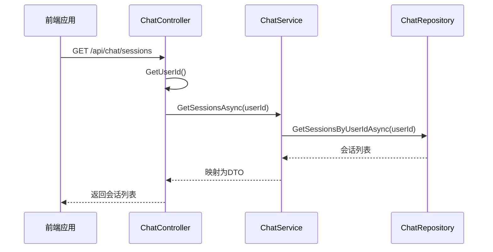
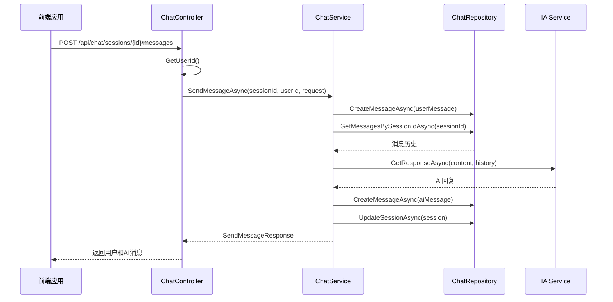
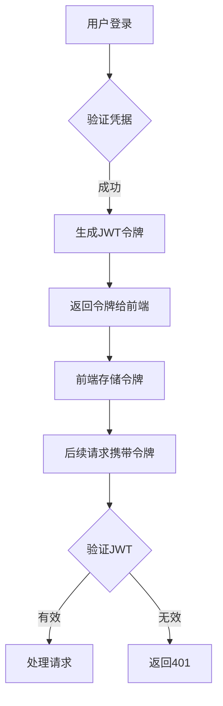
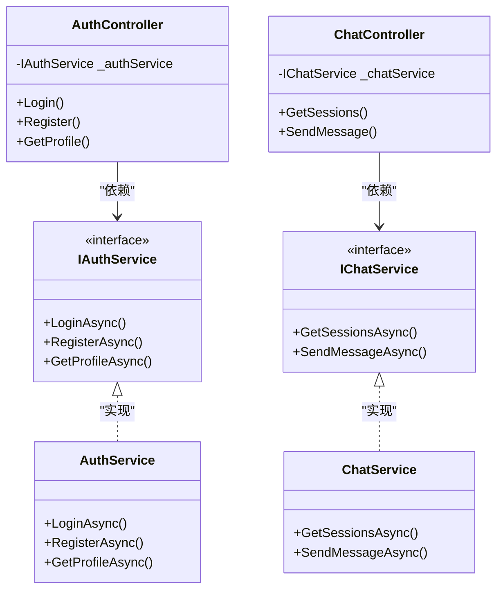
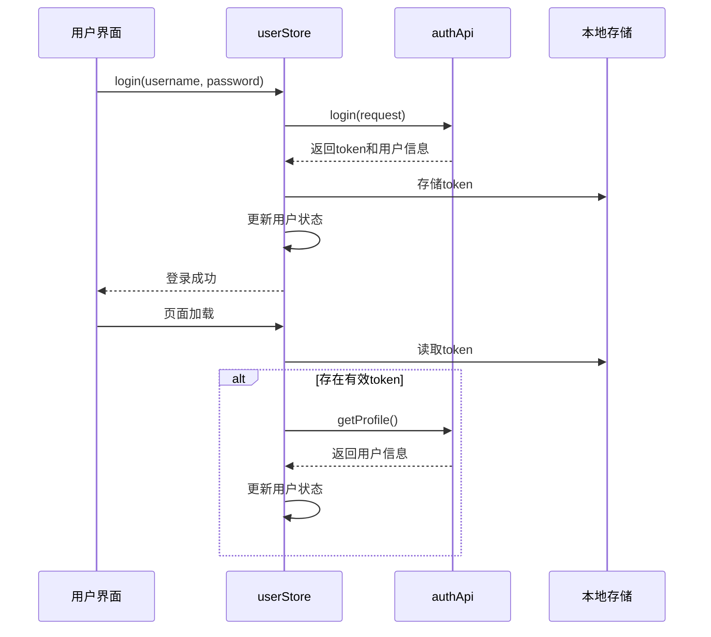
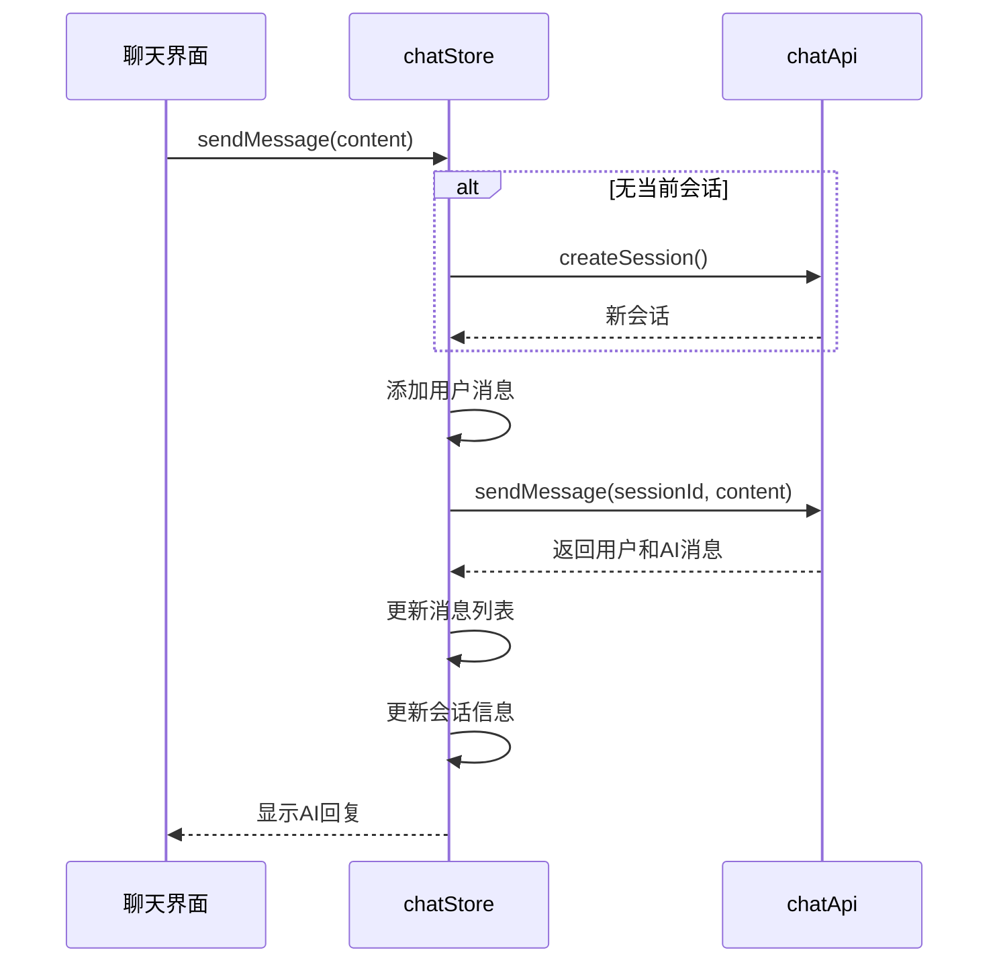

# API端点

<cite>
**本文档中引用的文件**  
- [AuthController.cs](file://backend-business/MindMates.Api/Controllers/AuthController.cs)
- [ChatController.cs](file://backend-business/MindMates.Api/Controllers/ChatController.cs)
- [AuthDtos.cs](file://backend-business/MindMates.Application/DTOs/AuthDtos.cs)
- [ChatDtos.cs](file://backend-business/MindMates.Application/DTOs/ChatDtos.cs)
- [IAuthService.cs](file://backend-business/MindMates.Application/Services/IAuthService.cs)
- [IChatService.cs](file://backend-business/MindMates.Application/Services/IChatService.cs)
- [AuthService.cs](file://backend-business/MindMates.Infrastructure/Services/AuthService.cs)
- [ChatService.cs](file://backend-business/MindMates.Infrastructure/Services/ChatService.cs)
- [Program.cs](file://backend-business/MindMates.Api/Program.cs)
- [appsettings.json](file://backend-business/MindMates.Api/appsettings.json)
- [auth.ts](file://frontend/src/api/auth.ts)
- [chat.ts](file://frontend/src/api/chat.ts)
- [user.ts](file://frontend/src/stores/user.ts)
- [chat.ts](file://frontend/src/stores/chat.ts)
</cite>

## 目录
1. [简介](#简介)
2. [认证API](#认证api)
3. [聊天会话API](#聊天会话api)
4. [权限控制与认证机制](#权限控制与认证机制)
5. [前端集成指南](#前端集成指南)
6. [错误处理与状态码](#错误处理与状态码)
7. [安全配置](#安全配置)

## 简介
MindMates是一个心理健康AI伴侣平台，其业务后端提供了一套完整的RESTful API，支持用户认证、个人资料管理以及与AI助手的聊天交互功能。本API文档详细说明了所有公开端点的使用方法，包括请求格式、响应结构、认证要求和错误处理机制，旨在为前端开发者提供清晰的集成指导。

**文档来源**
- [AuthController.cs](file://backend-business/MindMates.Api/Controllers/AuthController.cs)
- [ChatController.cs](file://backend-business/MindMates.Api/Controllers/ChatController.cs)

## 认证API

### 登录 (/api/auth/login)
- **HTTP方法**: POST
- **描述**: 用户使用用户名和密码进行身份验证，成功后返回JWT令牌和用户信息
- **请求头**: Content-Type: application/json
- **请求体**:
  ```json
  {
    "username": "string",
    "password": "string"
  }
  ```
- **成功响应 (200)**:
  ```json
  {
    "token": "string",
    "user": {
      "id": "guid",
      "username": "string",
      "nickname": "string",
      "email": "string",
      "avatar": "string",
      "createdAt": "datetime"
    }
  }
  ```
- **错误响应**:
  - 401 Unauthorized: 用户名或密码错误

**Section sources**
- [AuthController.cs](file://backend-business/MindMates.Api/Controllers/AuthController.cs#L20-L32)
- [AuthDtos.cs](file://backend-business/MindMates.Application/DTOs/AuthDtos.cs#L4)
- [AuthService.cs](file://backend-business/MindMates.Infrastructure/Services/AuthService.cs#L24-L34)

### 注册 (/api/auth/register)
- **HTTP方法**: POST
- **描述**: 创建新用户账户
- **请求头**: Content-Type: application/json
- **请求体**:
  ```json
  {
    "username": "string",
    "password": "string",
    "nickname": "string"
  }
  ```
- **成功响应 (200)**: 同登录响应
- **错误响应**:
  - 400 Bad Request: 用户名已存在

**Section sources**
- [AuthController.cs](file://backend-business/MindMates.Api/Controllers/AuthController.cs#L34-L46)
- [AuthDtos.cs](file://backend-business/MindMates.Application/DTOs/AuthDtos.cs#L5)
- [AuthService.cs](file://backend-business/MindMates.Infrastructure/Services/AuthService.cs#L36-L54)

### 获取个人资料 (/api/auth/profile)
- **HTTP方法**: GET
- **描述**: 获取当前登录用户的个人资料信息
- **请求头**: Authorization: Bearer {token}
- **成功响应 (200)**: 返回UserDto对象
- **错误响应**:
  - 401 Unauthorized: 无效或缺失令牌
  - 404 Not Found: 用户不存在

**Section sources**
- [AuthController.cs](file://backend-business/MindMates.Api/Controllers/AuthController.cs#L48-L62)
- [AuthDtos.cs](file://backend-business/MindMates.Application/DTOs/AuthDtos.cs#L10-L17)
- [AuthService.cs](file://backend-business/MindMates.Infrastructure/Services/AuthService.cs#L56-L64)

### 更新个人资料 (/api/auth/profile)
- **HTTP方法**: PUT
- **描述**: 更新用户的昵称和邮箱
- **请求头**: Authorization: Bearer {token}
- **请求体**:
  ```json
  {
    "nickname": "string",
    "email": "string"
  }
  ```
- **成功响应 (200)**: 返回更新后的UserDto
- **错误响应**: 404 Not Found: 用户不存在

**Section sources**
- [AuthController.cs](file://backend-business/MindMates.Api/Controllers/AuthController.cs#L64-L78)
- [AuthDtos.cs](file://backend-business/MindMates.Application/DTOs/AuthDtos.cs#L19)
- [AuthService.cs](file://backend-business/MindMates.Infrastructure/Services/AuthService.cs#L66-L79)

### 修改密码 (/api/auth/change-password)
- **HTTP方法**: POST
- **描述**: 修改当前用户的密码
- **请求头**: Authorization: Bearer {token}
- **请求体**:
  ```json
  {
    "oldPassword": "string",
    "newPassword": "string"
  }
  ```
- **成功响应 (200)**:
  ```json
  {
    "message": "密码修改成功"
  }
  ```
- **错误响应**:
  - 401 Unauthorized: 原密码错误
  - 404 Not Found: 用户不存在

**Section sources**
- [AuthController.cs](file://backend-business/MindMates.Api/Controllers/AuthController.cs#L80-L98)
- [AuthDtos.cs](file://backend-business/MindMates.Application/DTOs/AuthDtos.cs#L7)
- [AuthService.cs](file://backend-business/MindMates.Infrastructure/Services/AuthService.cs#L81-L96)

## 聊天会话API

### 获取会话列表 (/api/chat/sessions)
- **HTTP方法**: GET
- **描述**: 获取当前用户的所有聊天会话
- **请求头**: Authorization: Bearer {token}
- **成功响应 (200)**: 返回ChatSessionDto数组
- **错误响应**: 401 Unauthorized: 未授权访问



**Diagram sources**
- [ChatController.cs](file://backend-business/MindMates.Api/Controllers/ChatController.cs#L21-L27)
- [ChatService.cs](file://backend-business/MindMates.Infrastructure/Services/ChatService.cs#L19-L23)
- [ChatRepository.cs](file://backend-business/MindMates.Infrastructure/Repositories/ChatRepository.cs)

**Section sources**
- [ChatController.cs](file://backend-business/MindMates.Api/Controllers/ChatController.cs#L21-L27)
- [ChatDtos.cs](file://backend-business/MindMates.Application/DTOs/ChatDtos.cs#L4-L11)

### 创建会话 (/api/chat/sessions)
- **HTTP方法**: POST
- **描述**: 为当前用户创建新的聊天会话
- **请求头**: Authorization: Bearer {token}
- **成功响应 (200)**: 返回新创建的ChatSessionDto
- **错误响应**: 401 Unauthorized: 未授权访问

**Section sources**
- [ChatController.cs](file://backend-business/MindMates.Api/Controllers/ChatController.cs#L44-L50)
- [ChatService.cs](file://backend-business/MindMates.Infrastructure/Services/ChatService.cs#L35-L45)

### 获取会话详情 (/api/chat/sessions/{sessionId})
- **HTTP方法**: GET
- **描述**: 获取指定会话的详细信息
- **请求头**: Authorization: Bearer {token}
- **路径参数**: sessionId (GUID)
- **成功响应 (200)**: 返回ChatSessionDto
- **错误响应**:
  - 401 Unauthorized: 未授权访问
  - 404 Not Found: 会话不存在或不属于当前用户

**Section sources**
- [ChatController.cs](file://backend-business/MindMates.Api/Controllers/ChatController.cs#L29-L37)
- [ChatService.cs](file://backend-business/MindMates.Infrastructure/Services/ChatService.cs#L25-L33)

### 删除会话 (/api/chat/sessions/{sessionId})
- **HTTP方法**: DELETE
- **描述**: 删除指定的聊天会话
- **请求头**: Authorization: Bearer {token}
- **路径参数**: sessionId (GUID)
- **成功响应 (204)**: 无内容
- **错误响应**:
  - 401 Unauthorized: 未授权访问
  - 404 Not Found: 会话不存在

**Section sources**
- [ChatController.cs](file://backend-business/MindMates.Api/Controllers/ChatController.cs#L52-L65)
- [ChatService.cs](file://backend-business/MindMates.Infrastructure/Services/ChatService.cs#L47-L56)

### 获取消息列表 (/api/chat/sessions/{sessionId}/messages)
- **HTTP方法**: GET
- **描述**: 获取指定会话中的所有消息
- **请求头**: Authorization: Bearer {token}
- **路径参数**: sessionId (GUID)
- **成功响应 (200)**: 返回ChatMessageDto数组
- **错误响应**:
  - 401 Unauthorized: 未授权访问
  - 404 Not Found: 会话不存在

**Section sources**
- [ChatController.cs](file://backend-business/MindMates.Api/Controllers/ChatController.cs#L67-L79)
- [ChatDtos.cs](file://backend-business/MindMates.Application/DTOs/ChatDtos.cs#L14-L21)
- [ChatService.cs](file://backend-business/MindMates.Infrastructure/Services/ChatService.cs#L58-L68)

### 发送消息 (/api/chat/sessions/{sessionId}/messages)
- **HTTP方法**: POST
- **描述**: 向指定会话发送消息并获取AI回复
- **请求头**: Authorization: Bearer {token}
- **路径参数**: sessionId (GUID)
- **请求体**:
  ```json
  {
    "content": "string"
  }
  ```
- **成功响应 (200)**:
  ```json
  {
    "userMessage": { "ChatMessageDto" },
    "aiMessage": { "ChatMessageDto" }
  }
  ```
- **错误响应**:
  - 401 Unauthorized: 未授权访问
  - 404 Not Found: 会话不存在



**Diagram sources**
- [ChatController.cs](file://backend-business/MindMates.Api/Controllers/ChatController.cs#L82-L95)
- [ChatService.cs](file://backend-business/MindMates.Infrastructure/Services/ChatService.cs#L70-L124)
- [ChatRepository.cs](file://backend-business/MindMates.Infrastructure/Repositories/ChatRepository.cs)
- [IAiService.cs](file://backend-business/MindMates.Domain/Interfaces/IAiService.cs)

**Section sources**
- [ChatController.cs](file://backend-business/MindMates.Api/Controllers/ChatController.cs#L82-L95)
- [ChatDtos.cs](file://backend-business/MindMates.Application/DTOs/ChatDtos.cs#L27-L28)
- [ChatService.cs](file://backend-business/MindMates.Infrastructure/Services/ChatService.cs#L70-L124)

## 权限控制与认证机制

### JWT认证流程
系统采用JWT（JSON Web Token）进行身份验证和授权。用户登录成功后，服务器生成包含用户标识的JWT令牌，前端在后续请求中通过Authorization头传递该令牌。



**Diagram sources**
- [AuthService.cs](file://backend-business/MindMates.Infrastructure/Services/AuthService.cs#L98-L119)
- [Program.cs](file://backend-business/MindMates.Api/Program.cs#L48-L63)
- [AuthController.cs](file://backend-business/MindMates.Api/Controllers/AuthController.cs#L100-L108)

**Section sources**
- [AuthService.cs](file://backend-business/MindMates.Infrastructure/Services/AuthService.cs#L98-L119)
- [Program.cs](file://backend-business/MindMates.Api/Program.cs#L48-L63)

### 依赖注入与服务解耦
控制器通过构造函数注入服务实例，实现了关注点分离和依赖解耦。这种设计模式提高了代码的可测试性和可维护性。



**Diagram sources**
- [AuthController.cs](file://backend-business/MindMates.Api/Controllers/AuthController.cs#L13-L18)
- [ChatController.cs](file://backend-business/MindMates.Api/Controllers/ChatController.cs#L14-L19)
- [IAuthService.cs](file://backend-business/MindMates.Application/Services/IAuthService.cs)
- [IChatService.cs](file://backend-business/MindMates.Application/Services/IChatService.cs)
- [AuthService.cs](file://backend-business/MindMates.Infrastructure/Services/AuthService.cs)
- [ChatService.cs](file://backend-business/MindMates.Infrastructure/Services/ChatService.cs)

**Section sources**
- [AuthController.cs](file://backend-business/MindMates.Api/Controllers/AuthController.cs#L13-L18)
- [ChatController.cs](file://backend-business/MindMates.Api/Controllers/ChatController.cs#L14-L19)
- [IAuthService.cs](file://backend-business/MindMates.Application/Services/IAuthService.cs)
- [IChatService.cs](file://backend-business/MindMates.Application/Services/IChatService.cs)

## 前端集成指南

### 认证流程实现
前端通过Pinia状态管理store处理用户认证状态，包括令牌的存储、用户信息的获取和自动刷新。



**Diagram sources**
- [user.ts](file://frontend/src/stores/user.ts)
- [auth.ts](file://frontend/src/api/auth.ts)

**Section sources**
- [user.ts](file://frontend/src/stores/user.ts#L6-L68)
- [auth.ts](file://frontend/src/api/auth.ts#L4-L24)

### 聊天功能集成
聊天功能通过专门的Pinia store管理会话状态，支持会话创建、消息发送和实时更新。



**Diagram sources**
- [chat.ts](file://frontend/src/stores/chat.ts)
- [chat.ts](file://frontend/src/api/chat.ts)

**Section sources**
- [chat.ts](file://frontend/src/stores/chat.ts#L6-L139)
- [chat.ts](file://frontend/src/api/chat.ts#L4-L30)

## 错误处理与状态码
系统采用标准的HTTP状态码进行错误处理：

| 状态码 | 含义 | 常见场景 |
|--------|------|----------|
| 200 OK | 请求成功 | 所有成功的GET/POST请求 |
| 204 No Content | 请求成功但无返回内容 | DELETE操作成功 |
| 400 Bad Request | 请求参数错误 | 注册时用户名已存在 |
| 401 Unauthorized | 未授权 | 无效的JWT令牌或密码错误 |
| 404 Not Found | 资源未找到 | 用户或会话不存在 |
| 500 Internal Server Error | 服务器内部错误 | 未处理的异常 |

**Section sources**
- [AuthController.cs](file://backend-business/MindMates.Api/Controllers/AuthController.cs)
- [ChatController.cs](file://backend-business/MindMates.Api/Controllers/ChatController.cs)

## 安全配置
系统在`Program.cs`中配置了关键的安全特性：

- **JWT认证**: 使用HMAC-SHA256算法签名，令牌有效期7天
- **CORS策略**: 仅允许前端开发服务器(http://localhost:5173)访问
- **Swagger安全**: 集成了Bearer令牌认证支持，便于API测试

**Section sources**
- [Program.cs](file://backend-business/MindMates.Api/Program.cs#L48-L75)
- [appsettings.json](file://backend-business/MindMates.Api/appsettings.json#L12-L16)