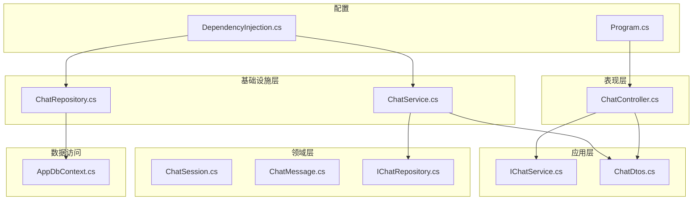
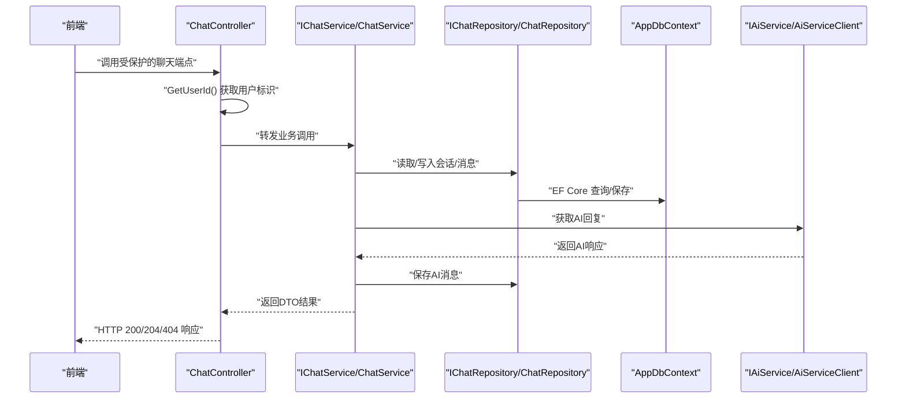
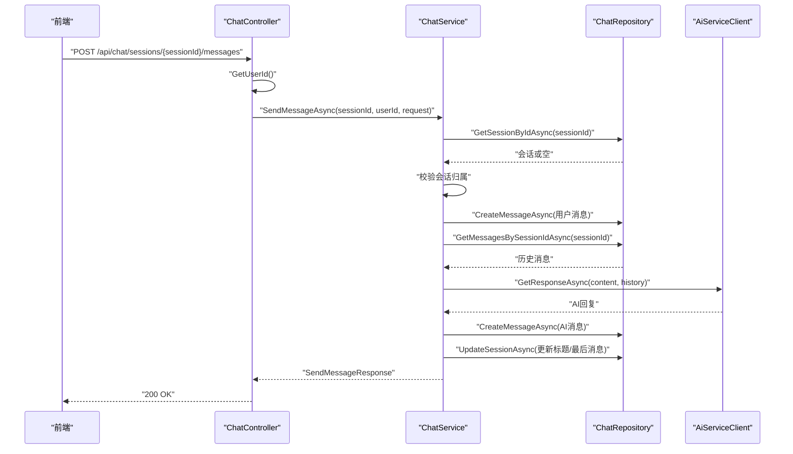
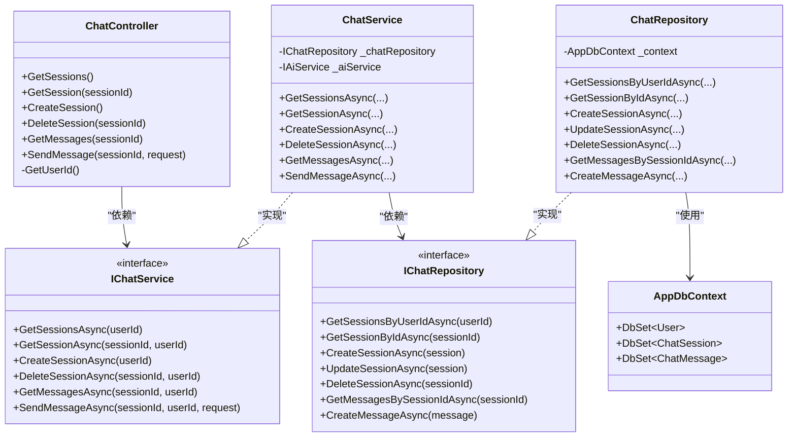

# 聊天API端点

<cite>
**本文引用的文件**
- [ChatController.cs](file://backend-business/MindMates.Api/Controllers/ChatController.cs)
- [IChatService.cs](file://backend-business/MindMates.Application/Services/IChatService.cs)
- [ChatService.cs](file://backend-business/MindMates.Infrastructure/Services/ChatService.cs)
- [ChatDtos.cs](file://backend-business/MindMates.Application/DTOs/ChatDtos.cs)
- [ChatRepository.cs](file://backend-business/MindMates.Infrastructure/Repositories/ChatRepository.cs)
- [IChatRepository.cs](file://backend-business/MindMates.Domain/Interfaces/IChatRepository.cs)
- [ChatSession.cs](file://backend-business/MindMates.Domain/Entities/ChatSession.cs)
- [ChatMessage.cs](file://backend-business/MindMates.Domain/Entities/ChatMessage.cs)
- [AppDbContext.cs](file://backend-business/MindMates.Infrastructure/Data/AppDbContext.cs)
- [DependencyInjection.cs](file://backend-business/MindMates.Infrastructure/DependencyInjection.cs)
- [Program.cs](file://backend-business/MindMates.Api/Program.cs)
- [chat.ts](file://frontend/src/api/chat.ts)
- [index.ts](file://frontend/src/types/index.ts)
</cite>

## 目录
1. [简介](#简介)
2. [项目结构](#项目结构)
3. [核心组件](#核心组件)
4. [架构总览](#架构总览)
5. [详细组件分析](#详细组件分析)
6. [依赖分析](#依赖分析)
7. [性能考虑](#性能考虑)
8. [故障排除指南](#故障排除指南)
9. [结论](#结论)
10. [附录](#附录)

## 简介
本文件为 MindMates 聊天功能的详细 API 文档，聚焦于 ChatController 中与会话与消息相关的端点。内容涵盖：
- /api/chat/sessions 组：获取会话列表、创建新会话、删除指定会话
- /api/chat/sessions/{sessionId}/messages 组：获取特定会话消息历史、发送新消息
- 权限控制（[Authorize]）、用户上下文获取（GetUserId 方法）
- 与 IChatService 的依赖关系、数据模型与返回结构
- 错误响应示例、分页建议与前端调用最佳实践

## 项目结构
后端采用分层架构：
- 表现层（API 控制器）：ChatController
- 应用层（服务接口与 DTO）：IChatService、ChatDtos
- 基础设施层（仓储与实现）：ChatRepository、ChatService
- 领域层（实体与接口）：ChatSession、ChatMessage、IChatRepository
- 数据访问（EF Core 上下文）：AppDbContext
- 依赖注入与认证配置：DependencyInjection.cs、Program.cs

图表来源
- [ChatController.cs](file://backend-business/MindMates.Api/Controllers/ChatController.cs#L1-L107)
- [IChatService.cs](file://backend-business/MindMates.Application/Services/IChatService.cs#L1-L14)
- [ChatService.cs](file://backend-business/MindMates.Infrastructure/Services/ChatService.cs#L1-L146)
- [ChatRepository.cs](file://backend-business/MindMates.Infrastructure/Repositories/ChatRepository.cs#L1-L72)
- [IChatRepository.cs](file://backend-business/MindMates.Domain/Interfaces/IChatRepository.cs#L1-L18)
- [ChatSession.cs](file://backend-business/MindMates.Domain/Entities/ChatSession.cs#L1-L32)
- [ChatMessage.cs](file://backend-business/MindMates.Domain/Entities/ChatMessage.cs#L1-L32)
- [AppDbContext.cs](file://backend-business/MindMates.Infrastructure/Data/AppDbContext.cs#L1-L59)
- [DependencyInjection.cs](file://backend-business/MindMates.Infrastructure/DependencyInjection.cs#L1-L34)
- [Program.cs](file://backend-business/MindMates.Api/Program.cs#L1-L95)

章节来源
- [Program.cs](file://backend-business/MindMates.Api/Program.cs#L1-L95)
- [DependencyInjection.cs](file://backend-business/MindMates.Infrastructure/DependencyInjection.cs#L1-L34)

## 核心组件
- ChatController：提供聊天相关 API，统一使用 [Authorize] 进行鉴权，通过 GetUserId 获取当前用户标识，并委托 IChatService 执行业务逻辑。
- IChatService：定义会话与消息操作的契约，包括获取会话列表、获取/创建/删除会话、获取消息列表、发送消息等。
- ChatService：IChatService 的实现，负责业务流程编排、调用仓储持久化、调用 AI 服务生成回复、更新会话标题与最后一条消息。
- ChatRepository：基于 EF Core 的仓储实现，提供会话与消息的 CRUD 操作。
- AppDbContext：EF Core 上下文，映射 User、ChatSession、ChatMessage 实体及其约束。
- DTOs：ChatSessionDto、ChatMessageDto、MessageMetadata、SendMessageRequest、SendMessageResponse。

章节来源
- [ChatController.cs](file://backend-business/MindMates.Api/Controllers/ChatController.cs#L1-L107)
- [IChatService.cs](file://backend-business/MindMates.Application/Services/IChatService.cs#L1-L14)
- [ChatService.cs](file://backend-business/MindMates.Infrastructure/Services/ChatService.cs#L1-L146)
- [ChatRepository.cs](file://backend-business/MindMates.Infrastructure/Repositories/ChatRepository.cs#L1-L72)
- [AppDbContext.cs](file://backend-business/MindMates.Infrastructure/Data/AppDbContext.cs#L1-L59)
- [ChatDtos.cs](file://backend-business/MindMates.Application/DTOs/ChatDtos.cs#L1-L28)

## 架构总览
下图展示从控制器到服务、仓储与数据库的调用链路，以及与 AI 服务的交互。

图表来源
- [ChatController.cs](file://backend-business/MindMates.Api/Controllers/ChatController.cs#L1-L107)
- [IChatService.cs](file://backend-business/MindMates.Application/Services/IChatService.cs#L1-L14)
- [ChatService.cs](file://backend-business/MindMates.Infrastructure/Services/ChatService.cs#L1-L146)
- [ChatRepository.cs](file://backend-business/MindMates.Infrastructure/Repositories/ChatRepository.cs#L1-L72)
- [AppDbContext.cs](file://backend-business/MindMates.Infrastructure/Data/AppDbContext.cs#L1-L59)

## 详细组件分析

### 权限控制与用户上下文
- 权限控制：ChatController 使用 [Authorize]，要求客户端在请求头携带有效的 JWT Bearer Token。
- 认证配置：Program.cs 中配置了 JWT Bearer 验证参数（发行者、受众、密钥等），并在开发环境启用 Swagger UI。
- 用户上下文：GetUserId() 从 Claims 中提取 NameIdentifier，转换为 Guid 并校验有效性，失败时抛出未授权异常。

章节来源
- [ChatController.cs](file://backend-business/MindMates.Api/Controllers/ChatController.cs#L1-L107)
- [Program.cs](file://backend-business/MindMates.Api/Program.cs#L1-L95)

### 会话端点组（/api/chat/sessions）

#### GET /api/chat/sessions
- 功能：获取当前用户的所有会话列表（按更新时间倒序）。
- 参数：无路径参数，从用户上下文中获取 userId。
- 返回：数组形式的 ChatSessionDto。
- 异常：不抛出 KeyNotFoundException（会话不存在），因此不会出现 404。
- 分页建议：当前实现按更新时间倒序返回全部会话。若会话数量较多，建议前端分页或后端增加分页参数（如 limit/offset 或游标分页）。

章节来源
- [ChatController.cs](file://backend-business/MindMates.Api/Controllers/ChatController.cs#L21-L27)
- [ChatService.cs](file://backend-business/MindMates.Infrastructure/Services/ChatService.cs#L19-L23)
- [ChatRepository.cs](file://backend-business/MindMates.Infrastructure/Repositories/ChatRepository.cs#L17-L24)

#### POST /api/chat/sessions
- 功能：为当前用户创建一个新会话。
- 参数：无路径参数，从用户上下文中获取 userId。
- 返回：新建的 ChatSessionDto。
- 异常：不抛出 KeyNotFoundException，因此不会出现 404。
- 最佳实践：创建成功后立即跳转至该会话的消息页面。

章节来源
- [ChatController.cs](file://backend-business/MindMates.Api/Controllers/ChatController.cs#L44-L50)
- [ChatService.cs](file://backend-business/MindMates.Infrastructure/Services/ChatService.cs#L35-L45)
- [ChatRepository.cs](file://backend-business/MindMates.Infrastructure/Repositories/ChatRepository.cs#L31-L36)

#### DELETE /api/chat/sessions/{sessionId}
- 功能：删除指定会话（仅限会话所属用户）。
- 参数：sessionId（GUID）作为路径参数。
- 返回：204 No Content；若会话不存在或不属于当前用户，返回 404。
- 异常：KeyNotFoundException 转换为 404。

章节来源
- [ChatController.cs](file://backend-business/MindMates.Api/Controllers/ChatController.cs#L52-L65)
- [ChatService.cs](file://backend-business/MindMates.Infrastructure/Services/ChatService.cs#L47-L56)
- [ChatRepository.cs](file://backend-business/MindMates.Infrastructure/Repositories/ChatRepository.cs#L46-L54)

### 消息端点组（/api/chat/sessions/{sessionId}/messages）

#### GET /api/chat/sessions/{sessionId}/messages
- 功能：获取指定会话的消息历史（按时间升序）。
- 参数：sessionId（GUID）作为路径参数；从用户上下文中获取 userId。
- 返回：数组形式的 ChatMessageDto。
- 异常：KeyNotFoundException 转换为 404（当会话不存在或不属于当前用户）。
- 分页建议：当前实现返回全部消息。建议前端分页或后端支持 limit/offset 或时间戳范围查询。

章节来源
- [ChatController.cs](file://backend-business/MindMates.Api/Controllers/ChatController.cs#L67-L80)
- [ChatService.cs](file://backend-business/MindMates.Infrastructure/Services/ChatService.cs#L58-L68)
- [ChatRepository.cs](file://backend-business/MindMates.Infrastructure/Repositories/ChatRepository.cs#L57-L63)

#### POST /api/chat/sessions/{sessionId}/messages
- 功能：向指定会话发送新消息，并返回用户消息与 AI 回复的组合响应。
- 参数：
  - 路径参数：sessionId（GUID）
  - 请求体：SendMessageRequest（包含 Content 字段）
- 返回：SendMessageResponse，包含 UserMessage 与 AiMessage 两个 ChatMessageDto。
- 处理流程：
  1) 校验会话归属（KeyNotFoundException -> 404）
  2) 保存用户消息
  3) 收集历史消息（Role, Content 元组）
  4) 调用 AI 服务获取回复
  5) 保存 AI 消息（含 Intent、IsCrisis 元数据）
  6) 更新会话标题（首次用户消息）与最后一条消息
  7) 返回组合响应
- 异常：KeyNotFoundException 转换为 404。

图表来源
- [ChatController.cs](file://backend-business/MindMates.Api/Controllers/ChatController.cs#L82-L95)
- [ChatService.cs](file://backend-business/MindMates.Infrastructure/Services/ChatService.cs#L70-L124)
- [ChatRepository.cs](file://backend-business/MindMates.Infrastructure/Repositories/ChatRepository.cs#L57-L71)

章节来源
- [ChatController.cs](file://backend-business/MindMates.Api/Controllers/ChatController.cs#L82-L95)
- [ChatService.cs](file://backend-business/MindMates.Infrastructure/Services/ChatService.cs#L70-L124)

### 数据模型与返回结构
- ChatSessionDto：包含 Id、UserId、Title、LastMessage、CreatedAt、UpdatedAt。
- ChatMessageDto：包含 Id、SessionId、Role、Content、CreatedAt、Metadata（可选）。
- MessageMetadata：包含 Intent（可选）与 IsCrisis（布尔）。
- SendMessageRequest：包含 Content（字符串）。
- SendMessageResponse：包含 UserMessage 与 AiMessage 两个 ChatMessageDto。

章节来源
- [ChatDtos.cs](file://backend-business/MindMates.Application/DTOs/ChatDtos.cs#L1-L28)
- [ChatSession.cs](file://backend-business/MindMates.Domain/Entities/ChatSession.cs#L1-L32)
- [ChatMessage.cs](file://backend-business/MindMates.Domain/Entities/ChatMessage.cs#L1-L32)

### 前端调用最佳实践
- 认证：确保每个请求在 Authorization 头中携带 Bearer Token。
- 会话管理：
  - 获取会话列表：GET /api/chat/sessions
  - 创建会话：POST /api/chat/sessions
  - 删除会话：DELETE /api/chat/sessions/{sessionId}
- 消息管理：
  - 获取消息历史：GET /api/chat/sessions/{sessionId}/messages
  - 发送消息：POST /api/chat/sessions/{sessionId}/messages，请求体为 { content }
- 类型与状态码：
  - 成功：200 OK；删除会话：204 No Content
  - 会话不存在或越权：404 Not Found（返回 { message }）
  - 未授权：401 Unauthorized（由 JWT 配置触发）
- 分页建议：当前实现返回全量数据，建议前端分页或后端增加分页参数。

章节来源
- [chat.ts](file://frontend/src/api/chat.ts#L1-L31)
- [index.ts](file://frontend/src/types/index.ts#L27-L52)
- [Program.cs](file://backend-business/MindMates.Api/Program.cs#L1-L95)

## 依赖分析
- 控制器依赖 IChatService
- IChatService 由 ChatService 实现
- ChatService 依赖 IChatRepository 与 IAiService
- ChatRepository 依赖 AppDbContext
- 依赖注入在 DependencyInjection.cs 中注册

图表来源
- [ChatController.cs](file://backend-business/MindMates.Api/Controllers/ChatController.cs#L1-L107)
- [IChatService.cs](file://backend-business/MindMates.Application/Services/IChatService.cs#L1-L14)
- [ChatService.cs](file://backend-business/MindMates.Infrastructure/Services/ChatService.cs#L1-L146)
- [IChatRepository.cs](file://backend-business/MindMates.Domain/Interfaces/IChatRepository.cs#L1-L18)
- [ChatRepository.cs](file://backend-business/MindMates.Infrastructure/Repositories/ChatRepository.cs#L1-L72)
- [AppDbContext.cs](file://backend-business/MindMates.Infrastructure/Data/AppDbContext.cs#L1-L59)

章节来源
- [DependencyInjection.cs](file://backend-business/MindMates.Infrastructure/DependencyInjection.cs#L1-L34)

## 性能考虑
- 会话列表与消息列表均为一次性加载，建议：
  - 后端：提供分页参数（limit/offset 或基于时间戳的游标分页）
  - 前端：懒加载、虚拟滚动、缓存最近会话与消息
- 发送消息涉及外部 AI 服务调用，建议：
  - 前端显示加载态与取消机制
  - 后端设置合理的超时与重试策略
- 数据库层面：
  - 会话按更新时间倒序、消息按创建时间排序，已具备索引基础
  - 可根据实际访问模式评估是否需要复合索引

## 故障排除指南
- 401 未授权
  - 现象：缺少或无效的 Bearer Token
  - 排查：确认 Authorization 头格式为 "Bearer {token}"，检查 JWT 密钥、发行者、受众配置
- 404 会话不存在
  - 现象：GET/DELETE/GET MESSAGES/POST SEND 在会话不存在或越权时返回 404
  - 排查：确认 sessionId 是否正确、是否属于当前用户；检查 ChatService 中的会话归属校验逻辑
- 400/500 错误
  - 现象：请求体格式错误或内部异常
  - 排查：核对请求体结构（POST /sessions/{sessionId}/messages 的 Content 字段）；查看服务日志

章节来源
- [ChatController.cs](file://backend-business/MindMates.Api/Controllers/ChatController.cs#L29-L41)
- [ChatController.cs](file://backend-business/MindMates.Api/Controllers/ChatController.cs#L52-L65)
- [ChatController.cs](file://backend-business/MindMates.Api/Controllers/ChatController.cs#L67-L80)
- [ChatController.cs](file://backend-business/MindMates.Api/Controllers/ChatController.cs#L82-L95)
- [ChatService.cs](file://backend-business/MindMates.Infrastructure/Services/ChatService.cs#L25-L33)
- [ChatService.cs](file://backend-business/MindMates.Infrastructure/Services/ChatService.cs#L47-L56)
- [ChatService.cs](file://backend-business/MindMates.Infrastructure/Services/ChatService.cs#L58-L68)
- [Program.cs](file://backend-business/MindMates.Api/Program.cs#L48-L64)

## 结论
本文档系统梳理了 MindMates 聊天 API 的端点设计、权限控制、用户上下文获取、服务依赖与数据模型，并提供了错误响应示例与前端调用最佳实践。建议后续引入分页与缓存优化以提升性能与用户体验。

## 附录

### 端点一览表
- GET /api/chat/sessions
  - 权限：[Authorize]
  - 返回：ChatSessionDto[]
  - 异常：无 404
- POST /api/chat/sessions
  - 权限：[Authorize]
  - 返回：ChatSessionDto
  - 异常：无 404
- DELETE /api/chat/sessions/{sessionId}
  - 权限：[Authorize]
  - 返回：204 No Content；404 若会话不存在或越权
- GET /api/chat/sessions/{sessionId}/messages
  - 权限：[Authorize]
  - 返回：ChatMessageDto[]
  - 异常：404 若会话不存在或越权
- POST /api/chat/sessions/{sessionId}/messages
  - 权限：[Authorize]
  - 请求体：SendMessageRequest（Content）
  - 返回：SendMessageResponse（UserMessage, AiMessage）
  - 异常：404 若会话不存在或越权

章节来源
- [ChatController.cs](file://backend-business/MindMates.Api/Controllers/ChatController.cs#L21-L95)
- [ChatDtos.cs](file://backend-business/MindMates.Application/DTOs/ChatDtos.cs#L1-L28)