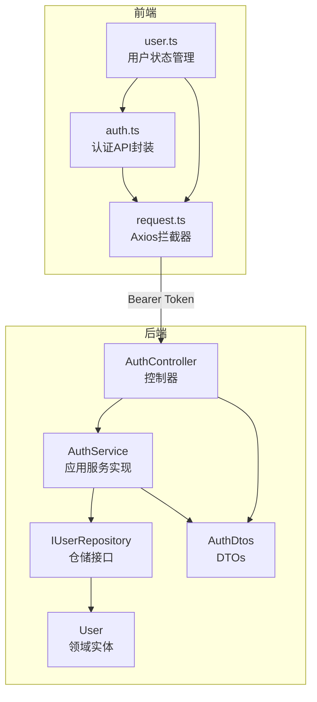
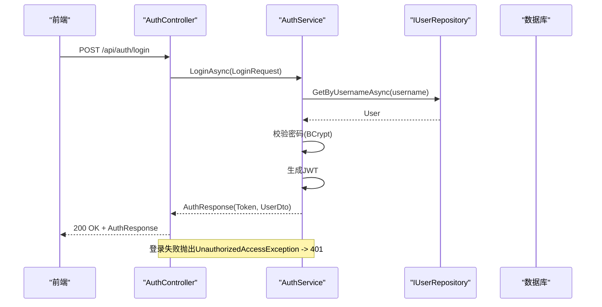
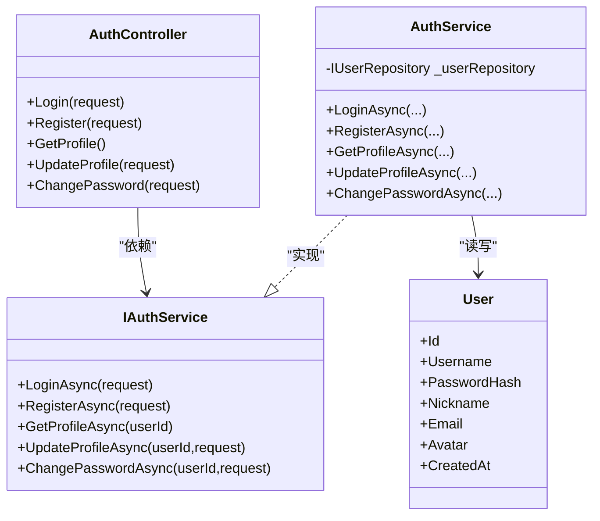

# 认证API端点

<cite>
**本文引用的文件**
- [AuthController.cs](file://backend-business/MindMates.Api/Controllers/AuthController.cs)
- [Program.cs](file://backend-business/MindMates.Api/Program.cs)
- [AuthDtos.cs](file://backend-business/MindMates.Application/DTOs/AuthDtos.cs)
- [IAuthService.cs](file://backend-business/MindMates.Application/Services/IAuthService.cs)
- [AuthService.cs](file://backend-business/MindMates.Infrastructure/Services/AuthService.cs)
- [User.cs](file://backend-business/MindMates.Domain/Entities/User.cs)
- [auth.ts](file://frontend/src/api/auth.ts)
- [request.ts](file://frontend/src/api/request.ts)
- [user.ts](file://frontend/src/stores/user.ts)
- [index.ts](file://frontend/src/types/index.ts)
- [appsettings.json](file://backend-business/MindMates.Api/appsettings.json)
</cite>

## 目录
1. [简介](#简介)
2. [项目结构](#项目结构)
3. [核心组件](#核心组件)
4. [架构总览](#架构总览)
5. [详细端点说明](#详细端点说明)
6. [依赖关系分析](#依赖关系分析)
7. [性能与安全考虑](#性能与安全考虑)
8. [故障排查指南](#故障排查指南)
9. [结论](#结论)
10. [附录：curl示例与前端集成](#附录curl示例与前端集成)

## 简介
本文件为 MindMates 业务后端认证API的完整RESTful接口文档，覆盖 AuthController 中定义的所有认证相关端点。文档重点说明：
- /login（POST）：登录流程、请求体 LoginRequest 结构、响应 AuthResponse 格式以及401未授权处理机制
- /register（POST）：注册流程、输入校验规则与400错误响应
- /profile（GET/PUT）：在JWT授权下获取与更新用户资料
- /change-password（POST）：密码修改的安全验证流程
同时结合代码中的Authorize特性、异常捕获机制与DTO数据传输对象，提供curl调用示例与前端集成建议，并强调Token在Authorization头中的使用方式。

## 项目结构
后端采用分层架构：
- 控制器层：AuthController 定义认证相关HTTP端点
- 应用层：DTOs 定义请求/响应数据模型；IAuthService 定义服务契约
- 基础设施层：AuthService 实现认证业务逻辑；User实体定义领域模型
- 前端：通过Axios封装统一请求，自动注入Authorization头

图表来源
- [AuthController.cs](file://backend-business/MindMates.Api/Controllers/AuthController.cs#L1-L110)
- [AuthService.cs](file://backend-business/MindMates.Infrastructure/Services/AuthService.cs#L1-L131)
- [AuthDtos.cs](file://backend-business/MindMates.Application/DTOs/AuthDtos.cs#L1-L20)
- [User.cs](file://backend-business/MindMates.Domain/Entities/User.cs#L1-L17)
- [auth.ts](file://frontend/src/api/auth.ts#L1-L25)
- [request.ts](file://frontend/src/api/request.ts#L1-L65)
- [user.ts](file://frontend/src/stores/user.ts#L1-L69)

章节来源
- [AuthController.cs](file://backend-business/MindMates.Api/Controllers/AuthController.cs#L1-L110)
- [Program.cs](file://backend-business/MindMates.Api/Program.cs#L1-L95)
- [AuthDtos.cs](file://backend-business/MindMates.Application/DTOs/AuthDtos.cs#L1-L20)
- [AuthService.cs](file://backend-business/MindMates.Infrastructure/Services/AuthService.cs#L1-L131)
- [User.cs](file://backend-business/MindMates.Domain/Entities/User.cs#L1-L17)
- [auth.ts](file://frontend/src/api/auth.ts#L1-L25)
- [request.ts](file://frontend/src/api/request.ts#L1-L65)
- [user.ts](file://frontend/src/stores/user.ts#L1-L69)

## 核心组件
- 控制器：AuthController 提供认证相关端点，使用 [Authorize] 特性保护需要鉴权的路由
- 应用服务：IAuthService 定义登录、注册、获取/更新资料、改密等契约；AuthService 实现具体逻辑
- DTOs：LoginRequest、RegisterRequest、AuthResponse、ChangePasswordRequest、UserDto、UpdateUserRequest
- 领域实体：User 包含用户标识、凭据与元信息
- 前端封装：auth.ts 统一封装认证API；request.ts 在请求前自动添加Authorization头；user.ts 管理登录态与本地存储

章节来源
- [IAuthService.cs](file://backend-business/MindMates.Application/Services/IAuthService.cs#L1-L13)
- [AuthService.cs](file://backend-business/MindMates.Infrastructure/Services/AuthService.cs#L1-L131)
- [AuthDtos.cs](file://backend-business/MindMates.Application/DTOs/AuthDtos.cs#L1-L20)
- [User.cs](file://backend-business/MindMates.Domain/Entities/User.cs#L1-L17)
- [auth.ts](file://frontend/src/api/auth.ts#L1-L25)
- [request.ts](file://frontend/src/api/request.ts#L1-L65)
- [user.ts](file://frontend/src/stores/user.ts#L1-L69)

## 架构总览
后端通过JWT进行无状态认证，前端在每次请求中携带Authorization: Bearer <token> 头。控制器层负责路由与异常映射，应用服务层负责业务编排与仓储交互，基础设施层负责JWT签发与密码哈希。

图表来源
- [AuthController.cs](file://backend-business/MindMates.Api/Controllers/AuthController.cs#L20-L32)
- [AuthService.cs](file://backend-business/MindMates.Infrastructure/Services/AuthService.cs#L24-L34)
- [Program.cs](file://backend-business/MindMates.Api/Program.cs#L48-L63)

## 详细端点说明

### /api/auth/login（POST）
- 功能：用户登录，返回包含JWT与用户信息的响应
- 请求体：LoginRequest
  - 字段：username（字符串）、password（字符串）
- 成功响应：AuthResponse
  - 字段：token（字符串）、user（UserDto）
  - UserDto字段：id、username、nickname、email、avatar、createdAt
- 异常与状态码：
  - 401 未授权：用户名或密码错误
- 安全要点：
  - 密码使用BCrypt进行哈希比对
  - JWT由服务端签发，包含NameIdentifier、Name、Jti等声明

章节来源
- [AuthController.cs](file://backend-business/MindMates.Api/Controllers/AuthController.cs#L20-L32)
- [AuthService.cs](file://backend-business/MindMates.Infrastructure/Services/AuthService.cs#L24-L34)
- [AuthDtos.cs](file://backend-business/MindMates.Application/DTOs/AuthDtos.cs#L1-L7)
- [User.cs](file://backend-business/MindMates.Domain/Entities/User.cs#L1-L17)

### /api/auth/register（POST）
- 功能：用户注册，返回包含JWT与用户信息的响应
- 请求体：RegisterRequest
  - 字段：username（字符串）、password（字符串）、nickname（可选字符串）
- 成功响应：AuthResponse
  - 字段：token（字符串）、user（UserDto）
- 异常与状态码：
  - 400 错误：用户名已存在
- 安全要点：
  - 密码使用BCrypt进行哈希存储
  - 注册成功后立即签发JWT

章节来源
- [AuthController.cs](file://backend-business/MindMates.Api/Controllers/AuthController.cs#L34-L46)
- [AuthService.cs](file://backend-business/MindMates.Infrastructure/Services/AuthService.cs#L36-L54)
- [AuthDtos.cs](file://backend-business/MindMates.Application/DTOs/AuthDtos.cs#L1-L7)

### /api/auth/profile（GET）
- 功能：获取当前用户资料
- 鉴权要求：需要携带有效JWT（Authorization: Bearer <token>）
- 成功响应：UserDto
- 异常与状态码：
  - 401 未授权：令牌无效或无法解析用户ID
  - 404 未找到：用户不存在
- 前端集成要点：
  - 前端请求拦截器会自动附加Authorization头
  - 若401，前端会清理本地token并跳转登录页

章节来源
- [AuthController.cs](file://backend-business/MindMates.Api/Controllers/AuthController.cs#L48-L62)
- [AuthService.cs](file://backend-business/MindMates.Infrastructure/Services/AuthService.cs#L56-L64)
- [request.ts](file://frontend/src/api/request.ts#L14-L21)
- [user.ts](file://frontend/src/stores/user.ts#L37-L45)

### /api/auth/profile（PUT）
- 功能：更新当前用户资料（昵称、邮箱）
- 鉴权要求：需要携带有效JWT
- 请求体：UpdateUserRequest
  - 字段：nickname（可选字符串）、email（可选字符串）
- 成功响应：UserDto
- 异常与状态码：
  - 401 未授权：令牌无效或无法解析用户ID
  - 404 未找到：用户不存在
- 前端集成要点：
  - 前端通过 PUT /api/auth/profile 发起更新请求

章节来源
- [AuthController.cs](file://backend-business/MindMates.Api/Controllers/AuthController.cs#L64-L78)
- [AuthService.cs](file://backend-business/MindMates.Infrastructure/Services/AuthService.cs#L66-L79)
- [AuthDtos.cs](file://backend-business/MindMates.Application/DTOs/AuthDtos.cs#L19-L20)
- [request.ts](file://frontend/src/api/request.ts#L14-L21)
- [user.ts](file://frontend/src/stores/user.ts#L13-L23)

### /api/auth/change-password（POST）
- 功能：修改密码
- 鉴权要求：需要携带有效JWT
- 请求体：ChangePasswordRequest
  - 字段：oldPassword（字符串）、newPassword（字符串）
- 成功响应：空对象（仅200 OK），消息提示“密码修改成功”
- 异常与状态码：
  - 401 未授权：原密码错误
  - 404 未找到：用户不存在
- 前端集成要点：
  - 前端通过 POST /api/auth/change-password 发起修改请求

章节来源
- [AuthController.cs](file://backend-business/MindMates.Api/Controllers/AuthController.cs#L80-L98)
- [AuthService.cs](file://backend-business/MindMates.Infrastructure/Services/AuthService.cs#L81-L96)
- [AuthDtos.cs](file://backend-business/MindMates.Application/DTOs/AuthDtos.cs#L1-L7)
- [request.ts](file://frontend/src/api/request.ts#L14-L21)
- [user.ts](file://frontend/src/stores/user.ts#L13-L23)

## 依赖关系分析

图表来源
- [AuthController.cs](file://backend-business/MindMates.Api/Controllers/AuthController.cs#L1-L110)
- [IAuthService.cs](file://backend-business/MindMates.Application/Services/IAuthService.cs#L1-L13)
- [AuthService.cs](file://backend-business/MindMates.Infrastructure/Services/AuthService.cs#L1-L131)
- [User.cs](file://backend-business/MindMates.Domain/Entities/User.cs#L1-L17)

章节来源
- [AuthController.cs](file://backend-business/MindMates.Api/Controllers/AuthController.cs#L1-L110)
- [IAuthService.cs](file://backend-business/MindMates.Application/Services/IAuthService.cs#L1-L13)
- [AuthService.cs](file://backend-business/MindMates.Infrastructure/Services/AuthService.cs#L1-L131)
- [User.cs](file://backend-business/MindMates.Domain/Entities/User.cs#L1-L17)

## 性能与安全考虑
- JWT配置
  - 使用对称密钥签名，配置了发行者、受众、有效期、签名算法等参数
  - 建议生产环境使用强随机密钥与HTTPS传输
- 密码安全
  - 登录与改密均使用BCrypt进行哈希验证与存储，避免明文或弱加密
- 异常映射
  - 控制器层针对不同异常映射到标准HTTP状态码，便于前端统一处理
- 前端拦截器
  - 自动附加Authorization头，401时清理本地token并提示用户重新登录

章节来源
- [Program.cs](file://backend-business/MindMates.Api/Program.cs#L48-L63)
- [AuthService.cs](file://backend-business/MindMates.Infrastructure/Services/AuthService.cs#L24-L34)
- [request.ts](file://frontend/src/api/request.ts#L14-L21)
- [user.ts](file://frontend/src/stores/user.ts#L37-L45)

## 故障排查指南
- 401 未授权
  - 可能原因：令牌缺失、格式不正确、签名无效、过期
  - 后端表现：登录/改密/资料端点抛出UnauthorizedAccessException
  - 前端表现：拦截器检测401，清空token并跳转登录页
- 400 错误
  - 可能原因：注册时用户名已存在
  - 前端表现：显示错误消息，提示用户重试
- 404 未找到
  - 可能原因：用户不存在（资料查询/更新/改密）
  - 前端表现：提示资源不存在或引导重新登录
- 前端调试建议
  - 检查本地是否保存token
  - 确认请求头Authorization是否为Bearer <token>
  - 检查后端日志与Swagger文档

章节来源
- [AuthController.cs](file://backend-business/MindMates.Api/Controllers/AuthController.cs#L20-L32)
- [AuthService.cs](file://backend-business/MindMates.Infrastructure/Services/AuthService.cs#L36-L54)
- [request.ts](file://frontend/src/api/request.ts#L27-L62)
- [user.ts](file://frontend/src/stores/user.ts#L37-L45)

## 结论
该认证体系以JWT为核心，结合严格的异常映射与前端拦截器，提供了清晰、一致的认证体验。登录与注册返回JWT，后续受保护端点通过Authorization头携带令牌进行鉴权。密码安全采用BCrypt，注册与改密流程具备明确的错误反馈。建议在生产环境中强化密钥管理、启用HTTPS与更严格的安全策略。

## 附录：curl示例与前端集成

### curl调用示例
- 登录
  - curl -X POST http://localhost:5000/api/auth/login -H "Content-Type: application/json" -d '{"username":"<你的用户名>","password":"<你的密码>"}'
- 注册
  - curl -X POST http://localhost:5000/api/auth/register -H "Content-Type: application/json" -d '{"username":"<你的用户名>","password":"<你的密码>","nickname":"<可选昵称>"}'
- 获取资料
  - curl -X GET http://localhost:5000/api/auth/profile -H "Authorization: Bearer <你的JWT>"
- 更新资料
  - curl -X PUT http://localhost:5000/api/auth/profile -H "Authorization: Bearer <你的JWT>" -H "Content-Type: application/json" -d '{"nickname":"新昵称","email":"新邮箱"}'
- 修改密码
  - curl -X POST http://localhost:5000/api/auth/change-password -H "Authorization: Bearer <你的JWT>" -H "Content-Type: application/json" -d '{"oldPassword":"旧密码","newPassword":"新密码"}'

### 前端集成建议
- 请求拦截器
  - 自动在请求头添加Authorization: Bearer <token>
  - 401时清理token并提示用户重新登录
- 用户状态管理
  - 登录/注册成功后保存token与用户信息
  - 初始化时尝试拉取用户资料
- 类型定义
  - 前端类型与后端DTO保持一致，确保字段名与类型匹配

章节来源
- [auth.ts](file://frontend/src/api/auth.ts#L1-L25)
- [request.ts](file://frontend/src/api/request.ts#L1-L65)
- [user.ts](file://frontend/src/stores/user.ts#L1-L69)
- [index.ts](file://frontend/src/types/index.ts#L1-L67)
- [appsettings.json](file://backend-business/MindMates.Api/appsettings.json#L12-L16)