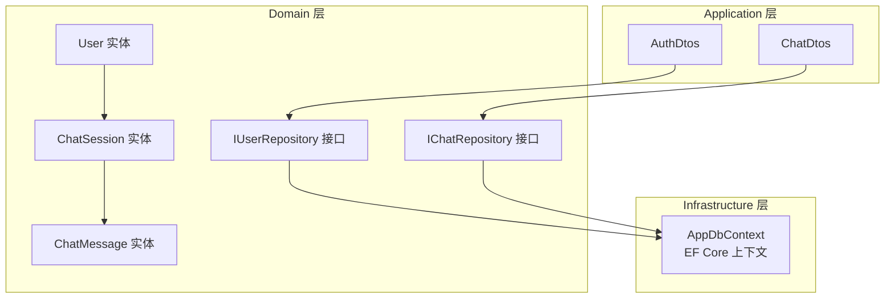
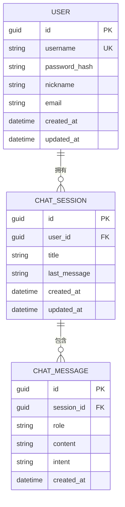
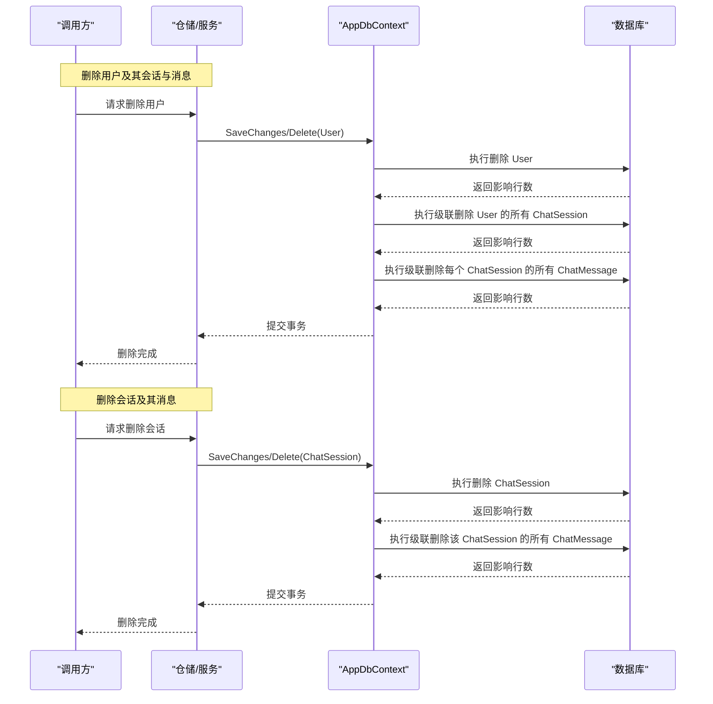
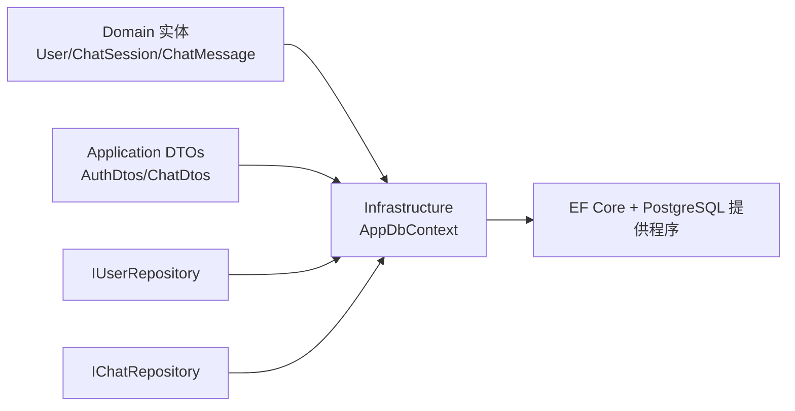
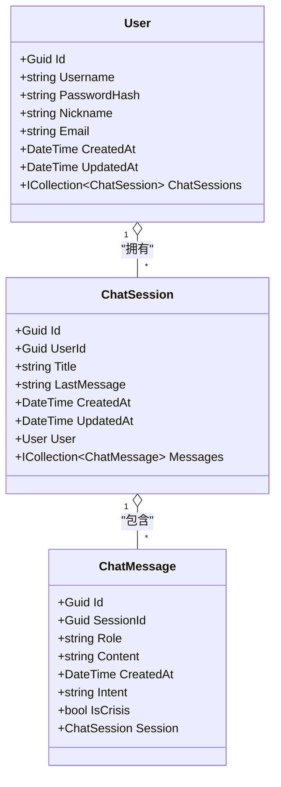

# ORM模型

<cite>
**本文引用的文件**
- [User.cs](file://backend-business/MindMates.Domain/Entities/User.cs)
- [ChatSession.cs](file://backend-business/MindMates.Domain/Entities/ChatSession.cs)
- [ChatMessage.cs](file://backend-business/MindMates.Domain/Entities/ChatMessage.cs)
- [AppDbContext.cs](file://backend-business/MindMates.Infrastructure/Data/AppDbContext.cs)
- [AuthDtos.cs](file://backend-business/MindMates.Application/DTOs/AuthDtos.cs)
- [ChatDtos.cs](file://backend-business/MindMates.Application/DTOs/ChatDtos.cs)
- [IUserRepository.cs](file://backend-business/MindMates.Domain/Interfaces/IUserRepository.cs)
- [IChatRepository.cs](file://backend-business/MindMates.Domain/Interfaces/IChatRepository.cs)
- [MindMates.Infrastructure.csproj](file://backend-business/MindMates.Infrastructure/MindMates.Infrastructure.csproj)
</cite>

## 目录
1. [简介](#简介)
2. [项目结构](#项目结构)
3. [核心组件](#核心组件)
4. [架构总览](#架构总览)
5. [详细组件分析](#详细组件分析)
6. [依赖分析](#依赖分析)
7. [性能考虑](#性能考虑)
8. [故障排查指南](#故障排查指南)
9. [结论](#结论)
10. [附录](#附录)

## 简介
本文件聚焦于应用中基于 Entity Framework Core 的数据模型设计与映射，围绕 User、ChatSession 和 ChatMessage 三个实体展开，系统梳理其属性定义、数据类型、长度限制、索引与约束，以及通过 Fluent API 在 AppDbContext 中的配置。同时阐明实体间关系：User 与 ChatSession 的一对多关联（含级联删除），ChatSession 与 ChatMessage 的一对多关联（含级联删除）。最后给出面向数据库管理员与后端开发者的性能优化建议与数据生命周期管理策略。

## 项目结构
该应用采用分层架构：
- Domain 层：定义领域实体与接口，不包含 EF 映射细节。
- Infrastructure 层：EF Core 上下文与仓储实现，负责映射与持久化。
- Application 层：DTOs 与服务接口，用于对外暴露业务数据结构。

图表来源
- [User.cs](file://backend-business/MindMates.Domain/Entities/User.cs#L1-L17)
- [ChatSession.cs](file://backend-business/MindMates.Domain/Entities/ChatSession.cs#L1-L32)
- [ChatMessage.cs](file://backend-business/MindMates.Domain/Entities/ChatMessage.cs#L1-L16)
- [AppDbContext.cs](file://backend-business/MindMates.Infrastructure/Data/AppDbContext.cs#L1-L59)
- [IUserRepository.cs](file://backend-business/MindMates.Domain/Interfaces/IUserRepository.cs#L1-L13)
- [IChatRepository.cs](file://backend-business/MindMates.Domain/Interfaces/IChatRepository.cs#L1-L18)
- [AuthDtos.cs](file://backend-business/MindMates.Application/DTOs/AuthDtos.cs#L1-L20)
- [ChatDtos.cs](file://backend-business/MindMates.Application/DTOs/ChatDtos.cs#L1-L28)

章节来源
- [AppDbContext.cs](file://backend-business/MindMates.Infrastructure/Data/AppDbContext.cs#L1-L59)
- [User.cs](file://backend-business/MindMates.Domain/Entities/User.cs#L1-L17)
- [ChatSession.cs](file://backend-business/MindMates.Domain/Entities/ChatSession.cs#L1-L32)
- [ChatMessage.cs](file://backend-business/MindMates.Domain/Entities/ChatMessage.cs#L1-L16)

## 核心组件
本节从 EF Core 视角解析三个实体的映射配置与约束，包括主键、索引、长度限制与外键关系。

- User 实体
  - 主键：Id（Guid）
  - 唯一索引：Username（唯一）
  - 非空约束：Username、PasswordHash
  - 长度限制：Username 最大长度 50；Nickname 最大长度 100；Email 最大长度 200
  - 导航属性：ICollection<ChatSession> ChatSessions

- ChatSession 实体
  - 主键：Id（Guid）
  - 非空约束：Title、LastMessage（可空）、UserId
  - 长度限制：Title 最大长度 200；LastMessage 最大长度 500
  - 外键关系：UserId -> User.Id
  - 级联删除：删除 User 时，级联删除其所有 ChatSession
  - 导航属性：User User；ICollection<ChatMessage> Messages

- ChatMessage 实体
  - 主键：Id（Guid）
  - 非空约束：Role、Content
  - 长度限制：Role 最大长度 20；Intent 最大长度 50
  - 外键关系：SessionId -> ChatSession.Id
  - 级联删除：删除 ChatSession 时，级联删除其所有 ChatMessage
  - 导航属性：ChatSession Session

章节来源
- [AppDbContext.cs](file://backend-business/MindMates.Infrastructure/Data/AppDbContext.cs#L16-L56)
- [User.cs](file://backend-business/MindMates.Domain/Entities/User.cs#L1-L17)
- [ChatSession.cs](file://backend-business/MindMates.Domain/Entities/ChatSession.cs#L1-L32)
- [ChatMessage.cs](file://backend-business/MindMates.Domain/Entities/ChatMessage.cs#L1-L16)

## 架构总览
下图展示实体关系与 EF Core 映射配置的关键点，包括主键、外键与级联删除行为。

图表来源
- [AppDbContext.cs](file://backend-business/MindMates.Infrastructure/Data/AppDbContext.cs#L16-L56)
- [User.cs](file://backend-business/MindMates.Domain/Entities/User.cs#L1-L17)
- [ChatSession.cs](file://backend-business/MindMates.Domain/Entities/ChatSession.cs#L1-L32)
- [ChatMessage.cs](file://backend-business/MindMates.Domain/Entities/ChatMessage.cs#L1-L16)

## 详细组件分析

### User 实体映射与约束
- 主键：Id（Guid）
- 唯一索引：Username（唯一）
- 非空约束：Username、PasswordHash
- 长度限制：Username(≤50)、Nickname(≤100)、Email(≤200)
- 导航属性：ICollection<ChatSession> ChatSessions
- 关系：User 与 ChatSession 为一对多，外键字段为 ChatSession.UserId

章节来源
- [AppDbContext.cs](file://backend-business/MindMates.Infrastructure/Data/AppDbContext.cs#L20-L29)
- [User.cs](file://backend-business/MindMates.Domain/Entities/User.cs#L1-L17)
- [ChatSession.cs](file://backend-business/MindMates.Domain/Entities/ChatSession.cs#L1-L32)

### ChatSession 实体映射与约束
- 主键：Id（Guid）
- 非空约束：Title、UserId
- 长度限制：Title(≤200)、LastMessage(≤500)
- 外键关系：UserId -> User.Id
- 级联删除：删除 User 时，级联删除其所有 ChatSession
- 导航属性：User User；ICollection<ChatMessage> Messages

章节来源
- [AppDbContext.cs](file://backend-business/MindMates.Infrastructure/Data/AppDbContext.cs#L31-L42)
- [ChatSession.cs](file://backend-business/MindMates.Domain/Entities/ChatSession.cs#L1-L32)

### ChatMessage 实体映射与约束
- 主键：Id（Guid）
- 非空约束：Role、Content
- 长度限制：Role(≤20)、Intent(≤50)
- 外键关系：SessionId -> ChatSession.Id
- 级联删除：删除 ChatSession 时，级联删除其所有 ChatMessage
- 导航属性：ChatSession Session

章节来源
- [AppDbContext.cs](file://backend-business/MindMates.Infrastructure/Data/AppDbContext.cs#L44-L56)
- [ChatMessage.cs](file://backend-business/MindMates.Domain/Entities/ChatMessage.cs#L1-L16)

### 关系与级联删除流程（序列图）
以下序列图展示删除 User 或 ChatSession 时，EF Core 如何根据配置执行级联删除。

图表来源
- [AppDbContext.cs](file://backend-business/MindMates.Infrastructure/Data/AppDbContext.cs#L38-L56)
- [IUserRepository.cs](file://backend-business/MindMates.Domain/Interfaces/IUserRepository.cs#L1-L13)
- [IChatRepository.cs](file://backend-business/MindMates.Domain/Interfaces/IChatRepository.cs#L1-L18)

## 依赖分析
- AppDbContext 引用 Domain 实体类型进行映射配置。
- Infrastructure 项目引用 EF Core 与 PostgreSQL 提供程序，支持 Guid 主键与时间戳等类型。
- Application 层通过 DTOs 将领域对象转换为对外传输结构，避免直接暴露实体。

图表来源
- [AppDbContext.cs](file://backend-business/MindMates.Infrastructure/Data/AppDbContext.cs#L1-L59)
- [MindMates.Infrastructure.csproj](file://backend-business/MindMates.Infrastructure/MindMates.Infrastructure.csproj#L1-L22)
- [AuthDtos.cs](file://backend-business/MindMates.Application/DTOs/AuthDtos.cs#L1-L20)
- [ChatDtos.cs](file://backend-business/MindMates.Application/DTOs/ChatDtos.cs#L1-L28)
- [IUserRepository.cs](file://backend-business/MindMates.Domain/Interfaces/IUserRepository.cs#L1-L13)
- [IChatRepository.cs](file://backend-business/MindMates.Domain/Interfaces/IChatRepository.cs#L1-L18)

章节来源
- [MindMates.Infrastructure.csproj](file://backend-business/MindMates.Infrastructure/MindMates.Infrastructure.csproj#L1-L22)
- [AppDbContext.cs](file://backend-business/MindMates.Infrastructure/Data/AppDbContext.cs#L1-L59)

## 性能考虑
- 索引策略
  - 用户名唯一索引：确保按用户名登录与注册的查询高效，避免重复用户名。
  - 可选补充索引：按创建时间排序的复合索引（例如 User.CreatedAt、ChatSession.CreatedAt、ChatMessage.CreatedAt）有助于分页与时间线查询。
- 查询效率考量
  - 使用投影（Select）仅加载必要字段，减少网络与内存开销。
  - 对频繁过滤的字段（如 ChatSession.UserId、ChatMessage.SessionId）建立索引，提升 JOIN 与 WHERE 子句性能。
  - 分页查询：对时间倒序场景使用游标或基于时间戳的分页，避免 OFFSET 过大导致的性能问题。
- 数据生命周期管理
  - 级联删除：删除用户会自动删除其所有会话与消息；删除会话会自动删除其所有消息。此策略简化了数据清理，但需注意批量删除对数据库压力与事务时间的影响。
  - 建议：对大量历史数据的定期清理，可在后台任务中分批执行，降低峰值负载。
- 其他建议
  - 使用只读查询（AsNoTracking）处理读取密集型场景，避免跟踪变更带来的额外开销。
  - 合理使用连接池与超时设置，避免长事务占用资源。

## 故障排查指南
- 常见约束错误
  - Username 为空或超长：违反唯一性或长度限制，应检查输入校验与 DTO 映射。
  - PasswordHash 为空：违反非空约束，需在注册/更新流程中强制填充。
  - Role/Content 为空：违反 ChatMessage 非空约束，需在消息发送处增加校验。
- 级联删除异常
  - 若删除用户失败或未触发级联删除，检查外键约束与 OnDelete 行为是否正确配置。
  - 确认数据库迁移已应用到目标环境，且表结构与映射一致。
- 导航属性访问
  - 若导航属性为空，确认是否正确加载 Include/ThenInclude，或在查询时显式 JOIN。
- DTO 映射一致性
  - 确保 DTO 字段与实体属性一一对应，避免因映射错误导致的序列化/反序列化问题。

章节来源
- [AppDbContext.cs](file://backend-business/MindMates.Infrastructure/Data/AppDbContext.cs#L20-L56)
- [AuthDtos.cs](file://backend-business/MindMates.Application/DTOs/AuthDtos.cs#L1-L20)
- [ChatDtos.cs](file://backend-business/MindMates.Application/DTOs/ChatDtos.cs#L1-L28)

## 结论
本数据模型通过清晰的实体定义与 Fluent API 映射，建立了稳定的三层关系：User 与 ChatSession 的一对多、ChatSession 与 ChatMessage 的一对多，并在 EF Core 中启用级联删除，简化了数据生命周期管理。配合合理的索引策略与查询优化，可在保证功能正确性的前提下提升整体性能与可维护性。

## 附录
- 实体与映射要点速查
  - User：唯一索引 Username；非空 Username、PasswordHash；长度限制 Username(50)、Nickname(100)、Email(200)。
  - ChatSession：非空 Title、UserId；长度限制 Title(200)、LastMessage(500)；外键 UserId -> User.Id；级联删除。
  - ChatMessage：非空 Role、Content；长度限制 Role(20)、Intent(50)；外键 SessionId -> ChatSession.Id；级联删除。
- 关系图（类图）

图表来源
- [User.cs](file://backend-business/MindMates.Domain/Entities/User.cs#L1-L17)
- [ChatSession.cs](file://backend-business/MindMates.Domain/Entities/ChatSession.cs#L1-L32)
- [ChatMessage.cs](file://backend-business/MindMates.Domain/Entities/ChatMessage.cs#L1-L16)