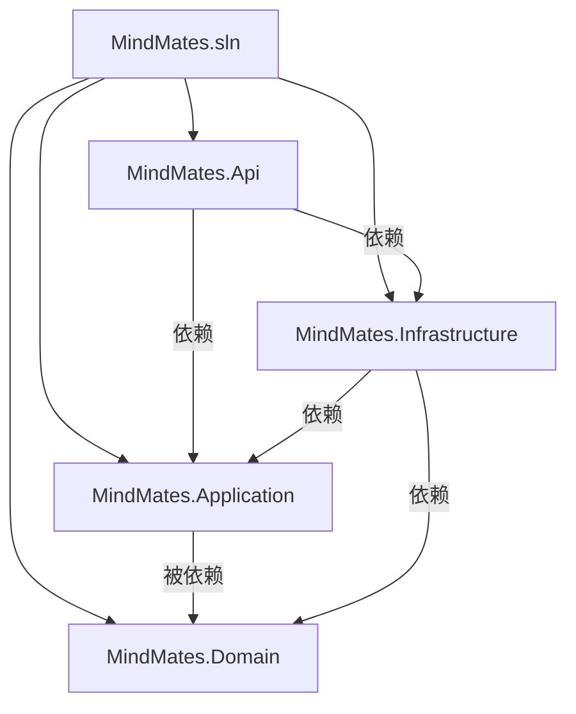
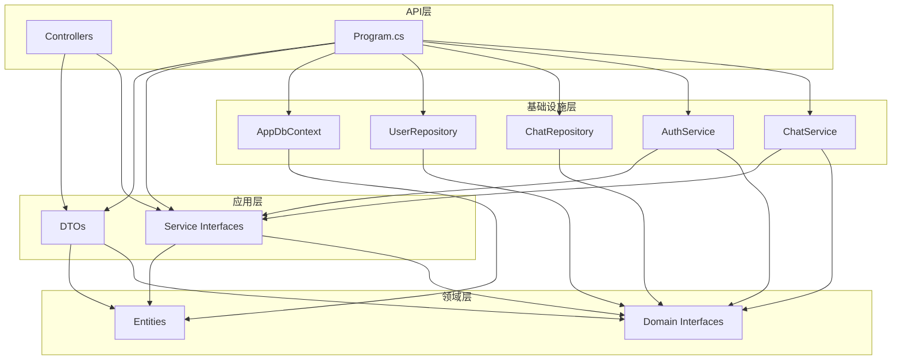
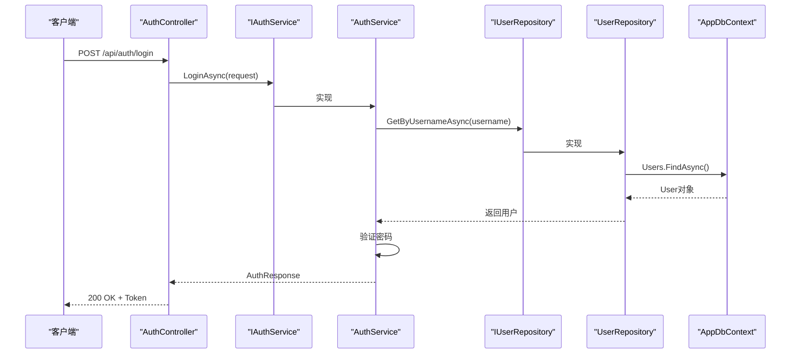
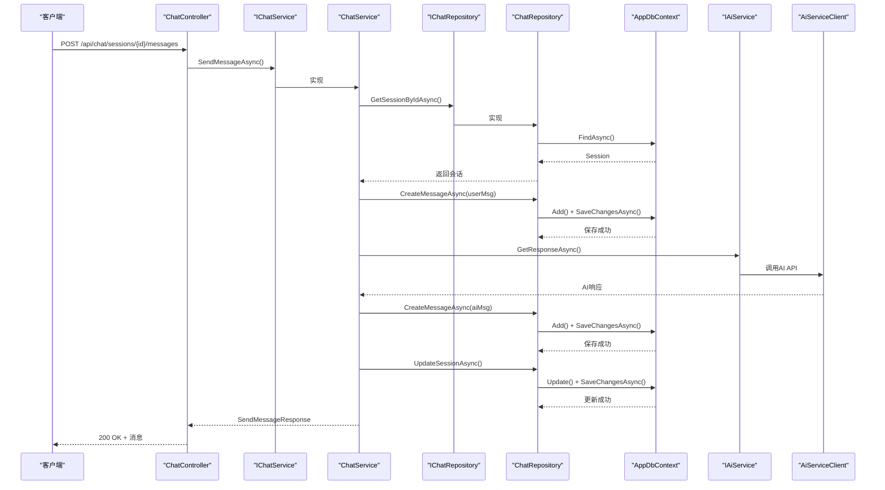
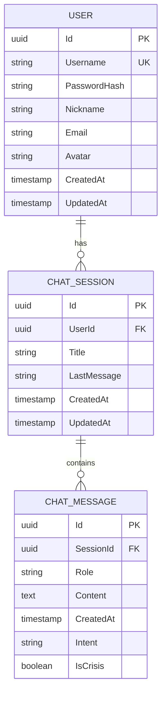

# 业务后端架构

<cite>
**本文档引用的文件**  
- [AuthController.cs](file://backend-business/MindMates.Api/Controllers/AuthController.cs)
- [ChatController.cs](file://backend-business/MindMates.Api/Controllers/ChatController.cs)
- [Program.cs](file://backend-business/MindMates.Api/Program.cs)
- [IAuthService.cs](file://backend-business/MindMates.Application/Services/IAuthService.cs)
- [IChatService.cs](file://backend-business/MindMates.Application/Services/IChatService.cs)
- [AuthDtos.cs](file://backend-business/MindMates.Application/DTOs/AuthDtos.cs)
- [ChatDtos.cs](file://backend-business/MindMates.Application/DTOs/ChatDtos.cs)
- [User.cs](file://backend-business/MindMates.Domain/Entities/User.cs)
- [ChatSession.cs](file://backend-business/MindMates.Domain/Entities/ChatSession.cs)
- [ChatMessage.cs](file://backend-business/MindMates.Domain/Entities/ChatMessage.cs)
- [AppDbContext.cs](file://backend-business/MindMates.Infrastructure/Data/AppDbContext.cs)
- [UserRepository.cs](file://backend-business/MindMates.Infrastructure/Repositories/UserRepository.cs)
- [ChatRepository.cs](file://backend-business/MindMates.Infrastructure/Repositories/ChatRepository.cs)
- [AuthService.cs](file://backend-business/MindMates.Infrastructure/Services/AuthService.cs)
- [ChatService.cs](file://backend-business/MindMates.Infrastructure/Services/ChatService.cs)
- [IAiService.cs](file://backend-business/MindMates.Domain/Interfaces/IAiService.cs)
- [IUserRepository.cs](file://backend-business/MindMates.Domain/Interfaces/IUserRepository.cs)
- [IChatRepository.cs](file://backend-business/MindMates.Domain/Interfaces/IChatRepository.cs)
</cite>

## 目录
1. [简介](#简介)
2. [项目结构](#项目结构)
3. [核心组件](#核心组件)
4. [Clean Architecture 分层设计](#clean-architecture-分层设计)
5. [请求处理流程分析](#请求处理流程分析)
6. [实体与数据库映射](#实体与数据库映射)
7. [依赖注入与服务注册](#依赖注入与服务注册)
8. [中间件配置](#中间件配置)
9. [最佳实践指南](#最佳实践指南)
10. [结论](#结论)

## 简介
MindMates 是一个心理健康AI伴侣平台，其业务后端采用Clean Architecture（清洁架构）设计模式，实现了关注点分离和高内聚低耦合。该架构将系统划分为四个主要层次：API层、应用层、领域层和基础设施层，确保业务逻辑的独立性和可测试性。本文档详细阐述了该架构的设计理念、组件交互机制以及关键实现细节，为.NET开发者提供清晰的技术指导。

## 项目结构
MindMates业务后端采用标准的分层解决方案结构，包含多个独立的项目（.csproj），每个项目对应Clean Architecture中的一个特定层次。这种物理分离强化了架构约束，防止低层组件直接依赖高层组件。

**Diagram sources**
- [MindMates.sln](file://backend-business/MindMates.sln)
- [MindMates.Api.csproj](file://backend-business/MindMates.Api/MindMates.Api.csproj)
- [MindMates.Application.csproj](file://backend-business/MindMates.Application/MindMates.Application.csproj)
- [MindMates.Domain.csproj](file://backend-business/MindMates.Domain/MindMates.Domain.csproj)
- [MindMates.Infrastructure.csproj](file://backend-business/MindMates.Infrastructure/MindMates.Infrastructure.csproj)

**Section sources**
- [backend-business](file://backend-business)

## 核心组件
本系统的核心功能围绕用户认证和聊天会话管理展开。API层通过`AuthController`和`ChatController`暴露RESTful端点；应用层通过`IAuthService`和`IChatService`接口定义服务契约；领域层的`User`、`ChatSession`和`ChatMessage`实体封装了核心业务数据；基础设施层则通过`AuthService`、`ChatService`和`AppDbContext`实现了具体的数据访问和外部服务调用。

**Section sources**
- [AuthController.cs](file://backend-business/MindMates.Api/Controllers/AuthController.cs)
- [ChatController.cs](file://backend-business/MindMates.Api/Controllers/ChatController.cs)
- [IAuthService.cs](file://backend-business/MindMates.Application/Services/IAuthService.cs)
- [IChatService.cs](file://backend-business/MindMates.Application/Services/IChatService.cs)
- [User.cs](file://backend-business/MindMates.Domain/Entities/User.cs)
- [ChatSession.cs](file://backend-business/MindMates.Domain/Entities/ChatSession.cs)
- [ChatMessage.cs](file://backend-business/MindMates.Domain/Entities/ChatMessage.cs)

## Clean Architecture 分层设计
MindMates后端严格遵循Clean Architecture原则，将代码库划分为四个逻辑层，每一层都有明确的职责和依赖方向。

**Diagram sources**
- [AuthController.cs](file://backend-business/MindMates.Api/Controllers/AuthController.cs)
- [IAuthService.cs](file://backend-business/MindMates.Application/Services/IAuthService.cs)
- [User.cs](file://backend-business/MindMates.Domain/Entities/User.cs)
- [IUserRepository.cs](file://backend-business/MindMates.Domain/Interfaces/IUserRepository.cs)
- [AppDbContext.cs](file://backend-business/MindMates.Infrastructure/Data/AppDbContext.cs)
- [AuthService.cs](file://backend-business/MindMates.Infrastructure/Services/AuthService.cs)

**Section sources**
- [backend-business/MindMates.Api](file://backend-business/MindMates.Api)
- [backend-business/MindMates.Application](file://backend-business/MindMates.Application)
- [backend-business/MindMates.Domain](file://backend-business/MindMates.Domain)
- [backend-business/MindMates.Infrastructure](file://backend-business/MindMates.Infrastructure)

### API层（Controllers）
API层是系统的入口点，负责处理HTTP请求和响应。`AuthController`和`ChatController`位于`MindMates.Api.Controllers`命名空间下，它们通过构造函数注入应用层服务接口（如`IAuthService`），实现了RESTful API端点。该层不包含任何业务逻辑，仅负责参数验证、调用服务和返回结果。

**Section sources**
- [AuthController.cs](file://backend-business/MindMates.Api/Controllers/AuthController.cs)
- [ChatController.cs](file://backend-business/MindMates.Api/Controllers/ChatController.cs)

### 应用层（DTOs、Services接口）
应用层定义了系统的核心契约。`MindMates.Application.DTOs`命名空间下的记录类型（如`LoginRequest`, `AuthResponse`）用于在层间传输数据，确保了数据结构的不可变性和清晰性。`MindMates.Application.Services`命名空间下的接口（`IAuthService`, `IChatService`）定义了业务操作的契约，为领域逻辑提供了抽象。

**Section sources**
- [AuthDtos.cs](file://backend-business/MindMates.Application/DTOs/AuthDtos.cs)
- [ChatDtos.cs](file://backend-business/MindMates.Application/DTOs/ChatDtos.cs)
- [IAuthService.cs](file://backend-business/MindMates.Application/Services/IAuthService.cs)
- [IChatService.cs](file://backend-business/MindMates.Application/Services/IChatService.cs)

### 领域层（Entities、Interfaces）
领域层是业务逻辑的核心，包含了`User`、`ChatSession`和`ChatMessage`等实体，它们代表了系统中的核心业务概念。这些实体使用C# 12的主构造函数和属性初始化器，确保了数据完整性。同时，`IUserRepository`和`IChatRepository`等接口在此层定义，遵循了依赖倒置原则（DIP），使得领域逻辑不依赖于具体的基础设施实现。

**Section sources**
- [User.cs](file://backend-business/MindMates.Domain/Entities/User.cs)
- [ChatSession.cs](file://backend-business/MindMates.Domain/Entities/ChatSession.cs)
- [ChatMessage.cs](file://backend-business/MindMates.Domain/Entities/ChatMessage.cs)
- [IUserRepository.cs](file://backend-business/MindMates.Domain/Interfaces/IUserRepository.cs)
- [IChatRepository.cs](file://backend-business/MindMates.Domain/Interfaces/IChatRepository.cs)

### 基础设施层（Repositories、Services实现）
基础设施层实现了应用层和领域层定义的契约。`AppDbContext`继承自`DbContext`，负责与PostgreSQL数据库的交互。`UserRepository`和`ChatRepository`实现了数据访问逻辑。`AuthService`和`ChatService`则实现了`IAuthService`和`IChatService`接口，整合了数据访问和外部AI服务调用。

**Section sources**
- [AppDbContext.cs](file://backend-business/MindMates.Infrastructure/Data/AppDbContext.cs)
- [UserRepository.cs](file://backend-business/MindMates.Infrastructure/Repositories/UserRepository.cs)
- [ChatRepository.cs](file://backend-business/MindMates.Infrastructure/Repositories/ChatRepository.cs)
- [AuthService.cs](file://backend-business/MindMates.Infrastructure/Services/AuthService.cs)
- [ChatService.cs](file://backend-business/MindMates.Infrastructure/Services/ChatService.cs)

## 请求处理流程分析
以用户登录和发送聊天消息为例，可以清晰地看到Clean Architecture的请求处理流程。

**Diagram sources**
- [AuthController.cs](file://backend-business/MindMates.Api/Controllers/AuthController.cs#L20-L27)
- [AuthService.cs](file://backend-business/MindMates.Infrastructure/Services/AuthService.cs#L24-L34)
- [UserRepository.cs](file://backend-business/MindMates.Infrastructure/Repositories/UserRepository.cs#L22-L26)
- [ChatController.cs](file://backend-business/MindMates.Api/Controllers/ChatController.cs#L82-L90)
- [ChatService.cs](file://backend-business/MindMates.Infrastructure/Services/ChatService.cs#L70-L124)
- [ChatRepository.cs](file://backend-business/MindMates.Infrastructure/Repositories/ChatRepository.cs)

**Section sources**
- [AuthController.cs](file://backend-business/MindMates.Api/Controllers/AuthController.cs)
- [AuthService.cs](file://backend-business/MindMates.Infrastructure/Services/AuthService.cs)
- [ChatController.cs](file://backend-business/MindMates.Api/Controllers/ChatController.cs)
- [ChatService.cs](file://backend-business/MindMates.Infrastructure/Services/ChatService.cs)

## 实体与数据库映射
`AppDbContext`是Entity Framework Core (EF Core) 的核心，它通过`OnModelCreating`方法精确地配置了实体与PostgreSQL数据库表之间的映射关系。

**Diagram sources**
- [AppDbContext.cs](file://backend-business/MindMates.Infrastructure/Data/AppDbContext.cs)
- [User.cs](file://backend-business/MindMates.Domain/Entities/User.cs)
- [ChatSession.cs](file://backend-business/MindMates.Domain/Entities/ChatSession.cs)
- [ChatMessage.cs](file://backend-business/MindMates.Domain/Entities/ChatMessage.cs)

**Section sources**
- [AppDbContext.cs](file://backend-business/MindMates.Infrastructure/Data/AppDbContext.cs)

## 依赖注入与服务注册
依赖注入（DI）是Clean Architecture的基石。在`Program.cs`中，通过`builder.Services.AddInfrastructure(builder.Configuration)`方法，将基础设施层的所有服务注册到DI容器中。这包括`AppDbContext`、`IAuthService`、`IChatService`等，它们均以接口形式注册，实现了松耦合。

**Section sources**
- [Program.cs](file://backend-business/MindMates.Api/Program.cs#L78)
- [DependencyInjection.cs](file://backend-business/MindMates.Infrastructure/DependencyInjection.cs)

## 中间件配置
`Program.cs`文件配置了关键的中间件管道，确保了应用的安全性和功能性。这包括JWT身份验证、CORS策略和Swagger文档生成。中间件的执行顺序至关重要，例如`UseAuthentication`和`UseAuthorization`必须在`MapControllers`之前调用。

**Section sources**
- [Program.cs](file://backend-business/MindMates.Api/Program.cs#L48-L92)

## 最佳实践指南
为.NET开发者提供以下最佳实践：
1. **分层清晰**：严格遵守层间依赖规则，避免循环引用。
2. **使用记录类型**：对于DTO，优先使用`record`保证不可变性。
3. **依赖倒置**：在领域层定义接口，基础设施层实现。
4. **EF Core配置**：在`OnModelCreating`中使用Fluent API进行精确的数据库映射。
5. **异常处理**：在控制器中捕获特定异常并返回合适的HTTP状态码。
6. **JWT安全**：妥善保管密钥，设置合理的令牌过期时间。

**Section sources**
- [AuthController.cs](file://backend-business/MindMates.Api/Controllers/AuthController.cs)
- [AppDbContext.cs](file://backend-business/MindMates.Infrastructure/Data/AppDbContext.cs)
- [Program.cs](file://backend-business/MindMates.Api/Program.cs)

## 结论
MindMates业务后端通过Clean Architecture实现了高度模块化和可维护的代码结构。各层职责分明，依赖关系清晰，为系统的长期演进和团队协作奠定了坚实基础。通过依赖注入、EF Core和JWT等现代.NET技术的结合，该架构既保证了业务逻辑的纯粹性，又提供了强大的基础设施支持。