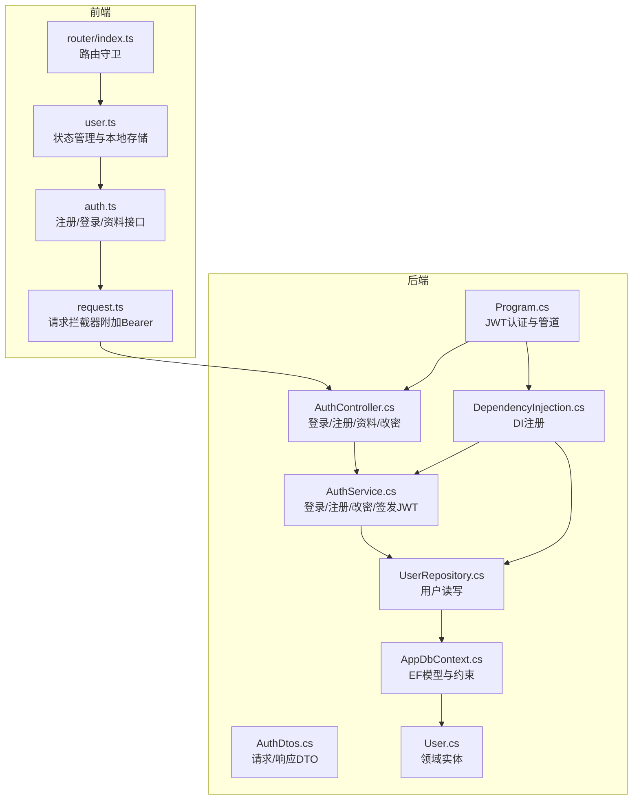
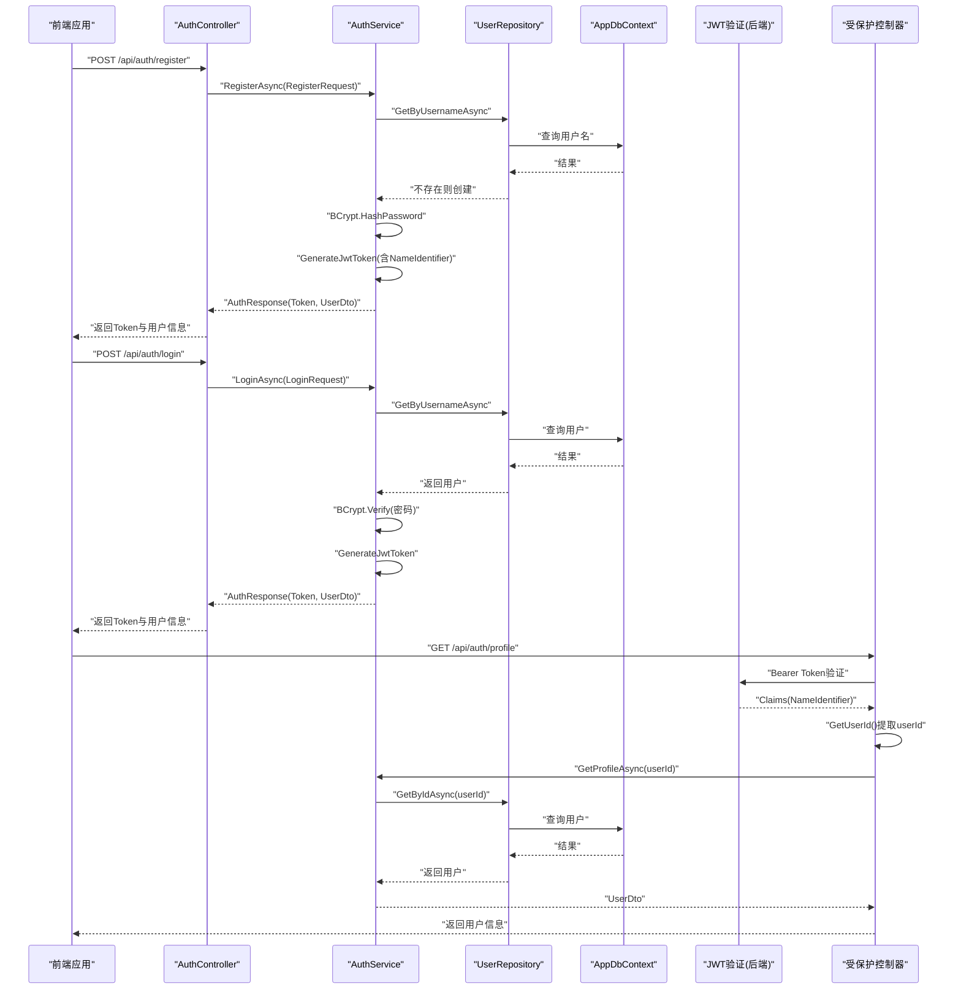
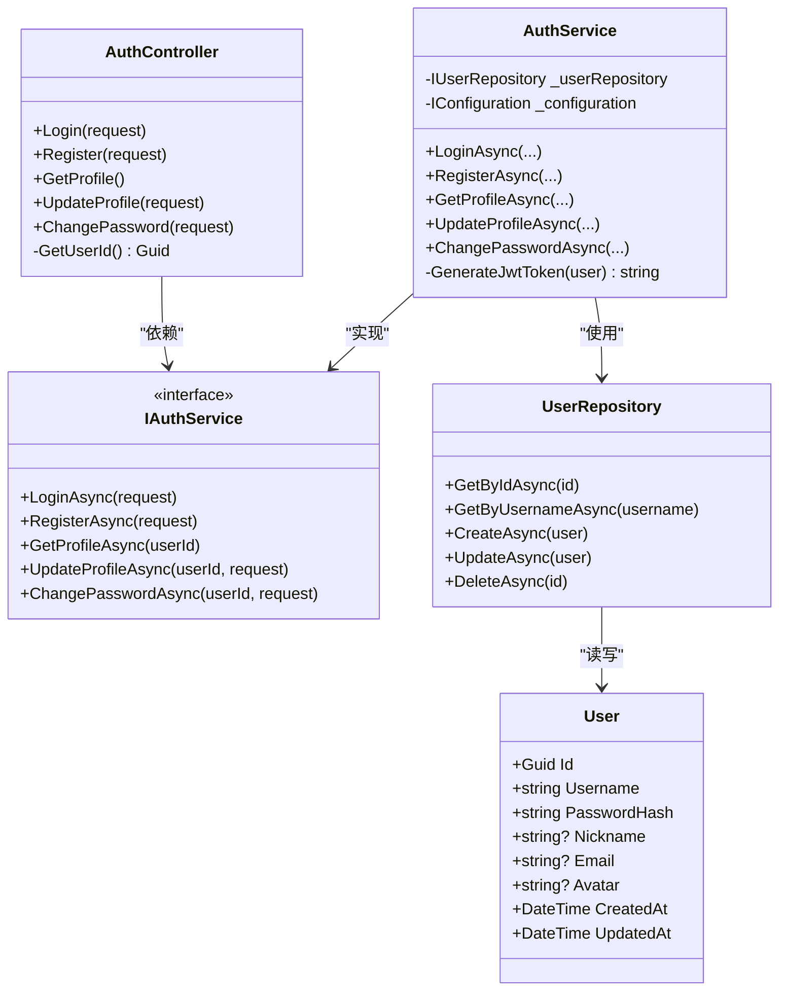
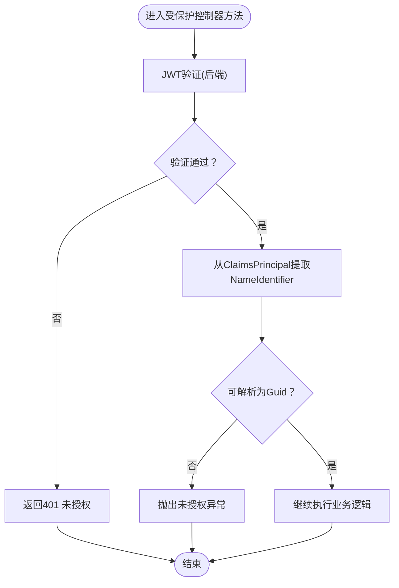
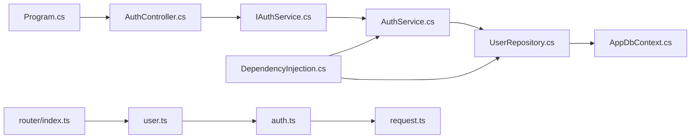

# 认证流程

<cite>
**本文引用的文件**
- [AuthController.cs](file://backend-business/MindMates.Api/Controllers/AuthController.cs)
- [AuthService.cs](file://backend-business/MindMates.Infrastructure/Services/AuthService.cs)
- [IAuthService.cs](file://backend-business/MindMates.Application/Services/IAuthService.cs)
- [User.cs](file://backend-business/MindMates.Domain/Entities/User.cs)
- [UserRepository.cs](file://backend-business/MindMates.Infrastructure/Repositories/UserRepository.cs)
- [AppDbContext.cs](file://backend-business/MindMates.Infrastructure/Data/AppDbContext.cs)
- [DependencyInjection.cs](file://backend-business/MindMates.Infrastructure/DependencyInjection.cs)
- [Program.cs](file://backend-business/MindMates.Api/Program.cs)
- [AuthDtos.cs](file://backend-business/MindMates.Application/DTOs/AuthDtos.cs)
- [auth.ts](file://frontend/src/api/auth.ts)
- [request.ts](file://frontend/src/api/request.ts)
- [user.ts](file://frontend/src/stores/user.ts)
- [index.ts](file://frontend/src/router/index.ts)
</cite>

## 目录
1. [简介](#简介)
2. [项目结构](#项目结构)
3. [核心组件](#核心组件)
4. [架构总览](#架构总览)
5. [详细组件分析](#详细组件分析)
6. [依赖关系分析](#依赖关系分析)
7. [性能考量](#性能考量)
8. [故障排查指南](#故障排查指南)
9. [结论](#结论)
10. [附录](#附录)

## 简介
本文件系统性梳理 MindMates 的用户认证全流程：从前端注册与登录，到后端密码校验与 JWT 签发，再到前端携带令牌访问受保护接口，以及控制器层基于 [Authorize] 的鉴权。文档还覆盖 ClaimsPrincipal 中用户标识的提取细节、令牌过期处理、密码重置安全策略建议，以及防暴力破解、信息泄露等安全最佳实践。

## 项目结构
后端采用分层架构：
- 应用层：定义服务接口与 DTO
- 领域层：实体模型
- 基础设施层：仓储与服务实现、数据库上下文、依赖注入
- 表现层：控制器与启动配置

前端采用 Vue + Pinia + Axios，统一通过请求拦截器附加 Authorization 头。

图表来源
- [Program.cs](file://backend-business/MindMates.Api/Program.cs#L1-L95)
- [AuthController.cs](file://backend-business/MindMates.Api/Controllers/AuthController.cs#L1-L110)
- [AuthService.cs](file://backend-business/MindMates.Infrastructure/Services/AuthService.cs#L1-L131)
- [UserRepository.cs](file://backend-business/MindMates.Infrastructure/Repositories/UserRepository.cs#L1-L53)
- [AppDbContext.cs](file://backend-business/MindMates.Infrastructure/Data/AppDbContext.cs#L1-L59)
- [DependencyInjection.cs](file://backend-business/MindMates.Infrastructure/DependencyInjection.cs#L1-L34)
- [auth.ts](file://frontend/src/api/auth.ts#L1-L25)
- [request.ts](file://frontend/src/api/request.ts#L1-L65)
- [user.ts](file://frontend/src/stores/user.ts#L1-L69)
- [index.ts](file://frontend/src/router/index.ts#L1-L70)

章节来源
- [Program.cs](file://backend-business/MindMates.Api/Program.cs#L1-L95)
- [DependencyInjection.cs](file://backend-business/MindMates.Infrastructure/DependencyInjection.cs#L1-L34)

## 核心组件
- 控制器层：AuthController 提供登录、注册、获取/更新个人资料、修改密码接口，并通过 [Authorize] 保护受控路由；内部使用 GetUserId 从 ClaimsPrincipal 中提取用户标识。
- 应用服务层：IAuthService 定义认证相关契约；AuthService 实现注册、登录、改密、查询资料与 JWT 签发。
- 领域层：User 实体承载用户标识、凭据与元数据。
- 基础设施层：UserRepository 封装用户持久化；AppDbContext 定义 EF 模型与唯一索引约束；DependencyInjection 注册 DI。
- 前端：auth.ts 统一封装认证 API；request.ts 在请求前自动附加 Authorization: Bearer Token；user.ts 管理登录态与本地存储；router/index.ts 通过 meta.requiresAuth 控制访问。

章节来源
- [AuthController.cs](file://backend-business/MindMates.Api/Controllers/AuthController.cs#L1-L110)
- [IAuthService.cs](file://backend-business/MindMates.Application/Services/IAuthService.cs#L1-L13)
- [AuthService.cs](file://backend-business/MindMates.Infrastructure/Services/AuthService.cs#L1-L131)
- [User.cs](file://backend-business/MindMates.Domain/Entities/User.cs#L1-L17)
- [UserRepository.cs](file://backend-business/MindMates.Infrastructure/Repositories/UserRepository.cs#L1-L53)
- [AppDbContext.cs](file://backend-business/MindMates.Infrastructure/Data/AppDbContext.cs#L1-L59)
- [DependencyInjection.cs](file://backend-business/MindMates.Infrastructure/DependencyInjection.cs#L1-L34)
- [auth.ts](file://frontend/src/api/auth.ts#L1-L25)
- [request.ts](file://frontend/src/api/request.ts#L1-L65)
- [user.ts](file://frontend/src/stores/user.ts#L1-L69)
- [index.ts](file://frontend/src/router/index.ts#L1-L70)

## 架构总览
下图展示从注册/登录到受保护接口访问的端到端流程，包括 JWT 验证参数与 Claims 提取。

图表来源
- [AuthController.cs](file://backend-business/MindMates.Api/Controllers/AuthController.cs#L1-L110)
- [AuthService.cs](file://backend-business/MindMates.Infrastructure/Services/AuthService.cs#L1-L131)
- [UserRepository.cs](file://backend-business/MindMates.Infrastructure/Repositories/UserRepository.cs#L1-L53)
- [AppDbContext.cs](file://backend-business/MindMates.Infrastructure/Data/AppDbContext.cs#L1-L59)
- [Program.cs](file://backend-business/MindMates.Api/Program.cs#L48-L64)
- [request.ts](file://frontend/src/api/request.ts#L1-L65)

## 详细组件分析

### 后端认证服务与控制器
- 登录与注册
  - 登录：按用户名查询用户，若不存在或密码不匹配则抛出未授权异常；否则生成 JWT 并返回 Token 与用户信息。
  - 注册：若用户名已存在则抛出无效操作异常；否则对明文密码进行哈希，创建用户并签发 JWT。
- 密码哈希
  - 使用 BCrypt.Net 对密码进行哈希与校验，避免直接存储明文密码。
- JWT 签发
  - 使用对称密钥（HMAC SHA256），包含发行者、受众、过期时间（默认7天）、NameIdentifier（用户ID）、用户名等声明。
- 受保护接口
  - 控制器方法标注 [Authorize]，启用基于 Bearer Token 的认证；GetUserId 从 ClaimsPrincipal 中提取 NameIdentifier 并转换为 Guid。
- 用户信息存储与检索
  - UserRepository 提供按 ID/用户名查询、创建、更新；AppDbContext 对 User 设置唯一索引与长度约束。

图表来源
- [AuthController.cs](file://backend-business/MindMates.Api/Controllers/AuthController.cs#L1-L110)
- [IAuthService.cs](file://backend-business/MindMates.Application/Services/IAuthService.cs#L1-L13)
- [AuthService.cs](file://backend-business/MindMates.Infrastructure/Services/AuthService.cs#L1-L131)
- [UserRepository.cs](file://backend-business/MindMates.Infrastructure/Repositories/UserRepository.cs#L1-L53)
- [User.cs](file://backend-business/MindMates.Domain/Entities/User.cs#L1-L17)

章节来源
- [AuthController.cs](file://backend-business/MindMates.Api/Controllers/AuthController.cs#L1-L110)
- [AuthService.cs](file://backend-business/MindMates.Infrastructure/Services/AuthService.cs#L1-L131)
- [UserRepository.cs](file://backend-business/MindMates.Infrastructure/Repositories/UserRepository.cs#L1-L53)
- [User.cs](file://backend-business/MindMates.Domain/Entities/User.cs#L1-L17)

### JWT 验证与 Claims 提取
- 后端验证参数
  - 发行者、受众、签名密钥、有效期均在 Program.cs 中配置；启用生命周期与签名验证。
- Claims 提取
  - AuthController 内部方法 GetUserId 从 ClaimsPrincipal 中查找 ClaimTypes.NameIdentifier，解析为 Guid；若缺失或格式不正确则抛出未授权异常。
- 前端携带令牌
  - request.ts 在请求拦截器中将本地存储的 token 写入 Authorization 头，格式为 Bearer {token}。

图表来源
- [Program.cs](file://backend-business/MindMates.Api/Program.cs#L48-L64)
- [AuthController.cs](file://backend-business/MindMates.Api/Controllers/AuthController.cs#L100-L108)
- [request.ts](file://frontend/src/api/request.ts#L1-L65)

章节来源
- [Program.cs](file://backend-business/MindMates.Api/Program.cs#L48-L64)
- [AuthController.cs](file://backend-business/MindMates.Api/Controllers/AuthController.cs#L100-L108)
- [request.ts](file://frontend/src/api/request.ts#L1-L65)

### 前端集成与路由守卫
- 登录/注册
  - auth.ts 调用后端接口，成功后将 Token 存入 localStorage，并更新 Pinia 状态。
- 受保护接口
  - request.ts 自动附加 Authorization: Bearer Token；响应拦截器对 401 做统一处理，触发登出与跳转。
- 路由守卫
  - router/index.ts 通过 meta.requiresAuth 控制是否需要登录态，未登录访问受保护路由将重定向至登录页。

章节来源
- [auth.ts](file://frontend/src/api/auth.ts#L1-L25)
- [user.ts](file://frontend/src/stores/user.ts#L1-L69)
- [request.ts](file://frontend/src/api/request.ts#L1-L65)
- [index.ts](file://frontend/src/router/index.ts#L1-L70)

## 依赖关系分析
- 控制器依赖应用服务接口；应用服务实现依赖仓储接口；仓储依赖数据库上下文。
- Program.cs 注册 JWT 验证参数；DependencyInjection.cs 注册仓储与服务实现。
- 前端通过 Axios 拦截器统一注入令牌；Pinia 管理登录态；Vue Router 基于 meta 控制访问。

图表来源
- [Program.cs](file://backend-business/MindMates.Api/Program.cs#L1-L95)
- [AuthController.cs](file://backend-business/MindMates.Api/Controllers/AuthController.cs#L1-L110)
- [IAuthService.cs](file://backend-business/MindMates.Application/Services/IAuthService.cs#L1-L13)
- [AuthService.cs](file://backend-business/MindMates.Infrastructure/Services/AuthService.cs#L1-L131)
- [UserRepository.cs](file://backend-business/MindMates.Infrastructure/Repositories/UserRepository.cs#L1-L53)
- [AppDbContext.cs](file://backend-business/MindMates.Infrastructure/Data/AppDbContext.cs#L1-L59)
- [DependencyInjection.cs](file://backend-business/MindMates.Infrastructure/DependencyInjection.cs#L1-L34)
- [auth.ts](file://frontend/src/api/auth.ts#L1-L25)
- [request.ts](file://frontend/src/api/request.ts#L1-L65)
- [user.ts](file://frontend/src/stores/user.ts#L1-L69)
- [index.ts](file://frontend/src/router/index.ts#L1-L70)

章节来源
- [Program.cs](file://backend-business/MindMates.Api/Program.cs#L1-L95)
- [DependencyInjection.cs](file://backend-business/MindMates.Infrastructure/DependencyInjection.cs#L1-L34)

## 性能考量
- 密码哈希成本：BCrypt 已内置成本因子控制，建议保持默认以平衡安全性与性能。
- 数据库查询：用户名唯一索引可降低重复注册与登录查询成本。
- JWT 体积：仅包含必要声明，避免冗余字段。
- 缓存策略：对于频繁读取的用户资料，可在应用层引入轻量缓存（需注意一致性）。

## 故障排查指南
- 401 未授权
  - 前端：响应拦截器会检测 401 并触发登出与跳转；检查本地 token 是否存在且未过期。
  - 后端：确认 JWT 验证参数（issuer、audience、secret）与签发一致；检查控制器是否正确标注 [Authorize]。
- 令牌过期
  - 默认令牌有效期为 7 天；建议在前端实现刷新令牌流程（当前代码未实现刷新，建议补充 refresh token 机制）。
- 密码错误/用户名不存在
  - 登录时若用户名不存在或密码不匹配会抛出未授权异常；注册时用户名冲突会抛出无效操作异常。
- Claims 提取失败
  - GetUserId 依赖 NameIdentifier；若缺失或格式不正确会抛出未授权异常。请确保签发时包含该声明。

章节来源
- [request.ts](file://frontend/src/api/request.ts#L1-L65)
- [Program.cs](file://backend-business/MindMates.Api/Program.cs#L48-L64)
- [AuthController.cs](file://backend-business/MindMates.Api/Controllers/AuthController.cs#L100-L108)
- [AuthService.cs](file://backend-business/MindMates.Infrastructure/Services/AuthService.cs#L1-L131)

## 结论
MindMates 的认证体系以 BCrypt 密码哈希与对称 JWT 为核心，前后端协作完成从注册/登录到受保护接口访问的闭环。后端通过 [Authorize] 与 Claims 提取保障了控制器级鉴权；前端通过拦截器统一注入 Bearer Token 并处理 401 场景。建议后续完善令牌刷新与密码重置安全策略，持续强化安全与用户体验。

## 附录

### 常见问题与最佳实践
- 令牌过期处理
  - 当前后端 JWT 有效期为 7 天；建议引入 refresh token 机制，前端在 Token 即将过期时静默刷新。
- 密码重置安全策略
  - 建议采用一次性验证码或邮箱链接，设置过期时间与频率限制，避免暴力尝试。
- 防暴力破解
  - 登录接口增加速率限制与账户锁定阈值；注册接口限制同一 IP 的注册频率。
- 防信息泄露
  - 不在 JWT 中包含敏感字段；后端仅返回最小必要用户信息；避免在日志中输出敏感数据。
- 安全传输
  - 生产环境必须启用 HTTPS；JWT Secret 必须妥善保管，定期轮换。