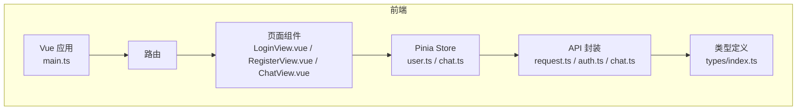
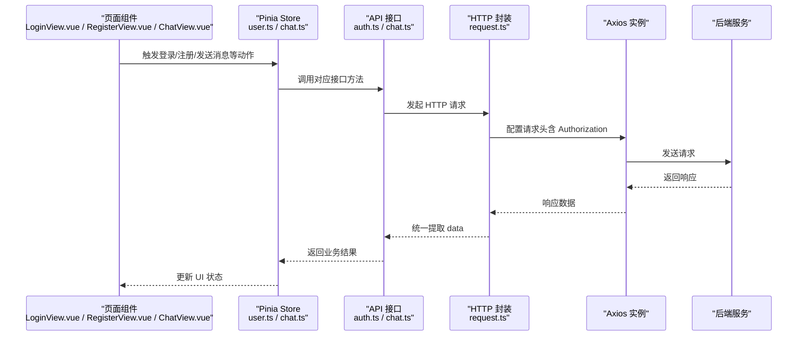
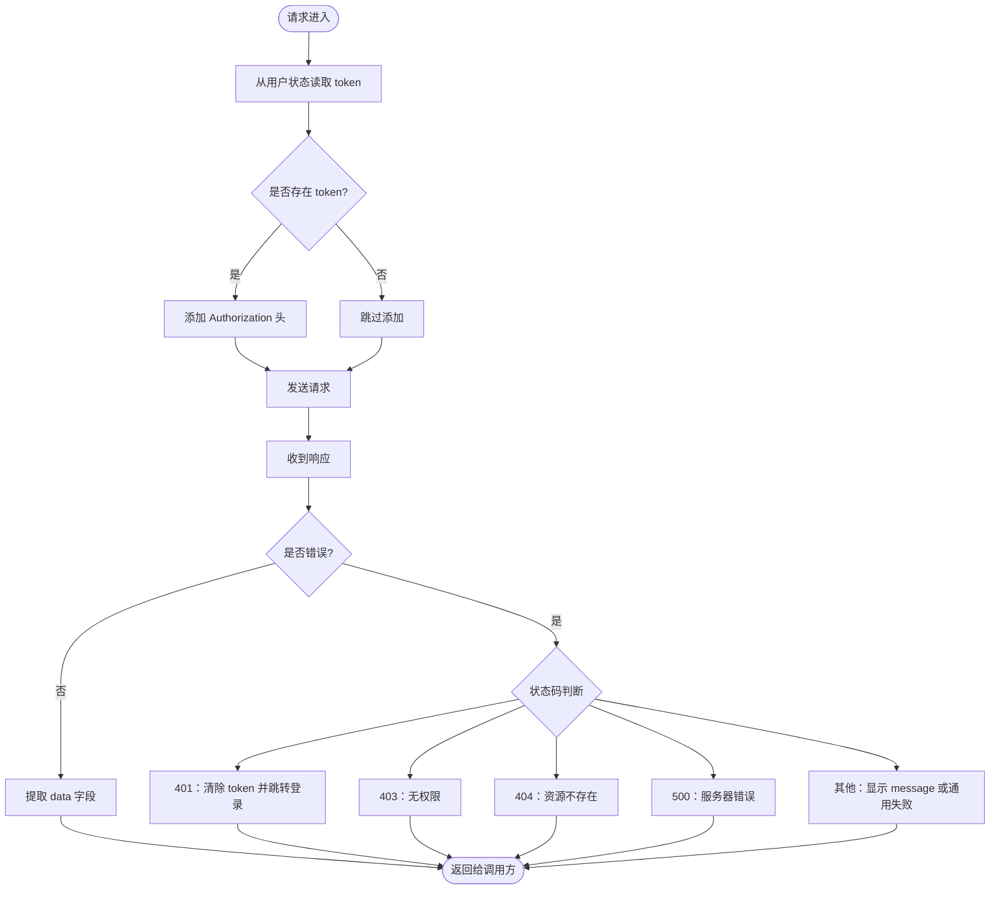
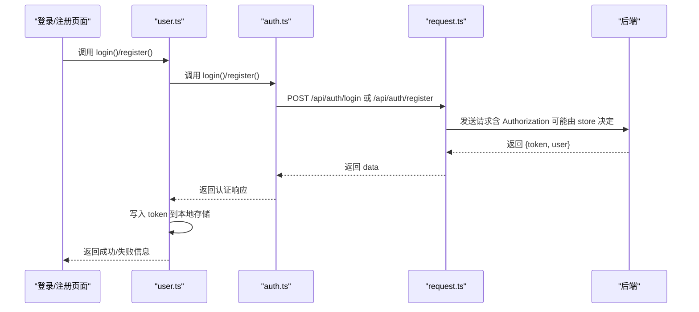
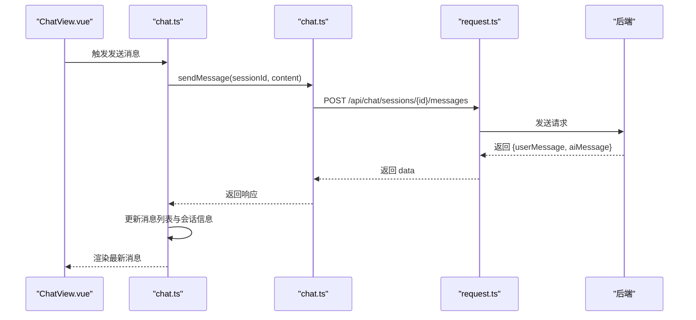
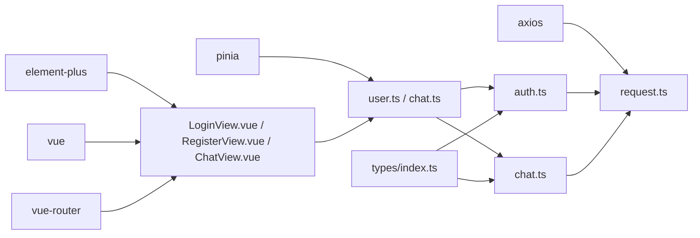

# API客户端

<cite>
**本文引用的文件**
- [frontend/src/api/request.ts](file://frontend/src/api/request.ts)
- [frontend/src/api/auth.ts](file://frontend/src/api/auth.ts)
- [frontend/src/api/chat.ts](file://frontend/src/api/chat.ts)
- [frontend/src/types/index.ts](file://frontend/src/types/index.ts)
- [frontend/src/stores/user.ts](file://frontend/src/stores/user.ts)
- [frontend/src/stores/chat.ts](file://frontend/src/stores/chat.ts)
- [frontend/src/views/LoginView.vue](file://frontend/src/views/LoginView.vue)
- [frontend/src/views/RegisterView.vue](file://frontend/src/views/RegisterView.vue)
- [frontend/src/views/ChatView.vue](file://frontend/src/views/ChatView.vue)
- [frontend/src/main.ts](file://frontend/src/main.ts)
- [frontend/package.json](file://frontend/package.json)
</cite>

## 目录
1. [简介](#简介)
2. [项目结构](#项目结构)
3. [核心组件](#核心组件)
4. [架构总览](#架构总览)
5. [详细组件分析](#详细组件分析)
6. [依赖关系分析](#依赖关系分析)
7. [性能考虑](#性能考虑)
8. [故障排查指南](#故障排查指南)
9. [结论](#结论)
10. [附录](#附录)

## 简介
本文件面向前端开发者，系统性说明如何通过封装的HTTP服务与后端进行通信。重点解析基于 Axios 的请求封装机制（request.ts），包括：
- 统一的请求/响应拦截器
- 自动注入 JWT 认证令牌
- 统一错误处理与用户引导
- 超时配置与重试策略建议
同时，详细说明认证模块（auth.ts）与聊天模块（chat.ts）提供的接口方法，并给出调用示例与数据类型定义（types/index.ts）。最后提供调试指南、常见网络错误解决方案与安全传输建议。

## 项目结构
前端采用分层组织：
- api 层：封装 HTTP 请求与业务接口
- stores 层：使用 Pinia 管理全局状态（用户、聊天）
- views 层：页面组件，负责交互与调用 store
- types 层：统一的数据类型定义
- main.ts：应用入口，注册插件与路由

图表来源
- [frontend/src/main.ts](file://frontend/src/main.ts#L1-L23)
- [frontend/src/stores/user.ts](file://frontend/src/stores/user.ts#L1-L69)
- [frontend/src/stores/chat.ts](file://frontend/src/stores/chat.ts#L1-L140)
- [frontend/src/api/request.ts](file://frontend/src/api/request.ts#L1-L65)
- [frontend/src/api/auth.ts](file://frontend/src/api/auth.ts#L1-L25)
- [frontend/src/api/chat.ts](file://frontend/src/api/chat.ts#L1-L31)
- [frontend/src/types/index.ts](file://frontend/src/types/index.ts#L1-L67)

章节来源
- [frontend/src/main.ts](file://frontend/src/main.ts#L1-L23)
- [frontend/src/stores/user.ts](file://frontend/src/stores/user.ts#L1-L69)
- [frontend/src/stores/chat.ts](file://frontend/src/stores/chat.ts#L1-L140)
- [frontend/src/api/request.ts](file://frontend/src/api/request.ts#L1-L65)
- [frontend/src/api/auth.ts](file://frontend/src/api/auth.ts#L1-L25)
- [frontend/src/api/chat.ts](file://frontend/src/api/chat.ts#L1-L31)
- [frontend/src/types/index.ts](file://frontend/src/types/index.ts#L1-L67)

## 核心组件
- HTTP 请求封装（request.ts）
  - 基于 Axios 创建实例，设置基础 URL、超时与 Content-Type
  - 请求拦截器：从 Pinia 用户状态读取 token 并注入 Authorization 头
  - 响应拦截器：统一提取响应数据；按状态码进行错误分类处理；网络异常统一提示
- 认证接口（auth.ts）
  - login：登录并返回 token 与用户信息
  - register：注册并返回 token 与用户信息
  - getProfile：获取当前用户资料
  - updateProfile：更新用户资料
  - changePassword：修改密码
- 聊天接口（chat.ts）
  - 会话管理：获取会话列表、获取指定会话、创建会话、删除会话
  - 消息管理：获取消息列表、发送消息
- 类型定义（types/index.ts）
  - 用户、登录/注册请求体、认证响应、聊天会话、消息、发送消息响应等
- 状态管理（stores/user.ts、stores/chat.ts）
  - 用户状态：登录/注册持久化 token、拉取用户资料、登出
  - 聊天状态：会话列表、当前会话、消息列表、发送消息、删除会话等

章节来源
- [frontend/src/api/request.ts](file://frontend/src/api/request.ts#L1-L65)
- [frontend/src/api/auth.ts](file://frontend/src/api/auth.ts#L1-L25)
- [frontend/src/api/chat.ts](file://frontend/src/api/chat.ts#L1-L31)
- [frontend/src/types/index.ts](file://frontend/src/types/index.ts#L1-L67)
- [frontend/src/stores/user.ts](file://frontend/src/stores/user.ts#L1-L69)
- [frontend/src/stores/chat.ts](file://frontend/src/stores/chat.ts#L1-L140)

## 架构总览
下图展示从前端页面到 API 封装再到后端的整体调用链路与数据流。

图表来源
- [frontend/src/views/LoginView.vue](file://frontend/src/views/LoginView.vue#L1-L205)
- [frontend/src/views/RegisterView.vue](file://frontend/src/views/RegisterView.vue#L1-L229)
- [frontend/src/views/ChatView.vue](file://frontend/src/views/ChatView.vue#L1-L412)
- [frontend/src/stores/user.ts](file://frontend/src/stores/user.ts#L1-L69)
- [frontend/src/stores/chat.ts](file://frontend/src/stores/chat.ts#L1-L140)
- [frontend/src/api/auth.ts](file://frontend/src/api/auth.ts#L1-L25)
- [frontend/src/api/chat.ts](file://frontend/src/api/chat.ts#L1-L31)
- [frontend/src/api/request.ts](file://frontend/src/api/request.ts#L1-L65)

## 详细组件分析

### HTTP 请求封装（request.ts）
- 基础配置
  - 基础 URL 来自环境变量，便于多环境切换
  - 超时时间 30 秒，避免长时间阻塞
  - 默认 JSON 内容类型
- 请求拦截器
  - 从用户状态读取 token，若存在则在 Authorization 头注入 Bearer 令牌
- 响应拦截器
  - 成功时统一返回 data 字段，简化调用方处理
  - 错误处理：
    - 401：清理本地 token，提示登录过期并跳转登录页
    - 403：无权限访问
    - 404：请求资源不存在
    - 500：服务器错误
    - 其他：优先显示后端 message，否则通用失败提示
  - 网络异常：提示“网络错误，请检查网络连接”
- 适用范围
  - 所有业务 API（认证、聊天）均通过该封装发起请求

图表来源
- [frontend/src/api/request.ts](file://frontend/src/api/request.ts#L1-L65)
- [frontend/src/stores/user.ts](file://frontend/src/stores/user.ts#L1-L69)

章节来源
- [frontend/src/api/request.ts](file://frontend/src/api/request.ts#L1-L65)
- [frontend/src/stores/user.ts](file://frontend/src/stores/user.ts#L1-L69)

### 认证模块（auth.ts）
- 方法清单
  - login(data): 登录，返回认证响应（包含 token 与用户信息）
  - register(data): 注册，返回认证响应
  - getProfile(): 获取当前用户资料
  - updateProfile(data): 更新用户资料
  - changePassword(oldPassword, newPassword): 修改密码
- 数据类型
  - LoginRequest、RegisterRequest、AuthResponse、User
- 使用场景
  - 登录/注册成功后，store 将 token 写入本地存储并在后续请求中自动携带
  - 获取用户资料用于展示与导航

图表来源
- [frontend/src/views/LoginView.vue](file://frontend/src/views/LoginView.vue#L1-L205)
- [frontend/src/views/RegisterView.vue](file://frontend/src/views/RegisterView.vue#L1-L229)
- [frontend/src/stores/user.ts](file://frontend/src/stores/user.ts#L1-L69)
- [frontend/src/api/auth.ts](file://frontend/src/api/auth.ts#L1-L25)
- [frontend/src/api/request.ts](file://frontend/src/api/request.ts#L1-L65)

章节来源
- [frontend/src/api/auth.ts](file://frontend/src/api/auth.ts#L1-L25)
- [frontend/src/types/index.ts](file://frontend/src/types/index.ts#L1-L67)
- [frontend/src/stores/user.ts](file://frontend/src/stores/user.ts#L1-L69)

### 聊天模块（chat.ts）
- 方法清单
  - getSessions(): 获取会话列表
  - getSession(sessionId): 获取指定会话
  - createSession(): 创建新会话
  - deleteSession(sessionId): 删除会话
  - getMessages(sessionId): 获取会话消息列表
  - sendMessage(sessionId, content): 发送消息并返回用户消息与 AI 回复
- 数据类型
  - ChatSession、ChatMessage、SendMessageResponse
- 使用场景
  - 聊天页面通过 store 调用 chat.ts 接口，实现会话与消息的增删查改

图表来源
- [frontend/src/views/ChatView.vue](file://frontend/src/views/ChatView.vue#L1-L412)
- [frontend/src/stores/chat.ts](file://frontend/src/stores/chat.ts#L1-L140)
- [frontend/src/api/chat.ts](file://frontend/src/api/chat.ts#L1-L31)
- [frontend/src/api/request.ts](file://frontend/src/api/request.ts#L1-L65)

章节来源
- [frontend/src/api/chat.ts](file://frontend/src/api/chat.ts#L1-L31)
- [frontend/src/types/index.ts](file://frontend/src/types/index.ts#L1-L67)
- [frontend/src/stores/chat.ts](file://frontend/src/stores/chat.ts#L1-L140)

### 数据类型定义（types/index.ts）
- 用户相关
  - User：用户标识、用户名、昵称、头像、邮箱、创建时间
  - LoginRequest：用户名、密码
  - RegisterRequest：用户名、密码、昵称
  - AuthResponse：token、user
- 聊天相关
  - ChatSession：会话标识、用户标识、标题、最近消息、创建/更新时间
  - ChatMessage：消息标识、会话标识、角色（user/assistant/system）、内容、创建时间、元数据（意图、是否危机）
  - SendMessageResponse：用户消息与 AI 回复
- 通用响应
  - ApiResponse<T>：code、message、data
- 危机资源
  - CrisisResource：名称、电话、描述

章节来源
- [frontend/src/types/index.ts](file://frontend/src/types/index.ts#L1-L67)

### 状态管理（stores/user.ts、stores/chat.ts）
- user.ts
  - 状态：user、token、登录态计算属性、用户名计算属性
  - 行为：login、register、fetchProfile、logout
  - 本地持久化：token 写入 localStorage
- chat.ts
  - 状态：sessions、currentSession、messages、isLoading、isTyping、排序后的会话
  - 行为：获取会话列表、创建会话、加载会话、发送消息、删除会话、清空当前会话
  - 交互细节：发送消息时先插入临时用户消息，再等待后端返回并替换临时 ID，最后追加 AI 回复

章节来源
- [frontend/src/stores/user.ts](file://frontend/src/stores/user.ts#L1-L69)
- [frontend/src/stores/chat.ts](file://frontend/src/stores/chat.ts#L1-L140)

## 依赖关系分析
- 外部依赖
  - axios：HTTP 客户端
  - element-plus：UI 组件与消息提示
  - vue、vue-router、pinia：前端框架与状态管理
- 内部依赖
  - request.ts 作为统一 HTTP 出口，被 auth.ts 与 chat.ts 引用
  - user.ts 与 chat.ts 分别依赖各自 API 模块
  - views 层通过 store 调用 API

图表来源
- [frontend/src/api/request.ts](file://frontend/src/api/request.ts#L1-L65)
- [frontend/src/api/auth.ts](file://frontend/src/api/auth.ts#L1-L25)
- [frontend/src/api/chat.ts](file://frontend/src/api/chat.ts#L1-L31)
- [frontend/src/types/index.ts](file://frontend/src/types/index.ts#L1-L67)
- [frontend/src/stores/user.ts](file://frontend/src/stores/user.ts#L1-L69)
- [frontend/src/stores/chat.ts](file://frontend/src/stores/chat.ts#L1-L140)
- [frontend/src/views/LoginView.vue](file://frontend/src/views/LoginView.vue#L1-L205)
- [frontend/src/views/RegisterView.vue](file://frontend/src/views/RegisterView.vue#L1-L229)
- [frontend/src/views/ChatView.vue](file://frontend/src/views/ChatView.vue#L1-L412)
- [frontend/package.json](file://frontend/package.json#L1-L35)

章节来源
- [frontend/package.json](file://frontend/package.json#L1-L35)
- [frontend/src/api/request.ts](file://frontend/src/api/request.ts#L1-L65)
- [frontend/src/api/auth.ts](file://frontend/src/api/auth.ts#L1-L25)
- [frontend/src/api/chat.ts](file://frontend/src/api/chat.ts#L1-L31)
- [frontend/src/types/index.ts](file://frontend/src/types/index.ts#L1-L67)
- [frontend/src/stores/user.ts](file://frontend/src/stores/user.ts#L1-L69)
- [frontend/src/stores/chat.ts](file://frontend/src/stores/chat.ts#L1-L140)

## 性能考虑
- 超时与并发
  - 当前封装设置了 30 秒超时，避免长时间挂起
  - 聊天加载会话时使用 Promise.all 并发获取会话与消息，减少等待时间
- 本地状态优化
  - 发送消息前插入临时消息，提升交互体验
  - 会话列表按更新时间倒序排序，便于快速定位
- 建议
  - 对高频接口增加缓存策略（如会话列表短期缓存）
  - 对长文本消息可做节流发送，避免频繁触发后端处理
  - 在弱网环境下可考虑引入指数退避重试（见“故障排查”）

## 故障排查指南
- 401 未授权/登录过期
  - 现象：自动跳转登录页并提示“登录已过期，请重新登录”
  - 处理：重新登录获取新 token；确保 store 中 token 已写入本地存储
- 403 无权限
  - 现象：提示“没有权限访问”
  - 处理：检查用户角色与接口权限；确认登录状态
- 404 资源不存在
  - 现象：提示“请求的资源不存在”
  - 处理：核对路径参数（如会话 ID）是否正确
- 500 服务器错误
  - 现象：提示“服务器错误，请稍后重试”
  - 处理：稍后再试；查看后端日志
- 网络错误
  - 现象：提示“网络错误，请检查网络连接”
  - 处理：检查网络状态、代理设置；必要时启用重试
- 重试策略建议
  - 对幂等接口（GET/DELETE）可在 500/网络错误时进行一次重试
  - 对非幂等接口（POST/PUT）谨慎重试，避免重复提交
  - 可采用指数退避（如 1s、2s、4s）以降低后端压力
- 安全传输建议
  - 生产环境必须使用 HTTPS
  - token 存储在安全上下文（如 HttpOnly Cookie，或移动端安全存储）
  - 避免在日志中打印 token
  - 对敏感字段进行脱敏处理

章节来源
- [frontend/src/api/request.ts](file://frontend/src/api/request.ts#L1-L65)
- [frontend/src/stores/user.ts](file://frontend/src/stores/user.ts#L1-L69)
- [frontend/src/stores/chat.ts](file://frontend/src/stores/chat.ts#L1-L140)

## 结论
本项目通过 request.ts 提供统一的 HTTP 封装，配合 auth.ts 与 chat.ts 的业务接口，以及 Pinia 状态管理，实现了清晰、可维护的前后端通信方案。借助拦截器与统一错误处理，开发者可以专注于业务逻辑；通过明确的数据类型定义，提升了开发效率与可读性。建议在生产环境中进一步完善重试与安全策略，持续优化用户体验。

## 附录

### 调用示例（路径指引）
- 登录
  - 页面：LoginView.vue
  - 流程：表单校验 -> 调用 userStore.login -> 调用 authApi.login -> 写入 token -> 跳转首页
  - 参考路径
    - [frontend/src/views/LoginView.vue](file://frontend/src/views/LoginView.vue#L1-L205)
    - [frontend/src/stores/user.ts](file://frontend/src/stores/user.ts#L1-L69)
    - [frontend/src/api/auth.ts](file://frontend/src/api/auth.ts#L1-L25)
- 注册
  - 页面：RegisterView.vue
  - 流程：表单校验 -> 调用 userStore.register -> 调用 authApi.register -> 写入 token -> 跳转首页
  - 参考路径
    - [frontend/src/views/RegisterView.vue](file://frontend/src/views/RegisterView.vue#L1-L229)
    - [frontend/src/stores/user.ts](file://frontend/src/stores/user.ts#L1-L69)
    - [frontend/src/api/auth.ts](file://frontend/src/api/auth.ts#L1-L25)
- 发送消息
  - 页面：ChatView.vue
  - 流程：输入校验 -> 调用 chatStore.sendMessage -> 调用 chatApi.sendMessage -> 更新消息列表
  - 参考路径
    - [frontend/src/views/ChatView.vue](file://frontend/src/views/ChatView.vue#L1-L412)
    - [frontend/src/stores/chat.ts](file://frontend/src/stores/chat.ts#L1-L140)
    - [frontend/src/api/chat.ts](file://frontend/src/api/chat.ts#L1-L31)

### 关键配置与环境变量
- 基础 URL
  - request.ts 使用 import.meta.env.VITE_API_URL 作为 baseURL
  - 参考路径
    - [frontend/src/api/request.ts](file://frontend/src/api/request.ts#L1-L65)
- 依赖版本
  - 参考路径
    - [frontend/package.json](file://frontend/package.json#L1-L35)