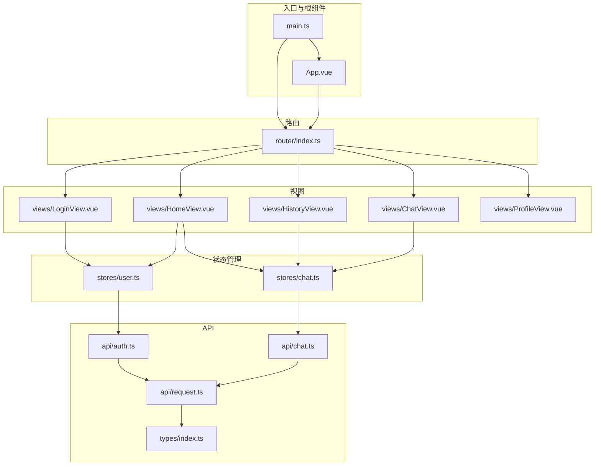
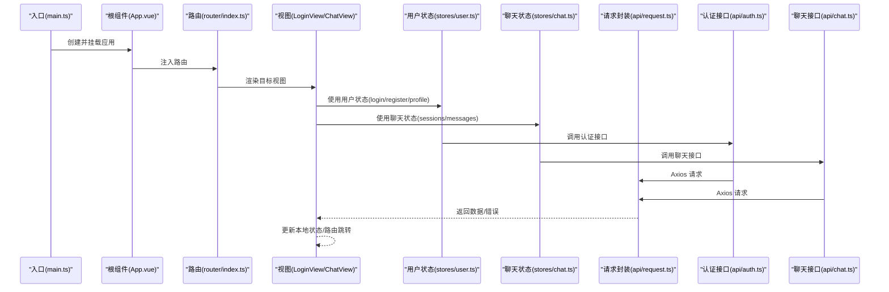
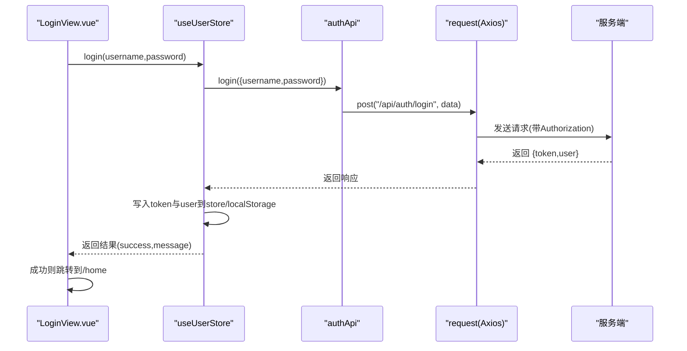
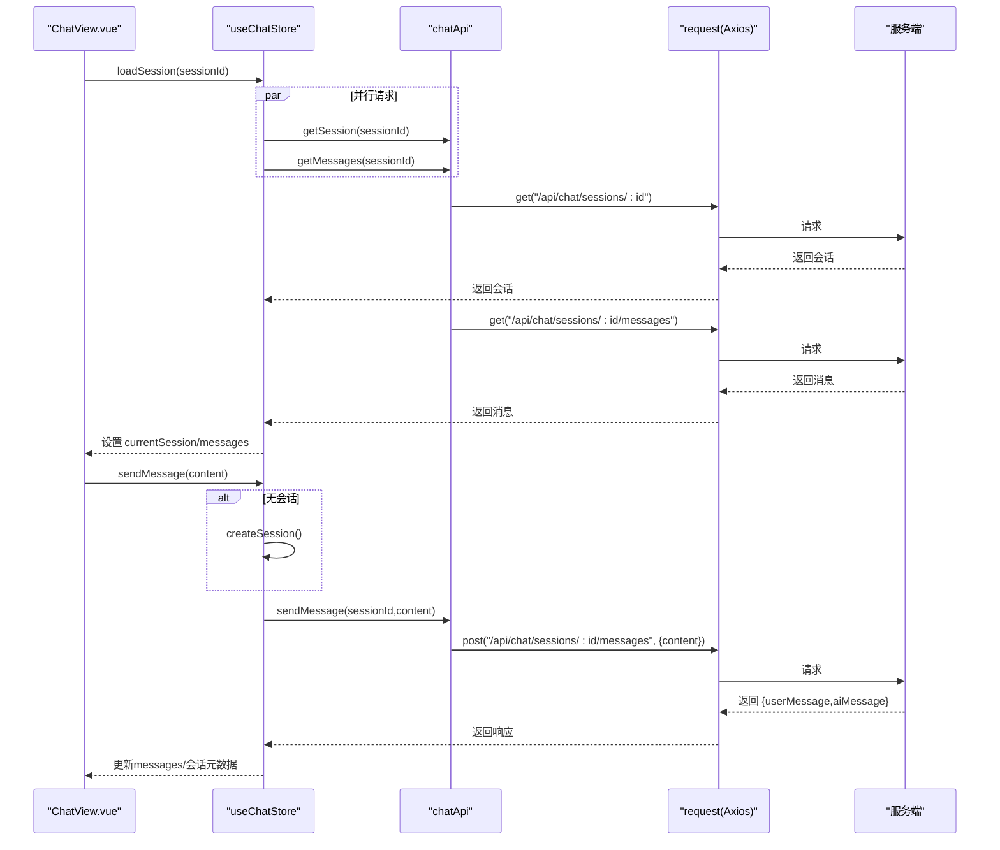
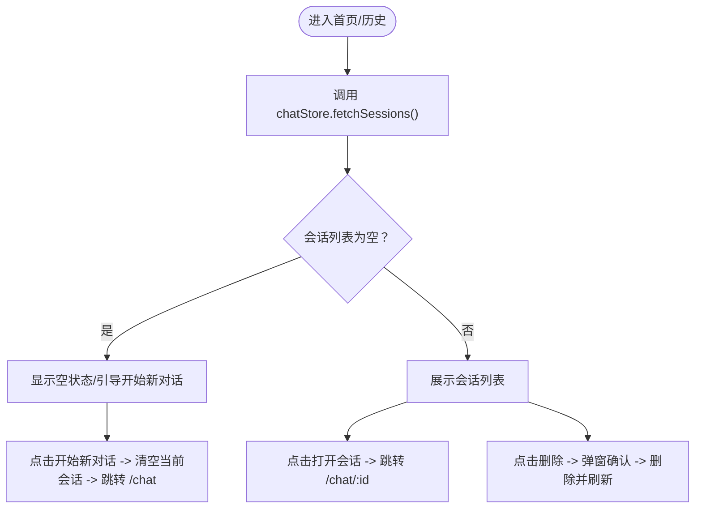
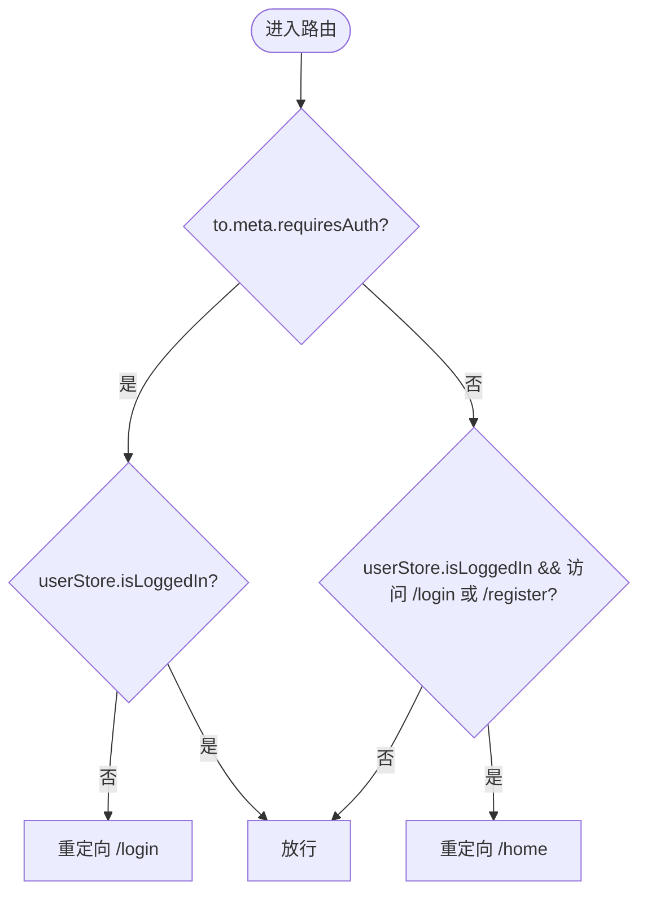
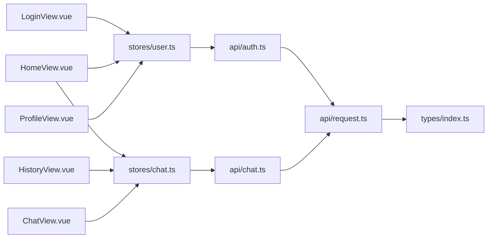

# 前端架构

<cite>
**本文引用的文件**
- [main.ts](file://frontend/src/main.ts)
- [App.vue](file://frontend/src/App.vue)
- [router/index.ts](file://frontend/src/router/index.ts)
- [stores/user.ts](file://frontend/src/stores/user.ts)
- [stores/chat.ts](file://frontend/src/stores/chat.ts)
- [api/request.ts](file://frontend/src/api/request.ts)
- [api/auth.ts](file://frontend/src/api/auth.ts)
- [api/chat.ts](file://frontend/src/api/chat.ts)
- [types/index.ts](file://frontend/src/types/index.ts)
- [views/LoginView.vue](file://frontend/src/views/LoginView.vue)
- [views/ChatView.vue](file://frontend/src/views/ChatView.vue)
- [views/HomeView.vue](file://frontend/src/views/HomeView.vue)
- [views/HistoryView.vue](file://frontend/src/views/HistoryView.vue)
- [views/ProfileView.vue](file://frontend/src/views/ProfileView.vue)
</cite>

## 目录
1. [简介](#简介)
2. [项目结构](#项目结构)
3. [核心组件](#核心组件)
4. [架构总览](#架构总览)
5. [详细组件分析](#详细组件分析)
6. [依赖关系分析](#依赖关系分析)
7. [性能考量](#性能考量)
8. [故障排查指南](#故障排查指南)
9. [结论](#结论)
10. [附录](#附录)

## 简介
本文件面向前端开发者，系统性解析 MindMates 前端架构，围绕 Vue 3 组合式 API 的 MVVM 模式展开，重点覆盖：
- 入口点 main.ts 如何初始化应用、挂载 Pinia 与路由
- 根组件 App.vue 的布局职责
- Vue Router 在视图（如 ChatView、LoginView）之间的导航与守卫
- Pinia 状态管理在 user 与 chat 模块中的应用（状态定义、actions、getters）
- API 客户端（auth.ts、chat.ts）如何封装 HTTP 请求并与后端交互
- 组件通信、状态同步与路由守卫的实际实现路径
- 面向开发者的组件设计、状态流管理与性能优化建议

## 项目结构
前端采用“入口 -> 根组件 -> 路由 -> 视图 -> 状态/接口”的分层组织，核心目录与文件如下：
- 入口与根组件：main.ts、App.vue
- 路由：router/index.ts
- 状态管理：stores/user.ts、stores/chat.ts
- API 封装：api/request.ts、api/auth.ts、api/chat.ts
- 类型定义：types/index.ts
- 视图：views/LoginView.vue、views/ChatView.vue、views/HomeView.vue、views/HistoryView.vue、views/ProfileView.vue

图表来源
- [main.ts](file://frontend/src/main.ts#L1-L23)
- [App.vue](file://frontend/src/App.vue#L1-L18)
- [router/index.ts](file://frontend/src/router/index.ts#L1-L70)
- [stores/user.ts](file://frontend/src/stores/user.ts#L1-L69)
- [stores/chat.ts](file://frontend/src/stores/chat.ts#L1-L140)
- [api/request.ts](file://frontend/src/api/request.ts#L1-L65)
- [api/auth.ts](file://frontend/src/api/auth.ts#L1-L25)
- [api/chat.ts](file://frontend/src/api/chat.ts#L1-L31)
- [types/index.ts](file://frontend/src/types/index.ts#L1-L67)

章节来源
- [main.ts](file://frontend/src/main.ts#L1-L23)
- [App.vue](file://frontend/src/App.vue#L1-L18)
- [router/index.ts](file://frontend/src/router/index.ts#L1-L70)

## 核心组件
- 入口与应用实例
  - main.ts 创建并挂载应用，注册 Element Plus 图标，安装 Pinia 与路由，最后挂载到 DOM。[入口初始化](file://frontend/src/main.ts#L1-L23)
- 根组件
  - App.vue 仅包含 RouterView，负责承载路由视图渲染。[根组件布局](file://frontend/src/App.vue#L1-L18)
- 路由
  - router/index.ts 定义多条路由（登录、注册、首页、聊天、历史、个人中心），并通过 beforeEach 实现鉴权守卫。[路由与守卫](file://frontend/src/router/index.ts#L1-L70)
- 状态管理
  - stores/user.ts：用户登录态、令牌、用户资料、登录/注册/登出等动作；支持初始化时拉取资料。[用户状态](file://frontend/src/stores/user.ts#L1-L69)
  - stores/chat.ts：会话列表、当前会话、消息列表、加载与输入状态；提供会话与消息的增删查改、发送消息、排序等。[聊天状态](file://frontend/src/stores/chat.ts#L1-L140)
- API 客户端
  - api/request.ts：Axios 实例，统一设置 baseURL、超时、请求头 Authorization，并处理 401/403/404/500 等响应错误。[请求拦截器](file://frontend/src/api/request.ts#L1-L65)
  - api/auth.ts：封装认证相关接口（登录、注册、获取/更新资料、改密）。[认证接口](file://frontend/src/api/auth.ts#L1-L25)
  - api/chat.ts：封装会话与消息相关接口（查询、创建、删除、加载、发送）。[聊天接口](file://frontend/src/api/chat.ts#L1-L31)
- 类型定义
  - types/index.ts：用户、认证、会话、消息、响应体等类型定义。[类型定义](file://frontend/src/types/index.ts#L1-L67)

章节来源
- [main.ts](file://frontend/src/main.ts#L1-L23)
- [App.vue](file://frontend/src/App.vue#L1-L18)
- [router/index.ts](file://frontend/src/router/index.ts#L1-L70)
- [stores/user.ts](file://frontend/src/stores/user.ts#L1-L69)
- [stores/chat.ts](file://frontend/src/stores/chat.ts#L1-L140)
- [api/request.ts](file://frontend/src/api/request.ts#L1-L65)
- [api/auth.ts](file://frontend/src/api/auth.ts#L1-L25)
- [api/chat.ts](file://frontend/src/api/chat.ts#L1-L31)
- [types/index.ts](file://frontend/src/types/index.ts#L1-L67)

## 架构总览
下图展示从入口到视图、状态与 API 的整体调用链路。

图表来源
- [main.ts](file://frontend/src/main.ts#L1-L23)
- [App.vue](file://frontend/src/App.vue#L1-L18)
- [router/index.ts](file://frontend/src/router/index.ts#L1-L70)
- [stores/user.ts](file://frontend/src/stores/user.ts#L1-L69)
- [stores/chat.ts](file://frontend/src/stores/chat.ts#L1-L140)
- [api/request.ts](file://frontend/src/api/request.ts#L1-L65)
- [api/auth.ts](file://frontend/src/api/auth.ts#L1-L25)
- [api/chat.ts](file://frontend/src/api/chat.ts#L1-L31)

## 详细组件分析

### 登录流程（LoginView -> user 状态 -> 认证接口）
- 触发路径
  - 用户在 LoginView 中提交表单，调用 userStore.login(username, password)。[登录触发](file://frontend/src/views/LoginView.vue#L1-L205)
  - userStore.login 内部调用 authApi.login，写入 token 与用户信息到本地存储，并持久化到 store。[登录动作](file://frontend/src/stores/user.ts#L1-L69)
  - authApi.login 通过 request.post 发起请求，request.ts 设置 Authorization 并统一处理错误。[认证接口](file://frontend/src/api/auth.ts#L1-L25)；[请求封装](file://frontend/src/api/request.ts#L1-L65)
- 路由联动
  - 登录成功后，LoginView 跳转至 /home；若已登录且访问 /login 或 /register，则被守卫重定向至 /home。[路由守卫](file://frontend/src/router/index.ts#L1-L70)

图表来源
- [views/LoginView.vue](file://frontend/src/views/LoginView.vue#L1-L205)
- [stores/user.ts](file://frontend/src/stores/user.ts#L1-L69)
- [api/auth.ts](file://frontend/src/api/auth.ts#L1-L25)
- [api/request.ts](file://frontend/src/api/request.ts#L1-L65)

章节来源
- [views/LoginView.vue](file://frontend/src/views/LoginView.vue#L1-L205)
- [stores/user.ts](file://frontend/src/stores/user.ts#L1-L69)
- [api/auth.ts](file://frontend/src/api/auth.ts#L1-L25)
- [api/request.ts](file://frontend/src/api/request.ts#L1-L65)
- [router/index.ts](file://frontend/src/router/index.ts#L1-L70)

### 聊天流程（ChatView -> chat 状态 -> 聊天接口）
- 视图生命周期
  - ChatView 在 mounted 中根据路由参数 sessionId 加载会话，失败时回退到 /chat。[会话加载](file://frontend/src/views/ChatView.vue#L1-L412)
- 状态与动作
  - chatStore.loadSession 并行获取会话与消息，设置 currentSession 与 messages。[加载会话](file://frontend/src/stores/chat.ts#L1-L140)
  - chatStore.sendMessage 自动创建会话（若无），添加临时用户消息，显示 AI 正在输入，调用 chatApi.sendMessage 后更新消息与会话元数据。[发送消息](file://frontend/src/stores/chat.ts#L1-L140)
- 路由联动
  - 新建会话后，ChatView 通过 replace 将 URL 更新为 /chat/{sessionId}，保持 URL 与会话一致。[URL 同步](file://frontend/src/views/ChatView.vue#L1-L412)

图表来源
- [views/ChatView.vue](file://frontend/src/views/ChatView.vue#L1-L412)
- [stores/chat.ts](file://frontend/src/stores/chat.ts#L1-L140)
- [api/chat.ts](file://frontend/src/api/chat.ts#L1-L31)
- [api/request.ts](file://frontend/src/api/request.ts#L1-L65)

章节来源
- [views/ChatView.vue](file://frontend/src/views/ChatView.vue#L1-L412)
- [stores/chat.ts](file://frontend/src/stores/chat.ts#L1-L140)
- [api/chat.ts](file://frontend/src/api/chat.ts#L1-L31)
- [api/request.ts](file://frontend/src/api/request.ts#L1-L65)

### 首页与历史（HomeView/HistoryView -> chat 状态）
- 首页 HomeView
  - onMounted 调用 chatStore.fetchSessions 获取会话列表；点击开始聊天清空当前会话并跳转 /chat；点击历史/个人中心跳转对应路由；退出登录调用 userStore.logout 并跳转 /login。[首页逻辑](file://frontend/src/views/HomeView.vue#L1-L378)
- 历史 HistoryView
  - onMounted 调用 chatStore.fetchSessions；点击会话进入 /chat/:id；长按删除会话并刷新列表。[历史逻辑](file://frontend/src/views/HistoryView.vue#L1-L211)

图表来源
- [views/HomeView.vue](file://frontend/src/views/HomeView.vue#L1-L378)
- [views/HistoryView.vue](file://frontend/src/views/HistoryView.vue#L1-L211)
- [stores/chat.ts](file://frontend/src/stores/chat.ts#L1-L140)

章节来源
- [views/HomeView.vue](file://frontend/src/views/HomeView.vue#L1-L378)
- [views/HistoryView.vue](file://frontend/src/views/HistoryView.vue#L1-L211)
- [stores/chat.ts](file://frontend/src/stores/chat.ts#L1-L140)

### 路由守卫与鉴权
- 守卫逻辑
  - to.meta.requiresAuth 为 true 时，若用户未登录则重定向到 /login；若用户已登录且访问 /login 或 /register，则重定向到 /home。[守卫实现](file://frontend/src/router/index.ts#L1-L70)
- 令牌失效处理
  - request.ts 响应拦截器对 401 进行统一处理：清空用户状态、提示并跳转 /login。[401 处理](file://frontend/src/api/request.ts#L1-L65)

图表来源
- [router/index.ts](file://frontend/src/router/index.ts#L1-L70)
- [api/request.ts](file://frontend/src/api/request.ts#L1-L65)

章节来源
- [router/index.ts](file://frontend/src/router/index.ts#L1-L70)
- [api/request.ts](file://frontend/src/api/request.ts#L1-L65)

### 状态管理（Pinia）设计要点
- user 模块
  - 状态：user、token、isLoggedIn、userName
  - 动作：login、register、fetchProfile、logout
  - 计算属性：isLoggedIn、userName
  - 本地持久化：token 写入 localStorage，初始化时读取并拉取资料
- chat 模块
  - 状态：sessions、currentSession、messages、isLoading、isTyping、sortedSessions
  - 动作：fetchSessions、createSession、loadSession、sendMessage、deleteSession、clearCurrentSession
  - 计算属性：sortedSessions（按 updatedAt 倒序）
  - 并行加载：loadSession 使用 Promise.all 并行获取会话与消息

章节来源
- [stores/user.ts](file://frontend/src/stores/user.ts#L1-L69)
- [stores/chat.ts](file://frontend/src/stores/chat.ts#L1-L140)

### API 客户端封装
- request.ts
  - 基础配置：baseURL、timeout、Content-Type
  - 请求拦截：携带 Authorization: Bearer token（来自 userStore）
  - 响应拦截：统一返回 data，按状态码分类处理错误并全局提示
- auth.ts、chat.ts
  - 对应 REST 接口封装，供 stores 调用
- types/index.ts
  - 统一定义用户、会话、消息、响应体等类型，确保前后端契约一致

章节来源
- [api/request.ts](file://frontend/src/api/request.ts#L1-L65)
- [api/auth.ts](file://frontend/src/api/auth.ts#L1-L25)
- [api/chat.ts](file://frontend/src/api/chat.ts#L1-L31)
- [types/index.ts](file://frontend/src/types/index.ts#L1-L67)

## 依赖关系分析
- 组件到状态
  - LoginView、HomeView、HistoryView、ProfileView、ChatView 均通过组合式 API 使用 Pinia 状态
- 状态到 API
  - user 与 chat 状态分别依赖 authApi 与 chatApi
- API 到请求封装
  - authApi、chatApi 通过 request 发起 HTTP 请求
- 请求封装到类型
  - request 使用 types 中的接口进行类型约束

图表来源
- [views/LoginView.vue](file://frontend/src/views/LoginView.vue#L1-L205)
- [views/HomeView.vue](file://frontend/src/views/HomeView.vue#L1-L378)
- [views/HistoryView.vue](file://frontend/src/views/HistoryView.vue#L1-L211)
- [views/ProfileView.vue](file://frontend/src/views/ProfileView.vue#L1-L386)
- [views/ChatView.vue](file://frontend/src/views/ChatView.vue#L1-L412)
- [stores/user.ts](file://frontend/src/stores/user.ts#L1-L69)
- [stores/chat.ts](file://frontend/src/stores/chat.ts#L1-L140)
- [api/auth.ts](file://frontend/src/api/auth.ts#L1-L25)
- [api/chat.ts](file://frontend/src/api/chat.ts#L1-L31)
- [api/request.ts](file://frontend/src/api/request.ts#L1-L65)
- [types/index.ts](file://frontend/src/types/index.ts#L1-L67)

章节来源
- [views/LoginView.vue](file://frontend/src/views/LoginView.vue#L1-L205)
- [views/HomeView.vue](file://frontend/src/views/HomeView.vue#L1-L378)
- [views/HistoryView.vue](file://frontend/src/views/HistoryView.vue#L1-L211)
- [views/ProfileView.vue](file://frontend/src/views/ProfileView.vue#L1-L386)
- [views/ChatView.vue](file://frontend/src/views/ChatView.vue#L1-L412)
- [stores/user.ts](file://frontend/src/stores/user.ts#L1-L69)
- [stores/chat.ts](file://frontend/src/stores/chat.ts#L1-L140)
- [api/auth.ts](file://frontend/src/api/auth.ts#L1-L25)
- [api/chat.ts](file://frontend/src/api/chat.ts#L1-L31)
- [api/request.ts](file://frontend/src/api/request.ts#L1-L65)
- [types/index.ts](file://frontend/src/types/index.ts#L1-L67)

## 性能考量
- 组件渲染
  - ChatView 使用 watch(messages.length) 结合 nextTick 滚动到底，避免不必要的重排；消息列表按角色区分样式，减少复杂计算。[滚动与渲染](file://frontend/src/views/ChatView.vue#L1-L412)
- 状态更新
  - chatStore.sortedSessions 通过派生计算实现，避免重复排序；sendMessage 中对临时消息的替换与回滚，保证 UI 一致性。[派生与更新](file://frontend/src/stores/chat.ts#L1-L140)
- 网络请求
  - request.ts 设置超时与统一错误处理，减少异常分支；loadSession 并行请求会话与消息，缩短首屏等待。[请求封装](file://frontend/src/api/request.ts#L1-L65)；[并行加载](file://frontend/src/stores/chat.ts#L1-L140)
- 资源加载
  - main.ts 批量注册 Element Plus 图标组件，减少运行时动态导入开销。[图标注册](file://frontend/src/main.ts#L1-L23)

## 故障排查指南
- 登录失败
  - 检查 userStore.login 返回的错误信息与 authApi.login 的响应；确认后端接口 /api/auth/login 是否可达。[登录动作](file://frontend/src/stores/user.ts#L1-L69)；[认证接口](file://frontend/src/api/auth.ts#L1-L25)
- 401 未授权
  - request.ts 响应拦截器会清除用户状态并跳转 /login；检查 token 是否过期或无效。[401 处理](file://frontend/src/api/request.ts#L1-L65)
- 聊天消息发送失败
  - 查看 chatStore.sendMessage 的异常分支，确认是否移除了临时消息；检查 chatApi.sendMessage 的网络状态。[发送消息](file://frontend/src/stores/chat.ts#L1-L140)；[聊天接口](file://frontend/src/api/chat.ts#L1-L31)
- 路由跳转异常
  - 确认 router/index.ts 的守卫逻辑与 to.meta.requiresAuth 标记；检查 userStore.isLoggedIn 状态。[路由守卫](file://frontend/src/router/index.ts#L1-L70)

章节来源
- [stores/user.ts](file://frontend/src/stores/user.ts#L1-L69)
- [api/auth.ts](file://frontend/src/api/auth.ts#L1-L25)
- [api/request.ts](file://frontend/src/api/request.ts#L1-L65)
- [stores/chat.ts](file://frontend/src/stores/chat.ts#L1-L140)
- [api/chat.ts](file://frontend/src/api/chat.ts#L1-L31)
- [router/index.ts](file://frontend/src/router/index.ts#L1-L70)

## 结论
MindMates 前端以 Vue 3 组合式 API 为核心，采用 MVVM 分层架构：入口负责应用装配，路由负责视图编排，Pinia 负责状态集中管理，API 层负责与后端交互。该架构具备以下优势：
- 清晰的职责分离与可维护性
- 统一的鉴权与错误处理
- 高内聚低耦合的状态模块
- 易于扩展的视图与路由体系

建议在后续迭代中持续完善：
- 补充更细粒度的错误边界与重试策略
- 对高频渲染组件引入虚拟滚动与懒加载
- 增强类型覆盖率与单元测试

## 附录
- 开发指引
  - 组件设计：遵循单一职责，尽量将业务逻辑下沉到 store；视图只做渲染与事件转发。[参考](file://frontend/src/views/ChatView.vue#L1-L412)
  - 状态流管理：优先使用 computed 与派生状态，避免在多个位置重复计算；在 actions 中集中处理副作用。[参考](file://frontend/src/stores/chat.ts#L1-L140)
  - 性能优化：利用 nextTick 与 watch 的节流/去抖；对长列表使用虚拟滚动；对网络请求使用缓存与并发控制。[参考](file://frontend/src/views/ChatView.vue#L1-L412)