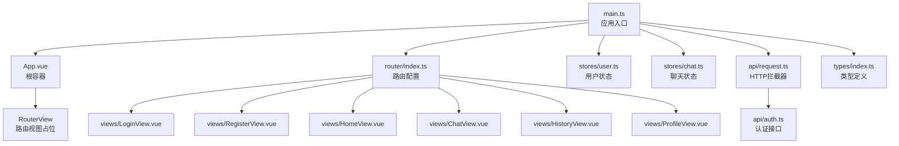
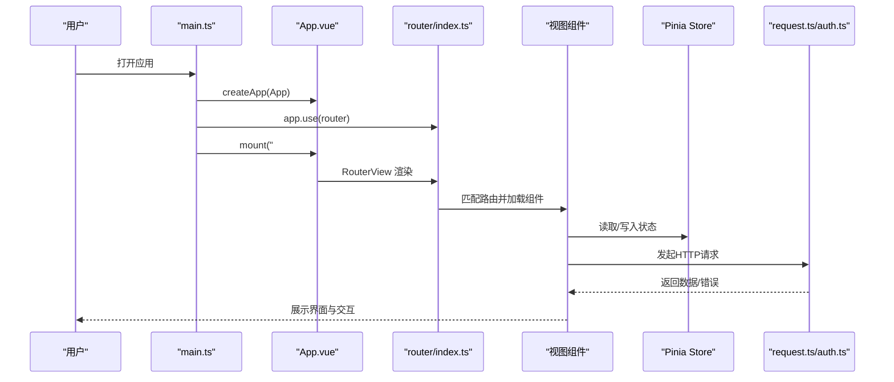
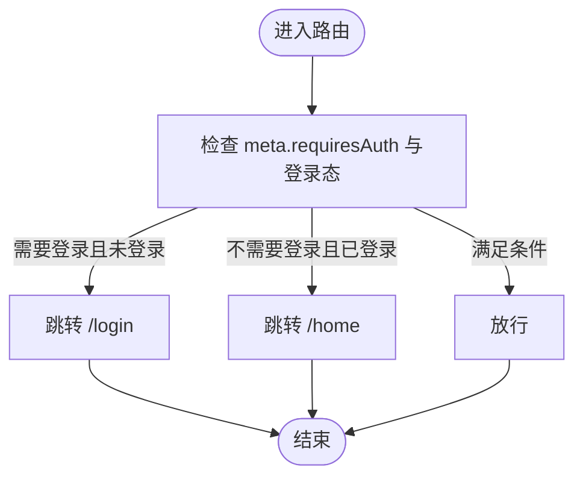
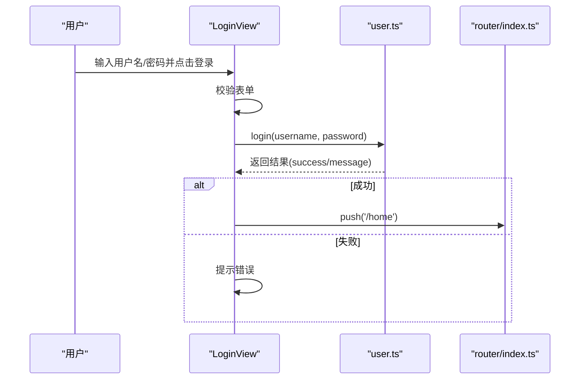
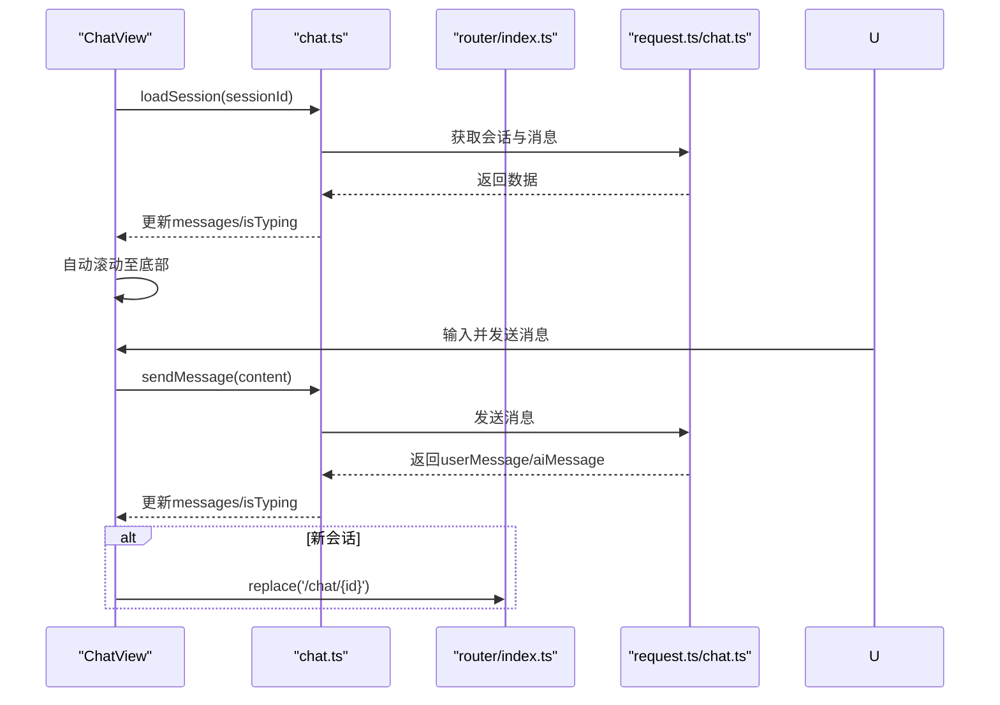
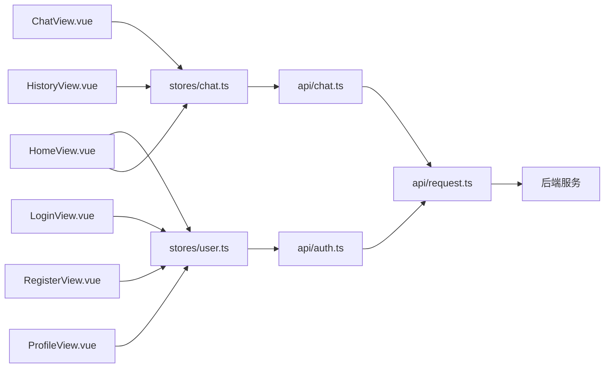

# 前端组件树

<cite>
**本文引用的文件**
- [frontend/src/App.vue](file://frontend/src/App.vue)
- [frontend/src/main.ts](file://frontend/src/main.ts)
- [frontend/src/router/index.ts](file://frontend/src/router/index.ts)
- [frontend/src/views/ChatView.vue](file://frontend/src/views/ChatView.vue)
- [frontend/src/views/LoginView.vue](file://frontend/src/views/LoginView.vue)
- [frontend/src/views/HomeView.vue](file://frontend/src/views/HomeView.vue)
- [frontend/src/views/RegisterView.vue](file://frontend/src/views/RegisterView.vue)
- [frontend/src/views/HistoryView.vue](file://frontend/src/views/HistoryView.vue)
- [frontend/src/views/ProfileView.vue](file://frontend/src/views/ProfileView.vue)
- [frontend/src/stores/user.ts](file://frontend/src/stores/user.ts)
- [frontend/src/stores/chat.ts](file://frontend/src/stores/chat.ts)
- [frontend/src/api/auth.ts](file://frontend/src/api/auth.ts)
- [frontend/src/api/request.ts](file://frontend/src/api/request.ts)
- [frontend/src/types/index.ts](file://frontend/src/types/index.ts)
</cite>

## 目录
1. [引言](#引言)
2. [项目结构](#项目结构)
3. [核心组件](#核心组件)
4. [架构总览](#架构总览)
5. [组件详解](#组件详解)
6. [依赖关系分析](#依赖关系分析)
7. [性能考量](#性能考量)
8. [故障排查指南](#故障排查指南)
9. [结论](#结论)
10. [附录](#附录)

## 引言
本文件面向MindMates前端团队，系统梳理基于Vue 3的视图组件树与UI布局设计，重点说明：
- App.vue作为根容器如何组织页面整体结构
- 各视图组件（ChatView、LoginView、HomeView、RegisterView、HistoryView、ProfileView）的职责划分与模板实现
- 组合式API使用方式（setup语法、响应式数据定义、生命周期钩子）
- 组件间导航关系与Vue Router的映射机制
- 面向开发者的组件开发规范建议（命名约定、样式隔离、可复用性设计、可访问性优化）

## 项目结构
前端采用模块化目录组织，核心入口为main.ts，应用挂载App.vue；路由集中配置在router/index.ts；视图组件位于views目录；状态管理使用Pinia Store；API封装在api目录；通用类型定义在types目录。

图表来源
- [frontend/src/main.ts](file://frontend/src/main.ts#L1-L23)
- [frontend/src/App.vue](file://frontend/src/App.vue#L1-L18)
- [frontend/src/router/index.ts](file://frontend/src/router/index.ts#L1-L70)
- [frontend/src/views/LoginView.vue](file://frontend/src/views/LoginView.vue#L1-L205)
- [frontend/src/views/RegisterView.vue](file://frontend/src/views/RegisterView.vue#L1-L229)
- [frontend/src/views/HomeView.vue](file://frontend/src/views/HomeView.vue#L1-L378)
- [frontend/src/views/ChatView.vue](file://frontend/src/views/ChatView.vue#L1-L412)
- [frontend/src/views/HistoryView.vue](file://frontend/src/views/HistoryView.vue#L1-L211)
- [frontend/src/views/ProfileView.vue](file://frontend/src/views/ProfileView.vue#L1-L386)
- [frontend/src/stores/user.ts](file://frontend/src/stores/user.ts#L1-L69)
- [frontend/src/stores/chat.ts](file://frontend/src/stores/chat.ts#L1-L140)
- [frontend/src/api/request.ts](file://frontend/src/api/request.ts#L1-L65)
- [frontend/src/api/auth.ts](file://frontend/src/api/auth.ts#L1-L25)
- [frontend/src/types/index.ts](file://frontend/src/types/index.ts#L1-L67)

章节来源
- [frontend/src/main.ts](file://frontend/src/main.ts#L1-L23)
- [frontend/src/router/index.ts](file://frontend/src/router/index.ts#L1-L70)

## 核心组件
- 根容器App.vue：仅包含一个RouterView，负责承载当前路由对应的视图组件，同时提供全局背景样式。
- 视图组件：LoginView、RegisterView、HomeView、ChatView、HistoryView、ProfileView分别承担登录、注册、首页、聊天、历史、个人中心功能。
- 状态管理：user.ts提供用户登录态、令牌、昵称显示等；chat.ts提供会话列表、消息列表、发送消息、删除会话等。
- 路由与导航：router/index.ts集中定义路由表与前置守卫，控制登录/登出流程与页面访问权限。
- API层：request.ts统一处理请求/响应拦截、鉴权头注入与错误提示；auth.ts封装认证相关接口。

章节来源
- [frontend/src/App.vue](file://frontend/src/App.vue#L1-L18)
- [frontend/src/stores/user.ts](file://frontend/src/stores/user.ts#L1-L69)
- [frontend/src/stores/chat.ts](file://frontend/src/stores/chat.ts#L1-L140)
- [frontend/src/router/index.ts](file://frontend/src/router/index.ts#L1-L70)
- [frontend/src/api/request.ts](file://frontend/src/api/request.ts#L1-L65)
- [frontend/src/api/auth.ts](file://frontend/src/api/auth.ts#L1-L25)

## 架构总览
下图展示从应用启动到视图渲染、状态管理与API交互的关键路径。

图表来源
- [frontend/src/main.ts](file://frontend/src/main.ts#L1-L23)
- [frontend/src/App.vue](file://frontend/src/App.vue#L1-L18)
- [frontend/src/router/index.ts](file://frontend/src/router/index.ts#L1-L70)
- [frontend/src/stores/user.ts](file://frontend/src/stores/user.ts#L1-L69)
- [frontend/src/stores/chat.ts](file://frontend/src/stores/chat.ts#L1-L140)
- [frontend/src/api/request.ts](file://frontend/src/api/request.ts#L1-L65)
- [frontend/src/api/auth.ts](file://frontend/src/api/auth.ts#L1-L25)

## 组件详解

### App.vue 根容器
- 结构：一个全局容器包裹RouterView，提供全屏背景渐变样式。
- 作用：作为所有路由视图的父级容器，确保页面整体布局一致。
- 样式：scoped作用域内定义容器高度与背景，适配视口单位与动态视口。

章节来源
- [frontend/src/App.vue](file://frontend/src/App.vue#L1-L18)

### 路由与导航（router/index.ts）
- 路由表：包含登录、注册、首页、聊天、历史、个人中心等页面；聊天支持带参数的会话详情页。
- 权限控制：beforeEach守卫根据meta.requiresAuth与用户登录态进行跳转控制。
- 导航守卫：未登录访问受保护页面跳转登录；已登录访问登录/注册页跳转首页。

图表来源
- [frontend/src/router/index.ts](file://frontend/src/router/index.ts#L56-L67)

章节来源
- [frontend/src/router/index.ts](file://frontend/src/router/index.ts#L1-L70)

### 登录视图（LoginView.vue）
- 组合式API：使用ref/reactive声明表单与加载状态；使用useRouter/useUserStore进行导航与状态管理。
- 表单校验：Element Plus表单规则与validate方法；回车键触发登录。
- 登录流程：调用userStore.login，成功后提示并跳转首页，失败提示错误信息。

图表来源
- [frontend/src/views/LoginView.vue](file://frontend/src/views/LoginView.vue#L1-L205)
- [frontend/src/stores/user.ts](file://frontend/src/stores/user.ts#L1-L69)
- [frontend/src/router/index.ts](file://frontend/src/router/index.ts#L1-L70)

章节来源
- [frontend/src/views/LoginView.vue](file://frontend/src/views/LoginView.vue#L1-L205)
- [frontend/src/stores/user.ts](file://frontend/src/stores/user.ts#L1-L69)

### 注册视图（RegisterView.vue）
- 组合式API：使用ref/reactive声明表单与加载状态；自定义密码一致性校验。
- 注册流程：调用userStore.register，成功后提示并跳转首页，失败提示错误信息。

章节来源
- [frontend/src/views/RegisterView.vue](file://frontend/src/views/RegisterView.vue#L1-L229)
- [frontend/src/stores/user.ts](file://frontend/src/stores/user.ts#L1-L69)

### 首页视图（HomeView.vue）
- 组合式API：onMounted中拉取会话列表；使用useRouter/useUserStore/useChatStore进行导航与状态管理。
- 功能入口：开始新对话、查看历史、进入个人中心；底部提供退出登录按钮。
- 最近对话：展示最近会话列表，支持点击进入对应会话。

章节来源
- [frontend/src/views/HomeView.vue](file://frontend/src/views/HomeView.vue#L1-L378)
- [frontend/src/stores/chat.ts](file://frontend/src/stores/chat.ts#L1-L140)
- [frontend/src/stores/user.ts](file://frontend/src/stores/user.ts#L1-L69)

### 聊天视图（ChatView.vue）
- 组合式API：使用ref/onMounted/watch/nextTick；useRoute/useRouter/useChatStore进行路由参数、导航与状态管理。
- 会话加载：根据路由参数加载指定会话，异常时提示并跳转聊天页。
- 消息交互：发送消息、自动滚动到底部、新会话更新URL、显示AI“正在输入”指示。
- 危机资源：检测消息标记并展示危机资源卡片。

图表来源
- [frontend/src/views/ChatView.vue](file://frontend/src/views/ChatView.vue#L1-L412)
- [frontend/src/stores/chat.ts](file://frontend/src/stores/chat.ts#L1-L140)
- [frontend/src/router/index.ts](file://frontend/src/router/index.ts#L1-L70)
- [frontend/src/api/request.ts](file://frontend/src/api/request.ts#L1-L65)

章节来源
- [frontend/src/views/ChatView.vue](file://frontend/src/views/ChatView.vue#L1-L412)
- [frontend/src/stores/chat.ts](file://frontend/src/stores/chat.ts#L1-L140)

### 历史视图（HistoryView.vue）
- 组合式API：onMounted中拉取会话列表；使用useChatStore进行状态管理；ElMessageBox/ElMessage进行交互与提示。
- 功能：展示会话列表、格式化时间、删除会话、返回首页。

章节来源
- [frontend/src/views/HistoryView.vue](file://frontend/src/views/HistoryView.vue#L1-L211)
- [frontend/src/stores/chat.ts](file://frontend/src/stores/chat.ts#L1-L140)

### 个人中心（ProfileView.vue）
- 组合式API：使用ref/reactive/computed声明表单与编辑模式；useUserStore/authApi进行资料更新与密码修改。
- 功能：展示与编辑昵称/邮箱、修改密码、退出登录。

章节来源
- [frontend/src/views/ProfileView.vue](file://frontend/src/views/ProfileView.vue#L1-L386)
- [frontend/src/stores/user.ts](file://frontend/src/stores/user.ts#L1-L69)
- [frontend/src/api/auth.ts](file://frontend/src/api/auth.ts#L1-L25)

## 依赖关系分析
- 组件耦合：各视图组件通过useRouter/useUserStore/useChatStore与路由与状态解耦；API层通过request.ts统一处理。
- 数据流：视图组件读取store中的响应式数据，触发store方法更新，store通过api层与后端交互。
- 路由守卫：router/index.ts对requiresAuth进行统一校验，避免在各组件重复逻辑。

图表来源
- [frontend/src/views/LoginView.vue](file://frontend/src/views/LoginView.vue#L1-L205)
- [frontend/src/views/RegisterView.vue](file://frontend/src/views/RegisterView.vue#L1-L229)
- [frontend/src/views/HomeView.vue](file://frontend/src/views/HomeView.vue#L1-L378)
- [frontend/src/views/ChatView.vue](file://frontend/src/views/ChatView.vue#L1-L412)
- [frontend/src/views/HistoryView.vue](file://frontend/src/views/HistoryView.vue#L1-L211)
- [frontend/src/views/ProfileView.vue](file://frontend/src/views/ProfileView.vue#L1-L386)
- [frontend/src/stores/user.ts](file://frontend/src/stores/user.ts#L1-L69)
- [frontend/src/stores/chat.ts](file://frontend/src/stores/chat.ts#L1-L140)
- [frontend/src/api/auth.ts](file://frontend/src/api/auth.ts#L1-L25)
- [frontend/src/api/request.ts](file://frontend/src/api/request.ts#L1-L65)

章节来源
- [frontend/src/stores/user.ts](file://frontend/src/stores/user.ts#L1-L69)
- [frontend/src/stores/chat.ts](file://frontend/src/stores/chat.ts#L1-L140)
- [frontend/src/api/request.ts](file://frontend/src/api/request.ts#L1-L65)
- [frontend/src/router/index.ts](file://frontend/src/router/index.ts#L1-L70)

## 性能考量
- 路由懒加载：router/index.ts中对视图组件采用动态导入，减少首屏体积。
- 列表渲染：聊天与历史视图使用v-for渲染列表，注意key的稳定性与数据结构不可变更新。
- 滚动优化：ChatView在消息数量变化后使用nextTick滚动到底部，避免重复计算。
- 状态粒度：store按功能拆分（user/chat），避免单一store过大导致频繁重渲染。
- 请求拦截：request.ts统一处理超时、鉴权失效与错误提示，减少重复逻辑。

章节来源
- [frontend/src/router/index.ts](file://frontend/src/router/index.ts#L1-L70)
- [frontend/src/views/ChatView.vue](file://frontend/src/views/ChatView.vue#L1-L412)
- [frontend/src/stores/user.ts](file://frontend/src/stores/user.ts#L1-L69)
- [frontend/src/stores/chat.ts](file://frontend/src/stores/chat.ts#L1-L140)
- [frontend/src/api/request.ts](file://frontend/src/api/request.ts#L1-L65)

## 故障排查指南
- 登录/注册失败：检查auth.ts接口返回与request.ts响应拦截器错误分支，确认message字段与状态码。
- 会话加载失败：ChatView在onMounted中捕获异常并提示，随后跳转聊天页；检查sessionId参数与后端接口。
- 401未授权：request.ts在响应拦截器中检测401并强制登出，检查本地token与后端签发策略。
- 路由跳转异常：确认router/index.ts守卫逻辑与meta.requiresAuth配置，避免循环跳转。

章节来源
- [frontend/src/views/LoginView.vue](file://frontend/src/views/LoginView.vue#L1-L205)
- [frontend/src/views/ChatView.vue](file://frontend/src/views/ChatView.vue#L1-L412)
- [frontend/src/api/request.ts](file://frontend/src/api/request.ts#L1-L65)
- [frontend/src/router/index.ts](file://frontend/src/router/index.ts#L56-L67)

## 结论
MindMates前端以App.vue为根容器，配合Vue Router实现清晰的页面导航与权限控制；各视图组件通过组合式API与Pinia Store实现职责分离与状态共享；API层以Axios拦截器统一处理鉴权与错误提示。整体架构具备良好的可维护性与扩展性，适合后续新增页面与功能模块。

## 附录

### 组件开发规范建议
- 命名约定
  - 组件文件：PascalCase命名（如ChatView.vue），导出默认组件。
  - Store：useXxx命名（如useUserStore、useChatStore），返回对象包含状态与方法。
  - 类型：统一在types/index.ts中定义，避免分散。
- 样式隔离
  - 使用scoped样式，避免全局污染；深层样式穿透使用:deep(...)。
  - 语义化类名，便于主题切换与维护。
- 可复用性设计
  - 将通用UI片段抽象为可复用组件（如按钮、卡片、对话框）。
  - 将通用逻辑抽离为composables（如useAuth、useChat）。
- 可访问性优化
  - 为交互元素提供明确的label与aria-label。
  - 控制键盘焦点顺序，保证Tab键可顺畅导航。
  - 为图片与图标提供替代文本，避免纯装饰元素丢失语义。
- 错误处理
  - 在API层统一处理错误提示与重定向，避免在视图中重复判断。
  - 对用户操作反馈使用ElMessage/ElMessageBox，保持一致的交互体验。